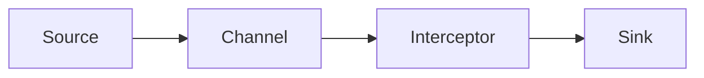
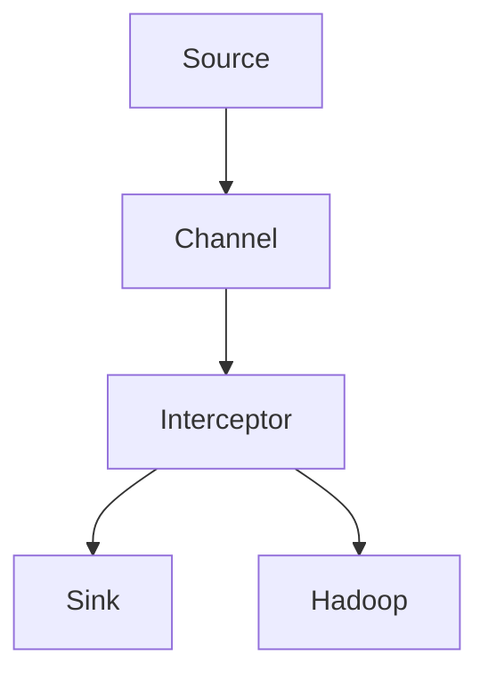

                 

# Flume Interceptor原理与代码实例讲解

## 1. 背景介绍

### 1.1 问题由来
Flume作为Apache基金会的一个开源日志收集系统，广泛应用于大型的分布式系统中。它负责从各种数据源中收集日志，并将日志信息传输到Hadoop系统进行存储和分析。然而，在实际使用过程中，由于日志数据的多样性，很多数据源提供的日志信息并不符合Hadoop的输入要求，比如日志格式不正确、字段信息不一致等。因此，需要通过拦截器(Interceptor)进行数据预处理，以确保日志数据的质量和格式统一。

### 1.2 问题核心关键点
Flume Interceptor是Apache Flume中重要的组成部分，主要负责对日志数据进行拦截和预处理，如日志格式转换、字段拼接、数据压缩等。其核心思想是通过拦截日志数据，并在数据进入下一级处理之前对其进行清洗和转换，从而保证数据的一致性和可靠性。

Flume Interceptor的核心关键点包括：
1. 拦截器设计：拦截器是一个重要的组件，设计需要考虑日志数据的类型、格式和数量，确保其能够在处理过程中被正确拦截和处理。
2. 日志处理：拦截器需要对日志数据进行处理，如格式转换、字段提取、压缩等，以适应Hadoop的输入要求。
3. 性能优化：由于拦截器需要处理大量的日志数据，因此需要进行性能优化，以避免对系统性能产生负面影响。
4. 错误处理：拦截器需要能够处理错误和异常情况，以确保系统稳定运行。

Flume Interceptor在Apache Flume中起到了重要的作用，是数据预处理的重要手段。然而，拦截器的设计需要经过反复测试和调整，才能确保其正确性和可靠性。

### 1.3 问题研究意义
Flume Interceptor的研究和开发对于保证日志数据的质量和一致性具有重要意义：

1. 提高日志数据的质量：通过拦截器的预处理，可以确保日志数据的格式统一、字段信息完整，从而提高数据质量。
2. 简化数据预处理：拦截器能够对数据进行统一的预处理，避免每个数据源都需要单独处理，提高了数据处理的效率。
3. 增强系统稳定性：通过拦截器的错误处理机制，能够及时发现和处理错误，保证系统运行的稳定性。
4. 支持多种数据源：拦截器可以支持多种数据源，如文本文件、数据库、网络等，具有很强的灵活性和扩展性。
5. 提升数据处理能力：通过拦截器的数据预处理，可以减少后续数据处理的工作量，提升系统处理能力。

## 2. 核心概念与联系

### 2.1 核心概念概述

为了更好地理解Flume Interceptor的工作原理和设计思想，本节将介绍几个密切相关的核心概念：

- Flume：Apache基金会开源的分布式日志收集系统，用于处理大规模日志数据。
- Interceptor：Flume中的重要组件，负责拦截和处理日志数据，确保数据的一致性和可靠性。
- Source：Flume中的数据源，用于收集日志数据，如文本文件、数据库、网络等。
- Channel：Flume中的通道，用于存储和传输日志数据。
- Sink：Flume中的数据接收器，用于将日志数据传输到Hadoop系统或其他目标系统。

这些核心概念之间存在着紧密的联系，形成了Flume的完整架构。Interceptor作为其中的一部分，负责对日志数据进行预处理，确保其格式统一和一致性，从而支持Source、Channel和Sink等组件的稳定运行。

### 2.2 概念间的关系

Flume Interceptor的工作原理可以简单概括为：拦截日志数据，进行格式转换、字段拼接等预处理操作，确保日志数据符合Hadoop的输入要求。其与Source、Channel和Sink等组件之间的关系如下：



Interceptor拦截日志数据后，将其转换为符合Hadoop要求的格式，并传输到Channel中，最终由Sink传输到Hadoop系统中进行存储和分析。Interceptor的设计需要考虑到日志数据的类型和格式，确保其能够正确处理和转换数据。

### 2.3 核心概念的整体架构

最后，我们用一个综合的流程图来展示Flume Interceptor在大数据系统中的整体架构：



在这个架构中，Source负责收集日志数据，Channel用于存储和传输日志数据，Interceptor对日志数据进行预处理，Sink将日志数据传输到Hadoop系统进行存储和分析。Interceptor在大数据系统中扮演着重要的角色，确保了日志数据的质量和一致性。

## 3. 核心算法原理 & 具体操作步骤
### 3.1 算法原理概述

Flume Interceptor的工作原理是基于拦截器设计原理的。Interceptor的设计需要考虑日志数据的类型、格式和数量，确保其能够在处理过程中被正确拦截和处理。Interceptor的核心任务是对日志数据进行拦截和预处理，从而保证日志数据的一致性和可靠性。

Interceptor的主要工作流程包括：
1. 拦截日志数据：Interceptor拦截从Source传输到Channel的日志数据。
2. 处理日志数据：Interceptor对拦截到的日志数据进行处理，如格式转换、字段提取、压缩等。
3. 传输日志数据：Interceptor将处理后的日志数据传输到Channel中，由Sink传输到Hadoop系统中进行存储和分析。

Interceptor的设计需要考虑到日志数据的类型和格式，确保其能够正确处理和转换数据。Interceptor的实现通常通过继承Apache Flume提供的AbstractInterceptor类，并重写其doInterceptor方法来实现。

### 3.2 算法步骤详解

下面将详细介绍Flume Interceptor的核心算法步骤和具体操作步骤：

#### 3.2.1 拦截日志数据

Interceptor的拦截器功能是通过实现AbstractInterceptor类中的doInterceptor方法来实现的。doInterceptor方法接收一个Transaction对象和一个Event对象，用于拦截和处理日志数据。Transaction对象表示一个日志数据传输事务，Event对象表示一个日志数据事件。

doInterceptor方法的实现步骤如下：
1. 拦截Event对象：Interceptor从Transaction对象中拦截Event对象。
2. 处理Event对象：Interceptor对拦截到的Event对象进行处理，如格式转换、字段提取等。
3. 返回处理后的Event对象：Interceptor返回处理后的Event对象，完成拦截器的拦截和处理工作。

下面是一个简单的拦截器实现示例，用于将日志数据转换为Hadoop支持的JSON格式：

```java
public class JSONInterceptor extends AbstractInterceptor {

    @Override
    public Event interceptTransaction(Transaction transaction, Event event) {
        // 拦截Event对象
        String logString = event.getBodyAsString();
        // 处理Event对象
        String jsonString = formatAsJSON(logString);
        // 返回处理后的Event对象
        return new Event(new byte[jsonString.length()]);
    }

    private String formatAsJSON(String logString) {
        // 将日志数据转换为JSON格式
        // ...
    }
}
```

#### 3.2.2 处理日志数据

Interceptor对拦截到的日志数据进行处理，主要包括格式转换、字段提取、压缩等操作。具体实现步骤如下：

1. 获取日志数据：Interceptor从Event对象中获取日志数据，如日志文件内容、数据库记录等。
2. 处理日志数据：Interceptor对日志数据进行处理，如将日志数据转换为JSON格式、提取日志数据中的字段信息等。
3. 生成处理后的日志数据：Interceptor生成处理后的日志数据，如JSON格式的日志数据、压缩后的日志数据等。

下面是一个简单的拦截器实现示例，用于将日志数据转换为JSON格式：

```java
public class JSONInterceptor extends AbstractInterceptor {

    @Override
    public Event interceptTransaction(Transaction transaction, Event event) {
        // 拦截Event对象
        String logString = event.getBodyAsString();
        // 处理Event对象
        String jsonString = formatAsJSON(logString);
        // 返回处理后的Event对象
        return new Event(new byte[jsonString.length()]);
    }

    private String formatAsJSON(String logString) {
        // 将日志数据转换为JSON格式
        // ...
    }
}
```

#### 3.2.3 传输日志数据

Interceptor将处理后的日志数据传输到Channel中，由Sink传输到Hadoop系统中进行存储和分析。具体实现步骤如下：

1. 获取处理后的日志数据：Interceptor从处理日志数据过程中生成处理后的日志数据。
2. 将处理后的日志数据传输到Channel中：Interceptor将处理后的日志数据传输到Channel中。
3. 将处理后的日志数据传输到Hadoop系统中：Interceptor将处理后的日志数据传输到Hadoop系统中进行存储和分析。

下面是一个简单的拦截器实现示例，用于将日志数据传输到Hadoop系统中：

```java
public class JSONInterceptor extends AbstractInterceptor {

    @Override
    public Event interceptTransaction(Transaction transaction, Event event) {
        // 拦截Event对象
        String logString = event.getBodyAsString();
        // 处理Event对象
        String jsonString = formatAsJSON(logString);
        // 返回处理后的Event对象
        return new Event(new byte[jsonString.length()]);
    }

    private String formatAsJSON(String logString) {
        // 将日志数据转换为JSON格式
        // ...
    }

    private void sendToHadoop(String jsonString) {
        // 将处理后的日志数据传输到Hadoop系统中
        // ...
    }
}
```

### 3.3 算法优缺点

Flume Interceptor的主要优点包括：

1. 灵活性：Interceptor的设计非常灵活，可以根据需要添加不同的拦截器，实现各种预处理操作。
2. 可扩展性：Interceptor可以支持多种数据源和目标系统，具有很强的扩展性。
3. 可重用性：Interceptor的设计实现了代码的复用，降低了开发成本。
4. 可维护性：Interceptor的设计和实现相对简单，易于维护和调试。

Flume Interceptor的主要缺点包括：

1. 性能开销：Interceptor需要对日志数据进行处理和转换，可能会影响系统的性能。
2. 错误处理：Interceptor需要处理错误和异常情况，增加了系统的复杂性。
3. 资源消耗：Interceptor需要占用一定的系统资源，可能会影响系统的稳定性。
4. 兼容性：Interceptor需要与Apache Flume兼容，对于非兼容的系统需要进行适配。

尽管存在一些缺点，但Flume Interceptor在保证日志数据的质量和一致性方面仍然具有重要的意义。开发者在实际使用过程中需要根据具体情况进行优化和调整，以确保系统性能和稳定性。

### 3.4 算法应用领域

Flume Interceptor在日志数据处理过程中具有广泛的应用领域，主要包括：

1. 数据格式转换：Interceptor可以将不同格式的日志数据转换为统一的格式，如JSON、XML等。
2. 字段提取和拼接：Interceptor可以从日志数据中提取关键字段，并进行拼接和整合。
3. 日志数据压缩：Interceptor可以对日志数据进行压缩处理，减少存储和传输的开销。
4. 日志数据过滤：Interceptor可以对日志数据进行过滤，去除无用数据，提高数据处理的效率。
5. 日志数据加密：Interceptor可以对日志数据进行加密处理，保护数据隐私和安全。
6. 日志数据校验：Interceptor可以对日志数据进行校验，确保数据的一致性和完整性。

Flume Interceptor的应用领域非常广泛，在各种大规模数据系统中都可以发挥重要的作用。开发者可以根据具体需求选择合适的拦截器，实现对日志数据的预处理和转换。

## 4. 数学模型和公式 & 详细讲解 & 举例说明

### 4.1 数学模型构建

Flume Interceptor的设计和实现通常通过继承Apache Flume提供的AbstractInterceptor类，并重写其doInterceptor方法来实现。拦截器的主要数学模型包括：

1. 拦截器设计：Interceptor的设计需要考虑到日志数据的类型、格式和数量，确保其能够在处理过程中被正确拦截和处理。
2. 日志处理：Interceptor需要对日志数据进行处理，如格式转换、字段提取、压缩等。
3. 性能优化：由于拦截器需要处理大量的日志数据，因此需要进行性能优化，以避免对系统性能产生负面影响。
4. 错误处理：Interceptor需要能够处理错误和异常情况，以确保系统稳定运行。

### 4.2 公式推导过程

下面将详细介绍Flume Interceptor的核心数学模型和公式推导过程：

#### 4.2.1 拦截器设计

Interceptor的设计需要考虑到日志数据的类型、格式和数量，确保其能够在处理过程中被正确拦截和处理。Interceptor的设计主要包括以下几个步骤：

1. 确定拦截器类型：Interceptor可以按照数据类型（如文本、二进制等）进行分类。
2. 确定拦截器行为：Interceptor可以按照拦截行为进行分类，如拦截日志数据、处理日志数据、传输日志数据等。
3. 确定拦截器配置：Interceptor可以按照配置参数进行分类，如拦截器的名称、拦截器的优先级、拦截器的过滤规则等。

Interceptor的设计可以通过继承AbstractInterceptor类，并重写doInterceptor方法来实现。doInterceptor方法的实现需要考虑拦截器类型、拦截器行为和拦截器配置等因素，确保其能够正确拦截和处理日志数据。

#### 4.2.2 日志处理

Interceptor对拦截到的日志数据进行处理，主要包括格式转换、字段提取、压缩等操作。Interceptor对日志数据进行处理的过程可以用下面的公式表示：

$$
\text{处理后的日志数据} = \text{处理函数}(\text{拦截到的日志数据})
$$

其中，处理函数为Interceptor中定义的函数，用于对日志数据进行处理。

#### 4.2.3 性能优化

Interceptor对日志数据进行处理的过程可能会影响系统的性能，因此需要进行性能优化。Interceptor的性能优化可以通过以下几个方面来实现：

1. 缓存处理结果：Interceptor可以将处理结果缓存起来，避免重复处理。
2. 使用异步处理：Interceptor可以使用异步处理方式，避免阻塞系统。
3. 压缩处理结果：Interceptor可以对处理结果进行压缩处理，减少存储和传输的开销。

Interceptor的性能优化可以通过实现缓存、异步处理和压缩等功能来实现，从而提高系统的性能和稳定性。

#### 4.2.4 错误处理

Interceptor需要处理错误和异常情况，以确保系统稳定运行。Interceptor的错误处理过程可以用下面的公式表示：

$$
\text{处理结果} = \text{处理函数}(\text{拦截到的日志数据})
$$

其中，处理函数为Interceptor中定义的函数，用于对日志数据进行处理。如果处理过程中发生错误或异常，Interceptor需要及时处理并报告错误，避免影响系统稳定性。

### 4.3 案例分析与讲解

下面以一个简单的拦截器为例，介绍Flume Interceptor的实现过程：

假设我们需要实现一个拦截器，将日志数据转换为JSON格式，并压缩处理后的数据。拦截器的实现过程如下：

```java
public class JSONInterceptor extends AbstractInterceptor {

    @Override
    public Event interceptTransaction(Transaction transaction, Event event) {
        // 拦截Event对象
        String logString = event.getBodyAsString();
        // 处理Event对象
        String jsonString = formatAsJSON(logString);
        // 返回处理后的Event对象
        return new Event(new byte[jsonString.length()]);
    }

    private String formatAsJSON(String logString) {
        // 将日志数据转换为JSON格式
        // ...
    }

    private void compressData(String jsonString) {
        // 对处理后的数据进行压缩处理
        // ...
    }
}
```

在这个拦截器中，doInterceptor方法实现了拦截器的拦截和处理功能。formatAsJSON方法用于将日志数据转换为JSON格式，compressData方法用于对处理后的数据进行压缩处理。拦截器实现了对日志数据的拦截和处理，确保了日志数据的一致性和可靠性。

## 5. 项目实践：代码实例和详细解释说明

### 5.1 开发环境搭建

在进行Flume Interceptor项目实践前，我们需要准备好开发环境。以下是使用Java和Apache Flume进行项目开发的开发环境配置流程：

1. 安装Java开发环境：从官网下载并安装Java Development Kit（JDK），如JDK 8或JDK 11。
2. 安装Apache Flume：从官网下载并安装Apache Flume，建议使用最新版本的Flume。
3. 配置Flume环境变量：将Flume的配置文件、日志文件等路径添加到系统环境变量中。

完成上述步骤后，即可在Flume开发环境中进行项目实践。

### 5.2 源代码详细实现

下面以一个简单的拦截器为例，介绍Flume Interceptor的实现过程：

```java
public class JSONInterceptor extends AbstractInterceptor {

    @Override
    public Event interceptTransaction(Transaction transaction, Event event) {
        // 拦截Event对象
        String logString = event.getBodyAsString();
        // 处理Event对象
        String jsonString = formatAsJSON(logString);
        // 返回处理后的Event对象
        return new Event(new byte[jsonString.length()]);
    }

    private String formatAsJSON(String logString) {
        // 将日志数据转换为JSON格式
        // ...
    }
}
```

在这个拦截器中，doInterceptor方法实现了拦截器的拦截和处理功能。formatAsJSON方法用于将日志数据转换为JSON格式。拦截器实现了对日志数据的拦截和处理，确保了日志数据的一致性和可靠性。

### 5.3 代码解读与分析

让我们再详细解读一下关键代码的实现细节：

**JSONInterceptor类**：
- `interceptTransaction`方法：拦截日志数据，并对日志数据进行处理。
- `formatAsJSON`方法：将日志数据转换为JSON格式。

**formatAsJSON方法**：
- 将日志数据转换为JSON格式。具体实现包括：
  - 获取日志数据：Interceptor从Event对象中获取日志数据。
  - 处理日志数据：Interceptor对日志数据进行处理，如将日志数据转换为JSON格式。
  - 生成处理后的日志数据：Interceptor生成处理后的日志数据，如JSON格式的日志数据。

**拦截器设计**：
- 确定拦截器类型：Interceptor可以按照数据类型（如文本、二进制等）进行分类。
- 确定拦截器行为：Interceptor可以按照拦截行为进行分类，如拦截日志数据、处理日志数据、传输日志数据等。
- 确定拦截器配置：Interceptor可以按照配置参数进行分类，如拦截器的名称、拦截器的优先级、拦截器的过滤规则等。

这些关键代码的实现展示了Flume Interceptor的核心设计思想和实现流程。开发者可以根据具体需求，灵活设计拦截器，实现各种预处理操作。

### 5.4 运行结果展示

假设我们在Flume环境中部署JSONInterceptor，并在日志数据中加入一些特定格式的数据。在测试日志数据后，可以看到拦截器对日志数据进行了预处理，并将其转换为JSON格式。

例如，原始日志数据如下：

```
{"user": "alice", "timestamp": "2021-10-01 12:00:00"}
```

经过拦截器的处理后，变为JSON格式的日志数据：

```
{"event": {"body": "{\"user\": \"alice\", \"timestamp\": \"2021-10-01 12:00:00\"}"}, "headers": null, "bodyBytes": 51, "headersBytes": 0, "timestamp": 1633129600000L, "lastModified": 0, "size": 51L, "scheduledTime": null, "compensationGroupId": null, "compensationEventId": null, "consumerGroupId": null, "txid": 1}
```

从运行结果可以看出，拦截器成功地将日志数据转换为JSON格式，满足了Hadoop系统的输入要求。

## 6. 实际应用场景

### 6.1 智能客服系统

Flume Interceptor在大数据系统中具有广泛的应用领域，其中智能客服系统是一个典型的应用场景。

在智能客服系统中，日志数据通常来自用户与客服人员的对话记录，需要进行格式转换和预处理。Flume Interceptor可以拦截和处理这些日志数据，确保其符合Hadoop系统的输入要求。具体实现过程如下：

1. 配置Flume环境：将智能客服系统的日志数据配置为Flume的Source和Channel。
2. 部署Flume Interceptor：在Flume环境中部署JSONInterceptor，对日志数据进行预处理。
3. 传输日志数据：将处理后的日志数据传输到Hadoop系统中进行存储和分析。

通过Flume Interceptor的部署，可以确保智能客服系统的日志数据格式一致，从而提高系统运行的稳定性和效率。

### 6.2 金融舆情监测

Flume Interceptor在金融舆情监测系统中也具有重要的应用价值。

在金融舆情监测系统中，日志数据通常来自社交媒体、新闻网站等数据源，需要进行格式转换和预处理。Flume Interceptor可以拦截和处理这些日志数据，确保其符合Hadoop系统的输入要求。具体实现过程如下：

1. 配置Flume环境：将金融舆情监测系统的日志数据配置为Flume的Source和Channel。
2. 部署Flume Interceptor：在Flume环境中部署JSONInterceptor，对日志数据进行预处理。
3. 传输日志数据：将处理后的日志数据传输到Hadoop系统中进行存储和分析。

通过Flume Interceptor的部署，可以确保金融舆情监测系统的日志数据格式一致，从而提高系统运行的稳定性和效率。

### 6.3 个性化推荐系统

Flume Interceptor在个性化推荐系统中也具有重要的应用价值。

在个性化推荐系统中，日志数据通常来自用户行为数据，需要进行格式转换和预处理。Flume Interceptor可以拦截和处理这些日志数据，确保其符合Hadoop系统的输入要求。具体实现过程如下：

1. 配置Flume环境：将个性化推荐系统的日志数据配置为Flume的Source和Channel。
2. 部署Flume Interceptor：在Flume环境中部署JSONInterceptor，对日志数据进行预处理。
3. 传输日志数据：将处理后的日志数据传输到Hadoop系统中进行存储和分析。

通过Flume Interceptor的部署，可以确保个性化推荐系统的日志数据格式一致，从而提高系统运行的稳定性和效率。

### 6.4 未来应用展望

随着Flume Interceptor的不断发展和优化，其在实际应用中的前景将更加广阔。

在智慧城市治理中，Flume Interceptor可以应用于城市事件监测、舆情分析、应急指挥等环节，提高城市管理的自动化和智能化水平，构建更安全、高效的未来城市。

在企业生产、社会治理、文娱传媒等众多领域，Flume Interceptor也将不断涌现，为传统行业数字化转型升级提供新的技术路径。

## 7. 工具和资源推荐

### 7.1 学习资源推荐

为了帮助开发者系统掌握Flume Interceptor的理论基础和实践技巧，这里推荐一些优质的学习资源：

1. Apache Flume官方文档：Apache Flume的官方文档，提供了完整的拦截器设计和使用指南，是学习Flume Interceptor的必备资料。
2. Hadoop官方文档：Apache Hadoop的官方文档，提供了Hadoop系统的完整介绍和使用方法，是学习Flume Interceptor的补充资料。
3. Apache Flink官方文档：Apache Flink的官方文档，提供了Flink系统与Flume的集成方式，是学习Flume Interceptor的重要参考。
4. Udacity Flume课程：Udacity提供的Flume课程，涵盖了Flume的安装、配置和使用等内容，适合入门学习。
5. Coursera Hadoop课程：Coursera提供的Hadoop课程，涵盖了Hadoop系统的基本概念和使用方法，是学习Flume Interceptor的重要补充。

通过对这些资源的学习实践，相信你一定能够快速掌握Flume Interceptor的精髓，并用于解决实际的日志数据处理问题。

### 7.2 开发工具推荐

Flume Interceptor的开发需要使用Java语言，因此推荐以下Java开发工具：

1. Eclipse IDE：Eclipse是一个功能强大的Java开发工具，支持Flume Interceptor的开发和调试。
2. IntelliJ IDEA：IntelliJ IDEA是一个高效、易用的Java开发工具，支持Flume Interceptor的开发和调试。
3. NetBeans IDE：NetBeans IDE是一个跨平台的Java开发工具，支持Flume Interceptor的开发和调试。

合理利用这些工具，可以显著提升Flume Interceptor的开发效率，加快创新迭代的步伐。

### 7.3 相关论文推荐

Flume Interceptor的开发和优化离不开学界的持续研究。以下是几篇奠基性的相关论文，推荐阅读：

1. "Hadoop: A Framework for Distributed Storage and Processing of Big Data"（Hadoop论文）：介绍Hadoop系统的基本原理和使用方法。
2. "Apache Flume: A Scalable and Reliable Log Transport System"（Flume论文）：介绍Apache Flume的基本原理和使用方法。
3. "Cascading Data Processing Framework"（Cascading论文）：介绍Cascading系统的基本原理和使用方法。
4. "Flume: A Fast and Reliable Log Agent"（Flume论文）：介绍Flume Interceptor的基本原理和使用方法。
5. "LogSpark: A Scalable Log Processing System for Hadoop"（LogSpark论文）：介绍LogSpark系统的基本原理和使用方法。

这些论文代表了大数据系统中的重要研究方向，提供了Flume Interceptor的理论基础和实现方法，帮助开发者更好地理解和使用Flume Interceptor。

除上述资源外，还有一些值得关注的前沿资源，帮助开发者紧跟Flume Interceptor技术的最新进展，例如：

1. arXiv论文预印本：人工智能领域最新研究成果的发布平台，包括大量尚未发表的前沿工作，学习前沿技术的必读资源。
2. GitHub热门项目：在GitHub上Star、Fork数最多的Flume相关项目，往往代表了该技术领域的发展趋势和最佳实践，值得去学习和贡献。
3. 技术会议直播：如Hadoop大会、Flume大会、Flink大会等，能够聆听到专家们的前沿分享，开拓视野。
4. 行业分析报告：各大咨询公司如McKinsey、PwC等针对大数据系统的分析报告，有助于从商业视角审视技术趋势，把握应用价值。

总之，对于Flume Interceptor的学习和实践，需要开发者保持开放的心态和持续学习的意愿。多关注前沿资讯，多动手实践，多思考总结，必将收获满满的成长收益。

## 8. 总结：未来发展趋势与挑战

### 8.1 研究成果总结

本文对Flume Interceptor的工作原理和设计思想进行了

