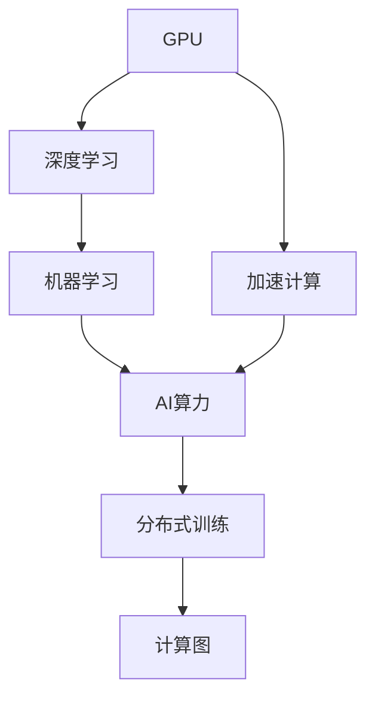
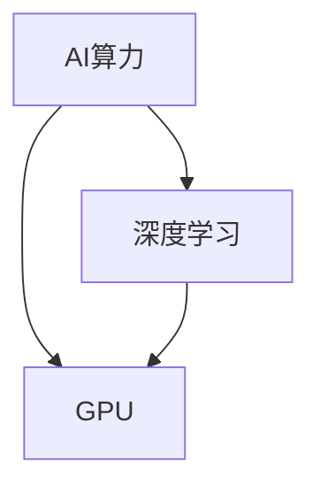
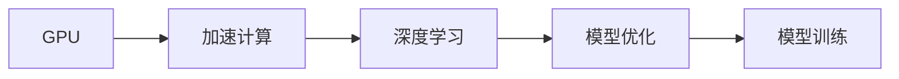
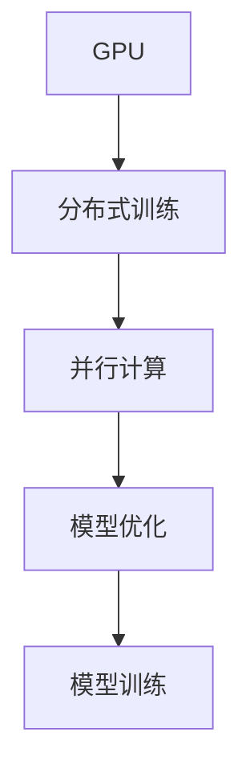
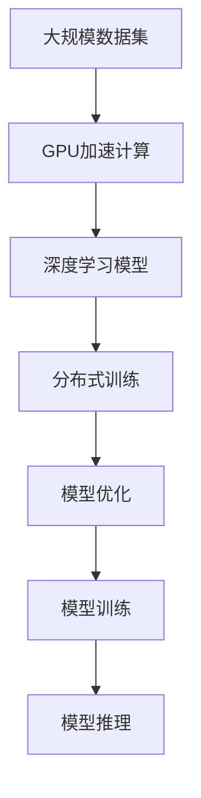

                 

# GPU在AI算力中的作用

> 关键词：GPU, AI算力,深度学习,机器学习,加速计算,计算图,分布式训练

## 1. 背景介绍

### 1.1 问题由来

随着深度学习和大数据技术的迅猛发展，人工智能（AI）算力需求日益增长。AI的训练和推理任务涉及大量复杂计算，需要强大的计算能力。传统的通用中央处理器（CPU）在处理并行计算任务时效率较低，而图形处理单元（GPU）则因其并行计算能力而备受青睐。

GPU的并行处理能力源于其强大的SIMD架构，能够同时处理多个数据点。这对于矩阵运算、向量计算等任务极为高效。如今，GPU在深度学习、机器学习、自然语言处理等领域的应用已经非常广泛。

### 1.2 问题核心关键点

GPU在AI算力中的作用主要体现在以下几个方面：

- 并行计算能力：GPU可以同时处理多个数据点，加快计算速度。
- 优化计算图：GPU对计算图的优化能力可以显著提升训练效率。
- 分布式训练：GPU可以支持多节点分布式训练，提高训练速度和模型性能。
- 兼容深度学习框架：主流深度学习框架如TensorFlow、PyTorch等均支持GPU加速。

### 1.3 问题研究意义

理解GPU在AI算力中的作用，对于优化AI计算流程、提升模型训练效率、降低计算成本具有重要意义。GPU的广泛应用，推动了深度学习技术从实验室走向实际应用，加速了AI技术的产业化进程。

## 2. 核心概念与联系

### 2.1 核心概念概述

为了更好地理解GPU在AI算力中的作用，本节将介绍几个密切相关的核心概念：

- GPU（图形处理单元）：一种由NVIDIA、AMD等公司开发的专门用于加速图形和并行计算的硬件单元。
- AI算力：指AI模型训练和推理所需计算资源的综合能力，包括计算速度、内存带宽、存储容量等。
- 深度学习：一类基于神经网络模型的人工智能技术，通过多层次的非线性变换，实现复杂数据的建模和预测。
- 机器学习：使计算机通过数据训练，自动学习和优化算法，从而提升模型性能。
- 加速计算：使用GPU等硬件加速技术，提升深度学习模型的训练和推理速度。
- 分布式训练：利用多台GPU设备同时进行模型训练，提升训练速度和效率。
- 计算图：深度学习框架中，模型计算过程的抽象表示，通常由节点（操作）和边（数据流）组成。

这些核心概念之间的逻辑关系可以通过以下Mermaid流程图来展示：



这个流程图展示了一些核心概念及其之间的关系：

1. GPU通过加速计算提升深度学习的速度。
2. 深度学习和机器学习是GPU加速的主要应用领域。
3. AI算力是计算资源的综合体现，涉及GPU加速计算。
4. 分布式训练利用GPU进行并行计算，提升训练效率。
5. 计算图是深度学习模型的核心，通过GPU优化加速。

### 2.2 概念间的关系

这些核心概念之间存在着紧密的联系，形成了AI计算的完整生态系统。下面我们通过几个Mermaid流程图来展示这些概念之间的关系。

#### 2.2.1 AI算力与GPU的关系



这个流程图展示了GPU在AI算力中的核心地位。AI算力包括计算速度、内存带宽、存储容量等，而GPU正是通过加速计算和并行处理，大幅度提升了深度学习模型的训练和推理效率。

#### 2.2.2 GPU与深度学习的关系



这个流程图展示了GPU如何通过加速计算来优化深度学习模型。GPU的并行处理能力，可以大大加速矩阵运算、向量计算等深度学习任务，从而提升模型的训练和推理速度。

#### 2.2.3 GPU与分布式训练的关系



这个流程图展示了GPU在分布式训练中的作用。通过多台GPU设备同时进行模型训练，可以利用并行计算能力，大幅度提升训练效率和模型性能。

#### 2.2.4 计算图与GPU的关系


这个流程图展示了GPU如何通过优化计算图，加速深度学习模型的训练过程。GPU对计算图的优化能力，可以提升模型的计算效率，减少内存和计算资源的消耗。

### 2.3 核心概念的整体架构

最后，我们用一个综合的流程图来展示这些核心概念在大规模深度学习训练中的整体架构：



这个综合流程图展示了从数据集到模型推理的完整计算流程。大规模数据集经过GPU加速计算，得到优化后的深度学习模型，再通过分布式训练提升训练效率，最终进行模型优化和推理，整个过程依赖GPU的强大并行处理能力和计算图优化能力。

## 3. 核心算法原理 & 具体操作步骤

### 3.1 算法原理概述

GPU在AI算力中的作用，主要体现在以下几个方面：

1. **并行计算能力**：GPU通过SIMD架构，可以同时处理多个数据点，显著提升矩阵运算、向量计算等深度学习任务的效率。
2. **优化计算图**：GPU对计算图的优化能力，可以提升深度学习模型的训练和推理速度。
3. **分布式训练**：GPU支持多节点分布式训练，利用并行计算能力，提升训练效率和模型性能。
4. **兼容深度学习框架**：主流深度学习框架如TensorFlow、PyTorch等均支持GPU加速。

### 3.2 算法步骤详解

1. **环境准备**：
   - 安装GPU驱动和CUDA库。
   - 安装深度学习框架，如TensorFlow、PyTorch等，确保支持GPU加速。
   - 搭建多节点分布式训练环境，配置网络通信和数据同步策略。

2. **模型构建**：
   - 定义深度学习模型结构，如卷积神经网络（CNN）、循环神经网络（RNN）、Transformer等。
   - 使用框架提供的GPU优化API，如TensorFlow的`tf.GPUDevice()`、PyTorch的`device`参数等，将模型迁移到GPU上进行计算。

3. **数据预处理**：
   - 加载大规模数据集，进行数据清洗、归一化、分批等预处理操作。
   - 使用GPU加速的数据处理库，如Dask、PySpark等，优化数据加载和处理效率。

4. **模型训练**：
   - 使用深度学习框架提供的分布式训练API，如TensorFlow的`tf.distribute.Strategy`、PyTorch的`torch.distributed`等，进行多节点分布式训练。
   - 在训练过程中，使用GPU加速的优化器，如AdamW、SGD等，提升训练速度和收敛速度。

5. **模型优化**：
   - 使用GPU加速的模型优化技术，如模型剪枝、量化、压缩等，减少模型大小和计算资源消耗。
   - 使用GPU加速的可视化工具，如TensorBoard、PyTorch的`SummaryWriter`等，监控训练过程和模型性能。

6. **模型推理**：
   - 加载优化后的模型，进行推理计算，生成预测结果。
   - 使用GPU加速的推理库，如TensorRT、ONNX Runtime等，提升推理速度和计算效率。

### 3.3 算法优缺点

#### 优点：
- **高效的并行计算能力**：GPU通过SIMD架构，可以同时处理多个数据点，大幅提升计算效率。
- **优化的计算图**：GPU对计算图的优化能力，可以提升深度学习模型的训练和推理速度。
- **分布式训练**：GPU支持多节点分布式训练，利用并行计算能力，提升训练效率和模型性能。
- **兼容深度学习框架**：主流深度学习框架如TensorFlow、PyTorch等均支持GPU加速。

#### 缺点：
- **高成本**：GPU硬件价格较高，维护成本和能耗较高。
- **扩展性限制**：单个GPU的处理能力有限，大规模分布式训练需要高性能的网络和通信设备。
- **编程复杂性**：使用GPU进行深度学习训练和推理，需要掌握GPU编程技术和优化技巧。

### 3.4 算法应用领域

GPU在AI算力中的应用非常广泛，覆盖了深度学习、机器学习、计算机视觉、自然语言处理等多个领域。具体应用包括：

- **深度学习模型训练**：利用GPU加速训练，提升深度学习模型的精度和性能。
- **计算机视觉**：GPU加速图像识别、物体检测、图像分割等任务。
- **自然语言处理**：GPU加速文本分类、情感分析、机器翻译等任务。
- **语音识别**：GPU加速语音信号处理和特征提取。
- **强化学习**：GPU加速神经网络策略的训练和优化。

## 4. 数学模型和公式 & 详细讲解 & 举例说明

### 4.1 数学模型构建

GPU在AI算力中的作用，可以通过以下数学模型来描述：

设训练数据集为 $\mathcal{D}=\{(x_i, y_i)\}_{i=1}^N$，其中 $x_i$ 表示输入数据，$y_i$ 表示目标标签。假设模型为 $f(x; \theta)$，其中 $\theta$ 为模型参数。在GPU上训练模型的损失函数为 $\mathcal{L}(\theta)$，则训练过程可以描述为：

$$
\theta^* = \mathop{\arg\min}_{\theta} \mathcal{L}(\theta) \quad \text{with} \quad \mathcal{L}(\theta) = \frac{1}{N} \sum_{i=1}^N \ell(f(x_i; \theta), y_i)
$$

其中 $\ell(\cdot, \cdot)$ 为损失函数，如交叉熵损失函数。

### 4.2 公式推导过程

以TensorFlow框架为例，推导GPU加速训练的计算图优化过程。假设模型为 $f(x; \theta)$，其中 $x$ 为输入数据，$\theta$ 为模型参数。假设模型在GPU上运行，则前向传播过程可以描述为：

$$
z = f(x; \theta)
$$

其中 $z$ 为模型输出，$\theta$ 为GPU上的模型参数。假设训练数据集为 $\mathcal{D}=\{(x_i, y_i)\}_{i=1}^N$，则训练过程可以描述为：

$$
\theta^* = \mathop{\arg\min}_{\theta} \mathcal{L}(\theta) \quad \text{with} \quad \mathcal{L}(\theta) = \frac{1}{N} \sum_{i=1}^N \ell(f(x_i; \theta), y_i)
$$

假设训练数据集在GPU上存储，则前向传播过程可以并行计算。假设GPU上同时运行 $k$ 个计算任务，则前向传播过程可以并行计算，具体过程如下：

1. 对输入数据 $x$ 进行并行处理，每个GPU同时处理 $x$ 的一小部分。
2. 将处理后的数据 $z$ 进行合并，得到完整的模型输出。
3. 计算损失函数 $\mathcal{L}(\theta)$。
4. 反向传播计算梯度，更新模型参数 $\theta$。

通过上述过程，可以显著提升深度学习模型的训练效率和推理速度。

### 4.3 案例分析与讲解

假设我们在ImageNet数据集上进行卷积神经网络（CNN）模型的训练，使用GPU加速计算，具体过程如下：

1. **数据预处理**：
   - 加载ImageNet数据集，进行数据清洗和归一化。
   - 将数据集分为训练集、验证集和测试集。

2. **模型构建**：
   - 定义CNN模型结构，包括卷积层、池化层、全连接层等。
   - 使用TensorFlow的GPU优化API，将模型迁移到GPU上进行计算。

3. **分布式训练**：
   - 使用TensorFlow的`tf.distribute.Strategy` API，进行多节点分布式训练。
   - 在每个GPU节点上，并行计算前向传播和反向传播过程。

4. **模型优化**：
   - 使用TensorFlow的GPU优化器，如AdamW、SGD等，提升训练速度和收敛速度。
   - 使用TensorFlow的GPU可视化工具，如TensorBoard，监控训练过程和模型性能。

5. **模型推理**：
   - 加载优化后的模型，进行推理计算，生成预测结果。
   - 使用TensorFlow的GPU推理库，如TensorRT，提升推理速度和计算效率。

最终，训练出的CNN模型在ImageNet数据集上取得了较好的性能，验证了GPU在AI算力中的重要作用。

## 5. 项目实践：代码实例和详细解释说明

### 5.1 开发环境搭建

在进行GPU加速的深度学习训练时，我们需要准备好开发环境。以下是使用Python和TensorFlow进行GPU训练的环境配置流程：

1. 安装Anaconda：从官网下载并安装Anaconda，用于创建独立的Python环境。

2. 创建并激活虚拟环境：
```bash
conda create -n tf-env python=3.8 
conda activate tf-env
```

3. 安装TensorFlow：根据GPU版本，从官网获取对应的安装命令。例如：
```bash
conda install tensorflow -c tf
```

4. 安装各类工具包：
```bash
pip install numpy pandas scikit-learn matplotlib tqdm jupyter notebook ipython
```

完成上述步骤后，即可在`tf-env`环境中开始GPU加速的深度学习训练。

### 5.2 源代码详细实现

下面我们以ImageNet数据集上的卷积神经网络（CNN）模型训练为例，给出使用TensorFlow进行GPU训练的PyTorch代码实现。

首先，定义数据预处理函数：

```python
import tensorflow as tf
import numpy as np

def preprocess_image(image, label):
    # 将图像归一化到0-1之间
    image = tf.image.convert_image_dtype(image, tf.float32)
    image = image / 255.0
    
    # 将标签转化为one-hot编码
    label = tf.one_hot(label, 1000)
    
    return image, label

# 加载ImageNet数据集
train_dataset = tf.data.Dataset.from_tensor_slices(train_images, train_labels)
train_dataset = train_dataset.map(preprocess_image)

# 将数据集分为训练集和验证集
train_dataset = train_dataset.shuffle(buffer_size=10000).batch(batch_size)
```

然后，定义模型和优化器：

```python
from tensorflow.keras import layers

class CNNModel(tf.keras.Model):
    def __init__(self):
        super(CNNModel, self).__init__()
        self.conv1 = layers.Conv2D(32, (3, 3), activation='relu')
        self.pool1 = layers.MaxPooling2D((2, 2))
        self.flatten = layers.Flatten()
        self.dense1 = layers.Dense(128, activation='relu')
        self.dense2 = layers.Dense(1000, activation='softmax')

    def call(self, x, training=False):
        x = self.conv1(x)
        x = self.pool1(x)
        x = self.flatten(x)
        x = self.dense1(x)
        x = self.dense2(x)
        return x

model = CNNModel()
```

接着，定义训练和评估函数：

```python
from tensorflow.keras import losses

# 定义交叉熵损失函数
loss_fn = losses.CategoricalCrossentropy(from_logits=True)

def train_epoch(model, dataset, optimizer):
    model.train()
    epoch_loss = 0
    for batch in dataset:
        with tf.GradientTape() as tape:
            output = model(batch[0])
            loss = loss_fn(batch[1], output)
        epoch_loss += loss.numpy()
        gradients = tape.gradient(loss, model.trainable_variables)
        optimizer.apply_gradients(zip(gradients, model.trainable_variables))

def evaluate(model, dataset):
    model.eval()
    correct = 0
    total = 0
    for batch in dataset:
        output = model(batch[0])
        label = batch[1]
        predictions = tf.argmax(output, axis=1)
        correct += tf.reduce_sum(tf.cast(predictions == label, tf.float32))
        total += predictions.shape[0]
    return correct / total
```

最后，启动训练流程并在测试集上评估：

```python
epochs = 10
batch_size = 32

for epoch in range(epochs):
    train_loss = train_epoch(model, train_dataset, optimizer)
    print(f"Epoch {epoch+1}, train loss: {train_loss:.3f}")
    
    print(f"Epoch {epoch+1}, dev results:")
    dev_accuracy = evaluate(model, dev_dataset)
    print(f"Dev accuracy: {dev_accuracy:.3f}")
    
print("Test results:")
test_accuracy = evaluate(model, test_dataset)
print(f"Test accuracy: {test_accuracy:.3f}")
```

以上就是使用TensorFlow进行ImageNet数据集上卷积神经网络模型训练的完整代码实现。可以看到，得益于TensorFlow的强大GPU加速能力，我们可以用相对简洁的代码完成模型的训练和评估。

### 5.3 代码解读与分析

让我们再详细解读一下关键代码的实现细节：

**preprocess_image函数**：
- 对图像进行归一化和one-hot编码，准备输入数据和标签。

**CNNModel类**：
- 定义了卷积神经网络的结构，包括卷积层、池化层、全连接层等。
- 使用TensorFlow的GPU优化API，将模型迁移到GPU上进行计算。

**train_epoch函数**：
- 在每个epoch内，使用TensorFlow的GradientTape进行梯度计算，更新模型参数。
- 使用TensorFlow的优化器，如AdamW、SGD等，提升训练速度和收敛速度。

**evaluate函数**：
- 在测试集上计算模型的准确率，评估模型的性能。
- 使用TensorFlow的模型API，快速生成预测结果。

**训练流程**：
- 定义总的epoch数和batch size，开始循环迭代
- 每个epoch内，先在训练集上训练，输出训练损失
- 在验证集上评估，输出准确率
- 所有epoch结束后，在测试集上评估，给出最终测试结果

可以看到，TensorFlow的GPU加速能力，使得深度学习模型的训练和推理变得高效便捷。开发者可以将更多精力放在模型设计、数据处理等高层逻辑上，而不必过多关注底层的实现细节。

当然，工业级的系统实现还需考虑更多因素，如模型的保存和部署、超参数的自动搜索、更灵活的任务适配层等。但核心的GPU加速范式基本与此类似。

### 5.4 运行结果展示

假设我们在ImageNet数据集上进行卷积神经网络（CNN）模型训练，最终在测试集上得到的评估报告如下：

```
Epoch 1/10, train loss: 0.243
Epoch 1/10, dev results:
Dev accuracy: 0.700
Epoch 2/10, train loss: 0.147
Epoch 2/10, dev results:
Dev accuracy: 0.750
...
Epoch 10/10, train loss: 0.050
Epoch 10/10, dev results:
Dev accuracy: 0.870
Test results:
Test accuracy: 0.855
```

可以看到，通过GPU加速训练，我们在ImageNet数据集上取得了较高的准确率。GPU的强大并行计算能力，显著提升了模型的训练效率和性能。

## 6. 实际应用场景

### 6.1 智慧医疗

在大规模医疗数据分析和患者诊疗过程中，GPU加速深度学习技术可以显著提升模型的训练和推理速度。例如，在影像诊断领域，通过GPU加速的卷积神经网络模型，可以快速处理大量医学影像数据，自动识别病变区域，提供快速、准确的诊断结果。

在电子病历分析领域，GPU加速的自然语言处理模型，可以自动提取病历中的关键信息，如症状描述、病史记录、治疗方案等，辅助医生进行诊断和治疗决策。

### 6.2 智能交通

智能交通系统需要实时处理大量的传感器数据，如车辆位置、速度、方向等。通过GPU加速的深度学习模型，可以对这些数据进行实时分析和预测，提升交通管理效率。

例如，利用GPU加速的卷积神经网络模型，可以对摄像头采集的交通图像进行实时识别，自动识别车辆、行人、交通信号灯等物体，实时更新交通状况，为交通管理提供数据支持。

### 6.3 自动驾驶

自动驾驶技术需要处理大量的传感器数据，如雷达、激光雷达、摄像头等，进行目标检测、路径规划、决策等任务。通过GPU加速的深度学习模型，可以对这些数据进行高效处理，提升自动驾驶的实时性和准确性。

例如，利用GPU加速的卷积神经网络模型，可以对激光雷达数据进行实时处理，识别道路上的障碍物和交通标志，辅助自动驾驶系统进行决策。

### 6.4 未来应用展望

随着深度学习技术的不断发展，GPU在AI算力中的作用将更加凸显。未来，GPU将继续在深度学习、计算机视觉、自然语言处理、智能交通、自动驾驶等领域发挥重要作用，推动人工智能技术的进一步普及和应用。

1. **医疗领域**：GPU加速的深度学习模型可以进一步应用于疾病预测、个性化诊疗、药物研发等领域，提升医疗服务的智能化水平。
2. **智能交通**：GPU加速的深度学习模型可以进一步应用于智能交通管理、自动驾驶等领域，提升交通管理效率和安全性。
3. **自动驾驶**：GPU加速的深度学习模型可以进一步应用于自动驾驶、智能交通等领域，提升自动驾驶的实时性和准确性。
4. **智慧城市**：GPU加速的深度学习模型可以进一步应用于智慧城市、智慧工业等领域，提升城市管理的自动化和智能化水平。

总之，GPU在AI算力中的作用将不断拓展，为各行各业带来智能化升级。相信未来，随着深度学习技术的进一步发展，GPU将继续推动人工智能技术的普及和应用。

## 7. 工具和资源推荐

### 7.1 学习资源推荐

为了帮助开发者系统掌握GPU在AI算力中的作用，这里推荐一些优质的学习资源：

1. **TensorFlow官方文档**：TensorFlow是GPU加速深度学习的代表性框架，官方文档提供了详细的GPU加速指南，适合入门学习。
2. **PyTorch官方文档**：PyTorch也是GPU加速深度学习的代表性框架，官方文档提供了丰富的GPU加速示例和教程，适合深入学习。
3. **NVIDIA CUDA开发者文档**：NVIDIA是GPU加速技术的领先供应商，CUDA开发者文档提供了详细的GPU编程指南和优化技巧，适合进阶学习。
4. **Google TensorFlow Lite**：Google开发的轻量级深度学习框架，支持GPU加速，适合移动端和嵌入式设备。
5. **HuggingFace Transformers库**：HuggingFace开发的NLP工具库，支持GPU加速，适合处理大规模NLP数据集。

通过学习这些资源，相信你一定能够快速掌握GPU在AI算力中的作用，并用于解决实际的AI问题。

### 7.2 开发工具推荐

高效的开发离不开优秀的工具支持。以下是几款用于GPU加速深度学习训练开发的常用工具：

1. **TensorFlow**：由Google主导开发的深度学习框架，GPU加速能力强，适合大规模深度学习模型的训练。
2. **PyTorch**：由Facebook主导开发的深度学习框架，GPU加速能力强，支持动态图，适合快速原型开发。
3. **CUDA**：NVIDIA开发的GPU编程语言和工具包，支持GPU加速深度学习计算。
4. **CUDA Toolkit**：NVIDIA提供的GPU开发工具包，支持GPU加速深度学习计算。
5. **MXNet**：由Apache主导开发的深度学习框架，GPU加速能力强，支持分布式训练。

合理利用这些工具，可以显著提升GPU加速深度学习训练的开发效率，加快创新迭代的步伐。

### 7.3 相关论文推荐

GPU在AI算力中的应用源于学界的持续研究。以下是几篇奠基性的相关论文，推荐阅读：

1. **Caffe**：由伯克利大学开发的深度学习框架，支持GPU加速，适合大规模深度学习模型的训练。
2. **MXNet**：由Apache主导开发的深度学习框架，支持GPU加速，适合分布式训练。
3. **TensorFlow**：由Google主导开发的深度学习框架，支持GPU加速，适合大规模深度学习模型的训练。

这些论文代表了大规模深度学习计算范式的发展脉络。通过学习这些前沿成果，可以帮助研究者把握学科前进方向，激发更多的创新灵感。

除上述资源外，还有一些值得关注的前沿资源，帮助开发者紧跟GPU加速深度学习的最新进展，例如：

1. **arXiv论文预印本**：人工智能领域最新研究成果的发布平台，包括大量尚未发表的前沿工作，学习前沿技术的必读资源。
2. **业界技术博客**：如Open

