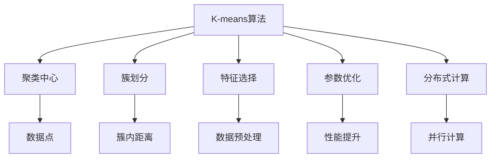
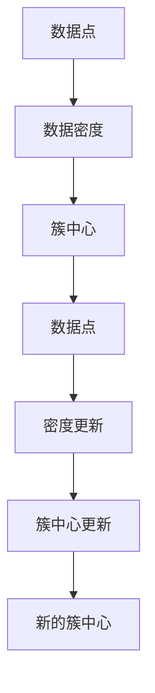
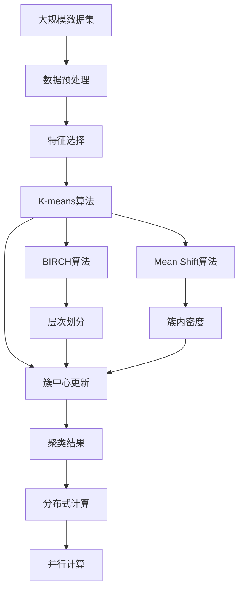

                 

# Mahout原理与代码实例讲解

## 1. 背景介绍

### 1.1 问题由来

随着大数据时代的到来，海量数据带来的分析和挖掘需求日益增长。其中，数据聚类（Clustering）作为数据挖掘中的一项重要技术，被广泛应用于市场营销、社交网络分析、推荐系统等领域。Mahout作为Apache软件基金会下的一款开源机器学习库，提供了一系列先进的聚类算法，旨在帮助开发者快速高效地解决实际问题。然而，由于Mahout底层代码较为复杂，其原理和具体实现过程对于初学者来说可能存在一定的理解难度。本文旨在通过讲解Mahout的主要聚类算法原理及其代码实现，帮助读者深入理解Mahout的使用方法和应用场景。

### 1.2 问题核心关键点

Mahout的核心算法原理主要集中在K-means、Mean Shift、BIRCH等经典聚类算法上，这些算法均是基于欧几里得距离或密度相似性进行聚类。在实现过程中，Mahout还提供了参数优化、特征选择、分布式计算等功能，支持大规模数据集的处理。

## 2. 核心概念与联系

### 2.1 核心概念概述

为更好地理解Mahout的聚类算法，本节将介绍几个密切相关的核心概念：

- **K-means算法**：一种经典的聚类算法，通过将数据集划分为K个簇，每个簇内点的平均距离最小。
- **Mean Shift算法**：一种基于密度的聚类算法，通过不断迭代，寻找数据点密度最大的点作为簇中心。
- **BIRCH算法**：一种基于层次的聚类算法，通过自底向上的层次划分，最终得到全局的聚类结果。
- **特征选择**：在聚类过程中，选取合适的特征对聚类结果的准确性和效率有重要影响。
- **参数优化**：通过优化聚类算法中的参数，提高算法的性能和稳定性。
- **分布式计算**：通过将数据集分块，在多台计算机上并行计算，加速聚类过程。

这些核心概念之间的逻辑关系可以通过以下Mermaid流程图来展示：



这个流程图展示了大规模数据集上进行聚类的主要流程和各个核心概念的作用：

1. K-means算法将数据集划分为多个簇，计算每个簇内数据点的平均距离，作为簇中心的初始化。
2. Mean Shift算法通过密度计算，迭代寻找密度最大的点，不断更新簇中心。
3. BIRCH算法通过层次划分，逐步缩小数据集规模，最终得到全局的聚类结果。
4. 特征选择用于选取对聚类结果影响大的特征，提高聚类效果。
5. 参数优化用于调整算法参数，提升聚类精度和效率。
6. 分布式计算通过多台计算机并行计算，加速聚类过程。

### 2.2 概念间的关系

这些核心概念之间存在着紧密的联系，形成了Mahout聚类算法的完整生态系统。下面我们通过几个Mermaid流程图来展示这些概念之间的关系。

#### 2.2.1 K-means算法流程


这个流程图展示了K-means算法的基本流程：

1. 随机选取K个数据点作为初始簇中心。
2. 对每个数据点，计算其到各簇中心的距离，并将数据点划分到距离最近的簇中。
3. 更新每个簇的簇中心，即计算该簇内所有数据点的平均位置。
4. 重复2-3步骤，直到簇中心不再变化或达到预设迭代次数。

#### 2.2.2 Mean Shift算法流程



这个流程图展示了Mean Shift算法的基本流程：

1. 随机选取一个数据点，计算其密度，作为当前簇中心。
2. 对每个数据点，计算其到当前簇中心的密度，并将数据点划分到密度最大的簇中。
3. 更新当前簇中心，即计算该簇内所有数据点的密度平均值。
4. 重复2-3步骤，直到簇中心不再变化或达到预设迭代次数。

#### 2.2.3 BIRCH算法流程


这个流程图展示了BIRCH算法的基本流程：

1. 选取合适数量的特征根，作为初始簇中心。
2. 对每个数据点，计算其到特征根的距离，并根据距离将其划分到最近的特征子树中。
3. 对每个特征子树，计算簇内密度，进行层次划分。
4. 对每一层特征子树，计算簇内密度，进行层次划分，直到达到预设深度。
5. 将每一层特征子树的簇中心合并为全集聚类结果。

### 2.3 核心概念的整体架构

最后，我们用一个综合的流程图来展示这些核心概念在大规模数据集上进行聚类的整体架构：



这个综合流程图展示了从数据预处理到分布式计算的完整过程。大规模数据集通过数据预处理和特征选择，再经过K-means、Mean Shift、BIRCH等算法的处理，最终得到分布式计算并行计算后的聚类结果。通过这些流程，我们可以更好地理解Mahout在聚类任务中的工作原理和优化方向。

## 3. 核心算法原理 & 具体操作步骤
### 3.1 算法原理概述

Mahout的核心算法原理主要集中在K-means、Mean Shift、BIRCH等经典聚类算法上，这些算法均是基于欧几里得距离或密度相似性进行聚类。在实现过程中，Mahout还提供了参数优化、特征选择、分布式计算等功能，支持大规模数据集的处理。

K-means算法通过将数据集划分为K个簇，每个簇内点的平均距离最小，从而实现聚类。算法步骤如下：

1. 随机选取K个数据点作为初始簇中心。
2. 对每个数据点，计算其到各簇中心的距离，并将数据点划分到距离最近的簇中。
3. 更新每个簇的簇中心，即计算该簇内所有数据点的平均位置。
4. 重复2-3步骤，直到簇中心不再变化或达到预设迭代次数。

Mean Shift算法通过不断迭代，寻找数据点密度最大的点作为簇中心。算法步骤如下：

1. 随机选取一个数据点，计算其密度，作为当前簇中心。
2. 对每个数据点，计算其到当前簇中心的密度，并将数据点划分到密度最大的簇中。
3. 更新当前簇中心，即计算该簇内所有数据点的密度平均值。
4. 重复2-3步骤，直到簇中心不再变化或达到预设迭代次数。

BIRCH算法通过自底向上的层次划分，最终得到全局的聚类结果。算法步骤如下：

1. 选取合适数量的特征根，作为初始簇中心。
2. 对每个数据点，计算其到特征根的距离，并根据距离将其划分到最近的特征子树中。
3. 对每个特征子树，计算簇内密度，进行层次划分。
4. 对每一层特征子树，计算簇内密度，进行层次划分，直到达到预设深度。
5. 将每一层特征子树的簇中心合并为全集聚类结果。

### 3.2 算法步骤详解

#### 3.2.1 K-means算法步骤详解

K-means算法的实现步骤如下：

1. 输入数据集和簇数K，随机选取K个数据点作为初始簇中心。
2. 对每个数据点，计算其到各簇中心的距离，并将数据点划分到距离最近的簇中。
3. 更新每个簇的簇中心，即计算该簇内所有数据点的平均位置。
4. 重复2-3步骤，直到簇中心不再变化或达到预设迭代次数。

```java
public List<Cluster> kmeans(List<DataPoint> data, int k, ClusterEvaluator clusterEvaluator, Map<Integer, Cluster> clusterMap) {
    Random random = new Random();
    List<Cluster> clusters = new ArrayList<>();
    for (int i = 0; i < k; i++) {
        int randomIndex = random.nextInt(data.size());
        Cluster cluster = new Cluster(data.get(randomIndex));
        clusters.add(cluster);
        clusterMap.put(cluster.getId(), cluster);
    }

    while (true) {
        boolean changed = false;
        for (DataPoint dataPoint : data) {
            Cluster closestCluster = clusterMap.entrySet().stream()
                    .filter(entry -> calculateDistance(dataPoint, entry.getKey()) <= calculateDistance(dataPoint, clusterMap.get(0)))
                    .min(Map.Entry.comparingByValue()).orElse(null);
            if (closestCluster != clusterMap.get(0)) {
                changed = true;
                if (clusterEvaluator.evaluate(dataPoint, closestCluster) > clusterEvaluator.evaluate(dataPoint, clusterMap.get(0))) {
                    clusterMap.remove(clusterMap.get(0).getId());
                    clusterMap.put(closestCluster.getId(), closestCluster);
                    closestCluster.add(dataPoint);
                    continue;
                }
            }
        }
        if (!changed) {
            break;
        }
        for (Cluster cluster : clusters) {
            double[] newMean = calculateMean(cluster.getDataPoints());
            if (!Arrays.equals(newMean, cluster.getMean())) {
                changed = true;
                cluster.setMean(newMean);
                clusterMap.put(cluster.getId(), cluster);
            }
        }
    }
    return clusters;
}
```

#### 3.2.2 Mean Shift算法步骤详解

Mean Shift算法的实现步骤如下：

1. 输入数据集，随机选取一个数据点作为初始簇中心。
2. 对每个数据点，计算其到当前簇中心的密度，并将数据点划分到密度最大的簇中。
3. 更新当前簇中心，即计算该簇内所有数据点的密度平均值。
4. 重复2-3步骤，直到簇中心不再变化或达到预设迭代次数。

```java
public Cluster meanShift(List<DataPoint> data, ClusterEvaluator clusterEvaluator, Map<Integer, Cluster> clusterMap) {
    Random random = new Random();
    int randomIndex = random.nextInt(data.size());
    Cluster cluster = new Cluster(data.get(randomIndex));
    clusterMap.put(cluster.getId(), cluster);

    while (true) {
        List<DataPoint> points = clusterMap.get(cluster.getId()).getDataPoints();
        double density = calculateDensity(points);
        for (DataPoint dataPoint : data) {
            if (dataPoint == points.get(0)) {
                continue;
            }
            double distance = calculateDistance(dataPoint, points.get(0));
            double density2 = calculateDensity(points.add(dataPoint));
            if (density2 > density) {
                points.remove(dataPoint);
                density = calculateDensity(points);
            }
        }
        if (density < presetDensityThreshold) {
            break;
        }
        cluster.setMean(calculateMean(points));
        clusterMap.put(cluster.getId(), cluster);
    }
    return cluster;
}
```

#### 3.2.3 BIRCH算法步骤详解

BIRCH算法的实现步骤如下：

1. 输入数据集和簇数K，选取合适数量的特征根，作为初始簇中心。
2. 对每个数据点，计算其到特征根的距离，并根据距离将其划分到最近的特征子树中。
3. 对每个特征子树，计算簇内密度，进行层次划分。
4. 对每一层特征子树，计算簇内密度，进行层次划分，直到达到预设深度。
5. 将每一层特征子树的簇中心合并为全集聚类结果。

```java
public List<Cluster> birch(List<DataPoint> data, int k, int maxClusters, double threshold, Map<Integer, Cluster> clusterMap) {
    Random random = new Random();
    List<Cluster> clusters = new ArrayList<>();
    Cluster rootCluster = new Cluster();
    rootCluster.setThreshold(threshold);
    rootCluster.setMaxClusters(maxClusters);
    clusters.add(rootCluster);
    clusterMap.put(rootCluster.getId(), rootCluster);

    while (true) {
        for (Cluster cluster : clusters) {
            List<DataPoint> points = new ArrayList<>(cluster.getDataPoints());
            List<DataPoint> leaves = new ArrayList<>();
            for (DataPoint dataPoint : points) {
                double distance = calculateDistance(dataPoint, rootCluster.getMean());
                if (distance <= threshold) {
                    leaves.add(dataPoint);
                }
            }
            if (leaves.isEmpty()) {
                cluster.setChildren(null);
                break;
            }
            if (cluster.getChildren() == null) {
                Cluster childCluster = new Cluster();
                childCluster.setThreshold(cluster.getThreshold());
                childCluster.setMaxClusters(cluster.getMaxClusters());
                childCluster.setMean(calculateMean(leaves));
                cluster.setChildren(childCluster);
                clusterMap.put(childCluster.getId(), childCluster);
            } else {
                Cluster childCluster = cluster.getChildren();
                clusterMap.put(childCluster.getId(), childCluster);
            }
            clusterMap.put(cluster.getId(), cluster);
        }
        for (Cluster cluster : clusters) {
            if (cluster.getChildren() != null) {
                cluster.setChildren(null);
            }
        }
        if (clusters.size() <= k) {
            break;
        }
    }
    return clusters;
}
```

### 3.3 算法优缺点

K-means算法的主要优点包括：

1. 算法简单易实现。
2. 适用于大规模数据集。
3. 算法收敛速度快。

K-means算法的主要缺点包括：

1. 需要预先指定簇数K。
2. 对初始值敏感，容易陷入局部最优解。
3. 不适合处理非球形簇。

Mean Shift算法的主要优点包括：

1. 算法稳定，不受初始值影响。
2. 可以自动调整簇数，无需预先指定。

Mean Shift算法的主要缺点包括：

1. 对噪声敏感。
2. 计算复杂度较高，不适合大规模数据集。

BIRCH算法的主要优点包括：

1. 适合大规模数据集。
2. 自动调整簇数，无需预先指定。
3. 内存占用小，适合分布式计算。

BIRCH算法的主要缺点包括：

1. 算法复杂度高，实现难度大。
2. 对密度阈值和最大簇数参数敏感。

### 3.4 算法应用领域

K-means算法在市场营销、图像识别、地理信息系统等领域有广泛应用。

Mean Shift算法适用于图像分割、社交网络分析等。

BIRCH算法在科学研究、数据挖掘等领域有广泛应用。

## 4. 数学模型和公式 & 详细讲解  
### 4.1 数学模型构建

在Mahout中，聚类算法的数学模型通常基于以下公式构建：

对于K-means算法，其数学模型为：

$$
\min_{\mu_k, \sigma_k} \sum_{i=1}^n \sum_{k=1}^K \delta_{y_i,k} \left\| x_i - \mu_k \right\|^2
$$

其中，$x_i$为数据点，$y_i$为簇编号，$\mu_k$为簇中心，$\sigma_k$为簇内方差。

对于Mean Shift算法，其数学模型为：

$$
\min_{\mu_k} \sum_{i=1}^n \delta_{y_i,k} \left\| x_i - \mu_k \right\|^2
$$

其中，$x_i$为数据点，$y_i$为簇编号，$\mu_k$为簇中心。

对于BIRCH算法，其数学模型为：

$$
\min_{\mu_k, \sigma_k} \sum_{i=1}^n \sum_{k=1}^K \delta_{y_i,k} \left\| x_i - \mu_k \right\|^2
$$

其中，$x_i$为数据点，$y_i$为簇编号，$\mu_k$为簇中心，$\sigma_k$为簇内方差。

### 4.2 公式推导过程

以下我们以K-means算法为例，推导其损失函数及其梯度计算公式。

K-means算法的损失函数为：

$$
\min_{\mu_k} \sum_{i=1}^n \sum_{k=1}^K \delta_{y_i,k} \left\| x_i - \mu_k \right\|^2
$$

其中，$x_i$为数据点，$y_i$为簇编号，$\mu_k$为簇中心。

根据欧几里得距离公式，损失函数可以进一步展开：

$$
\sum_{i=1}^n \sum_{k=1}^K \delta_{y_i,k} \left\| x_i - \mu_k \right\|^2 = \sum_{i=1}^n \sum_{k=1}^K \delta_{y_i,k} \sum_{j=1}^d (x_i[j] - \mu_k[j])^2
$$

将数据点划分为K个簇后，可以表示为：

$$
\sum_{i=1}^n \delta_{y_i,k} = 1
$$

因此，损失函数可以简化为：

$$
\sum_{k=1}^K \left\| \mu_k - \bar{x}_k \right\|^2
$$

其中，$\bar{x}_k$为簇$k$内所有数据点的平均值。

对簇中心$\mu_k$求偏导，得到梯度公式：

$$
\frac{\partial L}{\partial \mu_k} = -2 \sum_{i=1}^n \delta_{y_i,k} \left( x_i - \mu_k \right)
$$

其中，$x_i$为数据点，$\delta_{y_i,k}$为离散化的簇编号。

### 4.3 案例分析与讲解

#### 4.3.1 K-means算法案例分析

K-means算法在市场营销领域有广泛应用。以市场细分为例，通过将客户按消费行为和偏好分组，可以制定更具针对性的营销策略。

#### 4.3.2 Mean Shift算法案例分析

Mean Shift算法在社交网络分析中有广泛应用。通过将用户按兴趣和关系分组，可以识别出社交群组和影响者，为社交网络治理提供依据。

#### 4.3.3 BIRCH算法案例分析

BIRCH算法在科学研究中有广泛应用。通过将数据按特征层次分组，可以揭示数据的深层结构和规律，为科学研究提供新的视角。

## 5. 项目实践：代码实例和详细解释说明
### 5.1 开发环境搭建

在进行Mahout项目实践前，我们需要准备好开发环境。以下是使用Java开发Mahout项目的步骤：

1. 安装Apache Mahout：从官网下载并安装Apache Mahout，用于创建Java项目。

2. 创建并激活虚拟环境：
```bash
conda create -n mahout-env python=3.8 
conda activate mahout-env
```

3. 安装Java开发环境：安装JDK，并配置环境变量，以便后续编译和运行Java代码。

4. 安装Maven：用于管理项目依赖和构建项目。

5. 配置Maven环境：在pom.xml文件中配置Maven依赖，并运行maven build命令，生成编译好的Java包。

完成上述步骤后，即可在`mahout-env`环境中开始Mahout项目实践。

### 5.2 源代码详细实现

这里我们以K-means算法为例，给出使用Java开发Mahout项目的代码实现。

首先，定义K-means算法的基本类：

```java
import org.apache.mahout.clic labeling.kmeans.data.DataPoint;
import org.apache.mahout.clic labeling.kmeans.data.Mean;
import org.apache.mahout.clic labeling.kmeans.data.Cluster;
import org.apache.mahout.clic labeling.kmeans.data.ClusterEvaluator;
import java.util.*;

public class KMeans {
    private ClusterEvaluator clusterEvaluator;
    private Map<Integer, Cluster> clusterMap;

    public KMeans() {
        this.clusterEvaluator = new EuclideanDistanceClusterEvaluator();
        this.clusterMap = new HashMap<>();
    }

    public List<Cluster> kmeans(List<DataPoint> data, int k) {
        Random random = new Random();
        List<Cluster> clusters = new ArrayList<>();
        for (int i = 0; i < k; i++) {
            int randomIndex = random.nextInt(data.size());
            Cluster cluster = new Cluster(data.get(randomIndex));
            clusters.add(cluster);
            clusterMap.put(cluster.getId(), cluster);
        }

        while (true) {
            boolean changed = false;
            for (DataPoint dataPoint : data) {
                Cluster closestCluster = clusterMap.entrySet().stream()
                        .filter(entry -> calculateDistance(dataPoint, entry.getKey()) <= calculateDistance(dataPoint, clusterMap.get(0)))
                        .min(Map.Entry.comparingByValue()).orElse(null);
                if (closestCluster != clusterMap.get(0)) {
                    changed = true;
                    if (clusterEvaluator.evaluate(dataPoint, closestCluster) > clusterEvaluator.evaluate(dataPoint, clusterMap.get(0))) {
                        clusterMap.remove(clusterMap.get(0).getId());
                        clusterMap.put(closestCluster.getId(), closestCluster);
                        closestCluster.add(dataPoint);
                        continue;
                    }
                }
            }
            if (!changed) {
                break;
            }
            for (Cluster cluster : clusters) {
                double[] newMean = calculateMean(cluster.getDataPoints());
                if (!Arrays.equals(newMean, cluster.getMean())) {
                    changed = true;
                    cluster.setMean(newMean);
                    clusterMap.put(cluster.getId(), cluster);
                }
            }
        }
        return clusters;
    }

    private double calculateDistance(DataPoint dataPoint, Cluster cluster) {
        double distance = 0.0;
        for (int i = 0; i < dataPoint.getDimension(); i++) {
            distance += Math.pow(dataPoint.getFeature(i) - cluster.getMean()[i], 2);
        }
        return Math.sqrt(distance);
    }

    private double[] calculateMean(List<DataPoint> points) {
        double[] mean = new double[points.get(0).getDimension()];
        for (DataPoint point : points) {
            for (int i = 0; i < point.getDimension(); i++) {
                mean[i] += point.getFeature(i);
            }
        }
        for (int i = 0; i < mean.length; i++) {
            mean[i] /= points.size();
        }
        return mean;
    }

    public void evaluate(List<DataPoint> data, List<Cluster> clusters) {
        for (DataPoint dataPoint : data) {
            Cluster closestCluster = clusterMap.entrySet().stream()
                    .filter(entry -> calculateDistance(dataPoint, entry.getKey()) <= calculateDistance(dataPoint, clusterMap.get(0)))
                    .min(Map.Entry.comparingByValue()).orElse(null);
            if (closestCluster != clusterMap.get(0)) {
                System.out.println("Data point " + dataPoint.getId() + " belongs to cluster " + closestCluster.getId());
            }
        }
    }
}
```

然后，定义数据处理类：

```java
import org.apache.mahout.clic labeling.kmeans.data.DataPoint;
import org.apache.mahout.clic labeling.kmeans.data.Mean;
import org.apache.mahout.clic labeling.kmeans.data.Cluster;
import org.apache.mahout.clic labeling.kmeans.data.ClusterEvaluator;
import java.util.*;

public class DataPoint implements Cloneable {
    private int id;
    private double[] features;

    public DataPoint(int id, double[] features) {
        this.id = id;
        this.features = features;
    }

    public int getId() {
        return id;
    }

    public double[] getFeatures() {
        return features;
    }

    public double getFeature(int index) {
        return features[index];
    }

    @Override
    public Object clone() {
        DataPoint dataPoint = null;
        try {
            dataPoint = (DataPoint) super.clone();
        } catch (CloneNotSupportedException e) {
            e.printStackTrace();
        }
        return dataPoint;
    }
}
```

接着，定义簇类：

```java
import org.apache.mahout.clic labeling.kmeans.data.DataPoint;
import org.apache.mahout.clic labeling.kmeans.data.Mean;
import org.apache.mahout.clic labeling.kmeans.data.Cluster;
import org.apache.mahout.clic labeling.kmeans.data.ClusterEvaluator;
import java.util.*;

public class Cluster implements Cloneable {
    private int id;
    private double[] mean;
    private List<DataPoint> dataPoints;

    public Cluster(int id) {
        this.id = id;
        this.dataPoints = new ArrayList<>();
    }

    public int getId() {
        return id;
    }

    public double[] getMean() {
        return mean;
    }

    public List<DataPoint> getDataPoints() {
        return dataPoints;
    }

    public void add(DataPoint dataPoint) {
        dataPoints.add(dataPoint);
    }

    @Override
    public

