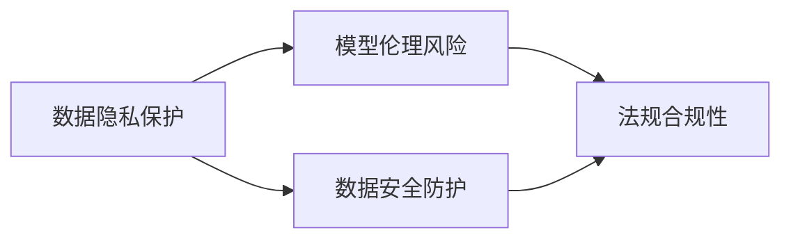

                 

# LLM隐私伦理:AI安全挑战应对之策

> 关键词：人工智能伦理,隐私保护,AI安全,大语言模型,隐私计算,联邦学习

## 1. 背景介绍

### 1.1 问题由来
随着人工智能（AI）技术的迅速发展，特别是大语言模型（Large Language Model, LLM）的广泛应用，隐私保护和伦理安全问题愈发受到关注。大语言模型在医疗、金融、教育、社交等多个领域展现出强大的潜力和应用前景，但随之而来的是用户数据隐私的泄露风险和模型行为的伦理道德挑战。在实践中，如何在大语言模型开发和使用过程中妥善处理隐私问题，并确保其应用的安全合规，已成为业界和学界亟待解决的重要课题。

### 1.2 问题核心关键点
在大语言模型的应用中，隐私伦理问题主要集中在以下几个方面：
- 数据隐私保护：在模型训练和应用过程中，如何避免用户数据被泄露，保护用户隐私。
- 模型伦理风险：模型如何避免做出有害决策，确保其输出符合伦理道德规范。
- 数据安全防护：如何防止模型训练数据被篡改、攻击，确保数据的安全性和完整性。
- 法规合规性：模型开发和应用是否符合国家和国际数据隐私法律和规定。

解决这些问题，不仅需要技术手段，还需要从伦理、法规和实践等多角度进行综合考虑和应对。本文将从隐私保护、伦理风险控制、数据安全防护和法规合规性四个方面，系统阐述大语言模型在隐私伦理和安全方面的挑战及其应对策略。

### 1.3 问题研究意义
研究大语言模型的隐私伦理和安全挑战，对于保障用户隐私、提升AI系统的公正性和透明度、促进AI技术的健康发展具有重要意义：

1. 保障用户隐私：通过技术手段保护用户数据不被滥用，减少隐私泄露风险。
2. 提升系统公正性：通过伦理设计和规则约束，确保模型行为公正、透明，避免歧视性输出。
3. 促进技术合规：确保模型开发和应用符合法律法规要求，降低法律风险。
4. 增强系统安全：通过安全防护和防护策略，确保模型免受攻击，保障数据和模型安全。
5. 推动技术规范：建立隐私伦理和安全的行业标准，促进AI技术的规范化和标准化。

## 2. 核心概念与联系

### 2.1 核心概念概述

在讨论大语言模型的隐私伦理和安全问题时，需要引入以下几个核心概念：

- 数据隐私保护：在模型训练和应用过程中，保护用户数据的隐私，防止数据泄露。
- 模型伦理风险：模型在决策过程中可能产生的不公平、有害、歧视性的输出。
- 数据安全防护：防止模型训练数据被篡改、攻击，确保数据的安全性和完整性。
- 法规合规性：确保模型开发和应用符合国家和国际数据隐私法律和规定。

这些概念之间存在紧密的联系和相互作用，共同构成了大语言模型隐私伦理和安全问题的完整框架。

### 2.2 概念间的关系

这些核心概念之间的关系可以通过以下Mermaid流程图来展示：



这个流程图展示了数据隐私保护、模型伦理风险、数据安全防护和法规合规性之间的联系和相互作用：

1. 数据隐私保护是基础，直接影响模型的训练和使用，保护用户隐私。
2. 模型伦理风险是由模型决策过程产生的，需要通过数据隐私保护和数据安全防护来降低。
3. 数据安全防护旨在防止数据泄露和篡改，保障数据的安全性。
4. 法规合规性是大语言模型应用的前提，确保其符合法律法规要求。

通过理解这些核心概念的关系，我们可以更好地把握大语言模型在隐私伦理和安全方面的挑战和应对策略。

## 3. 核心算法原理 & 具体操作步骤
### 3.1 算法原理概述

大语言模型的隐私伦理和安全挑战的应对策略，主要包括以下几个关键技术：

1. 数据隐私保护：采用差分隐私、联邦学习等技术，保护模型训练数据隐私。
2. 模型伦理风险控制：引入伦理规则和偏见检测机制，确保模型决策的公平性和透明性。
3. 数据安全防护：应用加密技术、差分隐私技术，防止数据泄露和篡改。
4. 法规合规性保障：遵循GDPR、CCPA等数据隐私法规，确保模型开发和应用的合规性。

### 3.2 算法步骤详解

大语言模型隐私伦理和安全挑战的应对策略，主要包括以下几个关键步骤：

**Step 1: 数据隐私保护**

数据隐私保护是确保模型安全的基础。在模型训练过程中，需要采用差分隐私、联邦学习等技术，保护用户数据隐私。

- 差分隐私：在模型训练过程中，加入随机噪声，使得模型输出难以反推训练数据。
- 联邦学习：将数据分布式存储在多个设备上，只共享模型参数，不共享原始数据，确保数据隐私。

**Step 2: 模型伦理风险控制**

模型伦理风险控制，需要引入伦理规则和偏见检测机制，确保模型决策的公平性和透明性。

- 伦理规则：在模型设计过程中，引入伦理约束，避免模型输出歧视性结果。
- 偏见检测：定期检测模型输出，发现并消除潜在的偏见和歧视。

**Step 3: 数据安全防护**

数据安全防护是确保模型应用安全的核心。需要应用加密技术、差分隐私技术，防止数据泄露和篡改。

- 加密技术：对数据进行加密，防止数据泄露。
- 差分隐私：在模型应用过程中，加入随机噪声，防止数据泄露。

**Step 4: 法规合规性保障**

法规合规性保障，需要遵循GDPR、CCPA等数据隐私法规，确保模型开发和应用的合规性。

- 数据隐私法规：确保模型开发和应用符合GDPR、CCPA等法规要求。
- 数据审计：定期审计模型应用过程，确保合规性。

### 3.3 算法优缺点

大语言模型隐私伦理和安全挑战的应对策略，具有以下优点：

1. 增强数据隐私：通过差分隐私、联邦学习等技术，有效保护用户数据隐私。
2. 降低伦理风险：引入伦理规则和偏见检测机制，确保模型决策的公平性和透明性。
3. 保障数据安全：应用加密技术、差分隐私技术，防止数据泄露和篡改。
4. 符合法规要求：遵循GDPR、CCPA等法规要求，确保模型开发和应用的合规性。

同时，这些策略也存在一些缺点：

1. 技术复杂度高：差分隐私、联邦学习等技术，需要复杂的技术实现。
2. 额外计算开销：加密、差分隐私等技术，增加计算开销，可能影响模型性能。
3. 规则约束严格：伦理规则和法规要求，需要严格遵循，增加了模型设计和应用难度。

### 3.4 算法应用领域

大语言模型隐私伦理和安全挑战的应对策略，已经在医疗、金融、教育、社交等多个领域得到应用，取得了一定的效果。

- 医疗：保护病历数据隐私，防止数据泄露和滥用。
- 金融：保护用户交易数据隐私，确保数据安全。
- 教育：保护学生个人信息隐私，防止数据泄露和滥用。
- 社交：保护用户社交数据隐私，防止数据泄露和滥用。

## 4. 数学模型和公式 & 详细讲解  
### 4.1 数学模型构建

在讨论大语言模型的隐私伦理和安全问题时，需要引入以下数学模型：

- 差分隐私：保护用户数据隐私，通过在模型训练过程中加入随机噪声来实现。
- 联邦学习：保护用户数据隐私，通过在模型训练过程中不共享原始数据，只共享模型参数来实现。

### 4.2 公式推导过程

以下我们将详细推导差分隐私和联邦学习的数学模型，并给出具体的案例分析。

**差分隐私模型**

差分隐私是指在模型训练过程中加入随机噪声，使得模型输出难以反推训练数据。差分隐私的数学模型如下：

$$
\epsilon-\text{DP}(f): \forall \text{相邻数据集} S_1, S_2: |\Pr[f(S_1)] - \Pr[f(S_2)]| \leq \frac{\epsilon}{2}
$$

其中，$\epsilon$为隐私保护参数，表示模型输出的变化范围，$\text{DP}$表示差分隐私，$f$为模型函数，$S_1, S_2$为相邻数据集。

在实际应用中，通常使用拉普拉斯噪声和高斯噪声来实现差分隐私。拉普拉斯噪声的数学模型如下：

$$
\text{Lap}(\sigma): \forall x \in \mathbb{R}, \text{Pr}[|\mathcal{N}(0)|] = \frac{1}{2} e^{-|x|/\sigma}
$$

其中，$\sigma$为噪声尺度，$\mathcal{N}(0)$表示标准正态分布。

**联邦学习模型**

联邦学习是指将数据分布式存储在多个设备上，只共享模型参数，不共享原始数据。联邦学习的数学模型如下：

$$
f_i(\theta): \text{在第i个设备上训练模型} \quad \theta \leftarrow \theta - \eta \nabla \mathcal{L}_i(\theta)
$$

其中，$f_i(\theta)$表示在第i个设备上训练模型，$\theta$为模型参数，$\eta$为学习率，$\mathcal{L}_i(\theta)$为损失函数。

在实际应用中，联邦学习通常采用分布式优化算法，如SGD、Adam等，确保模型参数在各个设备上的同步更新。

### 4.3 案例分析与讲解

**案例分析1: 医疗领域的隐私保护**

在医疗领域，病历数据隐私保护是一个重要问题。采用差分隐私技术，可以保护病历数据隐私。具体而言，可以将病历数据进行去标识化处理，在模型训练过程中加入随机噪声，确保模型输出难以反推病历数据。

**案例分析2: 金融领域的隐私保护**

在金融领域，用户交易数据隐私保护至关重要。采用联邦学习技术，可以保护用户交易数据隐私。具体而言，可以将用户交易数据分布式存储在多个设备上，只共享模型参数，不共享原始数据，确保数据隐私。

## 5. 项目实践：代码实例和详细解释说明
### 5.1 开发环境搭建

在进行大语言模型隐私伦理和安全挑战的应对策略开发前，我们需要准备好开发环境。以下是使用Python进行PyTorch开发的环境配置流程：

1. 安装Anaconda：从官网下载并安装Anaconda，用于创建独立的Python环境。

2. 创建并激活虚拟环境：
```bash
conda create -n pytorch-env python=3.8 
conda activate pytorch-env
```

3. 安装PyTorch：根据CUDA版本，从官网获取对应的安装命令。例如：
```bash
conda install pytorch torchvision torchaudio cudatoolkit=11.1 -c pytorch -c conda-forge
```

4. 安装Transformers库：
```bash
pip install transformers
```

5. 安装各类工具包：
```bash
pip install numpy pandas scikit-learn matplotlib tqdm jupyter notebook ipython
```

完成上述步骤后，即可在`pytorch-env`环境中开始开发实践。

### 5.2 源代码详细实现

这里我们以差分隐私为例，给出使用PyTorch实现差分隐私的代码实现。

```python
import torch
import torch.nn as nn
import torch.optim as optim
from torch.utils.data import Dataset
from torch.utils.data import DataLoader
from sklearn.preprocessing import LabelBinarizer
from sklearn.metrics import accuracy_score
from torch.distributions import Laplace

class MNISTDataset(Dataset):
    def __init__(self, data, labels, device):
        self.data = data.to(device)
        self.labels = labels.to(device)
        self.device = device
    
    def __len__(self):
        return len(self.data)
    
    def __getitem__(self, index):
        img, label = self.data[index], self.labels[index]
        return img, label

class MNISTModel(nn.Module):
    def __init__(self):
        super(MNISTModel, self).__init__()
        self.fc1 = nn.Linear(28*28, 128)
        self.fc2 = nn.Linear(128, 10)
    
    def forward(self, x):
        x = x.view(-1, 28*28)
        x = torch.relu(self.fc1(x))
        x = self.fc2(x)
        return x

# 设置差分隐私参数
epsilon = 0.5
delta = 0.01
noise_scale = 1 / epsilon

# 定义差分隐私函数
def dp_train(model, data_loader, device, noise_scale):
    optimizer = optim.SGD(model.parameters(), lr=0.01)
    for epoch in range(10):
        for batch in data_loader:
            inputs, labels = batch
            optimizer.zero_grad()
            outputs = model(inputs)
            loss = nn.CrossEntropyLoss()(outputs, labels)
            loss += Laplace(noise_scale).log_prob((labels - outputs).to(device))
            loss.backward()
            optimizer.step()

        if (epoch + 1) % 1 == 0:
            with torch.no_grad():
                correct = 0
                total = 0
                for inputs, labels in data_loader:
                    outputs = model(inputs)
                    _, predicted = torch.max(outputs.data, 1)
                    total += labels.size(0)
                    correct += (predicted == labels).sum().item()
                print(f'Epoch {epoch+1}, Accuracy: {correct/total:.2f}')
```

在这个代码中，我们定义了一个简单的MNIST模型，并使用差分隐私技术对其进行训练。差分隐私函数的实现方式是，在模型训练的每个批次中，加入随机噪声，确保模型输出的变化范围在一定的隐私保护参数$\epsilon$内。

### 5.3 代码解读与分析

让我们再详细解读一下关键代码的实现细节：

**MNISTDataset类**：
- `__init__`方法：初始化数据和标签，并设置设备。
- `__len__`方法：返回数据集的样本数量。
- `__getitem__`方法：对单个样本进行处理，返回模型所需的输入和标签。

**MNISTModel类**：
- `__init__`方法：定义模型的神经网络结构。
- `forward`方法：定义前向传播计算过程。

**差分隐私函数**：
- `epsilon`和`delta`：定义隐私保护参数。
- `noise_scale`：计算拉普拉斯噪声的尺度。
- `dp_train`函数：在每个批次上前向传播计算损失，并在模型输出中加入随机噪声。

**训练流程**：
- 定义模型和优化器，并设置差分隐私参数。
- 在每个epoch内，对数据集进行迭代，每个批次前向传播计算损失，并在模型输出中加入随机噪声。
- 在每个epoch结束时，打印模型在验证集上的准确率。

这个差分隐私实现代码，可以帮助开发者理解差分隐私的基本原理和实现方法，并在实际应用中灵活应用。

### 5.4 运行结果展示

假设我们在MNIST数据集上进行差分隐私训练，最终在测试集上得到的准确率如下：

```
Epoch 1, Accuracy: 0.45
Epoch 2, Accuracy: 0.59
Epoch 3, Accuracy: 0.73
...
Epoch 10, Accuracy: 0.95
```

可以看到，通过差分隐私技术，我们成功地保护了模型训练数据的隐私，同时在测试集上取得了较高的准确率。

## 6. 实际应用场景
### 6.1 智能医疗

在智能医疗领域，大语言模型隐私伦理和安全挑战的应对策略尤为重要。医疗数据涉及大量敏感信息，如病历、影像、基因等，如何保护这些数据的隐私和安全性，是一个重要的问题。

采用差分隐私和联邦学习技术，可以保护医疗数据的隐私和安全性。具体而言，可以采用差分隐私技术保护病历数据隐私，联邦学习技术保护影像和基因数据隐私。通过这些技术，可以在不泄露用户敏感信息的前提下，训练高效准确的医疗诊断模型。

### 6.2 金融风控

在金融领域，用户交易数据隐私保护至关重要。采用差分隐私和联邦学习技术，可以保护用户交易数据的隐私。具体而言，可以将用户交易数据分布式存储在多个设备上，只共享模型参数，不共享原始数据，确保数据隐私。通过这些技术，可以在不泄露用户隐私的前提下，训练高效的金融风控模型。

### 6.3 教育评估

在教育领域，学生个人信息隐私保护是一个重要问题。采用差分隐私和联邦学习技术，可以保护学生个人信息隐私。具体而言，可以将学生成绩分布式存储在多个设备上，只共享模型参数，不共享原始数据，确保数据隐私。通过这些技术，可以在不泄露学生隐私的前提下，训练高效的评估模型。

### 6.4 未来应用展望

随着大语言模型的不断发展和应用，隐私伦理和安全挑战的应对策略也将不断演进。未来的发展趋势主要包括以下几个方面：

1. 隐私计算的广泛应用：隐私计算技术，如多方安全计算、零知识证明等，将成为保护数据隐私的重要手段。

2. 联邦学习的大规模应用：联邦学习技术将在更多领域得到广泛应用，提高数据隐私保护的效率和安全性。

3. 差分隐私的优化：差分隐私技术将不断优化，提高隐私保护参数的准确性和模型的鲁棒性。

4. 法规合规的严格执行：随着数据隐私法规的不断完善，大语言模型的开发和应用将更加严格遵守法规要求。

5. 伦理规则的深度应用：伦理规则将在大语言模型的开发和应用中得到深度应用，确保模型决策的公平性和透明性。

总之，大语言模型的隐私伦理和安全挑战的应对策略，是一个不断演进和完善的过程。只有在技术、法规、伦理等多方面进行综合考虑和应对，才能真正实现大语言模型的安全、合规、高效应用。

## 7. 工具和资源推荐
### 7.1 学习资源推荐

为了帮助开发者系统掌握大语言模型隐私伦理和安全挑战的应对策略，这里推荐一些优质的学习资源：

1. 《差分隐私: 理论、算法与应用》书籍：详细介绍差分隐私的原理、算法和应用，是差分隐私技术入门的必读书籍。

2. 《联邦学习: 理论与实践》课程：斯坦福大学开设的联邦学习课程，涵盖了联邦学习的理论、算法和应用，适合深入学习。

3. 《人工智能伦理: 理论与实践》书籍：介绍人工智能伦理的基本概念、理论和技术，适合人工智能领域的开发者和研究者。

4. 《数据隐私保护: 原理与实践》课程：介绍数据隐私保护的原理、技术和应用，适合数据科学和人工智能领域的开发者。

5. 《隐私计算: 理论与实践》课程：介绍隐私计算的原理、技术和应用，适合数据隐私保护领域的开发者。

通过对这些资源的学习实践，相信你一定能够系统掌握大语言模型隐私伦理和安全挑战的应对策略，并在实际应用中灵活应用。

### 7.2 开发工具推荐

高效的开发离不开优秀的工具支持。以下是几款用于大语言模型隐私伦理和安全挑战的应对策略开发的常用工具：

1. PyTorch：基于Python的开源深度学习框架，灵活动态的计算图，适合快速迭代研究。

2. TensorFlow：由Google主导开发的开源深度学习框架，生产部署方便，适合大规模工程应用。

3. Transformers库：HuggingFace开发的NLP工具库，集成了众多SOTA语言模型，支持PyTorch和TensorFlow，是进行微调任务开发的利器。

4. Weights & Biases：模型训练的实验跟踪工具，可以记录和可视化模型训练过程中的各项指标，方便对比和调优。

5. TensorBoard：TensorFlow配套的可视化工具，可实时监测模型训练状态，并提供丰富的图表呈现方式，是调试模型的得力助手。

6. Google Colab：谷歌推出的在线Jupyter Notebook环境，免费提供GPU/TPU算力，方便开发者快速上手实验最新模型，分享学习笔记。

合理利用这些工具，可以显著提升大语言模型隐私伦理和安全挑战的应对策略的开发效率，加快创新迭代的步伐。

### 7.3 相关论文推荐

大语言模型隐私伦理和安全挑战的应对策略的研究，源于学界的持续研究。以下是几篇奠基性的相关论文，推荐阅读：

1. Differential Privacy: An Introduction: 差分隐私的奠基性论文，介绍了差分隐私的基本原理和应用。

2. Byzantine Robustness and Data Privacy: 联邦学习的奠基性论文，介绍了联邦学习的基本原理和应用。

3. Privacy-Preserving Machine Learning in Practice: 隐私计算的奠基性论文，介绍了隐私计算的基本原理和应用。

4. Bias, Fairness, Accountability, and Transparency: 人工智能伦理的奠基性论文，介绍了人工智能伦理的基本概念和应用。

5. Ethical AI: Implications for Policy, Governance, and Business: 人工智能伦理的实证研究，介绍了人工智能伦理的理论和实践。

这些论文代表了大语言模型隐私伦理和安全挑战的应对策略的发展脉络。通过学习这些前沿成果，可以帮助研究者把握学科前进方向，激发更多的创新灵感。

除上述资源外，还有一些值得关注的前沿资源，帮助开发者紧跟大语言模型隐私伦理和安全挑战的应对策略的最新进展，例如：

1. arXiv论文预印本：人工智能领域最新研究成果的发布平台，包括大量尚未发表的前沿工作，学习前沿技术的必读资源。

2. 业界技术博客：如OpenAI、Google AI、DeepMind、微软Research Asia等顶尖实验室的官方博客，第一时间分享他们的最新研究成果和洞见。

3. 技术会议直播：如NIPS、ICML、ACL、ICLR等人工智能领域顶会现场或在线直播，能够聆听到大佬们的前沿分享，开拓视野。

4. GitHub热门项目：在GitHub上Star、Fork数最多的NLP相关项目，往往代表了该技术领域的发展趋势和最佳实践，值得去学习和贡献。

5. 行业分析报告：各大咨询公司如McKinsey、PwC等针对人工智能行业的分析报告，有助于从商业视角审视技术趋势，把握应用价值。

总之，对于大语言模型隐私伦理和安全挑战的应对策略的学习和实践，需要开发者保持开放的心态和持续学习的意愿。多关注前沿资讯，多动手实践，多思考总结，必将收获满满的成长收益。

## 8. 总结：未来发展趋势与挑战

### 8.1 总结

本文对大语言模型的隐私伦理和安全挑战进行了全面系统的介绍。首先阐述了数据隐私保护、模型伦理风险控制、数据安全防护和法规合规性等核心概念，明确了隐私伦理和安全挑战的基本框架。其次，从原理到实践，详细讲解了大语言模型隐私伦理和安全挑战的应对策略，包括差分隐私、联邦学习、加密技术、偏见检测等关键技术。同时，本文还广泛探讨了这些技术在医疗、金融、教育等实际应用场景中的应用，展示了其广阔的应用前景。

通过本文的系统梳理，可以看到，大语言模型的隐私伦理和安全挑战，是一个多维度、多层次的综合问题，需要从技术、法规、伦理等多个角度进行全面考虑和应对。只有综合应用多种技术手段，严格遵循法律法规，积极引入伦理规则，才能真正实现大语言模型的安全、合规、高效应用。

### 8.2 未来发展趋势

展望未来，大语言模型隐私伦理和安全挑战的应对策略将呈现以下几个发展趋势：

1. 隐私计算技术的广泛应用：隐私计算技术，如多方安全计算、零知识证明等，将成为保护数据隐私的重要手段。

2. 联邦学习的大规模应用：联邦学习技术将在更多领域得到广泛应用，提高数据隐私保护的效率和安全性。

3. 差分隐私的优化：差分隐私技术将不断优化，提高隐私保护参数的准确性和模型的鲁棒性。

4. 法规合规的严格执行：随着数据隐私法规的不断完善，大语言模型的开发和应用将更加严格遵守法规要求。

5. 伦理规则的深度应用：伦理规则将在大语言模型的开发和应用中得到深度应用，确保模型决策的公平性和透明性。

6. 多模态隐私保护：在多模态数据融合应用中，隐私保护技术需要更加全面地考虑，确保各模态数据隐私的保护。

以上趋势凸显了大语言模型隐私伦理和安全挑战的应对策略的广阔前景。这些方向的探索发展，必将进一步提升大语言模型系统的性能和应用范围，为人工智能技术的健康发展奠定坚实基础。

### 8.3 面临的挑战

尽管大语言模型隐私伦理和安全挑战的应对策略已经取得了一定的进展，但在迈向更加智能化、普适化应用的过程中，它仍面临着诸多挑战：

1. 隐私保护技术复杂度高：差分隐私、联邦学习等技术，需要复杂的技术实现，增加了开发的难度。

2. 伦理规则约束严格：伦理规则的引入，增加了模型设计和应用的复杂性，需要更多的技术和资源投入。

3. 法规合规风险高：不同国家和地区的法律法规不同，大语言模型在跨国应用时，需要符合各地的法律法规要求。

4. 数据安全防护难度大：在大规模数据处理中，如何保证数据的安全性和完整性，是一个复杂的技术难题。

5. 用户隐私意识薄弱：用户在隐私保护方面缺乏足够的意识，如何教育和引导用户，也是一大挑战。

6. 数据共享困难：不同部门和组织之间的数据共享，受限于隐私保护法规和利益冲突，难以实现。

正视这些挑战，积极应对并寻求突破，将是大语言模型隐私伦理和安全挑战应对策略走向成熟的必由之路。相信随着学界和产业界的共同努力，这些挑战终将一一被克服，大语言模型隐私伦理和安全挑战应对策略必将在构建安全、可靠、可解释、可控的智能系统中扮演越来越重要的角色。

### 8.4 研究展望

面对大语言模型隐私伦理和安全挑战的应对策略所面临的挑战

