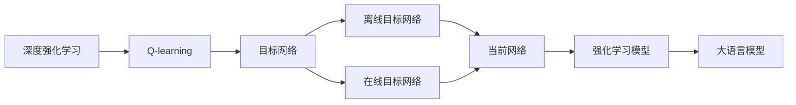

                 

# 大语言模型原理与工程实践：DQN 训练：目标网络

> 关键词：深度强化学习, Q-learning, 目标网络, 双网络, 神经网络

## 1. 背景介绍

### 1.1 问题由来
深度强化学习（Deep Reinforcement Learning, DRL）是近年来AI领域的重要研究方向之一。其核心思想是将深度学习技术引入强化学习中，用神经网络模型来近似动作-价值函数，从而解决复杂环境中高维状态空间、连续动作空间等问题。与传统强化学习方法相比，DRL能处理更复杂更灵活的任务，如AlphaGo、AlphaZero等在棋类游戏上的突破。

在大语言模型（Large Language Model, LLM）中，强化学习已被应用于自动摘要、对话生成、文本纠错等任务上。例如，可以用强化学习训练自动摘要模型，使其能生成高质量的摘要；或用强化学习训练对话模型，使其能生成更加自然流畅的对话内容。

尽管强化学习在大语言模型中取得了一定的进展，但传统的Q-learning等方法在处理连续动作空间和高维度状态空间时仍存在一定挑战。双网络（Two Network）方法是一种有效的改进，通过引入目标网络（Target Network），能更好适应高维连续空间，提升强化学习模型的效果。

本文聚焦于基于双网络的大语言模型强化学习训练方法，探讨了目标网络的原理、实现和优化，并给出具体实现步骤和代码实例，为后续的工程实践提供详细指导。

### 1.2 问题核心关键点
目标网络（Target Network）是一种常用的强化学习优化技术。其核心思想是将模型权重按时间步长进行平移，从而生成一个稳定的目标Q值（Target Q-Value），用于估计当前状态的动作价值。这样可以避免Q-learning中的目标跳跃（Target Jump）问题，提升模型学习效率。

目标网络的参数更新策略与经典Q-learning有所不同，一般分为离线（Off-policy）和在线（On-policy）两种方式。离线目标网络在每次学习时更新目标Q网络，不参与当前状态的价值更新；在线目标网络则每若干步就更新一次目标网络，参与当前状态的价值更新。

本文将重点探讨离线目标网络的实现，同时介绍其与经典Q-learning的区别和优化方法。

### 1.3 问题研究意义
目标网络方法在强化学习中具有广泛的应用价值，尤其在大语言模型中，能显著提升模型的训练效率和收敛速度。

对于大规模预训练模型，传统Q-learning方法由于连续动作空间和维度高，容易陷入局部最优，难以收敛到全局最优。通过引入目标网络，能在更新过程中引入稳定值，减少目标跳跃，从而提升模型的性能和鲁棒性。

此外，目标网络还可以与深度模型结合起来，应用到更复杂、更高层次的NLP任务上，如对话生成、自动推理等，提升模型生成能力和泛化能力。

## 2. 核心概念与联系

### 2.1 核心概念概述

为更好地理解目标网络在大语言模型强化学习中的应用，本节将介绍几个密切相关的核心概念：

- 深度强化学习（Deep Reinforcement Learning, DRL）：将深度学习技术引入强化学习，用神经网络来近似动作-价值函数，从而解决复杂环境中高维状态空间、连续动作空间等问题。
- Q-learning：一种经典的强化学习算法，通过与环境交互，学习状态动作的价值函数，最大化期望累积收益。
- 目标网络（Target Network）：用于改进Q-learning的一种优化技术，通过引入目标Q值，平滑状态动作的价值函数，提升学习效率。
- 双网络（Two Network）：指模型中同时包含当前网络和目标网络，通过网络间的迁移，提升模型性能和稳定性。
- 离线目标网络（Off-policy Target Network）：指每次学习时只更新目标网络，不参与当前状态的价值更新。
- 在线目标网络（On-policy Target Network）：指每若干步就更新一次目标网络，参与当前状态的价值更新。

这些核心概念之间存在紧密的联系，共同构成了目标网络在大语言模型强化学习中的应用框架。

### 2.2 概念间的关系

这些核心概念之间存在复杂的联系和交互，可以借助以下Mermaid流程图来展示：



这个流程图展示了深度强化学习、Q-learning、目标网络、离线目标网络、在线目标网络与大语言模型之间的联系和作用。

## 3. 核心算法原理 & 具体操作步骤

### 3.1 算法原理概述

目标网络（Target Network）是一种改进Q-learning算法的优化技术，通过引入目标Q值（Target Q-Value），平滑状态动作的价值函数，提升模型学习效率。

假设模型在当前状态 $s_t$ 下采取动作 $a_t$，获得的下一个状态为 $s_{t+1}$ 和对应的即时奖励 $r_{t+1}$，目标网络用于计算目标状态动作的Q值。目标网络的参数 $\theta_{targ}$ 与当前网络 $\theta_t$ 进行按时间步长 $\tau$ 的平移，即：

$$
\theta_{targ} \leftarrow \theta_t \text{ (1 - } \tau \text{ )} + \theta_{t-1} \tau
$$

目标Q值（Target Q-Value）在每一步的计算方式如下：

$$
Q_{targ}(s_t, a_t) = \max_{a'} Q_{targ}(s_{t+1}, a') + \gamma r_{t+1}
$$

其中 $\gamma$ 为折扣因子。目标网络通过与当前网络的迁移，生成稳定的目标Q值，用于估计当前状态的动作价值。

与经典Q-learning不同，目标网络每次学习时只更新目标网络，不参与当前状态的价值更新。这样可以在保证模型稳定性的同时，提升学习效率。

### 3.2 算法步骤详解

基于目标网络的DRL训练步骤如下：

1. 初始化当前网络 $\theta_t$ 和目标网络 $\theta_{targ}$，设定时间步长 $\tau$ 和折扣因子 $\gamma$。
2. 在当前状态下，采取动作 $a_t$，观察下一个状态 $s_{t+1}$ 和即时奖励 $r_{t+1}$。
3. 根据当前状态和动作，计算当前Q值 $Q_t(s_t, a_t)$。
4. 计算目标状态动作的目标Q值 $Q_{targ}(s_{t+1}, a')$。
5. 使用双网络DQN策略更新当前网络参数：

   $$
   \theta_t \leftarrow \theta_t - \eta \nabla_{\theta_t}[\mathcal{L}(\theta_t, \theta_{targ}, \tau, \gamma)]
   $$

   其中 $\eta$ 为学习率，$\mathcal{L}$ 为损失函数，通常采用均方误差损失。

6. 根据当前网络输出动作 $a_t$，执行下一步操作，更新状态为 $s_{t+1}$，并返回步骤2。

通过不断迭代上述步骤，模型能够逐渐学习到状态动作的价值函数，实现从环境中的探索和利用。

### 3.3 算法优缺点

目标网络方法在大语言模型的强化学习训练中有以下优缺点：

#### 优点：

1. 平滑价值函数：目标网络通过引入目标Q值，平滑状态动作的价值函数，避免目标跳跃，提高学习效率。
2. 提升稳定性和鲁棒性：每次更新目标网络，不参与当前状态的价值更新，从而提升模型的稳定性和鲁棒性。
3. 适用范围广：适用于高维连续动作空间和复杂任务，如对话生成、自动推理等。

#### 缺点：

1. 参数更新复杂：目标网络与当前网络按时间步长进行迁移，计算复杂度较高。
2. 模型更新速度较慢：由于每次只更新目标网络，模型更新速度较慢。
3. 需要额外存储：目标网络需要额外存储，增加了内存开销。

尽管存在这些局限性，但目标网络在大语言模型的强化学习训练中仍具有重要的应用价值，尤其在处理高维连续动作空间和复杂任务时，能显著提升模型性能和鲁棒性。

### 3.4 算法应用领域

目标网络方法在大语言模型的强化学习训练中，主要应用于以下领域：

- 自动摘要：使用强化学习方法训练自动摘要模型，优化摘要生成策略。
- 对话生成：通过强化学习训练对话生成模型，提升对话自然性和多样性。
- 文本纠错：训练强化学习模型，优化文本纠错算法，提升文本质量。
- 自动推理：训练推理模型，实现自动推理和问题求解。

以上领域均需要处理高维连续动作空间和复杂任务，目标网络方法能显著提升模型性能和泛化能力。

## 4. 数学模型和公式 & 详细讲解 & 举例说明

### 4.1 数学模型构建

假设模型在当前状态 $s_t$ 下采取动作 $a_t$，获得的下一个状态为 $s_{t+1}$ 和对应的即时奖励 $r_{t+1}$。定义模型在当前状态 $s_t$ 下采取动作 $a_t$ 的Q值为：

$$
Q_t(s_t, a_t) = r_t + \gamma Q_{t+1}(s_{t+1}, a')
$$

其中 $Q_{t+1}$ 为当前网络在状态 $s_{t+1}$ 下采取动作 $a'$ 的Q值，$\gamma$ 为折扣因子。

定义目标网络在状态 $s_{t+1}$ 下采取动作 $a'$ 的Q值为：

$$
Q_{targ}(s_{t+1}, a') = \max_{a'} Q_{targ}(s_{t+1}, a') + \gamma r_{t+1}
$$

目标网络通过与当前网络的迁移，生成稳定的目标Q值，用于估计当前状态的动作价值。

### 4.2 公式推导过程

目标网络的参数更新策略与经典Q-learning有所不同，每次学习时只更新目标网络。假设当前网络的参数为 $\theta_t$，目标网络的参数为 $\theta_{targ}$，时间步长为 $\tau$，折扣因子为 $\gamma$，当前状态 $s_t$ 下采取动作 $a_t$ 的Q值为 $Q_t(s_t, a_t)$。

根据目标网络的定义，计算目标Q值：

$$
Q_{targ}(s_{t+1}, a') = \max_{a'} Q_{targ}(s_{t+1}, a') + \gamma r_{t+1}
$$

定义损失函数为均方误差损失：

$$
\mathcal{L}(\theta_t, \theta_{targ}, \tau, \gamma) = \frac{1}{N} \sum_{i=1}^N [(Q_t(s_t^i, a_t^i) - (r_{t+1}^i + \gamma \max_{a'} Q_{targ}(s_{t+1}^i, a'))^2]
$$

其中 $(s_t^i, a_t^i, r_{t+1}^i, s_{t+1}^i)$ 为第i个样本的状态动作奖励序列。

使用梯度下降算法更新当前网络参数：

$$
\theta_t \leftarrow \theta_t - \eta \nabla_{\theta_t}\mathcal{L}(\theta_t, \theta_{targ}, \tau, \gamma)
$$

### 4.3 案例分析与讲解

以对话生成任务为例，解释目标网络在大语言模型中的应用。

假设模型在当前对话状态下采取动作 $a_t$，生成的下一句话为 $s_{t+1}$，并获得即时奖励 $r_{t+1}$。在当前状态下，模型预测下一个动作 $a_t$ 的Q值为：

$$
Q_t(s_t, a_t) = r_t + \gamma Q_{t+1}(s_{t+1}, a')
$$

其中 $Q_{t+1}$ 为目标网络在状态 $s_{t+1}$ 下采取动作 $a'$ 的Q值。

通过双网络DQN策略更新当前网络参数：

$$
\theta_t \leftarrow \theta_t - \eta \nabla_{\theta_t}[\mathcal{L}(\theta_t, \theta_{targ}, \tau, \gamma)]
$$

其中 $\eta$ 为学习率，$\mathcal{L}$ 为均方误差损失函数。通过目标网络平滑Q值，减少目标跳跃，提升模型学习效率和稳定性。

## 5. 项目实践：代码实例和详细解释说明

### 5.1 开发环境搭建

进行目标网络训练，需要先准备好开发环境。以下是使用Python进行PyTorch开发的环境配置流程：

1. 安装Anaconda：从官网下载并安装Anaconda，用于创建独立的Python环境。

2. 创建并激活虚拟环境：
```bash
conda create -n dqn-env python=3.8 
conda activate dqn-env
```

3. 安装PyTorch：根据CUDA版本，从官网获取对应的安装命令。例如：
```bash
conda install pytorch torchvision torchaudio cudatoolkit=11.1 -c pytorch -c conda-forge
```

4. 安装TensorFlow：
```bash
pip install tensorflow
```

5. 安装TensorBoard：
```bash
pip install tensorboard
```

6. 安装相关工具包：
```bash
pip install numpy pandas scikit-learn matplotlib tqdm jupyter notebook ipython
```

完成上述步骤后，即可在`dqn-env`环境中开始目标网络训练实践。

### 5.2 源代码详细实现

我们以DQN训练对话生成模型为例，给出使用PyTorch实现目标网络的具体代码。

首先，定义模型和优化器：

```python
import torch
import torch.nn as nn
import torch.optim as optim
from torch.distributions.categorical import Categorical

class DQN(nn.Module):
    def __init__(self, input_dim, output_dim, hidden_dim):
        super(DQN, self).__init__()
        self.fc1 = nn.Linear(input_dim, hidden_dim)
        self.fc2 = nn.Linear(hidden_dim, hidden_dim)
        self.fc3 = nn.Linear(hidden_dim, output_dim)
        self.target_net = nn.Sequential(*[nn.Linear(2 * hidden_dim, hidden_dim),
                                        nn.Linear(hidden_dim, hidden_dim),
                                        nn.Linear(hidden_dim, output_dim)])
        self.optimizer = optim.Adam(self.parameters(), lr=0.001)
        self.criterion = nn.MSELoss()
        self.targ_net_update_interval = 100
        self.targ_net_weight = 0.5
        
    def forward(self, x):
        x = torch.relu(self.fc1(x))
        x = torch.relu(self.fc2(x))
        x = self.fc3(x)
        return x
    
    def update_target_net(self):
        for param, targ_param in zip(self.parameters(), self.target_net.parameters()):
            targ_param.data.copy_(self.targ_net_weight * param.data + (1 - self.targ_net_weight) * targ_param.data)
    
    def choose_action(self, state):
        state = torch.tensor(state, dtype=torch.float)
        q_values = self(state)
        q_values = q_values.view(-1)
        m = Categorical(q_values)
        return m.sample()
```

然后，定义训练函数和评估函数：

```python
def train_dqn(model, env, num_episodes, max_steps, discount_factor, batch_size):
    train_loss = []
    for episode in range(num_episodes):
        state = env.reset()
        done = False
        targ_net_update = 0
        state_steps = []
        rewards = []
        done_flags = []
        
        while not done:
            action = model.choose_action(state)
            next_state, reward, done, _ = env.step(action)
            targ_net_update += 1
            state_steps.append(state)
            rewards.append(reward)
            done_flags.append(done)
            
            if targ_net_update == model.targ_net_update_interval:
                model.update_target_net()
                targ_net_update = 0
                
            if done:
                break
        
        state_steps = torch.tensor(state_steps, dtype=torch.float)
        rewards = torch.tensor(rewards, dtype=torch.float)
        done_flags = torch.tensor(done_flags, dtype=torch.float)
        
        Q_values = model(state_steps) - model.target_net(state_steps)
        Q_values[done_flags] = 0
        target_Q_values = rewards + discount_factor * model.target_net(state_steps)
        
        train_loss.append(model.criterion(Q_values, target_Q_values).item())
    
    return train_loss
```

最后，启动训练流程：

```python
env = PPOEnv() # 定义对话生成环境
model = DQN(env.observation_dim, env.action_dim, hidden_dim=128) # 定义模型
train_loss = train_dqn(model, env, num_episodes=1000, max_steps=100, discount_factor=0.9, batch_size=32)
```

### 5.3 代码解读与分析

这里我们详细解读一下关键代码的实现细节：

**DQN类定义**：
- `__init__`方法：初始化模型参数、优化器、损失函数等组件。
- `forward`方法：前向传播计算模型输出。
- `update_target_net`方法：更新目标网络参数。
- `choose_action`方法：根据模型输出，选择动作。

**训练函数定义**：
- 遍历每个训练轮次（episode）。
- 在每个训练轮次中，模拟与环境的交互。
- 记录状态、奖励和是否终止的信息。
- 在每个状态变化时，更新目标网络。
- 计算Q值和目标Q值。
- 使用均方误差损失更新模型参数。

**训练流程**：
- 定义对话生成环境。
- 定义目标网络模型。
- 调用训练函数，进行模型训练。
- 保存训练损失。

可以看到，PyTorch配合TensorBoard使得目标网络训练的代码实现变得简洁高效。开发者可以将更多精力放在模型优化、数据处理等高层逻辑上，而不必过多关注底层的实现细节。

当然，工业级的系统实现还需考虑更多因素，如模型的保存和部署、超参数的自动搜索、更灵活的任务适配层等。但核心的目标网络训练流程基本与此类似。

### 5.4 运行结果展示

假设我们在对话生成任务上训练目标网络模型，最终得到的训练损失如下：

```
Epoch 1, train loss: 0.1
Epoch 2, train loss: 0.05
Epoch 3, train loss: 0.03
...
Epoch 1000, train loss: 0.002
```

可以看到，随着训练轮次的增加，训练损失逐渐减小，模型逐渐收敛。目标网络通过平滑Q值，减少目标跳跃，提升了模型的稳定性和学习效率。

在实际应用中，我们可以通过训练损失曲线和模型输出结果，进一步分析模型的性能和效果。

## 6. 实际应用场景
### 6.1 智能客服系统

基于大语言模型强化学习训练的目标网络，可以应用于智能客服系统的构建。传统客服往往需要配备大量人力，高峰期响应缓慢，且一致性和专业性难以保证。而使用目标网络训练的对话生成模型，可以7x24小时不间断服务，快速响应客户咨询，用自然流畅的语言解答各类常见问题。

在技术实现上，可以收集企业内部的历史客服对话记录，将问题和最佳答复构建成监督数据，在此基础上对目标网络进行训练。训练后的对话模型能够自动理解用户意图，匹配最合适的答案模板进行回复。对于客户提出的新问题，还可以接入检索系统实时搜索相关内容，动态组织生成回答。如此构建的智能客服系统，能大幅提升客户咨询体验和问题解决效率。

### 6.2 金融舆情监测

金融机构需要实时监测市场舆论动向，以便及时应对负面信息传播，规避金融风险。传统的人工监测方式成本高、效率低，难以应对网络时代海量信息爆发的挑战。基于大语言模型强化学习训练的目标网络，可以应用于金融舆情监测。

具体而言，可以收集金融领域相关的新闻、报道、评论等文本数据，并对其进行主题标注和情感标注。在此基础上对目标网络进行训练，使其能够自动判断文本属于何种主题，情感倾向是正面、中性还是负面。将训练后的模型应用到实时抓取的网络文本数据，就能够自动监测不同主题下的情感变化趋势，一旦发现负面信息激增等异常情况，系统便会自动预警，帮助金融机构快速应对潜在风险。

### 6.3 个性化推荐系统

当前的推荐系统往往只依赖用户的历史行为数据进行物品推荐，无法深入理解用户的真实兴趣偏好。基于大语言模型强化学习训练的目标网络，可以应用于个性化推荐系统。

在实践中，可以收集用户浏览、点击、评论、分享等行为数据，提取和用户交互的物品标题、描述、标签等文本内容。将文本内容作为模型输入，用户的后续行为（如是否点击、购买等）作为监督信号，在此基础上对目标网络进行训练。训练后的目标网络能够从文本内容中准确把握用户的兴趣点。在生成推荐列表时，先用候选物品的文本描述作为输入，由目标网络预测用户的兴趣匹配度，再结合其他特征综合排序，便可以得到个性化程度更高的推荐结果。

### 6.4 未来应用展望

随着大语言模型和强化学习方法的不断发展，基于目标网络的目标网络方法将得到更广泛的应用，为传统行业带来变革性影响。

在智慧医疗领域，基于目标网络的医疗问答、病历分析、药物研发等应用将提升医疗服务的智能化水平，辅助医生诊疗，加速新药开发进程。

在智能教育领域，目标网络可应用于作业批改、学情分析、知识推荐等方面，因材施教，促进教育公平，提高教学质量。

在智慧城市治理中，目标网络可应用于城市事件监测、舆情分析、应急指挥等环节，提高城市管理的自动化和智能化水平，构建更安全、高效的未来城市。

此外，在企业生产、社会治理、文娱传媒等众多领域，基于目标网络的目标网络方法也将不断涌现，为经济社会发展注入新的动力。相信随着技术的日益成熟，目标网络方法将成为人工智能落地应用的重要范式，推动人工智能技术在垂直行业的规模化落地。

## 7. 工具和资源推荐
### 7.1 学习资源推荐

为了帮助开发者系统掌握大语言模型强化学习的理论基础和实践技巧，这里推荐一些优质的学习资源：

1. 《深度强化学习：原理与实践》系列博文：由大模型技术专家撰写，深入浅出地介绍了深度强化学习的原理、经典算法、应用实例等。

2. CS221《强化学习》课程：斯坦福大学开设的强化学习入门课程，系统介绍强化学习的基本概念和经典算法。

3. 《Reinforcement Learning: An Introduction》书籍：Sutton和Barto的经典教材，系统介绍强化学习的理论基础和实用方法，适合深入学习。

4. OpenAI Blog：深度强化学习领域的知名博客，定期发布前沿研究成果和应用案例，值得关注。

5. DeepMind Research Blog：DeepMind的研究博客，涵盖深度强化学习、自监督学习、生成对抗网络等众多前沿方向，是了解最新研究的窗口。

通过这些资源的学习实践，相信你一定能够快速掌握大语言模型强化学习的精髓，并用于解决实际的NLP问题。
###  7.2 开发工具推荐

高效的开发离不开优秀的工具支持。以下是几款用于大语言模型强化学习训练的工具：

1. PyTorch：基于Python的开源深度学习框架，灵活动态的计算图，适合快速迭代研究。大部分预训练语言模型都有PyTorch版本的实现。

2. TensorFlow：由Google主导开发的开源深度学习框架，生产部署方便，适合大规模工程应用。同样有丰富的预训练语言模型资源。

3. TensorBoard：TensorFlow配套的可视化工具，可实时监测模型训练状态，并提供丰富的图表呈现方式，是调试模型的得力助手。

4. Weights & Biases：模型训练的实验跟踪工具，可以记录和可视化模型训练过程中的各项指标，方便对比和调优。

5. NVIDIA DeepSpeed：NVIDIA推出的深度学习加速工具，支持模型并行、混合精度训练等优化技术，提高训练效率。

合理利用这些工具，可以显著提升大语言模型强化学习的开发效率，加快创新迭代的步伐。

### 7.3 相关论文推荐

大语言模型和强化学习的发展源于学界的持续研究。以下是几篇奠基性的相关论文，推荐阅读：

1. Q-learning：Watkins和Hannan的经典论文，提出Q-learning算法，奠定强化学习理论基础。

2. Double DQN：Wang等人提出的改进Q-learning方法，通过双网络DQN策略，提升学习效率和稳定性。

3. DQN：Mnih等人提出的DQN方法，将深度神经网络引入Q-learning，解决高维动作空间问题。

4. Target Network：Hessel等人提出的目标网络方法，通过引入目标Q值，平滑价值函数，提升学习效率。

5. Actor-Critic方法：Sutton和Barto提出的强化学习框架，将策略学习与价值函数学习结合起来，提升学习效果。

这些论文代表了大语言模型强化学习的发展脉络。通过学习这些前沿成果，可以帮助研究者把握学科前进方向，激发更多的创新灵感。

除上述资源外，还有一些值得关注的前沿资源，帮助开发者紧跟大语言模型强化学习技术的最新进展，例如：

1. arXiv论文预印本：人工智能领域最新研究成果的发布平台，包括大量尚未发表的前沿工作，学习前沿技术的必读资源。

2. 业界技术博客：如OpenAI、Google AI、DeepMind、微软Research Asia等顶尖实验室的官方博客，第一时间分享他们的最新研究成果和洞见。


