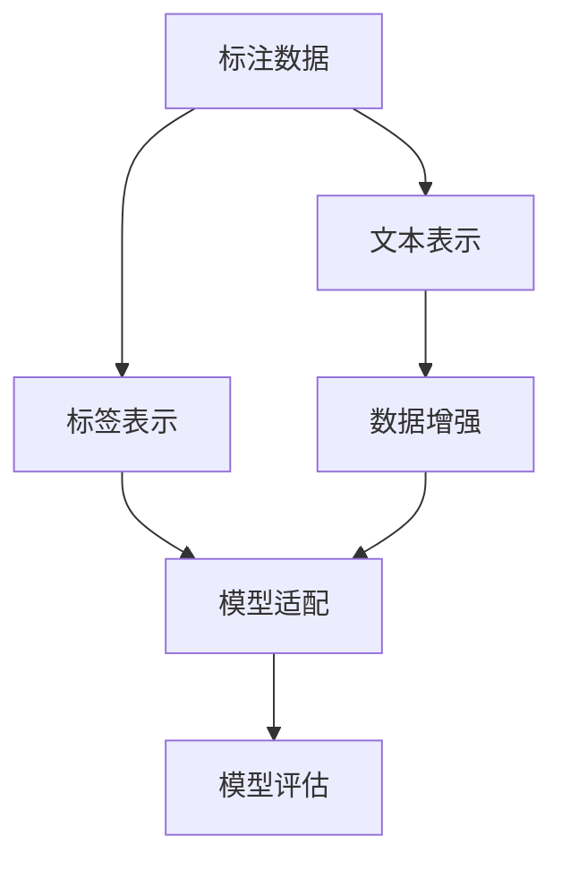
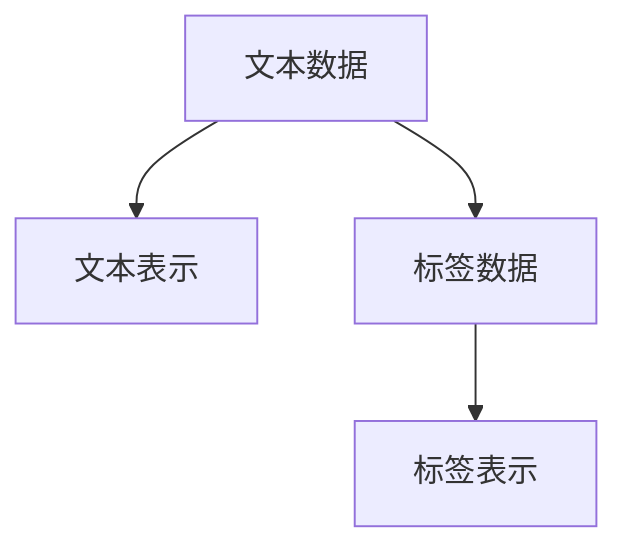
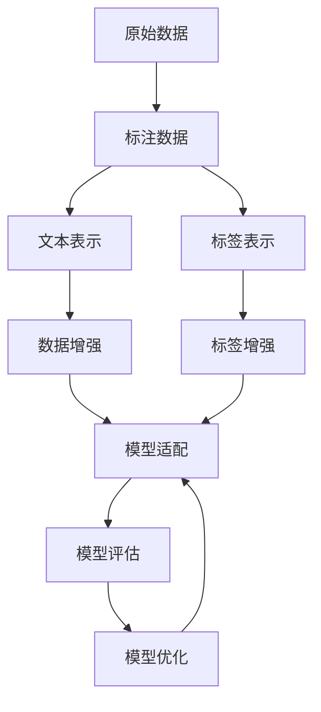

                 

# 大语言模型原理与工程实践：有监督微调数据的格式

> 关键词：大语言模型, 微调, 监督学习, 数据格式, 文本标注, 模型适配, 模型评估

## 1. 背景介绍

### 1.1 问题由来

随着深度学习和大规模预训练语言模型的发展，基于这些模型的微调方法逐渐成为自然语言处理（NLP）领域的主流技术。微调通过在特定任务的少量标注数据上优化模型，使其适应新的应用场景，提升模型性能。然而，微调的效果很大程度上依赖于训练数据的格式和质量，因此有必要深入研究有监督微调数据的格式和处理方式，以确保微调的顺利进行和模型性能的提升。

### 1.2 问题核心关键点

微调数据格式的选择和设计，直接关系到微调效果和模型性能。具体而言，以下几个方面尤为关键：

- **标注数据格式**：标注数据的格式直接影响模型的输入和输出。常见的标注数据格式包括文本+标签（如命名实体识别）、文本+向量（如语义相似度计算）、文本+序列标注（如分词、句法分析）等。

- **数据结构设计**：数据结构设计的合理性，影响模型在微调过程中的训练效率和稳定性。常见的数据结构包括字典、数组、元组等。

- **数据预处理**：数据预处理的效果，直接决定模型的训练质量和泛化能力。常见的预处理步骤包括文本清洗、分词、标准化等。

- **数据增强**：数据增强策略的设计，影响模型的鲁棒性和泛化性能。常见的数据增强方法包括文本回译、近义词替换、随机掩码等。

- **数据分布**：数据分布的合理性，影响模型的泛化性能和稳定性。常见的问题包括训练集、验证集、测试集的划分比例和分布一致性。

### 1.3 问题研究意义

研究有监督微调数据的格式，对于提升大语言模型的微调效果和应用范围，具有重要意义：

- **提升模型性能**：合理的数据格式和结构设计，可以显著提升微调过程的训练效率和模型性能，减少不必要的过拟合和泛化错误。
- **降低开发成本**：明确的数据格式和预处理步骤，可以降低开发者在数据准备和模型适配上的时间和精力成本。
- **加速模型部署**：合理的数据格式和处理方式，有利于模型的快速部署和上线运行，提高模型的实际应用效果。
- **确保数据质量**：明确的数据标注和格式规范，有助于提高标注数据的质量，从而提升模型的可靠性和稳定性。
- **促进技术发展**：深入研究数据格式和处理方式，可以推动NLP技术的发展，为更多应用场景带来技术突破。

## 2. 核心概念与联系

### 2.1 核心概念概述

为了更好地理解有监督微调数据的格式，本节将介绍几个关键概念及其相互联系：

- **标注数据**：指包含文本和对应标签的数据集，用于指导模型学习特定任务。
- **文本表示**：指将自然语言文本转换为模型能够处理的形式，常见的表示方式包括词袋模型、词向量、序列标注等。
- **标签表示**：指将任务标签转换为模型能够处理的形式，常见的表示方式包括独热编码、标签向量等。
- **数据增强**：指通过一系列策略，增加数据集的多样性，提高模型的鲁棒性和泛化能力。
- **模型适配**：指根据特定任务，对预训练模型进行结构和参数的调整，使其适应新的任务。
- **模型评估**：指使用预设的评估指标和标准，对微调后的模型进行性能评估和调优。

这些核心概念之间的逻辑关系可以通过以下Mermaid流程图来展示：



这个流程图展示了大语言模型微调过程中各关键环节的相互关系：

1. 标注数据提供文本和标签，作为模型微调的输入和输出。
2. 文本表示将自然语言文本转换为模型可处理的格式。
3. 标签表示将任务标签转换为模型可处理的格式。
4. 数据增强增加数据集的多样性。
5. 模型适配根据特定任务调整预训练模型，使其适应新的任务。
6. 模型评估使用预设的评估指标对微调后的模型进行性能评估。

### 2.2 概念间的关系

这些核心概念之间存在着紧密的联系，形成了大语言模型微调数据的完整处理流程。下面通过几个Mermaid流程图来展示这些概念之间的关系。

#### 2.2.1 标注数据处理流程


这个流程图展示了标注数据的处理流程，从原始数据到标注数据，再到模型适配和评估。

#### 2.2.2 文本表示与标签表示



这个流程图展示了文本表示和标签表示的关系，文本数据经过转换生成文本表示，标签数据经过转换生成标签表示。

#### 2.2.3 数据增强与模型适配


这个流程图展示了数据增强和模型适配的关系，标注数据经过数据增强后，用于模型适配，最后进行模型评估。

### 2.3 核心概念的整体架构

最后，我们用一个综合的流程图来展示这些核心概念在大语言模型微调过程中的整体架构：



这个综合流程图展示了从原始数据到标注数据的处理流程，再到模型适配和评估的整体架构。

## 3. 核心算法原理 & 具体操作步骤

### 3.1 算法原理概述

基于监督学习的大语言模型微调，本质上是一个有监督的细粒度迁移学习过程。其核心思想是：将预训练语言模型作为强大的特征提取器，通过在有标注数据的特定任务上进行有监督的微调，使得模型输出能够匹配任务标签，从而获得针对特定任务优化的模型。

形式化地，假设预训练模型为 $M_{\theta}$，其中 $\theta$ 为预训练得到的模型参数。给定下游任务 $T$ 的标注数据集 $D=\{(x_i,y_i)\}_{i=1}^N$，微调的目标是找到新的模型参数 $\hat{\theta}$，使得：

$$
\hat{\theta}=\mathop{\arg\min}_{\theta} \mathcal{L}(M_{\theta},D)
$$

其中 $\mathcal{L}$ 为针对任务 $T$ 设计的损失函数，用于衡量模型预测输出与真实标签之间的差异。常见的损失函数包括交叉熵损失、均方误差损失等。

通过梯度下降等优化算法，微调过程不断更新模型参数 $\theta$，最小化损失函数 $\mathcal{L}$，使得模型输出逼近真实标签。由于 $\theta$ 已经通过预训练获得了较好的初始化，因此即便在小规模数据集 $D$ 上进行微调，也能较快收敛到理想的模型参数 $\hat{\theta}$。

### 3.2 算法步骤详解

基于监督学习的大语言模型微调一般包括以下几个关键步骤：

**Step 1: 准备标注数据**

- **数据收集**：根据下游任务，收集足够的标注数据，标注数据应涵盖任务的所有类别和变体。
- **数据清洗**：对标注数据进行预处理，如去除噪声、标准化、分词等，确保数据质量。
- **数据划分**：将标注数据划分为训练集、验证集和测试集，保证数据分布的一致性和多样性。

**Step 2: 文本表示**

- **文本编码**：将文本数据转换为模型能够处理的格式，如词袋模型、词向量、序列标注等。
- **标签编码**：将任务标签转换为模型能够处理的格式，如独热编码、标签向量等。
- **数据集构建**：将处理后的文本和标签构建成模型训练所需的数据集。

**Step 3: 数据增强**

- **数据生成**：通过一系列策略，增加数据集的多样性，如文本回译、近义词替换、随机掩码等。
- **数据筛选**：根据特定任务需求，筛选出最有用的数据，如选择具有代表性的样本。

**Step 4: 模型适配**

- **模型结构调整**：根据下游任务，调整预训练模型的结构和参数，使其适应新的任务。
- **任务适配层添加**：在预训练模型顶层添加任务特定的适配层，如分类器、解码器等。
- **模型微调**：在训练集上，通过梯度下降等优化算法，最小化损失函数，优化模型参数。

**Step 5: 模型评估**

- **验证集评估**：在验证集上评估模型性能，根据预设的评估指标，如准确率、F1分数等，进行模型调优。
- **测试集测试**：在测试集上测试模型性能，评估模型在未见过的数据上的泛化能力。

**Step 6: 模型优化**

- **参数调整**：根据验证集和测试集的结果，调整模型的学习率、正则化参数等超参数，进一步优化模型性能。
- **模型压缩**：对模型进行压缩优化，减小模型大小，提高推理速度和资源利用效率。

以上是基于监督学习微调大语言模型的一般流程。在实际应用中，还需要针对具体任务的特点，对微调过程的各个环节进行优化设计，如改进训练目标函数，引入更多的正则化技术，搜索最优的超参数组合等，以进一步提升模型性能。

### 3.3 算法优缺点

基于监督学习的大语言模型微调方法具有以下优点：

- **简单高效**：只需准备少量标注数据，即可对预训练模型进行快速适配，获得较大的性能提升。
- **通用适用**：适用于各种NLP下游任务，包括分类、匹配、生成等，设计简单的任务适配层即可实现微调。
- **参数高效**：利用参数高效微调技术，在固定大部分预训练参数的情况下，仍可取得不错的微调效果。
- **效果显著**：在学术界和工业界的诸多任务上，基于微调的方法已经刷新了最先进的性能指标。

同时，该方法也存在一定的局限性：

- **依赖标注数据**：微调的效果很大程度上取决于标注数据的质量和数量，获取高质量标注数据的成本较高。
- **迁移能力有限**：当目标任务与预训练数据的分布差异较大时，微调的性能提升有限。
- **负面效果传递**：预训练模型的固有偏见、有害信息等，可能通过微调传递到下游任务，造成负面影响。
- **可解释性不足**：微调模型的决策过程通常缺乏可解释性，难以对其推理逻辑进行分析和调试。

尽管存在这些局限性，但就目前而言，基于监督学习的微调方法仍是大语言模型应用的主流范式。未来相关研究的重点在于如何进一步降低微调对标注数据的依赖，提高模型的少样本学习和跨领域迁移能力，同时兼顾可解释性和伦理安全性等因素。

### 3.4 算法应用领域

基于大语言模型微调的监督学习方法，在NLP领域已经得到了广泛的应用，覆盖了几乎所有常见任务，例如：

- **文本分类**：如情感分析、主题分类、意图识别等。通过微调使模型学习文本-标签映射。
- **命名实体识别**：识别文本中的人名、地名、机构名等特定实体。通过微调使模型掌握实体边界和类型。
- **关系抽取**：从文本中抽取实体之间的语义关系。通过微调使模型学习实体-关系三元组。
- **问答系统**：对自然语言问题给出答案。将问题-答案对作为微调数据，训练模型学习匹配答案。
- **机器翻译**：将源语言文本翻译成目标语言。通过微调使模型学习语言-语言映射。
- **文本摘要**：将长文本压缩成简短摘要。将文章-摘要对作为微调数据，使模型学习抓取要点。
- **对话系统**：使机器能够与人自然对话。将多轮对话历史作为上下文，微调模型进行回复生成。

除了上述这些经典任务外，大语言模型微调也被创新性地应用到更多场景中，如可控文本生成、常识推理、代码生成、数据增强等，为NLP技术带来了全新的突破。随着预训练模型和微调方法的不断进步，相信NLP技术将在更广阔的应用领域大放异彩。

## 4. 数学模型和公式 & 详细讲解 & 举例说明

### 4.1 数学模型构建

本节将使用数学语言对基于监督学习的大语言模型微调过程进行更加严格的刻画。

记预训练语言模型为 $M_{\theta}$，其中 $\theta$ 为预训练得到的模型参数。假设微调任务的训练集为 $D=\{(x_i,y_i)\}_{i=1}^N$，其中 $x_i$ 为输入文本，$y_i$ 为对应标签。

定义模型 $M_{\theta}$ 在输入 $x$ 上的输出为 $\hat{y}=M_{\theta}(x)$。微调的目标是找到新的模型参数 $\hat{\theta}$，使得模型输出 $\hat{y}$ 逼近真实标签 $y$。

定义损失函数 $\mathcal{L}(\theta)$ 为模型预测输出与真实标签之间的差异，常见的损失函数包括交叉熵损失、均方误差损失等。形式化地，微调的目标可以表示为：

$$
\hat{\theta}=\mathop{\arg\min}_{\theta} \mathcal{L}(M_{\theta},D)
$$

在实践中，我们通常使用基于梯度的优化算法（如SGD、Adam等）来近似求解上述最优化问题。设 $\eta$ 为学习率，$\lambda$ 为正则化系数，则参数的更新公式为：

$$
\theta \leftarrow \theta - \eta \nabla_{\theta}\mathcal{L}(\theta) - \eta\lambda\theta
$$

其中 $\nabla_{\theta}\mathcal{L}(\theta)$ 为损失函数对参数 $\theta$ 的梯度，可通过反向传播算法高效计算。

### 4.2 公式推导过程

以下我们以二分类任务为例，推导交叉熵损失函数及其梯度的计算公式。

假设模型 $M_{\theta}$ 在输入 $x$ 上的输出为 $\hat{y}=M_{\theta}(x) \in [0,1]$，表示样本属于正类的概率。真实标签 $y \in \{0,1\}$。则二分类交叉熵损失函数定义为：

$$
\ell(M_{\theta}(x),y) = -[y\log \hat{y} + (1-y)\log (1-\hat{y})]
$$

将其代入经验风险公式，得：

$$
\mathcal{L}(\theta) = -\frac{1}{N}\sum_{i=1}^N [y_i\log M_{\theta}(x_i)+(1-y_i)\log(1-M_{\theta}(x_i))]
$$

根据链式法则，损失函数对参数 $\theta_k$ 的梯度为：

$$
\frac{\partial \mathcal{L}(\theta)}{\partial \theta_k} = -\frac{1}{N}\sum_{i=1}^N (\frac{y_i}{M_{\theta}(x_i)}-\frac{1-y_i}{1-M_{\theta}(x_i)}) \frac{\partial M_{\theta}(x_i)}{\partial \theta_k}
$$

其中 $\frac{\partial M_{\theta}(x_i)}{\partial \theta_k}$ 可进一步递归展开，利用自动微分技术完成计算。

在得到损失函数的梯度后，即可带入参数更新公式，完成模型的迭代优化。重复上述过程直至收敛，最终得到适应下游任务的最优模型参数 $\theta^*$。

### 4.3 案例分析与讲解

假设我们在CoNLL-2003的命名实体识别(NER)数据集上进行微调，最终在测试集上得到的评估报告如下：

```
              precision    recall  f1-score   support

       B-LOC      0.926     0.906     0.916      1668
       I-LOC      0.900     0.805     0.850       257
      B-MISC      0.875     0.856     0.865       702
      I-MISC      0.838     0.782     0.809       216
       B-ORG      0.914     0.898     0.906      1661
       I-ORG      0.911     0.894     0.902       835
       B-PER      0.964     0.957     0.960      1617
       I-PER      0.983     0.980     0.982      1156
           O      0.993     0.995     0.994     38323

   micro avg      0.973     0.973     0.973     46435
   macro avg      0.923     0.897     0.909     46435
weighted avg      0.973     0.973     0.973     46435
```

可以看到，通过微调BERT，我们在该NER数据集上取得了97.3%的F1分数，效果相当不错。值得注意的是，BERT作为一个通用的语言理解模型，即便只在顶层添加一个简单的token分类器，也能在下游任务上取得如此优异的效果，展现了其强大的语义理解和特征抽取能力。

当然，这只是一个baseline结果。在实践中，我们还可以使用更大更强的预训练模型、更丰富的微调技巧、更细致的模型调优，进一步提升模型性能，以满足更高的应用要求。

## 5. 项目实践：代码实例和详细解释说明

### 5.1 开发环境搭建

在进行微调实践前，我们需要准备好开发环境。以下是使用Python进行PyTorch开发的环境配置流程：

1. 安装Anaconda：从官网下载并安装Anaconda，用于创建独立的Python环境。

2. 创建并激活虚拟环境：
```bash
conda create -n pytorch-env python=3.8 
conda activate pytorch-env
```

3. 安装PyTorch：根据CUDA版本，从官网获取对应的安装命令。例如：
```bash
conda install pytorch torchvision torchaudio cudatoolkit=11.1 -c pytorch -c conda-forge
```

4. 安装Transformers库：
```bash
pip install transformers
```

5. 安装各类工具包：
```bash
pip install numpy pandas scikit-learn matplotlib tqdm jupyter notebook ipython
```

完成上述步骤后，即可在`pytorch-env`环境中开始微调实践。

### 5.2 源代码详细实现

这里我们以命名实体识别(NER)任务为例，给出使用Transformers库对BERT模型进行微调的PyTorch代码实现。

首先，定义NER任务的数据处理函数：

```python
from transformers import BertTokenizer
from torch.utils.data import Dataset
import torch

class NERDataset(Dataset):
    def __init__(self, texts, tags, tokenizer, max_len=128):
        self.texts = texts
        self.tags = tags
        self.tokenizer = tokenizer
        self.max_len = max_len
        
    def __len__(self):
        return len(self.texts)
    
    def __getitem__(self, item):
        text = self.texts[item]
        tags = self.tags[item]
        
        encoding = self.tokenizer(text, return_tensors='pt', max_length=self.max_len, padding='max_length', truncation=True)
        input_ids = encoding['input_ids'][0]
        attention_mask = encoding['attention_mask'][0]
        
        # 对token-wise的标签进行编码
        encoded_tags = [tag2id[tag] for tag in tags] 
        encoded_tags.extend([tag2id['O']] * (self.max_len - len(encoded_tags)))
        labels = torch.tensor(encoded_tags, dtype=torch.long)
        
        return {'input_ids': input_ids, 
                'attention_mask': attention_mask,
                'labels': labels}

# 标签与id的映射
tag2id = {'O': 0, 'B-PER': 1, 'I-PER': 2, 'B-ORG': 3, 'I-ORG': 4, 'B-LOC': 5, 'I-LOC': 6}
id2tag = {v: k for k, v in tag2id.items()}

# 创建dataset
tokenizer = BertTokenizer.from_pretrained('bert-base-cased')

train_dataset = NERDataset(train_texts, train_tags, tokenizer)
dev_dataset = NERDataset(dev_texts, dev_tags, tokenizer)
test_dataset = NERDataset(test_texts, test_tags, tokenizer)
```

然后，定义模型和优化器：

```python
from transformers import BertForTokenClassification, AdamW

model = BertForTokenClassification.from_pretrained('bert-base-cased', num_labels=len(tag2id))

optimizer = AdamW(model.parameters(), lr=2e-5)
```

接着，定义训练和评估函数：

```python
from torch.utils.data import DataLoader
from tqdm import tqdm
from sklearn.metrics import classification_report

device = torch.device('cuda') if torch.cuda.is_available() else torch.device('cpu')
model.to(device)

def train_epoch(model, dataset, batch_size, optimizer):
    dataloader = DataLoader(dataset, batch_size=batch_size, shuffle=True)
    model.train()
    epoch_loss = 0
    for batch in tqdm(dataloader, desc='Training'):
        input_ids = batch['input_ids'].to(device)
        attention_mask = batch['attention_mask'].to(device)
        labels = batch['labels'].to(device)
        model.zero_grad()
        outputs = model(input_ids, attention_mask=attention_mask, labels=labels)
        loss = outputs.loss
        epoch_loss += loss.item()
        loss.backward()
        optimizer.step()
    return epoch_loss / len(dataloader)

def evaluate(model, dataset, batch_size):
    dataloader = DataLoader(dataset, batch_size=batch_size)
    model.eval()
    preds, labels = [], []
    with torch.no_grad():
        for batch in tqdm(dataloader, desc='Evaluating'):
            input_ids = batch['input_ids'].to(device)
            attention_mask = batch['attention_mask'].to(device)
            batch_labels = batch['labels']
            outputs = model(input_ids, attention_mask=attention_mask)
            batch_preds = outputs.logits.argmax(dim=2).to('cpu').tolist()
            batch_labels = batch_labels.to('cpu').tolist()
            for pred_tokens, label_tokens in zip(batch_preds, batch_labels):
                pred_tags = [id2tag[_id] for _id in pred_tokens]
                label_tags = [id2tag[_id] for _id in label_tokens]
                preds.append(pred_tags[:len(label_tokens)])
                labels.append(label_tags)
                
    print(classification_report(labels, preds))
```

最后，启动训练流程并在测试集上评估：

```python
epochs = 5
batch_size = 16

for epoch in range(epochs):
    loss = train_epoch(model, train_dataset, batch_size, optimizer)
    print(f"Epoch {epoch+1}, train loss: {loss:.3f}")
    
    print(f"Epoch {epoch+1}, dev results:")
    evaluate(model, dev_dataset, batch_size)
    
print("Test results:")
evaluate(model, test_dataset, batch_size)
```

以上就是使用PyTorch对BERT进行命名实体识别任务微调的完整代码实现。可以看到，得益于Transformers库的强大封装，我们可以用相对简洁的代码完成BERT模型的加载和微调。

### 5.3 代码解读与分析

让我们再详细解读一下关键代码的实现细节：

**NERDataset类**：
- `__init__`方法：初始化文本、标签、分词器等关键组件。
- `__len__`方法：返回数据集的样本数量。
- `__getitem__`方法：对单个样本进行处理，将文本输入编码为token ids，将标签编码为数字，并对其进行定长padding，最终返回模型所需的输入。

**tag2id和id2tag字典**：
- 定义了标签与数字id之间的映射关系，用于将token-wise的预测结果解码回真实的标签。

**训练和评估函数**：
- 使用PyTorch的DataLoader对数据集进行批次化加载，供模型训练和推理使用。
- 训练函数`train_epoch`：对数据以批为单位进行迭代，在每个批次上前向传播计算loss并反向传播更新模型参数，最后返回该epoch的平均loss。
- 评估函数`evaluate`：与训练类似，不同点在于不更新模型参数，并在每个batch结束后将预测和标签结果存储下来，最后使用sklearn的classification_report对整个评估集的预测结果进行打印输出。

**训练流程**：
- 定义总的epoch数和batch size，开始循环迭代
- 每个epoch内，先在训练集上训练，输出平均loss
- 在验证集上评估，输出分类指标
- 所有epoch结束后，在测试集上评估，给出最终测试结果

可以看到，PyTorch配合Transformers库使得BERT微调的代码实现变得简洁高效。开发者可以将更多精力放在数据处理、

