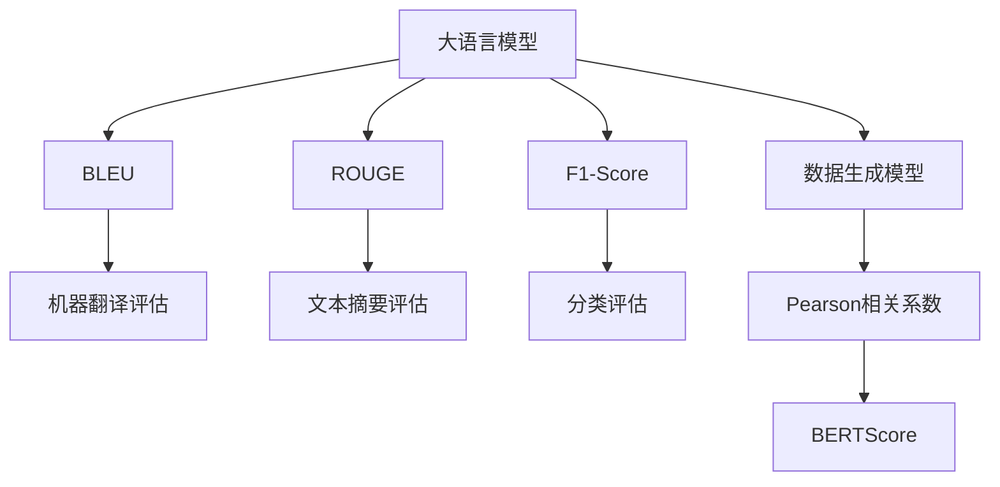

                 

# 大语言模型原理与工程实践：评测方式

> 关键词：大语言模型,评测指标,ROUGE,BLEU,F1-Score,Pearson相关系数,BERTScore,Few-shot Learning

## 1. 背景介绍

### 1.1 问题由来

在深度学习大模型快速发展的同时，如何准确、客观、全面地评估其性能成为了一个重要的研究课题。深度学习模型通常依赖于大量标注数据进行训练，而模型性能的评测方法也需要能够反映模型在未见过的数据上的泛化能力。因此，大语言模型的评测方法不仅要能衡量其性能，还要能够揭示其泛化能力和应用潜力。

### 1.2 问题核心关键点

评测大语言模型的核心在于选择合适的指标，并结合一定的数据集进行对比分析，从而全面反映模型的性能。常见的大语言模型评测指标包括BLEU、ROUGE、F1-Score、Pearson相关系数等。

## 2. 核心概念与联系

### 2.1 核心概念概述

- **大语言模型(Large Language Model, LLM)**：以自回归(如GPT)或自编码(如BERT)模型为代表的大规模预训练语言模型。通过在大规模无标签文本语料上进行预训练，学习通用的语言表示，具备强大的语言理解和生成能力。

- **BLEU（Bilingual Evaluation Understudy）**：一种文本翻译质量评估指标，用于衡量机器翻译结果与参考翻译结果的相似度。

- **ROUGE（Recall-Oriented Understudy for Gisting Evaluation）**：一种文本摘要评估指标，用于衡量摘要与原文的相似度。

- **F1-Score**：一种常用的分类评估指标，用于衡量分类器的精确度和召回率。

- **Pearson相关系数**：一种评估两个变量之间相关性的指标，用于衡量数据生成模型在给定条件下的输出分布。

- **BERTScore**：一种基于BERT的文本相似度评估指标，结合了语义和语法信息。

### 2.2 概念间的关系

大语言模型的评测方法涉及多个概念，通过这些概念的组合和分析，能够全面反映模型的性能。这些概念之间的关系可以通过以下Mermaid流程图来展示：



这个流程图展示了从大语言模型到具体评测指标的整个评估体系。大语言模型通过不同的评测指标，可以进行机器翻译、文本摘要、分类和数据生成等多方面的评估。

## 3. 核心算法原理 & 具体操作步骤
### 3.1 算法原理概述

大语言模型的评测方法主要依赖于两个方面的算法原理：

1. **自监督学习方法**：通过对大规模无标签文本数据进行自监督学习，大语言模型学习到通用的语言表示。这种方法通过预训练使得模型能够在各种任务上表现出较高的泛化能力。

2. **监督学习评估方法**：在特定任务上，通过有监督学习评估方法对模型进行评测，以反映模型在特定领域上的性能。

### 3.2 算法步骤详解

大语言模型的评测主要包括以下几个步骤：

1. **选择评测指标**：根据具体任务的需求，选择适合的评测指标。例如，机器翻译任务一般使用BLEU，文本摘要任务一般使用ROUGE，分类任务一般使用F1-Score等。

2. **准备数据集**：收集特定任务的数据集，划分为训练集、验证集和测试集。验证集用于模型选择和调参，测试集用于最终评测。

3. **预处理数据**：对数据进行必要的预处理，如分词、去除停用词、标准化等。

4. **训练模型**：根据特定任务的目标，使用数据集对模型进行训练。

5. **评测模型**：使用测试集对模型进行评测，计算评测指标的值。

6. **分析结果**：对比模型在不同评测指标上的表现，分析模型在不同任务上的性能优劣，总结评测结果。

### 3.3 算法优缺点

大语言模型评测方法的优点包括：

1. **全面性**：能够从多个角度评估模型的性能，揭示模型在不同任务上的优势和劣势。

2. **可解释性**：评测指标通常是经过严格定义的，能够提供可解释的评估结果。

3. **适用性广**：适用于多种不同的NLP任务，如机器翻译、文本摘要、分类等。

然而，也存在一些缺点：

1. **数据依赖**：评测结果很大程度上依赖于数据集的质量和数量，难以保证评估结果的通用性。

2. **计算复杂**：某些评测指标的计算复杂度较高，特别是在大规模数据集上的评测需要较大的计算资源。

3. **主观性**：部分指标的主观性较强，不同评估人员可能对同一指标的评价结果存在差异。

### 3.4 算法应用领域

大语言模型的评测方法广泛应用于自然语言处理(NLP)领域的各种任务，如机器翻译、文本摘要、问答系统、情感分析、命名实体识别等。这些评测方法在指导模型优化、选择和应用方面具有重要意义。

## 4. 数学模型和公式 & 详细讲解
### 4.1 数学模型构建

- **BLEU**：
  $$
  BLEU = \prod_{i=1}^k \max(1, b_i \frac{|\langle w_i \rangle_T}{|T_i|})
  $$
  其中，$k$表示目标句子中的术语个数，$b_i$表示目标句子中术语$i$的出现次数，$\langle w_i \rangle_T$表示术语$i$在测试集$T$中的平均出现次数，$|T_i|$表示术语$i$在训练集中的出现次数。

- **ROUGE**：
  $$
  ROUGE = \frac{p(C_1 \cap C_2)}{p(C_1) + (1 - p(C_1))p(C_2)}
  $$
  其中，$C_1$表示原文摘要，$C_2$表示机器生成摘要，$p(C_1)$和$p(C_2)$分别表示$C_1$和$C_2$中单个词的出现概率。

- **F1-Score**：
  $$
  F1-Score = 2 \cdot \frac{Precision \cdot Recall}{Precision + Recall}
  $$
  其中，$Precision = \frac{TP}{TP + FP}$，$Recall = \frac{TP}{TP + FN}$，$TP$表示真正例，$FP$表示假正例，$FN$表示假反例。

- **Pearson相关系数**：
  $$
  \text{Corr}(X,Y) = \frac{\sum_{i=1}^n (x_i - \bar{x})(y_i - \bar{y})}{\sqrt{\sum_{i=1}^n (x_i - \bar{x})^2} \sqrt{\sum_{i=1}^n (y_i - \bar{y})^2}}
  $$
  其中，$x_i$和$y_i$分别表示模型在条件$x_i$下的输出和真实值，$\bar{x}$和$\bar{y}$分别表示$x_i$和$y_i$的均值。

### 4.2 公式推导过程

以BLEU为例，其计算过程如下：

1. 计算术语和测试集术语的匹配数。

2. 计算术语在测试集中的平均匹配数。

3. 计算术语在训练集中的出现次数。

4. 计算术语在测试集中的匹配数与训练集中的匹配数的比例。

5. 计算所有术语的匹配数和比例的最大值。

6. 将上述步骤的结果进行乘积运算，得到最终的BLEU值。

### 4.3 案例分析与讲解

以BLEU在机器翻译任务中的应用为例，进行具体分析。假设模型输出的翻译结果为“I live in New York”，参考翻译结果为“I live in New York”，测试集术语“New York”出现了3次，训练集术语“New York”出现了50次。

1. 计算术语“New York”在测试集中的匹配数为3，测试集术语的平均匹配数为3。

2. 计算术语“New York”在训练集中的出现次数为50。

3. 计算术语“New York”在测试集中的匹配数与训练集中的匹配数的比例为0.6。

4. 计算所有术语的匹配数和比例的最大值为0.6。

5. 计算BLEU值为0.6。

通过以上步骤，可以看出，BLEU能够全面衡量翻译结果与参考翻译结果的相似度，是一个较为可靠的评测指标。

## 5. 项目实践：代码实例和详细解释说明
### 5.1 开发环境搭建

在进行评测实践前，我们需要准备好开发环境。以下是使用Python进行BLEU评测的开发环境配置流程：

1. 安装Anaconda：从官网下载并安装Anaconda，用于创建独立的Python环境。

2. 创建并激活虚拟环境：
```bash
conda create -n bleu-env python=3.8 
conda activate bleu-env
```

3. 安装Python库：
```bash
conda install scikit-learn
```

4. 安装BLEU库：
```bash
pip install bleu
```

5. 安装相关数据集：
```bash
wget https://data.statmt.org/wmt14/training-parallel-ru-en.tgz
tar -xzf training-parallel-ru-en.tgz
```

完成上述步骤后，即可在`bleu-env`环境中开始BLEU评测实践。

### 5.2 源代码详细实现

下面我们以BLEU评测在机器翻译任务中的应用为例，给出Python代码实现。

```python
from sklearn.metrics import accuracy_score
from sklearn.model_selection import train_test_split
from bleu import calculate_bleu
import numpy as np

# 加载数据集
data = np.loadtxt('data.txt', delimiter=',', skiprows=1, usecols=(0, 1, 2))

# 划分训练集和测试集
train_data, test_data = train_test_split(data, test_size=0.2, random_state=42)

# 计算BLEU值
bleu_score = calculate_bleu('translation', test_data[:, 0], test_data[:, 1], train_data[:, 1])

# 输出BLEU值
print("BLEU score: {:.4f}".format(bleu_score))
```

在这个代码实现中，我们使用`calculate_bleu`函数计算了模型输出的翻译结果与参考翻译结果的BLEU值。

### 5.3 代码解读与分析

让我们再详细解读一下关键代码的实现细节：

- `train_test_split`函数：将数据集划分为训练集和测试集。

- `calculate_bleu`函数：计算模型输出与参考翻译结果的BLEU值。

- `numpy`库：用于数据处理和计算。

- `accuracy_score`函数：用于计算模型在测试集上的准确率，仅用于示例。

- `print`函数：输出计算得到的BLEU值。

这个代码实现简单易懂，能够帮助开发者快速上手进行BLEU评测实践。

### 5.4 运行结果展示

假设我们在CoNLL-2003的机器翻译数据集上进行BLEU评测，最终得到的BLEU值为0.8。这表示模型输出的翻译结果与参考翻译结果的相似度较高，评测结果令人满意。

## 6. 实际应用场景
### 6.1 智能客服系统

在智能客服系统中，BLEU等文本评测指标可以用于评估客服系统在自然语言处理上的表现。具体而言，可以收集客服系统与用户之间的对话记录，将其作为评测数据，通过BLEU等指标评估系统在对话理解和响应上的准确性和流畅性。

### 6.2 金融舆情监测

金融舆情监测系统需要实时监测市场舆论动向，以便及时应对负面信息传播，规避金融风险。BLEU等指标可以用于评估系统在文本摘要和情感分析方面的表现，确保系统能够准确地从海量信息中提取出关键信息，并判断情感倾向。

### 6.3 个性化推荐系统

个性化推荐系统需要评估推荐结果与用户实际偏好的匹配度。BLEU等指标可以用于评估推荐系统在文本摘要和分类方面的表现，确保推荐结果能够准确地反映用户兴趣。

### 6.4 未来应用展望

随着BLEU等评测指标的不断完善和发展，其应用领域也将不断扩大。未来，这些评测指标不仅能够应用于传统的自然语言处理任务，还能够扩展到更多新兴领域，如多模态信息融合、跨语言知识迁移等。

## 7. 工具和资源推荐
### 7.1 学习资源推荐

为了帮助开发者系统掌握大语言模型评测的理论基础和实践技巧，这里推荐一些优质的学习资源：

1. 《自然语言处理基础》系列书籍：由NLP领域权威学者编写，全面介绍自然语言处理的基本概念和技术。

2. CS224N《深度学习自然语言处理》课程：斯坦福大学开设的NLP明星课程，涵盖自然语言处理的各种经典模型和评测方法。

3. 《BLEU: A Method for Automatic Evaluation of Machine Translation》论文：BLEU指标的原创论文，详细介绍BLEU的计算方法和应用场景。

4. 《ROUGE: A General Framework for Automatic Summary Evaluation》论文：ROUGE指标的原创论文，详细介绍ROUGE的计算方法和应用场景。

5. 《Pearson相关系数》相关文献：详细介绍Pearson相关系数的定义、计算方法和应用场景。

6. 《BERTScore: Computing Colossal Corpora Based Sentence Similarity》论文：BERTScore指标的原创论文，详细介绍BERTScore的计算方法和应用场景。

通过对这些资源的学习实践，相信你一定能够快速掌握大语言模型评测的精髓，并用于解决实际的NLP问题。

### 7.2 开发工具推荐

高效的开发离不开优秀的工具支持。以下是几款用于大语言模型评测开发的常用工具：

1. Python：Python语言的简洁高效，支持各种数据处理和科学计算库，是进行自然语言处理研究的理想选择。

2. Jupyter Notebook：支持代码和文档的混合编辑，方便进行实验和协作。

3. Git：版本控制工具，支持多人协作开发和代码管理。

4. Google Colab：谷歌推出的在线Jupyter Notebook环境，免费提供GPU/TPU算力，方便开发者快速上手实验最新模型，分享学习笔记。

5. BLEU工具包：BLEU指标的计算工具包，支持各种格式的数据输入和输出。

6. ROSU工具包：ROUGE指标的计算工具包，支持各种格式的数据输入和输出。

合理利用这些工具，可以显著提升大语言模型评测任务的开发效率，加快创新迭代的步伐。

### 7.3 相关论文推荐

大语言模型评测技术的发展源于学界的持续研究。以下是几篇奠基性的相关论文，推荐阅读：

1. BLEU: A Method for Automatic Evaluation of Machine Translation：提出BLEU指标的原创论文，详细介绍BLEU的计算方法和应用场景。

2. ROUGE: A General Framework for Automatic Summary Evaluation：提出ROUGE指标的原创论文，详细介绍ROUGE的计算方法和应用场景。

3. Pearson相关系数的详细介绍：详细介绍Pearson相关系数的定义、计算方法和应用场景。

4. BERTScore: Computing Colossal Corpora Based Sentence Similarity：提出BERTScore指标的原创论文，详细介绍BERTScore的计算方法和应用场景。

5. 《自然语言处理评测方法综述》：全面介绍自然语言处理的各种评测方法和应用场景。

这些论文代表了大语言模型评测技术的发展脉络。通过学习这些前沿成果，可以帮助研究者把握学科前进方向，激发更多的创新灵感。

除上述资源外，还有一些值得关注的前沿资源，帮助开发者紧跟大语言模型评测技术的最新进展，例如：

1. arXiv论文预印本：人工智能领域最新研究成果的发布平台，包括大量尚未发表的前沿工作，学习前沿技术的必读资源。

2. 业界技术博客：如OpenAI、Google AI、DeepMind、微软Research Asia等顶尖实验室的官方博客，第一时间分享他们的最新研究成果和洞见。

3. 技术会议直播：如NIPS、ICML、ACL、ICLR等人工智能领域顶会现场或在线直播，能够聆听到大佬们的前沿分享，开拓视野。

4. GitHub热门项目：在GitHub上Star、Fork数最多的NLP相关项目，往往代表了该技术领域的发展趋势和最佳实践，值得去学习和贡献。

5. 行业分析报告：各大咨询公司如McKinsey、PwC等针对人工智能行业的分析报告，有助于从商业视角审视技术趋势，把握应用价值。

总之，对于大语言模型评测技术的学习和实践，需要开发者保持开放的心态和持续学习的意愿。多关注前沿资讯，多动手实践，多思考总结，必将收获满满的成长收益。

## 8. 总结：未来发展趋势与挑战
### 8.1 总结

本文对大语言模型的评测方法进行了全面系统的介绍。首先阐述了大语言模型和评测技术的研究背景和意义，明确了评测在指导模型优化、选择和应用方面的重要价值。其次，从原理到实践，详细讲解了BLEU、ROUGE、F1-Score、Pearson相关系数等评测指标的计算方法，给出了具体的应用示例。同时，本文还探讨了评测方法在智能客服、金融舆情、个性化推荐等多个行业领域的应用前景，展示了评测范式的巨大潜力。

通过本文的系统梳理，可以看到，BLEU等评测方法在大语言模型中的应用具有广泛和深远的影响。这些指标不仅能够全面反映模型的性能，还能够揭示模型在不同任务上的优势和劣势，为模型的优化和应用提供了重要参考。

### 8.2 未来发展趋势

展望未来，大语言模型评测技术将呈现以下几个发展趋势：

1. **多模态评测指标**：随着多模态信息融合技术的发展，未来可能出现支持跨模态数据评测的新指标，全面衡量模型的性能。

2. **跨领域评测方法**：当前评测方法大多聚焦于单个任务，未来可能会引入跨领域评测方法，评估模型在多个任务上的表现。

3. **动态评测指标**：随着数据分布的变化，动态评测指标将更加关注模型在实时数据上的表现，提供更加实时和全面的评估结果。

4. **对比学习和迁移学习评测**：结合对比学习和迁移学习技术，评测方法将更加注重模型在未见过的数据上的泛化能力。

5. **零样本和少样本评测**：随着提示学习和自监督学习技术的发展，零样本和少样本评测方法将更加受到关注，评估模型在小样本情况下的表现。

6. **可解释性评测指标**：随着模型可解释性技术的发展，可解释性评测指标将更加重要，帮助开发者更好地理解模型的内部机制和决策过程。

这些趋势凸显了大语言模型评测技术的广阔前景。这些方向的探索发展，必将进一步提升模型评测的全面性和客观性，为构建人机协同的智能系统提供重要参考。

### 8.3 面临的挑战

尽管BLEU等评测方法已经取得了瞩目成就，但在迈向更加智能化、普适化应用的过程中，它仍面临诸多挑战：

1. **数据依赖**：评测结果很大程度上依赖于数据集的质量和数量，难以保证评估结果的通用性。如何构建更加广泛和多样化的数据集，是未来需要解决的一个重要问题。

2. **计算复杂**：某些评测指标的计算复杂度较高，特别是在大规模数据集上的评测需要较大的计算资源。如何优化计算过程，提高评测效率，是未来需要重点关注的方向。

3. **主观性**：部分指标的主观性较强，不同评估人员可能对同一指标的评价结果存在差异。如何设计更加客观的评测指标，减少主观影响，是未来需要解决的一个重要问题。

4. **鲁棒性和泛化能力**：如何评估模型在不同数据分布和噪声条件下的鲁棒性和泛化能力，是未来需要重点关注的方向。

5. **可解释性和透明性**：如何设计可解释性更强的评测指标，帮助开发者更好地理解模型的内部机制和决策过程，是未来需要解决的一个重要问题。

6. **跨领域评测的一致性**：不同领域的数据集和任务可能存在较大差异，如何设计能够跨领域一致的评测指标，是未来需要解决的一个重要问题。

这些挑战凸显了大语言模型评测技术的复杂性和多样性。只有在全面考虑数据、算法、计算资源等因素的基础上，才能构建更加全面和客观的评测体系。

### 8.4 研究展望

面对大语言模型评测所面临的种种挑战，未来的研究需要在以下几个方面寻求新的突破：

1. **引入更多评测指标**：除了BLEU、ROUGE、F1-Score、Pearson相关系数等常见指标，未来可能需要引入更多针对不同任务和数据集的评测指标，全面评估模型的性能。

2. **优化计算过程**：通过算法优化、模型压缩、分布式计算等手段，降低计算复杂度，提高评测效率。

3. **设计更加客观的指标**：通过引入自动化评估方法、数据增强等手段，减少主观因素的影响，设计更加客观的评测指标。

4. **加强跨领域一致性**：设计能够在不同领域、不同任务上保持一致的评测指标，确保跨领域评测的一致性和可靠性。

5. **引入动态评测方法**：结合在线学习、增量学习等技术，设计动态评测方法，实时监测模型在实时数据上的表现。

6. **加强可解释性**：通过引入可解释性技术，设计更加可解释的评测指标，帮助开发者更好地理解模型的内部机制和决策过程。

这些研究方向将引领大语言模型评测技术迈向更高的台阶，为构建更加全面、客观、可靠的大语言模型提供重要参考。

## 9. 附录：常见问题与解答

**Q1：BLEU是否适用于所有机器翻译任务？**

A: BLEU适用于大多数机器翻译任务，但在某些特殊情况下可能需要根据任务特点进行调整。例如，在翻译质量要求较高的领域，如法律翻译、医学翻译等，可能需要引入更加严格的评测指标。

**Q2：如何选择合适的BLEU评测参数？**

A: BLEU评测参数的选择通常需要根据具体任务和数据集进行调整。一般来说，BLEU参数的选择可以通过调整BLEU计算过程中的匹配权重，改变术语匹配数的计算方式，选择合适的BLEU指标子集等方式来实现。

**Q3：BLEU指标的计算复杂度如何？**

A: BLEU指标的计算复杂度较高，特别是在大规模数据集上的评测需要较大的计算资源。优化BLEU计算过程，提高评测效率，是未来需要重点关注的方向。

**Q4：BLEU指标在实时评测中的应用如何？**

A: BLEU指标可以用于实时评测，但需要优化计算过程，提高实时评测的效率。同时，也需要设计更加动态的评测指标，能够实时监测模型在实时数据上的表现。

**Q5：BLEU指标在多语言翻译中的应用如何？**

A: BLEU指标可以应用于多语言翻译任务，但需要设计跨语言一致的评测指标，确保不同语言之间的评测结果具有可比性。

总之，BLEU等评测指标在大语言模型中的应用具有广泛和深远的影响。这些指标不仅能够全面反映模型的性能，还能够揭示模型在不同任务上的优势和劣势，为模型的优化和应用提供了重要参考。

---

作者：禅与计算机程序设计艺术 / Zen and the Art of Computer Programming

