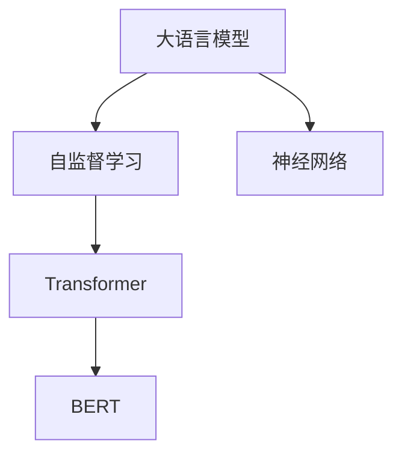
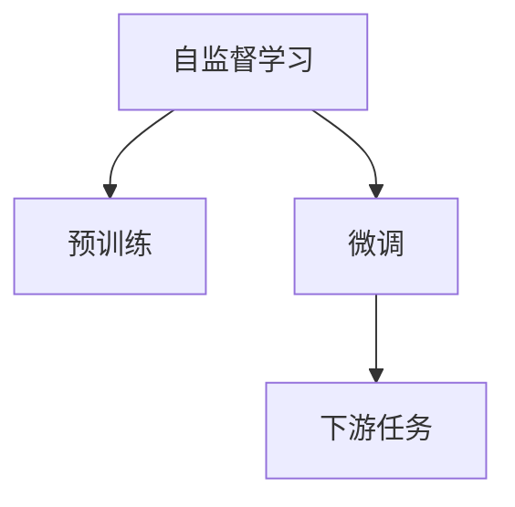
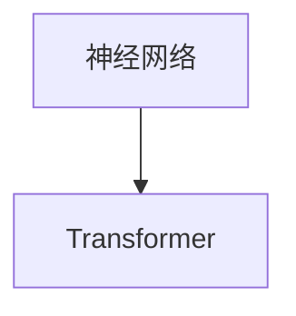
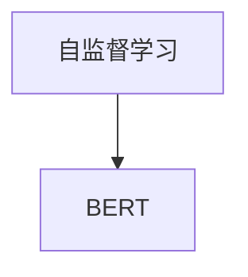
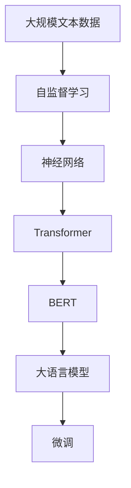

                 

# 大语言模型原理基础与前沿 语言建模的挑战

> 关键词：大语言模型,语言建模,神经网络,Transformer,BERT,预训练,自监督学习,语言生成,自然语言处理(NLP)

## 1. 背景介绍

### 1.1 问题由来

语言是人类最重要的交流工具，也是人工智能技术的核心研究领域之一。传统的自然语言处理（NLP）技术主要包括分词、词性标注、命名实体识别、信息抽取、文本分类、情感分析、机器翻译、文本生成等。近年来，随着深度学习技术的飞速发展，大语言模型（Large Language Models, LLMs）开始在NLP领域崭露头角。

大语言模型通过在大规模无标签文本语料上进行预训练，学习到丰富的语言知识，可以理解复杂的语言结构和上下文信息，在多项NLP任务上取得了显著的性能提升。BERT、GPT等大语言模型通过预训练-微调的方法，已经广泛应用于各种NLP任务中。但这些模型仍然面临一些挑战，包括模型规模庞大、计算资源需求高、微调数据需求大、模型推理效率低等。

### 1.2 问题核心关键点

大语言模型的核心挑战在于如何在大规模无标签数据上进行高效、有效的语言建模，并在此基础上进行快速微调，以适应特定的下游任务。具体来说，大语言模型面临以下问题：

- **数据需求大**：大语言模型需要海量的无标签数据进行预训练，以便捕捉到语言的全局结构和语义信息。
- **计算资源需求高**：大模型需要大量GPU或TPU等高性能设备进行训练和推理，计算资源投入巨大。
- **模型复杂度高**：大语言模型通常含有数十亿个参数，结构复杂，难以解释。
- **推理效率低**：大模型在推理过程中计算量大，速度慢，难以满足实际应用需求。

### 1.3 问题研究意义

研究大语言模型的挑战，对于推动NLP技术的进一步发展和应用，具有重要意义：

1. **提升模型性能**：通过优化语言建模和微调过程，提升大语言模型在特定任务上的表现。
2. **降低成本**：探索参数高效和计算高效的微调方法，降低对数据和计算资源的需求。
3. **拓展应用场景**：通过优化推理速度和模型结构，拓展大语言模型的应用场景，提升其商业价值。
4. **推动技术进步**：深入理解语言模型的挑战，促进相关算法和技术的不断进步。

## 2. 核心概念与联系

### 2.1 核心概念概述

为更好地理解大语言模型面临的挑战，本节将介绍几个密切相关的核心概念：

- **大语言模型**：如BERT、GPT等通过大规模无标签数据进行预训练的语言模型，具有强大的语言理解和生成能力。
- **自监督学习**：在大规模无标签数据上，通过设计预训练任务（如掩码语言模型、预测下一位单词等）训练模型。
- **神经网络**：基于生物神经网络的计算模型，广泛用于深度学习任务中。
- **Transformer**：一种自注意力机制的神经网络架构，用于处理序列数据，如NLP中的文本。
- **BERT**：基于自监督学习的语言模型，通过双向训练和跨层预测，显著提升语言理解能力。
- **自监督学习**：在大规模无标签数据上，通过设计预训练任务（如掩码语言模型、预测下一位单词等）训练模型。

这些核心概念之间的逻辑关系可以通过以下Mermaid流程图来展示：



这个流程图展示了核心概念之间的关系：

1. 大语言模型通过自监督学习获得基础能力。
2. 神经网络架构是Transformer和BERT等模型的基础。
3. Transformer是一种具体的神经网络架构，常用于语言模型的预训练和微调。
4. BERT基于自监督学习的语言模型，使用Transformer作为其预训练架构。

### 2.2 概念间的关系

这些核心概念之间存在着紧密的联系，形成了大语言模型的完整生态系统。下面我们通过几个Mermaid流程图来展示这些概念之间的关系。

#### 2.2.1 大语言模型的学习范式


这个流程图展示了大语言模型的基本学习范式，即通过自监督学习获得基础能力，通过微调适配特定任务。

#### 2.2.2 自监督学习与微调的关系



这个流程图展示了自监督学习与微调的关系，即预训练是大语言模型获得基础能力的过程，微调是适配特定任务的过程。

#### 2.2.3 神经网络与Transformer的关系



这个流程图展示了神经网络与Transformer的关系，即Transformer是神经网络架构中的一种。

#### 2.2.4 BERT与自监督学习的关系



这个流程图展示了BERT与自监督学习的关系，即BERT是自监督学习得到的一种具体模型。

### 2.3 核心概念的整体架构

最后，我们用一个综合的流程图来展示这些核心概念在大语言模型学习过程中的整体架构：



这个综合流程图展示了从大规模文本数据到微调大语言模型的完整过程。

## 3. 核心算法原理 & 具体操作步骤
### 3.1 算法原理概述

大语言模型通过自监督学习在大规模无标签数据上进行预训练，学习到丰富的语言知识和特征。具体来说，自监督学习的目标是最大化模型的预测能力，通过构建预测任务，让模型学习到数据的内在结构。常用的自监督任务包括掩码语言模型（Masked Language Modeling, MLM）、下一句预测（Next Sentence Prediction, NSP）等。

在预训练完成后，大语言模型通过微调来适配特定任务。微调的目标是最大化模型在特定任务上的表现，通过有监督的训练，调整模型参数，使其能够更好地理解和处理特定任务。微调过程通常涉及以下步骤：

1. 准备下游任务的标注数据集。
2. 设计合适的任务适配层，如分类器、解码器等。
3. 设置合适的微调超参数，如学习率、批大小、迭代轮数等。
4. 在微调数据集上进行有监督的训练，更新模型参数。
5. 在验证集上评估模型性能，避免过拟合。
6. 在测试集上评估微调后模型的性能。

### 3.2 算法步骤详解

以下是基于监督学习的大语言模型微调的一般步骤：

**Step 1: 准备预训练模型和数据集**
- 选择合适的预训练模型，如BERT、GPT等。
- 准备下游任务的标注数据集，划分为训练集、验证集和测试集。

**Step 2: 添加任务适配层**
- 根据任务类型，设计合适的任务适配层，如分类器、解码器等。
- 对于分类任务，通常使用线性分类器。
- 对于生成任务，通常使用语言模型的解码器。

**Step 3: 设置微调超参数**
- 选择合适的优化算法及其参数，如AdamW、SGD等。
- 设置学习率、批大小、迭代轮数等超参数。
- 应用正则化技术，如L2正则、Dropout等，防止过拟合。

**Step 4: 执行梯度训练**
- 将训练集数据分批次输入模型，前向传播计算损失函数。
- 反向传播计算参数梯度，根据设定的优化算法和学习率更新模型参数。
- 周期性在验证集上评估模型性能，根据性能指标决定是否触发Early Stopping。
- 重复上述步骤直至满足预设的迭代轮数或Early Stopping条件。

**Step 5: 测试和部署**
- 在测试集上评估微调后模型性能，对比微调前后的精度提升。
- 使用微调后的模型对新样本进行推理预测，集成到实际应用系统中。

### 3.3 算法优缺点

基于监督学习的大语言模型微调方法具有以下优点：

- **简单高效**：只需要准备少量标注数据，即可对预训练模型进行快速适配，获得较大的性能提升。
- **通用适用**：适用于各种NLP下游任务，包括分类、匹配、生成等，设计简单的任务适配层即可实现微调。
- **参数高效**：利用参数高效微调技术，在固定大部分预训练参数的情况下，仍可取得不错的提升。
- **效果显著**：在学术界和工业界的诸多任务上，基于微调的方法已经刷新了多项NLP任务SOTA。

同时，该方法也存在一定的局限性：

- **依赖标注数据**：微调的效果很大程度上取决于标注数据的质量和数量，获取高质量标注数据的成本较高。
- **迁移能力有限**：当目标任务与预训练数据的分布差异较大时，微调的性能提升有限。
- **负面效果传递**：预训练模型的固有偏见、有害信息等，可能通过微调传递到下游任务，造成负面影响。
- **可解释性不足**：微调模型的决策过程通常缺乏可解释性，难以对其推理逻辑进行分析和调试。

尽管存在这些局限性，但就目前而言，基于监督学习的微调方法仍是大语言模型应用的最主流范式。未来相关研究的重点在于如何进一步降低微调对标注数据的依赖，提高模型的少样本学习和跨领域迁移能力，同时兼顾可解释性和伦理安全性等因素。

### 3.4 算法应用领域

基于大语言模型微调的监督学习方法，在NLP领域已经得到了广泛的应用，覆盖了几乎所有常见任务，例如：

- **文本分类**：如情感分析、主题分类、意图识别等。通过微调使模型学习文本-标签映射。
- **命名实体识别**：识别文本中的人名、地名、机构名等特定实体。通过微调使模型掌握实体边界和类型。
- **关系抽取**：从文本中抽取实体之间的语义关系。通过微调使模型学习实体-关系三元组。
- **问答系统**：对自然语言问题给出答案。将问题-答案对作为微调数据，训练模型学习匹配答案。
- **机器翻译**：将源语言文本翻译成目标语言。通过微调使模型学习语言-语言映射。
- **文本摘要**：将长文本压缩成简短摘要。将文章-摘要对作为微调数据，使模型学习抓取要点。
- **对话系统**：使机器能够与人自然对话。将多轮对话历史作为上下文，微调模型进行回复生成。

除了上述这些经典任务外，大语言模型微调还被创新性地应用到更多场景中，如可控文本生成、常识推理、代码生成、数据增强等，为NLP技术带来了全新的突破。随着预训练模型和微调方法的不断进步，相信NLP技术将在更广阔的应用领域大放异彩。

## 4. 数学模型和公式 & 详细讲解 & 举例说明
### 4.1 数学模型构建

大语言模型的预训练和微调过程通常使用深度学习框架实现。下面以PyTorch为例，展示如何使用神经网络实现语言模型的预训练和微调。

**Step 1: 准备预训练模型和数据集**

```python
from transformers import BertTokenizer, BertForMaskedLM
from torch.utils.data import Dataset, DataLoader
import torch
import numpy as np

# 定义数据集
class MaskedLMDataset(Dataset):
    def __init__(self, texts, tokenizer):
        self.tokenizer = tokenizer
        self.texts = texts

    def __len__(self):
        return len(self.texts)

    def __getitem__(self, idx):
        input_ids, masked_pos = self.tokenizer(texts[idx], return_tensors='pt', padding='max_length', truncation=True, max_length=512)
        input_ids = input_ids[:, :512]
        return {'input_ids': input_ids, 'masked_pos': masked_pos}

# 定义模型
tokenizer = BertTokenizer.from_pretrained('bert-base-uncased')
model = BertForMaskedLM.from_pretrained('bert-base-uncased')

# 准备数据集
texts = ["I love eating apples", "Bob eats a book in the library"]
dataset = MaskedLMDataset(texts, tokenizer)
dataloader = DataLoader(dataset, batch_size=2, shuffle=True)
```

**Step 2: 添加任务适配层**

对于分类任务，通常使用线性分类器。对于生成任务，通常使用语言模型的解码器。这里以掩码语言模型（MLM）为例，展示如何添加任务适配层。

```python
# 定义分类器
class BertClassifier(nn.Module):
    def __init__(self, num_labels):
        super(BertClassifier, self).__init__()
        self.classifier = nn.Linear(model.config.hidden_size, num_labels)

    def forward(self, input_ids, attention_mask=None):
        outputs = model(input_ids, attention_mask=attention_mask)
        return self.classifier(outputs.last_hidden_state[:, 0])

# 实例化分类器
classifier = BertClassifier(num_labels=len(tag2id))
```

**Step 3: 设置微调超参数**

```python
# 定义优化器
optimizer = AdamW(model.parameters(), lr=2e-5)

# 定义正则化
weight_decay = 0.01
model.weight_decay = weight_decay
```

**Step 4: 执行梯度训练**

```python
# 定义训练函数
def train_epoch(model, data_loader, optimizer):
    model.train()
    total_loss = 0
    for batch in data_loader:
        input_ids = batch['input_ids'].to(device)
        masked_pos = batch['masked_pos'].to(device)
        model.zero_grad()
        outputs = model(input_ids, attention_mask=None)
        loss = model.masked_lm_loss(input_ids, outputs, masked_pos)
        total_loss += loss.item()
        loss.backward()
        optimizer.step()
    return total_loss / len(data_loader)

# 定义评估函数
def evaluate(model, data_loader):
    model.eval()
    total_loss = 0
    for batch in data_loader:
        input_ids = batch['input_ids'].to(device)
        masked_pos = batch['masked_pos'].to(device)
        outputs = model(input_ids, attention_mask=None)
        loss = model.masked_lm_loss(input_ids, outputs, masked_pos)
        total_loss += loss.item()
    return total_loss / len(data_loader)
```

**Step 5: 测试和部署**

```python
# 定义测试集
test_texts = ["I love playing football", "Bob reads a book in the park"]
test_dataset = MaskedLMDataset(test_texts, tokenizer)
test_dataloader = DataLoader(test_dataset, batch_size=2, shuffle=False)

# 测试模型
model.eval()
with torch.no_grad():
    for batch in test_dataloader:
        input_ids = batch['input_ids'].to(device)
        masked_pos = batch['masked_pos'].to(device)
        outputs = model(input_ids, attention_mask=None)
        loss = model.masked_lm_loss(input_ids, outputs, masked_pos)
        print(loss.item())

# 输出结果
print('Test loss:', evaluate(model, test_dataloader))
```

### 4.2 公式推导过程

大语言模型的预训练和微调过程涉及大量复杂的数学公式和推导。下面以BERT为例，展示其预训练和微调的基本数学模型。

**BERT预训练目标函数**：

$$
\mathcal{L}_{MLM} = -\frac{1}{N}\sum_{i=1}^N \sum_{j=1}^N (L_{ij} \log P_{ij} + (1-L_{ij}) \log (1-P_{ij}))
$$

其中，$P_{ij}$ 表示模型在输入序列 $x_i$ 中预测单词 $j$ 的概率，$L_{ij}$ 表示单词 $j$ 是否为掩码位置。

**BERT微调目标函数**：

$$
\mathcal{L}_{MLM} = -\frac{1}{N}\sum_{i=1}^N \sum_{j=1}^N (L_{ij} \log P_{ij} + (1-L_{ij}) \log (1-P_{ij}))
$$

其中，$P_{ij}$ 表示模型在输入序列 $x_i$ 中预测单词 $j$ 的概率，$L_{ij}$ 表示单词 $j$ 是否为掩码位置。

**BERT微调优化算法**：

$$
\theta \leftarrow \theta - \eta \nabla_{\theta}\mathcal{L}(\theta) - \eta\lambda\theta
$$

其中，$\theta$ 为模型参数，$\eta$ 为学习率，$\lambda$ 为正则化系数。

### 4.3 案例分析与讲解

以BERT模型为例，展示其在分类任务上的微调过程。

**数据准备**：

```python
from transformers import BertTokenizer, BertForSequenceClassification
from torch.utils.data import Dataset, DataLoader
import torch
import numpy as np

# 定义数据集
class TextClassificationDataset(Dataset):
    def __init__(self, texts, labels, tokenizer):
        self.tokenizer = tokenizer
        self.texts = texts
        self.labels = labels

    def __len__(self):
        return len(self.texts)

    def __getitem__(self, idx):
        input_ids, attention_mask = self.tokenizer(texts[idx], return_tensors='pt', padding='max_length', truncation=True, max_length=512)
        return {'input_ids': input_ids, 'attention_mask': attention_mask, 'labels': labels[idx]}

# 定义模型
tokenizer = BertTokenizer.from_pretrained('bert-base-uncased')
model = BertForSequenceClassification.from_pretrained('bert-base-uncased', num_labels=2)

# 准备数据集
texts = ["I love eating apples", "Bob eats a book in the library"]
labels = [0, 1]
dataset = TextClassificationDataset(texts, labels, tokenizer)
dataloader = DataLoader(dataset, batch_size=2, shuffle=True)
```

**任务适配层**：

```python
# 定义分类器
class BertClassifier(nn.Module):
    def __init__(self, num_labels):
        super(BertClassifier, self).__init__()
        self.classifier = nn.Linear(model.config.hidden_size, num_labels)

    def forward(self, input_ids, attention_mask=None):
        outputs = model(input_ids, attention_mask=attention_mask)
        return self.classifier(outputs.pooled_output)
```

**微调超参数**：

```python
# 定义优化器
optimizer = AdamW(model.parameters(), lr=2e-5)

# 定义正则化
weight_decay = 0.01
model.weight_decay = weight_decay
```

**执行梯度训练**：

```python
# 定义训练函数
def train_epoch(model, data_loader, optimizer):
    model.train()
    total_loss = 0
    for batch in data_loader:
        input_ids = batch['input_ids'].to(device)
        attention_mask = batch['attention_mask'].to(device)
        labels = batch['labels'].to(device)
        model.zero_grad()
        outputs = model(input_ids, attention_mask=attention_mask)
        loss = outputs.loss
        total_loss += loss.item()
        loss.backward()
        optimizer.step()
    return total_loss / len(data_loader)

# 定义评估函数
def evaluate(model, data_loader):
    model.eval()
    total_loss = 0
    for batch in data_loader:
        input_ids = batch['input_ids'].to(device)
        attention_mask = batch['attention_mask'].to(device)
        labels = batch['labels'].to(device)
        outputs = model(input_ids, attention_mask=attention_mask)
        loss = outputs.loss
        total_loss += loss.item()
    return total_loss / len(data_loader)
```

**测试和部署**：

```python
# 定义测试集
test_texts = ["Bob eats a book in the library", "Bob reads a book in the park"]
test_labels = [0, 1]
test_dataset = TextClassificationDataset(test_texts, test_labels, tokenizer)
test_dataloader = DataLoader(test_dataset, batch_size=2, shuffle=False)

# 测试模型
model.eval()
with torch.no_grad():
    for batch in test_dataloader:
        input_ids = batch['input_ids'].to(device)
        attention_mask = batch['attention_mask'].to(device)
        labels = batch['labels'].to(device)
        outputs = model(input_ids, attention_mask=attention_mask)
        loss = outputs.loss
        print(loss.item())

# 输出结果
print('Test loss:', evaluate(model, test_dataloader))
```

## 5. 项目实践：代码实例和详细解释说明
### 5.1 开发环境搭建

在进行微调实践前，我们需要准备好开发环境。以下是使用Python进行PyTorch开发的环境配置流程：

1. 安装Anaconda：从官网下载并安装Anaconda，用于创建独立的Python环境。

2. 创建并激活虚拟环境：
```bash
conda create -n pytorch-env python=3.8 
conda activate pytorch-env
```

3. 安装PyTorch：根据CUDA版本，从官网获取对应的安装命令。例如：
```bash
conda install pytorch torchvision torchaudio cudatoolkit=11.1 -c pytorch -c conda-forge
```

4. 安装Transformers库：
```bash
pip install transformers
```

5. 安装各类工具包：
```bash
pip install numpy pandas scikit-learn matplotlib tqdm jupyter notebook ipython
```

完成上述步骤后，即可在`pytorch-env`环境中开始微调实践。

### 5.2 源代码详细实现

这里我们以文本分类任务为例，展示使用Transformers库对BERT模型进行微调的PyTorch代码实现。

**Step 1: 准备预训练模型和数据集**

```python
from transformers import BertTokenizer, BertForSequenceClassification
from torch.utils.data import Dataset, DataLoader
import torch
import numpy as np

# 定义数据集
class TextClassificationDataset(Dataset):
    def __init__(self, texts, labels, tokenizer):
        self.tokenizer = tokenizer
        self.texts = texts
        self.labels = labels

    def __len__(self):
        return len(self.texts)

    def __getitem__(self, idx):
        input_ids, attention_mask = self.tokenizer(texts[idx], return_tensors='pt', padding='max_length', truncation=True, max_length=512)
        return {'input_ids': input_ids, 'attention_mask': attention_mask, 'labels': labels[idx]}

# 定义模型
tokenizer = BertTokenizer.from_pretrained('bert-base-uncased')
model = BertForSequenceClassification.from_pretrained('bert-base-uncased', num_labels=2)

# 准备数据集
texts = ["I love eating apples", "Bob eats a book in the library"]
labels = [0, 1]
dataset = TextClassificationDataset(texts, labels, tokenizer)
dataloader = DataLoader(dataset, batch_size=2, shuffle=True)
```

**Step 2: 添加任务适配层**

```python
# 定义分类器
class BertClassifier(nn.Module):
    def __init__(self, num_labels):
        super(BertClassifier, self).__init__()
        self.classifier = nn.Linear(model.config.hidden_size, num_labels)

    def forward(self, input_ids, attention_mask=None):
        outputs = model(input_ids, attention_mask=attention_mask)
        return self.classifier(outputs.pooled_output)
```

**Step 3: 设置微调超参数**

```python
# 定义优化器
optimizer = AdamW(model.parameters(), lr=2e-5)

# 定义正则化
weight_decay = 0.01
model.weight_decay = weight_decay
```

**Step 4: 执行梯度训练**

```python
# 定义训练函数
def train_epoch(model, data_loader, optimizer):
    model.train()
    total_loss = 0
    for batch in data_loader:
        input_ids = batch['input_ids'].to(device)
        attention_mask = batch['attention_mask'].to(device)
        labels = batch['labels'].to(device)
        model.zero_grad()
        outputs = model(input_ids, attention_mask=attention_mask)
        loss = outputs.loss
        total_loss += loss.item()
        loss.backward()
        optimizer.step()
    return total_loss / len(data_loader)

# 定义评估函数
def evaluate(model, data_loader):
    model.eval()
    total_loss = 0
    for batch in data_loader:
        input_ids = batch['input_ids'].to(device)
        attention_mask = batch['attention_mask'].to(device)
        labels = batch['labels'].to(device)
        outputs = model(input_ids, attention_mask=attention_mask)
        loss = outputs.loss
        total_loss += loss.item()
    return total_loss / len(data_loader)
```

**Step 5: 测试和部署**

```python
# 定义测试集
test_texts = ["Bob eats a book in the library", "Bob reads a book in the park"]
test_labels = [0, 1]
test_dataset = TextClassificationDataset(test_texts, test_labels, tokenizer)
test_dataloader = DataLoader(test_dataset, batch_size=2, shuffle=False)

# 测试模型
model.eval()
with torch.no_grad():
    for batch in test_dataloader:
        input_ids = batch

