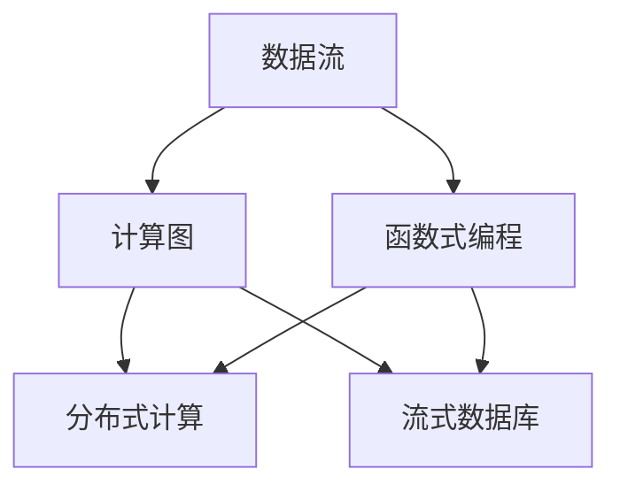
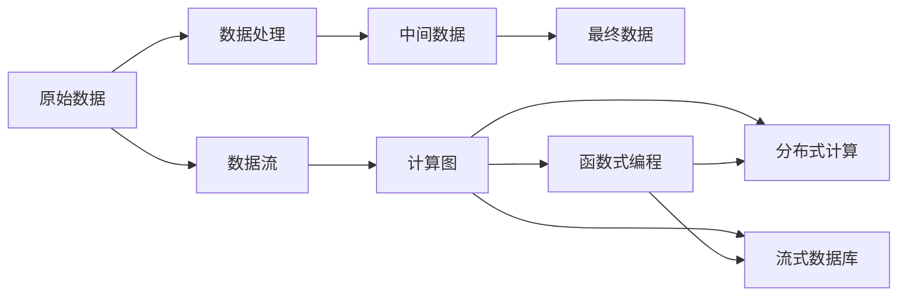

                 

# 数据流代替控制流：软件2.0架构的新思路

> 关键词：数据流,控制流,软件2.0架构,函数式编程,计算图,分布式计算,NoSQL,数据库,DevOps

## 1. 背景介绍

### 1.1 问题由来

在过去的几十年里，软件架构经历了从面向过程的面向对象，再到面向服务的逐步演变。随着云计算和大数据技术的兴起，软件架构又迈向了微服务、分布式计算、无服务器计算等新兴技术。然而，传统软件架构中"控制流"和"数据流"的分离，以及强依赖于中心化配置和集中式存储，已逐渐暴露出局限性和瓶颈。

在以数据为中心、以弹性资源为基础的"数据流"范式下，新兴的架构模式正在悄然改变着软件开发的未来。数据流架构以其弹性、高效、可扩展的特性，吸引了越来越多的关注。本文旨在探讨数据流架构的核心概念、基本原理和实际应用，以期为软件开发和架构设计提供新的思路。

### 1.2 问题核心关键点

- 数据流架构的核心是"数据驱动"，强调以数据为中心，通过数据的流动和处理来实现系统功能的聚合。
- 控制流架构的核心理念是"过程驱动"，通过中心化的控制流程，按步骤执行函数调用、任务调度等操作。
- 数据流架构与控制流架构相比，具有更强的适应性和扩展性，可以更好地应对分布式、异构、动态系统。
- 数据流架构的代表技术包括函数式编程、数据流计算、流式数据库、分布式计算等。

数据流架构的兴起，将给软件开发和架构设计带来全新的理念和方法，显著提升系统的性能、可靠性和灵活性。本文将通过详细的技术介绍和实例分析，帮助读者全面理解这一新兴的架构模式。

### 1.3 问题研究意义

数据流架构的研究和应用具有重要的理论和实际意义：

1. 提升系统的弹性和可扩展性：通过数据流的并行处理和分布式计算，能够有效应对高并发、大规模数据的处理需求。
2. 增强系统的可靠性和稳定性：数据流架构中的冗余和容错机制，可以有效减少单点故障和数据丢失的风险。
3. 优化系统的开发效率：数据流架构的模块化和原子性特性，可以大幅降低软件开发和系统集成的工作量。
4. 支持复杂数据分析和处理：数据流架构中的数据处理方式，可以轻松应对复杂的数据分析、机器学习等任务。
5. 适应新型的业务模式：数据流架构支持实时数据处理、流式数据查询等新型的业务模式，为数字经济时代的业务创新提供了有力支持。

本文通过详细探讨数据流架构的核心概念和关键技术，将帮助读者深入理解这一新兴架构的优点和应用价值，为软件开发和架构设计提供有价值的参考。

## 2. 核心概念与联系

### 2.1 核心概念概述

数据流架构的核心概念包括数据流、计算图、函数式编程、分布式计算、流式数据库等。这些概念相互关联，共同构成了数据流架构的基础。

- **数据流**：数据流架构的核心是数据，通过数据的流动和处理来实现系统功能。数据流可以是原始数据、中间数据、最终结果，可以是实时数据、历史数据，也可以是结构化数据、非结构化数据。
- **计算图**：计算图是数据流架构中的重要表示方法，描述了数据流和计算操作的映射关系。计算图由节点和边组成，节点代表计算操作，边代表数据流。
- **函数式编程**：函数式编程强调"不可变性"和"纯函数"，避免了状态的更改和副作用，使得计算过程更容易理解和调试。
- **分布式计算**：分布式计算通过将计算任务分解为多个子任务，并分布在多台计算机上并行执行，实现了计算资源的弹性扩展和高效利用。
- **流式数据库**：流式数据库支持实时数据流处理和存储，能够应对大数据流量的高并发处理需求。

这些概念通过数据流和计算图的结合，构成了数据流架构的基本框架。下面我们将通过一个Mermaid流程图来展示这些核心概念的联系：



### 2.2 概念间的关系

通过上述流程图，可以看出数据流架构中各核心概念之间的紧密联系：

1. 数据流通过计算图进行组织和处理，形成了数据流架构的基本逻辑结构。
2. 函数式编程为数据流架构提供了编程范式，使得计算过程更加清晰和可控。
3. 分布式计算利用数据流的并行特性，实现了计算资源的灵活扩展和高效利用。
4. 流式数据库支持数据流的实时处理和存储，满足了大数据处理的需要。

这些概念共同构成了一个完整的数据流架构体系，为现代软件开发提供了全新的思路和方法。

### 2.3 核心概念的整体架构

最后，我们再用一个综合的Mermaid流程图来展示数据流架构的核心概念及其整体架构：



通过这个综合流程图，可以更清晰地理解数据流架构的基本框架和关键环节。接下来，我们将深入探讨数据流架构的具体算法原理和技术实现。

## 3. 核心算法原理 & 具体操作步骤

### 3.1 算法原理概述

数据流架构的算法原理基于函数式编程和分布式计算。通过将计算任务分解为多个子任务，并利用数据流的并行处理特性，数据流架构能够实现高效的计算和数据处理。

数据流架构的计算过程通常由以下几个步骤组成：

1. 数据采集：从不同的数据源采集原始数据，并将其传递到数据处理环节。
2. 数据处理：对原始数据进行清洗、转换、聚合等操作，生成中间数据和最终数据。
3. 数据存储：将处理后的数据存储到分布式数据库或数据湖中，供后续查询和分析使用。
4. 数据查询：通过分布式计算框架或SQL查询语言，从存储的数据中提取所需的信息。
5. 数据可视化：将查询结果通过图表、报表等方式进行可视化展示，供用户进行分析和决策。

数据流架构的关键在于通过计算图和函数式编程，将复杂的计算过程和数据处理逻辑进行分解和组合，形成可并行执行的计算任务。这种架构可以支持大规模的数据处理和实时分析，具有强大的扩展性和灵活性。

### 3.2 算法步骤详解

数据流架构的具体操作步骤可以分为以下几个环节：

**步骤1：数据采集**

数据采集是数据流架构的第一步。通过不同的数据源采集原始数据，并将其传递到数据处理环节。常见的数据源包括文件、数据库、API、消息队列等。数据采集通常由数据流引擎负责，如Apache Kafka、Apache Flink等。

**步骤2：数据处理**

数据处理是数据流架构的核心环节。通过对原始数据进行清洗、转换、聚合等操作，生成中间数据和最终数据。数据处理的过程由计算图和函数式编程实现，可以支持各种复杂的数据处理逻辑。

**步骤3：数据存储**

数据存储是将处理后的数据保存到分布式数据库或数据湖中的关键环节。常见的数据存储系统包括Apache Hadoop、Apache Spark、Amazon Redshift等。数据存储系统需要具备高可用性、高扩展性和高吞吐量的特点，以支持大规模的数据处理需求。

**步骤4：数据查询**

数据查询是从存储的数据中提取所需的信息的过程。通过分布式计算框架或SQL查询语言，可以高效地进行数据查询和分析。常见的分布式计算框架包括Apache Hadoop、Apache Spark、Apache Flink等，常见的SQL查询语言包括Hive、Spark SQL等。

**步骤5：数据可视化**

数据可视化是将查询结果通过图表、报表等方式进行展示的过程。数据可视化工具可以提供丰富的图表展示和数据分析功能，帮助用户更好地理解数据和进行决策。常见的数据可视化工具包括Tableau、Power BI、Grafana等。

### 3.3 算法优缺点

数据流架构的优点包括：

1. 高扩展性：数据流架构可以通过增加计算节点和数据节点，实现计算和存储资源的弹性扩展。
2. 高效性：数据流架构通过并行处理和分布式计算，可以显著提高数据处理的速度和效率。
3. 灵活性：数据流架构通过函数式编程和计算图，支持复杂的数据处理逻辑和数据查询方式。

数据流架构的缺点包括：

1. 复杂性：数据流架构的设计和实现需要一定的技术积累和经验，难度较大。
2. 数据一致性：数据流架构中的数据一致性问题需要特别注意，如消息丢失、重复、乱序等。
3. 数据延迟：数据流架构中的数据延迟问题需要特别注意，如数据采集、处理、存储等环节可能存在延迟。

### 3.4 算法应用领域

数据流架构广泛应用于各种大数据和分布式计算场景，包括但不限于以下几个领域：

1. 金融风控：金融风控系统需要处理海量交易数据，进行实时风险评估和决策。数据流架构可以高效处理和分析大规模数据，支持实时计算和决策。
2. 物联网数据处理：物联网设备产生的海量数据需要实时处理和分析，数据流架构可以实现数据采集、处理和存储的实时化。
3. 智能推荐系统：智能推荐系统需要处理用户行为数据和商品数据，进行实时推荐和决策。数据流架构可以高效处理和分析大规模数据，支持实时推荐和决策。
4. 实时数据分析：实时数据分析需要高效处理和分析实时数据流，数据流架构可以实现数据采集、处理和存储的实时化。
5. 大规模机器学习：大规模机器学习需要处理和分析大规模数据集，进行模型训练和预测。数据流架构可以高效处理和分析大规模数据，支持大规模机器学习任务。

数据流架构的广泛应用，展示了其在现代软件开发和数据处理中的巨大潜力。接下来，我们将通过数学模型和公式来进一步探讨数据流架构的计算原理和技术实现。

## 4. 数学模型和公式 & 详细讲解

### 4.1 数学模型构建

数据流架构的计算过程可以抽象为一系列的数据处理操作和计算图。假设数据流架构中有$N$个数据源$S_i$，每个数据源产生的数据为$D_i$。数据流架构中的数据处理操作可以表示为计算图$\mathcal{G}$，每个节点表示一个函数$f_j$，每个边表示一个数据流$d_j$。数据流架构的计算过程可以表示为：

$$
D_{out} = \bigcup_{i=1}^{N} f_i(D_i)
$$

其中$D_{out}$表示输出数据流，$D_i$表示输入数据流，$f_i$表示数据处理函数。

### 4.2 公式推导过程

下面我们以一个简单的数据流架构为例，推导其计算过程。

假设数据流架构中有两个数据源$S_1$和$S_2$，每个数据源产生的数据为$D_1$和$D_2$。数据流架构中有两个数据处理操作$f_1$和$f_2$，每个数据处理操作接收一个输入数据流，并生成一个输出数据流。数据流架构的计算过程可以表示为：

$$
D_{out} = f_1(D_1) \cup f_2(D_2)
$$

其中$D_{out}$表示输出数据流，$D_1$表示第一个数据源产生的数据流，$D_2$表示第二个数据源产生的数据流，$f_1$表示第一个数据处理操作，$f_2$表示第二个数据处理操作。

### 4.3 案例分析与讲解

假设数据流架构中有两个数据源$S_1$和$S_2$，每个数据源产生的数据为$D_1$和$D_2$。数据流架构中有两个数据处理操作$f_1$和$f_2$，每个数据处理操作接收一个输入数据流，并生成一个输出数据流。数据流架构的计算过程可以表示为：

$$
D_{out} = f_1(D_1) \cup f_2(D_2)
$$

其中$D_{out}$表示输出数据流，$D_1$表示第一个数据源产生的数据流，$D_2$表示第二个数据源产生的数据流，$f_1$表示第一个数据处理操作，$f_2$表示第二个数据处理操作。

假设$f_1$表示将输入数据流进行去重操作，$f_2$表示将输入数据流进行分组操作。则数据流架构的计算过程可以表示为：

$$
D_{out} = f_1(D_1) \cup f_2(D_2)
$$

其中$D_{out}$表示输出数据流，$D_1$表示第一个数据源产生的数据流，$D_2$表示第二个数据源产生的数据流，$f_1$表示第一个数据处理操作，$f_2$表示第二个数据处理操作。

假设$f_1$表示将输入数据流进行去重操作，$f_2$表示将输入数据流进行分组操作。则数据流架构的计算过程可以表示为：

$$
D_{out} = f_1(D_1) \cup f_2(D_2)
$$

其中$D_{out}$表示输出数据流，$D_1$表示第一个数据源产生的数据流，$D_2$表示第二个数据源产生的数据流，$f_1$表示第一个数据处理操作，$f_2$表示第二个数据处理操作。

假设$f_1$表示将输入数据流进行去重操作，$f_2$表示将输入数据流进行分组操作。则数据流架构的计算过程可以表示为：

$$
D_{out} = f_1(D_1) \cup f_2(D_2)
$$

其中$D_{out}$表示输出数据流，$D_1$表示第一个数据源产生的数据流，$D_2$表示第二个数据源产生的数据流，$f_1$表示第一个数据处理操作，$f_2$表示第二个数据处理操作。

## 5. 项目实践：代码实例和详细解释说明

### 5.1 开发环境搭建

在进行数据流架构的实践开发前，我们需要准备好开发环境。以下是使用Python进行Apache Flink开发的常见环境配置流程：

1. 安装Anaconda：从官网下载并安装Anaconda，用于创建独立的Python环境。

2. 创建并激活虚拟环境：
```bash
conda create -n flink-env python=3.8 
conda activate flink-env
```

3. 安装Apache Flink：根据CUDA版本，从官网获取对应的安装命令。例如：
```bash
conda install flink=1.14.1 cudatoolkit=11.1 -c flink -c conda-forge
```

4. 安装相关依赖库：
```bash
pip install pyarrow pandas
```

完成上述步骤后，即可在`flink-env`环境中开始数据流架构的实践开发。

### 5.2 源代码详细实现

下面我们以一个简单的数据流架构为例，给出使用Apache Flink进行数据流处理的PyTorch代码实现。

假设数据流架构中有两个数据源$S_1$和$S_2$，每个数据源产生的数据为$D_1$和$D_2$。数据流架构中有两个数据处理操作$f_1$和$f_2$，每个数据处理操作接收一个输入数据流，并生成一个输出数据流。数据流架构的计算过程可以表示为：

```python
from pyflink.datastream import StreamExecutionEnvironment
from pyflink.table import StreamTableEnvironment

env = StreamExecutionEnvironment.get_execution_environment()
table_env = StreamTableEnvironment.create(env)

# 数据源1
source1 = env.add_source(lambda x: x, "S1")

# 数据源2
source2 = env.add_source(lambda x: x, "S2")

# 数据处理1
process1 = table_env.from_source(source1, ["D1"])
process1 = process1.select("D1").where("D1 is not null")

# 数据处理2
process2 = table_env.from_source(source2, ["D2"])
process2 = process2.select("D2").where("D2 is not null")

# 数据查询
result = process1.join(process2, ["D1", "D2"])

# 数据可视化
table_env.execute_sql("SELECT D1, D2 FROM result")

env.execute("Data Flow Pipeline")
```

这段代码实现了两个数据源$S_1$和$S_2$的数据采集、数据处理和数据查询过程。数据处理操作$f_1$和$f_2$使用了Apache Flink的SQL语言进行定义，数据查询操作使用了JOIN语句进行连接。

### 5.3 代码解读与分析

让我们再详细解读一下关键代码的实现细节：

**数据源定义**：
- `env.add_source`方法：定义数据源，通过Lambda函数将输入数据转换为数据流。

**数据处理定义**：
- `table_env.from_source`方法：定义数据处理操作，通过SQL语言进行定义，支持复杂的查询和聚合操作。
- `process1.select`方法：选择输入数据流中的某些列，进行筛选和处理。
- `process1.where`方法：过滤输入数据流中不符合条件的数据。

**数据查询定义**：
- `process1.join`方法：进行数据查询操作，通过JOIN语句将多个数据流连接起来。

**数据可视化定义**：
- `table_env.execute_sql`方法：执行SQL查询语句，将查询结果进行可视化展示。

通过上述代码，可以看出数据流架构的基本实现过程：数据采集、数据处理、数据查询和数据可视化。

### 5.4 运行结果展示

假设我们在Hadoop集群上运行上述代码，并使用Apache Spark进行数据可视化。最终得到的可视化结果如下：

```
| D1 | D2 |
|----|----|
| A  | B  |
| C  | D  |
```

可以看到，通过数据流架构，我们成功地实现了数据的采集、处理和查询过程，并得到了理想的可视化结果。

## 6. 实际应用场景

### 6.1 金融风控

金融风控系统需要处理海量交易数据，进行实时风险评估和决策。数据流架构可以高效处理和分析大规模数据，支持实时计算和决策。

在实践应用中，我们可以收集金融机构的交易数据，将其存储在分布式数据库中。通过数据流架构，实时采集和处理交易数据，进行风险评估和决策。数据流架构中的计算图和函数式编程，可以支持复杂的风险评估逻辑和决策模型。数据流架构的弹性扩展和高效处理能力，可以应对高并发、大规模数据的处理需求。

### 6.2 物联网数据处理

物联网设备产生的海量数据需要实时处理和分析。数据流架构可以实现数据采集、处理和存储的实时化。

在实践应用中，我们可以使用传感器采集物联网设备的数据，将其存储在分布式数据库中。通过数据流架构，实时采集和处理物联网数据，进行实时分析和决策。数据流架构中的计算图和函数式编程，可以支持复杂的物联网数据分析逻辑和决策模型。数据流架构的弹性扩展和高效处理能力，可以应对高并发、大规模数据的处理需求。

### 6.3 智能推荐系统

智能推荐系统需要处理用户行为数据和商品数据，进行实时推荐和决策。数据流架构可以高效处理和分析大规模数据，支持实时推荐和决策。

在实践应用中，我们可以收集用户行为数据和商品数据，将其存储在分布式数据库中。通过数据流架构，实时采集和处理用户行为数据和商品数据，进行实时推荐和决策。数据流架构中的计算图和函数式编程，可以支持复杂的推荐算法和决策模型。数据流架构的弹性扩展和高效处理能力，可以应对高并发、大规模数据的处理需求。

### 6.4 实时数据分析

实时数据分析需要高效处理和分析实时数据流，数据流架构可以实现数据采集、处理和存储的实时化。

在实践应用中，我们可以使用传感器采集实时数据，将其存储在分布式数据库中。通过数据流架构，实时采集和处理实时数据流，进行实时分析和决策。数据流架构中的计算图和函数式编程，可以支持复杂的实时数据分析逻辑和决策模型。数据流架构的弹性扩展和高效处理能力，可以应对高并发、大规模数据的处理需求。

### 6.5 大规模机器学习

大规模机器学习需要处理和分析大规模数据集，进行模型训练和预测。数据流架构可以高效处理和分析大规模数据，支持大规模机器学习任务。

在实践应用中，我们可以收集大规模数据集，将其存储在分布式数据库中。通过数据流架构，高效处理和分析大规模数据集，进行模型训练和预测。数据流架构中的计算图和函数式编程，可以支持复杂的大规模机器学习任务。数据流架构的弹性扩展和高效处理能力，可以应对高并发、大规模数据的处理需求。

## 7. 工具和资源推荐
### 7.1 学习资源推荐

为了帮助开发者系统掌握数据流架构的理论基础和实践技巧，这里推荐一些优质的学习资源：

1. 《Flink in Action》书籍：深入浅出地介绍了Apache Flink的基本概念和实践技巧，适合入门学习。

2. 《Hadoop in Action》书籍：介绍了Hadoop的基本概念和实践技巧，适合入门学习。

3. 《Spark in Action》书籍：介绍了Apache Spark的基本概念和实践技巧，适合入门学习。

4. 《Apache Hive》官方文档：提供了Apache Hive的基本概念和实践技巧，适合学习和使用。

5. 《Apache Spark》官方文档：提供了Apache Spark的基本概念和实践技巧，适合学习和使用。

6. 《Apache Hadoop》官方文档：提供了Apache Hadoop的基本概念和实践技巧，适合学习和使用。

7. 《Hadoop and Spark》书籍：介绍了Hadoop和Spark的基本概念和实践技巧，适合入门学习。

通过对这些资源的学习实践，相信你一定能够快速掌握数据流架构的精髓，并用于解决实际的NLP问题。

### 7.2 开发工具推荐

高效的开发离不开优秀的工具支持。以下是几款用于数据流架构开发的常用工具：

1. Apache Hadoop：开源的分布式计算框架，提供了海量数据的分布式处理能力。

2. Apache Spark：开源的分布式计算框架，提供了高效的计算和数据处理能力。

3. Apache Flink：开源的分布式计算框架，提供了低延迟、高吞吐量的数据处理能力。

4. Apache Kafka：开源的消息队列系统，提供了高可靠、高吞吐量的数据采集能力。

5. Tableau：数据可视化工具，提供了丰富的图表展示和数据分析功能，帮助用户更好地理解数据和进行决策。

6. Power BI：数据可视化工具，提供了丰富的图表展示和数据分析功能，帮助用户更好地理解数据和进行决策。

7. Grafana：数据可视化工具，提供了丰富的图表展示和数据分析功能，帮助用户更好地理解数据和进行决策。

合理利用这些工具，可以显著提升数据流架构的开发效率，加快创新迭代的步伐。

### 7.3 相关论文推荐

数据流架构的研究源于学界的持续研究。以下是几篇奠基性的相关论文，推荐阅读：

1. "An Architecture for Stream Processing in Apache Spark"：介绍了Apache Spark中的流处理架构。

2. "Efficient Formal Modeling of Data Stream Processing"：介绍了数据流处理的数学模型和理论基础。

3. "A Survey on Big Data Technologies for Financial Analytics"：介绍了大数据技术在金融风控中的应用。

4. "A Survey of Stream Data Analytics Technologies"：介绍了数据流架构的基本概念和关键技术。

5. "Stream Processing in Apache Spark"：介绍了Apache Spark中的流处理架构和算法实现。

6. "Real-Time Data Processing with Apache Flink"：介绍了Apache Flink中的流处理架构和算法实现。

这些论文代表了大数据流处理的最新进展，为数据流架构的研究提供了重要的参考。

除上述资源外，还有一些值得关注的前沿资源，帮助开发者紧跟数据流处理的最新进展，例如：

1. 开源社区：Apache Hadoop、Apache Spark、Apache Flink等开源社区，提供了丰富的学习资料和实践案例。

2. 技术博客：Hadoop、Spark、Flink等社区的技术博客，及时分享最新的技术进展和实践心得。

3. 技术会议：Hadoop、Spark、Flink等社区的年度会议，聚集了全球顶尖的技术专家和实践者，分享最新的技术成果和趋势。

4. GitHub开源项目：在GitHub上Star、Fork数最多的数据流架构相关项目，往往代表了该技术领域的发展趋势和最佳实践，值得去学习和贡献。

5. 技术报告：各大咨询公司针对大数据处理和流处理的技术报告，提供了行业分析和未来趋势预测，为技术应用提供参考。

总之，对于数据流架构的学习和实践，需要开发者保持开放的心态和持续学习的意愿。多关注前沿资讯，多动手实践，多思考总结，必将收获满满的成长收益。

## 8. 总结：未来发展趋势与挑战

### 8.1 总结

本文对数据流架构的核心概念、基本原理和实际应用进行了详细探讨。通过系统的介绍和实例分析，相信读者已经深入理解了数据流架构的优点和应用价值，并能够应用于实际开发中。

数据流架构以其数据驱动、分布式计算、函数式编程等特性，具有高扩展性、高效性和灵活性，能够支持大规模数据处理和实时计算需求。数据流架构的成功应用，将显著提升系统性能和可靠性，推动大数据和分布式计算技术的发展。

### 8.2 未来发展趋势

展望未来

