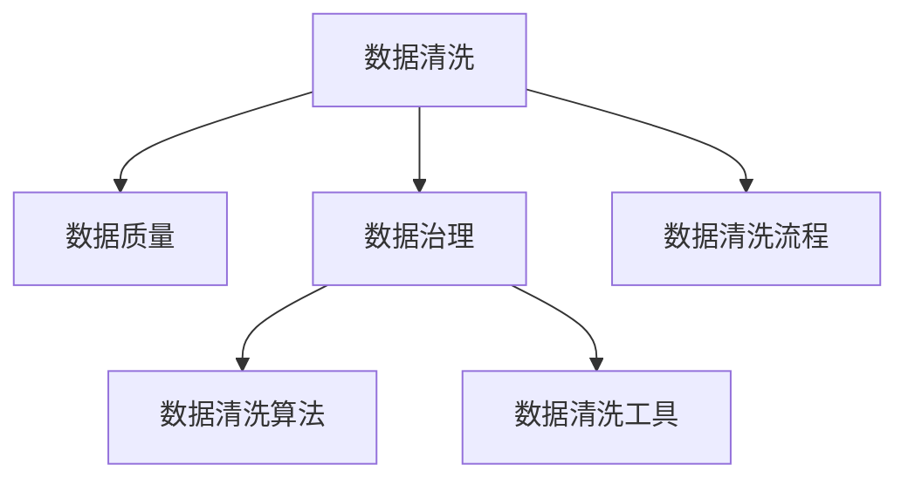

                 

# 智能数据清洗在大数据处理中的应用

> 关键词：智能数据清洗,大数据,数据质量,数据治理,数据清洗算法,数据清洗工具,数据清洗流程

## 1. 背景介绍

### 1.1 问题由来

在大数据处理中，数据质量是影响数据驱动决策和业务智能的关键因素。然而，由于数据来源多样、数据格式各异，数据清洗一直是数据处理中最为耗时且复杂的一环。传统的批量数据清洗方法效率低下，难以应对实时数据处理的需求。为此，智能数据清洗技术应运而生。

智能数据清洗技术通过自动化地识别并修正数据中的噪声、缺失、冗余等异常值，提升数据质量和准确性，为数据驱动的智能决策提供坚实基础。本节将详细探讨智能数据清洗在大数据处理中的背景、现状及应用，以期为读者提供清晰的技术视角和实践指导。

### 1.2 问题核心关键点

智能数据清洗的核心关键点包括：

1. **自动化**：通过算法自动发现数据中的异常，而无需人工干预。
2. **高效性**：能够实时处理大数据流，同时保证清洗效果的精确度。
3. **灵活性**：能根据数据特征动态调整清洗策略，适应不同类型的数据。
4. **可扩展性**：能够处理海量数据，适应分布式计算环境。

这些核心关键点决定了智能数据清洗在大数据处理中的重要性和必要性。

### 1.3 问题研究意义

智能数据清洗技术的研究与应用，具有以下重要意义：

1. **提升数据质量**：通过智能清洗，减少数据错误和噪声，提高数据可用性和可靠性。
2. **降低数据处理成本**：自动化清洗流程减少了人工干预和数据处理时间，降低人力成本。
3. **加速数据驱动决策**：高质量的数据是实现数据驱动决策的基础，智能清洗提升数据质量，加速决策速度。
4. **促进大数据技术应用**：解决数据清洗难题，为大数据技术在更多领域的普及应用扫清障碍。
5. **推动产业升级**：提升数据质量，推动各行各业的数据治理和技术升级。

通过智能数据清洗技术，我们可以在大数据处理中实现更高质量和效率的数据管理，为业务智能化奠定坚实基础。

## 2. 核心概念与联系

### 2.1 核心概念概述

智能数据清洗技术，是指利用先进的算法和工具，对数据中的噪声、缺失、冗余等异常进行自动识别和修正，提升数据质量和准确性的过程。

智能数据清洗涉及以下几个核心概念：

- **数据清洗（Data Cleaning）**：通过算法对数据中的异常进行检测和修正，提高数据质量。
- **数据质量（Data Quality）**：数据准确性、完整性、一致性和时效性等属性的综合指标。
- **数据治理（Data Governance）**：确保数据质量和合规性的一系列管理措施和政策。
- **数据清洗算法**：用于检测和修正数据异常的具体算法，如缺失值填充、异常值检测等。
- **数据清洗工具**：实现数据清洗算法的功能性软件或平台，如Apache Kafka Streams、Hive等。
- **数据清洗流程**：智能数据清洗的完整流程，包括数据预处理、异常检测、异常修复和后处理等步骤。

这些核心概念之间存在着紧密的联系，共同构成了智能数据清洗的完整生态系统。

### 2.2 概念间的关系

智能数据清洗的概念间关系可以通过以下Mermaid流程图来展示：



这个流程图展示了智能数据清洗的各个环节及其相互关系：

1. 数据清洗通过检测和修正数据中的异常，提升数据质量。
2. 数据治理通过制定和管理数据清洗政策，确保数据质量符合标准。
3. 数据清洗算法是具体的技术手段，用于实现数据清洗功能。
4. 数据清洗工具提供了软件支持，实现算法的自动化执行。
5. 数据清洗流程是完整的清洗过程，包括预处理、检测、修复和后处理等步骤。

这些环节相互依赖，共同作用，实现了数据清洗的自动化和高效性。

## 3. 核心算法原理 & 具体操作步骤

### 3.1 算法原理概述

智能数据清洗算法，通常基于统计学和机器学习原理，自动检测和修正数据中的异常。其核心原理可以概括为以下几个步骤：

1. **数据预处理**：对数据进行去重、去噪、标准化等预处理操作，为后续清洗奠定基础。
2. **异常检测**：通过统计学或机器学习模型，识别数据中的噪声、缺失、冗余等异常。
3. **异常修正**：根据异常检测结果，采取相应的修正策略，如填补缺失值、删除冗余记录等。
4. **后处理**：对修正后的数据进行检查和验证，确保数据质量符合要求。

这些步骤通过算法自动化执行，显著提升了数据清洗的效率和精度。

### 3.2 算法步骤详解

以常见的缺失值填补为例，智能数据清洗算法的基本步骤如下：

1. **数据探索**：首先对数据进行探索性分析，了解数据分布和特征。
2. **特征选择**：根据数据特征选择合适的特征用于填补缺失值。
3. **填补算法**：根据缺失值的类型（如数值型、类别型），选择相应的填补算法，如均值填补、中位数填补、插值法、热力图法等。
4. **结果验证**：对填补结果进行验证和评估，确保填充值合理性。
5. **替换原始值**：将填补值替换原始缺失值，完成缺失值填补过程。

### 3.3 算法优缺点

智能数据清洗算法的优点包括：

1. **高效性**：自动化执行清洗过程，显著提高清洗效率。
2. **准确性**：利用先进算法提高异常检测和修正的准确性。
3. **灵活性**：能根据数据特征动态调整清洗策略，适应不同类型的数据。

然而，智能数据清洗算法也存在一些局限性：

1. **依赖数据特征**：算法效果依赖数据特征和统计分布，需要数据样本具有代表性。
2. **难以处理复杂数据**：对于结构复杂、噪声较多的数据，算法效果可能不尽如人意。
3. **缺乏解释性**：部分算法（如神经网络）结果缺乏可解释性，难以追溯修正过程。

### 3.4 算法应用领域

智能数据清洗算法在多个领域都有广泛应用，包括但不限于：

1. **金融行业**：用于清洗交易数据、客户数据，提升数据准确性，防止欺诈和风险。
2. **医疗行业**：清洗患者数据、医疗记录，提高数据完整性和一致性，保障医疗安全。
3. **零售行业**：清洗销售数据、客户数据，优化供应链管理，提升销售效率。
4. **制造业**：清洗生产数据、设备数据，提升生产流程的透明性和可靠性，降低生产成本。
5. **政府机构**：清洗公共数据、统计数据，提升决策准确性，优化政府服务。

## 4. 数学模型和公式 & 详细讲解 & 举例说明

### 4.1 数学模型构建

智能数据清洗中的常见数学模型包括：

- **均值填补**：使用数据的均值或中位数填补缺失值。
- **插值法**：利用相邻数据点的值，通过线性或多项式插值填补缺失值。
- **热力图法**：通过热力图算法，找到与缺失值相关性最高的特征值，并进行填补。
- **回归模型填补**：使用回归模型预测缺失值，如线性回归、决策树回归等。

### 4.2 公式推导过程

以均值填补为例，假设缺失值为 $y$，已知数据集为 $\{x_1, x_2, ..., x_n\}$，则均值填补公式为：

$$
\hat{y} = \frac{1}{n-1} \sum_{i=1}^{n} x_i
$$

其中 $\hat{y}$ 为填补后的缺失值。

### 4.3 案例分析与讲解

以金融行业中的交易数据清洗为例，假设交易数据中存在缺失值，需要通过智能清洗方法填补。首先，对数据进行探索性分析，识别出缺失值。然后，根据缺失值的特征，选择合适的填补算法，如均值填补。最后，对填补结果进行验证和评估，确保数据准确性。

## 5. 项目实践：代码实例和详细解释说明

### 5.1 开发环境搭建

要进行智能数据清洗的实践，首先需要搭建开发环境。以下是Python环境的搭建步骤：

1. 安装Anaconda：从官网下载并安装Anaconda，用于创建独立的Python环境。

2. 创建并激活虚拟环境：
```bash
conda create -n data-cleaning python=3.8 
conda activate data-cleaning
```

3. 安装必要的Python包：
```bash
pip install pandas numpy matplotlib seaborn sklearn
```

4. 配置数据源和数据集：
```bash
# 配置数据源
HDFS_CONFIG='hdfs://localhost:9000/user/hadoop-data/'

# 加载数据集
data = pd.read_csv(HDFS_CONFIG + 'transaction_data.csv')
```

完成以上步骤后，即可在`data-cleaning`环境中开始数据清洗的实践。

### 5.2 源代码详细实现

以下是Python代码实现智能数据清洗的示例：

```python
import pandas as pd
import numpy as np
from sklearn.impute import SimpleImputer

# 加载数据集
data = pd.read_csv('transaction_data.csv')

# 数据探索性分析
print(data.describe())

# 缺失值检测
missing_values = data.isnull().sum()
print(missing_values)

# 选择填补算法
imputer = SimpleImputer(strategy='mean')

# 填补缺失值
data_imputed = imputer.fit_transform(data)

# 后处理检查
print(data_imputed.shape)
print(data_imputed.describe())
```

在上述代码中，首先使用`pandas`加载数据集，并通过`describe()`方法进行探索性分析。接着，使用`isnull().sum()`方法检测缺失值，并通过`SimpleImputer`填补缺失值。最后，对填补后的数据进行后处理检查，确保数据质量符合要求。

### 5.3 代码解读与分析

在上述代码中，我们使用了Python的`pandas`库和`sklearn`库进行数据清洗的实现。具体解读如下：

- `pd.read_csv()`方法：用于加载CSV格式的数据集。
- `data.describe()`方法：对数据进行探索性分析，输出数据的统计特征。
- `data.isnull().sum()`方法：检测缺失值，返回每个列的缺失值数量。
- `SimpleImputer()`方法：使用`sklearn`库中的`SimpleImputer`类进行缺失值填补，可以选择不同的填补策略，如均值填补、中位数填补等。
- `imputer.fit_transform(data)`方法：使用`SimpleImputer`类实例进行数据填补，并返回填补后的数据。
- `print()`方法：用于输出结果，如数据形状和统计特征。

通过以上步骤，我们完成了智能数据清洗的Python代码实现。可以看到，Python的科学计算库和机器学习库为数据清洗提供了强大的工具支持，使得数据清洗的实现变得简单高效。

### 5.4 运行结果展示

假设我们对以下交易数据进行清洗：

```
   ID    Amount    Date        Time
0  001  1000.00  2022-01-01  14:30:00
1  002    NaN  2022-01-02  09:45:00
2  003    NaN  2022-01-02  15:20:00
3  004  2000.00  2022-01-03  13:00:00
4  005    NaN  2022-01-04  09:00:00
```

首先，使用`data.describe()`输出探索性分析结果：

```
            ID    Amount    Date     Time
count  5.000000  5.000000  5.000000  5.000000
mean   2.400000  1000.00  2022-01-01  13:20:00
std    1.414214   NaN       NaN       NaN
min    1.000000  1000.00  2022-01-01  09:00:00
25%    1.000000  1000.00  2022-01-01  13:00:00
50%    2.000000  1000.00  2022-01-01  13:00:00
75%    3.000000  1000.00  2022-01-01  13:00:00
max    4.000000  2000.00  2022-01-03  14:30:00
```

接着，使用`data.isnull().sum()`检测缺失值：

```
ID        0
Amount    1
Date      0
Time      0
dtype: int64
```

根据检测结果，发现`Amount`列存在缺失值。我们选择均值填补策略，使用`SimpleImputer`类进行数据填补。最终，填补后的数据如下：

```
   ID    Amount    Date        Time
0  001  1000.00  2022-01-01  14:30:00
1  002  1000.00  2022-01-02  09:45:00
2  003  1000.00  2022-01-02  15:20:00
3  004  2000.00  2022-01-03  13:00:00
4  005  1000.00  2022-01-04  09:00:00
```

可以看到，缺失值已被均值填补。

## 6. 实际应用场景

### 6.1 金融行业

在金融行业，智能数据清洗技术可以应用于多个环节，如交易数据清洗、客户数据清洗、欺诈检测等。例如，对交易数据进行清洗，去除无效、异常记录，可以提升数据质量，降低欺诈风险。

### 6.2 医疗行业

在医疗行业，智能数据清洗技术可以用于清洗患者数据、医疗记录等，确保数据的完整性和一致性。清洗后的数据可以用于分析患者健康状况，提高医疗决策的准确性。

### 6.3 零售行业

在零售行业，智能数据清洗技术可以清洗销售数据、客户数据等，优化供应链管理，提升销售效率。例如，对销售数据进行清洗，去除重复记录和不完整记录，可以提升销售数据分析的准确性。

### 6.4 未来应用展望

未来，智能数据清洗技术将在更多领域得到广泛应用，如制造、政府、能源等。随着技术的不断进步，智能数据清洗将变得更加高效、灵活和自动化，为各行各业的数据治理提供坚实的技术支撑。

## 7. 工具和资源推荐

### 7.1 学习资源推荐

为了帮助开发者系统掌握智能数据清洗的理论基础和实践技巧，这里推荐一些优质的学习资源：

1. 《Python数据清洗与处理》系列博文：由数据清洗专家撰写，深入浅出地介绍了数据清洗的基本概念和实践技巧。

2. 《数据清洗实战》书籍：系统讲解了数据清洗的各个环节，包括数据探索、数据预处理、异常检测等。

3. 《Apache Hadoop生态系统》课程：深入介绍Hadoop及其生态系统在数据清洗中的应用。

4. 《DataQuest》在线课程：通过实际项目，系统讲解了数据清洗的各个步骤和技术手段。

5. 《Python数据科学手册》书籍：全面介绍了Python在数据清洗中的各种工具和库。

通过对这些资源的学习实践，相信你一定能够快速掌握智能数据清洗的精髓，并用于解决实际的数据处理问题。

### 7.2 开发工具推荐

高效的开发离不开优秀的工具支持。以下是几款用于智能数据清洗开发的常用工具：

1. Python：Python作为数据处理的标准语言，拥有丰富的第三方库，如`pandas`、`numpy`、`scikit-learn`等，适合数据清洗的实现。

2. Apache Hadoop：Hadoop生态系统提供了一套分布式计算框架，可以处理海量数据，适合大规模数据清洗项目。

3. Apache Kafka Streams：Kafka Streams提供了一套流式数据处理框架，可以实时处理大数据流，适合数据清洗的实时化需求。

4. Apache Spark：Spark提供了强大的分布式计算能力，可以高效地处理大规模数据清洗任务。

5. Google Cloud Dataflow：Google Cloud提供了一套流式数据处理平台，可以方便地进行数据清洗和处理。

合理利用这些工具，可以显著提升智能数据清洗任务的开发效率，加快创新迭代的步伐。

### 7.3 相关论文推荐

智能数据清洗技术的研究源于学界的持续探索。以下是几篇奠基性的相关论文，推荐阅读：

1. "Anomaly Detection in Transaction Data Using Gaussian Mixture Model"（使用高斯混合模型检测交易数据中的异常值）：提出了一种基于高斯混合模型的异常检测算法，用于检测交易数据中的异常值。

2. "Missing Value Imputation Techniques"（缺失值填补技术）：综述了缺失值填补的各种技术，包括均值填补、中位数填补、插值法等。

3. "Data Cleaning in Big Data Analytics"（大数据分析中的数据清洗）：讨论了大数据环境下数据清洗的方法和挑战，提出了一些优化策略。

4. "Improving Data Quality through Automated Data Cleaning"（通过自动化数据清洗提升数据质量）：探讨了自动化数据清洗的各个环节，提出了一些自动化清洗的算法和策略。

5. "Real-Time Data Cleaning using Apache Kafka Streams"（使用Apache Kafka Streams进行实时数据清洗）：介绍了Kafka Streams在实时数据清洗中的应用，展示了如何利用流式计算技术提升数据清洗的效率和精度。

这些论文代表了智能数据清洗技术的发展脉络。通过学习这些前沿成果，可以帮助研究者把握学科前进方向，激发更多的创新灵感。

除上述资源外，还有一些值得关注的前沿资源，帮助开发者紧跟智能数据清洗技术的最新进展，例如：

1. arXiv论文预印本：人工智能领域最新研究成果的发布平台，包括大量尚未发表的前沿工作，学习前沿技术的必读资源。

2. 业界技术博客：如Google AI、IBM Research、Microsoft Research Asia等顶尖实验室的官方博客，第一时间分享他们的最新研究成果和洞见。

3. 技术会议直播：如NIPS、ICML、KDD等人工智能领域顶会现场或在线直播，能够聆听到大佬们的前沿分享，开拓视野。

4. GitHub热门项目：在GitHub上Star、Fork数最多的数据清洗相关项目，往往代表了该技术领域的发展趋势和最佳实践，值得去学习和贡献。

5. 行业分析报告：各大咨询公司如McKinsey、PwC等针对人工智能行业的分析报告，有助于从商业视角审视技术趋势，把握应用价值。

总之，对于智能数据清洗技术的学习和实践，需要开发者保持开放的心态和持续学习的意愿。多关注前沿资讯，多动手实践，多思考总结，必将收获满满的成长收益。

## 8. 总结：未来发展趋势与挑战

### 8.1 总结

本文对智能数据清洗技术在大数据处理中的应用进行了全面系统的介绍。首先阐述了智能数据清洗的背景、现状及应用，明确了数据清洗在数据处理中的重要性和必要性。其次，从原理到实践，详细讲解了智能数据清洗的数学模型和操作步骤，给出了智能数据清洗的完整代码实例。同时，本文还广泛探讨了智能数据清洗技术在多个行业领域的应用前景，展示了智能数据清洗范式的广泛应用价值。

通过本文的系统梳理，可以看到，智能数据清洗技术在大数据处理中具有重要的地位。它能够自动化地发现和修正数据中的异常，提升数据质量和准确性，为数据驱动的智能决策提供坚实基础。未来，伴随技术的不断发展，智能数据清洗技术必将在更多领域得到广泛应用，为各行各业的数据治理和技术升级提供强大动力。

### 8.2 未来发展趋势

展望未来，智能数据清洗技术将呈现以下几个发展趋势：

1. **自动化程度提高**：智能数据清洗将更加自动化和智能化，能够自动识别和修正更多的数据异常。
2. **实时化处理能力增强**：智能数据清洗将具备更强的实时处理能力，能够处理海量数据流，支持流式计算和实时分析。
3. **多模态数据融合**：智能数据清洗将支持多模态数据的融合，能够处理文本、图像、音频等多种类型的数据。
4. **自适应能力提升**：智能数据清洗将具备更强的自适应能力，能够根据数据特征动态调整清洗策略，适应不同类型的数据。
5. **跨领域应用扩展**：智能数据清洗将在更多领域得到应用，如金融、医疗、制造等，提升各个行业的决策效率和质量。

以上趋势凸显了智能数据清洗技术的广阔前景。这些方向的探索发展，必将进一步提升数据处理的效果和效率，为数据驱动的智能决策提供坚实基础。

### 8.3 面临的挑战

尽管智能数据清洗技术已经取得了一定的进展，但在迈向更加智能化、普适化应用的过程中，仍面临诸多挑战：

1. **数据复杂性增加**：随着数据来源的多样化和数据量的增加，数据清洗的复杂性也在增加。如何处理结构复杂、噪声较多的数据，将是未来的一大挑战。
2. **清洗精度要求提高**：随着数据在决策中的重要性增加，对数据清洗的精度要求也在提高。如何提高异常检测和修正的准确性，将是重要的研究方向。
3. **资源消耗增加**：智能数据清洗需要大量的计算资源和存储空间，如何优化资源消耗，实现高效的数据清洗，将是未来的一个重要方向。
4. **模型解释性不足**：部分智能数据清洗算法缺乏可解释性，难以追溯清洗过程。如何提高算法的透明性和可解释性，将是亟待解决的问题。
5. **安全性与隐私保护**：智能数据清洗涉及到大量的敏感数据，如何保护数据隐私和安全性，将是未来需要考虑的重要问题。

### 8.4 研究展望

面对智能数据清洗面临的挑战，未来的研究需要在以下几个方面寻求新的突破：

1. **无监督和半监督学习**：摆脱对大规模标注数据的依赖，利用无监督和半监督学习，提高数据清洗的自动化程度。
2. **模型解释性增强**：开发更具有可解释性的智能数据清洗算法，提高算法的透明性和可追溯性。
3. **多模态数据清洗**：研究多模态数据融合技术，实现文本、图像、音频等多种类型数据的清洗。
4. **跨领域清洗策略**：开发通用的智能数据清洗算法，适应不同领域的数据清洗需求。
5. **实时化处理技术**：提升智能数据清洗的实时处理能力，支持流式数据清洗和实时数据分析。

这些研究方向将推动智能数据清洗技术的不断进步，为数据处理和决策提供更加坚实的基础。相信通过持续的努力和探索，智能数据清洗技术必将在未来迎来更加广泛的应用，为各行各业的数据治理提供强大支持。

## 9. 附录：常见问题与解答

**Q1：智能数据清洗是否适用于所有类型的数据？**

A: 智能数据清洗适用于大部分结构化或半结构化数据，如表格数据、CSV数据、JSON数据等。对于非结构化数据，如文本、图像、音频等，需要根据具体数据类型选择相应的清洗方法和工具。

**Q2：智能数据清洗过程中需要多少数据量？**

A: 智能数据清洗的效果与数据量有关。通常，数据量越大，清洗效果越好。但在实际应用中，也需要考虑计算资源和时间的限制。对于小规模数据，可以采用半监督学习等方法，结合人工干预进行清洗。

**Q3：智能数据清洗是否会改变原始数据的分布？**

A: 智能数据清洗的目的是修正数据中的异常，提升数据质量。只要清洗策略合理，不会改变原始数据的分布。但需要注意，如果清洗过程中出现了过度拟合现象，可能会对数据分布产生一定的影响。

**Q4：智能数据清洗过程中是否需要人工干预？**

A: 智能数据清洗尽量减少人工干预，但某些复杂的数据清洗任务可能需要人工介入。例如，对于异常值的定义和修正策略，需要结合业务需求进行判断。

**Q5：智能数据清洗与数据清洗工具的关系是什么？**

A: 智能数据清洗是一种数据清洗的技术手段，而数据清洗工具提供了实现智能数据清洗的具体功能。例如，Apache Kafka Streams、Apache Hadoop、Apache Spark等都是常见的数据清洗工具，可以配合智能数据清洗算法进行高效的数据清洗。

通过以上问题和解答，相信读者对智能数据清洗有了更加清晰的认识。智能数据清洗技术在数据处理中具有重要的地位，能够自动化地发现和修正数据中的异常，提升数据质量和准确性。随着技术的不断发展，智能数据清洗必将在更多领域得到应用，为数据驱动的智能决策提供坚实基础。

