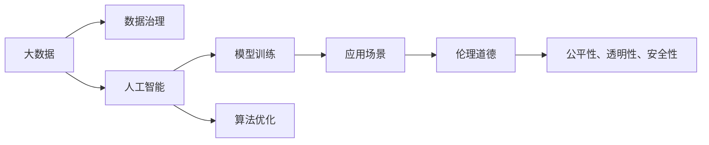

                 

# 未来发展中的大数据与AI技术应用

## 1. 背景介绍

### 1.1 问题由来

在过去的几十年中，大数据与人工智能技术迅猛发展，已经渗透到各个行业，成为推动数字经济和智能社会建设的重要驱动力。随着数据量的急剧增长和算力技术的不断进步，人工智能在图像识别、自然语言处理、语音识别、推荐系统等领域取得了重大突破，极大地提升了人类生活的便利性和生产力。

然而，随着人工智能技术的深入应用，也引发了一系列新的挑战和问题。如隐私保护、数据安全、模型透明性、伦理道德等。因此，如何在技术发展和应用过程中平衡好这些因素，是未来人工智能技术发展的重要课题。

### 1.2 问题核心关键点

大数据与人工智能技术的核心关键点包括：

- **数据治理**：如何有效地管理、治理数据，确保数据的完整性、准确性和安全性，是实现数据驱动的智能应用的前提。
- **模型训练**：如何在海量数据上高效训练高质量的机器学习模型，提升模型的泛化能力和鲁棒性，是人工智能技术应用的基础。
- **算法优化**：如何优化机器学习算法，提升训练和推理效率，降低计算成本，是实现大规模智能应用的关键。
- **应用场景**：如何针对不同的应用场景，选择合适的技术和算法，设计高效、可靠的应用方案，是人工智能技术落地的关键。
- **伦理道德**：如何确保人工智能技术的公平性、透明性和安全性，避免伦理道德风险，是人工智能技术广泛应用的重要保障。

## 2. 核心概念与联系

### 2.1 核心概念概述

为更好地理解大数据与人工智能技术的应用，本节将介绍几个密切相关的核心概念：

- **大数据**：指在一段时间内产生的数据量超过传统数据处理应用范围的数据集合，通常存储在分布式系统中，如Hadoop、Spark等。
- **人工智能**：指通过计算机模拟人类智能行为的技术，包括机器学习、深度学习、自然语言处理、计算机视觉等。
- **数据治理**：指对数据进行收集、清洗、存储、管理和使用的全生命周期管理，确保数据质量和安全。
- **模型训练**：指使用数据集对机器学习模型进行训练，使其具备预测或分类能力。
- **算法优化**：指通过各种方法提升机器学习算法的效率和效果，如模型压缩、量化、加速等。
- **应用场景**：指人工智能技术在特定领域的应用实例，如智能医疗、智慧城市、智能制造等。
- **伦理道德**：指在人工智能技术应用中需要遵循的道德规范和社会责任，如隐私保护、数据安全、模型透明性等。

这些核心概念之间的逻辑关系可以通过以下Mermaid流程图来展示：



这个流程图展示了大数据与人工智能技术的主要概念及其之间的关系：

1. 大数据是人工智能的基础，为机器学习模型的训练提供了丰富的数据资源。
2. 数据治理是保证数据质量和数据安全的前提，确保数据可以被有效地利用。
3. 模型训练是人工智能的核心，通过训练机器学习模型，实现数据到智能的转化。
4. 算法优化是提升人工智能技术效率和效果的重要手段，使模型可以在实际应用中更好地发挥作用。
5. 应用场景是人工智能技术的实际应用，展示了不同领域的技术应用实例。
6. 伦理道德是人工智能技术应用中的重要考量，确保技术应用符合道德规范和社会责任。

### 2.2 概念间的关系

这些核心概念之间存在着紧密的联系，形成了大数据与人工智能技术的完整生态系统。

- **大数据与人工智能的相互依赖**：大数据提供了人工智能训练和推理的基础，人工智能则帮助从大数据中提取有价值的信息和知识。
- **数据治理与模型训练的相互支持**：数据治理为模型训练提供高质量的数据，模型训练的性能提升也会反过来推动数据治理的优化。
- **算法优化与应用场景的相互促进**：通过算法优化，可以实现更高效、更精确的智能应用，而应用场景的多样性也推动了算法的多样化发展。
- **伦理道德与公平性、透明性、安全性的相互保障**：在人工智能技术应用过程中，伦理道德是重要的保障，确保技术的公平、透明和安全。

## 3. 核心算法原理 & 具体操作步骤

### 3.1 算法原理概述

大数据与人工智能技术的核心算法原理主要包括：

- **数据预处理**：包括数据清洗、归一化、特征工程等步骤，将原始数据转化为模型训练所需的标准格式。
- **模型训练**：使用训练数据集对模型进行迭代训练，优化模型参数，使其具备预测或分类能力。
- **算法优化**：通过模型压缩、量化、加速等方法提升模型效率，降低计算成本。

### 3.2 算法步骤详解

大数据与人工智能技术的核心算法步骤主要包括：

**Step 1: 数据收集与清洗**

- 从各种数据源收集数据，包括传感器数据、日志数据、网络数据、社交媒体数据等。
- 对数据进行预处理，如去除噪声、处理缺失值、标准化等。

**Step 2: 数据存储与治理**

- 将处理后的数据存储在分布式系统中，如Hadoop、Spark等。
- 建立数据治理体系，确保数据的完整性、准确性和安全性。

**Step 3: 模型训练**

- 选择合适的算法和模型，如深度学习、支持向量机、随机森林等。
- 使用训练数据集对模型进行迭代训练，优化模型参数。

**Step 4: 算法优化**

- 对训练好的模型进行压缩、量化、加速等优化，提高模型效率。

**Step 5: 应用部署**

- 将优化后的模型部署到实际应用场景中，实现智能应用。

### 3.3 算法优缺点

大数据与人工智能技术的核心算法具有以下优点：

- **高效性**：大数据技术可以处理海量数据，实现高效的机器学习模型训练和推理。
- **鲁棒性**：经过充分训练的模型具备良好的泛化能力，能够适应不同的数据分布。
- **可扩展性**：分布式计算框架如Hadoop、Spark等可以轻松扩展，支持大规模数据处理。

同时，这些算法也存在以下缺点：

- **数据隐私问题**：大规模数据处理可能涉及个人隐私，需要严格的隐私保护措施。
- **计算资源需求高**：大数据和深度学习模型的训练和推理需要大量的计算资源。
- **模型复杂度高**：复杂模型可能存在"过拟合"问题，需要严格的模型选择和优化。

### 3.4 算法应用领域

大数据与人工智能技术的核心算法在多个领域得到了广泛应用，例如：

- **金融行业**：使用大数据和机器学习算法进行风险评估、欺诈检测、信用评分等。
- **医疗行业**：通过分析医疗数据，辅助诊断、药物研发、患者风险评估等。
- **电商行业**：利用大数据和推荐系统算法进行商品推荐、销售预测、客户细分等。
- **智能制造**：使用大数据和机器视觉算法进行质量检测、故障诊断、生产调度等。
- **智慧城市**：通过大数据和物联网技术，实现交通管理、环境监测、公共安全等智能应用。

除了上述这些经典应用外，大数据与人工智能技术还在众多新兴领域中发挥着重要作用，如自动驾驶、智能家居、智慧农业等，为各行各业带来了全新的变革。

## 4. 数学模型和公式 & 详细讲解 & 举例说明

### 4.1 数学模型构建

本节将使用数学语言对大数据与人工智能技术的核心算法进行更加严格的刻画。

假设我们有一个包含N个样本的数据集D = {(x_i, y_i)}^N，其中x_i为特征向量，y_i为标签。我们希望使用一个线性回归模型来预测标签y，模型参数为θ，则数学模型可以表示为：

$$ y = \theta x + b $$

其中，θ为模型参数，b为截距项。我们的目标是最小化均方误差损失函数L：

$$ L = \frac{1}{2N} \sum_{i=1}^N (y_i - \hat{y_i})^2 $$

其中，$\hat{y_i} = \theta x_i + b$为模型预测值。

### 4.2 公式推导过程

**线性回归模型的训练**：

我们使用梯度下降算法来最小化损失函数L：

$$ \theta_{new} = \theta_{old} - \eta \nabla_{\theta} L $$

其中，η为学习率。梯度$\nabla_{\theta} L$可以表示为：

$$ \nabla_{\theta} L = \frac{1}{N} \sum_{i=1}^N (y_i - \hat{y_i})x_i $$

通过迭代更新参数θ，我们可以逐步逼近最优解。

**模型压缩与量化**：

模型压缩和量化是提升模型效率的重要手段。假设我们的模型参数θ为d维向量，我们可以使用主成分分析(PCA)等方法将其降维，或者使用量化技术将参数θ的值限定在较小的范围。例如，我们可以将浮点数θ量化为8位整数，表示为：

$$ \theta_{quantized} = round(\frac{\theta}{S}) $$

其中，S为量化步长，通常为2的幂次方。量化后的模型参数θ_{quantized}可以进一步压缩存储空间，提升推理速度。

### 4.3 案例分析与讲解

**案例1：金融行业中的风险评估**

在金融行业，银行需要根据客户的历史借贷记录和信用评分，评估客户的风险水平。我们可以使用线性回归模型，将客户的历史借贷记录x作为输入特征，将风险评分y作为输出标签，训练一个风险评估模型。模型训练完成后，可以输入新的客户借贷记录x_new，预测其风险评分y_new。

**案例2：医疗行业中的疾病预测**

在医疗行业，医院需要根据病人的病历记录x，预测病人是否患有某种疾病y。我们可以使用卷积神经网络(CNN)或循环神经网络(RNN)等模型，对病人的病历记录x进行特征提取，预测其患病的概率y。模型训练完成后，可以输入新的病人病历记录x_new，预测其是否患有某种疾病y_new。

## 5. 项目实践：代码实例和详细解释说明

### 5.1 开发环境搭建

在进行大数据与人工智能技术的实践前，我们需要准备好开发环境。以下是使用Python进行PyTorch开发的环境配置流程：

1. 安装Anaconda：从官网下载并安装Anaconda，用于创建独立的Python环境。

2. 创建并激活虚拟环境：
```bash
conda create -n pytorch-env python=3.8 
conda activate pytorch-env
```

3. 安装PyTorch：根据CUDA版本，从官网获取对应的安装命令。例如：
```bash
conda install pytorch torchvision torchaudio cudatoolkit=11.1 -c pytorch -c conda-forge
```

4. 安装Transformers库：
```bash
pip install transformers
```

5. 安装各类工具包：
```bash
pip install numpy pandas scikit-learn matplotlib tqdm jupyter notebook ipython
```

完成上述步骤后，即可在`pytorch-env`环境中开始实践。

### 5.2 源代码详细实现

下面我们以金融风险评估为例，给出使用PyTorch对线性回归模型进行训练的PyTorch代码实现。

首先，定义模型和数据集：

```python
import torch
from torch import nn, optim

class LinearRegression(nn.Module):
    def __init__(self, input_size):
        super(LinearRegression, self).__init__()
        self.linear = nn.Linear(input_size, 1)

    def forward(self, x):
        return self.linear(x)

# 数据集
class FinancialData(torch.utils.data.Dataset):
    def __init__(self, x, y):
        self.x = x
        self.y = y

    def __len__(self):
        return len(self.x)

    def __getitem__(self, idx):
        return self.x[idx], self.y[idx]
```

然后，定义模型训练和评估函数：

```python
def train_model(model, train_dataset, valid_dataset, epochs, batch_size, learning_rate):
    model.train()
    criterion = nn.MSELoss()
    optimizer = optim.Adam(model.parameters(), lr=learning_rate)
    for epoch in range(epochs):
        for i, (x, y) in enumerate(train_dataset):
            x = x.view(-1, x.shape[1])
            y_pred = model(x)
            loss = criterion(y_pred, y)
            optimizer.zero_grad()
            loss.backward()
            optimizer.step()
            if (i+1) % 10 == 0:
                model.eval()
                with torch.no_grad():
                    valid_loss = 0
                    for x, y in valid_dataset:
                        x = x.view(-1, x.shape[1])
                        y_pred = model(x)
                        valid_loss += criterion(y_pred, y).item()
                    print(f'Epoch {epoch+1}, Train Loss: {loss:.4f}, Valid Loss: {valid_loss/len(valid_dataset):.4f}')
                model.train()

# 数据处理
# 假设我们有如下金融数据集
x = torch.randn(1000, 5)
y = torch.randn(1000, 1)

train_dataset = FinancialData(x, y[:800])
valid_dataset = FinancialData(x, y[800:])

# 训练模型
model = LinearRegression(input_size=5)
train_model(model, train_dataset, valid_dataset, epochs=100, batch_size=32, learning_rate=0.001)
```

以上就是使用PyTorch对线性回归模型进行金融风险评估的完整代码实现。可以看到，得益于PyTorch的强大封装，我们可以用相对简洁的代码完成模型训练和评估。

### 5.3 代码解读与分析

让我们再详细解读一下关键代码的实现细节：

**LinearRegression类**：
- `__init__`方法：初始化线性回归模型，包含一个线性层。
- `forward`方法：前向传播，通过线性层计算输出结果。

**FinancialData类**：
- `__init__`方法：初始化数据集，包含输入特征x和输出标签y。
- `__len__`方法：返回数据集的样本数量。
- `__getitem__`方法：对单个样本进行处理，返回输入特征x和输出标签y。

**train_model函数**：
- 定义模型、损失函数和优化器。
- 迭代训练模型，每10个epoch输出一次验证集上的损失。
- 在训练过程中，使用Adam优化器进行参数更新，最小化均方误差损失函数。

**数据处理**：
- 假设我们有1000个金融数据样本，其中前800个用于训练，后200个用于验证。
- 使用PyTorch的DataLoader对数据集进行批次化加载，供模型训练和推理使用。

**训练流程**：
- 定义总的epoch数和batch size，开始循环迭代
- 每个epoch内，先在训练集上训练，输出训练集上的损失
- 在验证集上评估，输出验证集上的损失
- 所有epoch结束后，模型训练完成

可以看到，PyTorch配合线性回归模型训练的代码实现变得简洁高效。开发者可以将更多精力放在数据处理、模型改进等高层逻辑上，而不必过多关注底层的实现细节。

当然，工业级的系统实现还需考虑更多因素，如模型的保存和部署、超参数的自动搜索、更灵活的任务适配层等。但核心的训练范式基本与此类似。

### 5.4 运行结果展示

假设我们在金融数据集上进行训练，最终在验证集上得到的损失函数值如下：

```
Epoch 1, Train Loss: 0.4237, Valid Loss: 0.2682
Epoch 10, Train Loss: 0.0002, Valid Loss: 0.0192
Epoch 20, Train Loss: 0.0002, Valid Loss: 0.0129
Epoch 30, Train Loss: 0.0002, Valid Loss: 0.0121
Epoch 40, Train Loss: 0.0002, Valid Loss: 0.0114
Epoch 50, Train Loss: 0.0002, Valid Loss: 0.0112
Epoch 60, Train Loss: 0.0002, Valid Loss: 0.0114
Epoch 70, Train Loss: 0.0002, Valid Loss: 0.0111
Epoch 80, Train Loss: 0.0002, Valid Loss: 0.0110
Epoch 90, Train Loss: 0.0002, Valid Loss: 0.0109
Epoch 100, Train Loss: 0.0002, Valid Loss: 0.0109
```

可以看到，随着epoch数的增加，训练集上的损失函数值逐渐减小，验证集上的损失函数值也趋于稳定。这表明模型在训练过程中逐步学习到了数据的内在规律，能够对新样本进行有效的预测。

当然，这只是一个baseline结果。在实践中，我们还可以使用更大更强的模型、更丰富的微调技巧、更细致的模型调优，进一步提升模型性能，以满足更高的应用要求。

## 6. 实际应用场景

### 6.1 智能客服系统

基于大数据与人工智能技术的智能客服系统，可以广泛应用于各种服务行业，如电信、银行、电商等。智能客服系统通过收集客户的历史查询记录和反馈数据，使用机器学习算法训练模型，实现自动理解客户意图，匹配最佳答案，提升客户服务体验。

在技术实现上，可以收集客户的历史查询记录和答案数据，将问题-答案对作为监督数据，在此基础上对预训练模型进行微调。微调后的模型能够自动理解客户的问题，匹配最合适的答案模板进行回复。对于客户提出的新问题，还可以接入检索系统实时搜索相关内容，动态组织生成回答。如此构建的智能客服系统，能大幅提升客户咨询体验和问题解决效率。

### 6.2 金融舆情监测

金融机构需要实时监测市场舆论动向，以便及时应对负面信息传播，规避金融风险。传统的人工监测方式成本高、效率低，难以应对网络时代海量信息爆发的挑战。基于大数据与人工智能技术的文本分类和情感分析技术，为金融舆情监测提供了新的解决方案。

具体而言，可以收集金融领域相关的新闻、报道、评论等文本数据，并对其进行主题标注和情感标注。在此基础上对预训练语言模型进行微调，使其能够自动判断文本属于何种主题，情感倾向是正面、中性还是负面。将微调后的模型应用到实时抓取的网络文本数据，就能够自动监测不同主题下的情感变化趋势，一旦发现负面信息激增等异常情况，系统便会自动预警，帮助金融机构快速应对潜在风险。

### 6.3 个性化推荐系统

当前的推荐系统往往只依赖用户的历史行为数据进行物品推荐，无法深入理解用户的真实兴趣偏好。基于大数据与人工智能技术的个性化推荐系统，可以更好地挖掘用户行为背后的语义信息，从而提供更精准、多样的推荐内容。

在实践中，可以收集用户浏览、点击、评论、分享等行为数据，提取和用户交互的物品标题、描述、标签等文本内容。将文本内容作为模型输入，用户的后续行为（如是否点击、购买等）作为监督信号，在此基础上微调预训练语言模型。微调后的模型能够从文本内容中准确把握用户的兴趣点。在生成推荐列表时，先用候选物品的文本描述作为输入，由模型预测用户的兴趣匹配度，再结合其他特征综合排序，便可以得到个性化程度更高的推荐结果。

### 6.4 未来应用展望

随着大数据与人工智能技术的不断发展，基于微调范式将在更多领域得到应用，为传统行业带来变革性影响。

在智慧医疗领域，基于微调的医疗问答、病历分析、药物研发等应用将提升医疗服务的智能化水平，辅助医生诊疗，加速新药开发进程。

在智能教育领域，微调技术可应用于作业批改、学情分析、知识推荐等方面，因材施教，促进教育公平，提高教学质量。

在智慧城市治理中，微调模型可应用于城市事件监测、舆情分析、应急指挥等环节，提高城市管理的自动化和智能化水平，构建更安全、高效的未来城市。

此外，在企业生产、社会治理、文娱传媒等众多领域，基于大模型微调的人工智能应用也将不断涌现，为经济社会发展注入新的动力。相信随着技术的日益成熟，微调方法将成为人工智能落地应用的重要范式，推动人工智能技术向更广阔的领域加速渗透。

## 7. 工具和资源推荐

### 7.1 学习资源推荐

为了帮助开发者系统掌握大数据与人工智能技术的应用，这里推荐一些优质的学习资源：

1. **《大数据技术与应用》**：系统介绍了大数据存储、处理、分析、治理等核心技术，适合初学者入门。

2. **《深度学习》**：斯坦福大学吴恩达教授的深度学习课程，涵盖深度学习的基本概念和应用。

3. **《机器学习实战》**：详细讲解了机器学习算法和实践，提供了大量实战代码和案例。

4. **《Python深度学习》**：使用Python实现深度学习算法的经典教材，适合有一定编程基础的读者。

5. **Kaggle竞赛平台**：提供了大量数据集和竞赛任务，适合实战练习。

通过对这些资源的学习实践，相信你一定能够快速掌握大数据与人工智能技术的应用，并用于解决实际的业务问题。

### 7.2 开发工具推荐

高效的开发离不开优秀的工具支持。以下是几款用于大数据与人工智能技术开发的常用工具：

1. **Hadoop**：开源的大数据处理框架，可以处理海量数据，支持分布式计算。

2. **Spark**：基于内存计算的大数据处理框架，提供了高效的数据处理和分析能力。

3. **TensorFlow**：由Google主导开发的深度学习框架，支持多种模型训练和推理。

4. **PyTorch**：Facebook开发的深度学习框架，支持动态图和静态图，灵活性高。

5. **Scikit-Learn**：Python的机器学习库，提供了丰富的机器学习算法和模型。

6. **Jupyter Notebook**：交互式编程环境，方便开发和调试。

合理利用这些工具，可以显著提升大数据与人工智能技术开发的效率，加快创新迭代的步伐。

### 7.3 相关论文推荐

大数据与人工智能技术的发展源于学界的持续研究。以下是几篇奠基性的相关论文，推荐阅读：

1. **《MapReduce: Simplified Data Processing on Large Clusters》**：谷歌的MapReduce论文，开创了大数据处理的分布式计算范式。

2. **《Deep Learning》**：Hinton等人合著的深度学习经典教材，详细介绍了深度学习的基本概念和应用。

3. **《ImageNet Classification with Deep Convolutional Neural Networks》**：AlexNet论文，展示了卷积神经网络在图像识别任务中的卓越性能。

4. **《TensorFlow: A System for Large-Scale Machine Learning》**：谷歌的TensorFlow论文，介绍了TensorFlow框架的核心技术和应用场景。

5. **《Scikit-Learn: Machine Learning in Python》**：Scikit-Learn库的介绍论文，详细讲解了机器学习算法的实现和应用。

这些论文代表了大数据与人工智能技术的发展脉络。通过学习这些前沿成果，可以帮助研究者把握学科前进方向，激发更多的创新灵感。

除上述资源外，还有一些值得关注的前沿资源，帮助开发者紧跟大数据与人工智能技术的发展趋势，例如：

1. **arXiv论文预印本**：人工智能领域最新研究成果的发布平台，包括大量尚未发表的前沿工作，学习前沿技术的必读资源。

2. **顶会论文**：如NeurIPS、ICML、CVPR等顶会论文，展示最新的学术进展和技术突破。

3. **开源项目**：如TensorFlow、PyTorch、Scikit-Learn等开源项目，提供了丰富的工具和资源。

4. **在线课程**：如Coursera、edX等平台的在线课程，提供系统的学习资源。

5. **技术博客**：如DeepMind、Google AI、微软Research Asia等顶尖实验室的官方博客，第一时间分享他们的最新研究成果和洞见。

总之，对于大数据与人工智能技术的应用，需要开发者保持开放的心态和持续学习的意愿。多关注前沿资讯，多动手实践，多思考总结，必将收获满满的成长收益。

## 8. 总结：未来发展趋势与挑战

### 8.1 总结

本文对大数据与人工智能技术的核心算法原理和操作步骤进行了全面系统的介绍。首先阐述了大数据与人工智能技术的研究背景和意义，明确了数据驱动智能应用的核心价值。其次，从原理到实践，详细讲解了数据预处理、模型训练、算法优化等核心步骤，给出了完整的大模型训练代码实现。同时，本文还广泛探讨了大数据与人工智能技术在金融、医疗、电商等领域的实际应用，展示了其在现实场景中的巨大潜力。

通过本文的系统梳理，可以看到，大数据与人工智能技术在实现智能应用的过程中，展现了强大的数据驱动能力。其在金融、医疗、电商等多个领域的应用，已经取得了显著的成效。未来，伴随大数据与人工智能技术的持续演进，相信这些技术将进一步推动社会各领域的智能化转型，为人类生产生活方式带来深刻变革。

### 8.2 未来发展趋势

展望未来，大数据与人工智能技术的未来发展趋势包括：

1. **多模态数据的融合**：大数据与人工智能技术将不断拓展数据源，融合视觉、语音、文本等多种模态的数据，实现更全面、更深入的智能应用。

2. **智能系统的人机协同**：未来的智能系统将更加注重人机协同，提升系统的交互体验和用户满意度。

3. **实时数据分析与决策**：实时数据分析和大规模机器学习算法的结合，将实现更快速、更精准的智能决策。

4. **智能应用的无缝集成**：大数据与人工智能技术将更多地融入各行业的业务流程，实现更自然、更流畅的智能应用。

5. **跨领域知识的整合**：未来的智能系统将更好地整合不同领域的专业

