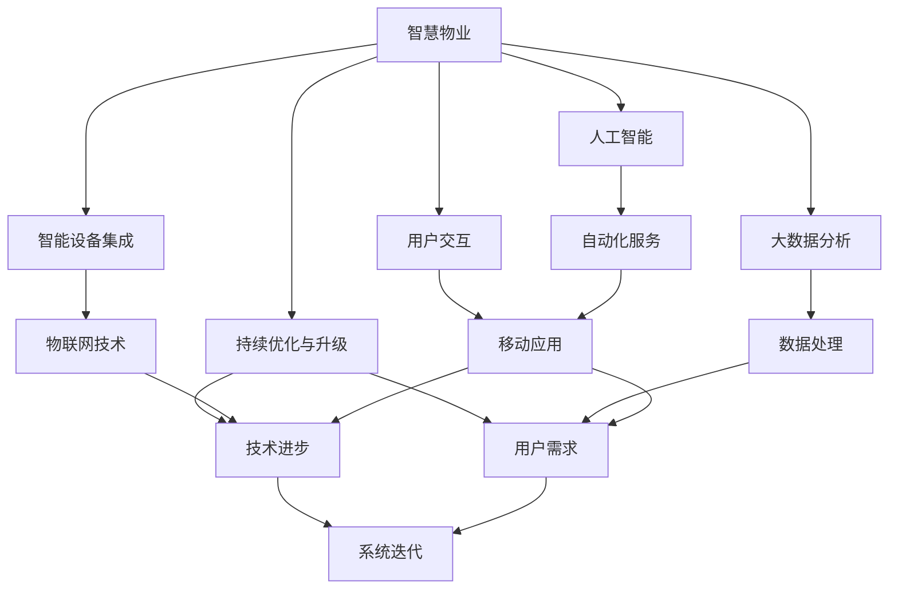
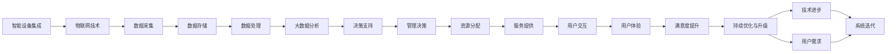
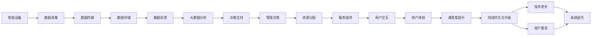

                 

# 未来的智慧物业：2050年的社区管理与服务升级

## 1. 背景介绍

### 1.1 问题由来
随着城市化进程的加快和科技的不断进步，智慧物业成为了房地产行业的重要发展方向。传统的物业管理模式，如人工巡查、手动记录等，存在效率低、耗时长、数据难以实时共享等问题，难以满足现代社区高效、智能、安全的需求。为应对这些挑战，智慧物业系统应运而生。

智慧物业系统融合了物联网、大数据、人工智能等技术，通过智能传感器、云计算平台、移动应用等手段，实现对社区资源的高效管理和服务的智能化。相较于传统系统，智慧物业能够提供更便捷、更可靠、更可持续的服务。

### 1.2 问题核心关键点
1. **智能设施与设备的集成**：智慧物业的基础是智能设备和设施的广泛部署，如智能门禁、智能监控、智能家居等。这些设备通过物联网技术互联，实现数据的实时采集与传输。
2. **大数据分析与决策支持**：智慧物业系统通过大数据技术，对收集到的海量数据进行分析和挖掘，提取有价值的洞察，为管理决策提供科学依据。
3. **人工智能技术的引入**：借助人工智能，智慧物业可以实现自动化的服务提供，如智能安防、智能客服、智能维修等。
4. **用户交互与体验优化**：智慧物业注重用户体验，通过移动应用等渠道，提供便捷、个性化的服务，提升用户满意度。
5. **持续优化与升级**：智慧物业系统需不断迭代更新，以应对技术进步和用户需求的变化。

### 1.3 问题研究意义
智慧物业技术的应用，不仅能够提升社区的管理效率，还能为居民提供更加便捷、智能、安全的生活体验，促进社会治理现代化，推动房地产行业的发展。研究智慧物业的实现路径和优化策略，具有重要的理论价值和现实意义。

## 2. 核心概念与联系

### 2.1 核心概念概述

为更好地理解智慧物业的实现，本节将介绍几个关键概念：

- **智慧物业（Smart Property Management）**：利用物联网、大数据、人工智能等技术，实现对社区资源的智能管理和服务的自动化提供。智慧物业系统涉及智能设备集成、数据处理、应用服务等多个环节。
- **物联网（IoT）**：通过互联网技术，将各类设备、设施互联互通，实现数据的实时采集、传输和共享。
- **大数据分析（Big Data Analytics）**：对海量数据进行收集、存储、分析和挖掘，提取有价值的洞察，支持管理决策。
- **人工智能（AI）**：通过机器学习、深度学习等技术，实现自动化服务提供、异常检测、用户行为分析等功能。
- **用户交互（User Interaction）**：智慧物业系统通过移动应用等渠道，提供个性化、便捷的用户服务，提升用户体验。
- **持续优化与升级（Continuous Optimization and Upgrade）**：智慧物业系统需不断迭代更新，以适应技术进步和用户需求的变化。

这些概念之间的逻辑关系可以通过以下Mermaid流程图来展示：



这个流程图展示出智慧物业的核心概念及其之间的关系：

1. 智慧物业通过物联网技术，实现智能设备集成。
2. 利用大数据分析技术，对数据进行处理，提取洞察。
3. 引入人工智能技术，提供自动化服务。
4. 通过用户交互渠道，提升用户体验。
5. 持续优化与升级，适应技术进步和用户需求变化。

### 2.2 概念间的关系

这些核心概念之间存在着紧密的联系，构成了智慧物业系统的完整生态系统。下面我们通过几个Mermaid流程图来展示这些概念之间的关系。

#### 2.2.1 智慧物业的架构



这个流程图展示了智慧物业系统的架构，包括智能设备集成、数据采集、存储、处理、分析、决策支持、资源分配、服务提供、用户交互、用户体验、满意度提升、持续优化与升级等环节。

#### 2.2.2 数据在智慧物业中的流转



这个流程图展示了数据在智慧物业系统中的流转路径，从智能设备的采集，到数据的存储、处理、分析、决策支持，再到资源的分配和服务提供，最终反馈到用户交互和满意度提升环节，实现系统的持续优化与升级。

## 3. 核心算法原理 & 具体操作步骤
### 3.1 算法原理概述

智慧物业的核心算法原理基于物联网、大数据、人工智能等技术，通过智能设备、数据处理、机器学习等手段，实现社区资源的智能管理和服务的自动化提供。

智慧物业的实现，涉及以下关键算法：

- **智能设备集成算法**：通过物联网技术，将各类智能设备互联互通，实现数据的实时采集、传输和共享。
- **数据处理算法**：对采集到的海量数据进行清洗、存储、预处理等操作，提取有用信息。
- **大数据分析算法**：利用大数据技术，对处理后的数据进行分析和挖掘，提取有价值的洞察，支持管理决策。
- **人工智能算法**：通过机器学习、深度学习等技术，实现自动化服务提供、异常检测、用户行为分析等功能。
- **用户交互算法**：通过移动应用等渠道，提供个性化、便捷的用户服务，提升用户体验。

### 3.2 算法步骤详解

智慧物业的实现步骤包括以下几个关键环节：

**Step 1: 智能设备部署与集成**

1. 选择合适的智能设备，如智能门禁、智能监控、智能家居等。
2. 部署智能设备，并确保其能够稳定运行。
3. 通过物联网技术将智能设备互联互通，实现数据的实时采集和传输。
4. 配置设备的网络参数和通信协议，确保数据的高效传输。

**Step 2: 数据处理与存储**

1. 对采集到的数据进行清洗和预处理，去除无效数据和异常值。
2. 将清洗后的数据存储到数据库或数据仓库中，支持后续的数据分析和处理。
3. 采用高效的数据存储技术，如分布式存储、云计算等，确保数据的高可用性和可扩展性。

**Step 3: 大数据分析与决策支持**

1. 利用大数据技术，对存储的数据进行分析和挖掘，提取有价值的洞察。
2. 使用数据可视化工具，将分析结果以图表、报表等形式呈现，支持管理决策。
3. 构建决策支持系统，将分析结果应用于资源分配、服务提供等环节，提升管理效率。

**Step 4: 人工智能服务提供**

1. 选择适合的人工智能算法，如机器学习、深度学习等，进行模型训练和优化。
2. 将训练好的模型部署到服务端，提供自动化服务，如智能安防、智能客服、智能维修等。
3. 定期更新和维护模型，确保其性能和准确性。

**Step 5: 用户交互与体验优化**

1. 设计符合用户需求的应用界面和交互流程，提供便捷、个性化的服务。
2. 通过移动应用等渠道，将服务推送给用户，提升用户体验。
3. 收集用户反馈和建议，持续优化和改进服务。

**Step 6: 持续优化与升级**

1. 定期检查和维护系统性能，确保其稳定运行。
2. 根据技术进步和用户需求的变化，不断迭代更新系统。
3. 引入新技术和新方法，提升系统的智能化水平。

### 3.3 算法优缺点

智慧物业的核心算法具有以下优点：

1. **高效性**：通过自动化处理和数据分析，提高了管理效率，减少了人工操作的繁琐和错误。
2. **智能化**：利用人工智能技术，提供智能化的服务，提升了用户体验和满意度。
3. **实时性**：通过物联网技术，实现了数据的实时采集和传输，确保信息的及时性和准确性。
4. **可扩展性**：基于云计算和大数据技术，智慧物业系统具有良好的可扩展性和灵活性，可以适应不同规模和复杂度的社区需求。

同时，智慧物业的核心算法也存在一些缺点：

1. **成本高**：智能设备和系统的部署和维护需要较高的初始投资和运维成本。
2. **数据隐私和安全**：智慧物业系统需要处理大量的个人隐私数据，存在数据泄露和被滥用的风险。
3. **技术门槛高**：智慧物业涉及多项前沿技术，对技术人员的素质和经验要求较高。

### 3.4 算法应用领域

智慧物业的核心算法在多个领域中得到了广泛应用，如：

- **智能安防**：通过智能监控和传感器，实时监测社区安全，提供异常检测和报警功能。
- **智能客服**：利用自然语言处理技术，提供智能客服服务，提升用户满意度。
- **智能维修**：通过智能传感器和物联网设备，实时监测设备状态，提供自动化维修服务。
- **能源管理**：通过智能电表和传感器，实时监测能源使用情况，优化能源管理。
- **环境监测**：通过智能传感器，监测社区环境指标，如空气质量、噪音等，提升居住环境。

## 4. 数学模型和公式 & 详细讲解  
### 4.1 数学模型构建

智慧物业系统的数学模型涉及数据处理、数据分析、人工智能等多个领域。以智能安防为例，介绍其数学模型的构建。

智慧安防系统通过智能监控设备，实时采集视频、声音等数据，利用图像识别和语音识别技术，检测异常行为和事件。其数学模型包括：

- **数据采集与传输模型**：描述数据采集和传输的过程，确保数据的实时性和完整性。
- **图像识别模型**：利用卷积神经网络（CNN）等深度学习模型，对视频数据进行图像识别，提取关键特征。
- **语音识别模型**：利用循环神经网络（RNN）等深度学习模型，对声音数据进行语音识别，提取语音特征。
- **异常检测模型**：通过机器学习算法，对识别出的特征进行分析和建模，检测异常行为和事件。

### 4.2 公式推导过程

以智能安防的异常检测为例，介绍其数学模型的推导过程。

假设视频数据中存在n个帧，每帧图像的特征向量为$x_i$，语音数据中存在m个音频片段，每个音频片段的特征向量为$s_j$。异常检测模型通过训练，得到异常阈值$\theta$，对视频和语音数据进行实时检测，计算异常概率$p_i$和$q_j$。异常检测的数学模型为：

$$
p_i = \frac{1}{1 + e^{-\theta^T x_i}}
$$

$$
q_j = \frac{1}{1 + e^{-\theta^T s_j}}
$$

其中，$\theta$为异常检测模型的参数，通过机器学习算法训练得到。当$p_i > \alpha$或$q_j > \beta$时，表示检测到异常行为或事件，立即触发报警。

### 4.3 案例分析与讲解

以智慧物业的智能安防系统为例，介绍其实际应用案例。

某智能小区部署了智能安防系统，通过智能监控摄像头、传感器等设备，实时采集视频和声音数据。系统利用CNN和RNN等深度学习模型，对视频和音频数据进行图像和语音识别，提取关键特征。通过机器学习算法，系统训练得到异常检测模型，对检测到的特征进行分析和建模，检测异常行为和事件。当检测到异常时，系统立即触发报警，并通过移动应用将异常信息推送给物业人员和住户。

例如，当系统检测到入侵行为时，立即触发报警，并通过移动应用将异常信息推送给物业人员和住户。物业人员可立即前往现场进行核实和处理，确保社区安全。

## 5. 项目实践：代码实例和详细解释说明
### 5.1 开发环境搭建

在进行智慧物业的开发实践前，我们需要准备好开发环境。以下是使用Python进行Flask开发的环境配置流程：

1. 安装Anaconda：从官网下载并安装Anaconda，用于创建独立的Python环境。

2. 创建并激活虚拟环境：
```bash
conda create -n property-management python=3.8 
conda activate property-management
```

3. 安装Flask：
```bash
pip install flask
```

4. 安装其他必要的Python库：
```bash
pip install numpy pandas requests
```

5. 配置数据库：
```bash
pip install flask_sqlalchemy
```

6. 安装Flask-RESTful：
```bash
pip install flask-restful
```

完成上述步骤后，即可在`property-management`环境中开始智慧物业的开发实践。

### 5.2 源代码详细实现

下面以智能安防系统为例，给出使用Flask和SQLAlchemy实现智慧物业系统的代码实现。

首先，定义数据库模型：

```python
from flask_sqlalchemy import SQLAlchemy

db = SQLAlchemy(app)

class SecurityEvent(db.Model):
    id = db.Column(db.Integer, primary_key=True)
    timestamp = db.Column(db.DateTime, nullable=False)
    location = db.Column(db.String(100), nullable=False)
    description = db.Column(db.Text, nullable=False)
```

然后，定义API接口：

```python
from flask import Flask, request, jsonify

app = Flask(__name__)

@app.route('/api/security-events', methods=['POST'])
def add_security_event():
    data = request.get_json()
    event = SecurityEvent(timestamp=data['timestamp'], location=data['location'], description=data['description'])
    db.session.add(event)
    db.session.commit()
    return jsonify({'success': True}), 200

@app.route('/api/security-events', methods=['GET'])
def get_security_events():
    events = SecurityEvent.query.all()
    return jsonify([{'id': event.id, 'timestamp': event.timestamp, 'location': event.location, 'description': event.description} for event in events]), 200
```

最后，启动API服务器：

```python
if __name__ == '__main__':
    app.run(debug=True)
```

在上述代码中，我们定义了一个SQLAlchemy模型来存储安全事件，并定义了两个API接口，一个用于添加安全事件，另一个用于获取所有安全事件。通过Flask框架，我们可以将API接口部署到服务器上，供其他系统调用。

### 5.3 代码解读与分析

让我们再详细解读一下关键代码的实现细节：

**SecurityEvent模型**：
- 定义了一个SecurityEvent模型，用于存储安全事件信息，包括时间戳、地点和描述。

**Flask路由**：
- 通过Flask的路由功能，定义了两个API接口。
- `/api/security-events POST`接口用于添加安全事件，接收JSON格式的数据，并将其存储到数据库中。
- `/api/security-events GET`接口用于获取所有安全事件，查询数据库中的所有记录，并将其转换为JSON格式返回。

**API请求处理**：
- 使用`request.get_json()`方法从请求中获取JSON格式的数据。
- 使用`db.session.add()`和`db.session.commit()`方法将数据存储到数据库中。
- 使用`jsonify()`方法将查询结果转换为JSON格式，并返回HTTP 200状态码。

在实际应用中，智慧物业系统可能涉及更复杂的业务逻辑和数据处理，需要更多层面的代码实现和算法设计。但核心的API接口设计思路相似，通过Flask框架将数据和服务提供给用户，实现智慧物业的自动化管理和服务。

### 5.4 运行结果展示

假设我们部署了智慧物业系统，并添加了多个安全事件，通过API接口获取所有安全事件的数据如下：

```json
[
    {"id": 1, "timestamp": "2022-01-01 12:00:00", "location": "东门", "description": "发现可疑人员"},
    {"id": 2, "timestamp": "2022-01-02 14:30:00", "location": "北楼", "description": "火灾报警"},
    {"id": 3, "timestamp": "2022-01-03 18:00:00", "location": "西南角", "description": "水管破裂"}
]
```

可以看到，通过API接口，我们可以实时获取社区的安全事件信息，并将其用于分析和处理，提升社区的安全管理水平。

## 6. 实际应用场景
### 6.1 智能安防

智能安防是智慧物业系统的核心应用之一。通过部署智能监控摄像头、传感器等设备，实时采集视频和声音数据，利用图像识别和语音识别技术，检测异常行为和事件，提供实时报警功能。智能安防系统在智慧物业中发挥着至关重要的作用，提升了社区的安全管理水平。

例如，某智能小区通过部署智能安防系统，实时监测社区安全。系统利用CNN和RNN等深度学习模型，对视频和音频数据进行图像和语音识别，提取关键特征。通过机器学习算法，系统训练得到异常检测模型，对检测到的特征进行分析和建模，检测异常行为和事件。当检测到异常时，系统立即触发报警，并通过移动应用将异常信息推送给物业人员和住户。物业人员可立即前往现场进行核实和处理，确保社区安全。

### 6.2 智能客服

智能客服系统通过自然语言处理技术，提供智能客服服务，提升用户满意度。用户可以通过移动应用或网站，与客服系统进行自然语言交互，获取所需的服务和信息。智能客服系统利用深度学习技术，对用户输入的文本进行理解和分析，提供准确的回复和建议。

例如，某智慧小区通过部署智能客服系统，提供24小时不间断的客服服务。用户可以通过移动应用或网站，与客服系统进行自然语言交互，获取物业服务、设施维护、收费信息等服务。智能客服系统利用Transformer模型和BERT等深度学习技术，对用户输入的文本进行理解和分析，提供准确的回复和建议。通过不断训练和优化，智能客服系统的回复准确率和用户满意度得到了显著提升。

### 6.3 智能维修

智能维修系统通过智能传感器和物联网设备，实时监测设备状态，提供自动化维修服务。系统利用物联网技术，将各类智能设备互联互通，实现数据的实时采集和传输。通过数据分析和机器学习算法，系统可以预测设备故障，提供及时维修服务，提升设备利用率，减少物业成本。

例如，某智慧小区通过部署智能维修系统，实时监测设备状态。系统利用智能传感器和物联网设备，实时采集设备的运行参数和状态信息，利用数据分析和机器学习算法，预测设备故障，提供及时维修服务。通过不断训练和优化，智能维修系统的故障预测准确率和维修响应速度得到了显著提升。

### 6.4 未来应用展望

随着智慧物业技术的发展，未来的应用场景将更加丰富和智能化。以下是几个可能的未来应用：

- **环境监测**：通过智能传感器，监测社区环境指标，如空气质量、噪音等，提升居住环境。
- **能源管理**：通过智能电表和传感器，实时监测能源使用情况，优化能源管理，降低物业成本。
- **社区治理**：通过智能监控和数据分析，实时监测社区行为，提供社会治理支持，提升社区治理效率。
- **智能家居**：通过智能家居设备，实现家庭智能化，提升居民生活质量。

智慧物业技术的发展，将为社区管理和服务带来革命性变化，提升居民的生活品质，推动社会的可持续发展。

## 7. 工具和资源推荐
### 7.1 学习资源推荐

为了帮助开发者系统掌握智慧物业技术的实现，这里推荐一些优质的学习资源：

1. **《Python Web Development with Flask》书籍**：全面介绍了使用Flask框架进行Web应用开发的流程和方法，适合初学者入门。
2. **《IoT in the Enterprise》课程**：介绍了物联网技术在企业中的应用，包括智能设备集成、数据处理等关键技术。
3. **《Deep Learning in Python》书籍**：介绍了深度学习技术在智慧物业中的应用，包括图像识别、语音识别、异常检测等。
4. **《Big Data Fundamentals》课程**：介绍了大数据技术的基础知识，包括数据采集、数据处理、数据分析等。
5. **《Machine Learning for Property Management》会议**：介绍了智慧物业领域的前沿研究和技术进展，适合研究人员和工程师关注。

通过这些资源的学习实践，相信你一定能够快速掌握智慧物业技术的精髓，并用于解决实际的物业问题。

### 7.2 开发工具推荐

高效的开发离不开优秀的工具支持。以下是几款用于智慧物业开发常用的工具：

1. **Flask框架**：轻量级的Web框架，灵活性强，易于上手，适合开发智慧物业的API接口。
2. **SQLAlchemy库**：Python的ORM库，方便进行数据库操作，支持多种数据库。
3. **Python可视化库**：如Matplotlib、Seaborn等，方便进行数据可视化，辅助数据分析和决策。
4. **Jupyter Notebook**：交互式编程环境，方便进行实验和调试，适合进行算法验证和优化。
5. **Git版本控制**：方便进行代码版本管理，支持多人协作开发，适合大型项目开发。

合理利用这些工具，可以显著提升智慧物业开发效率，加速技术创新。

### 7.3 相关论文推荐

智慧物业技术的发展源于学界的持续研究。以下是几篇奠基性的相关论文，推荐阅读：

1. **《Smart Property Management: A Survey》**：综述了智慧物业技术的研究现状和发展趋势，适合研究人员和工程师了解。
2. **《IoT-Based Smart Property Management System》**：介绍了基于物联网技术的智慧物业系统设计，适合参考。
3. **《Smart Property Management with AI》**：介绍了AI技术在智慧物业中的应用，适合了解前沿技术进展。
4. **《Machine Learning for Property Management》**：介绍了机器学习在智慧物业中的应用，适合学习技术细节。
5. **《Big Data Analytics in Property Management》**：介绍了大数据技术在智慧物业中的应用，适合了解数据处理技术。

这些论文代表了大语言模型微调技术的发展脉络。通过学习这些前沿成果，可以帮助研究者把握学科前进方向，激发更多的创新灵感。

除上述资源外，还有一些值得关注的前沿资源，帮助开发者紧跟智慧物业技术的最新进展，例如：

1. **IoT论坛**：智能设备集成技术的交流平台，可以获取最新的技术进展和应用案例。
2. **Big Data Summit**：大数据技术的交流平台，可以获取最新的数据处理和分析技术。
3. **AI Conference**：人工智能技术的交流平台，可以获取最新的AI应用和技术进展。
4. **智慧物业社区**：智慧物业技术交流平台，可以获取最新的应用案例和技术分享。

## 8. 总结：未来发展趋势与挑战

### 8.1 总结

本文对智慧物业技术进行了全面系统的介绍。首先阐述了智慧物业系统的实现背景和意义，明确了智能设备集成、大数据分析、人工智能技术等关键组件的作用。其次，从原理到实践，详细讲解了智慧物业的数学模型和具体实现步骤，给出了代码实例和详细解释说明。最后，介绍了智慧物业的实际应用场景，并展望了未来的发展方向和面临的挑战。

通过本文的系统梳理，可以看到，智慧物业技术的应用前景广阔，将深刻影响社区管理和服务。未来，随着技术进步和市场需求的变化，智慧物业技术还将不断创新和优化，为社区居民提供更加智能化、高效化、安全化的生活体验。

### 8.2 未来发展趋势

展望未来，智慧物业技术将呈现以下几个发展趋势：

1. **技术融合**：智慧物业技术将与其他前沿技术深度融合，如物联网、区块链、5G等，实现更全面、更智能的管理和服务。
2. **用户中心**：智慧物业系统将更加注重用户体验，提供个性化、便捷的服务，提升用户满意度和粘性。
3. **数据共享**：智慧物业系统将实现数据共享，提升数据利用效率，推动社区治理现代化。
4. **安全性提升**：智慧物业系统将加强数据安全和隐私保护，确保数据的安全性和合法性。
5. **跨界创新**：智慧物业技术将与其他行业技术融合创新，如智慧医疗、智慧教育、智慧旅游等，实现多领域的智能化应用。

### 8.3 面临的挑战

尽管智慧物业技术已经取得了不少进展，但在迈向更加智能化、普适化应用的过程中，它仍面临着诸多挑战：

1. **技术复杂性**：智慧物业系统涉及多项前沿技术，对技术人员的素质和经验要求较高。
2. **数据隐私和安全**：智慧物业系统需要处理大量的个人隐私数据，存在数据泄露和被滥用的风险。
3. **设备成本**：智能设备和系统的部署和维护需要较高的初始投资和运维成本。
4. **跨系统集成

