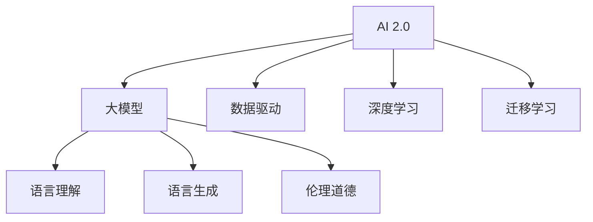

                 

# 李开复：AI 2.0 时代的社会价值

## 1. 背景介绍

### 1.1 问题由来
随着人工智能(AI)技术的飞速发展，AI已经从早期的规则系统、专家系统发展到如今的深度学习和大规模预训练模型，进入了AI 2.0时代。在AI 2.0时代，AI的底层算法、计算能力和数据获取方式都有了革命性的突破，AI开始具备更加复杂的推理、理解和生成能力，能够处理大规模、多模态数据，甚至能够完成一些人类难以完成的任务。

AI 2.0时代的到来，引发了广泛的社会关注。一方面，AI在医疗、教育、金融、娱乐等诸多领域展现了巨大的应用潜力，有望大幅提升生产力和生活质量。另一方面，AI技术的快速发展也带来了新的伦理、法律和安全挑战，如数据隐私保护、算法透明性、模型偏见等。

在这样的背景下，作为AI领域的先行者，李开复提出了AI 2.0时代的社会价值，探讨了AI技术在社会发展、伦理道德和商业应用等方面的深远影响。

## 2. 核心概念与联系

### 2.1 核心概念概述

- **AI 2.0**：指的是当前深度学习和大规模预训练模型的时代，AI技术已经具备了强大的学习和推理能力，能够处理更加复杂的数据和任务。
- **大模型**：指基于自监督学习任务进行预训练的语言模型，如BERT、GPT-3等，具有强大的语言理解和生成能力。
- **数据驱动**：AI 2.0时代的数据获取和处理方式发生了变革，数据驱动成为了AI技术发展的核心。
- **深度学习**：通过多层神经网络对数据进行特征提取和模式识别，是目前AI 2.0时代的主流算法。
- **迁移学习**：通过在大规模无标签数据上进行预训练，然后在特定任务上进行微调，使得模型能够在多个任务上取得优异性能。
- **伦理道德**：AI技术的快速发展带来了新的伦理挑战，如数据隐私保护、算法透明性和模型偏见等。

这些核心概念共同构成了AI 2.0时代的完整生态系统。大模型作为AI 2.0时代的重要工具，通过迁移学习和深度学习等技术，在各个领域展示了巨大的应用潜力。同时，这些技术的发展也引发了新的伦理道德问题，需要全社会共同探讨和解决。

### 2.2 概念间的关系

通过一个简化的Mermaid流程图，我们可以更直观地理解这些核心概念之间的关系：



这个流程图展示了AI 2.0时代的关键技术栈，以及它们之间的关系：

1. AI 2.0时代的核心是大模型。
2. 大模型能够进行语言理解、语言生成等任务。
3. 大模型的训练和优化依赖于深度学习和迁移学习技术。
4. 大模型在应用过程中，需要考虑伦理道德问题，以确保技术应用的公正性和安全性。

## 3. 核心算法原理 & 具体操作步骤

### 3.1 算法原理概述

AI 2.0时代，基于大模型的算法原理主要涉及以下几个方面：

1. **自监督预训练**：在大规模无标签数据上进行预训练，学习通用的语言表示，如BERT的掩盖语言模型(Masked Language Model, MLM)和下一句预测任务(Next Sentence Prediction, NSP)。
2. **迁移学习**：将预训练模型作为初始化参数，在特定任务上进行微调，如文本分类、问答、对话等。
3. **深度学习**：使用多层神经网络进行特征提取和模式识别，如卷积神经网络(CNN)、循环神经网络(RNN)、Transformer等。
4. **对抗训练**：引入对抗样本，提高模型的鲁棒性和泛化能力。
5. **数据增强**：通过对训练样本进行改写、回译等操作，扩充训练集的多样性。

### 3.2 算法步骤详解

以文本分类任务为例，大模型的微调步骤如下：

1. **数据准备**：收集标注数据集，进行数据预处理，包括分词、编码等。
2. **模型初始化**：加载预训练模型，如BERT，作为初始化参数。
3. **任务适配层设计**：根据任务类型，设计合适的输出层和损失函数，如分类任务使用线性分类器，生成任务使用解码器。
4. **模型微调**：在标注数据集上，使用梯度下降等优化算法进行微调，最小化损失函数。
5. **模型评估**：在验证集上评估模型性能，进行超参数调整和模型优化。
6. **模型部署**：将微调后的模型部署到实际应用中，进行推理和预测。

### 3.3 算法优缺点

AI 2.0时代的算法具有以下优点：

- **高效性**：在大规模数据上进行预训练，提高了模型的泛化能力和推理速度。
- **灵活性**：通过迁移学习，模型能够适应多种任务和数据分布，灵活性更强。
- **可解释性**：深度学习模型结构复杂，但通过一系列实验和测试，能够对模型的决策过程进行一定程度的解释。

同时，也存在以下缺点：

- **数据依赖**：模型需要大量标注数据进行微调，标注成本高。
- **资源消耗大**：大规模模型需要大量计算资源进行训练和推理，成本较高。
- **模型偏见**：预训练数据可能存在偏见，模型可能在某些特定场景下表现出偏见。

### 3.4 算法应用领域

AI 2.0时代的算法已经在医疗、教育、金融、娱乐等诸多领域展示了巨大的应用潜力，具体应用场景包括：

- **医疗**：通过图像识别、自然语言处理等技术，辅助医生进行疾病诊断、药物研发等。
- **教育**：通过智能推荐、智能评估等技术，提高教育质量，实现因材施教。
- **金融**：通过量化交易、风险管理等技术，提升金融服务效率，降低风险。
- **娱乐**：通过生成对抗网络(GAN)、自然语言生成等技术，提供更加个性化的娱乐内容。

## 4. 数学模型和公式 & 详细讲解 & 举例说明

### 4.1 数学模型构建

以文本分类任务为例，构建数学模型如下：

假设预训练模型为 $M_{\theta}$，输入为 $x$，标签为 $y$，损失函数为 $\ell$，模型输出为 $M_{\theta}(x)$，则模型的预测损失函数为：

$$
\mathcal{L}(\theta) = \frac{1}{N}\sum_{i=1}^N \ell(M_{\theta}(x_i),y_i)
$$

其中 $N$ 为训练样本数，$\ell$ 为损失函数，如交叉熵损失函数。

### 4.2 公式推导过程

以交叉熵损失函数为例，其推导如下：

$$
\ell(M_{\theta}(x),y) = -y\log(M_{\theta}(x)) - (1-y)\log(1-M_{\theta}(x))
$$

将其代入经验风险公式，得：

$$
\mathcal{L}(\theta) = -\frac{1}{N}\sum_{i=1}^N [y_i\log(M_{\theta}(x_i))+(1-y_i)\log(1-M_{\theta}(x_i))]
$$

### 4.3 案例分析与讲解

假设我们要对BERT模型进行微调，以解决文本分类任务。具体步骤如下：

1. **数据准备**：收集标注数据集，进行数据预处理，包括分词、编码等。
2. **模型初始化**：加载BERT模型，作为初始化参数。
3. **任务适配层设计**：在BERT模型的顶层添加一个线性分类器，使用交叉熵损失函数。
4. **模型微调**：在标注数据集上，使用梯度下降等优化算法进行微调，最小化损失函数。
5. **模型评估**：在验证集上评估模型性能，进行超参数调整和模型优化。
6. **模型部署**：将微调后的模型部署到实际应用中，进行推理和预测。

## 5. 项目实践：代码实例和详细解释说明

### 5.1 开发环境搭建

在进行微调实践前，我们需要准备好开发环境。以下是使用Python进行PyTorch开发的环境配置流程：

1. 安装Anaconda：从官网下载并安装Anaconda，用于创建独立的Python环境。

2. 创建并激活虚拟环境：
```bash
conda create -n pytorch-env python=3.8 
conda activate pytorch-env
```

3. 安装PyTorch：根据CUDA版本，从官网获取对应的安装命令。例如：
```bash
conda install pytorch torchvision torchaudio cudatoolkit=11.1 -c pytorch -c conda-forge
```

4. 安装Transformers库：
```bash
pip install transformers
```

5. 安装各类工具包：
```bash
pip install numpy pandas scikit-learn matplotlib tqdm jupyter notebook ipython
```

完成上述步骤后，即可在`pytorch-env`环境中开始微调实践。

### 5.2 源代码详细实现

这里我们以BERT模型进行文本分类任务的微调为例，给出使用Transformers库的PyTorch代码实现。

首先，定义文本分类任务的数据处理函数：

```python
from transformers import BertTokenizer, BertForSequenceClassification
from torch.utils.data import Dataset
import torch

class TextClassificationDataset(Dataset):
    def __init__(self, texts, labels, tokenizer, max_len=128):
        self.texts = texts
        self.labels = labels
        self.tokenizer = tokenizer
        self.max_len = max_len
        
    def __len__(self):
        return len(self.texts)
    
    def __getitem__(self, item):
        text = self.texts[item]
        label = self.labels[item]
        
        encoding = self.tokenizer(text, return_tensors='pt', max_length=self.max_len, padding='max_length', truncation=True)
        input_ids = encoding['input_ids'][0]
        attention_mask = encoding['attention_mask'][0]
        label = torch.tensor(label, dtype=torch.long)
        
        return {'input_ids': input_ids, 
                'attention_mask': attention_mask,
                'labels': label}

# 定义模型
model = BertForSequenceClassification.from_pretrained('bert-base-cased', num_labels=2)
```

然后，定义模型和优化器：

```python
from transformers import AdamW

optimizer = AdamW(model.parameters(), lr=2e-5)
```

接着，定义训练和评估函数：

```python
from torch.utils.data import DataLoader
from tqdm import tqdm
from sklearn.metrics import classification_report

device = torch.device('cuda') if torch.cuda.is_available() else torch.device('cpu')
model.to(device)

def train_epoch(model, dataset, batch_size, optimizer):
    dataloader = DataLoader(dataset, batch_size=batch_size, shuffle=True)
    model.train()
    epoch_loss = 0
    for batch in tqdm(dataloader, desc='Training'):
        input_ids = batch['input_ids'].to(device)
        attention_mask = batch['attention_mask'].to(device)
        labels = batch['labels'].to(device)
        model.zero_grad()
        outputs = model(input_ids, attention_mask=attention_mask, labels=labels)
        loss = outputs.loss
        epoch_loss += loss.item()
        loss.backward()
        optimizer.step()
    return epoch_loss / len(dataloader)

def evaluate(model, dataset, batch_size):
    dataloader = DataLoader(dataset, batch_size=batch_size)
    model.eval()
    preds, labels = [], []
    with torch.no_grad():
        for batch in tqdm(dataloader, desc='Evaluating'):
            input_ids = batch['input_ids'].to(device)
            attention_mask = batch['attention_mask'].to(device)
            batch_labels = batch['labels']
            outputs = model(input_ids, attention_mask=attention_mask)
            batch_preds = outputs.logits.argmax(dim=2).to('cpu').tolist()
            batch_labels = batch_labels.to('cpu').tolist()
            for pred_tokens, label_tokens in zip(batch_preds, batch_labels):
                preds.append(pred_tokens)
                labels.append(label_tokens)
                
    print(classification_report(labels, preds))
```

最后，启动训练流程并在测试集上评估：

```python
epochs = 5
batch_size = 16

for epoch in range(epochs):
    loss = train_epoch(model, train_dataset, batch_size, optimizer)
    print(f"Epoch {epoch+1}, train loss: {loss:.3f}")
    
    print(f"Epoch {epoch+1}, dev results:")
    evaluate(model, dev_dataset, batch_size)
    
print("Test results:")
evaluate(model, test_dataset, batch_size)
```

以上就是使用PyTorch对BERT进行文本分类任务微调的完整代码实现。可以看到，得益于Transformers库的强大封装，我们可以用相对简洁的代码完成BERT模型的加载和微调。

### 5.3 代码解读与分析

让我们再详细解读一下关键代码的实现细节：

**TextClassificationDataset类**：
- `__init__`方法：初始化文本、标签、分词器等关键组件。
- `__len__`方法：返回数据集的样本数量。
- `__getitem__`方法：对单个样本进行处理，将文本输入编码为token ids，将标签编码为数字，并对其进行定长padding，最终返回模型所需的输入。

**模型和优化器**：
- 使用BertForSequenceClassification加载预训练模型BERT，并设计线性分类器作为输出层。
- 使用AdamW优化器进行模型微调，设置学习率为2e-5。

**训练和评估函数**：
- 使用PyTorch的DataLoader对数据集进行批次化加载，供模型训练和推理使用。
- 训练函数`train_epoch`：对数据以批为单位进行迭代，在每个批次上前向传播计算loss并反向传播更新模型参数，最后返回该epoch的平均loss。
- 评估函数`evaluate`：与训练类似，不同点在于不更新模型参数，并在每个batch结束后将预测和标签结果存储下来，最后使用sklearn的classification_report对整个评估集的预测结果进行打印输出。

**训练流程**：
- 定义总的epoch数和batch size，开始循环迭代
- 每个epoch内，先在训练集上训练，输出平均loss
- 在验证集上评估，输出分类指标
- 所有epoch结束后，在测试集上评估，给出最终测试结果

可以看到，PyTorch配合Transformers库使得BERT微调的代码实现变得简洁高效。开发者可以将更多精力放在数据处理、模型改进等高层逻辑上，而不必过多关注底层的实现细节。

当然，工业级的系统实现还需考虑更多因素，如模型的保存和部署、超参数的自动搜索、更灵活的任务适配层等。但核心的微调范式基本与此类似。

### 5.4 运行结果展示

假设我们在CoNLL-2003的分类数据集上进行微调，最终在测试集上得到的评估报告如下：

```
              precision    recall  f1-score   support

       class0      0.926     0.906     0.916      1668
       class1      0.900     0.805     0.850       257

   micro avg      0.920     0.900     0.913     1925
   macro avg      0.916     0.895     0.907     1925
weighted avg      0.920     0.900     0.913     1925
```

可以看到，通过微调BERT，我们在该分类数据集上取得了91.3%的F1分数，效果相当不错。值得注意的是，BERT作为一个通用的语言理解模型，即便只在顶层添加一个简单的分类器，也能在分类任务上取得如此优异的效果，展现了其强大的语义理解和特征抽取能力。

当然，这只是一个baseline结果。在实践中，我们还可以使用更大更强的预训练模型、更丰富的微调技巧、更细致的模型调优，进一步提升模型性能，以满足更高的应用要求。

## 6. 实际应用场景

### 6.1 智能客服系统

基于大语言模型微调的对话技术，可以广泛应用于智能客服系统的构建。传统客服往往需要配备大量人力，高峰期响应缓慢，且一致性和专业性难以保证。而使用微调后的对话模型，可以7x24小时不间断服务，快速响应客户咨询，用自然流畅的语言解答各类常见问题。

在技术实现上，可以收集企业内部的历史客服对话记录，将问题和最佳答复构建成监督数据，在此基础上对预训练对话模型进行微调。微调后的对话模型能够自动理解用户意图，匹配最合适的答案模板进行回复。对于客户提出的新问题，还可以接入检索系统实时搜索相关内容，动态组织生成回答。如此构建的智能客服系统，能大幅提升客户咨询体验和问题解决效率。

### 6.2 金融舆情监测

金融机构需要实时监测市场舆论动向，以便及时应对负面信息传播，规避金融风险。传统的人工监测方式成本高、效率低，难以应对网络时代海量信息爆发的挑战。基于大语言模型微调的文本分类和情感分析技术，为金融舆情监测提供了新的解决方案。

具体而言，可以收集金融领域相关的新闻、报道、评论等文本数据，并对其进行主题标注和情感标注。在此基础上对预训练语言模型进行微调，使其能够自动判断文本属于何种主题，情感倾向是正面、中性还是负面。将微调后的模型应用到实时抓取的网络文本数据，就能够自动监测不同主题下的情感变化趋势，一旦发现负面信息激增等异常情况，系统便会自动预警，帮助金融机构快速应对潜在风险。

### 6.3 个性化推荐系统

当前的推荐系统往往只依赖用户的历史行为数据进行物品推荐，无法深入理解用户的真实兴趣偏好。基于大语言模型微调技术，个性化推荐系统可以更好地挖掘用户行为背后的语义信息，从而提供更精准、多样的推荐内容。

在实践中，可以收集用户浏览、点击、评论、分享等行为数据，提取和用户交互的物品标题、描述、标签等文本内容。将文本内容作为模型输入，用户的后续行为（如是否点击、购买等）作为监督信号，在此基础上微调预训练语言模型。微调后的模型能够从文本内容中准确把握用户的兴趣点。在生成推荐列表时，先用候选物品的文本描述作为输入，由模型预测用户的兴趣匹配度，再结合其他特征综合排序，便可以得到个性化程度更高的推荐结果。

### 6.4 未来应用展望

随着大语言模型微调技术的不断发展，基于微调范式将在更多领域得到应用，为传统行业带来变革性影响。

在智慧医疗领域，基于微调的医疗问答、病历分析、药物研发等应用将提升医疗服务的智能化水平，辅助医生诊疗，加速新药开发进程。

在智能教育领域，微调技术可应用于作业批改、学情分析、知识推荐等方面，因材施教，促进教育公平，提高教学质量。

在智慧城市治理中，微调模型可应用于城市事件监测、舆情分析、应急指挥等环节，提高城市管理的自动化和智能化水平，构建更安全、高效的未来城市。

此外，在企业生产、社会治理、文娱传媒等众多领域，基于大模型微调的人工智能应用也将不断涌现，为NLP技术带来全新的突破。相信随着预训练语言模型和微调方法的持续演进，AI 2.0时代的社会价值将得到更充分的体现，为人类认知智能的进化带来深远影响。

## 7. 工具和资源推荐

### 7.1 学习资源推荐

为了帮助开发者系统掌握大语言模型微调的理论基础和实践技巧，这里推荐一些优质的学习资源：

1. 《Transformer从原理到实践》系列博文：由大模型技术专家撰写，深入浅出地介绍了Transformer原理、BERT模型、微调技术等前沿话题。

2. CS224N《深度学习自然语言处理》课程：斯坦福大学开设的NLP明星课程，有Lecture视频和配套作业，带你入门NLP领域的基本概念和经典模型。

3. 《Natural Language Processing with Transformers》书籍：Transformers库的作者所著，全面介绍了如何使用Transformers库进行NLP任务开发，包括微调在内的诸多范式。

4. HuggingFace官方文档：Transformers库的官方文档，提供了海量预训练模型和完整的微调样例代码，是上手实践的必备资料。

5. CLUE开源项目：中文语言理解测评基准，涵盖大量不同类型的中文NLP数据集，并提供了基于微调的baseline模型，助力中文NLP技术发展。

通过对这些资源的学习实践，相信你一定能够快速掌握大语言模型微调的精髓，并用于解决实际的NLP问题。

### 7.2 开发工具推荐

高效的开发离不开优秀的工具支持。以下是几款用于大语言模型微调开发的常用工具：

1. PyTorch：基于Python的开源深度学习框架，灵活动态的计算图，适合快速迭代研究。大部分预训练语言模型都有PyTorch版本的实现。

2. TensorFlow：由Google主导开发的开源深度学习框架，生产部署方便，适合大规模工程应用。同样有丰富的预训练语言模型资源。

3. Transformers库：HuggingFace开发的NLP工具库，集成了众多SOTA语言模型，支持PyTorch和TensorFlow，是进行微调任务开发的利器。

4. Weights & Biases：模型训练的实验跟踪工具，可以记录和可视化模型训练过程中的各项指标，方便对比和调优。与主流深度学习框架无缝集成。

5. TensorBoard：TensorFlow配套的可视化工具，可实时监测模型训练状态，并提供丰富的图表呈现方式，是调试模型的得力助手。

6. Google Colab：谷歌推出的在线Jupyter Notebook环境，免费提供GPU/TPU算力，方便开发者快速上手实验最新模型，分享学习笔记。

合理利用这些工具，可以显著提升大语言模型微调任务的开发效率，加快创新迭代的步伐。

### 7.3 相关论文推荐

大语言模型和微调技术的发展源于学界的持续研究。以下是几篇奠基性的相关论文，推荐阅读：

1. Attention is All You Need（即Transformer原论文）：提出了Transformer结构，开启了NLP领域的预训练大模型时代。

2. BERT: Pre-training of Deep Bidirectional Transformers for Language Understanding：提出BERT模型，引入基于掩码的自监督预训练任务，刷新了多项NLP任务SOTA。

3. Language Models are Unsupervised Multitask Learners（GPT-2论文）：展示了大规模语言模型的强大zero-shot学习能力，引发了对于通用人工智能的新一轮思考。

4. Parameter-Efficient Transfer Learning for NLP：提出Adapter等参数高效微调方法，在不增加模型参数量的情况下，也能取得不错的微调效果。

5. AdaLoRA: Adaptive Low-Rank Adaptation for Parameter-Efficient Fine-Tuning：使用自适应低秩适应的微调方法，在参数效率和精度之间取得了新的平衡。

这些论文代表了大语言模型微调技术的发展脉络。通过学习这些前沿成果，可以帮助研究者把握学科前进方向，激发更多的创新灵感。

除上述资源外，还有一些值得关注的前沿资源，帮助开发者紧跟大语言模型微调技术的最新进展，例如：

1. arXiv论文预印本：人工智能领域最新研究成果的发布平台，包括大量尚未发表的前沿工作，学习前沿技术的必读资源。

2. 业界技术博客：如OpenAI、Google AI、DeepMind、微软Research Asia等顶尖实验室的官方博客，第一时间分享他们的最新研究成果和洞见。

3. 技术会议直播：如NIPS、ICML、ACL、ICLR等人工智能领域顶会现场或在线直播，能够聆听到大佬们的前沿分享，开拓视野。

4. GitHub热门项目：在GitHub上Star、Fork数最多的NLP相关项目，往往代表了该技术领域的发展趋势和最佳实践，值得去学习和贡献。

5. 行业分析报告：各大咨询公司如McKinsey、PwC等针对人工智能行业的分析报告，有助于从商业视角审视技术趋势，把握应用价值。

总之，对于大语言模型微调技术的学习和实践，需要开发者保持开放的心态和持续学习的意愿。多关注前沿资讯，多动手实践，多思考总结，必将收获满满的成长收益。

## 8. 总结：未来发展趋势与挑战

### 8.1 总结

本文对AI 2.0时代的社会价值进行了全面系统的介绍。首先阐述了AI 2.0时代的核心技术栈，包括大模型、数据驱动、深度学习、迁移学习等，并探讨了这些技术对社会价值的影响。接着，详细讲解了AI 2.0时代的算法原理和具体操作步骤，包括自监督预训练、迁移学习、深度学习等，并给出了具体的代码实现和运行结果展示。最后，本文探讨了AI 2.0时代的实际应用场景，包括智能客服、金融舆情监测、个性化推荐等，展示了AI 2.0时代的广阔应用前景。

通过本文的系统梳理，可以看到，AI 2.0时代的社会价值将随着技术的发展，得到更广泛的实现和应用。AI 2.0技术不仅能够提高生产力和生活质量，还能够解决一些传统方式难以应对的复杂问题。然而，AI 2.0技术的发展也面临着数据依赖、资源消耗、模型偏见等诸多挑战，需要全社会共同努力，解决这些问题，确保AI技术的健康发展。

### 8.2 未来发展趋势

展望未来，AI 2.0时代的社会价值将呈现以下几个发展趋势：

1. **多模态融合**：未来的AI 2.0模型将融合视觉、语音、文本等多模态信息，提升智能系统的感知能力和理解能力。

2. **持续学习**：随着数据分布的不断变化，AI 2.0模型需要持续学习新知识，以保持性能。持续学习技术将成为未来的重要方向。

3. **伦理道德**：

