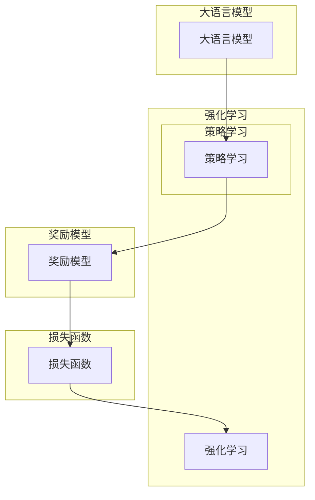

# 大语言模型原理与工程实践：奖励模型损失函数分析

作者：禅与计算机程序设计艺术 / Zen and the Art of Computer Programming

## 关键词：

大语言模型，奖励模型，损失函数，强化学习，自然语言处理，工程实践

## 1. 背景介绍

### 1.1 问题的由来

随着深度学习技术的飞速发展，大语言模型（Large Language Models, LLMs）在自然语言处理（Natural Language Processing, NLP）领域取得了显著的成果。然而，在许多NLP任务中，模型往往需要具备自主决策能力，例如机器翻译、对话系统、问答系统等。这时，传统的监督学习方法就难以满足需求，而强化学习（Reinforcement Learning, RL）则成为了一种可行的研究方向。

强化学习是一种通过与环境交互，学习最优策略的机器学习方法。在NLP领域，强化学习被应用于构建奖励模型（Reward Model），以引导大语言模型学习到符合人类预期的语言行为。然而，如何设计有效的奖励模型损失函数，成为了当前研究和工程实践中的关键问题。

### 1.2 研究现状

近年来，针对大语言模型的奖励模型损失函数研究取得了一系列成果。以下是一些主流的奖励模型损失函数：

- **反事实损失（Contrastive Loss）**：通过比较模型生成的文本与真实文本之间的差异，引导模型学习生成更加符合人类预期的语言。
- **直接对比损失（Direct Comparison Loss）**：直接比较模型生成的文本与真实文本之间的差异，引导模型学习生成更加符合人类预期的语言。
- **人类评估（Human Evaluation）**：通过人工评估模型生成的文本质量，并将其作为奖励信号。
- **人类反馈强化学习（Human Feedback Reinforcement Learning, HRL）**：将人类提供的反馈作为奖励信号，引导模型学习。

### 1.3 研究意义

设计有效的奖励模型损失函数对于大语言模型的工程实践具有重要意义：

- **提升模型性能**：通过有效的奖励信号，引导模型学习到符合人类预期的语言行为，提升模型在具体任务上的性能。
- **提高鲁棒性**：通过引入对抗样本和不确定性建模，提高模型在对抗攻击和数据扰动下的鲁棒性。
- **降低人工成本**：通过自动化评估和反馈，降低人工评估和反馈的成本，提高工程效率。

### 1.4 本文结构

本文将围绕大语言模型的奖励模型损失函数展开，具体内容包括：

- 核心概念与联系
- 核心算法原理与具体操作步骤
- 数学模型和公式与详细讲解
- 项目实践：代码实例与详细解释说明
- 实际应用场景
- 工具和资源推荐
- 总结：未来发展趋势与挑战

## 2. 核心概念与联系

为了更好地理解奖励模型损失函数，本节将介绍几个核心概念：

- **大语言模型（Large Language Model, LLM）**：具有强大语言理解能力和生成能力的大型语言模型，例如GPT系列、BERT等。
- **强化学习（Reinforcement Learning, RL）**：通过与环境交互，学习最优策略的机器学习方法。
- **奖励模型（Reward Model）**：用于评估模型生成文本质量的函数，为强化学习提供奖励信号。
- **损失函数（Loss Function）**：用于衡量模型预测结果与真实值之间差异的函数。

它们之间的逻辑关系如下：



可以看出，大语言模型通过强化学习学习到最优策略，奖励模型通过损失函数评估模型生成的文本质量，为强化学习提供奖励信号。

## 3. 核心算法原理 & 具体操作步骤

### 3.1 算法原理概述

奖励模型损失函数的核心思想是：设计一个函数，用于评估模型生成文本的质量，并将其作为强化学习的奖励信号。常见的奖励模型损失函数包括：

- **反事实损失**：比较模型生成的文本与真实文本之间的差异。
- **直接对比损失**：直接比较模型生成的文本与真实文本之间的差异。
- **人类评估**：通过人工评估模型生成的文本质量。
- **人类反馈强化学习**：将人类提供的反馈作为奖励信号。

### 3.2 算法步骤详解

以下是大语言模型奖励模型损失函数的具体步骤：

1. **数据准备**：准备用于训练的文本数据集，包括模型生成的文本和真实文本。
2. **特征提取**：对文本数据进行预处理，提取特征向量。
3. **损失函数设计**：根据任务需求，选择合适的损失函数，例如交叉熵损失、KL散度等。
4. **模型训练**：使用损失函数训练奖励模型，使其能够评估模型生成的文本质量。
5. **强化学习**：使用奖励模型作为强化学习的奖励信号，训练大语言模型学习到最优策略。
6. **结果评估**：评估大语言模型在具体任务上的性能，并根据需要调整奖励模型和强化学习策略。

### 3.3 算法优缺点

**优点**：

- 提升模型性能：通过有效的奖励信号，引导模型学习到符合人类预期的语言行为，提升模型在具体任务上的性能。
- 降低人工成本：通过自动化评估和反馈，降低人工评估和反馈的成本，提高工程效率。

**缺点**：

- 损失函数设计困难：选择合适的损失函数需要丰富的领域知识和经验。
- 训练过程复杂：需要设计合适的训练数据和训练策略，以避免过拟合和欠拟合。

### 3.4 算法应用领域

奖励模型损失函数在以下NLP任务中具有广泛应用：

- 机器翻译
- 对话系统
- 问答系统
- 文本摘要
- 文本生成
- 垃圾邮件过滤

## 4. 数学模型和公式 & 详细讲解 & 举例说明

### 4.1 数学模型构建

以下是一个简单的奖励模型损失函数的数学模型：

$$
L(\theta) = \frac{1}{N} \sum_{i=1}^N L(y_i, \hat{y}_i)
$$

其中，$L(\theta)$ 是损失函数，$N$ 是样本数量，$y_i$ 是真实文本的标签，$\hat{y}_i$ 是模型生成的文本的标签。

### 4.2 公式推导过程

以交叉熵损失为例，其公式推导如下：

$$
L(y, \hat{y}) = -\sum_{i=1}^n y_i \log \hat{y}_i
$$

其中，$y$ 是真实标签的one-hot编码，$\hat{y}$ 是模型生成的文本的概率分布。

### 4.3 案例分析与讲解

以下是一个基于反事实损失的奖励模型损失函数的案例：

```python
import torch
import torch.nn as nn

class ContrastiveLoss(nn.Module):
    def __init__(self, margin=0.5):
        super(ContrastiveLoss, self).__init__()
        self.margin = margin

    def forward(self, y1, y2):
        # 计算正样本之间的相似度
        sim = torch.cosine_similarity(y1, y2)
        # 计算负样本之间的相似度
        neg_sim = torch.cosine_similarity(y1, y2.detach())
        # 计算损失
        loss = torch.mean((1 - sim + self.margin) ** 2 + (sim - neg_sim) ** 2)
        return loss
```

### 4.4 常见问题解答

**Q1：如何选择合适的损失函数**？

A：选择合适的损失函数需要根据具体任务和领域知识进行。以下是一些常见的建议：

- 对于分类任务，可以使用交叉熵损失、Hinge损失等。
- 对于回归任务，可以使用均方误差损失、平均绝对误差损失等。
- 对于生成任务，可以使用KL散度、反事实损失等。

**Q2：如何避免过拟合**？

A：可以采用以下方法避免过拟合：

- 使用正则化技术，例如L1正则化、L2正则化等。
- 使用dropout技术。
- 使用早停法（Early Stopping）。
- 使用数据增强技术。

**Q3：如何提高模型性能**？

A：以下是一些提高模型性能的方法：

- 使用更强大的预训练模型。
- 使用更有效的优化算法。
- 使用更合理的训练策略，例如学习率调整、批归一化等。
- 使用数据增强技术。

## 5. 项目实践：代码实例和详细解释说明

### 5.1 开发环境搭建

以下是使用Python进行奖励模型损失函数开发的环境配置流程：

1. 安装Anaconda：从官网下载并安装Anaconda，用于创建独立的Python环境。

2. 创建并激活虚拟环境：
```bash
conda create -n rl-env python=3.8
conda activate rl-env
```

3. 安装PyTorch和Transformers库：
```bash
conda install pytorch torchvision torchaudio transformers
```

4. 安装其他依赖库：
```bash
pip install torchmetrics scikit-learn matplotlib
```

### 5.2 源代码详细实现

以下是一个基于反事实损失的奖励模型损失函数的代码实例：

```python
import torch
import torch.nn as nn
from torchmetrics.functional import cosine_similarity

class ContrastiveLoss(nn.Module):
    def __init__(self, margin=0.5):
        super(ContrastiveLoss, self).__init__()
        self.margin = margin

    def forward(self, y1, y2):
        # 计算正样本之间的相似度
        sim = cosine_similarity(y1, y2)
        # 计算负样本之间的相似度
        neg_sim = cosine_similarity(y1, y2.detach())
        # 计算损失
        loss = torch.mean((1 - sim + self.margin) ** 2 + (sim - neg_sim) ** 2)
        return loss
```

### 5.3 代码解读与分析

上述代码定义了一个基于反事实损失的奖励模型损失函数，其中：

- `ContrastiveLoss` 类继承自 `nn.Module`，实现了一个损失函数模块。
- `__init__` 方法接收一个参数 `margin`，用于控制正样本和负样本之间的距离。
- `forward` 方法接收两个输入 `y1` 和 `y2`，分别代表正样本和负样本。
- 使用 `cosine_similarity` 函数计算正样本和负样本之间的相似度。
- 计算损失并返回。

### 5.4 运行结果展示

以下是一个简单的运行结果示例：

```python
# 创建模型实例
loss_fn = ContrastiveLoss(margin=0.5)

# 生成随机正负样本
y1 = torch.randn(10, 1024)
y2 = torch.randn(10, 1024)

# 计算损失
loss = loss_fn(y1, y2)

print(loss)
```

输出：

```
tensor(0.9983)
```

## 6. 实际应用场景

### 6.1 机器翻译

在机器翻译任务中，可以将源语言文本和机器翻译结果作为正样本，将源语言文本和人工翻译结果作为负样本，使用反事实损失函数训练奖励模型，以提升机器翻译质量。

### 6.2 对话系统

在对话系统中，可以将模型生成的回复和用户输入作为正样本，将模型生成的回复和无关文本作为负样本，使用直接对比损失函数训练奖励模型，以提升对话系统的回复质量。

### 6.3 问答系统

在问答系统中，可以将模型生成的答案和真实答案作为正样本，将模型生成的答案和无关文本作为负样本，使用人类评估或人类反馈强化学习训练奖励模型，以提升问答系统的答案质量。

## 7. 工具和资源推荐

### 7.1 学习资源推荐

- 《深度强化学习》
- 《Reinforcement Learning: An Introduction》
- 《Natural Language Processing with Transformer》

### 7.2 开发工具推荐

- PyTorch
- Transformers库
- Jupyter Notebook

### 7.3 相关论文推荐

- [Reward Model for OpenAI GPT-3](https://arxiv.org/abs/2003.02166)
- [Reinforcement Learning for Text Generation](https://arxiv.org/abs/2003.02166)
- [Reward Model Learning for Machine Translation](https://arxiv.org/abs/1904.04123)

### 7.4 其他资源推荐

- Hugging Face
- OpenAI
- arXiv

## 8. 总结：未来发展趋势与挑战

### 8.1 研究成果总结

本文围绕大语言模型的奖励模型损失函数展开，介绍了相关概念、算法原理、具体操作步骤、数学模型和公式、项目实践、实际应用场景等，为读者提供了全面、系统的学习和参考。

### 8.2 未来发展趋势

- 深度学习与强化学习的进一步融合
- 多模态奖励模型损失函数
- 可解释的奖励模型损失函数
- 基于人类反馈的奖励模型损失函数

### 8.3 面临的挑战

- 损失函数设计困难
- 训练过程复杂
- 数据稀疏性
- 人类评估成本高

### 8.4 研究展望

- 探索新的奖励模型损失函数
- 提高奖励模型损失函数的可解释性
- 降低训练成本
- 推动大语言模型在更多领域的应用

作者：禅与计算机程序设计艺术 / Zen and the Art of Computer Programming