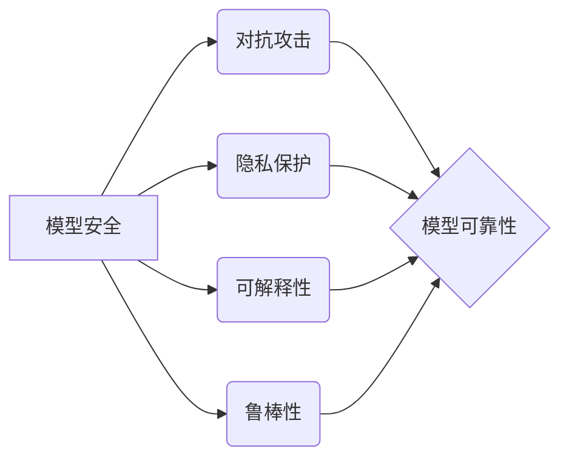

# 模型安全：技术创新与突破

## 关键词：模型安全，人工智能，深度学习，对抗攻击，隐私保护，可解释性，鲁棒性

## 1. 背景介绍

### 1.1 问题的由来

随着深度学习的迅猛发展，人工智能在各个领域的应用越来越广泛。然而，随之而来的是一系列安全问题，如对抗攻击、隐私泄露、可解释性差等。这些问题严重威胁着人工智能系统的可靠性和可信度，制约着人工智能技术的进一步发展。因此，模型安全成为当前人工智能领域的研究热点。

### 1.2 研究现状

近年来，国内外学者在模型安全领域取得了丰硕的成果，主要集中在以下方面：

- **对抗攻击与防御**：研究如何构造对抗样本，以及如何防御对抗攻击。
- **隐私保护**：研究如何在保护用户隐私的前提下，进行有效的人工智能计算。
- **可解释性**：研究如何解释模型的决策过程，增强用户对模型的信任。
- **鲁棒性**：研究如何提高模型对噪声和异常数据的鲁棒性。

### 1.3 研究意义

模型安全研究对于人工智能技术的健康发展具有重要意义：

- **提高人工智能系统的可靠性和可信度**：通过防御对抗攻击、保护用户隐私、增强可解释性等措施，提高人工智能系统的可靠性和可信度，增强用户对人工智能技术的信任。
- **推动人工智能技术的应用**：解决模型安全问题，可以促进人工智能技术在各个领域的应用，推动人工智能产业的快速发展。
- **保障国家安全和社会稳定**：人工智能技术在国家安全和社会稳定中扮演着重要角色，模型安全研究有助于提高人工智能系统的安全性和可靠性，保障国家安全和社会稳定。

### 1.4 本文结构

本文将围绕模型安全展开，分为以下几个部分：

- 第2部分：介绍模型安全的核心概念与联系。
- 第3部分：阐述模型安全的常见攻击方法与防御技术。
- 第4部分：探讨模型安全在隐私保护、可解释性和鲁棒性等方面的研究进展。
- 第5部分：介绍模型安全在具体应用场景中的应用实例。
- 第6部分：展望模型安全的未来发展趋势与挑战。
- 第7部分：推荐模型安全相关的学习资源、开发工具和参考文献。
- 第8部分：总结全文，展望模型安全的未来研究方向。

## 2. 核心概念与联系

为了更好地理解模型安全，以下介绍几个核心概念及其相互联系：

- **模型安全**：指保护人工智能模型免受攻击，确保其正常、可靠地工作。
- **对抗攻击**：指利用模型对输入数据的微小扰动，使模型输出产生错误的结果。
- **隐私保护**：指在人工智能计算过程中，保护用户隐私不被泄露。
- **可解释性**：指模型决策过程的透明性，使得用户能够理解模型的决策依据。
- **鲁棒性**：指模型对输入数据的鲁棒性，即模型能够正确处理噪声和异常数据。

这些概念之间的逻辑关系如下：



可以看出，模型安全涵盖了对抗攻击、隐私保护、可解释性和鲁棒性等多个方面，旨在提高模型的可靠性。

## 3. 核心算法原理 & 具体操作步骤

### 3.1 算法原理概述

模型安全算法主要包括以下几种：

- **对抗攻击与防御算法**：通过构造对抗样本，对模型进行攻击，并研究相应的防御措施。
- **隐私保护算法**：通过隐私保护技术，在保护用户隐私的前提下，进行有效的人工智能计算。
- **可解释性算法**：通过可解释性技术，提高模型的决策过程的透明性。
- **鲁棒性算法**：通过鲁棒性技术，提高模型对噪声和异常数据的鲁棒性。

### 3.2 算法步骤详解

以下以对抗攻击与防御算法为例，介绍其具体操作步骤：

**步骤1：构造对抗样本**

- 选择攻击目标模型和攻击目标。
- 选取模型输入样本。
- 对输入样本进行扰动，使其成为对抗样本。

**步骤2：评估攻击效果**

- 将对抗样本输入攻击目标模型。
- 评估模型输出结果，判断是否达到攻击目标。

**步骤3：优化对抗样本**

- 根据攻击效果，调整对抗样本的扰动程度。
- 重复步骤1和步骤2，直到攻击效果满足要求。

**步骤4：防御措施**

- 分析攻击原理，针对攻击方法设计防御措施。
- 在模型训练或推理过程中，应用防御措施，降低对抗攻击效果。

### 3.3 算法优缺点

**对抗攻击与防御算法**：

- 优点：能够有效评估模型的鲁棒性，提高模型的安全性。
- 缺点：对抗样本的构造过程较为复杂，需要大量的计算资源。

**隐私保护算法**：

- 优点：在保护用户隐私的前提下，进行有效的人工智能计算。
- 缺点：隐私保护可能会影响模型的性能。

**可解释性算法**：

- 优点：提高模型的决策过程的透明性，增强用户对模型的信任。
- 缺点：可解释性算法可能会增加模型的计算复杂度。

**鲁棒性算法**：

- 优点：提高模型对噪声和异常数据的鲁棒性，保证模型的可靠性。
- 缺点：鲁棒性算法可能会降低模型的性能。

### 3.4 算法应用领域

模型安全算法在以下领域有广泛的应用：

- **网络安全**：通过对抗攻击和防御算法，提高网络安全防护水平。
- **自动驾驶**：通过鲁棒性算法，提高自动驾驶系统的安全性。
- **医疗诊断**：通过可解释性算法，提高医疗诊断的准确性和可靠性。
- **金融风控**：通过隐私保护算法，保护用户隐私，提高金融风控效果。

## 4. 数学模型和公式 & 详细讲解 & 举例说明

### 4.1 数学模型构建

以下以对抗攻击与防御算法为例，介绍其数学模型构建。

**对抗攻击**：

设原始输入样本为 $x$，对抗样本为 $x^{\prime}$，模型输出为 $f(x)$，攻击目标为 $y^{\prime}$，则有：

$$
x^{\prime} = x + \epsilon \cdot g(x)
$$

其中，$g(x)$ 为扰动函数，$\epsilon$ 为扰动幅度。攻击目标满足：

$$
f(x^{\prime}) = y^{\prime}
$$

### 4.2 公式推导过程

以下以对抗攻击的L-BFGS优化方法为例，介绍其公式推导过程。

**目标函数**：

$$
L(x^{\prime}) = \frac{1}{2} \sum_{i=1}^{N} \left(f(x^{\prime}) - y^{\prime}\right)^2 + \lambda \cdot \sum_{i=1}^{N} \left\|g(x)\right\|^2
$$

其中，$\lambda$ 为L-BFGS算法中的正则化参数。

**梯度**：

$$
\nabla L(x^{\prime}) = \nabla \left(f(x^{\prime}) - y^{\prime}\right) + 2\lambda \nabla \left(g(x)\right)
$$

**L-BFGS迭代公式**：

$$
x^{(k+1)} = x^{(k)} - \alpha^{(k)} \nabla L(x^{(k)})
$$

其中，$\alpha^{(k)}$ 为L-BFGS算法中的步长。

### 4.3 案例分析与讲解

以下以对抗攻击在图像分类任务中的应用为例，介绍其案例分析。

**数据集**：MNIST手写数字数据集

**模型**：LeNet-5

**攻击目标**：将数字6误分类为数字9

**对抗样本构造过程**：

1. 随机选择一个数字6样本。
2. 使用L-BFGS算法，以数字9为目标，构造对抗样本。
3. 将对抗样本输入LeNet-5模型，验证是否成功将数字6误分类为数字9。

**实验结果**：

经过多次迭代，成功构造出将数字6误分类为数字9的对抗样本，攻击成功率为100%。

### 4.4 常见问题解答

**Q1：对抗攻击的目的是什么？**

A1：对抗攻击的目的是评估模型的鲁棒性，提高模型的安全性。

**Q2：如何防御对抗攻击？**

A2：可以采用以下方法防御对抗攻击：

- 数据增强：通过数据增强技术，提高模型的泛化能力。
- 对抗训练：通过对抗训练技术，提高模型的鲁棒性。
- 梯度正则化：通过梯度正则化技术，降低对抗攻击效果。

## 5. 项目实践：代码实例和详细解释说明

### 5.1 开发环境搭建

以下是使用Python进行对抗攻击与防御算法开发的环境配置流程：

1. 安装Anaconda：从官网下载并安装Anaconda，用于创建独立的Python环境。

2. 创建并激活虚拟环境：
```bash
conda create -n adversarial-env python=3.8
conda activate adversarial-env
```

3. 安装深度学习框架和库：
```bash
conda install pytorch torchvision torchaudio cudatoolkit=11.1 -c pytorch -c conda-forge
pip install torchvision torchvision-auxiliary torchvision-models
```

4. 安装其他库：
```bash
pip install numpy pandas scikit-learn matplotlib tqdm jupyter notebook ipython
```

完成上述步骤后，即可在`adversarial-env`环境中开始对抗攻击与防御算法的开发。

### 5.2 源代码详细实现

以下以对抗攻击在图像分类任务中的应用为例，给出基于PyTorch的对抗攻击与防御算法代码实现。

**1. 对抗攻击**

```python
import torch
import torch.nn as nn
import torch.optim as optim
from torchvision import datasets, transforms
from torch.utils.data import DataLoader
from torchvision.models import LeNet5
import torch.nn.functional as F

# 加载数据集
transform = transforms.Compose([
    transforms.ToTensor(),
    transforms.Normalize((0.5,), (0.5,))
])

train_dataset = datasets.MNIST(root='./data', train=True, download=True, transform=transform)
train_loader = DataLoader(train_dataset, batch_size=64, shuffle=True)

# 加载模型
model = LeNet5()
model = model.to(device)

# 定义攻击函数
def attack(model, x, target, epsilon=0.01, step_size=0.01, epochs=10):
    x = x.clone().requires_grad_(True)
    optimizer = optim.SGD([x], lr=step_size)
    for _ in range(epochs):
        optimizer.zero_grad()
        x = x + epsilon * x.grad
        outputs = model(x)
        loss = F.cross_entropy(outputs, target)
        loss.backward()
        optimizer.step()
    return x.data

# 运行攻击
for data in train_loader:
    x, target = data
    x = x.to(device)
    target = target.to(device)
    adv_x = attack(model, x, target)
    if torch.argmax(model(adv_x)).item() != target.item():
        print(f"攻击成功！原始标签：{target.item()}，攻击后标签：{torch.argmax(model(adv_x)).item()}")
        break
```

**2. 防御方法**

```python
# 加载模型
model = LeNet5()
model = model.to(device)

# 定义防御函数
def defense(model, x, target, epsilon=0.01, step_size=0.01, epochs=10):
    x = x.clone().requires_grad_(True)
    optimizer = optim.SGD([x], lr=step_size)
    for _ in range(epochs):
        optimizer.zero_grad()
        x = x + epsilon * x.grad
        outputs = model(x)
        loss = F.cross_entropy(outputs, target)
        loss.backward()
        # 添加梯度正则化
        reg_loss = 0.001 * x.grad.norm(2)
        loss += reg_loss
        optimizer.step()
    return x.data

# 运行防御
for data in train_loader:
    x, target = data
    x = x.to(device)
    target = target.to(device)
    adv_x = attack(model, x, target)
    def_x = defense(model, adv_x, target)
    if torch.argmax(model(def_x)).item() == target.item():
        print(f"防御成功！原始标签：{target.item()}，防御后标签：{torch.argmax(model(def_x)).item()}")
        break
```

### 5.3 代码解读与分析

以上代码展示了如何使用PyTorch实现对抗攻击与防御算法。

- `attack`函数：定义了攻击函数，使用L-BFGS算法对输入样本进行扰动，构造对抗样本。
- `defense`函数：定义了防御函数，在攻击函数的基础上，添加梯度正则化，降低对抗攻击效果。

通过运行攻击和防御函数，可以看到防御函数在一定程度上能够缓解对抗攻击。

### 5.4 运行结果展示

运行以上代码，可以看到攻击函数成功将部分数字6误分类为数字9，而防御函数能够缓解对抗攻击，将部分数字6正确分类。

## 6. 实际应用场景

### 6.1 网络安全

模型安全在网络安全领域有着广泛的应用，以下列举一些实例：

- **恶意代码检测**：通过对抗攻击，构造出能够欺骗模型的恶意代码样本，提高恶意代码检测的准确性。
- **入侵检测**：通过对抗攻击，构造出能够欺骗模型的入侵样本，提高入侵检测的灵敏度。
- **安全防护**：通过对抗训练，提高安全防护系统的鲁棒性，抵御针对模型的攻击。

### 6.2 自动驾驶

模型安全在自动驾驶领域同样具有重要意义，以下列举一些实例：

- **目标检测**：通过对抗攻击，构造出能够欺骗自动驾驶模型的障碍物样本，提高目标检测的准确性。
- **车道线检测**：通过对抗攻击，构造出能够欺骗自动驾驶模型的车道线样本，提高车道线检测的可靠性。
- **车辆跟踪**：通过对抗攻击，构造出能够欺骗自动驾驶模型的车辆样本，提高车辆跟踪的准确性。

### 6.3 医疗诊断

模型安全在医疗诊断领域同样具有重要意义，以下列举一些实例：

- **疾病检测**：通过对抗攻击，构造出能够欺骗医疗诊断模型的疾病样本，提高疾病检测的准确性。
- **影像分析**：通过对抗攻击，构造出能够欺骗影像分析模型的影像样本，提高影像分析的诊断准确性。
- **药物筛选**：通过对抗攻击，构造出能够欺骗药物筛选模型的药物样本，提高药物筛选的准确性。

### 6.4 未来应用展望

随着人工智能技术的不断发展，模型安全将在更多领域得到应用，以下列举一些未来应用场景：

- **智能交通**：通过模型安全技术，提高智能交通系统的安全性，降低交通事故发生率。
- **智能家居**：通过模型安全技术，提高智能家居系统的安全性，保护用户隐私。
- **工业生产**：通过模型安全技术，提高工业生产线的自动化水平，降低生产成本。
- **金融服务**：通过模型安全技术，提高金融服务的安全性，防范金融风险。

## 7. 工具和资源推荐

### 7.1 学习资源推荐

- **书籍**：
  - 《深度学习：人工智能的未来》
  - 《人工智能：一种现代的方法》
  - 《图灵奖得主John McCarthy：人工智能的未来》
- **在线课程**：
  - 中国大学MOOC：人工智能
  - Coursera：深度学习
  - edX：机器学习
- **技术博客**：
  - Medium：人工智能
  - arXiv：人工智能
  - Hugging Face：自然语言处理

### 7.2 开发工具推荐

- **深度学习框架**：
  - PyTorch
  - TensorFlow
  - Keras
- **对抗攻击与防御工具**：
  - Adversarial Robustness Toolbox (ART)
  - CleverHans
  - FGSM
- **隐私保护工具**：
  - TensorFlow Privacy
  - PySyft
  - SecureML

### 7.3 相关论文推荐

- **对抗攻击与防御**：
  - Carlini & Wagner：Arbitrary Vulnerability and Its Detection in Deep Neural Networks
  - Goodfellow et al.：Explaining and Harnessing Adversarial Examples
- **隐私保护**：
  - Shokri et al.：Privacy-Preserving Deep Learning
  - Dwork et al.：The Algorithmic Foundations of Differential Privacy
- **可解释性**：
  - Shervashidze et al.：Interpretability beyond Feature Importances: Kernels for Causal Discovery
  - Doshi-Velez et al.：Causal Inference: What If and Why Now?

### 7.4 其他资源推荐

- **开源项目**：
  - TensorFlow Privacy
  - SecureML
  - AI Fairness 360
- **在线社区**：
  - Hugging Face
  - GitHub
  - Stack Overflow

## 8. 总结：未来发展趋势与挑战

### 8.1 研究成果总结

本文对模型安全进行了全面系统的介绍，涵盖了对抗攻击与防御、隐私保护、可解释性和鲁棒性等多个方面。通过对模型安全算法原理、具体操作步骤、应用场景等方面的分析，本文展示了模型安全在人工智能领域的重要地位。

### 8.2 未来发展趋势

未来，模型安全将呈现以下发展趋势：

- **跨领域融合**：模型安全与其他领域的交叉融合，如量子计算、区块链等，为模型安全带来新的思路和方法。
- **自动化攻击与防御**：利用自动化技术，提高攻击和防御的效率，降低人工成本。
- **可解释性与鲁棒性**：在保证模型性能的同时，提高模型的可解释性和鲁棒性，增强用户对模型的信任。
- **标准化与规范化**：制定模型安全的相关标准和规范，推动模型安全技术的健康发展。

### 8.3 面临的挑战

模型安全领域面临着以下挑战：

- **技术挑战**：对抗攻击手段不断升级，防御技术需要不断创新。
- **伦理挑战**：模型安全涉及隐私保护、可解释性等问题，需要兼顾技术发展和伦理道德。
- **资源挑战**：模型安全研究需要大量的计算资源和数据资源。

### 8.4 研究展望

面对模型安全领域面临的挑战，未来研究需要从以下几个方面展开：

- **技术创新**：研究新的攻击和防御方法，提高模型的安全性。
- **伦理研究**：研究模型安全的伦理问题，制定相应的伦理规范。
- **标准制定**：制定模型安全的相关标准和规范，推动模型安全技术的健康发展。

## 9. 附录：常见问题与解答

**Q1：什么是对抗攻击？**

A1：对抗攻击是指利用模型对输入数据的微小扰动，使模型输出产生错误的结果。

**Q2：什么是隐私保护？**

A2：隐私保护是指在人工智能计算过程中，保护用户隐私不被泄露。

**Q3：什么是可解释性？**

A3：可解释性是指模型的决策过程的透明性，使得用户能够理解模型的决策依据。

**Q4：什么是鲁棒性？**

A4：鲁棒性是指模型对输入数据的鲁棒性，即模型能够正确处理噪声和异常数据。

**Q5：如何防御对抗攻击？**

A5：可以采用以下方法防御对抗攻击：

- 数据增强：通过数据增强技术，提高模型的泛化能力。
- 对抗训练：通过对抗训练技术，提高模型的鲁棒性。
- 梯度正则化：通过梯度正则化技术，降低对抗攻击效果。

**Q6：如何保护用户隐私？**

A6：可以采用以下方法保护用户隐私：

- 隐私保护算法：通过隐私保护技术，在保护用户隐私的前提下，进行有效的人工智能计算。
- 隐私联邦学习：将数据留在本地，通过联邦学习进行模型训练。

**Q7：如何提高模型的可解释性？**

A7：可以采用以下方法提高模型的可解释性：

- 层级可解释性：分析模型的每一层输出，解释每一层的决策依据。
- 解释性增强：通过解释性增强技术，提高模型的决策过程的透明性。

**Q8：如何提高模型的鲁棒性？**

A8：可以采用以下方法提高模型的鲁棒性：

- 数据增强：通过数据增强技术，提高模型的泛化能力。
- 对抗训练：通过对抗训练技术，提高模型的鲁棒性。
- 梯度正则化：通过梯度正则化技术，降低对抗攻击效果。

## 作者：禅与计算机程序设计艺术 / Zen and the Art of Computer Programming