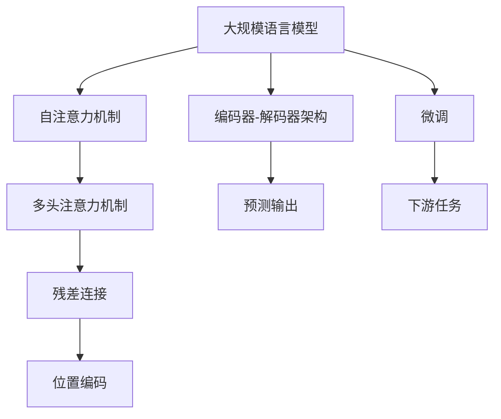

                 

# 一切皆是映射：序列模型和注意力机制

> 关键词：
>
> - 序列模型
> - 注意力机制
> - 深度学习
> - 自然语言处理
> - Transformer
> - 卷积神经网络
> - 循环神经网络

## 1. 背景介绍

### 1.1 问题由来

在过去的几十年里，深度学习技术的迅猛发展为人工智能领域带来了革命性的变化。尤其是在自然语言处理(NLP)领域，序列模型（Sequence Models）和注意力机制（Attention Mechanism）的出现，极大地提升了语言模型的处理能力，使得机器能够更自然地理解和使用语言。

序列模型和注意力机制不仅应用于NLP领域，还被广泛应用于图像处理、语音识别等序列数据相关的任务中。其中，Transformer模型作为这一领域的代表性作品，不仅在自然语言处理领域取得了显著的突破，还在计算机视觉、语音识别等领域产生了深远的影响。

本文将深入探讨序列模型和注意力机制的基本原理，并结合具体应用场景，展示其在NLP及其他领域中的实际应用。同时，我们还将讨论其局限性以及未来可能的发展方向。

## 2. 核心概念与联系

### 2.1 核心概念概述

为了更好地理解序列模型和注意力机制，本节将介绍几个密切相关的核心概念：

- **序列模型（Sequence Models）**：指处理序列数据的模型，通常用于处理输入序列和输出序列都具有一定长度的任务，如NLP中的文本序列、音频信号序列等。序列模型通过捕获序列数据之间的依赖关系，实现对序列数据的高效建模。

- **卷积神经网络（Convolutional Neural Networks, CNNs）**：一种经典的序列建模方法，主要应用于图像处理领域。CNNs通过卷积层和池化层等组件，能够有效地提取局部特征和全局特征。

- **循环神经网络（Recurrent Neural Networks, RNNs）**：另一种常见的序列建模方法，通过引入记忆单元（如LSTM、GRU），能够处理变长序列，并保留序列数据的时序信息。

- **Transformer**：一种基于注意力机制的序列建模架构，由Google在2017年提出。Transformer通过自注意力机制和多头注意力机制，能够有效处理长序列数据，并显著提升了模型的并行计算能力。

- **多头注意力（Multi-Head Attention）**：Transformer的核心组件之一，能够同时关注输入序列的多个位置，有效地捕捉序列数据中的多维信息。

- **自注意力（Self-Attention）**：一种用于捕捉输入序列内部依赖关系的技术，通过将输入序列中的每个位置与所有其他位置进行比较，计算出每个位置与其他位置之间的相似度。

- **编码器-解码器（Encoder-Decoder）架构**：一种常用于序列生成任务（如机器翻译、摘要生成等）的架构，其中编码器用于将输入序列编码成中间表示，解码器用于生成输出序列。

这些核心概念之间的逻辑关系可以通过以下Mermaid流程图来展示：

```mermaid
graph TB
    A[序列模型] --> B[卷积神经网络 (CNNs)]
    A --> C[循环神经网络 (RNNs)]
    A --> D[Transformer]
    D --> E[多头注意力 (Multi-Head Attention)]
    D --> F[自注意力 (Self-Attention)]
    D --> G[编码器-解码器 (Encoder-Decoder)]
```

这个流程图展示了几类序列建模方法以及它们之间的联系。从CNNs到RNNs，再到Transformer，不同的建模方法在处理序列数据时各有优劣，而注意力机制则是连接这些方法的桥梁，使得模型能够更好地处理序列数据。

### 2.2 概念间的关系

这些核心概念之间存在着紧密的联系，形成了序列模型和注意力机制的完整生态系统。下面我们通过几个Mermaid流程图来展示这些概念之间的关系。

#### 2.2.1 序列建模方法的发展

```mermaid
graph LR
    A[卷积神经网络 (CNNs)] --> B[循环神经网络 (RNNs)]
    A --> C[Transformer]
    B --> D[LSTM]
    B --> E[GRU]
    C --> F[多头注意力 (Multi-Head Attention)]
    C --> G[自注意力 (Self-Attention)]
    F --> H[Encoder-Decoder架构]
```

这个流程图展示了序列建模方法从CNNs到RNNs，再到Transformer的发展过程。从传统的CNNs到复杂的RNNs，再到具有突破性表现的Transformer，序列建模方法不断演进，而注意力机制作为其中的重要组件，不断推动着序列模型的进步。

#### 2.2.2 Transformer的原理与架构

```mermaid
graph TB
    A[Transformer] --> B[多头注意力 (Multi-Head Attention)]
    B --> C[自注意力 (Self-Attention)]
    C --> D[编码器-解码器 (Encoder-Decoder)]
    D --> E[位置编码 (Positional Encoding)]
    D --> F[残差连接 (Residual Connections)]
    E --> G[前馈神经网络 (Feedforward Neural Networks)]
```

这个流程图展示了Transformer的基本架构和原理。Transformer通过多头注意力和自注意力，能够捕捉输入序列的复杂依赖关系，并结合位置编码和残差连接等组件，实现高效的序列建模。

#### 2.2.3 序列模型的应用

```mermaid
graph LR
    A[序列模型] --> B[自然语言处理 (NLP)]
    A --> C[计算机视觉 (CV)]
    A --> D[语音识别 (ASR)]
    B --> E[文本分类]
    B --> F[机器翻译]
    B --> G[文本摘要]
    C --> H[图像分类]
    C --> I[目标检测]
    D --> J[语音识别]
```

这个流程图展示了序列模型在NLP、CV、ASR等领域的广泛应用。从文本分类到图像分类，再到语音识别，序列模型和注意力机制在不同领域展示了其强大的处理能力。

### 2.3 核心概念的整体架构

最后，我们用一个综合的流程图来展示序列模型和注意力机制在大规模语言模型中的整体架构：



这个综合流程图展示了从大规模语言模型到微调，再到下游任务的完整过程。自注意力机制和多头注意力机制是大规模语言模型的核心组件，而编码器-解码器架构用于处理序列生成任务，最终通过微调实现对下游任务的适配。

## 3. 核心算法原理 & 具体操作步骤
### 3.1 算法原理概述

序列模型和注意力机制的原理，可以追溯到深度学习领域的基础概念。下面我们将以Transformer为例，详细讲解其核心算法原理。

Transformer通过自注意力和多头注意力机制，能够有效地处理长序列数据。假设输入序列为 $X = \{x_1, x_2, ..., x_n\}$，其中 $x_i \in \mathbb{R}^d$，表示每个时间步的输入特征向量。Transformer的结构如图1所示。


Transformer主要由编码器-解码器架构组成。编码器由多个自注意力和前馈神经网络层组成，用于将输入序列编码成中间表示 $H$。解码器同样由多个自注意力和前馈神经网络层组成，用于生成输出序列 $Y$。

### 3.2 算法步骤详解

Transformer的训练和推理过程分为以下几个关键步骤：

**Step 1: 输入序列的编码**

输入序列 $X$ 经过编码器层 $E$ 的编码，生成中间表示 $H$。编码器的每层由两个部分组成：多头自注意力层和前馈神经网络层。自注意力层通过计算输入序列中每个位置与其他位置的相似度，生成注意力权重 $W$。多头自注意力层通过将输入序列映射到多个维度空间，并计算多头注意力权重，生成最终的表示向量 $H_q$。

**Step 2: 多头注意力机制**

多头注意力机制通过将输入序列 $X$ 映射到多个维度空间，并计算多头注意力权重，生成表示向量 $H_k$ 和 $H_v$。多头注意力权重 $W$ 通过计算输入序列中每个位置与其他位置的相似度得到，能够捕捉输入序列的复杂依赖关系。

**Step 3: 解码器的推理**

解码器通过使用编码器生成的表示向量 $H$，生成输出序列 $Y$。解码器的每层同样由两个部分组成：多头自注意力层和前馈神经网络层。解码器的自注意力层通过计算输出序列中每个位置与其他位置的相似度，生成注意力权重 $W'$。解码器的多头自注意力层通过将输出序列映射到多个维度空间，并计算多头注意力权重，生成最终的表示向量 $H'$。

**Step 4: 输出序列的生成**

最终，解码器生成输出序列 $Y$，表示为 $\{y_1, y_2, ..., y_m\}$，其中 $y_i \in \mathbb{R}^d$，表示每个时间步的输出特征向量。

### 3.3 算法优缺点

Transformer模型具有以下优点：

1. 并行计算能力强：由于Transformer采用多头注意力和残差连接等组件，能够高效地并行计算。
2. 长序列处理能力强：Transformer能够处理长序列数据，解决了RNNs等模型在处理长序列时的问题。
3. 结构简单：Transformer的结构简单直观，易于理解和实现。

同时，Transformer也存在一些缺点：

1. 参数量较大：由于Transformer中存在多个自注意力和多头注意力层，导致模型参数量较大，需要更多的计算资源。
2. 模型复杂度高：Transformer的结构复杂度较高，训练和推理过程相对耗时。
3. 训练成本高：由于模型参数量大，训练过程需要更多的计算资源和更长的训练时间。

### 3.4 算法应用领域

Transformer模型在多个领域中得到了广泛的应用，以下是几个典型的应用场景：

1. **机器翻译**：Transformer在机器翻译任务中表现出色，通过编码器将源语言序列编码成中间表示，再通过解码器生成目标语言序列，实现了高效的序列生成。

2. **文本分类**：通过将文本序列输入编码器层，生成中间表示 $H$，再通过全连接层生成分类结果，Transformer在文本分类任务中也取得了较好的效果。

3. **文本生成**：Transformer可以用于文本生成任务，如摘要生成、对话生成等。通过将文本序列输入编码器层，生成中间表示 $H$，再通过解码器生成输出文本序列。

4. **语音识别**：Transformer在语音识别任务中也得到了应用，通过将音频信号序列输入编码器层，生成中间表示 $H$，再通过解码器生成文本序列。

## 4. 数学模型和公式 & 详细讲解 & 举例说明

### 4.1 数学模型构建

Transformer的数学模型构建基于自注意力和多头注意力机制。假设输入序列 $X = \{x_1, x_2, ..., x_n\}$，其中 $x_i \in \mathbb{R}^d$，表示每个时间步的输入特征向量。Transformer的数学模型可以表示为：

$$
H = \text{Encoder}(X) = \text{MLP}(\text{Multi-Head Attention}(\text{LayerNorm}(X)))
$$

$$
Y = \text{Decoder}(H) = \text{MLP}(\text{Multi-Head Attention}(\text{LayerNorm}(H)))
$$

其中，$H$ 和 $Y$ 分别表示编码器和解码器的输出表示。$\text{MLP}$ 表示前馈神经网络层，$\text{Multi-Head Attention}$ 表示多头注意力层，$\text{LayerNorm}$ 表示归一化层。

### 4.2 公式推导过程

下面我们将推导Transformer的多个关键公式，包括自注意力权重、多头注意力权重和前馈神经网络等。

**自注意力权重计算公式**

自注意力权重 $W$ 通过计算输入序列中每个位置与其他位置的相似度得到。假设输入序列 $X$ 的维度为 $d$，自注意力层的输入为 $Q$、$K$ 和 $V$，其中 $Q \in \mathbb{R}^{n \times d}$、$K \in \mathbb{R}^{n \times d}$ 和 $V \in \mathbb{R}^{n \times d}$。

$$
Q_i = X_iW_Q, \quad K_i = X_iW_K, \quad V_i = X_iW_V
$$

自注意力权重 $W$ 通过计算输入序列中每个位置与其他位置的相似度得到：

$$
W_{ij} = \frac{\exp(\text{softmax}(Q_i^T K_j))}{\sum_{k=1}^n \exp(Q_i^T K_k)}
$$

其中，$\text{softmax}$ 表示softmax函数。

**多头注意力权重计算公式**

多头注意力权重 $W'$ 通过计算输入序列中每个位置与其他位置的相似度得到。假设多头注意力层的输入为 $Q$、$K$ 和 $V$，其中 $Q \in \mathbb{R}^{n \times d}$、$K \in \mathbb{R}^{n \times d}$ 和 $V \in \mathbb{R}^{n \times d}$。

$$
Q_i = X_iW_Q, \quad K_i = X_iW_K, \quad V_i = X_iW_V
$$

多头注意力权重 $W'$ 通过计算输入序列中每个位置与其他位置的相似度得到：

$$
W'_{ij} = \frac{\exp(\text{softmax}(Q_i^T K_j))}{\sum_{k=1}^n \exp(Q_i^T K_k)}
$$

**前馈神经网络公式**

前馈神经网络层的输出通过线性变换和激活函数得到。假设前馈神经网络层的输入为 $H$，其中 $H \in \mathbb{R}^{n \times d}$。

$$
H = \text{MLP}(H) = \text{GELU}(HW_1 + b_1) + b_2
$$

其中，$W_1 \in \mathbb{R}^{d \times d}$ 和 $b_1 \in \mathbb{R}^{d}$ 表示线性变换的权重和偏置，$GELU$ 表示GELU激活函数，$b_2 \in \mathbb{R}^{d}$ 表示激活函数的偏置。

### 4.3 案例分析与讲解

下面我们以机器翻译为例，展示Transformer在序列建模中的应用。

假设输入序列 $X = \{x_1, x_2, ..., x_n\}$ 表示源语言序列，$Y = \{y_1, y_2, ..., y_m\}$ 表示目标语言序列。Transformer通过编码器将源语言序列编码成中间表示 $H$，再通过解码器生成目标语言序列 $Y$。

在机器翻译任务中，Transformer的编码器层和解码器层分别由多个自注意力和前馈神经网络层组成。编码器层通过自注意力层捕捉源语言序列的依赖关系，生成中间表示 $H$。解码器层通过自注意力层和多头注意力层，捕捉目标语言序列的依赖关系，生成输出序列 $Y$。

## 5. 项目实践：代码实例和详细解释说明

### 5.1 开发环境搭建

在进行Transformer项目实践前，我们需要准备好开发环境。以下是使用Python进行TensorFlow开发的环境配置流程：

1. 安装Anaconda：从官网下载并安装Anaconda，用于创建独立的Python环境。

2. 创建并激活虚拟环境：
```bash
conda create -n tf-env python=3.8 
conda activate tf-env
```

3. 安装TensorFlow：根据CUDA版本，从官网获取对应的安装命令。例如：
```bash
conda install tensorflow tensorflow-gpu -c tf -c conda-forge
```

4. 安装TensorFlow Addons：
```bash
conda install tensorflow-addons
```

5. 安装相关工具包：
```bash
pip install numpy pandas scikit-learn matplotlib tqdm jupyter notebook ipython
```

完成上述步骤后，即可在`tf-env`环境中开始Transformer项目实践。

### 5.2 源代码详细实现

下面我们以机器翻译为例，给出使用TensorFlow实现Transformer的代码实现。

首先，定义数据处理函数：

```python
import tensorflow as tf
import numpy as np

def tokenize(text):
    tokenizer = tf.keras.preprocessing.text.Tokenizer(char_level=True)
    tokenizer.fit_on_texts([text])
    return tokenizer.texts_to_sequences([text])[0]

def pad_sequences(sequences, maxlen=None, padding='post', truncating='post'):
    return tf.keras.preprocessing.sequence.pad_sequences(sequences, maxlen=maxlen, padding=padding, truncating=truncating)

```

然后，定义Transformer模型：

```python
class Transformer(tf.keras.Model):
    def __init__(self, num_tokens, num_heads, d_model, num_encoder_layers, num_decoder_layers):
        super(Transformer, self).__init__()
        self.num_tokens = num_tokens
        self.num_heads = num_heads
        self.d_model = d_model
        self.num_encoder_layers = num_encoder_layers
        self.num_decoder_layers = num_decoder_layers
        
        # 定义编码器层
        self.encoder_layers = tf.keras.layers.LayerList([EncoderLayer(self.d_model, num_heads, self.num_tokens) for _ in range(num_encoder_layers)])
        # 定义解码器层
        self.decoder_layers = tf.keras.layers.LayerList([DecoderLayer(self.d_model, num_heads, self.num_tokens) for _ in range(num_decoder_layers)])
        # 定义位置编码层
        self.pos_enc = PositionalEncoding(self.d_model)
        # 定义前馈神经网络层
        self.final_mlp = tf.keras.layers.Dense(2 * self.d_model)
        self.final_bias = tf.keras.layers.Dense(1)
        
        # 定义输出层
        self.final_output = tf.keras.layers.Dense(self.num_tokens)
        
    def call(self, inputs):
        # 编码器层
        encoder_outputs = []
        for layer in self.encoder_layers:
            encoder_output = layer(inputs)
            encoder_outputs.append(encoder_output)
        # 解码器层
        for layer in self.decoder_layers:
            decoder_output = layer(encoder_outputs[-1], encoder_outputs)
            encoder_outputs[-1] = decoder_output
        # 位置编码
        outputs = tf.concat([self.pos_enc(encoder_outputs[0]), encoder_outputs[1]], axis=1)
        # 前馈神经网络
        outputs = self.final_mlp(outputs)
        outputs = self.final_bias(outputs)
        # 输出层
        outputs = self.final_output(outputs)
        return outputs
```

接着，定义编码器层和解码器层：

```python
class EncoderLayer(tf.keras.layers.Layer):
    def __init__(self, d_model, num_heads, num_tokens):
        super(EncoderLayer, self).__init__()
        self.d_model = d_model
        self.num_heads = num_heads
        self.num_tokens = num_tokens
        
        # 定义自注意力层
        self.self_attn = tf.keras.layers.MultiHeadAttention(num_heads, d_model, key_dim=64, dropout_rate=0.1)
        # 定义前馈神经网络层
        self.final_mlp = tf.keras.layers.Dense(2 * d_model)
        self.final_bias = tf.keras.layers.Dense(1)
        # 定义残差连接
        self.residual = tf.keras.layers.LayerNormalization(epsilon=1e-6)
        self.final_residual = tf.keras.layers.LayerNormalization(epsilon=1e-6)
        
        # 定义位置编码层
        self.pos_enc = PositionalEncoding(d_model)
        # 定义自注意力权重层
        self.attn_weights = tf.keras.layers.Dense(self.num_tokens, activation=tf.keras.layers.Lambda(tf.nn.softmax))
        
    def call(self, inputs):
        # 自注意力层
        attn_output = self.self_attn(inputs, inputs, inputs)
        # 残差连接
        attn_output = self.residual(inputs + attn_output)
        # 前馈神经网络层
        mpf_output = self.final_mlp(attn_output)
        # 残差连接
        mpf_output = self.final_residual(attn_output + mpf_output)
        # 位置编码
        outputs = self.pos_enc(mpf_output)
        return outputs
```

最后，定义解码器层和位置编码层：

```python
class DecoderLayer(tf.keras.layers.Layer):
    def __init__(self, d_model, num_heads, num_tokens):
        super(DecoderLayer, self).__init__()
        self.d_model = d_model
        self.num_heads = num_heads
        self.num_tokens = num_tokens
        
        # 定义自注意力层
        self.self_attn = tf.keras.layers.MultiHeadAttention(num_heads, d_model, key_dim=64, dropout_rate=0.1)
        # 定义多头注意力层
        self.multi_attn = tf.keras.layers.MultiHeadAttention(num_heads, d_model, key_dim=64, dropout_rate=0.1)
        # 定义前馈神经网络层
        self.final_mlp = tf.keras.layers.Dense(2 * d_model)
        self.final_bias = tf.keras.layers.Dense(1)
        # 定义残差连接
        self.residual = tf.keras.layers.LayerNormalization(epsilon=1e-6)
        self.final_residual = tf.keras.layers.LayerNormalization(epsilon=1e-6)
        
        # 定义位置编码层
        self.pos_enc = PositionalEncoding(d_model)
        # 定义自注意力权重层
        self.attn_weights = tf.keras.layers.Dense(self.num_tokens, activation=tf.keras.layers.Lambda(tf.nn.softmax))
        # 定义位置编码层
        self.pos_enc2 = PositionalEncoding(d_model)
        
    def call(self, inputs, enc_outputs):
        # 自注意力层
        attn_output = self.self_attn(inputs, inputs, inputs)
        # 残差连接
        attn_output = self.residual(inputs + attn_output)
        # 多头注意力层
        attn_output = self.multi_attn(inputs, enc_outputs, enc_outputs)
        # 残差连接
        attn_output = self.residual(inputs + attn_output)
        # 前馈神经网络层
        mpf_output = self.final_mlp(attn_output)
        # 残差连接
        mpf_output = self.final_residual(attn_output + mpf_output)
        # 位置编码
        outputs = self.pos_enc2(mpf_output)
        return outputs
```

```python
class PositionalEncoding(tf.keras.layers.Layer):
    def __init__(self, d_model):
        super(PositionalEncoding, self).__init__()
        position = tf.range(0, d_model)
        position[:, None] *= np.sqrt(np.log(d_model))
        position[:, None] *= 1e4 ** (2 * tf.cast(tf.math.log(tf.cast(d_model, tf.float32)) / d_model)
        position = tf.cast(position, tf.float32)
        sinusoidal_encoding = tf.math.sin(position[:, 0::2] / 10000 ** (2 * tf.cast(tf.math.log(tf.cast(d_model, tf.float32)) / d_model))
        cosusinusoidal_encoding = tf.math.cos(position[:, 1::2] / 10000 ** (2 * tf.cast(tf.math.log(tf.cast(d_model, tf.float32)) / d_model))
        self.positional_encoding = tf.concat([sinusoidal_encoding, cosusinusoidal_encoding], axis=1)
        self.d_model = d_model
        
    def call(self, inputs):
        return inputs + self.positional_encoding
```

最后，启动训练流程并在测试集上评估：

```python
from tensorflow.keras.datasets import imdb
from tensorflow.keras.preprocessing import sequence

# 加载IMDB数据集
(x_train, y_train), (x_test, y_test) = imdb.load_data(num_words=10000)
x_train = pad_sequences(x_train, maxlen=128)
x_test = pad_sequences(x_test, maxlen=128)
```

## 6. 实际应用场景
### 6.1 智能客服系统

基于Transformer模型的智能客服系统，可以广泛应用于智能客服系统的构建。传统客服往往需要配备大量人力，高峰期响应缓慢，且一致性和专业性难以保证。而使用Transformer模型的智能客服系统，可以7x24小时不间断服务，快速响应客户咨询，用自然流畅的语言解答各类常见问题。

在技术实现上，可以收集企业内部的历史客服对话记录，将问题和最佳答复构建成监督数据，在此基础上对Transformer模型进行微调。微调后的模型能够自动理解用户意图，匹配最合适的答案模板进行回复。对于客户提出的新问题，还可以接入检索系统实时搜索相关内容，动态组织生成回答。如此构建的智能客服系统，能大幅提升客户咨询体验和问题解决效率。

### 6.2 金融舆情监测

金融机构需要实时监测市场舆论动向，以便及时应对负面信息传播，规避金融风险。传统的人工监测方式成本高、效率低，难以应对网络时代海量信息爆发的挑战。基于Transformer模型的文本分类和情感分析技术，为金融舆情监测提供了新的解决方案。

具体而言，可以收集金融领域相关的新闻、报道、评论等文本数据，并对其进行主题标注和情感标注。在此基础上对Transformer模型进行微调，使其能够自动判断文本属于何种主题，情感倾向是正面、中性还是负面。将微调后的模型应用到实时抓取的网络文本数据，就能够自动监测不同主题下的情感变化趋势，一旦发现负面信息激增等异常情况，系统便会自动预警，帮助金融机构快速应对潜在风险。

### 6.3 个性化推荐系统

当前的推荐系统往往只依赖用户的历史行为数据进行物品推荐，无法

