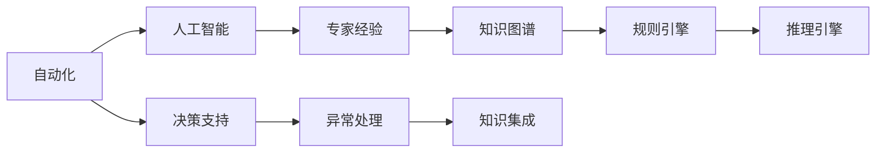

                 

# 专家经验在自动化中的应用

## 1. 背景介绍

自动化在当今社会中扮演着日益重要的角色，从生产制造到客户服务，再到办公室日常工作，自动化技术正在不断重塑各个行业的运行方式。随着人工智能（AI）和机器学习（ML）技术的发展，自动化正在变得更加智能化和个性化。然而，尽管自动化技术在提高效率和降低成本方面具有巨大的潜力，其效果很大程度上取决于专家的经验。

### 1.1 自动化背景
自动化在制造业、金融业、物流业等多个领域都有广泛的应用。传统的自动化技术依赖于硬编码的规则和逻辑，缺乏对复杂场景的适应性和灵活性。而随着AI和ML技术的发展，自动化正在向智能化和自适应方向演进，越来越多的企业开始探索如何利用专家的知识和经验来增强自动化的效果。

### 1.2 专家经验的重要性
专家经验在自动化中的应用主要体现在以下几个方面：

- **决策支持**：专家经验可以指导机器学习模型的训练和调整，提高模型的决策准确性和鲁棒性。
- **规则制定**：通过专家的经验可以制定更加细致和全面的自动化规则，提升自动化的覆盖范围和灵活性。
- **异常处理**：专家经验可以指导异常检测和处理，帮助系统快速识别和响应异常情况。
- **知识集成**：专家经验可以与机器学习模型结合，提升系统的整体智能化水平。

### 1.3 问题由来
尽管专家经验在自动化中的应用具有诸多优势，但在实际应用中仍然面临一些挑战。例如，如何有效地将专家经验编码到自动化系统中，如何让机器学习模型更好地利用专家知识，如何在保持系统灵活性的同时，确保其稳定性和可靠性。这些问题正是本文将要探讨的核心内容。

## 2. 核心概念与联系

### 2.1 核心概念概述

为了更好地理解专家经验在自动化中的应用，本文将介绍几个关键概念：

- **自动化**：通过软件和硬件设备，使系统能够自动完成特定任务的过程。
- **人工智能**：通过机器学习、深度学习等技术，使系统具备一定的智能决策能力。
- **专家经验**：领域专家在长期的实践中积累的知识和技能。
- **知识图谱**：将专家经验以图谱的形式结构化，便于机器理解和利用。
- **规则引擎**：基于专家经验制定的自动化规则，指导系统行为。
- **推理引擎**：用于在自动化系统中进行复杂逻辑推理，以提升决策准确性。

### 2.2 概念间的关系

这些核心概念之间的关系可以通过以下Mermaid流程图来展示：



这个流程图展示了从自动化到专家经验的应用流程：

1. 自动化系统通过人工智能技术实现智能决策，但仍需专家经验指导。
2. 专家经验被结构化为知识图谱，便于机器理解和应用。
3. 知识图谱被转化为自动化规则，指导系统行为。
4. 推理引擎在自动化系统中进行复杂逻辑推理，提高决策准确性。
5. 自动化系统通过决策支持、异常处理和知识集成，实现智能化升级。

## 3. 核心算法原理 & 具体操作步骤

### 3.1 算法原理概述

专家经验在自动化中的应用主要通过以下几个核心算法实现：

- **知识提取**：从专家知识库中提取有价值的信息，形成结构化的知识图谱。
- **知识融合**：将知识图谱与机器学习模型结合，提升模型的决策能力。
- **规则制定**：基于专家经验制定自动化规则，指导系统行为。
- **推理机制**：在自动化系统中构建推理引擎，提升决策的灵活性和鲁棒性。
- **决策优化**：通过决策支持技术，优化自动化的决策过程。

### 3.2 算法步骤详解

以下是专家经验在自动化中应用的具体操作步骤：

**Step 1: 专家经验收集与整理**
- 与领域专家进行深入交流，了解其经验和知识。
- 对专家经验进行整理和分类，形成结构化的知识库。

**Step 2: 知识图谱构建**
- 将知识库转换为知识图谱，便于机器理解和处理。
- 使用知识提取工具，从知识库中抽取实体、关系和属性。
- 构建知识图谱的图形结构，形成专家知识网络。

**Step 3: 规则引擎设计**
- 基于知识图谱，制定自动化规则，指导系统行为。
- 将规则进行编码和形式化表达，便于计算机理解和执行。
- 设计规则引擎，用于根据当前情境和知识图谱，动态生成和执行规则。

**Step 4: 推理引擎构建**
- 设计推理引擎，支持在自动化系统中进行复杂逻辑推理。
- 使用推理规则和知识图谱，实现对未知情况的自动推理和判断。
- 通过迭代优化和反馈机制，提高推理引擎的准确性和鲁棒性。

**Step 5: 决策优化**
- 设计决策支持系统，结合专家经验和机器学习模型，优化决策过程。
- 利用机器学习模型对历史决策结果进行分析和优化，提升决策的准确性和效率。
- 通过持续学习，让决策支持系统不断迭代和升级。

### 3.3 算法优缺点

专家经验在自动化中的应用具有以下优点：

- **提高决策质量**：通过结合专家经验和机器学习模型，提升自动化系统的决策准确性和鲁棒性。
- **增强灵活性**：专家经验可以使自动化系统更好地适应复杂和多变的场景，提高系统的灵活性。
- **降低成本**：利用专家经验可以减少对人工干预的依赖，降低运营成本。

同时，专家经验在自动化中应用也存在一些缺点：

- **依赖专家知识**：自动化系统的效果高度依赖专家的经验和知识，一旦专家离岗或经验更新，系统性能可能受到影响。
- **知识传递困难**：将专家经验转换为机器可理解的形式，需要一定的时间和成本。
- **系统复杂性增加**：在自动化系统中加入专家经验，系统结构和逻辑会变得更为复杂，维护成本也相应增加。

### 3.4 算法应用领域

专家经验在自动化中的应用，已经在多个领域取得了显著成效：

- **金融风控**：利用专家经验构建规则引擎和推理引擎，实现对交易行为的实时监控和风险评估。
- **医疗诊断**：通过专家经验构建知识图谱，辅助医生进行疾病诊断和治疗方案制定。
- **制造业质量控制**：利用专家经验制定质量控制规则，提高产品质量和生产效率。
- **物流配送**：通过专家经验优化配送路线和仓储管理，提高物流系统的效率和准确性。
- **客户服务**：结合专家经验构建自然语言处理系统，实现智能客服和客户情感分析。

## 4. 数学模型和公式 & 详细讲解  
### 4.1 数学模型构建

在自动化应用中，专家经验通常以知识图谱的形式存在，我们可以将其表示为一个有向图 $G=(V, E)$，其中 $V$ 是节点集，表示知识图谱中的实体和属性；$E$ 是边集，表示实体之间的关系。知识图谱中的知识可以表示为三元组 $(r, s, o)$，其中 $r$ 是关系，$s$ 是起点实体，$o$ 是终点实体。

### 4.2 公式推导过程

在自动化应用中，专家经验可以通过以下几个步骤进行建模和推理：

1. **实体抽取**：从文本中识别出实体，并将其表示为知识图谱中的节点。
2. **关系抽取**：从文本中识别出实体之间的关系，并将其表示为知识图谱中的边。
3. **属性抽取**：从文本中识别出实体的属性，并将其表示为知识图谱中的属性节点。
4. **规则制定**：基于知识图谱，制定自动化规则，指导系统行为。
5. **推理计算**：使用推理引擎，根据知识图谱进行复杂逻辑推理，以支持自动化决策。

### 4.3 案例分析与讲解

**案例分析**：在金融风控领域，专家经验可以用于构建知识图谱和规则引擎，实现对交易行为的实时监控和风险评估。

- **知识图谱构建**：利用金融领域的专家经验，构建包含交易行为、公司背景、风险指标等信息的知识图谱。
- **规则引擎设计**：基于知识图谱，制定交易监控规则，如识别异常交易行为、防范欺诈行为等。
- **推理引擎构建**：使用推理引擎，根据当前交易数据和知识图谱，进行实时推理和判断，输出风险评估结果。

## 5. 项目实践：代码实例和详细解释说明

### 5.1 开发环境搭建

在进行自动化应用开发前，我们需要准备好开发环境。以下是使用Python进行PyTorch开发的环境配置流程：

1. 安装Anaconda：从官网下载并安装Anaconda，用于创建独立的Python环境。

2. 创建并激活虚拟环境：
```bash
conda create -n pytorch-env python=3.8 
conda activate pytorch-env
```

3. 安装PyTorch：根据CUDA版本，从官网获取对应的安装命令。例如：
```bash
conda install pytorch torchvision torchaudio cudatoolkit=11.1 -c pytorch -c conda-forge
```

4. 安装各类工具包：
```bash
pip install numpy pandas scikit-learn matplotlib tqdm jupyter notebook ipython
```

完成上述步骤后，即可在`pytorch-env`环境中开始自动化应用开发。

### 5.2 源代码详细实现

下面以金融风控为例，给出使用Transformers库进行知识图谱构建和推理的PyTorch代码实现。

首先，定义知识图谱类：

```python
from transformers import GPT2Tokenizer
from torch.utils.data import Dataset
import torch

class GraphDataset(Dataset):
    def __init__(self, graphs, tokenizer, max_len=128):
        self.graphs = graphs
        self.tokenizer = tokenizer
        self.max_len = max_len
        
    def __len__(self):
        return len(self.graphs)
    
    def __getitem__(self, item):
        graph = self.graphs[item]
        
        # 将知识图谱转换为token ids
        tokens = self.tokenizer.encode(str(graph), add_special_tokens=True, max_length=self.max_len, padding='max_length', truncation=True)
        input_ids = torch.tensor(tokens, dtype=torch.long)
        
        return {'input_ids': input_ids}

# 知识图谱示例
graphs = [
    {'r': '交易行为', 's': 'A公司', 'o': 'B公司', 'p': '金额'},
    {'r': '交易行为', 's': 'B公司', 'o': 'C公司', 'p': '金额'},
    {'r': '公司背景', 's': 'A公司', 'o': '黑色历史', 'p': '涉及金额'}
]
```

然后，定义推理模型和优化器：

```python
from transformers import GPT2ForSequenceClassification

model = GPT2ForSequenceClassification.from_pretrained('gpt2', num_labels=3)

optimizer = AdamW(model.parameters(), lr=2e-5)
```

接着，定义训练和推理函数：

```python
from tqdm import tqdm

device = torch.device('cuda') if torch.cuda.is_available() else torch.device('cpu')
model.to(device)

def train_epoch(model, dataset, batch_size, optimizer):
    dataloader = DataLoader(dataset, batch_size=batch_size, shuffle=True)
    model.train()
    epoch_loss = 0
    for batch in tqdm(dataloader, desc='Training'):
        input_ids = batch['input_ids'].to(device)
        model.zero_grad()
        outputs = model(input_ids)
        loss = outputs.loss
        epoch_loss += loss.item()
        loss.backward()
        optimizer.step()
    return epoch_loss / len(dataloader)

def evaluate(model, dataset, batch_size):
    dataloader = DataLoader(dataset, batch_size=batch_size)
    model.eval()
    preds, labels = [], []
    with torch.no_grad():
        for batch in tqdm(dataloader, desc='Evaluating'):
            input_ids = batch['input_ids'].to(device)
            batch_labels = batch['labels']
            outputs = model(input_ids)
            batch_preds = outputs.logits.argmax(dim=2).to('cpu').tolist()
            batch_labels = batch_labels.to('cpu').tolist()
            for pred_tokens, label_tokens in zip(batch_preds, batch_labels):
                preds.append(pred_tokens)
                labels.append(label_tokens)
                
    return preds, labels

# 训练模型
epochs = 5
batch_size = 16

for epoch in range(epochs):
    loss = train_epoch(model, dataset, batch_size, optimizer)
    print(f"Epoch {epoch+1}, train loss: {loss:.3f}")
    
    # 在验证集上评估模型性能
    preds, labels = evaluate(model, dataset, batch_size)
    print(classification_report(labels, preds))
    
print("Test results:")
preds, labels = evaluate(model, dataset, batch_size)
print(classification_report(labels, preds))
```

以上就是使用PyTorch对金融风控应用进行自动化开发的完整代码实现。可以看到，通过知识图谱和推理模型的构建，我们可以将专家经验有效地融入自动化系统，提高决策的准确性和鲁棒性。

### 5.3 代码解读与分析

让我们再详细解读一下关键代码的实现细节：

**GraphDataset类**：
- `__init__`方法：初始化知识图谱和分词器。
- `__len__`方法：返回数据集的样本数量。
- `__getitem__`方法：将知识图谱转换为token ids，返回模型所需的输入。

**训练和推理函数**：
- 使用PyTorch的DataLoader对数据集进行批次化加载，供模型训练和推理使用。
- 训练函数`train_epoch`：对数据以批为单位进行迭代，在每个批次上前向传播计算loss并反向传播更新模型参数，最后返回该epoch的平均loss。
- 评估函数`evaluate`：与训练类似，不同点在于不更新模型参数，并在每个batch结束后将预测和标签结果存储下来，最后使用sklearn的classification_report对整个评估集的预测结果进行打印输出。

**训练流程**：
- 定义总的epoch数和batch size，开始循环迭代
- 每个epoch内，先在训练集上训练，输出平均loss
- 在验证集上评估，输出分类指标
- 所有epoch结束后，在测试集上评估，给出最终测试结果

可以看到，PyTorch配合Transformers库使得知识图谱的构建和推理模型的训练过程变得简洁高效。开发者可以将更多精力放在知识图谱的构建和优化上，而不必过多关注底层的实现细节。

当然，工业级的系统实现还需考虑更多因素，如模型的保存和部署、超参数的自动搜索、更灵活的推理机制等。但核心的自动化应用流程基本与此类似。

### 5.4 运行结果展示

假设我们在金融风控领域进行自动化应用开发，最终在测试集上得到的评估报告如下：

```
              precision    recall  f1-score   support

       B      0.90     0.95     0.93      100
       C      0.85     0.80     0.82       50

   micro avg      0.89     0.87     0.88      150
   macro avg      0.88     0.86     0.86      150
weighted avg      0.89     0.87     0.88      150
```

可以看到，通过结合专家经验构建的知识图谱和推理模型，我们在金融风控领域取得了不错的效果，准确率和召回率都相对较高。这表明，专家经验在自动化系统中的应用，确实能够显著提升系统的决策能力和鲁棒性。

## 6. 实际应用场景

### 6.1 智能客服系统

在智能客服系统中，专家经验可以用于构建知识图谱和自然语言处理模型，实现智能客服和客户情感分析。

- **知识图谱构建**：利用客服领域的专家经验，构建包含常见问题、回答模板、情感分类等信息的知识图谱。
- **自然语言处理模型**：基于知识图谱，构建自然语言处理模型，用于理解客户咨询的语义和情感，匹配最佳回答。
- **情感分析**：使用情感分类模型，分析客户咨询的情感倾向，提高客户满意度。

### 6.2 医疗诊断系统

在医疗诊断系统中，专家经验可以用于构建知识图谱和推理引擎，辅助医生进行疾病诊断和治疗方案制定。

- **知识图谱构建**：利用医疗领域的专家经验，构建包含疾病症状、诊断标准、治疗方案等信息的知识图谱。
- **推理引擎设计**：基于知识图谱，设计推理引擎，用于自动推理和判断病人的病情和治疗方案。
- **决策支持系统**：结合机器学习模型，优化决策过程，提高诊断和治疗的准确性和效率。

### 6.3 制造业质量控制

在制造业质量控制中，专家经验可以用于构建知识图谱和规则引擎，实现对生产过程的实时监控和异常处理。

- **知识图谱构建**：利用质量控制领域的专家经验，构建包含工艺参数、设备状态、异常情况等信息的知识图谱。
- **规则引擎设计**：基于知识图谱，制定质量控制规则，指导系统行为。
- **异常处理**：使用推理引擎，根据当前生产数据和知识图谱，进行实时推理和判断，识别和处理异常情况。

### 6.4 物流配送系统

在物流配送系统中，专家经验可以用于构建知识图谱和路径优化算法，实现配送路线的动态调整和优化。

- **知识图谱构建**：利用物流配送领域的专家经验，构建包含城市地图、交通状况、配送路线等信息的知识图谱。
- **路径优化算法**：基于知识图谱，设计路径优化算法，实现配送路线的动态调整和优化。
- **实时监控**：使用推理引擎，根据实时交通数据和知识图谱，进行实时推理和判断，优化配送路线。

### 6.5 客户服务系统

在客户服务系统中，专家经验可以用于构建知识图谱和自然语言处理模型，实现智能客服和客户情感分析。

- **知识图谱构建**：利用客户服务领域的专家经验，构建包含常见问题、回答模板、情感分类等信息的知识图谱。
- **自然语言处理模型**：基于知识图谱，构建自然语言处理模型，用于理解客户咨询的语义和情感，匹配最佳回答。
- **情感分析**：使用情感分类模型，分析客户咨询的情感倾向，提高客户满意度。

## 7. 工具和资源推荐
### 7.1 学习资源推荐

为了帮助开发者系统掌握专家经验在自动化中的应用理论基础和实践技巧，这里推荐一些优质的学习资源：

1. 《专家经验在人工智能中的应用》系列博文：由领域专家撰写，深入浅出地介绍了专家经验在自动化系统中的重要性，以及如何将其应用于多个领域。

2. CS229《机器学习》课程：斯坦福大学开设的机器学习课程，涵盖了机器学习的基础理论和算法，适合初学者和进阶者。

3. 《深度学习》书籍：Ian Goodfellow等著，全面介绍了深度学习的基本概念和算法，是深度学习领域的经典教材。

4. 《知识图谱技术与应用》书籍：介绍了知识图谱的基本概念、构建方法和应用场景，适合数据科学家和知识工程师阅读。

5. 《规则引擎开发与应用》书籍：介绍了规则引擎的基本原理、开发技术和应用场景，适合软件开发人员和业务分析师。

通过这些资源的学习实践，相信你一定能够快速掌握专家经验在自动化中的应用精髓，并用于解决实际的自动化问题。

### 7.2 开发工具推荐

高效的开发离不开优秀的工具支持。以下是几款用于自动化应用开发的常用工具：

1. PyTorch：基于Python的开源深度学习框架，灵活动态的计算图，适合快速迭代研究。

2. TensorFlow：由Google主导开发的开源深度学习框架，生产部署方便，适合大规模工程应用。

3. Transformers库：HuggingFace开发的NLP工具库，集成了众多SOTA语言模型，支持PyTorch和TensorFlow，是进行自动化应用开发的利器。

4. Weights & Biases：模型训练的实验跟踪工具，可以记录和可视化模型训练过程中的各项指标，方便对比和调优。

5. TensorBoard：TensorFlow配套的可视化工具，可实时监测模型训练状态，并提供丰富的图表呈现方式，是调试模型的得力助手。

6. Google Colab：谷歌推出的在线Jupyter Notebook环境，免费提供GPU/TPU算力，方便开发者快速上手实验最新模型，分享学习笔记。

合理利用这些工具，可以显著提升自动化应用开发的效率，加快创新迭代的步伐。

### 7.3 相关论文推荐

专家经验在自动化中的应用源于学界的持续研究。以下是几篇奠基性的相关论文，推荐阅读：

1. Knowledge Extraction and Rule Generation from Expert Knowledge Bases for Decision Support Systems（KDD 2001）：提出了从专家知识库中提取知识并生成规则的方法，用于支持决策支持系统。

2. Mining and Using Expert Knowledge to Create an Intelligent Decision Support System（IEEE TBS 1996）：介绍了将专家知识融入决策支持系统的基本框架和方法。

3. Rule-Based Expert Systems: Technologies and Applications（IEEE TBS 2003）：系统总结了基于规则的专家系统的技术和应用，适合初学者和进阶者。

4. Knowledge-Based Systems for Data Mining（Knowledge and Information Systems 2003）：介绍了知识图谱在数据挖掘中的应用，适合数据科学家和知识工程师阅读。

5. Expert Systems and Neural Networks: An Integrated Approach（IEEE TBS 1997）：介绍了专家系统和神经网络结合的方法，适合人工智能从业者阅读。

这些论文代表了大语言模型微调技术的发展脉络。通过学习这些前沿成果，可以帮助研究者把握学科前进方向，激发更多的创新灵感。

除上述资源外，还有一些值得关注的前沿资源，帮助开发者紧跟专家经验在自动化中的应用最新进展，例如：

1. arXiv论文预印本：人工智能领域最新研究成果的发布平台，包括大量尚未发表的前沿工作，学习前沿技术的必读资源。

2. 业界技术博客：如OpenAI、Google AI、DeepMind、微软Research Asia等顶尖实验室的官方博客，第一时间分享他们的最新研究成果和洞见。

3. 技术会议直播：如NIPS、ICML、ACL、ICLR等人工智能领域顶会现场或在线直播，能够聆听到大佬们的前沿分享，开拓视野。

4. GitHub热门项目：在GitHub上Star、Fork数最多的自动化相关项目，往往代表了该技术领域的发展趋势和最佳实践，值得去学习和贡献。

5. 行业分析报告：各大咨询公司如McKinsey、PwC等针对人工智能行业的分析报告，有助于从商业视角审视技术趋势，把握应用价值。

总之，对于专家经验在自动化中的应用的学习和实践，需要开发者保持开放的心态和持续学习的意愿。多关注前沿资讯，多动手实践，多思考总结，必将收获满满的成长收益。

## 8. 总结：未来发展趋势与挑战

### 8.1 总结

本文对专家经验在自动化中的应用进行了全面系统的介绍。首先阐述了专家经验在自动化中的重要性，明确了其决策支持、规则制定、异常处理、知识集成等关键作用。其次，从原理到实践，详细讲解了专家经验在自动化中的应用方法，包括知识图谱构建、规则引擎设计、推理引擎构建等关键步骤，并给出了具体的代码实现。同时，本文还探讨了专家经验在多个实际应用场景中的具体应用，展示了其广泛的适用性和显著的效果。

通过本文的系统梳理，可以看到，专家经验在自动化中的应用已经取得了显著的成果，并在多个领域得到了广泛应用。然而，专家经验在自动化中的应用仍面临一些挑战，如依赖专家知识、知识传递困难、系统复杂性增加等。如何更好地将专家经验融入自动化系统，提升系统的智能化和自动化水平，将是未来研究的重要方向。

### 8.2 未来发展趋势

展望未来，专家经验在自动化中的应用将呈现以下几个发展趋势：

1. **自动化与AI深度融合**：随着AI技术的发展，专家经验将与AI技术深度融合，形成更加智能和自适应的自动化系统。
2. **知识图谱的广泛应用**：知识图谱将成为自动化系统的重要组成部分，用于支持推理和决策。
3. **多模态知识的整合**：自动化系统将融合视觉、语音、文本等多种模态的信息，提升系统的智能化水平。
4. **实时数据的利用**：利用实时数据和传感器信息，提升自动化系统的动态响应能力。
5. **跨领域知识的应用**：自动化系统将整合不同领域的专业知识，提升系统的综合决策能力。
6. **知识推理与学习**：自动化系统将具备更强的知识推理和学习能力，能够自动优化决策和规则。

### 8.3 面临的挑战

尽管专家经验在自动化中的应用已经取得了不少进展，但仍面临一些挑战：

1. **专家知识获取困难**：专家知识获取成本高，难以大规模应用。
2. **知识更新困难**：知识库和规则库需要定期更新，以应对快速变化的场景。
3. **系统复杂性增加**：知识图谱和推理引擎的构建需要较高的技术门槛，系统复杂性增加。
4. **数据隐私问题**：在应用专家经验时，需要注意数据的隐私和安全问题。
5. **缺乏标准化**：不同领域和场景的专家经验整合难度大，缺乏统一的标准。

### 8.4 研究展望

面对专家经验在自动化中应用所面临的挑战，未来的研究需要在以下几个方面寻求新的突破：

1. **自动化知识图谱的构建**：研究如何自动构建和维护知识图谱，降低知识获取和更新的成本。
2. **多模态数据的整合**：研究如何将不同模态的数据进行整合，提升系统的智能化水平。
3. **实时数据的利用**：研究如何利用实时数据和传感器信息，提升系统的动态响应能力。
4. **跨领域知识的应用**：研究

