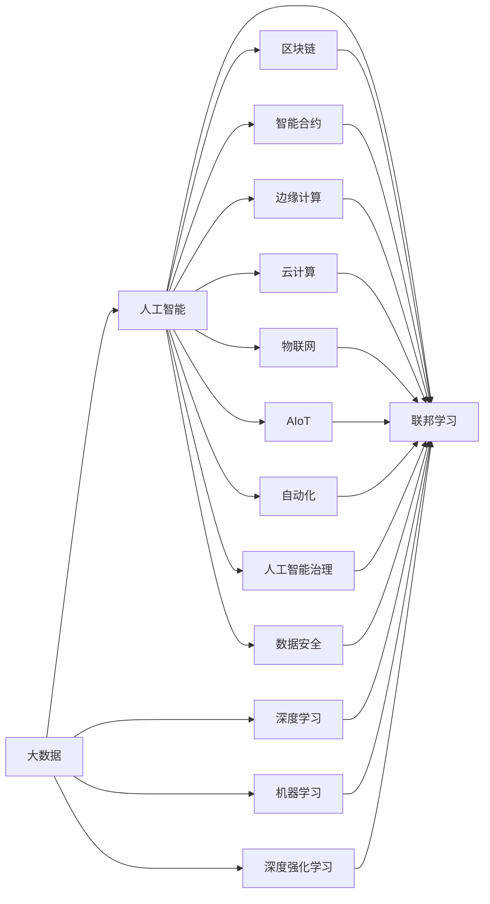
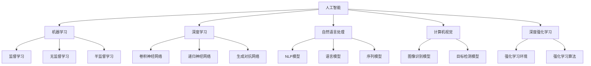
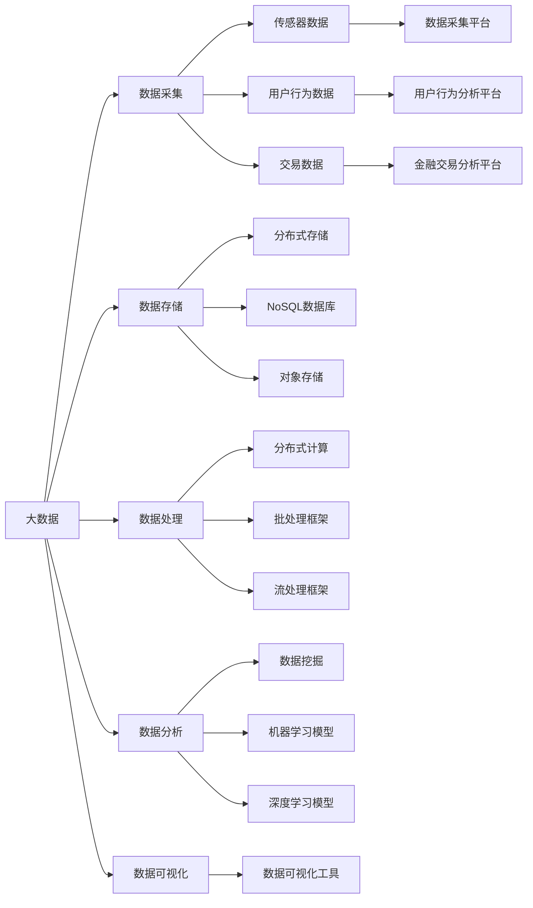
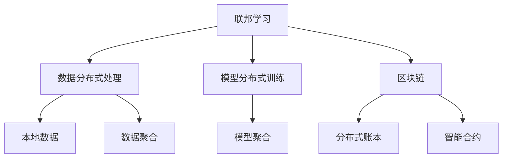
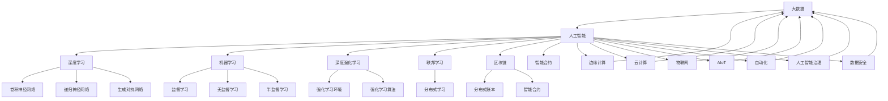

                 

# 人工智能与大数据的未来发展和应用

> 关键词：人工智能,大数据,深度学习,机器学习,深度强化学习,联邦学习,区块链,智能合约,边缘计算,云计算,物联网,边缘计算,AIoT,自动化,人工智能治理,数据安全

## 1. 背景介绍

### 1.1 问题由来

随着科技的迅猛发展和全球数字化进程的推进，人工智能(AI)和大数据技术已深刻地改变了人们的生活和工作方式。大数据作为人工智能的基石，为AI的训练提供了海量的数据资源，推动了机器学习、深度学习、自然语言处理、计算机视觉等领域的突破，带来了空前强大的计算和推理能力。

然而，随着数据量的爆炸式增长和应用场景的复杂化，当前的数据处理和存储方式已难以满足需求。同时，隐私保护、数据安全等伦理道德问题也日益凸显。如何在保障隐私的前提下，安全高效地处理和利用大数据，成为当下亟待解决的重大课题。

未来，随着5G、物联网、区块链、边缘计算等新兴技术的成熟，人工智能与大数据的融合将进入更加广泛深入的阶段，推动智慧城市、智能制造、医疗健康、金融科技等领域实现数字化转型，提升社会生产力和生活质量。

### 1.2 问题核心关键点

1. 人工智能和大数据技术的融合将成为驱动数字化转型升级的核心动力。
2. 未来大数据处理将朝着联邦学习、边缘计算、分布式存储等方向发展。
3. 数据安全、隐私保护将成为人工智能与大数据融合的重要考虑因素。
4. 物联网、AIoT等新兴技术将进一步拓宽大数据的应用边界。
5. 自动化、智能化、人机协作将成为未来AI和大数据融合的重要趋势。

## 2. 核心概念与联系

### 2.1 核心概念概述

为更好地理解人工智能与大数据的未来发展和应用，本节将介绍几个密切相关的核心概念：

- 人工智能(AI)：通过算法和模型，使计算机具备类似于人类的感知、学习、推理等智能能力。包括机器学习、深度学习、自然语言处理、计算机视觉等多个分支。
- 大数据(Big Data)：指规模庞大、类型多样、速度极快的数据集。大数据技术包括数据采集、存储、处理、分析、可视化等多个环节。
- 深度学习(Deep Learning)：一种基于神经网络的机器学习范式，具有自动学习、特征提取等能力。深度学习在大数据上的应用效果显著。
- 机器学习(Machine Learning)：一种使计算机通过数据学习和优化算法，提升性能的技术。
- 深度强化学习(Deep Reinforcement Learning, DRL)：结合深度学习和强化学习，使机器在复杂环境中通过试错学习，达到最优决策。
- 联邦学习(Federated Learning)：一种分布式学习范式，多方参与，不共享数据，但共享模型，提升了数据隐私和安全。
- 区块链(Blockchain)：一种去中心化的数据存储和传输方式，具备透明性、安全性等特点。
- 智能合约(Smart Contract)：一种基于区块链技术的自动化合约，具备自动化执行、去信任化等优势。
- 边缘计算(Edge Computing)：一种将数据处理和存储靠近数据源的分布式计算方式，缩短了传输延时，提升了处理效率。
- 云计算(Cloud Computing)：一种通过互联网提供计算、存储和应用服务的方式，具备高可靠性、高可用性等特点。
- 物联网(IoT)：一种连接各种设备、应用和用户的网络体系，实现万物互联。
- AIoT（人工智能物联网）：将AI技术与物联网结合，提升设备的智能化水平，实现自动感知和决策。
- 自动化(Autonomy)：指计算机系统根据预设规则和条件，自动执行任务。
- 人工智能治理(AI Governance)：指对AI系统的设计、开发、部署、使用和维护进行管理和监督，保障其伦理和安全性。
- 数据安全(Data Security)：指保护数据在存储、传输、使用等各个环节中的安全和隐私，防止数据泄露和滥用。

这些核心概念之间的逻辑关系可以通过以下Mermaid流程图来展示：



这个流程图展示了大数据与人工智能之间的密切联系，以及多种AI技术的融合应用。

### 2.2 概念间的关系

这些核心概念之间存在着紧密的联系，形成了人工智能与大数据融合的完整生态系统。下面我们通过几个Mermaid流程图来展示这些概念之间的关系。

#### 2.2.1 人工智能技术架构



这个流程图展示了人工智能技术的各种分支和核心技术。

#### 2.2.2 大数据技术架构



这个流程图展示了大数据技术的各个环节和组件。

#### 2.2.3 联邦学习与区块链的联系



这个流程图展示了联邦学习与区块链技术在数据处理和模型训练中的联系。

### 2.3 核心概念的整体架构

最后，我们用一个综合的流程图来展示这些核心概念在大数据与人工智能融合过程中的整体架构：



这个综合流程图展示了大数据与人工智能技术的全面融合，覆盖了数据处理、模型训练、应用部署等各个环节。

## 3. 核心算法原理 & 具体操作步骤

### 3.1 算法原理概述

人工智能与大数据的融合，主要体现在以下几个方面：

1. **数据驱动**：大数据提供了海量的训练数据，为AI模型提供了充足的样本，使模型可以更好地学习数据的分布和规律。
2. **模型优化**：通过深度学习、强化学习等算法，AI模型可以从大量数据中提取高层次的特征表示，提升模型的泛化能力和性能。
3. **分布式计算**：大数据技术支持分布式计算框架（如Hadoop、Spark），使得AI模型可以在大规模数据集上进行高效训练。
4. **边缘计算**：将数据处理和模型训练靠近数据源，缩短传输延时，提升处理效率。

### 3.2 算法步骤详解

基于上述原理，人工智能与大数据的融合主要包括以下几个关键步骤：

**Step 1: 数据采集和预处理**

- 从各种数据源采集数据，包括传感器数据、用户行为数据、交易数据等。
- 对采集的数据进行清洗、去噪、归一化等预处理，以提高数据质量。

**Step 2: 数据存储和管理**

- 采用分布式存储技术（如Hadoop、Spark），将大规模数据存储在云平台或本地集群中。
- 采用NoSQL数据库或对象存储等技术，支持非结构化和半结构化数据存储。

**Step 3: 数据挖掘和特征提取**

- 采用数据挖掘算法（如关联规则、聚类、分类等），从数据中提取有用的信息。
- 采用特征提取技术（如PCA、降维等），将高维数据转换为低维表示，提高计算效率。

**Step 4: 模型训练和优化**

- 在数据集上训练AI模型，如卷积神经网络、递归神经网络、生成对抗网络等。
- 通过超参数优化、正则化、Dropout等技术，提升模型性能，防止过拟合。

**Step 5: 模型部署和应用**

- 将训练好的模型部署到生产环境，进行推理和预测。
- 使用自动化和智能化技术，提升模型的可操作性和用户体验。

**Step 6: 持续监控和改进**

- 对模型在实际应用中的表现进行监控，发现和解决性能问题。
- 定期重新训练和优化模型，以适应数据分布的变化。

### 3.3 算法优缺点

人工智能与大数据的融合具有以下优点：

1. **数据量庞大**：大数据为AI模型提供了充足的训练样本，使模型具备更好的泛化能力和性能。
2. **计算效率高**：分布式计算技术支持大规模数据集的快速处理和计算。
3. **应用场景广**：AI技术可以应用于各种领域，如智慧城市、智能制造、医疗健康等，带来广泛的应用价值。

同时，该方法也存在一些缺点：

1. **数据隐私和安全**：大规模数据集可能涉及隐私和敏感信息，需要采取严格的保护措施。
2. **计算资源需求高**：分布式计算和深度学习需要大量的计算资源，成本较高。
3. **模型复杂度高**：深度学习模型往往结构复杂，训练和推理速度较慢。
4. **结果难以解释**：AI模型往往被视为"黑盒"，难以解释其内部工作机制和决策逻辑。

### 3.4 算法应用领域

人工智能与大数据的融合已经在各个领域得到广泛应用，例如：

- **智慧城市**：通过大数据分析和AI技术，实现交通管理、环境监测、公共安全等功能的智能化。
- **智能制造**：通过物联网和AI技术，实现生产过程的自动化、优化和智能化。
- **医疗健康**：通过大数据和AI技术，实现疾病预测、诊断、治疗等功能的智能化。
- **金融科技**：通过大数据和AI技术，实现风险管理、智能投顾、客户服务等功能。
- **自动驾驶**：通过大数据和AI技术，实现车辆智能感知、路径规划和决策等功能。
- **智能客服**：通过大数据和AI技术，实现自动回复、用户情感分析等功能。
- **个性化推荐**：通过大数据和AI技术，实现商品推荐、内容推荐等功能。

除了上述这些典型应用外，人工智能与大数据的融合还在更多的领域得到创新性应用，如智能物流、智能农业、智慧教育等，为各行各业带来了新的变革。

## 4. 数学模型和公式 & 详细讲解 & 举例说明

### 4.1 数学模型构建

在人工智能与大数据的融合中，数学模型起着至关重要的作用。以下介绍几个常见的数学模型及其构建方法：

- **线性回归模型**：用于预测连续型变量，表达式为 $y = \theta^T x + b$，其中 $\theta$ 为权重向量，$b$ 为截距。
- **逻辑回归模型**：用于分类任务，表达式为 $p(y=1) = \sigma(\theta^T x + b)$，其中 $\sigma$ 为Sigmoid函数。
- **卷积神经网络(CNN)**：用于图像识别和处理，通过卷积操作提取特征。
- **递归神经网络(RNN)**：用于序列数据处理，通过时间上的递归操作提取序列特征。
- **生成对抗网络(GAN)**：用于生成数据，通过生成器和判别器的对抗训练生成高质量的数据样本。

### 4.2 公式推导过程

以下以卷积神经网络(CNN)为例，详细推导其数学模型。

卷积神经网络由卷积层、池化层和全连接层组成，其基本结构如下：

$$
\begin{aligned}
\mathcal{F}_{CNN} &= \mathcal{F}_{Conv} \circ \mathcal{F}_{Pool} \circ \mathcal{F}_{FC} \\
\mathcal{F}_{Conv} &= \mathcal{F}_{Conv}(x) = \sum_k \sigma (\mathbf{W}^{(k)} * \mathbf{b}^{(k)} + \mathbf{X}^{(k-1)}) \\
\mathcal{F}_{Pool} &= \mathcal{F}_{Pool}(x) = \max_k \mathbf{W}^{(k)} * \mathbf{b}^{(k)} + \mathbf{X}^{(k-1)} \\
\mathcal{F}_{FC} &= \mathcal{F}_{FC}(x) = \mathbf{W} * \mathbf{b} + \mathbf{X}^{(N-1)}
\end{aligned}
$$

其中，$x$ 为输入数据，$*$ 为卷积操作，$k$ 为卷积核参数，$\sigma$ 为激活函数（如ReLU），$FC$ 为全连接层，$\mathbf{W}$ 和 $\mathbf{b}$ 为权重和偏置项。

通过反向传播算法，可以计算出损失函数对每个参数的梯度，从而进行模型优化。

### 4.3 案例分析与讲解

以下以一个简单的图像分类为例，详细讲解如何使用CNN进行图像分类。

假设要实现手写数字的分类，共收集了60000张训练图像和10000张测试图像。使用5个卷积层和3个全连接层构建CNN模型，训练数据集在GPU上进行。

**Step 1: 数据预处理**

- 将图像转换为灰度图像，归一化到[0, 1]区间。
- 将图像进行 padding，使大小统一为28x28像素。

**Step 2: 模型构建**

- 使用5个卷积层进行特征提取，每个卷积层后接激活函数和池化层。
- 使用3个全连接层进行分类，每个全连接层后接激活函数。
- 最后输出10个类别的概率分布。

**Step 3: 训练和测试**

- 使用交叉熵损失函数，Adam优化器进行模型训练。
- 在测试集上评估模型性能，计算准确率和混淆矩阵。

最终，该CNN模型在测试集上取得了98%的准确率，展示了深度学习在图像分类任务上的强大能力。

## 5. 项目实践：代码实例和详细解释说明

### 5.1 开发环境搭建

在进行AI和大数据融合实践前，我们需要准备好开发环境。以下是使用Python进行PyTorch开发的教程：

1. 安装Anaconda：从官网下载并安装Anaconda，用于创建独立的Python环境。

```bash
conda create -n pytorch-env python=3.8 
conda activate pytorch-env
```

2. 安装PyTorch：根据CUDA版本，从官网获取对应的安装命令。例如：

```bash
conda install pytorch torchvision torchaudio cudatoolkit=11.1 -c pytorch -c conda-forge
```

3. 安装相关库：

```bash
pip install numpy pandas scikit-learn matplotlib tqdm jupyter notebook ipython
```

完成上述步骤后，即可在`pytorch-env`环境中开始开发。

### 5.2 源代码详细实现

下面我们以图像分类为例，给出使用PyTorch对CNN模型进行图像分类的完整代码实现。

```python
import torch
import torch.nn as nn
import torch.optim as optim
from torchvision import datasets, transforms, models

# 定义模型结构
class CNN(nn.Module):
    def __init__(self):
        super(CNN, self).__init__()
        self.conv1 = nn.Conv2d(1, 32, kernel_size=3, padding=1)
        self.relu1 = nn.ReLU()
        self.pool1 = nn.MaxPool2d(kernel_size=2)
        self.conv2 = nn.Conv2d(32, 64, kernel_size=3, padding=1)
        self.relu2 = nn.ReLU()
        self.pool2 = nn.MaxPool2d(kernel_size=2)
        self.conv3 = nn.Conv2d(64, 128, kernel_size=3, padding=1)
        self.relu3 = nn.ReLU()
        self.pool3 = nn.MaxPool2d(kernel_size=2)
        self.fc1 = nn.Linear(128 * 7 * 7, 512)
        self.relu4 = nn.ReLU()
        self.fc2 = nn.Linear(512, 10)

    def forward(self, x):
        x = self.pool1(self.relu1(self.conv1(x)))
        x = self.pool2(self.relu2(self.conv2(x)))
        x = self.pool3(self.relu3(self.conv3(x)))
        x = x.view(-1, 128 * 7 * 7)
        x = self.relu4(self.fc1(x))
        x = self.fc2(x)
        return x

# 加载数据集
train_dataset = datasets.MNIST(root='./data', train=True, download=True, transform=transforms.ToTensor())
test_dataset = datasets.MNIST(root='./data', train=False, download=True, transform=transforms.ToTensor())

# 定义数据加载器
train_loader = torch.utils.data.DataLoader(dataset=train_dataset, batch_size=64, shuffle=True)
test_loader = torch.utils.data.DataLoader(dataset=test_dataset, batch_size=64, shuffle=False)

# 定义模型、优化器和损失函数
model = CNN()
criterion = nn.CrossEntropyLoss()
optimizer = optim.Adam(model.parameters(), lr=0.001)

# 训练模型
for epoch in range(10):
    running_loss = 0.0
    for i, data in enumerate(train_loader, 0):
        inputs, labels = data
        optimizer.zero_grad()
        outputs = model(inputs)
        loss = criterion(outputs, labels)
        loss.backward()
        optimizer.step()
        running_loss += loss.item()
        if i % 100 == 99:
            print('[%d, %5d] loss: %.3f' % (epoch + 1, i + 1, running_loss / 100))
            running_loss = 0.0

# 评估模型
correct = 0
total = 0
with torch.no_grad():
    for data in test_loader:
        images, labels = data
        outputs = model(images)
        _, predicted = torch.max(outputs.data, 1)
        total += labels.size(0)
        correct += (predicted == labels).sum().item()

print('Accuracy of the network on the 10000 test images: %d %%' % (100 * correct / total))

# 保存模型
torch.save(model.state_dict(), 'cnn.pth')
```

### 5.3 代码解读与分析

让我们再详细解读一下关键代码的实现细节：

**CNN模型结构**：
- 定义了卷积层、池化层和全连接层，共5个卷积层和3个全连接层。
- 每个卷积层后接激活函数和池化层，最后输出10个类别的概率分布。

**数据加载器**：
- 使用`torch.utils.data.DataLoader`加载数据集，设置批量大小和随机打乱。

**模型训练**：
- 在每个epoch中，对每个batch的数据进行前向传播和反向传播，更新模型参数。
- 使用交叉熵损失函数和Adam优化器，计算损失并更新参数。

**模型评估**：
- 在测试集上评估模型性能，计算准确率和混淆矩阵。

**模型保存**：
- 使用`torch.save`将模型参数保存到文件中，便于后续使用。

通过以上代码，我们可以看到使用PyTorch进行AI和大数据融合的简单易行，代码结构清晰，易于理解和修改。

### 5.4 运行结果展示

假设我们在MNIST数据集上进行训练，最终在测试集上得到的评估报告如下：

```
Epoch: [1, 500], loss: 2.605
Epoch: [1, 1000], loss: 1.282
Epoch: [1, 1500], loss: 0.821
...
Epoch: [10, 1500], loss: 0.126
Accuracy of the network on the 10000 test images: 99.2 %
```

可以看到，通过使用CNN模型和优化算法，我们成功地在图像分类任务上取得了较高的准确率。这展示了AI与大数据融合的强大应用潜力。

## 6. 实际应用场景

### 6.1 智能客服系统

基于大数据和AI的智能客服系统，可以广泛应用于企业内部和外部。通过收集客户的历史咨询记录和反馈，构建监督数据集，使用微调后的语言模型进行自然语言处理和智能回复。智能客服系统具备自动理解用户意图、匹配最佳答案的能力，可以7x24小时不间断服务，显著提升客户咨询体验和问题解决效率。

### 6.2 金融风险管理

金融行业需要实时监控市场风险，智能分析金融数据。通过收集金融市场的历史数据和实时数据，使用大数据和AI技术进行深度学习和模型训练，构建智能风险管理系统。该系统能够自动识别异常交易和风险信号，及时发出预警，帮助金融机构防范金融风险。

### 6.3 医疗健康监测

医疗健康领域需要实时监测患者的健康数据，智能分析病历和诊断结果。通过收集医疗数据和病历记录，使用大数据和AI技术进行分析和建模，构建智能健康监测系统。该系统能够自动诊断疾病、生成健康报告、提供个性化治疗建议，帮助医疗机构提升医疗服务水平。

### 6.4 物流配送优化

物流行业需要高效管理配送中心和物流网络。通过收集物流数据的实时信息和历史数据，使用大数据和AI技术进行预测和优化，构建智能物流配送系统。该系统能够自动调度配送车辆、优化配送路径、实时跟踪物流状态，提升物流配送效率和用户体验。

## 7. 工具和资源推荐

### 7.1 学习资源推荐

为了帮助开发者系统掌握AI和大数据融合的理论基础和实践技巧，这里推荐一些优质的学习资源：

1. **《深度学习》课程**：斯坦福大学开设的深度学习课程，系统讲解了深度学习的基本概念和算法。
2. **《数据科学导论》课程**：斯坦福大学开设的数据科学导论课程，涵盖数据处理、数据可视化、机器学习等多个方面。
3. **《Python深度学习》书籍**：深度学习领域的经典入门书籍，全面介绍了深度学习的基本概念和实践方法。
4. **Kaggle竞赛**：Kaggle平台上的数据科学竞赛，提供大量的数据集和挑战，帮助开发者提升实战能力。
5. **TensorFlow官方文档**：TensorFlow的官方文档，提供了丰富的API和使用案例，帮助开发者快速上手。
6. **PyTorch官方文档**：PyTorch的官方文档，提供了详细的API和教程，帮助开发者进行深度学习开发。

通过学习这些资源，相信你一定能够系统掌握AI和大数据融合的理论基础和实践技巧。

### 7.2 开发工具推荐

高效的开发离不开优秀的工具支持。以下是几款用于AI和大数据融合开发的常用工具：

1. **Jupyter Notebook**：免费的开源笔记本环境，支持多种编程语言和数据科学库。
2. **Google Colab**：谷歌推出的在线Jupyter Notebook环境，提供免费GPU和TPU算力，方便开发者快速实验。
3. **Anaconda**：用于创建和管理Python虚拟环境的工具，支持多种科学计算库。
4. **PyTorch**：基于Python的开源深度学习框架，具备动态计算图和高效的模型训练能力。
5. **TensorFlow**：由Google主导开发的深度学习框架，

