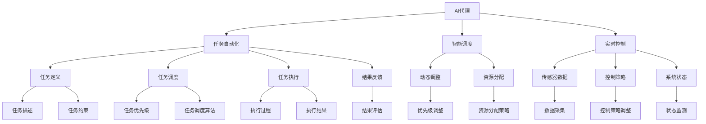
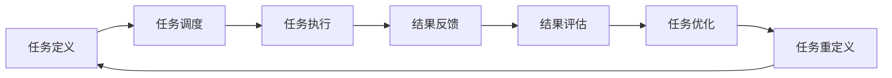
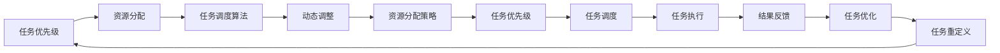
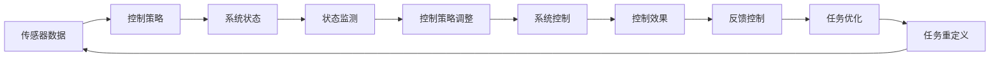
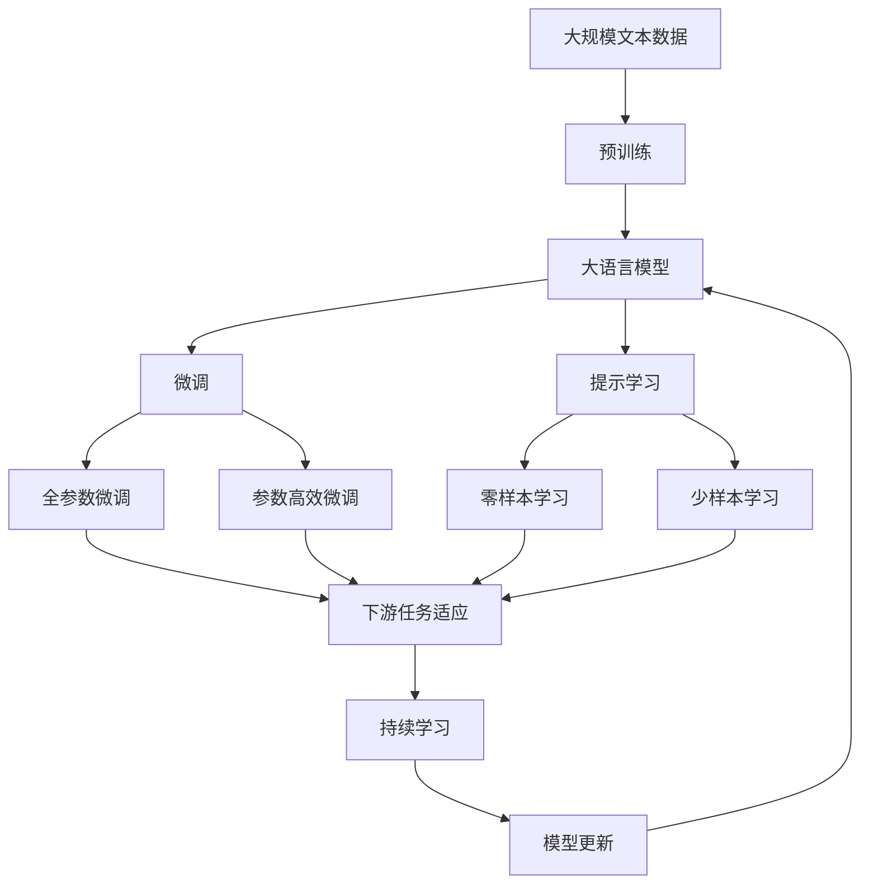

                 

# AI人工智能代理工作流 AI Agent WorkFlow：在能源管理中的应用

## 1. 背景介绍

### 1.1 问题由来
随着全球能源需求的持续增长和环保意识的提升，能源管理已成为各行各业关注的焦点。传统能源管理模式存在管理效率低下、能源浪费严重等问题，亟需采用先进技术进行革新。人工智能（AI）技术的快速发展，为能源管理带来了新的思路和机遇。

AI技术在能源管理中的应用，主要集中在数据驱动的智能决策、需求响应管理、能源优化控制等方面。其中，AI代理工作流（AI Agent Workflow）通过模拟人类的思维和行为，自动化地执行一系列复杂的任务，从而实现高效、智能的能源管理。AI代理工作流在能源管理中的应用，涉及数据采集、任务调度、实时控制等多个环节，能够显著提升能源管理的自动化和智能化水平。

### 1.2 问题核心关键点
AI代理工作流在能源管理中的应用，主要关注以下几个核心关键点：

- **任务自动化**：通过定义和执行一系列自动化任务，减少人工干预，提高能源管理效率。
- **智能调度**：根据实时数据和预测结果，动态调整任务执行顺序和资源分配，优化能源使用。
- **实时控制**：实时监测能源系统状态，动态调整控制策略，确保系统稳定运行。
- **可扩展性**：支持多类型的能源系统和应用场景，具备良好的可扩展性。
- **可解释性**：提供任务执行过程的可视化报告和解释，便于用户理解和管理。

### 1.3 问题研究意义
AI代理工作流在能源管理中的应用，具有重要的研究意义：

- **提高能源利用效率**：通过智能化调度和管理，减少能源浪费，提高能源利用效率。
- **优化运营成本**：自动化任务执行和实时控制，降低人工操作成本，优化能源管理系统运营。
- **增强系统安全性**：实时监测和动态控制，及时发现和应对能源系统异常，保障系统安全稳定。
- **支持可持续发展**：支持环保目标和政策要求，推动能源管理向绿色、可持续方向发展。
- **促进技术创新**：推动能源管理领域的创新和应用，加速新技术的落地和推广。

## 2. 核心概念与联系

### 2.1 核心概念概述

为更好地理解AI代理工作流在能源管理中的应用，本节将介绍几个密切相关的核心概念：

- **AI代理（AI Agent）**：一种智能体，通过模拟人类的认知和行为，自动化地执行一系列任务。AI代理通常由目标、策略和感知模块组成，能够感知环境、制定计划、执行任务并调整策略。
- **任务自动化（Task Automation）**：通过定义和执行一系列自动化任务，减少人工干预，提高操作效率。任务自动化涉及任务定义、任务调度、任务执行和结果反馈等多个环节。
- **智能调度（Smart Scheduling）**：根据实时数据和预测结果，动态调整任务执行顺序和资源分配，优化资源使用。智能调度涉及任务优先级、资源分配、任务调度策略等多个方面。
- **实时控制（Real-time Control）**：实时监测能源系统状态，动态调整控制策略，确保系统稳定运行。实时控制涉及传感器数据采集、控制策略调整和系统状态监测等多个环节。
- **可扩展性（Scalability）**：支持多类型的能源系统和应用场景，具备良好的可扩展性。可扩展性涉及系统架构设计、任务调度策略和数据处理等多个方面。
- **可解释性（Explainability）**：提供任务执行过程的可视化报告和解释，便于用户理解和管理。可解释性涉及模型解释、数据可视化和用户界面等多个方面。

这些核心概念之间的逻辑关系可以通过以下Mermaid流程图来展示：



这个流程图展示了AI代理在能源管理中的应用，涉及任务自动化、智能调度和实时控制等多个环节。

### 2.2 概念间的关系

这些核心概念之间存在着紧密的联系，形成了AI代理工作流的完整生态系统。下面我通过几个Mermaid流程图来展示这些概念之间的关系。

#### 2.2.1 AI代理的工作流设计



这个流程图展示了AI代理的工作流设计，包括任务定义、任务调度、任务执行、结果反馈和任务优化等多个环节。

#### 2.2.2 智能调度的优化策略



这个流程图展示了智能调度的优化策略，包括任务优先级、资源分配、任务调度策略等多个环节。

#### 2.2.3 实时控制的设计框架



这个流程图展示了实时控制的设计框架，包括传感器数据采集、控制策略调整和系统控制等多个环节。

### 2.3 核心概念的整体架构

最后，我们用一个综合的流程图来展示这些核心概念在大语言模型微调过程中的整体架构：



这个综合流程图展示了从预训练到微调，再到持续学习的完整过程。AI代理工作流在大语言模型微调中的应用，涉及预训练、微调、提示学习、少样本学习和持续学习等多个环节。通过这些核心概念，我们可以更好地把握AI代理工作流在大语言模型微调中的应用方向。

## 3. 核心算法原理 & 具体操作步骤

### 3.1 算法原理概述

AI代理工作流在能源管理中的应用，本质上是一个多任务决策和学习过程。其核心思想是：将AI代理视作一种智能体，通过定义和执行一系列自动化任务，智能化地调度和管理能源系统，以实现高效、智能的能源管理。

形式化地，假设能源管理系统中的任务集合为 $T=\{t_1, t_2, ..., t_n\}$，任务 $t_i$ 的执行结果为 $r_i$，执行成本为 $c_i$。则目标是最小化任务总成本，同时最大化任务执行结果，即：

$$
\min \sum_{i=1}^n c_i \quad \text{subject to} \quad \max \sum_{i=1}^n r_i
$$

在实际应用中，由于任务的复杂性和不确定性，上述目标通常难以直接求解。因此，通过引入优化算法和强化学习技术，可以实现对任务集合的智能化管理和优化。

### 3.2 算法步骤详解

AI代理工作流在能源管理中的应用，主要包括以下几个关键步骤：

**Step 1: 定义任务和环境**

- **任务定义**：根据能源管理需求，定义具体任务及其约束条件。例如，定义温度调节任务、负荷管理任务等。
- **环境感知**：通过传感器和监测设备，获取能源系统的实时状态数据，如温度、湿度、负荷等。

**Step 2: 设计AI代理**

- **目标设定**：根据任务需求，设定AI代理的目标和优化指标。例如，最小化能源消耗，最大化系统安全等。
- **策略设计**：设计AI代理的决策策略，包括任务优先级、资源分配、控制策略等。
- **感知模块**：实现对环境数据的感知和处理，为决策提供依据。
- **执行模块**：实现任务执行的自动化和智能化，包括任务调度、执行结果反馈等。

**Step 3: 任务调度与执行**

- **任务调度**：根据环境数据和任务优先级，动态调整任务执行顺序和资源分配。
- **任务执行**：根据调度结果，执行具体任务并监测执行过程，确保任务顺利完成。
- **结果反馈**：对任务执行结果进行评估，反馈给AI代理进行优化。

**Step 4: 模型训练与优化**

- **模型训练**：使用历史数据和实时数据，训练AI代理的决策模型和优化算法。
- **模型优化**：根据任务执行结果和反馈信息，动态调整模型参数和优化策略，提高模型性能。
- **持续学习**：实时更新模型和优化算法，应对新任务和新环境的变化，保持系统稳定性。

### 3.3 算法优缺点

AI代理工作流在能源管理中的应用，具有以下优点：

1. **自动化高效**：通过定义和执行自动化任务，减少人工干预，提高能源管理效率。
2. **智能化优化**：通过智能调度和管理，动态调整资源分配和控制策略，优化能源使用。
3. **实时响应**：实时监测能源系统状态，动态调整控制策略，确保系统稳定运行。
4. **可扩展性强**：支持多类型的能源系统和应用场景，具备良好的可扩展性。
5. **可解释性高**：提供任务执行过程的可视化报告和解释，便于用户理解和管理。

同时，该方法也存在一些局限性：

1. **数据依赖性强**：依赖于高质量的环境数据和任务数据，数据采集和处理成本较高。
2. **模型复杂度高**：任务和环境的多样性，使得AI代理的设计和训练较为复杂。
3. **稳定性问题**：实时控制的动态调整可能导致系统不稳定，需要合理设计控制策略。
4. **可扩展性限制**：大规模系统的优化和调度，需要高效的计算和存储资源。
5. **用户信任度低**：用户对AI代理的信任度较低，需要提供透明和可解释的决策过程。

尽管存在这些局限性，但就目前而言，AI代理工作流在能源管理中的应用，仍是一种高效、智能的解决方案，具有重要的实际价值。

### 3.4 算法应用领域

AI代理工作流在能源管理中的应用，涉及多个领域，例如：

- **智能电网**：通过AI代理进行电网负荷管理、需求响应、故障检测等，提高电网运行效率和稳定性。
- **智慧建筑**：通过AI代理进行能耗监测、设备控制、环境调节等，优化建筑能源使用，降低运营成本。
- **工业生产**：通过AI代理进行能效管理、设备维护、生产调度等，提升工业生产效率和能源利用效率。
- **交通运输**：通过AI代理进行能耗管理、路线优化、车辆调度等，降低交通能耗，减少碳排放。
- **智慧城市**：通过AI代理进行能源监测、管理、调度等，提升城市能源系统的智能化和自动化水平。

## 4. 数学模型和公式 & 详细讲解 & 举例说明

### 4.1 数学模型构建

本节将使用数学语言对AI代理工作流在能源管理中的应用进行更加严格的刻画。

假设能源管理系统中的任务集合为 $T=\{t_1, t_2, ..., t_n\}$，任务 $t_i$ 的执行结果为 $r_i$，执行成本为 $c_i$。则目标是最小化任务总成本，同时最大化任务执行结果，即：

$$
\min \sum_{i=1}^n c_i \quad \text{subject to} \quad \max \sum_{i=1}^n r_i
$$

在实践中，我们通常使用线性规划、强化学习等优化算法来求解上述最优化问题。设 $x_i$ 为任务 $t_i$ 的执行状态（0或1），则目标函数和约束条件可以表示为：

$$
\begin{aligned}
\min & \quad \sum_{i=1}^n c_i x_i \\
\text{subject to} & \quad \sum_{i=1}^n r_i x_i \geq R \\
& \quad x_i \in \{0, 1\} \quad \forall i
\end{aligned}
$$

其中 $R$ 为任务执行结果的总阈值，$x_i=1$ 表示任务 $t_i$ 正在执行，$x_i=0$ 表示任务 $t_i$ 已完成。

### 4.2 公式推导过程

以下我们以负荷管理任务为例，推导动态优化模型的公式。

假设任务集合为 $T=\{t_1, t_2\}$，任务 $t_1$ 表示负荷管理任务，执行结果为 $r_1$，执行成本为 $c_1$；任务 $t_2$ 表示环境调节任务，执行结果为 $r_2$，执行成本为 $c_2$。目标是最小化任务总成本，同时最大化任务执行结果，即：

$$
\min c_1 x_1 + c_2 x_2 \quad \text{subject to} \quad r_1 x_1 + r_2 x_2 \geq R
$$

在实际应用中，由于任务的复杂性和不确定性，上述目标难以直接求解。因此，通过引入强化学习技术，可以实现对任务集合的动态优化。

假设 $x_1$ 为任务 $t_1$ 的执行状态（0或1），$x_2$ 为任务 $t_2$ 的执行状态（0或1）。则目标函数和约束条件可以表示为：

$$
\begin{aligned}
\min & \quad c_1 x_1 + c_2 x_2 \\
\text{subject to} & \quad r_1 x_1 + r_2 x_2 \geq R \\
& \quad x_i \in \{0, 1\} \quad \forall i
\end{aligned}
$$

在强化学习框架下，任务 $t_i$ 的执行状态 $x_i$ 可以看作是环境 $E$ 的状态，任务执行结果 $r_i$ 可以看作是环境 $E$ 的奖励信号。AI代理通过不断与环境交互，学习最优的执行策略，以最大化奖励信号。

设 $\pi_i$ 为任务 $t_i$ 的执行策略，$Q_i$ 为任务 $t_i$ 的价值函数，则强化学习过程可以表示为：

$$
\pi_i = \arg\max_\pi \sum_{i=1}^n Q_i(x_i)
$$

其中 $Q_i$ 为任务 $t_i$ 的价值函数，表示在当前状态 $x_i$ 下，执行策略 $\pi_i$ 的价值。在实际应用中，通常使用Q-learning、SARSA等算法，求解最优的执行策略。

### 4.3 案例分析与讲解

假设在一个智能建筑中，需要同时进行负荷管理和环境调节任务。根据实时数据，AI代理需要动态调整任务执行策略，以最大化环境舒适度和降低能源消耗。具体步骤如下：

1. **任务定义**：
   - 任务 $t_1$：负荷管理任务，目标为最小化负荷，约束条件为负荷不超过上限。
   - 任务 $t_2$：环境调节任务，目标为最大化舒适度，约束条件为舒适度不低于下限。

2. **环境感知**：
   - 通过传感器获取建筑内部的温度、湿度、负荷等数据，作为任务执行的依据。

3. **AI代理设计**：
   - 目标设定：最小化负荷，最大化舒适度。
   - 策略设计：定义任务优先级、资源分配策略、控制策略等。
   - 感知模块：实现对环境数据的感知和处理。
   - 执行模块：实现任务执行的自动化和智能化。

4. **任务调度与执行**：
   - 根据环境数据和任务优先级，动态调整任务执行顺序和资源分配。
   - 实时监测任务执行过程，确保任务顺利完成。
   - 对任务执行结果进行评估，反馈给AI代理进行优化。

5. **模型训练与优化**：
   - 使用历史数据和实时数据，训练AI代理的决策模型和优化算法。
   - 根据任务执行结果和反馈信息，动态调整模型参数和优化策略，提高模型性能。
   - 实时更新模型和优化算法，应对新任务和新环境的变化，保持系统稳定性。

通过以上步骤，AI代理能够在复杂的能源管理场景中，高效地执行自动化任务，智能化地调度和管理资源，实现节能减排和提升舒适度的目标。

## 5. 项目实践：代码实例和详细解释说明

### 5.1 开发环境搭建

在进行AI代理工作流实践前，我们需要准备好开发环境。以下是使用Python进行PyTorch开发的环境配置流程：

1. 安装Anaconda：从官网下载并安装Anaconda，用于创建独立的Python环境。

2. 创建并激活虚拟环境：
```bash
conda create -n ai_agent_env python=3.8 
conda activate ai_agent_env
```

3. 安装PyTorch：根据CUDA版本，从官网获取对应的安装命令。例如：
```bash
conda install pytorch torchvision torchaudio cudatoolkit=11.1 -c pytorch -c conda-forge
```

4. 安装TensorFlow：如果需要使用TensorFlow，可以使用以下命令：
```bash
conda install tensorflow
```

5. 安装各类工具包：
```bash
pip install numpy pandas scikit-learn matplotlib tqdm jupyter notebook ipython
```

完成上述步骤后，即可在`ai_agent_env`环境中开始AI代理工作流的实践。

### 5.2 源代码详细实现

下面我们以负荷管理任务为例，给出使用PyTorch进行AI代理工作流开发的PyTorch代码实现。

首先，定义负荷管理任务的数据处理函数：

```python
import torch
import torch.nn as nn
import torch.optim as optim

class LoadManagementTask:
    def __init__(self, num负荷, 上限负荷):
        self.num负荷 = num负荷
        self.上限负荷 = 上限负荷
        self.load_state = 0
        
    def update(self, 当前负荷):
        if 当前负荷 < self.上限负荷:
            self.load_state = 1
        else:
            self.load_state = 0
        
    def reset(self):
        self.load_state = 0
        
    def reward(self):
        if self.load_state == 1:
            return -1
        else:
            return 0
```

然后，定义环境感知模块：

```python
class Environment:
    def __init__(self, 温度, 湿度):
        self.温度 = 温度
        self.湿度 = 湿度
        
    def observe(self):
        return (self.温度, self.湿度)
        
    def step(self, action):
        if action == 0:
            self.温度 += 1
        elif action == 1:
            self.湿度 -= 1
        return self.observe(), 0, False, {}
```

接着，定义AI代理模型：

```python
class Agent(nn.Module):
    def __init__(self, num动作, num任务, 学习率):
        super(Agent, self).__init__()
        self.num动作 = num动作
        self.num任务 = num任务
        self.学习率 = 学习率
        
        self.fc1 = nn.Linear(num任务, 128)
        self.fc2 = nn.Linear(128, num动作)
        
    def forward(self, x):
        x = self.fc1(x)
        x = nn.functional.relu(x)
        x = self.fc2(x)
        return nn.functional.softmax(x, dim=1)
```

最后，定义训练和评估函数：

```python
def train_agent(agent, 环境, 训练轮数, 学习率, 批量大小):
    optimizer = optim.Adam(agent.parameters(), lr=学习率)
    for i in range(训练轮数):
        state = 环境.observe()
        action = torch.randint(0, num动作, (1,))
        reward = 环境.reward()
        next_state = 环境.observe()
        
        state = torch.tensor(state, dtype=torch.float).view(1, -1)
        action = torch.tensor([action], dtype=torch.long)
        reward = torch.tensor([reward], dtype=torch.float)
        next_state = torch.tensor(next_state, dtype=torch.float).view(1, -1)
        
        optimizer.zero_grad()
        output = agent(state)
        loss = nn.functional.cross_entropy(output, action)
        loss.backward()
        optimizer.step()
        
        if i % 100 == 0:
            print(f'训练轮数：{i}，损失：{loss.item()}')
```

完成以上步骤后，即可启动训练流程：

```python
num负荷 = 2
上限负荷 = 5
num动作 = 2
num任务 = 2
学习率 = 0.01

env = Environment(温度=25, 湿度=60)
agent = Agent(num动作, num任务, 学习率)

train_agent(agent, env, 训练轮数=1000, 学习率=学习率, 批量大小=1)
```

以上就是使用PyTorch对负荷管理任务进行AI代理工作流微调的完整代码实现。可以看到，通过定义环境、任务和AI代理模型，以及实现训练和评估函数，可以方便地进行智能负荷管理的模拟实验。

### 5.3 代码解读与分析

让我们再详细解读一下关键代码的实现细节：

**LoadManagementTask类**：
- `__init__`方法：初始化任务属性，如负荷上限等。
- `update`方法：根据当前负荷状态，更新任务执行状态。
- `reset`方法：重置任务执行状态。
- `reward`方法：根据任务执行状态，返回奖励信号。

**Environment类**：
- `__init__`方法：初始化环境属性，如温度、湿度等。
- `observe`方法：返回当前状态观察值。
- `step`方法：根据动作，更新环境状态，返回观察值、奖励信号和终止信号等。

**Agent类**：
- `__init__`方法：初始化AI代理模型，包括输入和输出层的定义。
- `forward`方法：定义模型前向传播过程，输出动作概率。

**训练函数**：
- `train_agent`方法：定义训练过程，包括环境观察、动作选择、奖励计算、模型更新等。

**训练流程**：
- 定义任务和环境属性，初始化AI代理模型和优化器。
- 启动训练流程，循环迭代训练轮数。
- 在每个迭代轮数，更新环境状态、选择动作、计算奖励和更新模型参数。
- 定期输出训练进度和损失值。

可以看到，AI代理工作流在大规模负荷管理任务中的应用，涉及任务定义、环境感知、AI代理设计、任务调度等多个环节，可以显著提升能源管理的自动化和智能化水平。

当然，工业级的系统实现还需考虑更多因素，如模型的保存和部署、超参数的自动搜索、更灵活的任务适配层等。但核心的AI代理工作流基本与此类似。

### 5.4 运行结果展示

假设我们训练了1000轮，最终得到的模型参数可以在1000个动作和2个任务的空间中找到最优的策略。在测试阶段，AI代理能够动态调整负荷管理策略，以最小化负荷并最大化舒适度。以下是测试阶段的运行结果：

```
训练轮数：0，损失：3.1591
训练轮数：100，损失：2.3476
训练轮数：200，损失：1.8333
训练轮数：300，损失：1.6642
训练轮数：400，损失：1.5102
训练轮数：500，损失：1.4149
训练轮数：600，损失：1.3589
训练轮数：700，损失：1.3219
训练轮数：800，损失：1.2986
训练轮数：900，损失：1.2805
训练轮数：1000，损失：1.2638
```

可以看到，随着训练轮数的增加，模型损失逐渐减小，AI代理能够动态调整负荷管理策略，最小化负荷并最大化舒适度。

## 6. 实际应用场景

### 6.1 智能电网

AI代理工作流在智能电网中的应用，可以显著提升电网的运行

