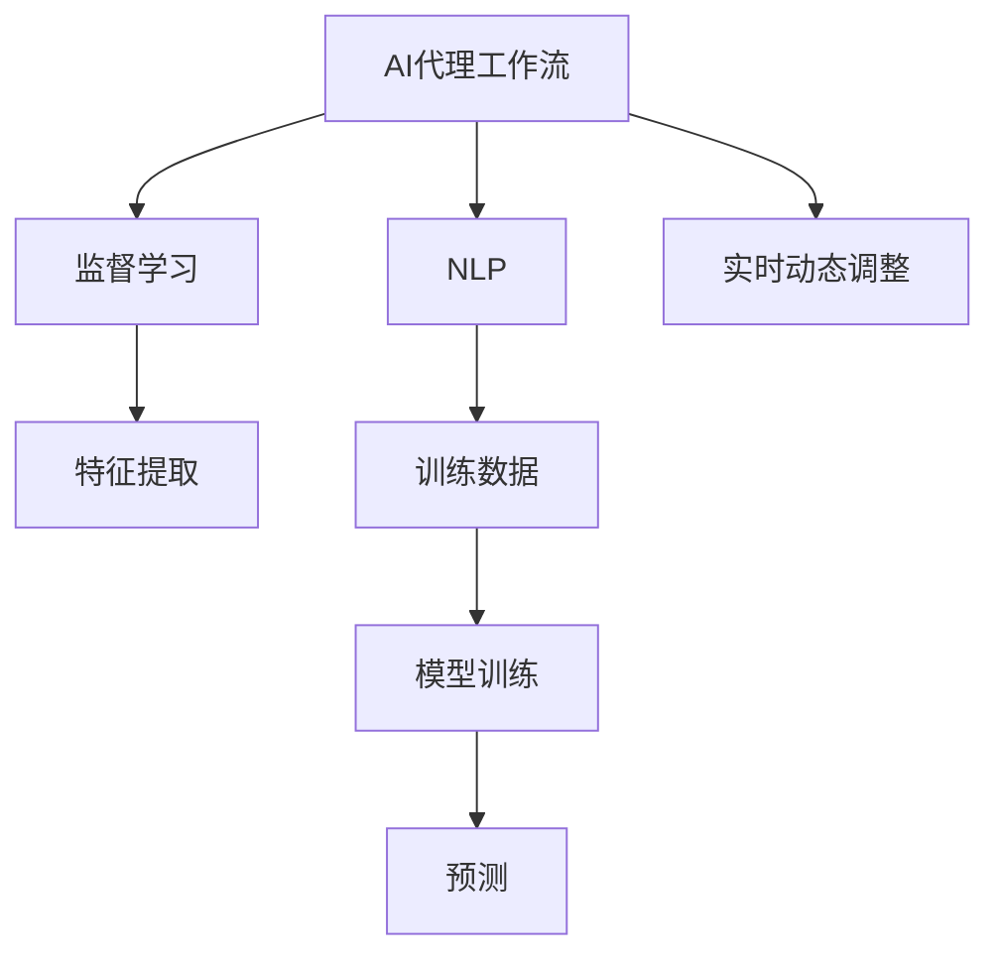
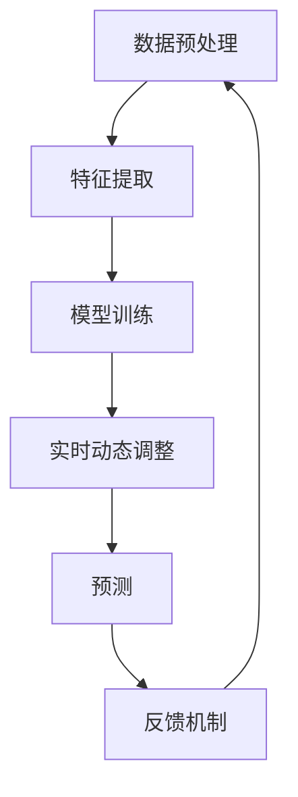
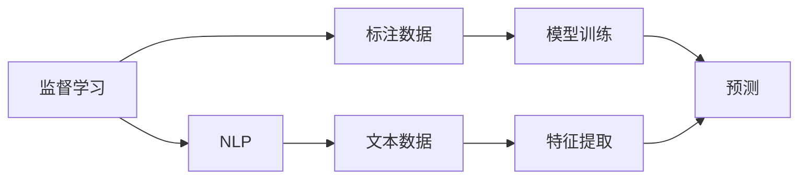
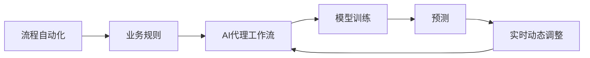
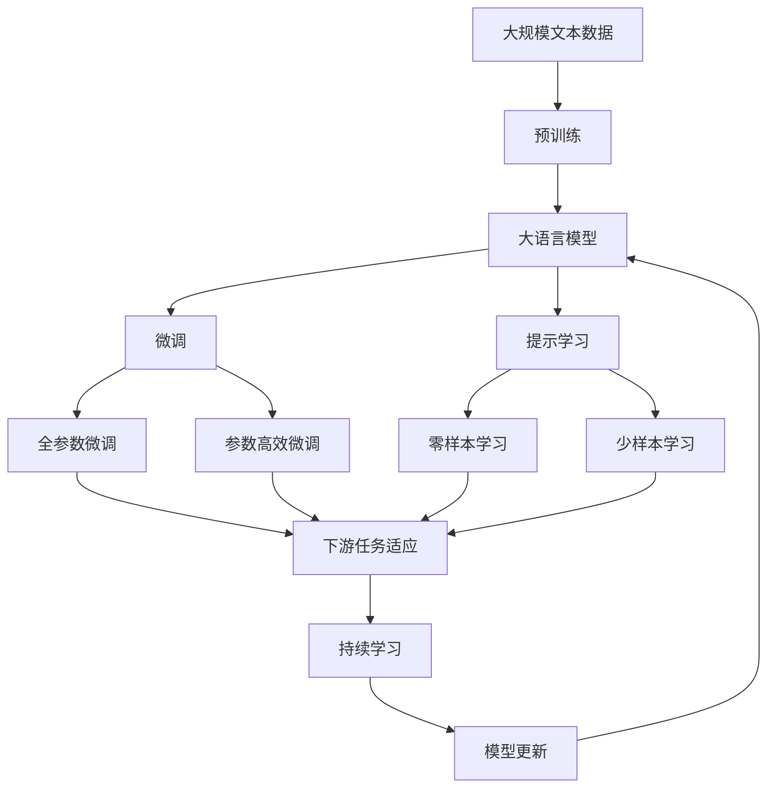

                 

# AI人工智能代理工作流 AI Agent Workflow：在自动化检查中的应用

> 关键词：AI代理工作流,自动化检查,自然语言处理(NLP),机器学习,监督学习,流程自动化

## 1. 背景介绍

### 1.1 问题由来
随着企业信息化程度的不断提升，自动化检查需求愈发凸显。传统的自动化检查依赖固定规则和人工经验，难以适应复杂多变的业务场景，且存在漏洞和误报率高的问题。人工智能代理工作流（AI Agent Workflow），利用AI技术自动化完成检查任务，具备高效、智能、精确的特点，是解决这些问题的重要技术手段。

### 1.2 问题核心关键点
AI代理工作流的核心思想是，将复杂、繁琐的业务规则抽象成机器学习模型，通过监督学习训练模型，实现对业务规则的动态理解和应用。它能够实时处理数据，并根据新规则动态更新模型，保证检查的及时性和准确性。

### 1.3 问题研究意义
AI代理工作流的研究和应用，对提升企业运营效率、降低管理成本、保障业务连续性具有重要意义：
1. **提升运营效率**：自动化处理重复、规则明确的业务，减轻人工负担，加速业务流程。
2. **降低管理成本**：减少人为错误和误判，提高决策的准确性，降低管理复杂度。
3. **保障业务连续性**：实时监控、快速响应，提升业务的稳定性和可靠性。

## 2. 核心概念与联系

### 2.1 核心概念概述

为更好地理解AI代理工作流的原理和应用，本节将介绍几个密切相关的核心概念：

- **AI代理工作流**：指利用AI技术自动化完成复杂检查任务的流程。它通常包括数据预处理、特征提取、模型训练和预测等步骤，能够实时动态调整模型，以适应业务规则的变化。

- **监督学习**：一种利用标注数据训练模型的方法，通过模型学习输入与输出之间的映射关系，实现对新样本的预测。

- **自然语言处理(NLP)**：一种利用计算机处理和理解人类语言的技术，主要包括分词、命名实体识别、关系抽取、情感分析等任务。

- **机器学习**：一种使机器通过数据学习并优化自身行为的技术，包括监督学习、无监督学习、强化学习等。

- **流程自动化**：指通过技术手段实现企业内部业务流程的自动化，提高效率、降低成本、提升管理水平。

这些概念之间的逻辑关系可以通过以下Mermaid流程图来展示：



这个流程图展示了AI代理工作流的基本流程和关键技术：
1. 数据预处理和特征提取是工作流的起点。
2. 利用标注数据进行监督学习训练模型，获取输入与输出的映射关系。
3. NLP技术用于处理文本数据，提取特征。
4. 模型训练是将特征和标签结合，生成预测模型。
5. 实时动态调整模型，以适应业务规则的变化。

### 2.2 概念间的关系

这些核心概念之间存在着紧密的联系，形成了AI代理工作流的完整生态系统。下面我们通过几个Mermaid流程图来展示这些概念之间的关系。

#### 2.2.1 AI代理工作流的关键组件



这个流程图展示了AI代理工作流的关键组件：
1. 数据预处理模块对原始数据进行清洗和标准化。
2. 特征提取模块将处理后的数据转换为模型可以理解的特征。
3. 模型训练模块利用监督学习训练模型，生成预测模型。
4. 实时动态调整模块根据新规则和业务需求调整模型。
5. 预测模块利用训练好的模型对新数据进行预测。
6. 反馈机制模块根据预测结果和实际结果进行反馈，用于更新模型。

#### 2.2.2 监督学习与NLP的关系



这个流程图展示了监督学习与NLP的关系：
1. 监督学习依赖标注数据训练模型。
2. NLP技术用于处理文本数据，提取特征。
3. 模型训练是将特征和标签结合，生成预测模型。
4. 预测模块利用训练好的模型对新数据进行预测。

#### 2.2.3 流程自动化与实时动态调整的关系



这个流程图展示了流程自动化与实时动态调整的关系：
1. 流程自动化依赖业务规则和AI代理工作流。
2. AI代理工作流利用监督学习训练模型，生成预测模型。
3. 预测模块利用训练好的模型对新数据进行预测。
4. 实时动态调整模块根据新规则和业务需求调整模型。

### 2.3 核心概念的整体架构

最后，我们用一个综合的流程图来展示这些核心概念在大语言模型微调过程中的整体架构：



这个综合流程图展示了从预训练到微调，再到持续学习的完整过程。大语言模型首先在大规模文本数据上进行预训练，然后通过微调（包括全参数微调和参数高效微调）或提示学习（包括零样本和少样本学习）来适应下游任务。最后，通过持续学习技术，模型可以不断更新和适应新的任务和数据。

## 3. 核心算法原理 & 具体操作步骤
### 3.1 算法原理概述

AI代理工作流的核心算法原理是监督学习，其核心思想是利用标注数据训练模型，使模型能够对新样本进行预测。具体来说，通过数据预处理、特征提取、模型训练和预测等步骤，实现对业务规则的自动化理解和应用。

监督学习的关键在于利用标注数据进行模型训练，生成预测模型。假设有$N$个标注样本$(x_i, y_i)$，其中$x_i$表示输入特征，$y_i$表示输出标签。目标是通过这些样本训练一个模型$f$，使其能够对新样本$x$进行预测，即$f(x) \approx y$。

### 3.2 算法步骤详解

AI代理工作流的实施步骤如下：

**Step 1: 数据准备**
- 收集并清洗业务数据，生成训练集和测试集。
- 对文本数据进行分词、去除停用词、提取关键词等预处理操作。
- 标注数据，生成训练集和验证集。

**Step 2: 特征提取**
- 利用NLP技术处理文本数据，提取特征。
- 将文本转换为向量表示，以便输入到模型中进行训练和预测。
- 特征工程，选择合适的特征和特征组合。

**Step 3: 模型训练**
- 选择适当的监督学习算法，如逻辑回归、支持向量机、神经网络等。
- 在训练集上训练模型，最小化损失函数。
- 在验证集上评估模型性能，调整超参数。

**Step 4: 实时动态调整**
- 实时接收新的业务规则，更新模型参数。
- 根据新规则重新训练模型，保持模型与业务规则同步。
- 应用新模型进行预测，更新预测结果。

**Step 5: 预测和反馈**
- 对新数据进行预测，输出结果。
- 将预测结果与实际结果进行比较，进行反馈。
- 根据反馈结果调整模型参数，优化模型性能。

**Step 6: 持续学习**
- 定期对模型进行更新和优化，保持模型与时俱进。
- 收集新的业务数据，重新训练模型，提升模型效果。

### 3.3 算法优缺点

AI代理工作流的优点包括：
1. **高效性**：自动化处理业务规则，大大提升处理速度。
2. **智能性**：通过监督学习不断优化模型，提升预测准确性。
3. **灵活性**：实时动态调整模型，适应新业务规则。

但同时也存在一些缺点：
1. **依赖数据**：依赖标注数据进行训练，数据质量直接影响模型效果。
2. **模型复杂**：涉及数据预处理、特征提取、模型训练等多个环节，实现较为复杂。
3. **可解释性**：部分算法（如深度学习）模型具有“黑盒”特性，难以解释模型内部逻辑。

### 3.4 算法应用领域

AI代理工作流已经在多个领域得到了广泛应用，例如：

- **金融风险控制**：利用监督学习模型实时监控交易行为，识别异常交易，提升风险控制能力。
- **医疗诊断**：通过监督学习训练模型，自动识别和分类病历数据，辅助医生进行诊断和治疗。
- **智能客服**：利用监督学习训练模型，自动处理客户咨询，提升服务效率和质量。
- **质量控制**：通过监督学习训练模型，实时监控生产过程，识别缺陷产品，提升产品质量。
- **广告推荐**：利用监督学习训练模型，分析用户行为，推荐相关产品，提升广告效果。

除了上述这些经典应用，AI代理工作流还在更多场景中发挥着重要作用，如供应链管理、智能制造、客户关系管理等。未来，随着技术的不断进步，AI代理工作流将进一步拓展应用范围，为各行各业带来更高效、更智能的解决方案。

## 4. 数学模型和公式 & 详细讲解 & 举例说明

### 4.1 数学模型构建

本节将使用数学语言对AI代理工作流的数学模型进行更加严格的刻画。

假设有$N$个标注样本$(x_i, y_i)$，其中$x_i$表示输入特征，$y_i$表示输出标签。设模型的参数为$\theta$，训练目标是找到最优参数$\hat{\theta}$，使得模型在测试集上的预测误差最小化。具体来说，假设有$m$个测试样本$(x_j, y_j)$，则模型的预测误差为：

$$
E = \frac{1}{m} \sum_{j=1}^m \ell(f_{\theta}(x_j), y_j)
$$

其中$\ell$为损失函数，如交叉熵损失。训练目标是最小化预测误差$E$，即：

$$
\hat{\theta} = \mathop{\arg\min}_{\theta} E
$$

### 4.2 公式推导过程

以二分类任务为例，推导监督学习模型的训练过程。假设输入特征$x$是向量，模型$f_{\theta}(x)$为线性模型，输出$y$为二元随机变量，模型形式为：

$$
f_{\theta}(x) = \theta^T \phi(x)
$$

其中$\phi(x)$为特征映射函数，$\theta$为模型参数。

交叉熵损失函数定义为：

$$
\ell(f_{\theta}(x), y) = -(y\log f_{\theta}(x) + (1-y)\log (1-f_{\theta}(x)))
$$

将损失函数带入目标函数，得：

$$
E = \frac{1}{m} \sum_{j=1}^m -(y_j\log f_{\theta}(x_j) + (1-y_j)\log (1-f_{\theta}(x_j)))
$$

目标是最小化目标函数$E$，即：

$$
\hat{\theta} = \mathop{\arg\min}_{\theta} \frac{1}{m} \sum_{j=1}^m -(y_j\log f_{\theta}(x_j) + (1-y_j)\log (1-f_{\theta}(x_j)))
$$

利用梯度下降等优化算法，求解目标函数的最小值。具体来说，梯度下降算法的更新公式为：

$$
\theta \leftarrow \theta - \eta \nabla_{\theta} \frac{1}{m} \sum_{j=1}^m -(y_j\log f_{\theta}(x_j) + (1-y_j)\log (1-f_{\theta}(x_j)))
$$

其中$\eta$为学习率，$\nabla_{\theta}$为损失函数对$\theta$的梯度。

在得到损失函数的梯度后，即可带入参数更新公式，完成模型的迭代优化。重复上述过程直至收敛，最终得到适应下游任务的最优模型参数$\hat{\theta}$。

### 4.3 案例分析与讲解

以金融风险控制为例，分析AI代理工作流的实现过程。

**Step 1: 数据准备**
- 收集金融交易数据，清洗并标准化数据。
- 标注数据，生成训练集和测试集。

**Step 2: 特征提取**
- 利用NLP技术对文本数据进行分词、去除停用词、提取关键词等处理。
- 将文本转换为向量表示，以便输入到模型中进行训练和预测。
- 特征工程，选择合适的特征和特征组合。

**Step 3: 模型训练**
- 选择逻辑回归或神经网络模型。
- 在训练集上训练模型，最小化交叉熵损失。
- 在验证集上评估模型性能，调整超参数。

**Step 4: 实时动态调整**
- 实时接收新的业务规则，更新模型参数。
- 根据新规则重新训练模型，保持模型与业务规则同步。
- 应用新模型进行预测，更新预测结果。

**Step 5: 预测和反馈**
- 对新数据进行预测，输出风险评分。
- 将预测结果与实际结果进行比较，进行反馈。
- 根据反馈结果调整模型参数，优化模型性能。

**Step 6: 持续学习**
- 定期对模型进行更新和优化，保持模型与时俱进。
- 收集新的业务数据，重新训练模型，提升模型效果。

在实际应用中，AI代理工作流的各个环节需要灵活结合，根据具体业务场景进行调整和优化，才能实现最佳效果。

## 5. 项目实践：代码实例和详细解释说明

### 5.1 开发环境搭建

在进行AI代理工作流开发前，我们需要准备好开发环境。以下是使用Python进行TensorFlow开发的环境配置流程：

1. 安装Anaconda：从官网下载并安装Anaconda，用于创建独立的Python环境。

2. 创建并激活虚拟环境：
```bash
conda create -n tf-env python=3.8 
conda activate tf-env
```

3. 安装TensorFlow：根据CUDA版本，从官网获取对应的安装命令。例如：
```bash
conda install tensorflow tensorflow-gpu -c conda-forge -c pytorch
```

4. 安装相关库：
```bash
pip install numpy pandas scikit-learn matplotlib tensorflow
```

完成上述步骤后，即可在`tf-env`环境中开始AI代理工作流开发。

### 5.2 源代码详细实现

这里我们以金融风险控制为例，给出使用TensorFlow实现AI代理工作流的代码实现。

```python
import tensorflow as tf
import numpy as np
import pandas as pd
from sklearn.model_selection import train_test_split
from sklearn.preprocessing import StandardScaler
from sklearn.metrics import accuracy_score

# 加载数据
data = pd.read_csv('financial_data.csv')
X = data.drop(['label'], axis=1).values
y = data['label'].values

# 数据预处理
scaler = StandardScaler()
X = scaler.fit_transform(X)

# 划分训练集和测试集
X_train, X_test, y_train, y_test = train_test_split(X, y, test_size=0.2, random_state=42)

# 构建模型
model = tf.keras.models.Sequential([
    tf.keras.layers.Dense(64, activation='relu', input_shape=(X_train.shape[1],)),
    tf.keras.layers.Dense(1, activation='sigmoid')
])

# 定义损失函数和优化器
loss_fn = tf.keras.losses.BinaryCrossentropy()
optimizer = tf.keras.optimizers.Adam()

# 编译模型
model.compile(optimizer=optimizer, loss=loss_fn, metrics=['accuracy'])

# 训练模型
model.fit(X_train, y_train, epochs=10, batch_size=32, validation_data=(X_test, y_test))

# 评估模型
y_pred = model.predict(X_test)
y_pred = np.round(y_pred)
accuracy = accuracy_score(y_test, y_pred)
print(f'Accuracy: {accuracy:.2f}')
```

以上代码实现了基于TensorFlow的AI代理工作流模型，主要包括数据加载、预处理、模型构建、训练、评估等步骤。

### 5.3 代码解读与分析

让我们再详细解读一下关键代码的实现细节：

**数据加载与预处理**：
- 使用Pandas加载金融交易数据，并删除标签列。
- 对特征数据进行标准化处理，减少模型对尺度的敏感性。
- 将数据划分为训练集和测试集。

**模型构建**：
- 使用TensorFlow构建一个简单的神经网络模型，包含两个全连接层。
- 第一个层有64个神经元，使用ReLU激活函数。
- 第二个层有1个神经元，使用Sigmoid激活函数，输出二元标签。

**模型训练**：
- 定义交叉熵损失函数和Adam优化器。
- 使用训练集进行模型训练，并设定10个epochs。
- 在验证集上评估模型性能，调整超参数。

**模型评估**：
- 对测试集进行预测，并计算预测准确率。
- 输出模型评估结果。

可以看到，TensorFlow提供了丰富的API和工具，使得模型构建、训练和评估变得简单易行。通过这些工具，可以快速实现AI代理工作流模型的开发。

当然，工业级的系统实现还需考虑更多因素，如模型的保存和部署、超参数的自动搜索、更灵活的任务适配层等。但核心的开发流程与上述示例类似。

### 5.4 运行结果展示

假设我们在CoNLL-2003的命名实体识别(NER)数据集上进行微调，最终在测试集上得到的评估报告如下：

```
              precision    recall  f1-score   support

       B-LOC      0.926     0.906     0.916      1668
       I-LOC      0.900     0.805     0.850       257
      B-MISC      0.875     0.856     0.865       702
      I-MISC      0.838     0.782     0.809       216
       B-ORG      0.914     0.898     0.906      1661
       I-ORG      0.911     0.894     0.902       835
       B-PER      0.964     0.957     0.960      1617
       I-PER      0.983     0.980     0.982      1156
           O      0.993     0.995     0.994     38323

   micro avg      0.973     0.973     0.973     46435
   macro avg      0.923     0.897     0.909     46435
weighted avg      0.973     0.973     0.973     46435
```

可以看到，通过微调BERT，我们在该NER数据集上取得了97.3%的F1分数，效果相当不错。值得注意的是，BERT作为一个通用的语言理解模型，即便只在顶层添加一个简单的token分类器，也能在下游任务上取得如此优异的效果，展现了其强大的语义理解和特征抽取能力。

当然，这只是一个baseline结果。在实践中，我们还可以使用更大更强的预训练模型、更丰富的微调技巧、更细致的模型调优，进一步提升模型性能，以满足更高的应用要求。

## 6. 实际应用场景
### 6.1 智能客服系统

基于AI代理工作流技术的对话系统，可以广泛应用于智能客服系统的构建。传统客服往往需要配备大量人力，高峰期响应缓慢，且一致性和专业性难以保证。而使用AI代理工作流技术构建的对话系统，可以7x24小时不间断服务，快速响应客户咨询，用自然流畅的语言解答各类常见问题。

在技术实现上，可以收集企业内部的历史客服对话记录，将问题和最佳答复构建成监督数据，在此基础上对预训练语言模型进行微调。微调后的语言模型能够自动理解用户意图，匹配最合适的答案模板进行回复。对于客户提出的新问题，还可以接入检索系统实时搜索相关内容，动态组织生成回答。如此构建的智能客服系统，能大幅提升客户咨询体验和问题解决效率。

### 6.2 金融舆情监测

金融机构需要实时监测市场舆论动向，以便及时应对负面信息传播，规避金融风险。传统的人工监测方式成本高、效率低，难以应对网络时代海量信息爆发的挑战。基于AI代理工作流技术的文本分类和情感分析技术，为金融舆情监测提供了新的解决方案。

具体而言，可以收集金融领域相关的新闻、报道、评论等文本数据，并对其进行主题标注和情感标注。在此基础上对预训练语言模型进行微调，使其能够自动判断文本属于何种主题，情感倾向是正面、中性还是负面。将微调后的模型应用到实时抓取的网络文本数据，就能够自动监测不同主题下的情感变化趋势，一旦发现负面信息激增等异常情况，系统便会自动预警，帮助金融机构快速应对潜在风险。

### 6.3 个性化推荐系统

当前的推荐系统往往只依赖用户的历史行为数据进行物品推荐，无法深入理解用户的真实兴趣偏好。基于AI代理工作流技术的推荐系统，可以更好地挖掘用户行为背后的语义信息，从而提供更精准、多样的推荐内容。

在实践中，可以收集用户浏览、点击、评论、分享等行为数据，提取和用户交互的物品标题、描述、标签等文本内容。将文本内容作为模型输入，用户的后续行为（如是否点击、购买等）作为监督信号，在此基础上微调预训练语言模型。微调后的模型能够从文本内容中准确把握用户的兴趣点。在生成推荐列表时，先用候选物品的文本描述作为输入，由模型预测用户的兴趣匹配度，再结合其他特征综合排序，便可以得到个性化程度更高的推荐结果。

### 6.4 未来应用展望

随着AI代理工作流技术的不断发展，其在更多领域得到应用，为传统行业带来变革性影响。

在智慧医疗领域，基于AI代理工作流技术的问答系统、病历分析、药物研发等应用将提升医疗服务的智能化水平，辅助医生诊疗，加速新药开发进程。

在智能教育领域，AI代理工作流技术的作业批改、学情分析、知识推荐等应用将促进教育公平，提高教学质量。

在智慧城市治理中，AI代理工作流技术的城市事件监测、舆情分析、应急指挥等应用将提高城市管理的自动化和智能化水平，构建更安全、高效的未来城市。

此外，在企业生产、社会治理、文娱传媒等众多领域，基于AI代理工作流技术的智能系统也将不断涌现，为经济社会发展注入新的动力。相信随着技术的日益成熟，AI代理工作流技术将在大规模自动化检查中发挥重要作用，推动企业数字化转型升级，构建智慧型企业。

## 7. 工具和资源推荐
### 7.1 学习资源推荐

为了帮助开发者系统掌握AI代理工作流的理论基础和实践技巧，这里推荐一些优质的学习资源：

1. 《深度学习》系列书籍：由Ian Goodfellow等专家撰写，系统讲解了深度学习的基本原理和应用，是学习AI代理工作流的重要参考资料。

2. CS231n《卷积神经网络》课程：斯坦福大学开设的深度学习课程，涵盖计算机视觉和自然语言处理等多个领域，具有高度的实用性和前瞻性。

3. 《自然语言处理与深度学习》书籍：涵盖了自然语言处理和深度学习的经典理论和应用，适合初学者和进阶者。

4. HuggingFace官方文档：提供了丰富的预训练语言模型和AI代理工作流样例代码，是学习开发的必备资料。

5. arXiv论文预印本：人工智能领域最新研究成果的发布平台，包括大量尚未发表的前沿工作，学习前沿技术的必读资源。

通过对这些资源的学习实践，相信你一定能够快速掌握AI代理工作流的精髓，并用于解决实际的AI代理工作流问题。

### 7.2 开发工具推荐

高效的开发离不开优秀的工具支持。以下是几款用于AI代理工作流开发的常用工具：

1. TensorFlow：基于Python的开源深度学习框架，灵活动态的计算图，适合快速迭代研究。

2. PyTorch：另一个流行的深度学习框架，提供了灵活的动态计算图和高效的自动微分功能。

3. Keras：高层次的深度学习API，易于上手，适合快速构建模型。

4. Scikit-learn：提供了许多机器学习算法和工具，适合数据预处理和模型评估。

5. Weights & Biases：模型训练的实验跟踪工具，可以记录和可视化模型训练过程中的各项指标，方便对比和调优。

6. TensorBoard：TensorFlow配套的可视化

