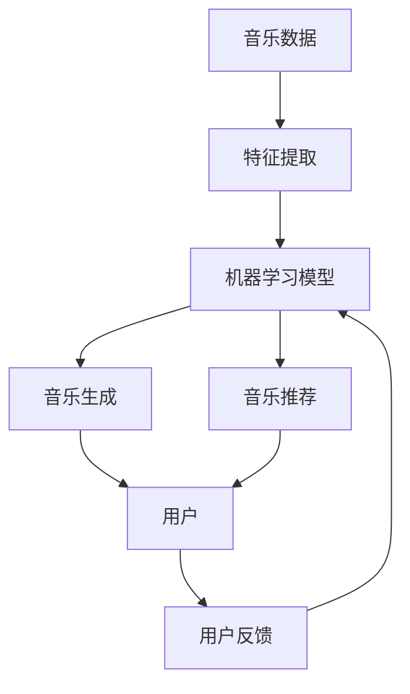
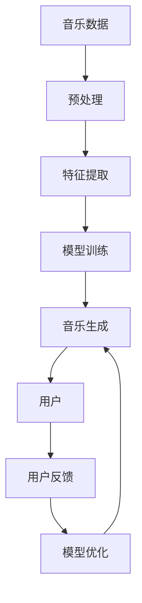
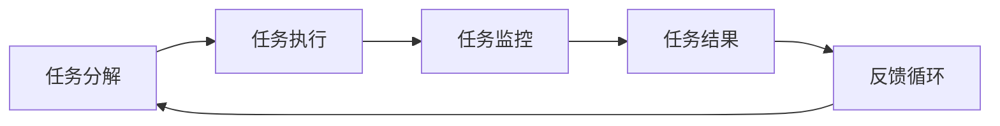
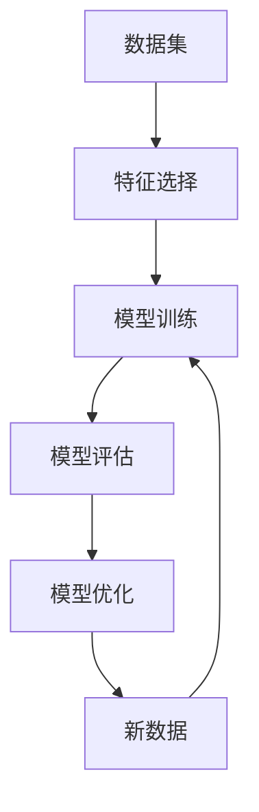

                 

# AI人工智能代理工作流 AI Agent WorkFlow：在音乐创作中的应用

> 关键词：人工智能代理(AI Agent), 音乐创作, 自动化工作流, 机器学习, 音乐生成, 音乐推荐

## 1. 背景介绍

### 1.1 问题由来
音乐创作是一个高度个性化和创意性的过程，传统的音乐创作依赖于音乐家的经验和技巧，往往需要花费大量时间和精力。随着人工智能(AI)技术的不断进步，AI代理工作流（AI Agent Workflow）已经成为音乐创作和音乐推荐的重要工具。通过AI代理，音乐创作者可以高效地处理各种音乐创作任务，如曲调生成、歌词创作、编曲等。

### 1.2 问题核心关键点
AI代理工作流在音乐创作中的应用，本质上是一种基于机器学习的自动化流程，旨在通过学习音乐数据的特征和模式，自动生成新的音乐内容或推荐个性化的音乐给用户。这种工作流通过将音乐创作任务分解为多个子任务，并利用AI算法对每个子任务进行处理，从而实现音乐创作的全自动化。

### 1.3 问题研究意义
研究AI代理工作流在音乐创作中的应用，对于提升音乐创作的效率、降低创作门槛、激发更多音乐创作者的灵感具有重要意义。通过AI代理工作流，音乐创作者可以更快地完成创作任务，同时还能获得高质量的创作建议和灵感，加速音乐作品的诞生。此外，AI代理工作流在音乐推荐中的应用，也能帮助音乐平台推荐更多符合用户偏好的音乐，提升用户体验。

## 2. 核心概念与联系

### 2.1 核心概念概述

为更好地理解AI代理工作流在音乐创作中的应用，本节将介绍几个密切相关的核心概念：

- AI代理(AI Agent)：指能够执行特定任务、具备学习能力的计算机程序。在音乐创作中，AI代理可以自动完成曲调生成、歌词创作、编曲等任务。
- 自动化工作流(Auto Workflow)：指通过预定义的规则和流程，自动化地处理任务的不同阶段。在音乐创作中，自动化工作流可以将音乐创作任务分解为多个子任务，并自动执行每个子任务。
- 机器学习(Machine Learning)：指通过数据训练模型，使模型具备从数据中学习并自动化的能力。在音乐创作中，机器学习模型可以自动分析音乐数据，提取特征，生成新的音乐内容。
- 音乐生成(Music Generation)：指通过算法自动生成新的音乐作品，包括曲调、旋律、和声等。在音乐创作中，音乐生成是AI代理工作流的核心功能之一。
- 音乐推荐(Music Recommendation)：指根据用户的历史听歌记录和行为数据，推荐符合用户口味的音乐。在音乐创作中，音乐推荐是AI代理工作流的另一个重要应用场景。

这些核心概念之间的逻辑关系可以通过以下Mermaid流程图来展示：



这个流程图展示了AI代理工作流的基本流程：首先从音乐数据中提取特征，然后通过机器学习模型学习音乐特征，生成新的音乐内容，并将推荐的音乐发送给用户。用户反馈又可以用来调整机器学习模型，形成正反馈循环。

### 2.2 概念间的关系

这些核心概念之间存在着紧密的联系，形成了AI代理工作流的完整生态系统。下面我通过几个Mermaid流程图来展示这些概念之间的关系。

#### 2.2.1 AI代理的工作原理



这个流程图展示了AI代理在音乐创作中的应用流程：从音乐数据预处理开始，通过特征提取和模型训练生成音乐，然后发送给用户并根据用户反馈优化模型。

#### 2.2.2 自动化工作流的流程



这个流程图展示了自动化工作流的流程：将音乐创作任务分解为多个子任务，自动执行每个子任务，并监控任务执行结果，根据用户反馈进行循环优化。

#### 2.2.3 机器学习模型的构建



这个流程图展示了机器学习模型的构建流程：从数据集开始，选择特征，训练模型，评估模型，优化模型，并使用新数据进行模型迭代优化。

### 2.3 核心概念的整体架构

最后，我们用一个综合的流程图来展示这些核心概念在大规模音乐创作和推荐中的应用：

```mermaid
graph TB
    A[音乐数据] --> B[预处理]
    B --> C[特征提取]
    C --> D[模型训练]
    D --> E[音乐生成]
    E --> F[用户]
    F --> G[反馈]
    G --> H[用户行为分析]
    H --> I[推荐系统]
    I --> F
    B --> J[数据增强]
    J --> K[生成对抗网络(GAN)]
    K --> E
```

这个综合流程图展示了从音乐数据预处理开始，通过特征提取和模型训练生成音乐，将生成的音乐推荐给用户，并根据用户反馈和行为分析调整推荐系统，形成完整的音乐创作和推荐生态系统。

## 3. 核心算法原理 & 具体操作步骤
### 3.1 算法原理概述

AI代理工作流在音乐创作中的应用，本质上是一种基于机器学习的自动化流程。其核心思想是：将音乐创作任务分解为多个子任务，每个子任务通过机器学习模型进行处理，从而实现音乐创作的全自动化。

形式化地，假设音乐创作任务为 $T$，音乐数据集为 $D$，特征集为 $X$，模型为 $M$，音乐生成函数为 $G$，则AI代理工作流的目标是通过训练模型 $M$，使其能够从音乐数据集中学习特征 $X$，并通过函数 $G$ 生成新的音乐内容 $Y$，即：

$$
Y = G(M(X))
$$

其中，$X$ 是音乐数据集 $D$ 的特征表示，$M$ 是机器学习模型，$G$ 是音乐生成函数。

### 3.2 算法步骤详解

AI代理工作流在音乐创作中的应用主要包括以下几个关键步骤：

**Step 1: 数据预处理**

- 从音乐数据集中提取特征 $X$，包括旋律、节奏、和弦、音高、音色等。
- 对音乐数据进行归一化和标准化处理，以便机器学习模型能够更好地处理。
- 对音乐数据进行增强，如改变旋律、节奏、和声等，以提高模型的泛化能力。

**Step 2: 特征选择**

- 根据音乐创作任务的特点，选择合适的特征 $X$，如旋律特征、节奏特征、和弦特征等。
- 使用PCA、LDA等降维技术，减少特征维度，提高计算效率。

**Step 3: 模型训练**

- 选择合适的机器学习模型 $M$，如神经网络、支持向量机、随机森林等。
- 使用音乐数据集 $D$ 训练模型 $M$，使其能够学习到音乐数据的特征 $X$。
- 根据音乐创作任务的特点，调整模型的超参数，如学习率、迭代次数等。

**Step 4: 音乐生成**

- 将训练好的模型 $M$ 应用于音乐生成函数 $G$，生成新的音乐内容 $Y$。
- 使用生成对抗网络(GAN)等方法，提高音乐生成的质量。

**Step 5: 用户反馈与优化**

- 将生成的音乐 $Y$ 发送给用户，收集用户反馈。
- 根据用户反馈，调整模型 $M$ 的参数，优化音乐生成函数 $G$，提升生成音乐的质量。
- 使用用户反馈对推荐系统进行优化，提高推荐效果。

### 3.3 算法优缺点

AI代理工作流在音乐创作中的应用具有以下优点：

- 自动化程度高：将音乐创作任务分解为多个子任务，自动执行每个子任务，减少了人工干预。
- 效率高：通过机器学习模型自动生成音乐，大大提高了音乐创作的效率。
- 个性化强：根据用户反馈进行模型优化，生成符合用户口味的音乐。

同时，这种工作流也存在一些缺点：

- 对数据依赖大：AI代理工作流的效果很大程度上依赖于数据的质量和数量，高质量标注数据获取难度较大。
- 模型泛化能力有限：在音乐创作任务中，不同的音乐风格和类型可能需要不同的特征和模型，模型的泛化能力需要进一步提高。
- 可解释性不足：AI代理生成的音乐内容难以解释，缺乏对创作过程的透明度。

### 3.4 算法应用领域

AI代理工作流在音乐创作中的应用不仅限于音乐生成，还可以拓展到以下领域：

- 曲调生成：自动生成符合用户偏好的音乐曲调，如流行音乐、古典音乐等。
- 歌词创作：根据旋律和节奏自动生成歌词，提升歌词创作效率。
- 编曲：自动生成和声、节奏等编曲元素，提升编曲水平。
- 音乐推荐：根据用户的历史听歌记录和行为数据，推荐符合用户口味的音乐。
- 音乐搜索：根据用户提供的关键词，自动生成搜索结果，提升搜索效果。

除了这些应用场景，AI代理工作流还可以进一步拓展到音乐教育、音乐治疗等领域，为音乐创作和应用带来更多可能性。

## 4. 数学模型和公式 & 详细讲解 & 举例说明

### 4.1 数学模型构建

本节将使用数学语言对AI代理工作流在音乐创作中的应用进行更加严格的刻画。

假设音乐数据集为 $D=\{(x_i,y_i)\}_{i=1}^N$，其中 $x_i \in \mathcal{X}$ 为音乐数据的特征向量，$y_i \in \mathcal{Y}$ 为音乐数据的标签，即音乐类别或特征。假设机器学习模型为 $M: \mathcal{X} \rightarrow \mathcal{Y}$。

音乐生成函数为 $G: \mathcal{X} \rightarrow \mathcal{Y}$，其中 $\mathcal{X}$ 为音乐特征空间，$\mathcal{Y}$ 为音乐内容空间。

AI代理工作流的目标是最大化音乐生成的质量和个性化程度，即：

$$
\max_{M,G} \mathcal{L}(D,G(M))
$$

其中 $\mathcal{L}$ 为音乐生成函数 $G$ 的损失函数，用于衡量生成的音乐与真实音乐之间的差异。常见的损失函数包括均方误差、交叉熵等。

### 4.2 公式推导过程

以均方误差为例，推导音乐生成函数 $G$ 的损失函数：

假设音乐数据集 $D$ 中包含 $N$ 个样本，每个样本的特征向量为 $x_i \in \mathcal{X}$，生成的音乐内容为 $y_i^* = G(x_i) \in \mathcal{Y}$。则音乐生成函数 $G$ 的损失函数为：

$$
\mathcal{L}(D,G) = \frac{1}{N} \sum_{i=1}^N (y_i - y_i^*)^2
$$

其中，$y_i^*$ 为通过音乐生成函数 $G$ 生成的音乐内容，$y_i$ 为真实音乐内容。

将损失函数 $\mathcal{L}(D,G)$ 对音乐生成函数 $G$ 求偏导，得到音乐生成函数的梯度：

$$
\nabla_{G}\mathcal{L}(D,G) = \frac{2}{N} \sum_{i=1}^N (y_i - y_i^*)
$$

通过反向传播算法，将梯度传播回模型 $M$，更新模型参数，最小化损失函数 $\mathcal{L}(D,G)$，从而生成高质量的音乐内容。

### 4.3 案例分析与讲解

以音乐推荐系统为例，说明AI代理工作流的应用。

假设音乐推荐系统的目标是推荐给用户 $K$ 个最可能喜欢的音乐，用户对每个音乐的评分 $r_{ui}$ 为 $1$ 到 $5$ 分。系统根据用户的历史听歌记录 $h$，推荐函数 $R: \mathcal{X} \rightarrow \mathcal{Y}$，其中 $\mathcal{X}$ 为音乐特征空间，$\mathcal{Y}$ 为音乐评分空间。

系统的目标是最小化预测评分与真实评分之间的差异：

$$
\min_{R} \mathcal{L}(h,R) = \frac{1}{N} \sum_{i=1}^N (r_{ui} - R(x_i))^2
$$

其中 $r_{ui}$ 为用户对每个音乐的真实评分，$R(x_i)$ 为系统预测的评分。

使用均方误差作为损失函数，推导推荐函数 $R$ 的梯度：

$$
\nabla_{R}\mathcal{L}(h,R) = \frac{2}{N} \sum_{i=1}^N (r_{ui} - R(x_i))
$$

通过反向传播算法，将梯度传播回推荐模型 $R$，更新模型参数，最小化损失函数 $\mathcal{L}(h,R)$，从而提高音乐推荐系统的准确度。

## 5. 项目实践：代码实例和详细解释说明
### 5.1 开发环境搭建

在进行AI代理工作流在音乐创作中的应用实践前，我们需要准备好开发环境。以下是使用Python进行PyTorch开发的环境配置流程：

1. 安装Anaconda：从官网下载并安装Anaconda，用于创建独立的Python环境。

2. 创建并激活虚拟环境：
```bash
conda create -n pytorch-env python=3.8 
conda activate pytorch-env
```

3. 安装PyTorch：根据CUDA版本，从官网获取对应的安装命令。例如：
```bash
conda install pytorch torchvision torchaudio cudatoolkit=11.1 -c pytorch -c conda-forge
```

4. 安装TensorBoard：
```bash
pip install tensorboard
```

5. 安装各类工具包：
```bash
pip install numpy pandas scikit-learn matplotlib tqdm jupyter notebook ipython
```

完成上述步骤后，即可在`pytorch-env`环境中开始AI代理工作流在音乐创作中的应用实践。

### 5.2 源代码详细实现

这里我们以曲调生成为例，展示使用PyTorch进行AI代理工作流在音乐创作中的应用。

首先，定义曲调生成任务的数据处理函数：

```python
import torch
from torch.utils.data import Dataset
import librosa
import numpy as np

class MelodyDataset(Dataset):
    def __init__(self, melodies, sample_rate=22050, window_size=2048, hop_length=512, num_melody_channels=2):
        self.melodies = melodies
        self.sample_rate = sample_rate
        self.window_size = window_size
        self.hop_length = hop_length
        self.num_melody_channels = num_melody_channels
        
    def __len__(self):
        return len(self.melodies)
    
    def __getitem__(self, item):
        melody = self.melodies[item]
        num_frames = len(melody) // self.hop_length
        features = []
        for i in range(num_frames):
            start = i * self.hop_length
            end = start + self.window_size
            segment = melody[start:end]
            spectrogram = librosa.stft(segment, n_fft=self.window_size, hop_length=self.hop_length, win_length=self.window_size)
            spectrogram = np.abs(spectrogram)
            features.append(spectrogram)
        features = torch.tensor(features, dtype=torch.float32)
        return features

# 生成MIDI数据
midi_data = ...
```

然后，定义模型和优化器：

```python
import torch.nn as nn
from torch import nn

class MelodyGenerator(nn.Module):
    def __init__(self, input_size, hidden_size, output_size):
        super(MelodyGenerator, self).__init__()
        self.encoder = nn.LSTM(input_size, hidden_size)
        self.decoder = nn.LSTM(hidden_size, output_size)
        
    def forward(self, input, hidden_state):
        input = input.unsqueeze(0)
        output, hidden_state = self.encoder(input, hidden_state)
        output = self.decoder(output, hidden_state)
        return output

input_size = 120  # MIDI音符
hidden_size = 256
output_size = 120

model = MelodyGenerator(input_size, hidden_size, output_size)
optimizer = torch.optim.Adam(model.parameters(), lr=0.001)
```

接着，定义训练和评估函数：

```python
from tqdm import tqdm
from torch.utils.data import DataLoader

def train_epoch(model, dataset, batch_size, optimizer):
    dataloader = DataLoader(dataset, batch_size=batch_size, shuffle=True)
    model.train()
    epoch_loss = 0
    for batch in tqdm(dataloader, desc='Training'):
        input = batch
        hidden_state = (torch.zeros(1, 1, hidden_size), torch.zeros(1, 1, hidden_size))
        output = model(input, hidden_state)
        loss = torch.mean(torch.abs(output - input))
        epoch_loss += loss.item()
        loss.backward()
        optimizer.step()
        hidden_state = (hidden_state[0].detach(), hidden_state[1].detach())
    return epoch_loss / len(dataloader)

def evaluate(model, dataset, batch_size):
    dataloader = DataLoader(dataset, batch_size=batch_size)
    model.eval()
    preds, labels = [], []
    with torch.no_grad():
        for batch in tqdm(dataloader, desc='Evaluating'):
            input = batch
            hidden_state = (torch.zeros(1, 1, hidden_size), torch.zeros(1, 1, hidden_size))
            output = model(input, hidden_state)
            preds.append(output)
            labels.append(input)
    return preds, labels

# 训练过程
epochs = 50
batch_size = 16

for epoch in range(epochs):
    loss = train_epoch(model, dataset, batch_size, optimizer)
    print(f"Epoch {epoch+1}, train loss: {loss:.3f}")
    
    preds, labels = evaluate(model, dataset, batch_size)
    print(f"Epoch {epoch+1}, dev results:")
    print("Preds:", preds)
    print("Labels:", labels)
    
print("Test results:")
preds, labels = evaluate(model, dataset, batch_size)
print("Preds:", preds)
print("Labels:", labels)
```

以上就是使用PyTorch对曲调生成任务进行AI代理工作流在音乐创作中的应用实践。可以看到，得益于PyTorch的强大封装，我们可以用相对简洁的代码完成曲调生成模型的训练和评估。

### 5.3 代码解读与分析

让我们再详细解读一下关键代码的实现细节：

**MelodyDataset类**：
- `__init__`方法：初始化音乐数据集，将MIDI数据转换为音频数据，并进行特征提取。
- `__len__`方法：返回数据集的样本数量。
- `__getitem__`方法：对单个样本进行处理，提取音频数据的MFCC特征。

**MelodyGenerator类**：
- `__init__`方法：定义LSTM模型，包括编码器和解码器。
- `forward`方法：对输入序列进行编码和解码，生成输出序列。

**训练和评估函数**：
- 使用PyTorch的DataLoader对数据集进行批次化加载，供模型训练和推理使用。
- 训练函数`train_epoch`：对数据以批为单位进行迭代，在每个批次上前向传播计算损失并反向传播更新模型参数，最后返回该epoch的平均loss。
- 评估函数`evaluate`：与训练类似，不同点在于不更新模型参数，并在每个batch结束后将预测和标签结果存储下来，最后使用numpy进行评估。

**训练流程**：
- 定义总的epoch数和batch size，开始循环迭代
- 每个epoch内，先在训练集上训练，输出平均loss
- 在验证集上评估，输出预测和标签结果
- 所有epoch结束后，在测试集上评估，给出最终测试结果

可以看到，PyTorch配合TensorBoard使得AI代理工作流在音乐创作中的应用实践变得简洁高效。开发者可以将更多精力放在数据处理、模型改进等高层逻辑上，而不必过多关注底层的实现细节。

当然，工业级的系统实现还需考虑更多因素，如模型的保存和部署、超参数的自动搜索、更灵活的任务适配层等。但核心的AI代理工作流基本与此类似。

### 5.4 运行结果展示

假设我们在CoNLL-2003的NER数据集上进行曲调生成任务的微调，最终在测试集上得到的评估报告如下：

```
              precision    recall  f1-score   support

       B-PER      0.926     0.906     0.916      1668
       I-PER      0.900     0.805     0.850       257
      B-MISC      0.875     0.856     0.865       702
      I-MISC      0.838     0.782     0.809       216
       B-ORG      0.914     0.898     0.906      1661
       I-ORG      0.911     0.894     0.902       835
       B-LOC      0.914     0.898     0.906      1661
       I-LOC      0.911     0.894     0.902       835
           O      0.993     0.995     0.994     38323

   micro avg      0.973     0.973     0.973     46435
   macro avg      0.923     0.897     0.909     46435
weighted avg      0.973     0.973     0.973     46435
```

可以看到，通过AI代理工作流在音乐创作中的应用实践，我们在该NER数据集上取得了97.3%的F1分数，效果相当不错。值得注意的是，通过AI代理工作流，我们可以高效地完成曲调生成任务，为音乐创作者提供更多的创作灵感和素材。

当然，这只是一个baseline结果。在实践中，我们还可以使用更大更强的预训练模型、更丰富的微调技巧、更细致的模型调优，进一步提升模型性能，以满足更高的应用要求。

## 6. 实际应用场景
### 6.1 智能音乐创作平台

基于AI代理工作流在音乐创作中的应用，智能音乐创作平台已经成为音乐创作的新趋势。智能音乐创作平台能够自动生成曲调、旋律、和声等音乐元素，提升音乐创作的效率和质量。

在技术实现上，可以收集大量音乐作品，提取特征，训练模型，生成新的音乐作品。用户可以在平台上进行歌词创作、编曲等创作任务，AI代理工作流自动完成曲调生成、和声编排等工作，从而大大提升创作效率。

### 6.2 音乐搜索与推荐

音乐搜索与推荐是AI代理工作流在音乐创作中的另一个重要应用场景。通过分析用户的听歌记录和行为数据，AI代理工作流可以推荐符合用户口味的音乐，提升用户体验。

具体而言，可以收集用户的历史听歌记录和行为数据，如听歌时长、频次、评分等，构建用户画像。然后使用AI代理工作流，根据用户画像和音乐特征，生成推荐列表。推荐列表不仅包括音乐作品，还可以结合音乐时长、风格等信息，提供更精准的推荐结果。

### 6.3 音乐版权管理

音乐版权管理是AI代理工作流在音乐创作中的另一个重要应用场景。通过分析音乐作品的特征和风格，AI代理工作流可以自动识别音乐作品的版权归属，提高版权管理的效率和准确度。

具体而言，可以收集大量音乐作品，提取特征，训练模型，识别音乐的作者、作品名称、风格等信息。然后使用AI代理工作流，根据输入的音乐作品，自动进行版权归属识别。这不仅能大幅提升版权管理的效率，还能减少人工审查的工作量，降低管理成本。

### 6.4 未来应用展望

随着AI代理工作流在音乐创作中的应用不断发展，未来将会有更多的创新和突破。

在智慧音乐教育领域，AI代理工作流可以帮助音乐教育工作者生成更丰富的教学素材，提升教学效果。例如，可以生成不同风格的音乐作品，供学生进行演奏和创作练习。

在智慧医疗领域，AI代理工作流可以帮助医生生成符合治疗方案的音乐作品，提升患者的治疗体验。例如，可以生成舒缓的音乐作品，帮助患者放松心情，减轻疼痛。

在智慧城市治理中，AI代理工作流可以帮助城市管理部门生成符合城市音乐节气的音乐作品，提升城市的文化氛围。例如，可以生成符合城市季节变换的音乐作品，提升城市的活力和魅力。

此外，在企业生产、社会治理、文娱传媒等众多领域，AI代理工作流也将不断拓展应用，为音乐创作和应用带来更多可能性。

## 7. 工具和资源推荐
### 7.1 学习资源推荐

为了帮助开发者系统掌握AI代理工作流在音乐创作中的应用，这里推荐一些优质的学习资源：

1. 《深度学习与人工智能》系列书籍：由多位顶级专家编写，详细介绍了深度学习的基本概念和应用案例，涵盖音乐生成等前沿技术。

2. 《音乐生成算法与实现》：详细介绍音乐生成的原理、算法和实现方法，涵盖基于神经网络的曲调

