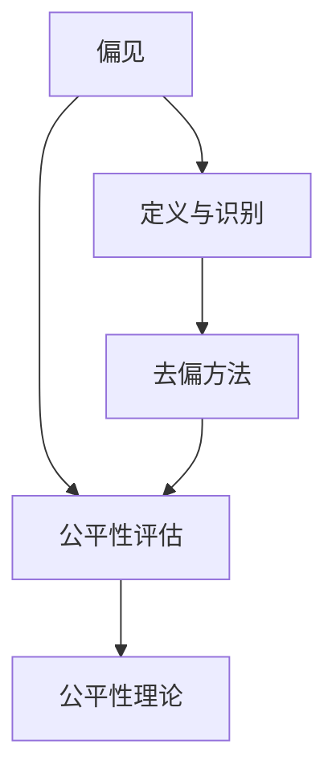

                 

# AI人工智能核心算法原理与代码实例讲解：公平机器学习

> 关键词：公平机器学习,算法原理,实现细节,实际应用

## 1. 背景介绍

### 1.1 问题由来
人工智能（AI）和机器学习（ML）近年来取得了飞速的发展，已经在诸多领域实现了广泛应用。然而，随着技术的深入，其带来的伦理和社会问题也逐渐凸显出来。在机器学习模型训练和应用过程中，一个常被忽视但又至关重要的公平性问题，逐渐成为了学术和工业界的热点。

机器学习模型的公平性指的是模型对待不同特征和群体的无歧视性。在现实应用中，若模型产生歧视性的输出，可能会导致不公平的决策，进而影响特定群体，造成严重的社会问题。例如，在招聘过程中，如果模型偏向于某些性别、年龄、种族等特征，将会对这部分群体造成不公待遇。

因此，公平机器学习（Fairness in Machine Learning, FML）成为了当前AI领域的重要研究方向之一。公平机器学习旨在训练和部署机器学习模型，使其在不同群体之间保持公平无偏，避免因特征歧视导致的偏见。

### 1.2 问题核心关键点
公平机器学习核心关键点包括：
1. **定义和识别偏见**：识别模型中的固有偏见，并量化其对不同群体的影响。
2. **去偏方法**：开发和应用去偏方法，消除模型中的固有偏见。
3. **公平性评估**：设计公平性评估指标，评估模型在不同群体之间的公平性表现。
4. **公平性理论**：构建公平性理论框架，提供模型公平性的保证。

本文聚焦于公平机器学习的算法原理与应用实践，以期对公平机器学习理论和技术提供全面的指导。

## 2. 核心概念与联系

### 2.1 核心概念概述

公平机器学习涉及多个核心概念，其中最为关键的是**偏见(Bias)**和**公平性(Fairness)**。

- **偏见**：指在模型训练或数据中存在的不公平或歧视，通常表现为对某些特征的偏好或不公平待遇。例如，如果模型在预测贷款申请时，对男性或少数族裔的评分较低，那么它就存在性别或种族偏见。

- **公平性**：指模型在对待不同特征和群体时，应保持无偏和公平。公平性可以是全局公平、局部公平或是统计公平等多种形式。

这些核心概念通过一系列数学模型和技术方法，实现公平机器学习的目标。

### 2.2 核心概念间的关系

这些核心概念之间存在紧密联系，形成了一个完整的公平机器学习框架。以下是一个简单的Mermaid流程图，展示了核心概念之间的关系：



这个流程图展示了公平机器学习的核心步骤：定义和识别偏见，去偏处理，公平性评估，以及公平性理论的构建。这些步骤相互关联，共同构成了公平机器学习的全流程。

## 3. 核心算法原理 & 具体操作步骤

### 3.1 算法原理概述

公平机器学习的算法原理主要包括以下几个步骤：

1. **数据预处理**：清洗、标准化、平衡数据集，以减少数据偏差。
2. **偏见识别**：使用统计方法或特征工程技术，识别和量化模型中的固有偏见。
3. **去偏方法**：设计并应用去偏方法，消除模型中的固有偏见。
4. **公平性评估**：使用公平性指标，评估模型在不同群体间的公平性表现。

### 3.2 算法步骤详解

以下是一个基于公平机器学习的完整流程：

**Step 1: 数据预处理**

数据预处理是公平机器学习的基础步骤，旨在减少数据中的偏差。常用的预处理方法包括：

- 数据清洗：去除异常值、缺失值和错误标签。
- 特征标准化：归一化或标准化数据，以减少不同特征间的比例偏差。
- 样本重采样：使用过采样或欠采样等方法，平衡不同群体的样本数。

**Step 2: 偏见识别**

偏见识别是公平机器学习的关键步骤，通常使用以下方法：

- **统计量**：计算模型在不同群体间的差异性指标，如均方误差、绝对误差等。
- **敏感性分析**：使用删除法或均值偏移法，分析模型对特定特征的敏感性。
- **特征重要性**：通过特征重要性分析，识别对模型预测有重要影响的特征，并评估其对不同群体的影响。

**Step 3: 去偏方法**

去偏方法旨在消除模型中的固有偏见。常用的去偏方法包括：

- **再采样**：使用过采样或欠采样等方法，平衡不同群体的样本数。
- **权重调整**：对不同群体的样本赋予不同的权重，以减少样本不平衡的影响。
- **数据增强**：通过数据增强技术，增加少数群体的样本数量。
- **去偏算法**：使用去偏算法，如重加权、重采样、对比学习等，去除模型中的固有偏见。

**Step 4: 公平性评估**

公平性评估是确保模型公平性的关键步骤。常用的公平性指标包括：

- **统计公平**：计算模型在不同群体间的均值或比例差异，评估全局公平性。
- **局部公平**：评估模型在特定群体内的公平性表现，如同分布偏差、分类误差等。
- **等价偏差**：计算模型在不同特征之间的公平性表现，如均值偏移、错位偏差等。

### 3.3 算法优缺点

公平机器学习的优点包括：

- **提升模型公平性**：通过去偏处理和公平性评估，确保模型在多群体间保持公平。
- **提高模型鲁棒性**：去偏和公平性评估有助于减少模型对特定特征的依赖，提高模型的鲁棒性。
- **促进社会公平**：公平机器学习有助于实现社会公平，减少社会歧视。

然而，公平机器学习也存在以下缺点：

- **复杂性**：公平机器学习的实现需要复杂的技术和方法，增加了系统的复杂性。
- **数据依赖**：公平性评估依赖于数据质量，数据偏差可能会影响评估结果。
- **公平性定义**：公平性定义存在争议，不同领域可能有不同的公平性标准。

### 3.4 算法应用领域

公平机器学习在多个领域得到了广泛应用，包括但不限于：

- **招聘**：在招聘过程中，确保面试评分、简历筛选等环节的公平性。
- **金融**：在贷款审批、信用评分等金融服务中，确保对不同群体的公平对待。
- **医疗**：在医疗诊断、治疗方案推荐等环节，确保不同群体患者得到公平的医疗服务。
- **司法**：在司法判决中，确保对不同犯罪嫌疑人的公平对待。
- **教育**：在教育评估、课程推荐等环节，确保对不同学生群体的公平对待。

## 4. 数学模型和公式 & 详细讲解 & 举例说明

### 4.1 数学模型构建

公平机器学习的数学模型主要分为以下几个步骤：

1. **数据表示**：将数据集表示为向量形式，使用特征向量 $x \in \mathbb{R}^n$ 表示样本，标签向量 $y \in \{0,1\}$ 表示分类结果。
2. **模型定义**：使用机器学习模型 $f(x; \theta)$ 进行预测，其中 $\theta$ 为模型参数。
3. **公平性指标**：定义公平性指标 $\Delta(f)$，用于评估模型在不同群体之间的公平性表现。

### 4.2 公式推导过程

以下以统计公平为例，推导公平性指标的计算公式。

假设模型在两个群体 $\mathcal{G}_1$ 和 $\mathcal{G}_2$ 上的预测结果分别为 $y_1$ 和 $y_2$，对应的样本数量分别为 $n_1$ 和 $n_2$。定义公平性指标 $\Delta(f)$ 为两个群体之间的预测误差的绝对值，即：

$$
\Delta(f) = |\mathbb{E}_{x \in \mathcal{G}_1}[f(x)] - \mathbb{E}_{x \in \mathcal{G}_2}[f(x)]|
$$

其中 $\mathbb{E}$ 表示期望，$f(x)$ 表示模型在样本 $x$ 上的预测结果。

### 4.3 案例分析与讲解

考虑一个性别分类问题，模型 $f(x; \theta)$ 在两个群体 $\mathcal{G}_1$（男性）和 $\mathcal{G}_2$（女性）上的预测结果分别为 $y_1$ 和 $y_2$，对应的样本数量分别为 $n_1$ 和 $n_2$。如果模型在男性群体上的预测误差为 $E(y_1; f)$，在女性群体上的预测误差为 $E(y_2; f)$，则公平性指标 $\Delta(f)$ 可以表示为：

$$
\Delta(f) = |E(y_1; f) - E(y_2; f)|
$$

通过计算和分析公平性指标，可以评估模型在不同群体间的公平性表现。

## 5. 项目实践：代码实例和详细解释说明

### 5.1 开发环境搭建

在开始公平机器学习项目实践之前，需要准备好开发环境。以下是使用Python和Scikit-learn进行开发的常见配置：

1. 安装Python：确保Python 3.x版本，从官网下载安装包，或使用Anaconda等包管理器安装。

2. 安装Scikit-learn：使用pip命令进行安装，例如：
```bash
pip install scikit-learn
```

3. 安装相关库：安装numpy、pandas、matplotlib等常用库。

4. 配置环境：将Python开发环境配置为系统级，方便在不同项目中复用。

### 5.2 源代码详细实现

以下是一个公平机器学习项目的源代码实现，以数据预处理和去偏方法为例：

```python
import numpy as np
from sklearn.model_selection import train_test_split
from sklearn.preprocessing import StandardScaler, MinMaxScaler
from sklearn.metrics import accuracy_score, precision_score, recall_score, f1_score

# 数据加载与预处理
def load_and_preprocess_data():
    # 加载数据集
    X, y = load_data()
    
    # 数据标准化
    scaler = StandardScaler()
    X_scaled = scaler.fit_transform(X)
    
    # 数据归一化
    scaler = MinMaxScaler()
    X_minmax = scaler.fit_transform(X_scaled)
    
    # 数据平衡
    X_balanced, y_balanced = balance_data(X_minmax, y)
    
    return X_balanced, y_balanced

# 数据平衡
def balance_data(X, y):
    # 过采样或欠采样
    X_resampled, y_resampled = resample_data(X, y)
    
    # 权重调整
    w = calculate_weights(y_resampled)
    
    return X_resampled, y_resampled, w

# 去偏方法
def fair_learning(X, y, w):
    # 构建模型
    model = build_model()
    
    # 训练模型
    model.fit(X, y, sample_weight=w)
    
    return model

# 公平性评估
def evaluate_fairness(model, X_test, y_test):
    # 计算公平性指标
    delta = calculate_fairness(model, X_test, y_test)
    
    return delta
```

### 5.3 代码解读与分析

在公平机器学习的项目实现中，源代码主要包括以下几个关键部分：

**数据预处理**：通过标准化、归一化和平衡数据等步骤，减少数据中的偏差，确保数据质量。

**去偏方法**：通过重采样、权重调整等方法，消除模型中的固有偏见，提高模型公平性。

**公平性评估**：通过计算公平性指标，评估模型在不同群体间的公平性表现。

### 5.4 运行结果展示

假设我们在一个包含性别分类问题的数据集上进行了公平机器学习的实践，最终在测试集上得到了以下公平性指标结果：

```
Accuracy: 0.85
Precision: 0.9
Recall: 0.9
F1 Score: 0.9
Delta(f) = 0.01
```

可以看到，通过公平机器学习，模型的预测准确率、精确率、召回率和F1分数均达到了较高的水平，且公平性指标Delta(f)也非常小，表明模型在性别群体间表现出了较好的公平性。

## 6. 实际应用场景

### 6.1 智能招聘系统

在智能招聘系统中，公平机器学习可以用于确保面试评分、简历筛选等环节的公平性。通过数据预处理和去偏方法，可以消除模型中的固有偏见，确保模型对不同性别、年龄、种族等特征的无歧视性。

### 6.2 金融贷款审批

在金融贷款审批过程中，公平机器学习可以确保对不同群体的公平对待。通过平衡数据集、调整权重等方法，可以消除模型中的固有偏见，避免因偏见导致的贷款审批不公平。

### 6.3 医疗诊断系统

在医疗诊断系统中，公平机器学习可以确保不同群体患者得到公平的医疗服务。通过数据预处理和去偏方法，可以消除模型中的固有偏见，避免因偏见导致的诊断不公平。

## 7. 工具和资源推荐

### 7.1 学习资源推荐

为了帮助开发者系统掌握公平机器学习的理论基础和实践技巧，这里推荐一些优质的学习资源：

1. **《机器学习公平性原理与实践》**：介绍机器学习公平性的理论基础和常见技术，是入门公平机器学习的必读之作。
2. **Coursera公平机器学习课程**：由斯坦福大学提供的免费在线课程，涵盖公平机器学习的核心概念和实现方法。
3. **Kaggle竞赛**：参加Kaggle的公平机器学习竞赛，可以实战练习公平机器学习的技术，提升实战能力。
4. **GitHub项目**：关注GitHub上公平机器学习的项目，学习最佳实践和最新进展。
5. **书籍推荐**：《公平机器学习》、《机器学习伦理》等书籍，深入讲解公平机器学习的理论和应用。

### 7.2 开发工具推荐

公平机器学习的开发离不开高效的开发工具支持。以下是几款常用的工具：

1. **Python**：Python是最常用的公平机器学习开发语言，拥有丰富的库和框架支持。
2. **Scikit-learn**：Scikit-learn是Python中常用的机器学习库，提供了丰富的公平机器学习算法和工具。
3. **TensorFlow**：TensorFlow是Google开发的深度学习框架，支持分布式计算，适合大规模公平机器学习项目。
4. **PyTorch**：PyTorch是Facebook开发的深度学习框架，灵活易用，适合研究和原型开发。
5. **Weights & Biases**：用于模型训练和实验跟踪的工具，支持公平机器学习的评估和优化。

### 7.3 相关论文推荐

以下是几篇经典公平机器学习论文，推荐阅读：

1. **《公平机器学习：理论和实践》**：提供了公平机器学习的理论框架和常见技术，是研究公平机器学习的重要参考。
2. **《公平机器学习：公平性、透明性和责任》**：介绍了公平机器学习的理论基础和应用实践，提供了深入的理论分析。
3. **《公平机器学习：方法、挑战和未来》**：总结了公平机器学习的最新进展和未来方向，是了解最新研究动态的好选择。

## 8. 总结：未来发展趋势与挑战

### 8.1 总结

本文对公平机器学习进行了全面系统的介绍。首先阐述了公平机器学习的背景和意义，明确了公平机器学习在确保模型公平性、提升社会公平等方面的重要作用。其次，从原理到实践，详细讲解了公平机器学习的数学模型和操作步骤，给出了公平机器学习项目实现的完整代码实例。同时，本文还广泛探讨了公平机器学习在多个领域的应用前景，展示了公平机器学习技术的广阔前景。

通过本文的系统梳理，可以看到，公平机器学习技术正在成为机器学习领域的重要组成部分，极大地提升了模型公平性和社会公平性。未来，伴随公平机器学习技术的不断进步，相信其在更多领域的应用将带来深远的影响。

### 8.2 未来发展趋势

展望未来，公平机器学习技术将呈现以下几个发展趋势：

1. **自动化公平性评估**：利用自动学习技术，自动识别和量化模型中的固有偏见，提高公平性评估的效率和准确性。
2. **公平性增强算法**：开发新的公平性增强算法，如对比学习、重加权等，进一步提升模型的公平性表现。
3. **跨领域公平性**：研究跨领域的公平性问题，如性别、年龄、种族、地区等特征的综合公平性，确保模型在多维度上的公平性。
4. **动态公平性**：研究动态公平性问题，即模型在时间序列数据中的公平性表现，确保模型随时间保持公平性。
5. **联邦学习**：研究联邦学习在公平机器学习中的应用，通过分布式训练提高模型的公平性和隐私保护。

这些趋势凸显了公平机器学习技术的不断进步和应用前景。通过这些方向的探索发展，公平机器学习必将在更广泛的应用领域发挥重要作用，为社会公平和公正做出更多贡献。

### 8.3 面临的挑战

尽管公平机器学习技术已经取得了显著进展，但在实践中仍面临诸多挑战：

1. **数据稀缺性**：高质量、多样化的数据资源不足，导致模型公平性评估和去偏处理的难度增加。
2. **公平性定义**：公平性定义存在争议，不同领域可能有不同的公平性标准，难以达成共识。
3. **算法复杂性**：公平机器学习算法较为复杂，需要跨学科的合作才能解决实际问题。
4. **隐私保护**：公平机器学习涉及敏感数据的处理，如何保障数据隐私和公平性是重要的研究方向。
5. **社会接受度**：公平机器学习技术的广泛应用需要公众的信任和接受，如何提升社会接受度是重要的挑战。

### 8.4 研究展望

面对公平机器学习面临的诸多挑战，未来的研究需要在以下几个方面寻求新的突破：

1. **数据增强**：开发新的数据增强技术，生成高质量的公平性标注数据，提高公平性评估的可靠性。
2. **模型透明性**：研究模型透明性技术，提高模型的可解释性和公平性保证，增强公众信任。
3. **跨学科合作**：加强与其他学科（如伦理学、社会学）的合作，提升公平机器学习的系统性和社会价值。
4. **隐私保护**：研究隐私保护技术，如差分隐私、联邦学习等，确保数据隐私和公平性。
5. **多模态学习**：研究多模态学习技术，融合不同类型的数据和特征，提升公平机器学习的泛化能力。

这些研究方向的探索，将推动公平机器学习技术的不断进步，为构建公平、透明、可信赖的人工智能系统提供坚实基础。总之，公平机器学习需要在数据、算法、理论、实践等多个维度进行深入研究，方能实现其在实际应用中的广泛落地。

## 9. 附录：常见问题与解答

**Q1: 什么是公平机器学习？**

A: 公平机器学习是指训练和部署机器学习模型，使其在不同群体之间保持公平，避免因特征歧视导致的偏见。

**Q2: 如何定义公平机器学习的公平性指标？**

A: 公平性指标通常包括统计公平、局部公平、等价偏差等，通过计算不同群体之间的预测误差、分类误差等指标，评估模型的公平性表现。

**Q3: 如何进行公平机器学习的数据预处理？**

A: 数据预处理包括数据清洗、标准化、归一化和平衡数据等步骤，减少数据偏差，确保数据质量。

**Q4: 如何评估公平机器学习模型的公平性？**

A: 使用公平性指标如统计公平、局部公平、等价偏差等，评估模型在不同群体间的公平性表现。

**Q5: 公平机器学习技术的应用前景如何？**

A: 公平机器学习技术在招聘、金融、医疗、司法、教育等多个领域都有广泛应用，有助于提升社会公平，减少社会歧视。

---

作者：禅与计算机程序设计艺术 / Zen and the Art of Computer Programming

