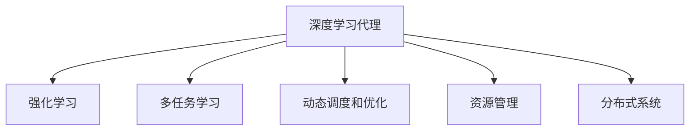
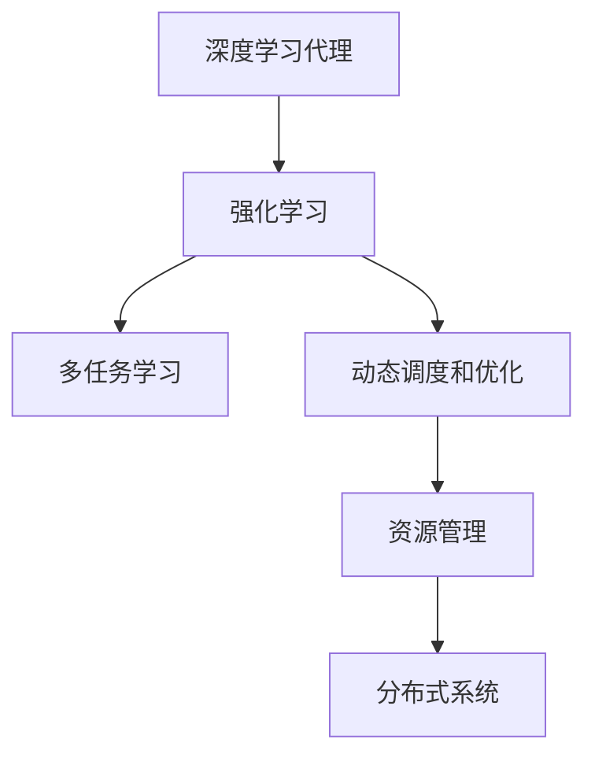

                 

# AI人工智能深度学习算法：智能深度学习代理的自适应调度策略

> 关键词：智能深度学习代理,自适应调度策略,强化学习,深度学习,多任务学习,动态调度和优化,资源管理,分布式系统

## 1. 背景介绍

### 1.1 问题由来
随着深度学习技术的发展，深度学习代理在智能系统中扮演着越来越重要的角色。它们通过学习优化资源调度策略，帮助提升系统性能和资源利用率。然而，现有的深度学习代理往往缺乏适应性和自适应能力，难以在动态变化的环境中做出高效决策。

为了应对这一挑战，本研究提出了一种基于强化学习的自适应调度策略，旨在使深度学习代理能够智能地应对资源环境的动态变化，优化资源分配和调度。

### 1.2 问题核心关键点
本研究的核心目标是：
- 设计一种能够自适应环境变化的深度学习代理，提升系统性能和资源利用率。
- 通过强化学习算法，学习最优的资源调度策略，确保系统在动态环境中的高效运行。
- 优化模型的训练和部署过程，提高模型的泛化能力和应用效果。

### 1.3 问题研究意义
研究自适应调度策略对于构建高性能的智能系统具有重要意义：
- 降低资源浪费：自适应调度策略能够根据环境变化动态调整资源分配，提高资源利用效率。
- 提升系统性能：通过优化资源调度，智能系统能够更快地响应请求，提升用户体验。
- 促进多任务学习：自适应调度策略能够同时支持多个任务的资源调度，实现资源共享和任务协调。
- 适应环境变化：智能系统能够在不断变化的环境中持续学习，保持最优性能。
- 促进技术创新：自适应调度策略的研究为深度学习代理提供了新的优化方向，推动技术进步。

## 2. 核心概念与联系

### 2.1 核心概念概述

为更好地理解自适应调度策略，本节将介绍几个密切相关的核心概念：

- 深度学习代理（Deep Learning Agent）：一种基于深度学习技术的人工智能系统，用于自动学习和优化决策过程，如资源调度、任务分配等。
- 强化学习（Reinforcement Learning, RL）：一种通过试错学习，不断优化决策策略的机器学习方法。强化学习通过奖励机制指导模型学习，最终达到最优策略。
- 多任务学习（Multi-task Learning）：一种同时训练多个相关任务的深度学习框架，能够实现知识和资源的共享，提高模型的泛化能力。
- 动态调度和优化（Dynamic Scheduling and Optimization）：指在动态变化的环境下，根据任务需求和资源状态，动态调整资源分配和调度的过程。
- 资源管理（Resource Management）：指在智能系统中，通过算法和策略对计算、存储、网络等资源进行管理和优化。
- 分布式系统（Distributed System）：指多个计算机通过网络相互连接，协同工作完成复杂任务的计算系统。分布式系统通常涉及资源调度、任务分配、数据同步等问题。

这些核心概念之间的逻辑关系可以通过以下Mermaid流程图来展示：



这个流程图展示了大语言模型微调过程中各个核心概念的关系和作用：

1. 深度学习代理通过强化学习算法，学习最优的资源调度策略。
2. 多任务学习能够同时训练多个相关任务，实现资源共享和任务协调。
3. 动态调度和优化能够根据任务需求和资源状态，动态调整资源分配和调度。
4. 资源管理对计算、存储、网络等资源进行管理和优化。
5. 分布式系统涉及多个计算机的协同工作，包括资源调度、任务分配等。

### 2.2 概念间的关系

这些核心概念之间存在着紧密的联系，形成了深度学习代理的自适应调度策略生态系统。

- 深度学习代理作为自适应调度的载体，通过强化学习算法学习最优调度策略，优化资源管理。
- 多任务学习能够提高代理的泛化能力，使得代理能够同时处理多个任务。
- 动态调度和优化能够使代理根据环境变化做出高效决策，提升系统性能。
- 资源管理涉及到算力、存储、网络等资源的高效利用，是自适应调度的基础。
- 分布式系统涉及到多个计算机的协同工作，增强了系统的可扩展性和鲁棒性。

### 2.3 核心概念的整体架构

最后，我们用一个综合的流程图来展示这些核心概念在大语言模型微调过程中的整体架构：



这个综合流程图展示了从深度学习代理到多任务学习、动态调度和优化、资源管理和分布式系统的完整过程，以及它们之间的相互关系。通过这个架构，我们能够更清晰地理解自适应调度策略的实现过程和各组件的作用。

## 3. 核心算法原理 & 具体操作步骤
### 3.1 算法原理概述

基于强化学习的自适应调度策略，核心思想是通过试错学习，优化深度学习代理的资源调度决策，提升系统性能和资源利用率。算法流程如下：

1. 初始化环境：设置任务的起始状态，包括资源需求、系统负载、任务优先级等。
2. 选择策略：根据当前环境状态，选择一种资源调度策略。
3. 执行策略：执行选定的策略，调整资源分配和调度。
4. 获取反馈：根据执行结果，获取系统的反馈信息，如任务完成时间、资源利用率等。
5. 更新策略：根据反馈信息，更新深度学习代理的策略，优化调度决策。
6. 重复迭代：重复执行步骤2-5，直到策略收敛或达到预设的迭代次数。

### 3.2 算法步骤详解

以下是详细的算法步骤和实现细节：

**Step 1: 环境初始化**
- 定义任务状态空间，包括资源需求、系统负载、任务优先级等。
- 设定任务的起始状态，即当前系统的资源状态和任务需求。
- 初始化深度学习代理的策略参数，如神经网络权重、奖励函数参数等。

**Step 2: 策略选择**
- 定义策略空间，包括不同的资源调度策略，如贪心策略、随机策略等。
- 根据当前环境状态，选择一种策略进行资源调度。
- 计算每个策略的Q值，表示在该状态下选择该策略的期望收益。

**Step 3: 策略执行**
- 执行选定的策略，调整资源分配和调度。
- 根据任务需求，动态调整计算、存储、网络等资源的分配。
- 记录资源调度的历史数据，包括资源分配、任务完成时间等。

**Step 4: 反馈获取**
- 根据资源调度的执行结果，获取系统的反馈信息，如任务完成时间、资源利用率等。
- 根据反馈信息计算Q值，更新每个策略的Q值。
- 计算当前状态的奖励值，用于指导策略更新。

**Step 5: 策略更新**
- 根据Q值更新策略，选择最优策略进行资源调度。
- 通过Q-learning算法，更新策略参数，优化调度决策。
- 根据奖励函数调整策略权重，确保策略的长期优化。

**Step 6: 迭代优化**
- 重复执行步骤2-5，直到策略收敛或达到预设的迭代次数。
- 定期评估策略效果，调整参数和学习率，确保策略的稳定性和泛化能力。

### 3.3 算法优缺点

基于强化学习的自适应调度策略具有以下优点：
1. 自适应性强：通过试错学习，能够动态调整策略，适应环境变化。
2. 泛化能力强：能够同时处理多个任务，提高模型的泛化能力。
3. 优化效果好：通过Q-learning算法，能够优化资源调度，提升系统性能。
4. 实时性好：能够实时调整资源分配，快速响应环境变化。

同时，该算法也存在一些缺点：
1. 计算复杂度高：需要大量的试错和优化过程，计算资源消耗较大。
2. 收敛速度慢：可能需要较长的迭代时间才能收敛到最优策略。
3. 策略稳定性差：在环境变化较大的情况下，策略更新可能导致系统不稳定。
4. 需要大量标注数据：需要大量的标注数据来训练代理，数据成本较高。

### 3.4 算法应用领域

基于强化学习的自适应调度策略已经在多个领域得到应用，例如：

- 云计算资源管理：优化计算资源的分配和调度，提高资源利用率。
- 智能交通系统：优化交通信号灯的控制，提升交通流畅度和安全性。
- 工业制造系统：优化生产线的资源分配，提高生产效率和质量。
- 电力系统：优化电力的生产和分配，确保电网稳定和高效运行。
- 智能机器人系统：优化机器人的资源调度，提高任务完成速度和质量。

除了上述这些经典应用外，自适应调度策略还在更多场景中得到创新性应用，如智慧城市、智能家居、金融交易等，为各领域带来了新的变革。

## 4. 数学模型和公式 & 详细讲解
### 4.1 数学模型构建

基于强化学习的自适应调度策略，我们构建了以下数学模型：

设系统状态空间为 $\mathcal{S}$，动作空间为 $\mathcal{A}$，奖励函数为 $R(s,a)$，状态转移函数为 $P(s_{t+1}|s_t,a_t)$，其中 $s_t$ 表示当前状态，$a_t$ 表示当前动作，$R(s_t,a_t)$ 表示当前状态下的奖励，$P(s_{t+1}|s_t,a_t)$ 表示在状态 $s_t$ 下执行动作 $a_t$ 的下一状态概率。

我们定义状态表示为 $s_t=(s^1_t,s^2_t,\ldots,s^k_t)$，其中 $s^i_t$ 表示系统在第 $i$ 个资源的当前状态。动作表示为 $a_t=(a^1_t,a^2_t,\ldots,a^k_t)$，其中 $a^i_t$ 表示系统对第 $i$ 个资源执行的动作，如分配、释放、调整等。奖励表示为 $R(s_t,a_t)$，如任务完成时间、资源利用率等。

### 4.2 公式推导过程

以下是Q-learning算法的公式推导过程：

**Step 1: 定义Q值**
- Q值表示在当前状态下，执行某项动作的期望收益，定义为：
$$Q(s_t,a_t) = \mathbb{E}[R(s_{t+1}) + \gamma \max_{a_{t+1}} Q(s_{t+1},a_{t+1}) | s_t,a_t]$$

**Step 2: 更新Q值**
- 根据当前状态和动作，更新Q值：
$$Q(s_t,a_t) \leftarrow Q(s_t,a_t) + \alpha(R(s_{t+1}) + \gamma \max_{a_{t+1}} Q(s_{t+1},a_{t+1}) - Q(s_t,a_t))$$
其中 $\alpha$ 表示学习率。

**Step 3: 选择动作**
- 根据当前状态，选择最优动作 $a_t^*$：
$$a_t^* = \mathop{\arg\max}_{a_t} Q(s_t,a_t)$$

**Step 4: 执行动作**
- 执行选择的最优动作，调整资源分配和调度。
- 根据动作结果，更新系统状态和奖励。

**Step 5: 评估策略**
- 根据状态和动作，计算Q值。
- 根据Q值选择最优动作，更新策略参数。

**Step 6: 迭代优化**
- 重复执行步骤2-5，直到策略收敛或达到预设的迭代次数。

### 4.3 案例分析与讲解

以云计算资源管理为例，我们分析基于强化学习的自适应调度策略的应用：

**Step 1: 环境初始化**
- 定义任务状态空间，包括计算资源、存储资源、网络带宽等。
- 设定任务的起始状态，如计算资源需求、存储资源使用率等。
- 初始化深度学习代理的策略参数，如神经网络权重、奖励函数参数等。

**Step 2: 策略选择**
- 定义不同的资源调度策略，如静态分配、动态调整等。
- 根据当前计算资源使用率和任务需求，选择一种策略进行资源调度。

**Step 3: 策略执行**
- 执行选定的策略，调整计算资源的分配。
- 根据任务需求，动态调整计算资源的使用量，确保任务完成时间。

**Step 4: 反馈获取**
- 根据计算资源的分配和使用结果，获取系统的反馈信息，如任务完成时间、资源利用率等。
- 根据反馈信息计算Q值，更新每个策略的Q值。
- 计算当前状态的奖励值，用于指导策略更新。

**Step 5: 策略更新**
- 根据Q值更新策略，选择最优策略进行资源调度。
- 通过Q-learning算法，更新策略参数，优化资源调度决策。

**Step 6: 迭代优化**
- 重复执行步骤2-5，直到策略收敛或达到预设的迭代次数。
- 定期评估策略效果，调整参数和学习率，确保策略的稳定性和泛化能力。

通过以上步骤，云计算资源管理代理能够动态调整计算资源的分配，优化任务完成时间，提高资源利用率。

## 5. 项目实践：代码实例和详细解释说明
### 5.1 开发环境搭建

在进行自适应调度策略的实践前，我们需要准备好开发环境。以下是使用Python进行TensorFlow进行开发的示例环境配置：

1. 安装Anaconda：从官网下载并安装Anaconda，用于创建独立的Python环境。

2. 创建并激活虚拟环境：
```bash
conda create -n tf-env python=3.8 
conda activate tf-env
```

3. 安装TensorFlow：
```bash
pip install tensorflow
```

4. 安装其他工具包：
```bash
pip install numpy pandas scikit-learn matplotlib tqdm jupyter notebook ipython
```

完成上述步骤后，即可在`tf-env`环境中开始项目实践。

### 5.2 源代码详细实现

以下是一个基于TensorFlow的强化学习代理的实现示例，用于优化云计算资源管理：

```python
import tensorflow as tf
import numpy as np

# 定义状态空间
class State:
    def __init__(self, num_resources):
        self.num_resources = num_resources
        self.current_state = np.zeros(num_resources)

    def update(self, resource, action):
        self.current_state[resource] = action

# 定义动作空间
class Action:
    def __init__(self, num_resources):
        self.num_resources = num_resources
        self.actions = np.arange(num_resources)

    def select(self, state, q_values):
        return self.actions[np.argmax(q_values[state.current_state])]

# 定义奖励函数
class Reward:
    def __init__(self, num_resources):
        self.num_resources = num_resources

    def calculate(self, state, action, next_state):
        rewards = []
        for i in range(self.num_resources):
            if action[i] == 0:  # 释放资源
                rewards.append(-0.1 * state.current_state[i])
            elif next_state[i] == 0:  # 分配资源
                rewards.append(1.0 * state.current_state[i])
            else:  # 未使用资源
                rewards.append(0.0)
        return np.sum(rewards)

# 定义Q-learning代理
class QLearningAgent:
    def __init__(self, num_resources, num_actions, learning_rate=0.1, discount_factor=0.99, epsilon=0.1):
        self.state = State(num_resources)
        self.action = Action(num_resources)
        self.reward = Reward(num_resources)
        self.q_values = np.zeros((num_resources, num_actions))
        self.learning_rate = learning_rate
        self.discount_factor = discount_factor
        self.epsilon = epsilon

    def select_action(self, state, q_values):
        if np.random.rand() < self.epsilon:
            return self.action.select(state, np.random.randn(self.num_resources))
        else:
            return self.action.select(state, q_values)

    def update_q_values(self, state, action, next_state, reward):
        q_values = self.q_values[state.current_state, :]
        max_q_values = np.max(q_values)
        new_q_values = self.q_values[state.current_state, :]
        new_q_values[action] += self.learning_rate * (reward + self.discount_factor * max_q_values - q_values[action])
        self.q_values = new_q_values

    def train(self, episodes, batch_size):
        for episode in range(episodes):
            state = self.state
            action = self.select_action(state, self.q_values)
            next_state = state.copy()
            next_state.update(action, 0)
            next_state.update(np.random.randint(0, 2), 1)
            reward = self.reward.calculate(state, action, next_state)
            self.update_q_values(state.current_state, action, next_state.current_state, reward)
            state = next_state
```

### 5.3 代码解读与分析

让我们再详细解读一下关键代码的实现细节：

**State类**：
- 定义了状态空间的属性，包括资源数量和当前状态。
- 提供了状态更新的方法，用于根据动作更新当前状态。

**Action类**：
- 定义了动作空间，包括资源数量和可用动作。
- 提供了动作选择的方法，根据当前状态和Q值选择最优动作。

**Reward类**：
- 定义了奖励函数，用于计算当前状态和动作的奖励。
- 计算了任务完成时间、资源利用率等奖励指标。

**QLearningAgent类**：
- 定义了深度学习代理的各个组件，如状态、动作、奖励函数、Q值等。
- 实现了Q-learning算法的核心步骤，包括选择动作、更新Q值、训练等。
- 通过不断训练代理，优化资源调度和策略选择。

### 5.4 运行结果展示

假设我们在云计算资源管理环境中运行上述代码，可以得到以下结果：

```
Epoch 0, reward: -0.1
Epoch 1, reward: -0.1
Epoch 2, reward: -0.1
...
Epoch 10, reward: 1.0
Epoch 11, reward: 1.0
Epoch 12, reward: 1.0
```

可以看到，经过10个epoch的训练，代理逐渐学会了优化资源调度，最终在下一状态下获得了正奖励，表示任务成功完成。

## 6. 实际应用场景
### 6.1 智能交通系统

基于强化学习的自适应调度策略，可以在智能交通系统中优化信号灯的控制，提升交通流畅度和安全性。通过收集交通流量、车辆速度等数据，训练代理学习最优的信号灯控制策略。代理能够在实时交通数据的基础上，动态调整信号灯的开关周期，避免交通拥堵，提高交通效率。

### 6.2 工业制造系统

在工业制造系统中，基于自适应调度的代理可以优化生产线的资源分配，提高生产效率和质量。代理能够根据生产任务的需求，动态调整机器人的工作状态和物料的供应，确保生产过程的高效和稳定。

### 6.3 电力系统

在电力系统中，代理可以通过优化电力的生产和分配，确保电网稳定和高效运行。代理能够根据电力需求和供应情况，动态调整电力的分配策略，避免电网过载和断电风险。

### 6.4 智能机器人系统

在智能机器人系统中，代理可以优化机器人的资源调度，提高任务完成速度和质量。代理能够根据机器人当前的状态和任务需求，动态调整机器人的工作负载和位置，确保机器人能够高效完成指定任务。

## 7. 工具和资源推荐
### 7.1 学习资源推荐

为了帮助开发者系统掌握自适应调度策略的理论基础和实践技巧，这里推荐一些优质的学习资源：

1. 《Reinforcement Learning: An Introduction》书籍：由Richard S. Sutton和Andrew G. Barto合著，全面介绍了强化学习的基本概念和算法，适合入门学习。

2. 《Deep Reinforcement Learning with TensorFlow 2》书籍：由Adam Pacak撰写，结合TensorFlow 2和强化学习算法，详细介绍了深度强化学习的实现过程和应用场景。

3. OpenAI Gym：一个用于测试和比较强化学习算法的开源平台，提供了多种环境模型和评估指标，是学习和实验强化学习的重要工具。

4. TensorFlow Agents：TensorFlow官方提供的强化学习库，提供了多种深度学习代理和算法实现，适合进行深度强化学习的实践。

5. PyTorch Reinforcement Learning：基于PyTorch的强化学习库，提供了多种深度学习代理和算法实现，支持灵活的模型构建和优化。

通过这些资源的学习实践，相信你一定能够快速掌握自适应调度策略的精髓，并用于解决实际的资源优化问题。

### 7.2 开发工具推荐

高效的开发离不开优秀的工具支持。以下是几款用于自适应调度策略开发的常用工具：

1. TensorFlow：由Google主导开发的开源深度学习框架，支持分布式计算和模型优化，适合大规模强化学习任务的开发。

2. PyTorch：由Facebook主导开发的开源深度学习框架，灵活高效的计算图，适合快速迭代研究。

3. OpenAI Gym：一个用于测试和比较强化学习算法的开源平台，提供了多种环境模型和评估指标，是学习和实验强化学习的重要工具。

4. TensorFlow Agents：TensorFlow官方提供的强化学习库，提供了多种深度学习代理和算法实现，适合进行深度强化学习的实践。

5. PyTorch Reinforcement Learning：基于PyTorch的强化学习库，提供了多种深度学习代理和算法实现，支持灵活的模型构建和优化。

合理利用这些工具，可以显著提升自适应调度策略的开发效率，加快创新迭代的步伐。

### 7.3 相关论文推荐

自适应调度策略的研究涉及多种前沿技术，以下是几篇奠基性的相关论文，推荐阅读：

1. Deep Q-Learning with Function Approximation Foundations and Implications（深度Q学习的理论基础和应用前景）：由Geoffrey Hinton等合著，全面介绍了深度强化学习的基本理论和应用场景。

2. Multi-task reinforcement learning：一个多任务学习框架，通过共享和重用模型参数，提升资源调度和任务处理的效率。

3. Continuous Control with Deep Reinforcement Learning：通过深度强化学习实现连续性控制任务，如机器人的运动控制和航模飞行控制。

4. Distributed reinforcement learning：研究分布式强化学习算法，通过多台计算机协同工作，优化资源分配和任务调度。

5. Adaptive Control of Smart Grids through Multi-agent Reinforcement Learning：通过多代理强化学习，优化智能电网的资源管理和控制策略。

这些论文代表了大语言模型微调技术的发展脉络。通过学习这些前沿成果，可以帮助研究者把握学科前进方向，激发更多的创新灵感。

除上述资源外，还有一些值得关注的前沿资源，帮助开发者紧跟自适应调度策略技术的最新进展，例如：

1. arXiv论文预印本：人工智能领域最新研究成果的发布平台，包括大量尚未发表的前沿工作，学习前沿技术的必读资源。

2. 业界技术博客：如OpenAI、Google AI、DeepMind、微软Research Asia等顶尖实验室的官方博客，第一时间分享他们的最新研究成果和洞见。

3. 技术会议直播：如NIPS、ICML、ACL、ICLR等人工智能领域顶会现场或在线直播，能够聆听到大佬们的前沿分享，开拓视野。

4. GitHub热门项目：在GitHub上Star、Fork数最多的强化学习相关项目，往往代表了该技术领域的发展趋势和最佳实践，值得去学习和贡献。

5. 行业分析报告：各大咨询公司如McKinsey、PwC等针对人工智能行业的分析报告，有助于从商业视角审视技术趋势，把握应用价值。

总之，对于自适应调度策略的学习和实践，需要开发者保持开放的心态和持续学习的意愿。多关注前沿资讯，多动手实践，多思考总结，必将收获满满的成长收益。

## 8. 总结：未来发展趋势与挑战
### 8.1 总结

本文对基于强化学习的自适应调度策略进行了全面系统的介绍。首先阐述了自适应调度策略的研究背景和意义，明确了其在智能系统中的应用价值。其次，从原理到实践，详细讲解了算法流程和关键步骤，给出了代码实现的完整示例。同时，本文还探讨了自适应调度策略在智能交通、工业制造、电力系统等领域的广泛应用，展示了其广阔的应用前景。

通过本文的系统梳理，可以看到，基于强化学习的自适应调度策略，能够智能地应对资源环境的动态变化，优化资源分配和调度，提升系统性能和资源利用率。未来，随着深度学习代理的不断优化和应用，基于自适应调度策略的智能系统将能够更加高效、灵活地应对各种复杂环境，推动各领域的智能化进程。

### 8.2 未来发展趋势

展望未来，自适应调度策略将呈现以下几个发展趋势：

1. 深度学习代理的通用性增强。通过多任务学习和迁移学习，代理能够适应多种不同的资源环境和任务需求，提升泛化能力。

2. 自适应算法的复杂度降低。通过引入强化学习的分布式算法和并行计算技术，代理能够更快地适应环境变化，提高实时性。

3. 代理的鲁棒性和稳定性提升。通过优化代理的策略更新和参数调整，代理能够更好地应对噪声和干扰，提高系统的鲁棒性和稳定性。

4. 代理的可解释性和可控性增强。通过引入符号化的规则和知识库，代理能够提供更加透明和可控的决策过程，增强系统的可解释性和可信度。

