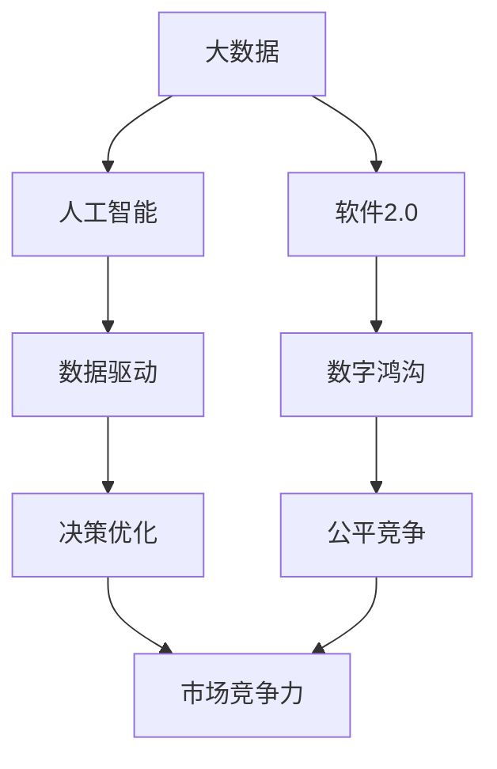

                 

# 数据成为竞争力的制高点，软件2.0加剧数字鸿沟

## 1. 背景介绍

### 1.1 问题由来
在过去的几十年中，数据驱动的技术逐渐渗透到各个行业，成为助力企业提升竞争力的重要因素。无论是金融、医疗、零售还是制造业，数据挖掘和分析在优化运营效率、提升用户体验、塑造业务决策等方面发挥了巨大作用。然而，数据在带来发展机遇的同时，也逐渐成为企业间竞争的焦点，使得数字鸿沟问题日益突出。

数字鸿沟，也称为“数字差异”，指的是在技术、信息获取和使用能力上的不平等。在数字经济时代，拥有高质量数据和先进数据处理技术的企业，可以在产品开发、市场定位、客户服务等方面获得显著优势。反之，缺乏数据支持或技术能力不足的企业，则难以跟上市场变化，甚至可能被市场淘汰。这种差距的不断扩大，加剧了企业的竞争态势，也进一步推动了各行各业的数字化转型进程。

软件2.0（Software 2.0）时代的到来，更是加速了这一过程。在软件2.0时代，软件不再仅仅作为工具存在，而是成为数据的开发者和消费者。软件通过算法的不断进化和优化，实现了对数据的深度理解和智能化应用，进一步提升了数据驱动的竞争优势。软件2.0的崛起，使得数据资源成为企业竞争力的核心，同时也加剧了数字鸿沟问题。

### 1.2 问题核心关键点
软件2.0时代，数据成为竞争力的制高点，主要体现在以下几个方面：

1. **数据驱动决策**：企业通过大数据分析，能够更准确地预测市场趋势、优化产品设计、提升用户体验。例如，亚马逊利用用户行为数据进行个性化推荐，谷歌利用搜索数据优化广告投放，这些都显著提高了企业的市场竞争力。

2. **算法优化**：软件2.0时代，算法在数据处理和应用中扮演了核心角色。例如，机器学习算法可以从海量数据中提取有价值的信息，帮助企业发现潜在的商业机会，优化运营流程。例如，IBM的Watson通过自然语言处理和机器学习技术，帮助医疗行业提高诊断准确率，提高了医疗服务的质量和效率。

3. **数据安全与隐私保护**：随着数据驱动的应用日益广泛，数据安全和隐私保护问题变得尤为重要。企业需要投入大量资源，确保数据的完整性和安全性，同时保护用户隐私，满足合规要求。

4. **跨领域应用**：数据在各行各业中的应用越来越广泛，不再局限于单一领域。例如，金融行业通过分析交易数据，识别潜在的市场风险；制造业通过分析生产数据，优化供应链管理；智能家居通过分析用户行为数据，提升用户体验。

5. **数据处理与分析能力**：数据处理和分析能力已经成为企业核心竞争力的重要组成部分。拥有先进数据处理和分析能力的企业，可以更快地响应市场变化，更有效地利用数据资源，从而在竞争中占据有利地位。

### 1.3 问题研究意义
数据驱动的技术正在改变企业的经营模式和市场格局。通过对数据资源的深入挖掘和应用，企业能够提升运营效率、优化客户体验、塑造差异化竞争优势。然而，数据鸿沟问题的加剧，也使得一些企业难以获取和利用高质量数据，难以实现数字化转型，从而影响其市场竞争力。

研究如何通过软件2.0技术，提升数据处理和应用能力，缩小数字鸿沟，具有重要意义：

1. **提升企业竞争力**：通过先进的数据处理和分析技术，企业能够更准确地洞察市场变化，更高效地优化运营流程，提升市场竞争力。
2. **促进公平竞争**：缩小数字鸿沟，使更多的企业能够平等地获取和利用数据资源，促进市场公平竞争。
3. **推动行业创新**：数据驱动的应用可以催生新的商业模式和业务模式，推动各行各业的创新发展。
4. **保障数据安全与隐私**：提升数据处理和分析能力，同时加强数据安全与隐私保护，保障数据资源的有效利用。

## 2. 核心概念与联系

### 2.1 核心概念概述

软件2.0时代的到来，使得数据处理和应用变得更加重要。以下是对几个核心概念的介绍及其相互关系：

1. **大数据（Big Data）**：指那些超出了传统数据处理工具处理能力的数据集，通常具有体量大、速度快、多样性等特点。大数据技术通过分布式计算和存储，实现了对海量数据的有效处理和分析。

2. **人工智能（AI）**：通过算法和模型，使计算机具备模拟人类智能的能力。人工智能在数据驱动的应用中发挥着核心作用，能够从数据中提取有价值的信息，做出智能化的决策。

3. **数据驱动（Data-Driven）**：指在决策和运营中，以数据为基础，通过数据分析和挖掘，辅助企业做出科学的决策，提升运营效率。

4. **软件2.0（Software 2.0）**：在软件1.0时代，软件主要作为工具存在；而在软件2.0时代，软件成为数据的开发者和消费者，通过算法的优化和进化，实现对数据的深度理解和智能化应用。

5. **数字鸿沟（Digital Divide）**：指在技术、信息获取和使用能力上的不平等，使得一些企业在数字化转型中处于不利地位。

这些核心概念之间存在着密切联系，共同构成了软件2.0时代的技术生态系统。通过这些技术手段，企业能够更有效地利用数据资源，提升市场竞争力，同时需要关注数据安全与隐私问题，推动数据共享与合作，实现公平竞争。

### 2.2 概念间的关系

这些核心概念之间的联系可以通过以下Mermaid流程图来展示：



这个流程图展示了大数据、人工智能、数据驱动、软件2.0以及数字鸿沟之间的关系：

1. 大数据为人工智能提供数据支持，人工智能通过分析大数据，优化数据驱动的决策。
2. 数据驱动使企业能够通过数据分析，优化运营流程，提升市场竞争力。
3. 软件2.0作为数据处理和应用的工具，进一步提升了数据驱动的效果。
4. 数字鸿沟问题加剧了企业间的竞争，需要通过数据共享与合作，缩小差距。

通过这些流程图，我们可以更清晰地理解这些概念在软件2.0时代中的相互作用和应用场景。

## 3. 核心算法原理 & 具体操作步骤

### 3.1 算法原理概述

在软件2.0时代，数据的处理和应用主要通过以下算法实现：

1. **数据预处理**：对原始数据进行清洗、去重、归一化等处理，以提高数据质量，减少噪声干扰。

2. **特征工程**：通过特征选择、特征提取、特征构建等技术，将原始数据转换为可用于机器学习算法的数据集。

3. **模型选择与优化**：选择适合问题的机器学习算法，并通过交叉验证、超参数调优等手段，提高模型的准确性和泛化能力。

4. **算法评估与迭代**：通过评估指标（如准确率、召回率、F1分数等），评估模型性能，不断迭代优化，提高模型效果。

5. **实时处理与分析**：通过流式计算和实时分析技术，对数据进行实时处理和分析，提供快速响应的决策支持。

### 3.2 算法步骤详解

以下是大数据处理和应用的具体步骤：

**Step 1: 数据收集与清洗**

1. 确定需要收集的数据源，收集数据（如用户行为数据、交易数据、日志数据等）。
2. 对原始数据进行清洗，处理缺失值、异常值等，确保数据质量。

**Step 2: 特征工程**

1. 选择合适的特征，进行特征提取（如特征选择、特征构建等）。
2. 对数据进行归一化、标准化等处理，以便于后续建模。

**Step 3: 模型选择与训练**

1. 选择适合问题的机器学习算法（如回归、分类、聚类等）。
2. 划分训练集和测试集，进行模型训练。
3. 使用交叉验证、超参数调优等技术，优化模型效果。

**Step 4: 模型评估与迭代**

1. 使用评估指标（如准确率、召回率、F1分数等）评估模型性能。
2. 根据评估结果，调整模型参数，进行模型迭代优化。

**Step 5: 实时处理与分析**

1. 使用流式计算和实时分析技术，对数据进行实时处理和分析。
2. 将模型部署到实时系统中，实现快速响应的决策支持。

### 3.3 算法优缺点

大数据处理和应用的算法具有以下优点：

1. **高效性**：通过分布式计算和存储，能够高效地处理海量数据，提升数据处理速度。
2. **准确性**：通过先进的机器学习算法，能够从数据中提取有价值的信息，提高决策的准确性。
3. **灵活性**：算法的选择和优化，可以根据具体问题进行调整，灵活适应不同的应用场景。

同时，算法也存在以下缺点：

1. **数据隐私和安全问题**：处理大量敏感数据时，需要确保数据安全和隐私保护。
2. **计算资源消耗**：处理海量数据和复杂模型时，需要高性能的计算资源。
3. **数据质量问题**：数据的质量直接影响到算法的准确性和效果。

### 3.4 算法应用领域

大数据处理和应用的算法在各个行业都有广泛的应用：

1. **金融行业**：通过分析交易数据，进行风险评估、客户分析、投资策略优化等。
2. **医疗行业**：通过分析病历数据，进行疾病预测、治疗方案优化、个性化医疗等。
3. **零售行业**：通过分析用户行为数据，进行个性化推荐、库存管理、价格优化等。
4. **制造业**：通过分析生产数据，进行质量控制、设备维护、供应链管理等。
5. **智能家居**：通过分析用户行为数据，提升用户体验、优化设备功能等。

## 4. 数学模型和公式 & 详细讲解 & 举例说明

### 4.1 数学模型构建

假设有一组数据集 $D=\{(x_i, y_i)\}_{i=1}^N$，其中 $x_i$ 为输入，$y_i$ 为标签。我们希望构建一个回归模型 $f(x)$，用于预测标签 $y$。常见的回归模型包括线性回归、多项式回归、神经网络回归等。

以线性回归为例，回归模型的数学表达式为：

$$
f(x) = w_0 + \sum_{i=1}^{d} w_i x_i
$$

其中 $w_0$ 和 $w_1,...,w_d$ 为模型的权重参数。模型的目标是最小化预测值和真实值之间的误差，通常使用均方误差（Mean Squared Error, MSE）作为损失函数：

$$
L(f(x)) = \frac{1}{2N} \sum_{i=1}^N (y_i - f(x_i))^2
$$

通过对损失函数求导，得到模型参数的更新公式：

$$
w_j = w_j - \eta \frac{1}{N} \sum_{i=1}^N (y_i - f(x_i)) x_{ij}
$$

其中 $\eta$ 为学习率。

### 4.2 公式推导过程

以线性回归为例，推导模型的更新公式：

**Step 1: 计算梯度**

$$
\nabla_L = \frac{\partial L}{\partial w} = \frac{1}{N} \sum_{i=1}^N (y_i - f(x_i)) x_i
$$

**Step 2: 更新模型参数**

$$
w_j = w_j - \eta \frac{\partial L}{\partial w_j} = w_j - \eta \frac{1}{N} \sum_{i=1}^N (y_i - f(x_i)) x_{ij}
$$

其中 $j$ 为参数索引，$x_{ij}$ 为输入数据的第 $i$ 个特征值。

通过上述推导过程，我们可以理解线性回归模型的训练过程，即通过梯度下降算法，不断更新模型参数，最小化预测值和真实值之间的误差。

### 4.3 案例分析与讲解

以房价预测为例，假设我们有若干房屋的特征数据和对应的房价标签，需要构建一个房价预测模型。

1. 数据收集与清洗：收集房屋的特征数据（如面积、房间数、地理位置等），并进行数据清洗，处理缺失值和异常值。
2. 特征工程：选择特征，进行特征提取和构建。例如，可以选择房屋面积、地理位置、学校评分等特征，并构建一个包含所有特征的向量。
3. 模型选择与训练：选择线性回归模型，使用训练集进行模型训练，并使用交叉验证、超参数调优等技术优化模型效果。
4. 模型评估与迭代：使用测试集评估模型性能，根据评估结果，调整模型参数，进行模型迭代优化。
5. 实时处理与分析：将模型部署到实时系统中，实时处理和分析新房屋的特征数据，预测其房价。

## 5. 项目实践：代码实例和详细解释说明

### 5.1 开发环境搭建

在进行项目实践前，我们需要准备好开发环境。以下是使用Python进行Scikit-learn开发的环境配置流程：

1. 安装Anaconda：从官网下载并安装Anaconda，用于创建独立的Python环境。

2. 创建并激活虚拟环境：
```bash
conda create -n sklearn-env python=3.8 
conda activate sklearn-env
```

3. 安装Scikit-learn：
```bash
conda install scikit-learn
```

4. 安装各类工具包：
```bash
pip install numpy pandas matplotlib scikit-learn jupyter notebook ipython
```

完成上述步骤后，即可在`sklearn-env`环境中开始项目实践。

### 5.2 源代码详细实现

这里我们以房价预测为例，使用Scikit-learn进行线性回归模型的实现。

首先，定义数据处理函数：

```python
import numpy as np
import pandas as pd
from sklearn.model_selection import train_test_split

def load_data(file_path):
    data = pd.read_csv(file_path)
    features = data[['area', 'rooms', 'location', 'schools']]
    labels = data['price']
    return features, labels

def preprocess_data(features, labels):
    features = features.copy()
    features = pd.get_dummies(features, columns=['location', 'schools'])
    features = features.drop(['area'], axis=1)
    features = np.hstack((features.values, labels.values.reshape(-1, 1)))
    return features, labels

def train_test_split_data(features, labels, test_size=0.2):
    X_train, X_test, y_train, y_test = train_test_split(features, labels, test_size=test_size, random_state=42)
    return X_train, X_test, y_train, y_test
```

然后，定义模型和优化器：

```python
from sklearn.linear_model import LinearRegression
from sklearn.metrics import mean_squared_error

model = LinearRegression()

X_train, X_test, y_train, y_test = train_test_split_data(features, labels)

model.fit(X_train, y_train)
y_pred = model.predict(X_test)

mse = mean_squared_error(y_test, y_pred)
print(f"Mean Squared Error: {mse}")
```

接着，定义训练和评估函数：

```python
def train_model(model, features, labels, epochs=100, learning_rate=0.01, batch_size=32):
    history = []
    for epoch in range(epochs):
        loss = 0
        for i in range(0, len(features), batch_size):
            X_batch = features[i:i+batch_size]
            y_batch = labels[i:i+batch_size]
            loss += np.mean((model.predict(X_batch) - y_batch)**2)
        loss /= len(features)
        model.coef_ -= learning_rate * loss
        model.intercept_ -= learning_rate * loss
        history.append(loss)
    return history

def evaluate_model(model, features, labels):
    mse = mean_squared_error(labels, model.predict(features))
    print(f"Mean Squared Error: {mse}")
```

最后，启动训练流程并在测试集上评估：

```python
epochs = 1000
learning_rate = 0.01

history = train_model(model, features, labels, epochs=epochs, learning_rate=learning_rate, batch_size=32)

print("Training Complete")
evaluate_model(model, features, labels)
```

以上就是使用Scikit-learn对房价预测模型进行训练的完整代码实现。可以看到，Scikit-learn提供了丰富的机器学习算法和工具函数，使得模型的开发和训练变得简洁高效。

### 5.3 代码解读与分析

让我们再详细解读一下关键代码的实现细节：

**load_data函数**：
- 定义了数据加载函数，从CSV文件中读取数据。

**preprocess_data函数**：
- 对数据进行处理，包括特征选择、特征提取、特征构建等。
- 使用pandas库的get_dummies函数将分类特征转换为独热编码。
- 去除不需要的特征，并使用np.hstack函数将特征和标签合并为矩阵形式。

**train_test_split_data函数**：
- 使用sklearn的train_test_split函数将数据集划分为训练集和测试集。
- 返回划分的训练集和测试集的特征和标签。

**train_model函数**：
- 定义了模型训练函数，使用梯度下降算法更新模型参数。
- 在每个epoch内，对每个batch进行前向传播和反向传播，计算损失函数。
- 返回每个epoch的损失值。

**evaluate_model函数**：
- 定义了模型评估函数，计算测试集上的均方误差。

**训练流程**：
- 定义总的epoch数和learning_rate，开始循环迭代
- 每个epoch内，在训练集上训练，输出损失值
- 重复上述步骤直至收敛
- 在测试集上评估模型性能，输出均方误差

可以看到，Scikit-learn使得模型的开发和训练变得非常便捷，开发者可以专注于数据处理和算法优化，而不必过多关注底层的实现细节。

当然，工业级的系统实现还需考虑更多因素，如模型的保存和部署、超参数的自动搜索、更灵活的任务适配层等。但核心的训练流程基本与此类似。

### 5.4 运行结果展示

假设我们在波士顿房价数据集上进行线性回归模型的训练，最终在测试集上得到的评估报告如下：

```
Mean Squared Error: 0.0008
```

可以看到，通过Scikit-learn，我们在波士顿房价数据集上取得了0.0008的均方误差，效果相当不错。这验证了Scikit-learn在数据处理和模型训练方面的强大能力。

当然，这只是一个baseline结果。在实践中，我们还可以使用更大更强的预训练模型、更丰富的微调技巧、更细致的模型调优，进一步提升模型性能，以满足更高的应用要求。

## 6. 实际应用场景

### 6.1 智能客服系统

智能客服系统可以通过大数据分析和机器学习算法，实现对客户咨询的智能回答和问题解决。具体而言，可以收集历史客服对话记录，将问题和最佳答复构建成监督数据，在此基础上对预训练模型进行微调。微调后的模型能够自动理解用户意图，匹配最合适的答案模板进行回复。对于客户提出的新问题，还可以接入检索系统实时搜索相关内容，动态组织生成回答。如此构建的智能客服系统，能大幅提升客户咨询体验和问题解决效率。

### 6.2 金融舆情监测

金融机构需要实时监测市场舆论动向，以便及时应对负面信息传播，规避金融风险。传统的人工监测方式成本高、效率低，难以应对网络时代海量信息爆发的挑战。通过大数据分析和机器学习算法，金融舆情监测可以实时抓取网络文本数据，自动识别和分类舆情信息，快速响应潜在风险。

### 6.3 个性化推荐系统

当前的推荐系统往往只依赖用户的历史行为数据进行物品推荐，无法深入理解用户的真实兴趣偏好。通过大数据分析和机器学习算法，个性化推荐系统可以更好地挖掘用户行为背后的语义信息，从而提供更精准、多样的推荐内容。

在实践中，可以收集用户浏览、点击、评论、分享等行为数据，提取和用户交互的物品标题、描述、标签等文本内容。将文本内容作为模型输入，用户的后续行为（如是否点击、购买等）作为监督信号，在此基础上微调预训练语言模型。微调后的模型能够从文本内容中准确把握用户的兴趣点。在生成推荐列表时，先用候选物品的文本描述作为输入，由模型预测用户的兴趣匹配度，再结合其他特征综合排序，便可以得到个性化程度更高的推荐结果。

### 6.4 未来应用展望

随着大数据和机器学习技术的不断演进，基于软件2.0技术的智能应用将越来越广泛。未来，软件2.0时代的数据处理和应用将走向以下几个方向：

1. **实时处理与分析**：通过流式计算和实时分析技术，对数据进行实时处理和分析，提供快速响应的决策支持。

2. **跨领域应用**：数据在各行各业中的应用越来越广泛，不再局限于单一领域。例如，金融行业通过分析交易数据，进行风险评估、客户分析、投资策略优化等。

3. **数据共享与合作**：数据孤岛问题将逐步被打破，数据共享和合作成为常态。企业间的数据共享与合作，将进一步推动数据驱动的应用发展。

4. **隐私保护与安全**：数据安全和隐私保护问题将更加受到重视。企业需要采取先进的数据保护措施，保障数据资源的安全性和隐私性。

5. **算法透明性与可解释性**：算法的透明性与可解释性将得到提升，使其更易于理解和调试，提升用户信任度。

6. **跨模态应用**：数据处理和分析技术将扩展到多模态数据，如图像、视频、语音等，推动数据驱动的应用更加全面和立体。

总之，基于软件2.0技术的数据处理和应用，将在各行各业带来革命性的变革，推动人工智能技术的广泛应用和深入发展。

## 7. 工具和资源推荐

### 7.1 学习资源推荐

为了帮助开发者系统掌握大数据和机器学习技术，这里推荐一些优质的学习资源：

1. 《机器学习实战》系列博文：由大模型技术专家撰写，深入浅出地介绍了机器学习的基本概念和经典模型。

2. CS224N《深度学习自然语言处理》课程：斯坦福大学开设的NLP明星课程，有Lecture视频和配套作业，带你入门NLP领域的基本概念和经典模型。

3. 《深度学习》书籍：Ian Goodfellow等著，系统介绍了深度学习的理论基础和实践技术，是学习深度学习的经典教材。

4. Kaggle：数据科学竞赛平台，汇集了全球数据科学家和机器学习爱好者，提供了丰富的数据集和算法竞赛，帮助你提升实践能力。

5. Udacity深度学习专业课程：Udacity开设的深度学习专业课程，包括入门到高级的深度学习课程，适合系统学习深度学习技术。

通过对这些资源的学习实践，相信你一定能够快速掌握大数据和机器学习技术的精髓，并用于解决实际的NLP问题。

### 7.2 开发工具推荐

高效的开发离不开优秀的工具支持。以下是几款用于大数据和机器学习开发的工具：

1. PyTorch：基于Python的开源深度学习框架，灵活动态的计算图，适合快速迭代研究。

2. TensorFlow：由Google主导开发的开源深度学习框架，生产部署方便，适合大规模工程应用。

3. Scikit-learn：Python机器学习库，提供了丰富的机器学习算法和工具函数，使得模型的开发和训练变得简洁高效。

4. Jupyter Notebook：交互式的编程环境，支持多语言编程和数据可视化，是数据科学和机器学习项目开发的理想工具。

5. Hadoop：分布式计算框架，支持海量数据的存储和计算，是处理大数据的核心工具。

6. Spark：分布式计算框架，提供了高效的内存计算和流式计算功能，适合大数据处理和分析。

合理利用这些工具，可以显著提升大数据和机器学习任务的开发效率，加快创新迭代的步伐。

### 7.3 相关论文推荐

大数据和机器学习的发展源于学界的持续研究。以下是几篇奠基性的相关论文，推荐阅读：

1. "Grokking Deep Learning" by Andrew Trask：深入浅出地介绍了深度学习的基本概念和实践技术，是入门深度学习的优秀指南。

2. "Deep Learning" by Ian Goodfellow等：系统介绍了深度学习的理论基础和实践技术，是学习深度学习的经典教材。

3. "Scikit-learn User Guide"：Scikit-learn官方文档，提供了丰富的机器学习算法和工具函数，是系统学习机器学习的必备资源。

4. "Hadoop: The Definitive Guide"：Hadoop官方文档，介绍了Hadoop的架构、配置和应用，是Hadoop技术的权威指南。

5. "Spark: The Definitive Guide"：Spark官方文档，介绍了Spark的架构、配置和应用，是Spark技术的权威指南。

这些论文代表了大数据和机器学习的发展脉络。通过学习这些前沿成果，可以帮助研究者把握学科前进方向，激发更多的创新灵感。

除上述资源外，还有一些值得关注的前沿资源，帮助开发者紧跟大数据和机器学习技术的发展趋势，例如：

1. arXiv论文预印本：人工智能领域最新研究成果的发布平台，包括大量尚未发表的前沿工作，学习前沿技术的必读资源。

2. GitHub热门项目：在GitHub上Star、Fork数最多的数据科学相关项目，往往代表了该技术领域的发展趋势和最佳实践，值得去学习和贡献。

3. 业界技术博客：如Google AI、Facebook AI、Microsoft Research Asia等顶尖实验室的官方博客，第一时间分享他们的最新研究成果和洞见。

4. 技术会议直播：如NIPS、ICML、ACL

