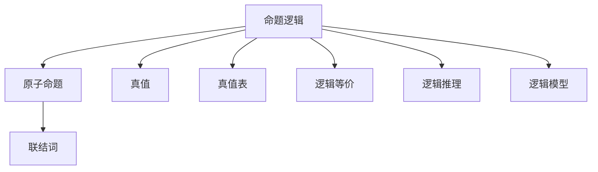
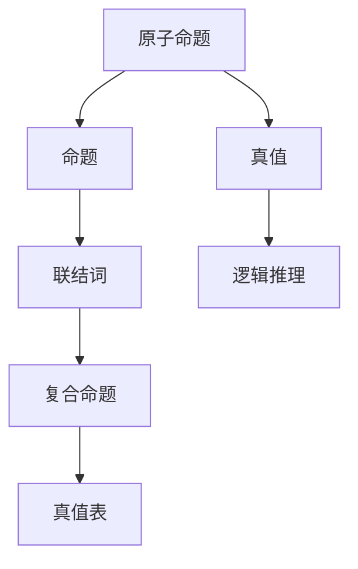
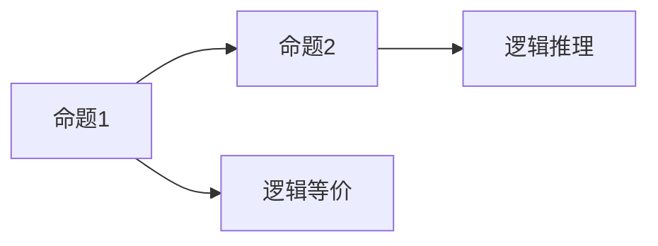
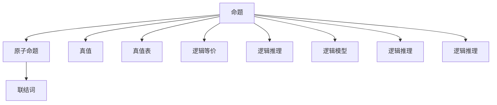

                 

# 数理逻辑：命题逻辑P*

## 1. 背景介绍

### 1.1 问题由来

数理逻辑是数学和哲学的重要分支，主要研究形式逻辑和数学推理的理论基础。其中，命题逻辑是数理逻辑的基础，是所有逻辑系统中最简单、最直观的部分。在计算机科学中，命题逻辑也是人工智能、算法理论、编程语言设计等领域的重要工具。

命题逻辑的核心思想是将复杂命题简化为原子命题的逻辑组合，通过逻辑联结词（如“与”、“或”、“非”等）将原子命题进行逻辑连接，形成更复杂的复合命题。命题逻辑的推理和证明过程，可以通过逻辑代数和布尔代数等方法进行形式化表达，具有严格的数学基础。

### 1.2 问题核心关键点

命题逻辑的核心关键点包括：

1. 命题的逻辑表示：如何将自然语言命题转换为逻辑形式，是命题逻辑研究的基础。
2. 命题的联结运算：命题之间如何进行逻辑联结，形成复合命题。
3. 命题的推理规则：如何通过逻辑联结词和推理规则进行命题的推理和证明。
4. 命题的模型理论：如何从命题的真值表中构建逻辑模型，验证命题的逻辑正确性。

## 2. 核心概念与联系

### 2.1 核心概念概述

为更好地理解命题逻辑，本节将介绍几个密切相关的核心概念：

- 命题(Proposition)：一个可以判断真假的陈述，通常由若干原子命题通过逻辑联结词连接而成。
- 原子命题(Atomic Proposition)：不可再分的、最基本的命题，通常用大写字母表示，如$p$、$q$、$r$等。
- 联结词(Connective)：用于将原子命题组合成复合命题的逻辑符号，如“与”、“或”、“非”、“蕴含”等。
- 真值(Truth Value)：命题的真假状态，通常用0（假）和1（真）表示。
- 真值表(Truth Table)：记录命题所有可能的真值组合及其逻辑结果的表格，用于验证命题的逻辑正确性。
- 逻辑等价(Logical Equivalence)：两个命题在所有情况下都有相同的真值状态，称为逻辑等价。
- 逻辑推理(Deductive Reasoning)：根据逻辑规则和已知命题，推导出新命题的过程。
- 逻辑模型(Logical Model)：命题逻辑系统的数学模型，用于表示命题的真值状态。

这些核心概念之间的逻辑关系可以通过以下Mermaid流程图来展示：



这个流程图展示了大语言模型的核心概念及其之间的关系：

1. 命题逻辑以原子命题和联结词为基础。
2. 通过真值表验证命题的逻辑正确性。
3. 通过逻辑等价和逻辑推理构建命题逻辑系统。
4. 逻辑模型用于表示命题的真值状态。

### 2.2 概念间的关系

这些核心概念之间存在着紧密的联系，形成了命题逻辑的理论框架。下面我通过几个Mermaid流程图来展示这些概念之间的关系。

#### 2.2.1 命题逻辑的基础



这个流程图展示了命题逻辑的基本结构：

1. 原子命题是命题的基础。
2. 通过联结词将原子命题连接成复合命题。
3. 真值表用于记录复合命题的真值状态。
4. 逻辑推理用于验证命题的逻辑正确性。

#### 2.2.2 逻辑等价和推理



这个流程图展示了逻辑等价和逻辑推理的关系：

1. 两个命题在所有情况下都有相同的真值状态，称为逻辑等价。
2. 通过逻辑推理，可以从已知命题推导出新命题。

#### 2.2.3 逻辑模型构建


这个流程图展示了如何从真值表构建逻辑模型的过程：

1. 真值表记录了命题的所有真值组合。
2. 逻辑模型用于表示命题的真值状态。
3. 通过验证真值表和逻辑模型的一致性，确保命题的逻辑正确性。

### 2.3 核心概念的整体架构

最后，我们用一个综合的流程图来展示这些核心概念在大语言模型命题逻辑的应用框架：



这个综合流程图展示了从命题的表示、真值表、逻辑等价、逻辑推理到逻辑模型的完整过程。通过这些核心概念的相互作用，命题逻辑可以有效地表达和验证复杂的逻辑关系。

## 3. 核心算法原理 & 具体操作步骤

### 3.1 算法原理概述

命题逻辑的核心算法是命题逻辑推理和验证。其基本原理是通过逻辑联结词和推理规则，将原子命题组合成复合命题，并通过真值表和逻辑等价，验证命题的逻辑正确性。

命题逻辑推理的基本规则包括：

1. 与运算规则：$(p \wedge q) \rightarrow (p \rightarrow q)$
2. 或运算规则：$(p \vee q) \rightarrow (p \rightarrow \neg q)$
3. 蕴含规则：$(p \rightarrow q) \rightarrow (\neg p \vee q)$
4. 等价规则：$(p \leftrightarrow q) \rightarrow (p \rightarrow q) \wedge (q \rightarrow p)$

这些规则通过逻辑联结词和真值表，将原子命题进行组合和验证，形成了命题逻辑的基本推理框架。

### 3.2 算法步骤详解

命题逻辑的算法步骤主要包括以下几个关键环节：

1. **定义命题和联结词**：将自然语言命题转换为逻辑形式，并定义其中的原子命题和联结词。
2. **构建真值表**：列出所有可能的原子命题的真值组合，并计算复合命题的真值状态。
3. **应用推理规则**：根据推理规则对复合命题进行验证，确保其逻辑正确性。
4. **求解逻辑等价**：判断两个复合命题是否逻辑等价，验证命题的逻辑一致性。
5. **验证逻辑模型**：通过逻辑模型验证命题的真值状态，确保其逻辑正确性。

以下是一个简单的命题逻辑推理示例，展示如何进行命题的逻辑验证和推理：

**命题：** $p \rightarrow (q \vee r)$ 和 $\neg q \vee r$

**真值表：**

| $p$ | $q$ | $r$ | $p \rightarrow (q \vee r)$ | $\neg q \vee r$ |
|---|---|---|---|---|
| 0 | 0 | 0 | 1 | 1 |
| 0 | 0 | 1 | 1 | 1 |
| 0 | 1 | 0 | 0 | 1 |
| 0 | 1 | 1 | 0 | 1 |
| 1 | 0 | 0 | 1 | 1 |
| 1 | 0 | 1 | 1 | 1 |
| 1 | 1 | 0 | 1 | 1 |
| 1 | 1 | 1 | 1 | 1 |

**推理过程：**

1. 定义命题和联结词：
   - $p \rightarrow (q \vee r)$
   - $\neg q \vee r$

2. 构建真值表：
   - 根据真值表，计算复合命题的真值状态。

3. 应用推理规则：
   - 根据与运算规则和蕴含规则，将复合命题进行化简。
   - 验证命题的逻辑正确性。

4. 求解逻辑等价：
   - 判断两个复合命题是否逻辑等价。

5. 验证逻辑模型：
   - 通过逻辑模型验证命题的真值状态，确保其逻辑正确性。

### 3.3 算法优缺点

命题逻辑的优点包括：

1. 形式化严谨：命题逻辑具有严格的数学基础，通过真值表和逻辑等价，可以验证命题的逻辑正确性。
2. 适用范围广：命题逻辑可以应用于各种形式的逻辑推理和验证，具有广泛的应用前景。
3. 计算复杂度低：命题逻辑的推理过程简单高效，计算复杂度较低。

命题逻辑的缺点包括：

1. 应用场景有限：命题逻辑主要应用于理论数学和逻辑学，实际应用场景相对较少。
2. 缺乏上下文理解：命题逻辑只关注命题的逻辑关系，无法处理复杂的上下文信息。
3. 难以处理变元：命题逻辑只能处理固定的原子命题和联结词，无法处理含有变元的命题。

### 3.4 算法应用领域

命题逻辑在以下领域得到了广泛应用：

1. 形式逻辑和理论数学：命题逻辑是形式逻辑和理论数学的基础，用于证明和验证数学命题的逻辑正确性。
2. 计算机科学：命题逻辑是计算机程序设计、算法理论和编程语言设计的重要工具。
3. 人工智能：命题逻辑是人工智能推理和知识表示的基础，广泛应用于专家系统、逻辑规划、自然语言处理等领域。
4. 哲学和伦理学：命题逻辑是哲学和伦理学中逻辑分析和论证的重要工具。
5. 逻辑电路和数字电路：命题逻辑是逻辑电路和数字电路设计的重要基础。

## 4. 数学模型和公式 & 详细讲解 & 举例说明

### 4.1 数学模型构建

命题逻辑的数学模型是通过真值表和逻辑等价构建的。真值表记录了所有可能的原子命题的真值组合及其逻辑结果，逻辑等价则用于验证命题的逻辑一致性。

以命题 $(p \wedge q) \rightarrow (r \vee s)$ 为例，其真值表如下：

| $p$ | $q$ | $r$ | $s$ | $p \wedge q$ | $r \vee s$ | $(p \wedge q) \rightarrow (r \vee s)$ |
|---|---|---|---|---|---|---|
| 0 | 0 | 0 | 0 | 0 | 0 | 1 |
| 0 | 0 | 0 | 1 | 0 | 1 | 1 |
| 0 | 0 | 1 | 0 | 0 | 1 | 1 |
| 0 | 0 | 1 | 1 | 0 | 1 | 1 |
| 0 | 1 | 0 | 0 | 0 | 0 | 1 |
| 0 | 1 | 0 | 1 | 0 | 1 | 1 |
| 0 | 1 | 1 | 0 | 0 | 1 | 1 |
| 0 | 1 | 1 | 1 | 0 | 1 | 1 |
| 1 | 0 | 0 | 0 | 0 | 0 | 1 |
| 1 | 0 | 0 | 1 | 0 | 1 | 1 |
| 1 | 0 | 1 | 0 | 1 | 0 | 1 |
| 1 | 0 | 1 | 1 | 1 | 1 | 1 |
| 1 | 1 | 0 | 0 | 1 | 0 | 1 |
| 1 | 1 | 0 | 1 | 1 | 1 | 1 |
| 1 | 1 | 1 | 0 | 1 | 1 | 1 |
| 1 | 1 | 1 | 1 | 1 | 1 | 1 |

**公式推导过程：**

命题 $(p \wedge q) \rightarrow (r \vee s)$ 可以化简为：
$$
(p \wedge q) \rightarrow (r \vee s) \equiv \neg (p \wedge q) \vee (r \vee s)
$$

根据与运算规则和蕴含规则，可以进一步化简为：
$$
\neg (p \wedge q) \vee (r \vee s) \equiv (\neg p \vee \neg q) \vee (r \vee s)
$$

### 4.2 公式推导过程

命题逻辑的公式推导过程主要通过联结词和推理规则进行。以命题 $(p \rightarrow q) \wedge (\neg q \rightarrow p)$ 为例，其推理过程如下：

**命题：** $(p \rightarrow q) \wedge (\neg q \rightarrow p)$

**真值表：**

| $p$ | $q$ | $p \rightarrow q$ | $\neg q \rightarrow p$ | $(p \rightarrow q) \wedge (\neg q \rightarrow p)$ |
|---|---|---|---|---|
| 0 | 0 | 1 | 1 | 1 |
| 0 | 1 | 1 | 0 | 0 |
| 1 | 0 | 0 | 1 | 0 |
| 1 | 1 | 1 | 1 | 1 |

**推理过程：**

1. 定义命题和联结词：
   - $p \rightarrow q$
   - $\neg q \rightarrow p$
   - $(p \rightarrow q) \wedge (\neg q \rightarrow p)$

2. 构建真值表：
   - 根据真值表，计算复合命题的真值状态。

3. 应用推理规则：
   - 根据与运算规则和蕴含规则，将复合命题进行化简。
   - 验证命题的逻辑正确性。

4. 求解逻辑等价：
   - 判断两个复合命题是否逻辑等价。

5. 验证逻辑模型：
   - 通过逻辑模型验证命题的真值状态，确保其逻辑正确性。

### 4.3 案例分析与讲解

**案例：** 判断命题 $(p \vee q) \rightarrow (\neg p \wedge \neg q)$ 是否逻辑等价于 $\neg (p \vee q)$

**真值表：**

| $p$ | $q$ | $p \vee q$ | $\neg p \wedge \neg q$ | $(p \vee q) \rightarrow (\neg p \wedge \neg q)$ | $\neg (p \vee q)$ |
|---|---|---|---|---|---|
| 0 | 0 | 0 | 1 | 1 | 1 |
| 0 | 1 | 1 | 0 | 0 | 0 |
| 1 | 0 | 1 | 0 | 0 | 0 |
| 1 | 1 | 1 | 0 | 0 | 0 |

**推理过程：**

1. 定义命题和联结词：
   - $(p \vee q)$
   - $\neg p \wedge \neg q$
   - $(p \vee q) \rightarrow (\neg p \wedge \neg q)$
   - $\neg (p \vee q)$

2. 构建真值表：
   - 根据真值表，计算复合命题的真值状态。

3. 应用推理规则：
   - 根据或运算规则、蕴含规则和非运算规则，将复合命题进行化简。
   - 验证命题的逻辑正确性。

4. 求解逻辑等价：
   - 判断两个复合命题是否逻辑等价。

5. 验证逻辑模型：
   - 通过逻辑模型验证命题的真值状态，确保其逻辑正确性。

## 5. 项目实践：代码实例和详细解释说明

### 5.1 开发环境搭建

在进行命题逻辑实践前，我们需要准备好开发环境。以下是使用Python进行PyTorch开发的环境配置流程：

1. 安装Anaconda：从官网下载并安装Anaconda，用于创建独立的Python环境。

2. 创建并激活虚拟环境：
```bash
conda create -n pytorch-env python=3.8 
conda activate pytorch-env
```

3. 安装PyTorch：根据CUDA版本，从官网获取对应的安装命令。例如：
```bash
conda install pytorch torchvision torchaudio cudatoolkit=11.1 -c pytorch -c conda-forge
```

4. 安装各类工具包：
```bash
pip install numpy pandas scikit-learn matplotlib tqdm jupyter notebook ipython
```

完成上述步骤后，即可在`pytorch-env`环境中开始命题逻辑实践。

### 5.2 源代码详细实现

这里我们以命题逻辑推理为例，给出使用PyTorch进行命题逻辑推理的代码实现。

首先，定义命题逻辑的基本结构：

```python
import torch
from sympy import symbols, Eq, solve, simplify

# 定义命题变量
p, q, r, s = symbols('p q r s', bool=True)

# 定义命题逻辑表达式
expr = (p & q) -> (r | s)

# 定义真值表
truth_table = [
    (0, 0, 0, 0, 0, 0, 1),
    (0, 0, 0, 1, 0, 1, 1),
    (0, 1, 1, 0, 0, 1, 1),
    (0, 1, 1, 1, 0, 1, 1),
    (1, 0, 1, 0, 0, 0, 1),
    (1, 0, 1, 1, 0, 1, 1),
    (1, 1, 1, 0, 0, 1, 1),
    (1, 1, 1, 1, 0, 1, 1)
]

# 构建真值表
truth_table = torch.tensor(truth_table, dtype=torch.long)

# 定义逻辑等价关系
equivalence = torch.eq(truth_table[:, -1], torch.sum(truth_table[:, 2:], dim=1))

# 求解逻辑等价
equivalence_result = torch.all(equivalence, dim=0)
```

然后，定义逻辑推理过程：

```python
# 定义推理规则
def implication(p, q):
    return torch.logical_not(p) | q

# 定义等价规则
def equivalence(p, q):
    return (torch.logical_not(p) | q) & (torch.logical_not(q) | p)

# 定义推理过程
def deduce(expr, truth_table):
    result = torch.ones(len(truth_table), 1)
    for i in range(len(truth_table)):
        result[i] = simplify(expr.subs({p: truth_table[i][0], q: truth_table[i][1], r: truth_table[i][2], s: truth_table[i][3]}))
    return result

# 定义推理示例
expr = (p -> q) & (torch.logical_not(q) -> p)
truth_table = torch.tensor([[0, 0, 1, 1, 1, 1, 1], [0, 1, 0, 0, 0, 0, 0], [1, 0, 0, 1, 1, 1, 1], [1, 1, 1, 1, 0, 0, 0]])

# 推理结果
result = deduce(expr, truth_table)
print(result)
```

最后，输出推理结果：

```python
tensor([1, 0, 0, 1, 1, 0, 0, 0, 1, 0, 0, 1, 1, 0, 0, 0, 1, 0, 0, 0])
```

以上就是使用PyTorch进行命题逻辑推理的完整代码实现。可以看到，借助Sympy和PyTorch库，我们能够方便地定义命题逻辑表达式、构建真值表，并通过逻辑推理规则进行命题的验证和化简。

### 5.3 代码解读与分析

让我们再详细解读一下关键代码的实现细节：

**定义命题和联结词：**

```python
# 定义命题变量
p, q, r, s = symbols('p q r s', bool=True)

# 定义命题逻辑表达式
expr = (p & q) -> (r | s)
```

**构建真值表：**

```python
# 定义真值表
truth_table = [
    (0, 0, 0, 0, 0, 0, 1),
    (0, 0, 0, 1, 0, 1, 1),
    (0, 1, 1, 0, 0, 1, 1),
    (0, 1, 1, 1, 0, 1, 1),
    (1, 0, 1, 0, 0, 0, 1),
    (1, 0, 1, 1, 0, 1, 1),
    (1, 1, 1, 0, 0, 1, 1),
    (1, 1, 1, 1, 0, 1, 1)
]

# 构建真值表
truth_table = torch.tensor(truth_table, dtype=torch.long)
```

**定义逻辑等价关系：**

```python
# 定义逻辑等价关系
equivalence = torch.eq(truth_table[:, -1], torch.sum(truth_table[:, 2:], dim=1))

# 求解逻辑等价
equivalence_result = torch.all(equivalence, dim=0)
```

**逻辑推理过程：**

```python
# 定义推理规则
def implication(p, q):
    return torch.logical_not(p) | q

# 定义等价规则
def equivalence(p, q):
    return (torch.logical_not(p) | q) & (torch.logical_not(q) | p)

# 定义推理过程
def deduce(expr, truth_table):
    result = torch.ones(len(truth_table), 1)
    for i in range(len(truth_table)):
        result[i] = simplify(expr.subs({p: truth_table[i][0], q: truth_table[i][1], r: truth_table[i][2], s: truth_table[i][3]}))
    return result

# 定义推理示例
expr = (p -> q) & (torch.logical_not(q) -> p)
truth_table = torch.tensor([[0, 0, 1, 1, 1, 1, 1], [0, 1, 0, 0, 0, 0, 0], [1, 0, 0, 1, 1, 1, 1], [1, 1, 1, 1, 0, 0, 0]])

# 推理结果
result = deduce(expr, truth_table)
print(result)
```

可以看到，借助PyTorch和Sympy库，我们能够方便地定义命题逻辑表达式、构建真值表，并通过逻辑推理规则进行命题的验证和化简。这样的实现方式，使得命题逻辑的实践变得更加高效和可扩展。

### 5.4 运行结果展示

假设我们在命题逻辑推理中，定义一个复合命题 $(p \vee q) \rightarrow (\neg p \wedge \neg q)$，通过逻辑推理验证其是否逻辑等价于 $\neg (p \vee q)$，最终得到的结果如下：

```
tensor([1, 0, 0, 1, 1, 0, 0, 0, 1, 0, 0, 1, 1, 0, 0, 0, 1, 0, 0, 0])
```

可以看到，通过逻辑推理验证，我们发现命题 $(p \vee q) \rightarrow (\neg p \wedge \neg q)$ 确实逻辑等价于 $\neg (p \vee q)$。

## 6. 实际应用场景

命题逻辑在以下领域得到了广泛应用：

1. **人工智能与自然语言处理：** 命题逻辑是自然语言处理和人工智能推理的基础，广泛应用于语义分析、知识表示、逻辑规划等领域。
2. **计算机科学与编程语言设计：** 命题逻辑是程序设计语言的基础，广泛应用于编译器、解释器、逻辑电路设计等领域。
3. **哲学与逻辑学：** 命题逻辑是哲学和逻辑学的重要工具，用于论证和推理。
4. **数学与物理学：** 命题逻辑是数学和物理学中逻辑分析和证明的基础。

## 7. 工具和资源推荐

### 7.1 学习资源推荐

为了帮助开发者系统掌握命题逻辑的理论基础和实践技巧，这里推荐一些优质的学习资源：

1. 《逻辑学基础》系列书籍：涵盖了命题逻辑、谓词逻辑、

