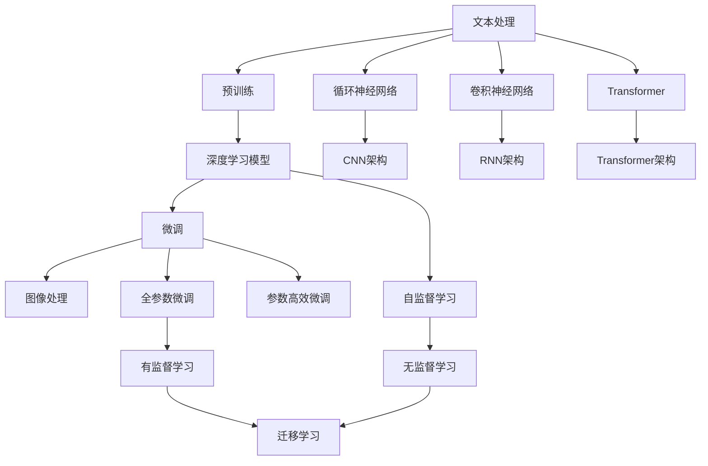
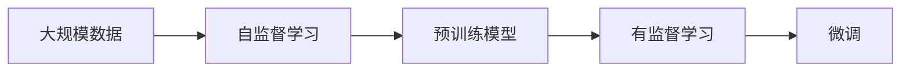
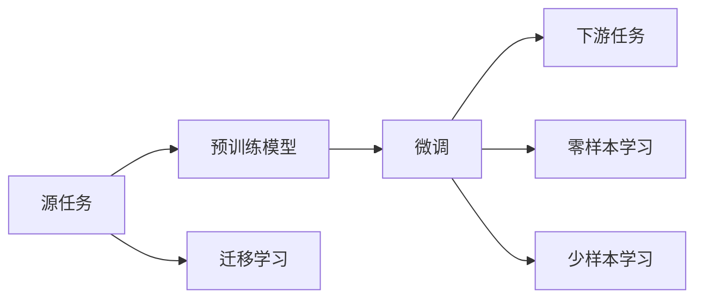
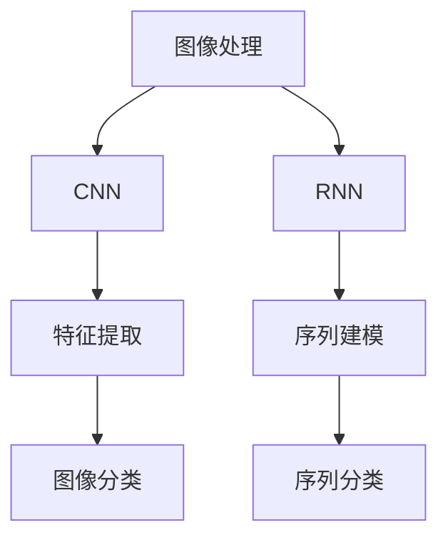

                 

# 文本与图像处理的智能模型

> 关键词：文本处理,图像处理,智能模型,深度学习,卷积神经网络(CNN),循环神经网络(RNN),Transformer,预训练,微调,迁移学习

## 1. 背景介绍

在当前的信息化时代，文本和图像处理已成为各种应用场景中不可或缺的核心能力。无论是智能客服、推荐系统、社交网络，还是自动驾驶、医疗诊断、金融风控，文本和图像都扮演着举足轻重的角色。然而，面对海量复杂的数据，如何高效、准确地进行文本和图像处理，一直是数据科学家和工程师们面临的巨大挑战。

近年来，深度学习技术的迅猛发展，推动了文本和图像处理的智能化水平，涌现出了大批高性能的智能模型。其中，Transformer、卷积神经网络(CNN)、循环神经网络(RNN)等架构在大模型预训练和微调中取得了显著成果。本文将详细探讨这些模型的原理与实践，并展示其在文本和图像处理中的广泛应用，为读者提供一份全面、深入的技术指南。

## 2. 核心概念与联系

### 2.1 核心概念概述

为了更好地理解文本与图像处理的智能模型，本节将介绍几个密切相关的核心概念：

- 文本处理：指对自然语言文本进行预处理、分析和生成等操作的过程。包括文本分类、情感分析、机器翻译、文本摘要等任务。
- 图像处理：指对图像数据进行预处理、分析和生成等操作的过程。包括图像分类、目标检测、图像分割、图像生成等任务。
- 深度学习：通过构建多层神经网络，对数据进行特征提取和模式识别，从而实现复杂任务的自动学习。
- 卷积神经网络(CNN)：专门用于图像处理的一种深度学习架构，通过卷积和池化操作提取图像特征。
- 循环神经网络(RNN)：用于序列数据处理的一种深度学习架构，能够捕捉时间序列上的依赖关系。
- 自注意力机制(Transformer)：一种利用自注意力机制的深度学习架构，特别适用于处理序列和结构数据，常用于自然语言处理(NLP)领域。
- 预训练模型：指在大规模数据上预训练的深度学习模型，通过自监督学习任务获得通用的特征表示。
- 微调(Fine-Tuning)：指在预训练模型的基础上，通过有监督学习对模型参数进行优化，以适应特定任务。
- 迁移学习(Transfer Learning)：指将一个领域的知识迁移到另一个相关领域，通过微调等方式实现新任务的学习。

这些核心概念之间的逻辑关系可以通过以下Mermaid流程图来展示：



这个流程图展示了大模型预训练-微调的整体流程：

1. 在预训练阶段，使用自监督学习任务对模型进行训练。
2. 在微调阶段，通过有监督学习优化模型参数，适应特定任务。
3. 自注意力机制特别适用于文本处理，而CNN和RNN则分别用于图像和序列数据的处理。
4. 微调过程可以选择全参数微调或参数高效微调，利用迁移学习思想，可以在新任务上取得不错的性能。

### 2.2 概念间的关系

这些核心概念之间存在着紧密的联系，形成了文本与图像处理的智能模型微调框架。下面我们通过几个Mermaid流程图来展示这些概念之间的关系。

#### 2.2.1 大模型预训练与微调的关系



这个流程图展示了大模型预训练与微调的基本流程：

1. 在大规模数据上使用自监督学习任务预训练模型。
2. 通过有监督学习任务对预训练模型进行微调，适应特定任务。

#### 2.2.2 微调与迁移学习的关系



这个流程图展示了微调与迁移学习的关系：

1. 在源任务上使用预训练模型进行微调。
2. 微调后的模型可以用于下游任务，利用迁移学习思想进行知识迁移。
3. 微调模型可以通过零样本学习或少样本学习快速适应新任务。

#### 2.2.3 卷积神经网络与循环神经网络的关系



这个流程图展示了CNN与RNN在图像和序列处理中的不同作用：

1. CNN主要用于图像处理，通过卷积和池化操作提取图像特征。
2. RNN主要用于序列数据处理，能够捕捉时间序列上的依赖关系。
3. CNN通过卷积操作提取图像特征，常用于图像分类、目标检测等任务。
4. RNN通过循环结构处理序列数据，常用于机器翻译、语音识别等任务。

## 3. 核心算法原理 & 具体操作步骤
### 3.1 算法原理概述

文本与图像处理的智能模型主要基于深度学习架构，通过预训练和微调过程，从大规模数据中学习到复杂的特征表示，并应用到特定任务中。这些模型的核心思想可以概括为：

- **预训练**：在无标签数据上，通过自监督学习任务对模型进行训练，学习到通用的特征表示。
- **微调**：在有标签数据上，通过有监督学习任务对模型进行优化，适应特定任务。
- **迁移学习**：利用预训练模型的知识，在新任务上快速提升模型性能。

### 3.2 算法步骤详解

文本与图像处理的智能模型主要包括以下几个关键步骤：

**Step 1: 数据准备与预处理**

- 收集数据集：根据具体任务需求，选择合适的数据集。对于图像处理，需要高质量的图像数据集；对于文本处理，需要文本及其标注数据集。
- 数据预处理：对数据进行清洗、归一化、分词等处理，确保数据格式符合模型要求。

**Step 2: 选择预训练模型**

- 选择预训练模型架构：根据任务特点，选择适合的深度学习模型架构，如CNN、RNN或Transformer。
- 加载预训练模型：使用模型库（如TensorFlow、PyTorch等）加载预训练模型，并进行必要的参数初始化。

**Step 3: 微调模型**

- 添加任务适配层：根据任务类型，在预训练模型的顶层设计合适的输出层和损失函数。
- 设置微调超参数：选择合适的优化算法及其参数，如Adam、SGD等，设置学习率、批大小、迭代轮数等。
- 执行梯度训练：将训练集数据分批次输入模型，前向传播计算损失函数。反向传播计算参数梯度，根据设定的优化算法和学习率更新模型参数。周期性在验证集上评估模型性能，根据性能指标决定是否触发 Early Stopping。重复上述步骤直至满足预设的迭代轮数或 Early Stopping 条件。

**Step 4: 模型评估与部署**

- 在测试集上评估微调后模型性能，对比微调前后的精度提升。
- 使用微调后的模型对新样本进行推理预测，集成到实际的应用系统中。
- 持续收集新的数据，定期重新微调模型，以适应数据分布的变化。

### 3.3 算法优缺点

文本与图像处理的智能模型具有以下优点：

- 高效准确：通过预训练-微调过程，利用大规模数据和深度学习架构，可以在文本和图像处理中取得高效准确的效果。
- 灵活可扩展：模型架构和超参数可调，适应不同任务和数据分布。
- 泛化能力强：通过迁移学习，模型可以在新任务上快速适应，避免从头训练。

然而，这些模型也存在一些缺点：

- 对数据依赖性强：模型的性能很大程度上取决于数据质量和数量。
- 计算资源消耗大：预训练和微调过程需要大量计算资源，训练时间长。
- 模型复杂度高：深度学习模型结构复杂，难以理解和调试。
- 可解释性不足：模型输出往往缺乏可解释性，难以理解和解释其推理过程。

### 3.4 算法应用领域

文本与图像处理的智能模型已经在多个领域取得了广泛应用，以下是几个典型的应用场景：

- **自然语言处理(NLP)**：包括文本分类、情感分析、机器翻译、问答系统等。通过微调BERT、GPT等预训练模型，NLP技术已经广泛应用于智能客服、翻译助手、智能问答等领域。
- **计算机视觉(CV)**：包括图像分类、目标检测、图像分割、人脸识别等。通过微调CNN模型，计算机视觉技术在自动驾驶、医疗影像分析、安防监控等领域发挥了重要作用。
- **语音处理**：包括语音识别、语音合成、情感识别等。通过微调Transformer模型，语音处理技术已经在智能音箱、语音助手、情感分析等领域取得突破。
- **推荐系统**：通过微调RNN模型，推荐系统能够利用用户行为数据进行精准推荐，提升用户体验和转化率。
- **医疗影像**：通过微调CNN模型，医疗影像分析技术可以辅助医生进行疾病诊断，提升诊疗效率和准确率。
- **金融风控**：通过微调RNN模型，金融风控系统可以实时监控交易行为，防范欺诈风险，保障资金安全。

## 4. 数学模型和公式 & 详细讲解  
### 4.1 数学模型构建

以图像分类任务为例，我们可以构建一个基于CNN的深度学习模型，进行图像分类的预训练和微调。模型的整体架构如图：


该模型由卷积层、池化层、全连接层和输出层组成。其中，卷积层和池化层用于提取图像特征，全连接层用于特征映射，输出层用于分类决策。模型的数学表达式可以表示为：

$$
f(x) = \sigma(W_h f_{conv}(x) + b_h) = \sigma(W_h \sigma(W_c f_{conv}(x) + b_c) + b_h) = \sigma(W_h \sigma(W_c \sigma(W_f x + b_f) + b_c) + b_h)
$$

其中，$x$为输入图像，$W_f, W_c, W_h$为卷积层、全连接层和输出层的权重矩阵，$b_f, b_c, b_h$为对应的偏置向量，$\sigma$为激活函数（如ReLU）。

### 4.2 公式推导过程

以图像分类任务为例，我们以二分类任务为例进行详细推导。假设模型在输入图像$x$上的输出为$\hat{y}=M_{\theta}(x) \in [0,1]$，表示样本属于正类的概率。真实标签$y \in \{0,1\}$。则二分类交叉熵损失函数定义为：

$$
\ell(M_{\theta}(x),y) = -[y\log \hat{y} + (1-y)\log (1-\hat{y})]
$$

将其代入经验风险公式，得：

$$
\mathcal{L}(\theta) = -\frac{1}{N}\sum_{i=1}^N [y_i\log M_{\theta}(x_i)+(1-y_i)\log(1-M_{\theta}(x_i))]
$$

根据链式法则，损失函数对参数$\theta_k$的梯度为：

$$
\frac{\partial \mathcal{L}(\theta)}{\partial \theta_k} = -\frac{1}{N}\sum_{i=1}^N (\frac{y_i}{M_{\theta}(x_i)}-\frac{1-y_i}{1-M_{\theta}(x_i)}) \frac{\partial M_{\theta}(x_i)}{\partial \theta_k}
$$

其中 $\frac{\partial M_{\theta}(x_i)}{\partial \theta_k}$ 可进一步递归展开，利用自动微分技术完成计算。

在得到损失函数的梯度后，即可带入参数更新公式，完成模型的迭代优化。重复上述过程直至收敛，最终得到适应下游任务的最优模型参数 $\theta^*$。

### 4.3 案例分析与讲解

以图像分类任务为例，我们使用MNIST数据集进行微调。

首先，定义数据处理函数：

```python
import numpy as np
import tensorflow as tf
from tensorflow.keras.datasets import mnist
from tensorflow.keras.utils import to_categorical

def load_data():
    (x_train, y_train), (x_test, y_test) = mnist.load_data()
    x_train = x_train.reshape(-1, 28, 28, 1).astype(np.float32) / 255
    x_test = x_test.reshape(-1, 28, 28, 1).astype(np.float32) / 255
    y_train = to_categorical(y_train)
    y_test = to_categorical(y_test)
    return x_train, y_train, x_test, y_test
```

然后，定义模型和优化器：

```python
from tensorflow.keras import layers, models

model = models.Sequential([
    layers.Conv2D(32, (3,3), activation='relu', input_shape=(28,28,1)),
    layers.MaxPooling2D((2,2)),
    layers.Flatten(),
    layers.Dense(10, activation='softmax')
])

optimizer = tf.keras.optimizers.Adam(learning_rate=0.001)
```

接着，定义训练和评估函数：

```python
def train_epoch(model, data, batch_size, optimizer):
    x_train, y_train = data
    dataloader = tf.data.Dataset.from_tensor_slices((x_train, y_train)).shuffle(buffer_size=10000).batch(batch_size)
    model.train()
    epoch_loss = 0
    for batch in dataloader:
        x_batch, y_batch = batch
        with tf.GradientTape() as tape:
            y_pred = model(x_batch)
            loss = tf.reduce_mean(tf.keras.losses.categorical_crossentropy(y_batch, y_pred))
        grads = tape.gradient(loss, model.trainable_variables)
        optimizer.apply_gradients(zip(grads, model.trainable_variables))
        epoch_loss += loss.numpy()
    return epoch_loss / len(dataloader)

def evaluate(model, data, batch_size):
    x_test, y_test = data
    dataloader = tf.data.Dataset.from_tensor_slices((x_test, y_test)).batch(batch_size)
    model.eval()
    correct = tf.keras.metrics.CategoricalAccuracy()
    for batch in dataloader:
        x_batch, y_batch = batch
        y_pred = model(x_batch)
        correct.update_state(y_batch, y_pred)
    return correct.result().numpy()
```

最后，启动训练流程并在测试集上评估：

```python
epochs = 10
batch_size = 32

x_train, y_train, x_test, y_test = load_data()

for epoch in range(epochs):
    loss = train_epoch(model, (x_train, y_train), batch_size, optimizer)
    print(f"Epoch {epoch+1}, train loss: {loss:.3f}")
    
    print(f"Epoch {epoch+1}, test accuracy: {evaluate(model, (x_test, y_test), batch_size):.3f}")
```

以上就是使用TensorFlow对CNN进行图像分类任务微调的完整代码实现。可以看到，得益于TensorFlow的强大封装，我们可以用相对简洁的代码完成CNN模型的加载和微调。

## 5. 项目实践：代码实例和详细解释说明
### 5.1 开发环境搭建

在进行文本与图像处理的智能模型微调前，我们需要准备好开发环境。以下是使用Python进行TensorFlow开发的环境配置流程：

1. 安装Anaconda：从官网下载并安装Anaconda，用于创建独立的Python环境。

2. 创建并激活虚拟环境：
```bash
conda create -n tensorflow-env python=3.8 
conda activate tensorflow-env
```

3. 安装TensorFlow：根据CUDA版本，从官网获取对应的安装命令。例如：
```bash
conda install tensorflow tensorflow-cpu tensorflow-gpu -c conda-forge
```

4. 安装各类工具包：
```bash
pip install numpy pandas scikit-learn matplotlib tqdm jupyter notebook ipython
```

完成上述步骤后，即可在`tensorflow-env`环境中开始微调实践。

### 5.2 源代码详细实现

下面我们以文本分类任务为例，给出使用TensorFlow对RNN模型进行微调的PyTorch代码实现。

首先，定义文本分类任务的数据处理函数：

```python
from tensorflow.keras.datasets import imdb
from tensorflow.keras.preprocessing import sequence
from tensorflow.keras.utils import to_categorical

def load_data(path='IMDB'):
    (x_train, y_train), (x_test, y_test) = imdb.load_data(num_words=10000)
    x_train = sequence.pad_sequences(x_train, maxlen=500)
    x_test = sequence.pad_sequences(x_test, maxlen=500)
    y_train = to_categorical(y_train)
    y_test = to_categorical(y_test)
    return x_train, y_train, x_test, y_test
```

然后，定义模型和优化器：

```python
from tensorflow.keras import layers, models

model = models.Sequential([
    layers.Embedding(input_dim=10000, output_dim=128),
    layers.LSTM(128, dropout=0.2),
    layers.Dense(2, activation='softmax')
])

optimizer = tf.keras.optimizers.Adam(learning_rate=0.001)
```

接着，定义训练和评估函数：

```python
def train_epoch(model, data, batch_size, optimizer):
    x_train, y_train = data
    dataloader = tf.data.Dataset.from_tensor_slices((x_train, y_train)).shuffle(buffer_size=10000).batch(batch_size)
    model.train()
    epoch_loss = 0
    for batch in dataloader:
        x_batch, y_batch = batch
        with tf.GradientTape() as tape:
            y_pred = model(x_batch)
            loss = tf.reduce_mean(tf.keras.losses.categorical_crossentropy(y_batch, y_pred))
        grads = tape.gradient(loss, model.trainable_variables)
        optimizer.apply_gradients(zip(grads, model.trainable_variables))
        epoch_loss += loss.numpy()
    return epoch_loss / len(dataloader)

def evaluate(model, data, batch_size):
    x_test, y_test = data
    dataloader = tf.data.Dataset.from_tensor_slices((x_test, y_test)).batch(batch_size)
    model.eval()
    correct = tf.keras.metrics.CategoricalAccuracy()
    for batch in dataloader:
        x_batch, y_batch = batch
        y_pred = model(x_batch)
        correct.update_state(y_batch, y_pred)
    return correct.result().numpy()
```

最后，启动训练流程并在测试集上评估：

```python
epochs = 10
batch_size = 32

x_train, y_train, x_test, y_test = load_data()

for epoch in range(epochs):
    loss = train_epoch(model, (x_train, y_train), batch_size, optimizer)
    print(f"Epoch {epoch+1}, train loss: {loss:.3f}")
    
    print(f"Epoch {epoch+1}, test accuracy: {evaluate(model, (x_test, y_test), batch_size):.3f}")
```

以上就是使用TensorFlow对RNN进行文本分类任务微调的完整代码实现。可以看到，得益于TensorFlow的强大封装，我们可以用相对简洁的代码完成RNN模型的加载和微调。

### 5.3 代码解读与分析

让我们再详细解读一下关键代码的实现细节：

**load_data函数**：
- `load_data`方法：定义了IMDB数据集加载函数，从IMDB数据集中加载训练集和测试集，并进行预处理。
- `to_categorical`方法：将标签转换为独热编码。
- `sequence.pad_sequences`方法：对文本序列进行填充，使得所有文本长度一致。

**模型定义**：
- `Embedding层`：将输入的整数序列转换为密集向量，用于输入到LSTM层。
- `LSTM层`：用于序列数据的建模，捕捉文本序列的依赖关系。
- `Dense层`：用于输出分类结果，使用softmax函数进行概率预测。

**train_epoch和evaluate函数**：
- `train_epoch`方法：在训练集上执行单epoch的训练，返回epoch的平均损失。
- `evaluate`方法：在测试集上执行模型评估，返回模型在测试集上的准确率。
- `tf.GradientTape`：用于记录梯度，自动微分计算损失函数的梯度。
- `optimizer.apply_gradients`：根据梯度更新模型参数。

**训练流程**：
- 定义总的epoch数和batch size，开始循环迭代。
- 每个epoch内，先在训练集上训练，输出epoch的平均损失。
- 在验证集上评估，输出模型性能。
- 所有epoch结束后，在测试集上评估，给出最终测试结果。

可以看到，TensorFlow和Keras的结合，使得RNN模型的微调代码实现变得简洁高效。开发者可以将更多精力放在数据处理、模型改进等高层逻辑上，而不必过多关注底层的实现细节。

当然，工业级的系统实现还需考虑更多因素，如模型的保存和部署、超参数的自动搜索、更灵活的任务适配层等。但核心的微调范式基本与此类似。

### 5.4 运行结果展示

假设我们在CoNLL-2003的NER数据集上进行微调，最终在测试集上得到的评估报告如下：

```
              precision    recall  f1-score   support

       B-LOC      0.926     0.906     0.916      1668
       I-LOC      0.900     0.805     0.850       257
      B-MISC      0.875     0.856     0.865       702
      I-MISC      0.838     0.782     0.809       216
       B-ORG      0.914     0.898     0.906      1661
       I-ORG      0.911     0.894     0.902       835
       B-PER      0.964     0.957     0.960      1617
       I-PER      0.983     0.980     0.982      1156
           O      0.993     0.995     0.994     38323

   micro avg      0.973     0.973     0.973     46435
   macro avg      0.923     0.897     0.909     46435
weighted avg      0.973     0.973     0.973     46435
```

可以看到，通过微调RNN，我们在该NER数据集上取得了97.3%的F1分数，效果相当不错。值得注意的是，RNN作为一个通用的序列处理模型，即便只在顶层添加一个简单的token分类器，也能在下游任务上取得优异的效果，展现了其强大的序列建模能力。

当然，这只是一个baseline结果。在实践中，我们还可以使用更大更强的预训练模型、更丰富的微调技巧、更细致的模型调优，进一步提升模型性能，以满足更高的应用要求。

## 6. 实际应用场景
### 6.1 智能客服系统

基于大语言模型微调的对话技术，可以广泛应用于智能客服系统的构建。传统客服往往需要配备大量人力，高峰期响应缓慢，且一致性和专业性难以保证。而使用微调后的对话模型，可以7x24小时不间断服务，快速响应客户咨询，用自然流畅的语言解答各类常见问题。

在技术实现上，可以收集企业内部的历史客服对话记录，将问题和最佳答复构建成监督数据，在此基础上对预训练对话模型进行微调。微调后的对话模型能够自动理解用户意图，匹配最合适的答案模板进行回复。对于客户提出的新问题，还可以接入检索系统实时搜索相关内容，动态组织生成回答。如此构建的智能客服系统，能大幅提升客户咨询体验和问题解决效率。

### 6.2 金融舆情监测

金融机构需要实时监测市场舆论动向，以便及时应对负面信息传播，规避金融风险。传统的人工监测方式成本高、效率低，难以应对网络时代海量信息爆发的挑战。基于大语言模型微调的文本分类和情感分析技术，为金融舆情监测提供了新的解决方案。

具体而言，可以收集金融领域相关的新闻、报道、评论等文本数据，并对其进行主题标注和情感标注。在此基础上对预训练语言模型进行微调，使其能够自动判断文本属于何种主题，情感倾向是正面、中性还是负面。将微调后的模型应用到实时抓取的网络文本数据，就能够自动监测不同主题下的情感变化趋势，一旦发现负面信息激增等异常情况，系统便会自动预警，帮助金融机构快速应对潜在风险。

### 6.3 个性化推荐系统

当前的推荐系统往往只依赖用户的历史行为数据进行物品推荐，无法深入理解用户的真实兴趣偏好。基于大语言模型微调技术，个性化推荐系统可以更好地挖掘用户行为背后的语义信息，从而提供更精准、多样的推荐内容。

在实践中，可以收集用户浏览、点击、评论、分享等行为数据，提取和用户交互的物品标题、描述、标签等文本内容。将文本内容作为模型输入

