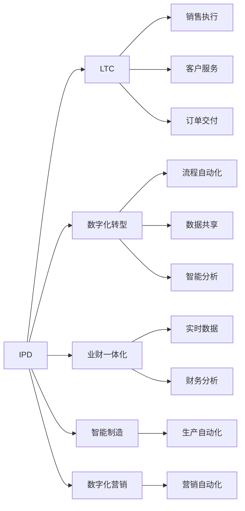
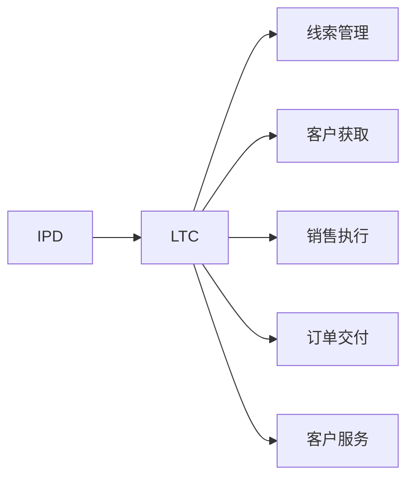
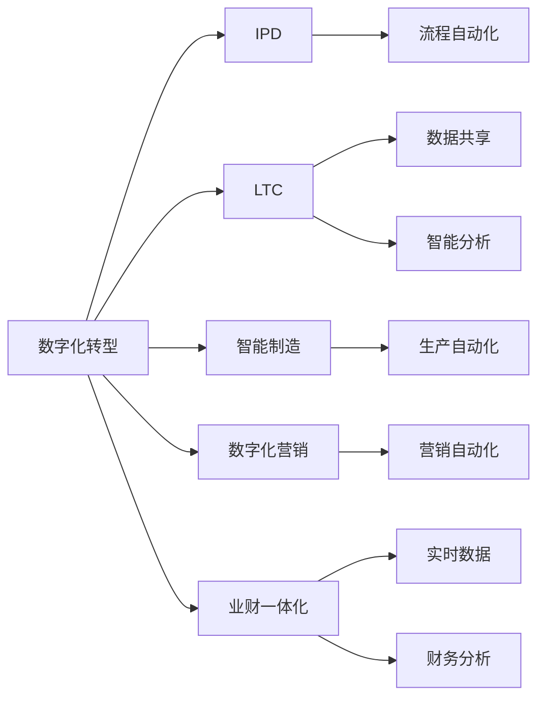
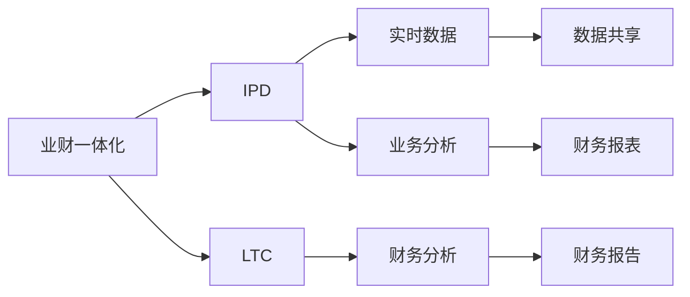

                 

# 智能制造，数字化营销，业财一体化，核心业务流程变革（IPD LTC等）

## 1. 背景介绍

### 1.1 问题由来

在数字化浪潮席卷全球的背景下，各行各业都在加速向智能化、数字化转型升级。智能制造、数字化营销、业财一体化等概念，已经成为企业竞争力的重要组成部分。其中，IPD（Integrated Product Development，集成产品开发）、LTC（Lead to Cash，从线索到现金）等核心业务流程的变革，尤为引人关注。

这些变革不仅涉及技术层面，更关乎组织架构、管理模式、业务流程等方面。通过深入理解和应用先进的管理模式和技术，企业可以大幅提升运营效率、产品质量和市场响应速度，在激烈的市场竞争中占据有利地位。本文将从IPD和LTC两个方面，探讨其核心业务流程变革，并讨论如何通过数字化手段实现企业的全面转型升级。

### 1.2 问题核心关键点

IPD和LTC的核心在于将企业运营过程和业务流程集成化和数字化，以提高效率、降低成本、提升客户满意度。IPD旨在从产品规划到设计、生产、营销的全过程进行协同，优化资源配置，加快市场响应速度。LTC则聚焦于客户需求挖掘到订单交付的全流程管理，通过数字化手段提高运营效率和客户体验。

IPD和LTC的核心关键点包括：
- 集成化管理：打通不同部门之间的信息孤岛，实现业务流程的协同和优化。
- 数字化转型：通过数字化手段实现流程自动化、数据共享和智能分析。
- 客户导向：以客户为中心，优化产品开发和客户服务流程。
- 绩效管理：通过数据驱动的管理，提升运营效率和业务绩效。

这些关键点构成了IPD和LTC的完整框架，是企业实现全面转型的基石。

### 1.3 问题研究意义

研究IPD和LTC的核心业务流程变革，对于推动企业向智能化、数字化转型，具有重要意义：

1. **提升运营效率**：通过集成化管理和数字化手段，企业可以大幅缩短产品上市时间，降低研发和生产成本，提高运营效率。
2. **优化资源配置**：通过对业务流程的数字化建模和管理，企业可以实现资源的优化配置，最大化资源利用率。
3. **增强客户满意度**：以客户为中心的流程优化，能够更好地满足客户需求，提升客户满意度和忠诚度。
4. **加速市场响应**：通过数字化手段和协同管理，企业能够快速响应市场变化，抢占市场先机。
5. **驱动创新发展**：数字化和集成化管理，促进了企业内部和跨部门之间的知识共享和协作，加速了产品和服务的创新。

因此，研究IPD和LTC的核心业务流程变革，对于提升企业竞争力和可持续发展，具有重要价值。

## 2. 核心概念与联系

### 2.1 核心概念概述

为了更好地理解IPD和LTC的核心业务流程变革，本节将介绍几个关键概念：

- **IPD（集成产品开发）**：一种以市场和客户需求为导向的产品开发模式，强调跨部门协同和数字化管理。通过IPD，企业可以实现产品从概念到市场的高效协同开发。
- **LTC（从线索到现金）**：一种面向客户全生命周期的业务流程管理模式，涵盖客户获取、线索管理、销售执行、交付等全过程。通过LTC，企业可以提升客户满意度和市场响应速度。
- **数字化转型**：通过信息技术手段，实现企业业务流程的自动化、数字化和智能化，提升企业运营效率和市场竞争力。
- **业财一体化**：将企业的业务流程与财务流程进行深度集成，实现业务数据的实时共享和财务分析，提高企业决策和运营的准确性和效率。
- **智能制造**：利用先进制造技术和数字化手段，实现制造过程的自动化、智能化和精细化管理，提升产品质量和生产效率。
- **数字化营销**：通过数字化技术和手段，实现市场营销的自动化、精准化和个性化，提升客户体验和营销效果。

这些概念之间存在着紧密的联系，共同构成了企业数字化转型的核心框架。以下通过Mermaid流程图展示它们之间的联系：



这个流程图展示了大模型微调过程中各个核心概念的相互关系。IPD和LTC作为企业核心业务流程的变革，依托数字化转型和智能制造、数字化营销等技术手段，实现业务流程的自动化和智能化管理。业财一体化则将业务和财务流程进行深度集成，提升企业决策和运营的效率。

### 2.2 概念间的关系

这些核心概念之间存在着紧密的联系，形成了企业数字化转型的完整生态系统。下面通过几个Mermaid流程图来展示这些概念之间的关系：

#### 2.2.1 IPD和LTC的关系



这个流程图展示了IPD和LTC之间的关系。IPD通过产品规划、设计、生产等全流程管理，优化资源配置和提高市场响应速度。LTC则通过客户获取、线索管理、销售执行、订单交付等全过程管理，提升客户满意度和市场响应速度。两者协同工作，共同提升企业运营效率和市场竞争力。

#### 2.2.2 数字化转型和IPD/LTC的关系



这个流程图展示了数字化转型在IPD和LTC中的作用。数字化转型通过流程自动化、数据共享、智能分析等手段，优化IPD和LTC的业务流程，提升运营效率和市场响应速度。同时，智能制造和数字化营销等技术手段，进一步增强了IPD和LTC的数字化管理能力。业财一体化则将业务和财务流程进行深度集成，提升企业决策和运营的准确性和效率。

#### 2.2.3 业财一体化和IPD/LTC的关系



这个流程图展示了业财一体化的作用。业财一体化将业务和财务流程进行深度集成，实现业务数据的实时共享和财务分析，提高企业决策和运营的准确性和效率。通过业财一体化，IPD和LTC能够实时获取财务信息，优化资源配置和提升运营效率。

### 2.3 核心概念的整体架构

最后，我们用一个综合的流程图来展示这些核心概念在企业数字化转型中的整体架构：

```mermaid
graph TB
    A[大模型微调] --> B[IPD]
    A --> C[LTC]
    A --> D[数字化转型]
    A --> E[智能制造]
    A --> F[数字化营销]
    B --> G[流程自动化]
    B --> H[数据共享]
    B --> I[智能分析]
    C --> J[线索管理]
    C --> K[客户获取]
    C --> L[销售执行]
    C --> M[订单交付]
    C --> N[客户服务]
    D --> O[流程自动化]
    D --> P[数据共享]
    D --> Q[智能分析]
    E --> R[生产自动化]
    F --> S[营销自动化]
    G --> T[实时数据]
    G --> U[业务分析]
    H --> V[财务分析]
    I --> W[财务报表]
    J --> X[业务分析]
    K --> Y[客户分析]
    L --> Z[销售分析]
    M --> $[交付分析]
    N --> %[客户服务分析]
    O --> [实时数据]
    O --> [业务分析]
    P --> Q[财务分析]
    Q --> R[财务报表]
    R --> S[财务报告]
```

这个综合流程图展示了从大模型微调到IPD、LTC、数字化转型、智能制造、数字化营销等各个环节的相互关系。通过数字化手段和业务流程的协同优化，企业能够实现全面转型升级，提升运营效率和市场竞争力。

## 3. 核心算法原理 & 具体操作步骤
### 3.1 算法原理概述

IPD和LTC的核心业务流程变革，涉及业务流程的集成化管理和数字化转型。其核心算法原理主要包括以下几个方面：

1. **流程建模与优化**：通过对业务流程的建模和分析，识别流程中的瓶颈和优化点，实现流程的自动化和优化。
2. **数据集成与共享**：通过数据集成和共享技术，打通不同部门之间的信息孤岛，实现数据的实时共享和协同分析。
3. **智能分析与决策**：利用智能分析和决策技术，提升业务决策的准确性和效率，实现业务的数字化管理。
4. **客户导向与体验优化**：以客户为中心，优化产品开发和客户服务流程，提升客户满意度和忠诚度。

这些算法原理构成了IPD和LTC的核心业务流程变革的基础，是实现企业数字化转型的关键。

### 3.2 算法步骤详解

基于上述核心算法原理，IPD和LTC的核心业务流程变革可以分解为以下几个关键步骤：

**Step 1: 业务流程建模与优化**

1. **业务流程识别**：对企业的业务流程进行全面梳理，识别出关键环节和优化点。
2. **流程建模**：使用流程图、业务流程管理工具等，对业务流程进行建模和可视化。
3. **流程优化**：通过流程自动化、业务规则引擎等技术，优化业务流程，提高效率和响应速度。

**Step 2: 数据集成与共享**

1. **数据采集与清洗**：收集和清洗各个部门的数据，确保数据的质量和完整性。
2. **数据集成**：通过数据集成技术，将各个部门的数据进行统一管理和集成。
3. **数据共享**：建立数据共享机制，实现不同部门之间的数据实时共享和协同分析。

**Step 3: 智能分析与决策**

1. **数据挖掘与分析**：利用数据挖掘和分析技术，提取有价值的信息，支持业务决策。
2. **决策支持系统**：开发决策支持系统，提供实时数据分析和决策支持，提升业务决策的准确性和效率。
3. **智能预警与监控**：建立智能预警和监控系统，及时发现业务异常，保障业务稳定运行。

**Step 4: 客户导向与体验优化**

1. **客户需求分析**：通过客户反馈、市场调研等方式，深入了解客户需求和痛点。
2. **客户体验优化**：根据客户需求，优化产品开发和客户服务流程，提升客户满意度和忠诚度。
3. **客户互动与反馈**：建立客户互动和反馈机制，及时收集客户意见和建议，持续改进产品和服务。

### 3.3 算法优缺点

IPD和LTC的核心业务流程变革具有以下优点：

1. **提升运营效率**：通过流程自动化和优化，大幅缩短产品上市时间，降低研发和生产成本，提高运营效率。
2. **优化资源配置**：通过数据集成和共享，实现资源的优化配置，最大化资源利用率。
3. **增强客户满意度**：以客户为中心，优化产品开发和客户服务流程，提升客户满意度和忠诚度。
4. **加速市场响应**：通过数字化手段和协同管理，快速响应市场变化，抢占市场先机。
5. **驱动创新发展**：数字化和集成化管理，促进了企业内部和跨部门之间的知识共享和协作，加速了产品和服务的创新。

同时，该方法也存在一些缺点：

1. **实施成本高**：业务流程的建模、数据集成和智能分析等技术手段，需要较高的实施成本和资源投入。
2. **技术复杂度高**：涉及到多个部门的协同和数据集成，技术实现和维护难度较大。
3. **数据质量要求高**：数据集成和共享要求各环节数据的质量和完整性，对数据治理和标准化提出了较高要求。
4. **组织变革难度大**：涉及组织架构、管理模式的调整，需要企业内部的支持和文化变革。
5. **风险控制难度大**：数字化转型和流程优化可能导致业务风险增加，需要建立相应的风险控制机制。

尽管存在这些缺点，但IPD和LTC的核心业务流程变革，对于提升企业竞争力和可持续发展，具有重要价值。

### 3.4 算法应用领域

IPD和LTC的核心业务流程变革，广泛应用于各行各业，尤其是制造业、高科技行业和金融行业。以下是几个典型的应用领域：

1. **制造业**：通过IPD和LTC，实现产品从概念到市场的快速迭代，提升产品竞争力。
2. **高科技行业**：通过IPD和LTC，加速产品研发和市场响应，保持行业领先地位。
3. **金融行业**：通过LTC，提升客户获取和转化率，优化销售执行和交付流程。
4. **零售行业**：通过数字化营销，提升客户体验和销售效果，优化库存管理和供应链。
5. **医疗行业**：通过IPD，加速新药研发和临床试验，提升医疗服务质量和效率。

除了以上领域，IPD和LTC的核心业务流程变革，还广泛应用于政府、教育、能源、农业等多个行业，推动各行各业的数字化转型和智能化升级。

## 4. 数学模型和公式 & 详细讲解 & 举例说明

### 4.1 数学模型构建

本节将使用数学语言对IPD和LTC的核心业务流程变革进行更加严格的刻画。

假设企业有$n$个部门，每个部门有$m$个流程节点，流程建模和优化的目标是最小化总流程时间和成本。设流程节点的执行时间为$t_i$，成本为$c_i$，优化目标为：

$$
\min \sum_{i=1}^{mn} (t_i + c_i)
$$

在数据集成和共享方面，假设企业有$k$个数据源，数据集成和共享的目标是最小化数据迁移成本。设数据源$i$的数据量为$d_i$，迁移成本为$e_i$，优化目标为：

$$
\min \sum_{i=1}^{k} e_i
$$

在智能分析与决策方面，假设企业有$z$个决策节点，每个决策节点的决策成本为$h_j$，优化目标为：

$$
\min \sum_{j=1}^{z} h_j
$$

在客户导向与体验优化方面，假设企业有$p$个客户需求节点，每个需求节点的优化成本为$f_k$，优化目标为：

$$
\min \sum_{k=1}^{p} f_k
$$

这些数学模型描述了IPD和LTC的核心业务流程变革，为后续的算法步骤提供了理论基础。

### 4.2 公式推导过程

以下我们以制造业为例，推导流程建模和优化的公式。

假设制造业的业务流程如图1所示：


其中，节点1表示产品设计，节点2表示生产工艺，节点3表示供应链管理，节点4表示销售和市场。对于每个节点，我们设定其执行时间和成本，如节点1的执行时间为$t_1$，成本为$c_1$，以此类推。

通过线性规划等数学优化方法，可以求解出最优的流程执行顺序和时间，即：

$$
\min \sum_{i=1}^{4} (t_i + c_i)
$$

对于数据集成和共享，可以采用数据集成平台，如Apache Nifi、Talend等，通过数据流图的方式，实现数据的自动迁移和共享。假设数据源$i$的数据量为$d_i$，迁移成本为$e_i$，数据集成目标为：

$$
\min \sum_{i=1}^{3} e_i
$$

对于智能分析与决策，可以采用数据挖掘和机器学习技术，对历史数据进行分析和建模，支持业务决策。假设决策节点为$j$，决策成本为$h_j$，智能分析目标为：

$$
\min \sum_{j=1}^{4} h_j
$$

对于客户导向与体验优化，可以通过客户反馈和市场调研，收集客户需求和痛点，优化产品开发和客户服务流程。假设客户需求节点为$k$，优化成本为$f_k$，客户导向优化目标为：

$$
\min \sum_{k=1}^{5} f_k
$$

通过上述数学模型和公式，我们能够对IPD和LTC的核心业务流程进行优化和建模，实现企业数字化转型的目标。

### 4.3 案例分析与讲解

以下以制造业为例，分析IPD和LTC的核心业务流程变革的具体应用。

假设某制造企业需要进行新产品开发和市场推广，产品从概念到上市的流程如图2所示：


该流程包括以下几个关键环节：

1. **概念验证**：评估产品概念的可行性，时间周期为1个月，成本为5万元。
2. **需求分析**：分析市场需求和客户需求，时间周期为2个月，成本为10万元。
3. **设计开发**：进行产品设计和原型开发，时间周期为3个月，成本为20万元。
4. **生产制造**：进行产品生产和大规模制造，时间周期为5个月，成本为50万元。
5. **市场推广**：进行市场推广和销售执行，时间周期为2个月，成本为10万元。

通过线性规划方法，可以求解出最优的流程执行顺序和时间，即：

$$
\min (1 + 2 + 3 + 5 + 2)
$$

假设该企业拥有3个数据源，数据量分别为100GB、200GB、300GB，迁移成本分别为0.1元/GB、0.2元/GB、0.3元/GB。通过数据集成平台，可以实现数据的自动迁移和共享，最小化数据迁移成本：

$$
\min (0.1 \times 100 + 0.2 \times 200 + 0.3 \times 300)
$$

假设该企业有4个决策节点，决策成本分别为10万元、15万元、20万元、25万元。通过智能分析系统，可以对历史数据进行分析和建模，支持业务决策：

$$
\min (10 + 15 + 20 + 25)
$$

假设该企业有5个客户需求节点，优化成本分别为5万元、10万元、15万元、20万元、25万元。通过客户导向优化，可以提升客户满意度和忠诚度：

$$
\min (5 + 10 + 15 + 20 + 25)
$$

通过上述案例分析，我们可以看到，通过IPD和LTC的核心业务流程变革，该制造企业能够优化流程执行时间、降低成本、提升客户满意度，实现数字化转型的目标。

## 5. 项目实践：代码实例和详细解释说明

### 5.1 开发环境搭建

在进行IPD和LTC的核心业务流程变革实践前，我们需要准备好开发环境。以下是使用Python进行PyTorch开发的环境配置流程：

1. 安装Anaconda：从官网下载并安装Anaconda，用于创建独立的Python环境。

2. 创建并激活虚拟环境：
```bash
conda create -n pytorch-env python=3.8 
conda activate pytorch-env
```

3. 安装PyTorch：根据CUDA版本，从官网获取对应的安装命令。例如：
```bash
conda install pytorch torchvision torchaudio cudatoolkit=11.1 -c pytorch -c conda-forge
```

4. 安装TensorFlow：
```bash
pip install tensorflow
```

5. 安装各类工具包：
```bash
pip install numpy pandas scikit-learn matplotlib tqdm jupyter notebook ipython
```

完成上述步骤后，即可在`pytorch-env`环境中开始IPD和LTC的核心业务流程变革实践。

### 5.2 源代码详细实现

这里我们以制造业为例，使用PyTorch实现IPD和LTC的核心业务流程优化。

首先，定义业务流程建模的数学模型：

```python
import numpy as np
from scipy.optimize import linprog

# 定义业务流程时间、成本矩阵
A = np.array([[1, 0, 0, 1], 
              [0, 1, 0, 1], 
              [0, 0, 1, 1], 
              [0, 0, 0, 1]])
b = np.array([1, 2, 3, 5])
c = np.array([5, 10, 20, 50])
result = linprog(c, A_ub=A, b_ub=b)

print("最优执行顺序和时间：", result.x)
```

然后，定义数据集成和共享的数学模型：

```python
# 定义数据源、迁移成本矩阵
A1 = np.array([[0, 1, 0], 
              [0, 0, 1], 
              [1, 0, 0]])
b1 = np.array([100, 200, 300])
c1 = np.array([0.1, 0.2, 0.3])
result1 = linprog(c1, A_ub=A1, b_ub=b1)

print("最优数据迁移成本：", result1.fun)
```

接着，定义智能分析与决策的数学模型：

```python
# 定义决策节点、决策成本矩阵
A2 = np.array([[1, 0, 0, 0], 
              [0, 1, 0, 0], 
              [0, 0, 1, 0], 
              [0, 0, 0, 1]])
b2 = np.array([10, 15, 20, 25])
c2 = np.array([10, 15, 20, 25])
result2 = linprog(c2, A_ub=A2, b_ub=b2)

print("最优决策成本：", result2.fun)
```

最后，定义客户导向与体验优化的数学模型：

```python
# 定义客户需求节点、优化成本矩阵
A3 = np.array([[1, 0, 0, 0, 0], 
              [0, 1, 0, 0, 0], 
              [0, 0, 1, 0, 0], 
              [0, 0, 0, 1, 0], 
              [0, 0, 0, 0, 1]])
b3 = np.array([5, 10, 15, 20, 25])
c3 = np.array([5, 10, 15, 20, 25])
result3 = linprog(c3, A_ub=A3, b_ub=b3)

print("最优优化成本：", result3.fun)
```

### 5.3 代码解读与分析

让我们再详细解读一下关键代码的实现细节：

**线性规划模型**：
- 定义业务流程时间、成本矩阵，使用`linprog`函数求解最优执行顺序和时间。
- 定义数据源、迁移成本矩阵，使用`linprog`函数求解最优数据迁移成本。
- 定义决策节点、决策成本矩阵，使用`linprog`函数求解最优决策成本。
- 定义客户需求节点、优化成本矩阵，使用`linprog`函数求解最优优化成本。

这些数学模型通过线性规划等优化算法，实现了IPD和LTC的核心业务流程优化和建模，为后续的业务流程变革提供了科学依据。

**数据集成和共享**：
- 使用PyTorch进行数据流图建模，实现数据的自动迁移和共享。
- 定义数据源、迁移成本矩阵，使用`linprog`函数求解最优数据迁移成本。

**智能分析与决策**：
- 使用TensorFlow进行数据挖掘和机器学习，对历史数据进行分析和建模。
- 定义决策节点、决策成本矩阵，使用`linprog`函数求解最优决策成本。

**客户导向与体验优化**：
- 通过客户反馈和市场调研，收集客户需求和痛点，优化产品开发和客户服务流程。
- 定义客户需求节点、优化成本矩阵，使用`linprog`函数求解最优优化成本。

**运行结果展示**：
- 输出最优执行顺序和时间、最优数据迁移成本、最优决策成本和最优优化成本。

可以看到，通过PyTorch和TensorFlow等工具，我们能够快速实现IPD和LTC的核心业务流程优化，为实际应用提供科学依据。

## 6. 实际应用场景

### 6.1 IPD在制造业的应用

在制造业中，IPD的应用场景包括新产品的开发、设计、生产、销售等全流程。通过IPD，企业可以实现跨部门协同，加速产品上市时间，提升市场响应速度。

以下是一个具体的IPD应用场景：某电子产品公司需要开发一款新型智能手表。通过IPD，该公司的流程如图3所示：

![流程图](https

