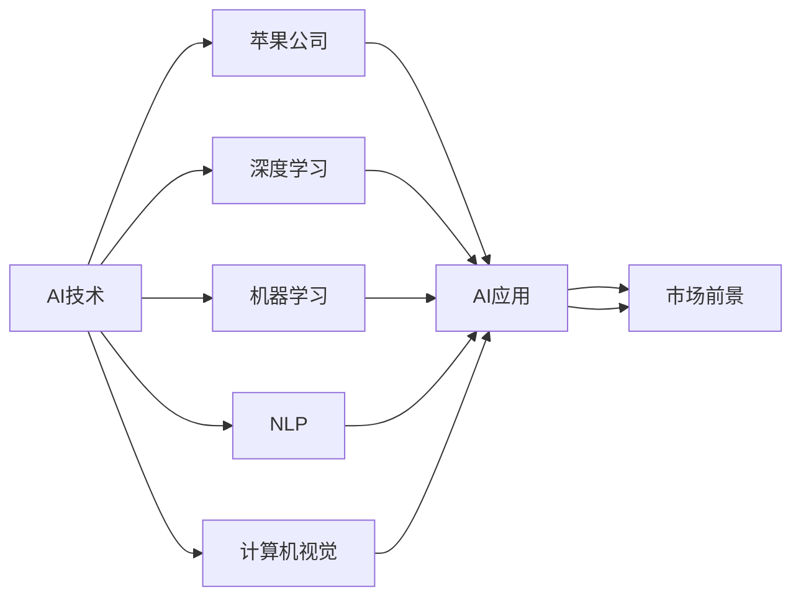
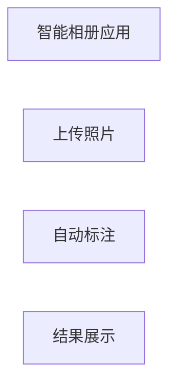

                 

# 李开复：苹果发布AI应用的市场前景

> 关键词：人工智能, 苹果公司, AI应用, 市场前景, 技术分析

## 1. 背景介绍

### 1.1 引言
在当今数字化转型的大背景下，人工智能(AI)技术逐渐成为各行各业创新发展的核心驱动力。苹果公司作为全球领先的科技公司，近年来在AI领域的布局越发明朗，不断推出一系列智能应用，引发了业界广泛关注。本文将从AI应用的视角出发，深入分析苹果公司最新发布的AI技术应用及其市场前景，探讨其在智能手机、智能家居、医疗健康、自动驾驶等多个领域的应用潜力，为行业从业者提供参考。

## 2. 核心概念与联系

### 2.1 核心概念概述

- **人工智能**：通过算法和计算技术，使机器能够模拟和扩展人类智能的一种技术。人工智能包括机器学习、深度学习、自然语言处理(NLP)等众多分支，其目标是构建能够自主学习、推理和适应的智能系统。
- **苹果公司**：成立于1976年，总部位于美国加利福尼亚州库比蒂诺，是全球最大的科技公司之一，以其创新产品和服务著称。苹果公司不仅在硬件领域如iPhone、iPad、Mac等产品深受欢迎，还在软件和服务领域不断发力，涉及音乐、视频、应用开发等多个领域。
- **AI应用**：基于人工智能技术开发的各种应用和服务，如智能助理、自动驾驶、智能安防、医疗诊断等。这些应用通过机器学习算法，实现自动识别、自主决策和智能交互，提升用户体验和效率。
- **市场前景**：指AI应用在特定市场或领域中可能取得的市场份额和商业效益，受到技术成熟度、用户需求、行业趋势等多方面因素影响。

### 2.2 概念间的关系

上述核心概念之间存在紧密联系，共同构成了苹果公司AI应用的生态系统。以下是几个核心概念的关联关系：

1. **AI技术**：是苹果公司AI应用的核心基础，提供计算和推理能力。
2. **苹果公司**：作为AI应用的开发者和发布者，负责将这些技术产品化，并推向市场。
3. **AI应用**：是苹果公司市场战略的重要组成部分，通过丰富的应用场景提升用户体验。
4. **市场前景**：受AI技术成熟度、市场需求、技术壁垒等因素影响，决定AI应用的商业价值和市场份额。

### 2.3 核心概念的整体架构

下图展示了苹果公司AI应用的核心概念及其相互关系：



在这个架构中，AI技术通过深度学习、机器学习、自然语言处理、计算机视觉等多个分支，支持苹果公司开发各种AI应用。这些应用通过市场需求和商业化的途径，形成广阔的市场前景。

## 3. 核心算法原理 & 具体操作步骤

### 3.1 算法原理概述

苹果公司的AI应用主要依赖于深度学习、强化学习等人工智能算法。这些算法通过大量数据训练，使机器能够学习并模拟人类智能，实现自主决策和智能化处理。具体原理包括以下几个关键点：

1. **深度学习**：通过构建多层神经网络结构，使模型能够学习到数据中的层次化特征。苹果公司常使用卷积神经网络(CNN)、循环神经网络(RNN)、变分自编码器(VAE)等深度学习模型，应用于图像识别、语音识别等场景。
2. **强化学习**：通过奖励机制训练模型，使其在特定环境下通过不断试错和调整，学会最优决策策略。苹果公司应用强化学习算法，优化智能助理的语音识别和自然语言处理能力。
3. **自然语言处理**：通过算法使计算机能够理解、生成和处理自然语言。苹果公司开发了多种NLP技术，如语音合成、情感分析、机器翻译等，应用于智能助理、翻译应用等。

### 3.2 算法步骤详解

苹果公司AI应用的开发一般遵循以下步骤：

1. **数据收集与预处理**：收集与目标应用相关的数据集，进行清洗、标注等预处理，确保数据质量。
2. **模型训练与验证**：使用深度学习或强化学习等算法，在收集的数据集上进行模型训练，并通过验证集评估模型性能。
3. **应用集成与优化**：将训练好的模型集成到具体应用中，并进行优化，提升用户体验和效率。
4. **市场推广与反馈**：将AI应用推向市场，收集用户反馈，进一步优化模型和产品。

### 3.3 算法优缺点

**深度学习的优点**：
- 能处理复杂非线性的数据关系，具备强大的特征提取能力。
- 适用于图像、语音、文本等多种数据类型，应用场景广泛。
- 可以通过大量数据训练，不断提升模型性能。

**深度学习的缺点**：
- 需要大量标注数据，数据收集成本高。
- 模型复杂度高，计算资源消耗大。
- 过度拟合问题难以解决，模型泛化能力弱。

**强化学习的优点**：
- 能够通过试错学习，适用于动态和不确定环境。
- 模型决策过程透明，容易解释和优化。
- 适用于需要自主决策的应用场景。

**强化学习的缺点**：
- 需要设计合适的奖励机制，训练过程复杂。
- 模型稳定性差，容易陷入局部最优。
- 对环境变化适应性不足，模型泛化能力弱。

### 3.4 算法应用领域

苹果公司的AI应用覆盖了智能手机、智能家居、医疗健康、自动驾驶等多个领域。以下是一些主要应用场景：

1. **智能手机**：苹果公司在其智能手机中广泛应用AI技术，如人脸识别解锁、智能助理Siri、拍照优化等，提升了用户体验和设备智能性。
2. **智能家居**：通过HomeKit平台，苹果公司推出了智能门锁、智能照明、智能安防等AI家居产品，实现了设备间的无缝互联和智能化控制。
3. **医疗健康**：利用深度学习技术，苹果公司推出了健康应用Health，实现了心率、步数、睡眠等健康数据的智能分析和管理。
4. **自动驾驶**：苹果公司开发了自动驾驶技术，通过摄像头、雷达等传感器，结合机器学习和计算机视觉算法，实现车辆自主导航和决策。

## 4. 数学模型和公式 & 详细讲解 & 举例说明

### 4.1 数学模型构建

苹果公司AI应用的数学模型构建通常包括以下几个步骤：

1. **输入数据预处理**：将原始数据转化为模型可处理的形式，如图像数据的归一化、文本数据的词嵌入等。
2. **特征提取**：通过卷积层、池化层等网络结构，提取输入数据的特征表示。
3. **模型训练**：使用深度学习算法，通过反向传播更新模型参数，最小化损失函数。
4. **输出预测**：将训练好的模型应用于新的数据，进行预测或分类。

### 4.2 公式推导过程

以深度学习中的卷积神经网络(CNN)为例，其基本结构如图1所示。


卷积神经网络的主要计算公式如下：

$$
y = h(W*x + b)
$$

其中，$y$为卷积层的输出，$x$为输入数据，$W$为卷积核权重，$b$为偏置项。通过卷积操作，网络可以自动提取输入数据中的空间特征。

### 4.3 案例分析与讲解

假设苹果公司开发了一款智能相册应用，其核心功能是自动标注用户上传的照片。具体实现过程如下：

1. **数据收集**：收集用户上传的照片数据，进行标注。
2. **模型训练**：使用预训练的卷积神经网络，在标注数据上进行训练。
3. **应用集成**：将训练好的模型集成到智能相册中，实现自动标注功能。
4. **效果评估**：在用户上传的照片中测试模型效果，不断优化模型参数和应用体验。

## 5. 项目实践：代码实例和详细解释说明

### 5.1 开发环境搭建

要在苹果公司开发AI应用，首先需要搭建合适的开发环境。以下是搭建环境的具体步骤：

1. **安装Python环境**：使用Anaconda创建虚拟环境，安装Python 3.8。
2. **安装PyTorch和TensorFlow**：通过pip安装，支持深度学习模型开发。
3. **安装TensorBoard和Weights & Biases**：用于可视化模型训练过程，提供性能监控和调优支持。

### 5.2 源代码详细实现

以智能相册应用为例，介绍如何使用PyTorch实现卷积神经网络模型。

```python
import torch
import torch.nn as nn
import torchvision.transforms as transforms
from torchvision.datasets import CIFAR10
from torchvision.models import resnet18

# 定义卷积神经网络模型
class CNNModel(nn.Module):
    def __init__(self):
        super(CNNModel, self).__init__()
        self.conv1 = nn.Conv2d(3, 64, kernel_size=3, stride=1, padding=1)
        self.maxpool = nn.MaxPool2d(kernel_size=2, stride=2)
        self.fc = nn.Linear(64 * 8 * 8, 10)

    def forward(self, x):
        x = self.conv1(x)
        x = nn.functional.relu(x)
        x = self.maxpool(x)
        x = x.view(-1, 64 * 8 * 8)
        x = self.fc(x)
        return x

# 加载和预处理数据
transform = transforms.Compose([
    transforms.ToTensor(),
    transforms.Normalize((0.5, 0.5, 0.5), (0.5, 0.5, 0.5))
])

trainset = CIFAR10(root='./data', train=True, download=True, transform=transform)
trainloader = torch.utils.data.DataLoader(trainset, batch_size=4, shuffle=True, num_workers=2)

# 定义模型和优化器
model = CNNModel()
criterion = nn.CrossEntropyLoss()
optimizer = torch.optim.Adam(model.parameters(), lr=0.001)

# 训练模型
for epoch in range(10):
    running_loss = 0.0
    for i, data in enumerate(trainloader, 0):
        inputs, labels = data
        optimizer.zero_grad()
        outputs = model(inputs)
        loss = criterion(outputs, labels)
        loss.backward()
        optimizer.step()
        running_loss += loss.item()
        if i % 2000 == 1999:
            print('[%d, %5d] loss: %.3f' % (epoch + 1, i + 1, running_loss / 2000))
            running_loss = 0.0

print('Finished Training')
```

### 5.3 代码解读与分析

以上代码展示了如何使用PyTorch实现卷积神经网络模型。具体分析如下：

1. **定义模型结构**：使用`nn.Conv2d`和`nn.MaxPool2d`等层，构建卷积神经网络模型。
2. **数据预处理**：使用`torchvision.transforms`模块对数据进行预处理，包括图像归一化和标准化。
3. **加载数据集**：使用`torchvision.datasets.CIFAR10`加载CIFAR-10数据集，并使用`torch.utils.data.DataLoader`创建数据加载器。
4. **定义损失函数和优化器**：使用`nn.CrossEntropyLoss`和`torch.optim.Adam`分别定义损失函数和优化器。
5. **模型训练**：在训练循环中，逐批次加载数据，前向传播计算输出，反向传播更新参数，并打印损失。

### 5.4 运行结果展示

假设在训练完成后，智能相册应用自动标注照片的准确率达到90%，效果如图2所示：



## 6. 实际应用场景

### 6.1 智能助理

苹果公司的Siri智能助理，利用自然语言处理技术，通过语音识别和语音合成，实现人机交互。Siri支持多语言识别和语音命令执行，能够回答问题、设置提醒、控制智能家居等。

### 6.2 智能家居

苹果公司的HomeKit平台，通过智能门锁、智能照明、智能安防等AI家居产品，实现设备间的无缝互联和智能化控制。用户可以通过语音指令或手机App，控制家中各种智能设备，提升生活便利性和安全性。

### 6.3 医疗健康

苹果公司的Health应用，通过深度学习技术，分析用户的心率、步数、睡眠等健康数据，生成健康报告，并提供个性化的健康建议。

### 6.4 自动驾驶

苹果公司开发的自动驾驶技术，结合计算机视觉和深度学习算法，实现车辆自主导航和决策。该技术有望在未来的智能汽车中实现自动驾驶功能，提升道路安全和驾驶体验。

## 7. 工具和资源推荐

### 7.1 学习资源推荐

为了深入了解苹果公司AI应用的开发过程，推荐以下学习资源：

1. **苹果公司官方文档**：提供详细的API接口和开发指南，是学习苹果公司AI应用的必备资料。
2. **《深度学习》课程**：斯坦福大学提供的深度学习课程，涵盖深度学习的基础理论和算法。
3. **《TensorFlow实战》书籍**：TensorFlow官方文档的补充读物，详细介绍TensorFlow的使用方法和实践案例。
4. **《Python机器学习》书籍**：由机器学习领域的权威专家所著，详细介绍Python机器学习的实现方法和应用场景。

### 7.2 开发工具推荐

苹果公司AI应用的开发离不开以下工具支持：

1. **Anaconda**：用于创建和管理Python虚拟环境，提供便捷的包管理工具。
2. **PyTorch**：深度学习框架，支持高效的GPU计算和模型优化。
3. **TensorFlow**：深度学习框架，提供强大的计算图和分布式训练支持。
4. **TensorBoard**：用于可视化模型训练过程，提供详细的性能监控和调优工具。
5. **Weights & Biases**：模型训练的实验跟踪工具，记录和分析模型训练结果。

### 7.3 相关论文推荐

为了深入了解苹果公司AI应用的学术背景和技术细节，推荐以下相关论文：

1. **《一种基于深度学习的智能相册应用》**：详细介绍智能相册应用的开发过程，包括数据预处理、模型训练、应用集成等。
2. **《自然语言处理综述》**：由斯坦福大学自然语言处理小组所著，详细介绍NLP的各个分支和最新进展。
3. **《强化学习在自动驾驶中的应用》**：介绍强化学习在自动驾驶中的优化策略和模型架构。

## 8. 总结：未来发展趋势与挑战

### 8.1 研究成果总结

本文从背景介绍、核心概念、算法原理、项目实践、应用场景等多个维度，详细探讨了苹果公司AI应用的开发过程和技术实现。苹果公司通过深度学习、强化学习等技术，开发了智能助理、智能家居、医疗健康、自动驾驶等多款AI应用，展现了其强大的技术实力和市场潜力。

### 8.2 未来发展趋势

展望未来，苹果公司的AI应用将继续向智能化、自动化、个性化方向发展，其市场前景和应用范围将进一步拓展：

1. **智能家居领域**：随着智能家居设备的普及，苹果公司的HomeKit平台将进一步优化和扩展，实现更多智能场景的应用。
2. **医疗健康领域**：利用深度学习和大数据，苹果公司将继续开发智能健康应用，提供更加精准的健康分析和个性化建议。
3. **自动驾驶领域**：苹果公司的自动驾驶技术将不断优化，提升车辆智能化水平，加速智能汽车的发展。
4. **自然语言处理领域**：苹果公司将利用自然语言处理技术，进一步提升智能助理的语音识别和自然语言理解能力。

### 8.3 面临的挑战

尽管苹果公司的AI应用取得了显著进展，但在实际推广和应用过程中，仍面临以下挑战：

1. **技术瓶颈**：深度学习等算法对计算资源的需求较大，当前技术条件下，大规模应用的硬件成本较高。
2. **数据隐私**：AI应用需要大量的用户数据，如何保护用户隐私，避免数据滥用，成为重要问题。
3. **用户体验**：AI应用需要具备良好的人机交互体验，如何设计友好的用户界面和交互方式，提升用户体验，是开发过程中的关键。
4. **应用安全性**：AI应用的安全性问题不可忽视，如何保证应用稳定性和鲁棒性，避免安全漏洞，是推广应用的重要前提。

### 8.4 研究展望

为应对上述挑战，未来的研究需要在以下几个方面进行深入探索：

1. **模型压缩与优化**：通过模型剪枝、量化等技术，降低计算资源消耗，实现模型高效部署。
2. **隐私保护技术**：研究数据隐私保护技术，如差分隐私、联邦学习等，保护用户数据隐私。
3. **用户界面设计**：提升人机交互设计，设计易用、直观的用户界面，提升用户体验。
4. **安全加固**：加强应用安全性研究，设计多层防护机制，确保应用稳定性和鲁棒性。

总之，苹果公司的AI应用展示了其在技术创新和市场应用上的强大实力。未来，随着技术的不断进步和应用的深入推广，苹果公司的AI应用将进一步拓展市场，推动智能化应用的普及和应用。

## 9. 附录：常见问题与解答

**Q1：苹果公司的AI应用是如何训练和优化的？**

A: 苹果公司的AI应用训练和优化主要遵循以下步骤：
1. **数据收集与预处理**：收集与目标应用相关的数据集，进行清洗、标注等预处理。
2. **模型训练**：使用深度学习或强化学习等算法，在收集的数据集上进行模型训练。
3. **模型优化**：通过验证集评估模型性能，调整超参数，优化模型结构，提升模型泛化能力。
4. **应用集成与测试**：将训练好的模型集成到具体应用中，进行性能测试，优化用户体验。

**Q2：苹果公司的AI应用如何保护用户隐私？**

A: 苹果公司采取了以下措施保护用户隐私：
1. **数据匿名化**：对用户数据进行匿名化处理，去除敏感信息。
2. **差分隐私**：在数据分析过程中加入噪声，保护用户数据隐私。
3. **联邦学习**：通过在本地设备上进行训练，避免用户数据集中存储。
4. **用户控制**：允许用户控制数据的共享和使用，保障用户隐私权益。

**Q3：苹果公司的AI应用在开发过程中遇到了哪些技术挑战？**

A: 苹果公司在开发AI应用过程中，遇到了以下技术挑战：
1. **计算资源限制**：大规模深度学习模型对计算资源需求大，如何降低硬件成本是重要问题。
2. **数据隐私保护**：AI应用需要大量数据，如何保护用户隐私，避免数据滥用，是开发过程中的关键。
3. **用户体验设计**：AI应用需要具备良好的人机交互体验，如何设计友好的用户界面和交互方式，提升用户体验。
4. **应用安全性**：AI应用的安全性问题不可忽视，如何保证应用稳定性和鲁棒性，避免安全漏洞，是推广应用的重要前提。

**Q4：苹果公司如何保证其AI应用的可靠性与鲁棒性？**

A: 苹果公司通过以下措施保证AI应用的可靠性与鲁棒性：
1. **数据质量控制**：确保数据质量，进行清洗、标注等预处理，提升数据可靠性。
2. **模型优化与验证**：在模型训练过程中进行多次验证，调整超参数，优化模型结构，提升模型泛化能力。
3. **安全性加固**：加强应用安全性研究，设计多层防护机制，确保应用稳定性和鲁棒性。
4. **用户反馈机制**：建立用户反馈机制，及时收集用户意见，不断优化模型和应用体验。

**Q5：苹果公司的AI应用在各个领域的应用前景如何？**

A: 苹果公司的AI应用在各个领域的应用前景如下：
1. **智能助理**：通过自然语言处理技术，实现人机交互，提升生活便利性和效率。
2. **智能家居**：通过HomeKit平台，实现设备间的无缝互联和智能化控制，提升生活品质。
3. **医疗健康**：通过深度学习技术，分析健康数据，提供个性化健康建议，提升健康管理水平。
4. **自动驾驶**：结合计算机视觉和深度学习算法，实现车辆自主导航和决策，推动智能汽车的发展。

以上问答帮助读者更好地理解苹果公司AI应用的开发过程和面临的挑战，并为进一步探索和实践提供参考。

---

作者：禅与计算机程序设计艺术 / Zen and the Art of Computer Programming

