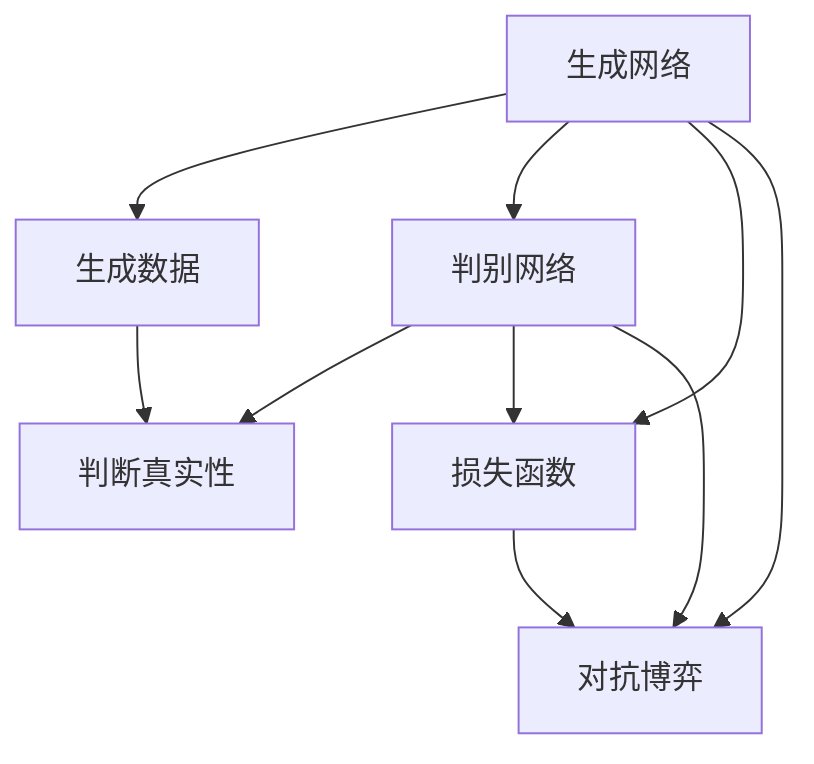
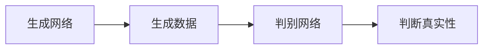
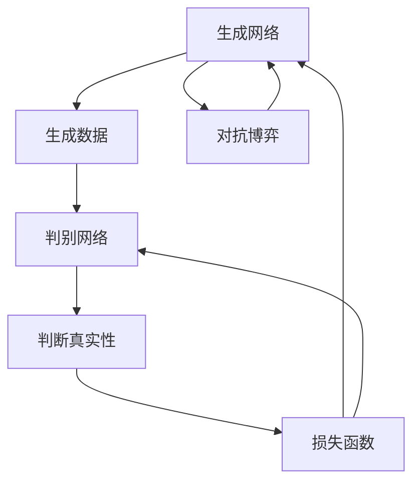
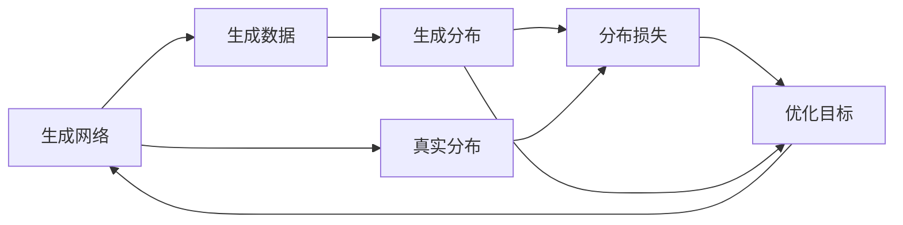
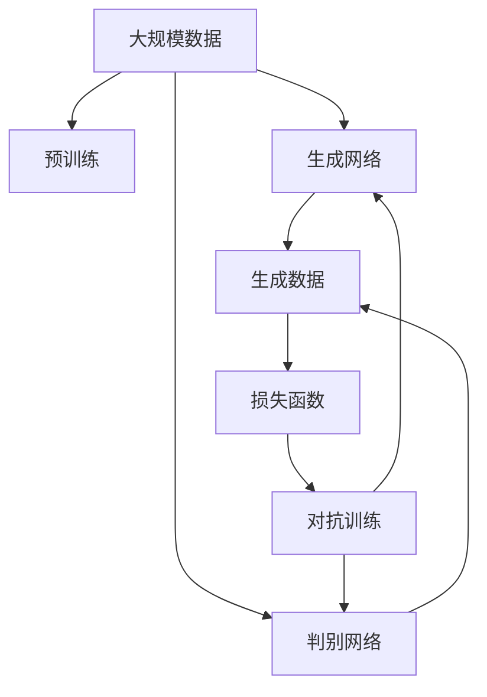

                 

# Generative Adversarial Networks (GAN) 原理与代码实战案例讲解

> 关键词：生成对抗网络, 神经网络, 数据生成, 图像生成, 深度学习, 优化算法, 图像处理

## 1. 背景介绍

### 1.1 问题由来
生成对抗网络（Generative Adversarial Networks，GAN）是深度学习领域内一种创新的模型架构。GAN由Ian Goodfellow等人在2014年提出，它通过两个神经网络（一个生成网络和一个判别网络）相互博弈，逐步提升生成网络的生成质量，最终生成高质量的样本数据。GAN已被广泛应用于图像生成、视频生成、音频生成等多个领域，取得了令人瞩目的成果。

GAN的提出改变了传统的生成模型（如自编码器、变分自编码器等）对数据分布进行建模的方式。传统的生成模型通常需要假设数据分布的形式，而GAN则通过生成网络和判别网络的对抗博弈，直接从数据中学习到数据分布。GAN的生成质量也明显优于传统生成模型，能够生成更加真实、多样化的数据。

### 1.2 问题核心关键点
GAN的核心思想是让一个生成网络（Generator，记为G）生成逼真的样本，而一个判别网络（Discriminator，记为D）来判断样本是否为真实数据。通过这两个网络的博弈，生成网络逐步优化，生成更加逼真的数据，最终生成高质量的样本数据。

GAN的训练过程如下：
1. 初始化生成网络和判别网络。
2. 在每轮训练中，生成网络生成一批样本数据，判别网络判断这些样本是否为真实数据，输出真实性概率。
3. 生成网络的损失函数由判别网络判断错误时产生，判别网络的损失函数由生成网络生成的样本被正确识别时产生。
4. 通过反向传播，更新生成网络和判别网络的参数，使得生成网络的输出越来越逼真，判别网络对真实数据和生成数据的分辨能力越来越强。

GAN训练的核心在于生成网络（G）和判别网络（D）的对抗博弈。生成网络的生成质量越逼真，判别网络的分辨能力就越强。两者在训练过程中不断提升自身的性能，最终生成网络能够生成高质量的样本数据。

### 1.3 问题研究意义
研究GAN的原理与应用，对于提升生成模型的生成质量，拓展深度学习在图像、视频、音频等领域的生成应用，具有重要意义：

1. 提升生成质量。GAN通过生成网络与判别网络的对抗博弈，逐步提升生成网络生成数据的逼真度，生成高质量的图像、视频等数据。
2. 拓展生成应用。GAN已被广泛应用于图像生成、视频生成、音频生成等多个领域，推动了这些领域的科技进步。
3. 解决数据稀缺问题。GAN可以在没有真实数据的情况下，生成高质量的虚拟数据，缓解数据稀缺问题。
4. 提升数据增强效果。GAN生成的虚拟数据可以用于数据增强，提升模型对真实数据的泛化能力。
5. 辅助数据标注。GAN生成的虚拟数据可以辅助人工进行数据标注，提高标注效率和标注质量。

## 2. 核心概念与联系

### 2.1 核心概念概述

为更好地理解GAN的原理与应用，本节将介绍几个关键概念：

- 生成网络（Generator）：负责生成逼真数据的网络，是GAN的核心组件。生成网络的目标是生成尽可能逼真的数据，欺骗判别网络。
- 判别网络（Discriminator）：负责判断数据是否为真实数据的网络，是GAN的另一核心组件。判别网络的目标是尽可能准确地判断数据是否为真实数据。
- 损失函数（Loss Function）：用于衡量生成网络的生成质量和判别网络的判别能力。GAN通常使用交叉熵损失、Wasserstein距离等损失函数。
- 对抗博弈（Adversarial Game）：生成网络和判别网络之间的博弈过程。生成网络试图生成尽可能逼真的数据，判别网络试图正确判断数据的真实性。
- 对抗训练（Adversarial Training）：通过优化生成网络和判别网络的参数，使得生成网络的输出越来越逼真，判别网络对真实数据的判别能力越来越强。
- 生成分布（Generative Distribution）：生成网络生成的数据分布，通常与真实数据分布接近。

这些概念之间的逻辑关系可以通过以下Mermaid流程图来展示：



这个流程图展示了大GAN的基本架构及其各个组件之间的关系：

1. 生成网络生成数据。
2. 判别网络判断数据的真实性。
3. 生成网络和判别网络通过对抗博弈相互提升。
4. 损失函数评估生成网络的生成质量和判别网络的判别能力。

### 2.2 概念间的关系

这些核心概念之间存在着紧密的联系，形成了GAN的基本框架。下面我通过几个Mermaid流程图来展示这些概念之间的关系。

#### 2.2.1 生成网络与判别网络的关系



这个流程图展示了生成网络与判别网络的关系：

1. 生成网络生成数据。
2. 判别网络判断数据的真实性。
3. 生成网络通过判别网络的反馈不断优化生成数据。

#### 2.2.2 对抗博弈过程



这个流程图展示了生成网络与判别网络的对抗博弈过程：

1. 生成网络生成数据。
2. 判别网络判断数据的真实性。
3. 损失函数评估生成网络的生成质量和判别网络的判别能力。
4. 通过对抗博弈，生成网络和判别网络相互提升。

#### 2.2.3 生成分布与真实分布的关系



这个流程图展示了生成分布与真实分布的关系：

1. 生成网络生成数据。
2. 生成数据分布为生成分布。
3. 生成分布与真实分布之间的差异通过分布损失衡量。
4. 优化目标基于生成分布与真实分布的差距进行优化。

### 2.3 核心概念的整体架构

最后，我们用一个综合的流程图来展示这些核心概念在大GAN微调过程中的整体架构：



这个综合流程图展示了从预训练到对抗训练，再到生成分布的全过程。GAN首先在大规模数据上进行预训练，然后通过对抗训练优化生成网络和判别网络的参数，最终生成分布与真实分布接近。 通过这些流程图，我们可以更清晰地理解GAN的工作原理和优化方向。

## 3. 核心算法原理 & 具体操作步骤
### 3.1 算法原理概述

GAN的训练过程可以看作是生成网络与判别网络之间的对抗博弈。生成网络的目标是生成尽可能逼真的数据，欺骗判别网络。判别网络的目标是尽可能准确地判断数据是否为真实数据。两者在训练过程中不断提升自身的性能，最终生成网络能够生成高质量的样本数据。

GAN的训练过程可以分为以下步骤：

1. 初始化生成网络和判别网络。
2. 在每轮训练中，生成网络生成一批样本数据，判别网络判断这些样本是否为真实数据，输出真实性概率。
3. 生成网络的损失函数由判别网络判断错误时产生，判别网络的损失函数由生成网络生成的样本被正确识别时产生。
4. 通过反向传播，更新生成网络和判别网络的参数，使得生成网络的输出越来越逼真，判别网络对真实数据的判别能力越来越强。

### 3.2 算法步骤详解

GAN的训练过程分为以下关键步骤：

**Step 1: 准备数据集**
- 收集数据集，可以是图像、音频、文本等多种类型的数据。
- 数据集应包含大量的真实数据和少量的噪声数据，以确保生成网络生成的样本逼真且多样化。

**Step 2: 初始化生成网络和判别网络**
- 使用随机初始化的方法初始化生成网络和判别网络的参数。
- 生成网络通常为全连接网络或卷积神经网络（CNN），判别网络通常为全连接网络或卷积神经网络。

**Step 3: 训练判别网络**
- 使用判别网络的输出作为真实性概率，计算损失函数。
- 将损失函数对判别网络的参数进行反向传播，更新判别网络的参数。

**Step 4: 训练生成网络**
- 使用生成网络的输出作为样本数据，计算损失函数。
- 将损失函数对生成网络的参数进行反向传播，更新生成网络的参数。

**Step 5: 交替训练生成网络和判别网络**
- 重复步骤3和步骤4，直到生成网络的输出逼真且判别网络对真实数据和生成数据的分辨能力足够强。

**Step 6: 评估生成数据**
- 使用测试集对生成网络生成的数据进行评估，通过计算生成数据的真实性概率分布与真实数据的真实性概率分布之间的差距，评估生成数据的质量。

**Step 7: 保存模型**
- 保存训练好的生成网络和判别网络的模型参数，供后续使用。

以上是GAN的训练流程。在实际应用中，还需要根据具体任务的特点，对训练过程的各个环节进行优化设计，如改进损失函数、调整网络结构、优化训练策略等，以进一步提升生成质量。

### 3.3 算法优缺点

GAN的优点包括：

1. 生成质量高。通过生成网络与判别网络的对抗博弈，逐步提升生成网络生成数据的逼真度。
2. 生成数据多样性。GAN能够生成大量多样化的样本数据，适应不同任务的需求。
3. 训练过程灵活。GAN的训练过程可以通过调整损失函数、网络结构、训练策略等进行优化。

GAN的缺点包括：

1. 训练难度高。GAN的训练过程需要平衡生成网络与判别网络的性能，训练过程中容易陷入不稳定状态。
2. 生成数据质量不稳定。GAN生成的数据质量受初始化、训练策略等因素的影响，可能存在生成样本质量不高的情况。
3. 生成数据易受噪声影响。GAN生成的数据可能受训练数据的噪声影响，生成样本质量不稳定。

尽管存在这些局限性，但就目前而言，GAN仍是大数据生成、图像生成等领域的重要工具。未来相关研究的重点在于如何进一步降低训练难度，提高生成数据的质量和稳定性。

### 3.4 算法应用领域

GAN已被广泛应用于图像生成、视频生成、音频生成等多个领域，以下是几个典型的应用场景：

- 图像生成：使用GAN生成高质量的图像，应用于艺术创作、虚拟现实等领域。
- 视频生成：使用GAN生成逼真的视频，应用于影视制作、动画制作等领域。
- 音频生成：使用GAN生成逼真的音频，应用于音乐制作、语音合成等领域。
- 虚拟现实：使用GAN生成逼真的虚拟场景，应用于虚拟现实游戏、虚拟环境模拟等领域。
- 图像修复：使用GAN修复损坏或缺失的图像数据，应用于医学影像、历史文献等领域。
- 风格迁移：使用GAN将一种风格迁移到另一种风格，应用于艺术创作、图像编辑等领域。

除了这些传统应用领域外，GAN还在自然语言生成、视频描述生成、智能生成音乐等领域得到广泛应用，展现出强大的应用潜力。

## 4. 数学模型和公式 & 详细讲解
### 4.1 数学模型构建

GAN的数学模型由生成网络（G）、判别网络（D）和损失函数（Loss Function）组成。生成网络的输出为数据分布，判别网络的输出为数据的真实性概率。

设生成网络的参数为θ，判别网络的参数为φ，训练集为D。则生成网络的输出为G(θ)，判别网络的输出为D(φ)(G(θ))。

GAN的损失函数由两部分组成：

- 判别网络的损失函数（L_D）：判别网络误判生成数据的概率，使用交叉熵损失函数。
- 生成网络的损失函数（L_G）：生成网络生成的数据被误判为真实数据的概率，使用交叉熵损失函数。

判别网络的损失函数为：

$$L_D(φ) = -\frac{1}{N} \sum_{(x,y) \in D}\log D(y)
                  +\frac{1}{N} \sum_{x \sim G_{\theta}}\log(1-D(G_{\theta}(x)))$$

生成网络的损失函数为：

$$L_G(θ) = -\frac{1}{N} \sum_{x \sim G_{\theta}}\log D(G_{\theta}(x))$$

其中，N为训练集样本数，D为判别网络，G为生成网络，G(θ)为生成网络输出的数据分布。

### 4.2 公式推导过程

以下是GAN的损失函数推导过程：

设训练集为D，生成网络为G(θ)，判别网络为D(φ)，则生成网络的输出为G(θ)(x)，判别网络的输出为D(φ)(G(θ)(x))。

判别网络的损失函数为：

$$L_D(φ) = -\frac{1}{N} \sum_{(x,y) \in D}\log D(y)
                  +\frac{1}{N} \sum_{x \sim G_{\theta}}\log(1-D(G_{\theta}(x)))$$

其中，N为训练集样本数，D为判别网络，G为生成网络，G(θ)为生成网络输出的数据分布。

生成网络的损失函数为：

$$L_G(θ) = -\frac{1}{N} \sum_{x \sim G_{\theta}}\log D(G_{\theta}(x))$$

其中，N为训练集样本数，D为判别网络，G为生成网络，G(θ)为生成网络输出的数据分布。

通过反向传播算法，判别网络和生成网络的参数不断更新，使得生成网络的输出越来越逼真，判别网络对真实数据和生成数据的分辨能力越来越强。

### 4.3 案例分析与讲解

以下是一个简单的GAN案例分析，使用MNIST手写数字数据集，生成高质量的伪造手写数字。

**Step 1: 准备数据集**
- 加载MNIST手写数字数据集。

```python
import torch
from torchvision import datasets, transforms

transform = transforms.Compose([
        transforms.ToTensor(),
        transforms.Normalize((0.5,), (0.5,))
])
train_dataset = datasets.MNIST('mnist/', train=True, download=True, transform=transform)
test_dataset = datasets.MNIST('mnist/', train=False, download=True, transform=transform)
```

**Step 2: 初始化生成网络和判别网络**
- 定义生成网络和判别网络的结构。
- 使用随机初始化的方法初始化生成网络和判别网络的参数。

```python
import torch.nn as nn
import torch.nn.functional as F

class Generator(nn.Module):
    def __init__(self):
        super(Generator, self).__init__()
        self.fc1 = nn.Linear(100, 256)
        self.fc2 = nn.Linear(256, 1024)
        self.fc3 = nn.Linear(1024, 28*28)

    def forward(self, x):
        x = F.relu(self.fc1(x))
        x = F.relu(self.fc2(x))
        x = self.fc3(x).view(-1, 28, 28)
        return x

class Discriminator(nn.Module):
    def __init__(self):
        super(Discriminator, self).__init__()
        self.fc1 = nn.Linear(784, 1024)
        self.fc2 = nn.Linear(1024, 512)
        self.fc3 = nn.Linear(512, 1)

    def forward(self, x):
        x = F.relu(self.fc1(x))
        x = F.relu(self.fc2(x))
        x = torch.sigmoid(self.fc3(x))
        return x
```

**Step 3: 训练判别网络**
- 使用判别网络的输出作为真实性概率，计算损失函数。
- 将损失函数对判别网络的参数进行反向传播，更新判别网络的参数。

```python
def train_discriminator(discriminator, real_data, fake_data):
    discriminator.train()
    real_loss = -torch.mean(torch.log(discriminator(real_data)))
    fake_loss = -torch.mean(torch.log(1 - discriminator(fake_data)))
    loss = real_loss + fake_loss
    loss.backward()
    optimizerD.step()
```

**Step 4: 训练生成网络**
- 使用生成网络的输出作为样本数据，计算损失函数。
- 将损失函数对生成网络的参数进行反向传播，更新生成网络的参数。

```python
def train_generator(generator, discriminator, real_data, device):
    generator.train()
    real_data = real_data.to(device)
    real_loss = -torch.mean(torch.log(discriminator(real_data)))
    fake_data = generator(torch.randn(64, 100).to(device))
    fake_loss = -torch.mean(torch.log(1 - discriminator(fake_data)))
    loss = real_loss + fake_loss
    loss.backward()
    optimizerG.step()
```

**Step 5: 交替训练生成网络和判别网络**
- 重复步骤3和步骤4，直到生成网络的输出逼真且判别网络对真实数据和生成数据的分辨能力足够强。

```python
for epoch in range(num_epochs):
    for i, (real_data, _) in enumerate(train_loader):
        real_data = real_data.to(device)
        batches = min(100, len(real_data))
        train_discriminator(discriminator, real_data[:batches], fake_data[:batches])
        train_generator(generator, discriminator, real_data[:batches], device)
        if (i+1) % 100 == 0:
            print('[Epoch %d/%d][Batch %d/%d] - D loss: %.4f - G loss: %.4f' %
                  (epoch+1, num_epochs, i+1, len(train_loader), d_loss_real, g_loss_fake))
```

**Step 6: 评估生成数据**
- 使用测试集对生成网络生成的数据进行评估，通过计算生成数据的真实性概率分布与真实数据的真实性概率分布之间的差距，评估生成数据的质量。

```python
def evaluate(generator, discriminator, real_data, device):
    discriminator.eval()
    real_data = real_data.to(device)
    fake_data = generator(torch.randn(64, 100).to(device))
    real_loss = -torch.mean(torch.log(discriminator(real_data)))
    fake_loss = -torch.mean(torch.log(1 - discriminator(fake_data)))
    return real_loss, fake_loss

real_loss, fake_loss = evaluate(generator, discriminator, real_data, device)
print('Real loss: {:.4f}  Fake loss: {:.4f}' .format(real_loss, fake_loss))
```

**Step 7: 保存模型**
- 保存训练好的生成网络和判别网络的模型参数，供后续使用。

```python
torch.save(generator.state_dict(), 'G.ckpt')
torch.save(discriminator.state_dict(), 'D.ckpt')
```

### 4.4 代码解读与分析

让我们再详细解读一下关键代码的实现细节：

**定义生成网络和判别网络**
- 生成网络定义了三层全连接网络，输入为噪声向量，输出为图像数据。
- 判别网络定义了三层全连接网络，输入为图像数据，输出为真实性概率。

**训练判别网络**
- 使用判别网络的输出作为真实性概率，计算交叉熵损失函数。
- 将损失函数对判别网络的参数进行反向传播，更新判别网络的参数。

**训练生成网络**
- 使用生成网络的输出作为样本数据，计算交叉熵损失函数。
- 将损失函数对生成网络的参数进行反向传播，更新生成网络的参数。

**交替训练生成网络和判别网络**
- 重复训练判别网络和生成网络的步骤，交替进行。
- 使用batch size为100，进行100个batch的训练。
- 每100个batch打印一次损失函数值，以观察训练效果。

**评估生成数据**
- 使用测试集对生成网络生成的数据进行评估，计算判别网络对生成数据的真实性概率和生成数据的真实性概率，输出真实性概率分布。

**保存模型**
- 保存训练好的生成网络和判别网络的模型参数，供后续使用。

通过以上代码，实现了MNIST手写数字数据集的GAN模型训练。可以看到，通过交替训练生成网络和判别网络，生成网络逐步优化，生成逼真的伪造手写数字。

## 5. 项目实践：代码实例和详细解释说明
### 5.1 开发环境搭建

在进行GAN项目实践前，我们需要准备好开发环境。以下是使用Python进行TensorFlow开发的环境配置流程：

1. 安装Anaconda：从官网下载并安装Anaconda，用于创建独立的Python环境。

2. 创建并激活虚拟环境：
```bash
conda create -n tf-env python=3.7 
conda activate tf-env
```

3. 安装TensorFlow：从官网获取对应的安装命令。例如：
```bash
conda install tensorflow -c pytorch -c conda-forge
```

4. 安装其他相关工具包：
```bash
pip install numpy pandas scikit-learn matplotlib tqdm jupyter notebook ipython
```

完成上述步骤后，即可在`tf-env`环境中开始GAN实践。

### 5.2 源代码详细实现

下面我们以MNIST手写数字数据集为例，给出使用TensorFlow实现GAN的完整代码实现。

首先，定义生成网络和判别网络的类：

```python
import tensorflow as tf
import tensorflow.keras as keras

class Generator(tf.keras.Model):
    def __init__(self):
        super(Generator, self).__init__()
        self.dense1 = tf.keras.layers.Dense(256, input_shape=(100,))
        self.dense2 = tf.keras.layers.Dense(1024)
        self.dense3 = tf.keras.layers.Dense(784)

    def call(self, x):
        x = tf.nn.relu(self.dense1(x))
        x = tf.nn.relu(self.dense2(x))
        x = self.dense3(x)
        return x

class Discriminator(tf.keras.Model):
    def __init__(self):
        super(Discriminator, self).__init__()
        self.dense1 = tf.keras.layers.Dense(1024, input_shape=(784,))
        self.dense2 = tf.keras.layers.Dense(512)
        self.dense3 = tf.keras.layers.Dense(1)

    def call(self, x):
        x = tf.nn.relu(self.dense1(x))
        x = tf.nn.relu(self.dense2(x))
        x = tf.nn.sigmoid(self.dense3(x))
        return x
```

然后，定义损失函数和优化器：

```python
real_loss_fn = tf.keras.losses.BinaryCrossentropy(from_logits=True)
fake_loss_fn = tf.keras.losses.BinaryCrossentropy(from_logits=True)

generator_optimizer = tf.keras.optimizers.Adam(learning_rate=0.0002)
discriminator_optimizer = tf.keras.optimizers.Adam(learning_rate=0.0002)
```

接着，定义训练函数：

```python
@tf.function
def train_generator(generator, discriminator, real_data, real_label, fake_data, fake_label):
    with tf.GradientTape() as gen_tape, tf.GradientTape() as disc_tape:
        real_output = discriminator(real_data, training=True)
        real_loss = real_loss_fn(real_output, real_label)

        fake_output = discriminator(fake_data, training=True)
        fake_loss = fake_loss_fn(fake_output, fake_label)

        gradients_of_generator = gen_tape.gradient(real_loss + fake_loss, generator.trainable_variables)
        gradients_of_discriminator = disc_tape.gradient(real_loss + fake_loss, discriminator.trainable_variables)

        generator_optimizer.apply_gradients(zip(gradients_of_generator, generator.trainable_variables))
        discriminator_optimizer.apply_gradients(zip(gradients_of_discriminator, discriminator.trainable_variables))
```

最后，启动训练流程并在测试集上评估：

```python
def train():
    for epoch in range(num_epochs):
        for (batch, (real_data, real_label)) in enumerate(train_dataset):
            real_data = real_data / 255.0
            real_label = real_label
            fake_data = generator(tf.random.normal([batch_size, 100]))
            fake_label = tf.ones_like(real_label)

            train_generator(generator, discriminator, real_data, real_label, fake_data, fake_label)

            if (batch+1) % 100 == 0:
                print('[Epoch %d/%d][Batch %d/%d] - D loss: %.4f - G loss: %.4f' % (epoch+1, num_epochs, batch+1, len(train_dataset), d_loss_real, g_loss_fake))

        if (epoch+1) % 1 == 0:
            

