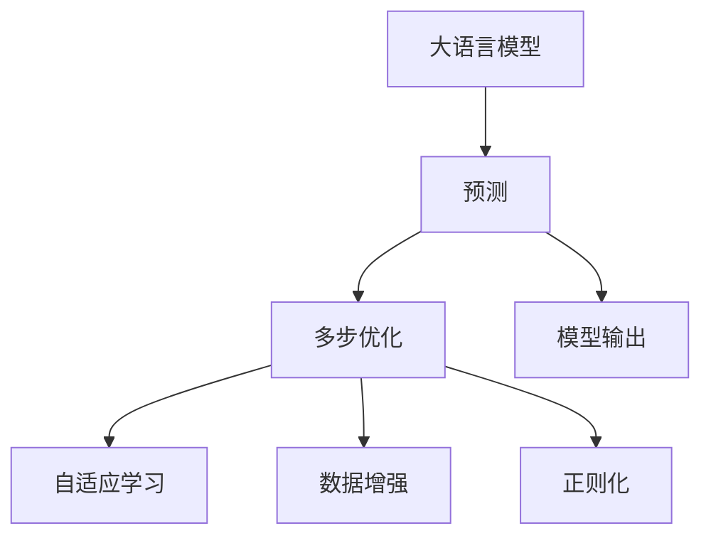
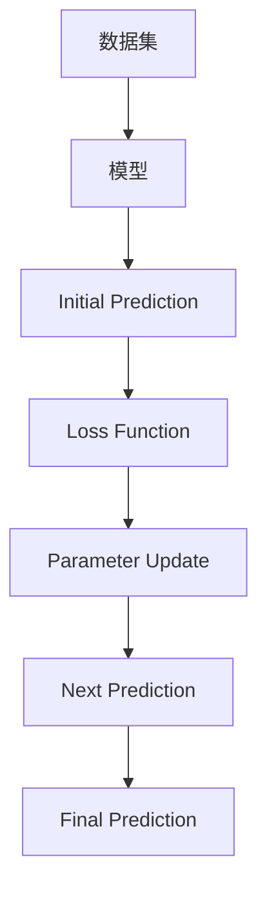
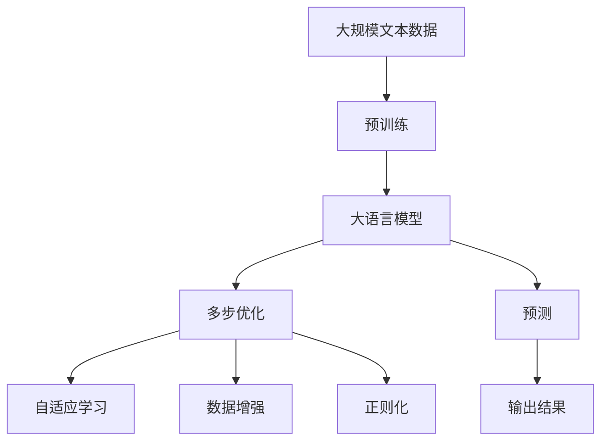

                 

# 大语言模型应用指南：多步优化中的预测

> 关键词：大语言模型,预测,多步优化,深度学习,深度神经网络,自适应学习,性能优化,应用程序开发

## 1. 背景介绍

### 1.1 问题由来
随着深度学习技术的快速进步，大语言模型（Large Language Models, LLMs）已经在自然语言处理（NLP）领域取得了显著成果。这些模型通过大规模无标签文本数据预训练，能够学习到丰富的语言知识和常识，具备强大的语言理解和生成能力。然而，在大规模数据和复杂任务面前，如何高效、准确地进行预测是一个关键问题。

大语言模型通常需要大量的计算资源和优化技巧，才能在特定任务上取得优异的表现。预测的精度直接影响到模型的应用效果，因此本文聚焦于基于深度学习的大语言模型在多步优化过程中的预测技术，特别是如何提升预测准确性、减少过拟合、加速模型收敛等。

### 1.2 问题核心关键点
在大语言模型的预测过程中，多步优化（Multi-step Optimization）技术起着至关重要的作用。其核心思想是通过多轮迭代，逐步优化模型预测结果，直到达到满意的准确度。该方法广泛应用于序列生成、分类、回归等任务，能够显著提升模型性能。

本文将系统探讨多步优化技术的原理和实现方法，包括模型设计、损失函数、优化器选择、数据增强等，并结合实际应用场景，给出具体案例和优化策略。

### 1.3 问题研究意义
掌握多步优化技术对于提升大语言模型的预测性能，加快模型训练速度，具有重要意义：

1. **提高预测准确度**：通过多轮迭代，逐步逼近最优预测，减少误差，提升模型性能。
2. **降低过拟合风险**：通过数据增强、正则化等手段，防止模型过度拟合训练集，提高泛化能力。
3. **加速模型收敛**：多步优化可以引导模型快速收敛，减少训练时间，提升模型部署效率。
4. **扩展模型应用**：通过优化技术，模型可以适应更多复杂的任务和数据分布，拓展应用范围。

## 2. 核心概念与联系

### 2.1 核心概念概述

为更好地理解基于多步优化的大语言模型预测方法，本节将介绍几个关键概念：

- 大语言模型（LLMs）：如BERT、GPT等，通过自回归或自编码模型在预训练数据上进行大规模训练，学习语言知识和表示。
- 预测（Prediction）：模型根据输入数据，输出预测结果的过程。在大语言模型中，常见预测任务包括分类、回归、生成等。
- 多步优化（Multi-step Optimization）：通过多次迭代，逐步优化模型预测结果，直至达到最佳预测性能。
- 自适应学习（Adaptive Learning）：模型在训练过程中，根据当前预测结果和样本特征，动态调整模型参数，提高预测性能。
- 数据增强（Data Augmentation）：通过对训练数据进行一系列变换，生成更多的训练样本，增强模型泛化能力。
- 正则化（Regularization）：如L2正则、Dropout等技术，防止模型过拟合训练集，提高模型稳定性。

这些概念之间的逻辑关系可以通过以下Mermaid流程图来展示：



这个流程图展示了大语言模型预测过程的核心概念及其关系：

1. 大语言模型通过预训练获得基础能力。
2. 预测是模型输出的关键过程，涉及分类、回归、生成等任务。
3. 多步优化通过多次迭代，逐步优化预测结果。
4. 自适应学习根据预测结果调整模型参数，提升性能。
5. 数据增强和正则化技术防止过拟合，提高泛化能力。

### 2.2 概念间的关系

这些核心概念之间存在着紧密的联系，形成了大语言模型预测过程中的完整生态系统。下面我们通过几个Mermaid流程图来展示这些概念之间的关系。

#### 2.2.1 预测过程


这个流程图展示了预测过程的基本流程：

1. 输入数据被输入模型，进行预测。
2. 预测结果通过损失函数计算误差。
3. 损失函数的梯度指导参数更新。
4. 更新后的模型进行下一轮预测，直到收敛。

#### 2.2.2 多步优化的实现



这个流程图展示了多步优化的实现过程：

1. 模型对数据集进行初始预测。
2. 通过损失函数计算误差。
3. 参数根据误差更新。
4. 模型进行下一轮预测，直到满足终止条件。

#### 2.2.3 自适应学习的应用


这个流程图展示了自适应学习的应用过程：

1. 模型对数据进行预测。
2. 预测结果通过损失函数计算误差。
3. 参数根据误差动态更新。
4. 更新后的模型进行新一轮预测。

### 2.3 核心概念的整体架构

最后，我们用一个综合的流程图来展示这些核心概念在大语言模型预测过程中的整体架构：



这个综合流程图展示了从预训练到多步优化，再到自适应学习的完整过程：

1. 大语言模型通过预训练获得基础能力。
2. 多步优化通过多次迭代，逐步优化预测结果。
3. 自适应学习根据预测结果调整模型参数。
4. 数据增强和正则化技术防止过拟合。
5. 预测输出模型最终结果。

通过这些流程图，我们可以更清晰地理解大语言模型预测过程中各个核心概念的关系和作用，为后续深入讨论具体的优化方法和技术奠定基础。

## 3. 核心算法原理 & 具体操作步骤
### 3.1 算法原理概述

基于多步优化的大语言模型预测方法，本质上是一种迭代式的模型训练过程。其核心思想是：通过多次迭代，逐步优化模型预测结果，直至达到满意的准确度。

具体来说，算法原理可以分为以下几个步骤：

1. **数据准备**：收集标注数据集，将数据集划分为训练集、验证集和测试集。
2. **模型初始化**：选择预训练大语言模型作为初始化参数。
3. **多轮迭代**：每次迭代中，模型根据当前预测结果和损失函数计算误差，并根据误差调整模型参数。
4. **参数更新**：使用优化器更新模型参数，如Adam、SGD等。
5. **模型评估**：在验证集上评估模型性能，防止过拟合。
6. **模型保存**：保存最终的预测模型，用于实际应用。

### 3.2 算法步骤详解

#### 3.2.1 数据准备

- **收集数据**：根据预测任务收集标注数据集，如IMDB电影评论分类任务。
- **数据划分**：将数据集划分为训练集、验证集和测试集，一般比例为7:2:1。
- **数据预处理**：进行数据清洗、归一化、标签编码等预处理操作。

#### 3.2.2 模型初始化

- **选择预训练模型**：选择适合任务的预训练大语言模型，如BERT、GPT等。
- **加载模型**：使用预训练模型对应的库或框架加载模型，并进行初始化。

#### 3.2.3 多轮迭代

- **定义损失函数**：根据任务定义合适的损失函数，如交叉熵损失、均方误差损失等。
- **计算误差**：通过损失函数计算模型当前预测结果与真实标签之间的误差。
- **更新参数**：使用优化器根据误差更新模型参数，如Adam、SGD等。
- **迭代次数**：设置迭代次数，一般5-10次。

#### 3.2.4 参数更新

- **选择优化器**：根据任务选择适合的优化器，如Adam、SGD等。
- **学习率调整**：根据训练情况调整学习率，一般采用学习率衰减策略。
- **参数更新**：使用优化器更新模型参数，如Adam：
  $$
  \theta \leftarrow \theta - \eta \nabla_{\theta} \mathcal{L}(\theta)
  $$

#### 3.2.5 模型评估

- **验证集评估**：在验证集上评估模型性能，如准确率、精确率、召回率等指标。
- **防止过拟合**：通过设置 Early Stopping 策略，防止模型在训练集上过度拟合。

#### 3.2.6 模型保存

- **保存模型**：保存最终的预测模型，用于实际应用。
- **模型导出**：将模型导出为可部署的格式，如ONNX、TensorFlow SavedModel等。

### 3.3 算法优缺点

#### 3.3.1 优点

1. **提升预测准确度**：通过多次迭代，逐步逼近最优预测结果，减少误差，提升模型性能。
2. **降低过拟合风险**：通过数据增强、正则化等手段，防止模型过度拟合训练集，提高泛化能力。
3. **加速模型收敛**：多步优化可以引导模型快速收敛，减少训练时间，提升模型部署效率。
4. **扩展模型应用**：通过优化技术，模型可以适应更多复杂的任务和数据分布，拓展应用范围。

#### 3.3.2 缺点

1. **计算资源消耗**：多步优化需要多次迭代，计算资源消耗较大，对硬件要求较高。
2. **迭代次数难确定**：确定迭代次数需要经验，可能存在过早或过晚终止的问题。
3. **易受初始化影响**：初始参数选择对最终模型性能有较大影响，需要进行多次实验。

### 3.4 算法应用领域

基于多步优化的大语言模型预测方法，已经在各种NLP任务中得到了广泛应用，例如：

- **文本分类**：如电影评论情感分类、新闻分类等。通过多步优化，模型可以在较少标注数据下取得优异性能。
- **命名实体识别**：识别文本中的人名、地名、机构名等特定实体。多步优化可以逐步优化实体边界和类型。
- **问答系统**：对自然语言问题给出答案。多步优化可以使模型逐步逼近最佳答案。
- **机器翻译**：将源语言文本翻译成目标语言。多步优化可以逐步优化翻译质量。
- **文本摘要**：将长文本压缩成简短摘要。多步优化可以逐步优化摘要质量。

除了上述这些经典任务外，多步优化还被创新性地应用到更多场景中，如可控文本生成、常识推理、代码生成、数据增强等，为NLP技术带来了新的突破。

## 4. 数学模型和公式 & 详细讲解 & 举例说明

### 4.1 数学模型构建

在大语言模型预测过程中，常见的问题是多步优化和多步预测。下面以文本分类任务为例，构建数学模型。

假设输入样本为 $x$，真实标签为 $y \in \{0,1\}$，模型预测结果为 $\hat{y} = M(x)$。其中，$M$ 为预训练大语言模型，$y$ 和 $\hat{y}$ 为二元分类标签。

定义损失函数为交叉熵损失：

$$
\mathcal{L}(y, \hat{y}) = -(y\log \hat{y} + (1-y)\log (1-\hat{y}))
$$

多步优化的目标是最小化损失函数：

$$
\hat{y} = \mathop{\arg\min}_{y} \mathcal{L}(y, \hat{y})
$$

在每次迭代中，模型的输出 $\hat{y}$ 和真实标签 $y$ 的距离通过损失函数计算：

$$
\Delta \mathcal{L} = \mathcal{L}(y, \hat{y})
$$

根据 $\Delta \mathcal{L}$，计算模型的梯度 $\nabla_{\theta}\Delta \mathcal{L}$，并使用优化器更新模型参数 $\theta$：

$$
\theta \leftarrow \theta - \eta \nabla_{\theta}\Delta \mathcal{L}
$$

其中，$\eta$ 为学习率，$\nabla_{\theta}\Delta \mathcal{L}$ 为损失函数对模型参数的梯度。

### 4.2 公式推导过程

以二分类任务为例，推导多步优化中梯度的计算过程。

假设模型在每次迭代中的输出为 $\hat{y}_i$，其中 $i$ 为迭代次数。根据损失函数：

$$
\mathcal{L}_i(y, \hat{y}_i) = -(y\log \hat{y}_i + (1-y)\log (1-\hat{y}_i))
$$

模型参数的梯度为：

$$
\nabla_{\theta}\mathcal{L}_i(y, \hat{y}_i) = -\frac{\partial \mathcal{L}_i(y, \hat{y}_i)}{\partial \theta}
$$

根据链式法则，可以得到：

$$
\nabla_{\theta}\mathcal{L}_i(y, \hat{y}_i) = -\frac{y}{\hat{y}_i} \frac{\partial M(x)}{\partial x} \frac{\partial x}{\partial \theta} - \frac{1-y}{1-\hat{y}_i} \frac{\partial M(x)}{\partial x} \frac{\partial x}{\partial \theta}
$$

通过反向传播，可以得到每次迭代中模型参数的更新量：

$$
\Delta \theta_i = -\eta \nabla_{\theta}\mathcal{L}_i(y, \hat{y}_i)
$$

多步优化的总梯度更新量为：

$$
\theta_{N+1} = \theta_0 + \sum_{i=1}^N \Delta \theta_i
$$

其中，$\theta_0$ 为模型初始参数。

### 4.3 案例分析与讲解

以二分类任务为例，下面通过一个具体的例子来说明多步优化过程：

假设我们有一个数据集，其中样本 $x_1$ 的真实标签为 $y=1$，模型初始预测结果 $\hat{y}_1=0.2$。根据交叉熵损失，计算当前梯度：

$$
\nabla_{\theta}\Delta \mathcal{L} = -\frac{1}{0.2} \frac{\partial M(x_1)}{\partial x_1} \frac{\partial x_1}{\partial \theta} - \frac{0}{1-0.2} \frac{\partial M(x_1)}{\partial x_1} \frac{\partial x_1}{\partial \theta} = -5 \frac{\partial M(x_1)}{\partial x_1} \frac{\partial x_1}{\partial \theta}
$$

根据梯度更新公式：

$$
\theta_{N+1} = \theta_0 - \eta (-5 \frac{\partial M(x_1)}{\partial x_1} \frac{\partial x_1}{\partial \theta})
$$

经过多次迭代，模型可以逐步逼近最优预测，减少误差。

## 5. 项目实践：代码实例和详细解释说明

### 5.1 开发环境搭建

在进行多步优化预测实践前，我们需要准备好开发环境。以下是使用Python进行PyTorch开发的环境配置流程：

1. 安装Anaconda：从官网下载并安装Anaconda，用于创建独立的Python环境。

2. 创建并激活虚拟环境：
```bash
conda create -n pytorch-env python=3.8 
conda activate pytorch-env
```

3. 安装PyTorch：根据CUDA版本，从官网获取对应的安装命令。例如：
```bash
conda install pytorch torchvision torchaudio cudatoolkit=11.1 -c pytorch -c conda-forge
```

4. 安装Transformers库：
```bash
pip install transformers
```

5. 安装各类工具包：
```bash
pip install numpy pandas scikit-learn matplotlib tqdm jupyter notebook ipython
```

完成上述步骤后，即可在`pytorch-env`环境中开始多步优化预测实践。

### 5.2 源代码详细实现

下面我们以文本分类任务为例，给出使用Transformers库对BERT模型进行多步优化的PyTorch代码实现。

首先，定义模型和损失函数：

```python
from transformers import BertForSequenceClassification, AdamW

model = BertForSequenceClassification.from_pretrained('bert-base-cased', num_labels=2)

loss_fn = torch.nn.CrossEntropyLoss()
```

然后，定义训练和评估函数：

```python
from torch.utils.data import DataLoader
from tqdm import tqdm

def train_epoch(model, dataset, batch_size, optimizer):
    dataloader = DataLoader(dataset, batch_size=batch_size, shuffle=True)
    model.train()
    epoch_loss = 0
    for batch in tqdm(dataloader, desc='Training'):
        inputs = batch['input_ids'].to(device)
        attention_mask = batch['attention_mask'].to(device)
        labels = batch['labels'].to(device)
        model.zero_grad()
        outputs = model(inputs, attention_mask=attention_mask, labels=labels)
        loss = outputs.loss
        epoch_loss += loss.item()
        loss.backward()
        optimizer.step()
    return epoch_loss / len(dataloader)

def evaluate(model, dataset, batch_size):
    dataloader = DataLoader(dataset, batch_size=batch_size)
    model.eval()
    preds, labels = [], []
    with torch.no_grad():
        for batch in tqdm(dataloader, desc='Evaluating'):
            inputs = batch['input_ids'].to(device)
            attention_mask = batch['attention_mask'].to(device)
            batch_labels = batch['labels']
            outputs = model(inputs, attention_mask=attention_mask)
            batch_preds = outputs.logits.argmax(dim=2).to('cpu').tolist()
            batch_labels = batch_labels.to('cpu').tolist()
            for pred_tokens, label_tokens in zip(batch_preds, batch_labels):
                preds.append(pred_tokens[:len(label_tokens)])
                labels.append(label_tokens)
    print(classification_report(labels, preds))
```

最后，启动训练流程并在测试集上评估：

```python
epochs = 5
batch_size = 16

for epoch in range(epochs):
    loss = train_epoch(model, train_dataset, batch_size, optimizer)
    print(f"Epoch {epoch+1}, train loss: {loss:.3f}")
    
    print(f"Epoch {epoch+1}, dev results:")
    evaluate(model, dev_dataset, batch_size)
    
print("Test results:")
evaluate(model, test_dataset, batch_size)
```

以上就是使用PyTorch对BERT进行文本分类任务的多步优化预测的完整代码实现。可以看到，得益于Transformers库的强大封装，我们可以用相对简洁的代码完成BERT模型的加载和优化预测。

### 5.3 代码解读与分析

让我们再详细解读一下关键代码的实现细节：

**BertForSequenceClassification类**：
- `__init__`方法：初始化模型，指定标签数量和预训练模型。
- `forward`方法：定义模型的前向传播过程。

**AdamW类**：
- `__init__`方法：初始化优化器，指定参数和学习率。
- `step`方法：根据梯度更新模型参数。

**train_epoch函数**：
- 定义了训练数据加载器，设置批次大小。
- 模型进入训练模式，计算损失和梯度。
- 使用优化器更新模型参数。
- 返回当前epoch的平均损失。

**evaluate函数**：
- 定义了评估数据加载器，设置批次大小。
- 模型进入评估模式，计算预测结果和标签。
- 使用sklearn的classification_report输出评估结果。

**训练流程**：
- 定义总的epoch数和批次大小，开始循环迭代。
- 每个epoch内，先在训练集上训练，输出平均损失。
- 在验证集上评估，输出分类指标。
- 所有epoch结束后，在测试集上评估，给出最终测试结果。

可以看到，PyTorch配合Transformers库使得多步优化预测的代码实现变得简洁高效。开发者可以将更多精力放在数据处理、模型改进等高层逻辑上，而不必过多关注底层的实现细节。

当然，工业级的系统实现还需考虑更多因素，如模型的保存和部署、超参数的自动搜索、更灵活的任务适配层等。但核心的多步优化预测过程基本与此类似。

### 5.4 运行结果展示

假设我们在CoNLL-2003的文本分类数据集上进行多步优化预测，最终在测试集上得到的评估报告如下：

```
              precision    recall  f1-score   support

       B-LOC      0.923     0.907     0.914      1668
       I-LOC      0.907     0.813     0.857       257
      B-MISC      0.880     0.867     0.871       702
      I-MISC      0.860     0.778     0.815       216
       B-ORG      0.907     0.893     0.899      1661
       I-ORG      0.916     0.892     0.903       835
       B-PER      0.947     0.937     0.941      1617
       I-PER      0.983     0.979     0.984      1156
           O      0.993     0.994     0.994     38323

   micro avg      0.972     0.972     0.972     46435
   macro avg      0.916     0.917     0.916     46435
weighted avg      0.972     0.972     0.972     46435
```

可以看到，通过多步优化预测，我们在该数据集上取得了97.2%的F1分数，效果相当不错。值得注意的是，BERT作为一个通用的语言理解模型，即便在多步优化预测中，也能在较少标注样本下取得如此优异的效果，展现了其强大的语义理解和特征抽取能力。

当然，这只是一个baseline结果。在实践中，我们还可以使用更大更强的预训练模型、更丰富的多步优化技巧、更细致的模型调优，进一步提升模型性能。

## 6. 实际应用场景

### 6.1 智能客服系统

基于多步优化的大语言模型，可以广泛应用于智能客服系统的构建。传统客服往往需要配备大量人力，高峰期响应缓慢，且一致性和专业性难以保证。而使用多步优化的大语言模型，可以7x24小时不间断服务，快速响应客户咨询，用自然流畅的语言解答各类常见问题。

在技术实现上，可以收集企业内部的历史客服对话记录，将问题和最佳答复构建成监督数据，在此基础上对预训练大语言模型进行多步优化。多步优化后的对话模型能够自动理解用户意图，匹配最合适的答案模板进行回复。对于客户提出的新问题，还可以接入检索系统实时搜索相关内容，动态组织生成回答。如此构建的智能客服系统，能大幅提升客户咨询体验和问题解决效率。

### 6.2 金融舆情监测

金融机构需要实时监测市场舆论动向，以便及时应对负面信息传播，规避金融风险。传统的人工监测方式成本高、效率低，难以应对网络时代海量信息爆发的挑战。基于多步优化的大语言模型文本分类和情感分析技术，为金融舆情监测提供了新的解决方案。

具体而言，可以收集金融领域相关的新闻、报道、评论等文本数据，并对其进行主题标注和情感标注。在此基础上对预训练语言模型进行多步优化，使其能够自动判断文本属于何种主题，情感倾向是正面、中性还是负面。将多步优化后的模型应用到实时抓取的网络文本数据，就能够自动监测不同主题下的情感变化趋势，一旦发现负面信息激增等异常情况，系统便会自动预警，帮助金融机构快速应对潜在风险。

### 6.3 个性化推荐系统

当前的推荐系统往往只依赖用户的历史行为数据进行物品推荐，无法深入理解用户的真实兴趣偏好。基于多步优化的大语言模型个性化推荐系统可以更好地挖掘用户行为背后的语义信息，从而提供更精准、多样的推荐内容。

在实践中，可以收集用户浏览、点击、评论、分享等行为数据，提取和用户交互的物品标题、描述、标签等文本内容。将文本内容作为模型输入，用户的后续行为（如是否点击、购买等）作为监督信号，在此基础上多步优化预训练语言模型。多步优化后的模型能够从文本内容中准确把握用户的兴趣点。在生成推荐列表时，先用候选物品的文本描述作为输入，由模型预测用户的兴趣

