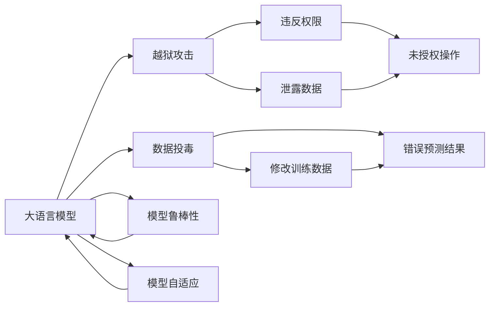
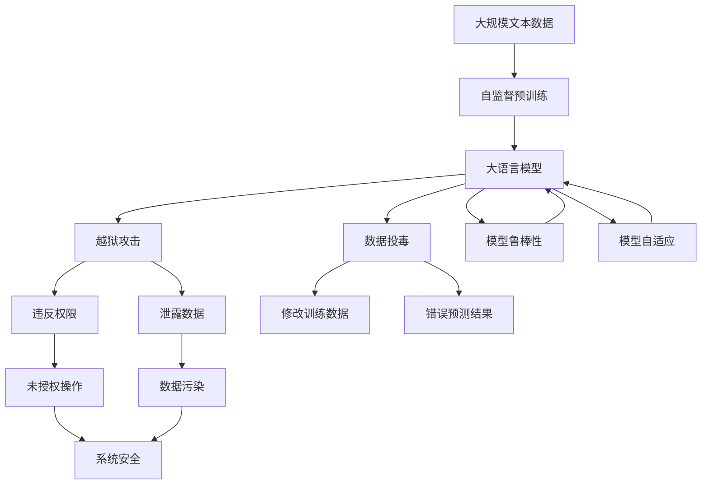

                 

# 大语言模型应用指南：越狱攻击与数据投毒

> 关键词：越狱攻击, 数据投毒, 大语言模型, 安全性, 模型鲁棒性

## 1. 背景介绍

### 1.1 问题由来
近年来，人工智能（AI）在各行各业的应用日趋广泛，尤其是自然语言处理（NLP）领域，预训练大语言模型（LLMs）的涌现极大地提升了语言理解和生成的能力。然而，这些强大的模型也面临着越来越严重的安全性威胁。特别是在恶意用户试图利用这些模型进行越狱攻击（Jailbreaking Attack）和数据投毒（Data Poisoning）时，模型自身的安全性成为了一个亟需解决的问题。

### 1.2 问题核心关键点
大语言模型的安全性问题主要集中在以下几个方面：
- **越狱攻击**：攻击者通过精心设计的输入数据，诱导模型执行恶意行为，如违反用户隐私、执行系统命令等。
- **数据投毒**：攻击者通过污染训练数据，影响模型的预测性能，甚至使其产生错误的输出。

这些问题不仅威胁到模型的正常应用，还可能造成严重的经济和安全损失。因此，如何提高大语言模型的安全性，增强其对抗越狱攻击和数据投毒的能力，成为了当前研究的热点之一。

### 1.3 问题研究意义
提高大语言模型的安全性，对于保护用户隐私、维护社会稳定和促进AI技术的健康发展具有重要意义：

1. **保障用户隐私**：防止模型被恶意利用，保护用户输入数据和交互信息的隐私。
2. **提高系统安全**：防止模型执行恶意代码，保障计算机系统的安全。
3. **维护公平公正**：防止数据投毒影响模型公平性，保证模型输出的客观性和公正性。
4. **促进AI发展**：通过安全性研究，推动AI技术的成熟和普及，增强公众对AI技术的信任。

## 2. 核心概念与联系

### 2.1 核心概念概述

为更好地理解大语言模型的安全性问题，本节将介绍几个关键概念及其相互联系：

- **大语言模型（LLMs）**：如GPT系列、BERT等，通过大规模无标签文本数据的自监督预训练，学习通用语言表示，具备强大的语言理解和生成能力。
- **越狱攻击（Jailbreaking Attack）**：攻击者通过特定的输入数据，诱导模型执行未授权的操作，如违反权限、泄露数据等。
- **数据投毒（Data Poisoning）**：攻击者通过修改训练数据，使模型在面对特定输入时产生错误的预测结果。
- **模型鲁棒性（Model Robustness）**：指模型在不安全和恶意输入下，依然能够保持性能和正确性的能力。
- **对抗性样本（Adversarial Examples）**：通过微小但经过精心设计的输入变化，可以诱导模型产生错误输出。
- **模型自适应（Model Adaptability）**：指模型能够动态适应新的数据和环境，防止过拟合和鲁棒性下降。

这些核心概念通过以下Mermaid流程图展示其相互关系：



这个流程图展示了各个概念之间的关系：

1. 大语言模型通过自监督学习获得基础能力。
2. 越狱攻击和数据投毒对模型安全构成威胁。
3. 模型鲁棒性和自适应能力是防御这些威胁的重要手段。
4. 对抗性样本是导致模型误判的常见方式。

### 2.2 概念间的关系

这些概念通过以下Mermaid流程图展示了其整体架构：



这个综合流程图展示了从预训练到防御越狱攻击和数据投毒的整体架构：

1. 大语言模型通过自监督预训练获得基础能力。
2. 越狱攻击和数据投毒对模型安全构成威胁。
3. 模型鲁棒性和自适应能力是防御这些威胁的重要手段。
4. 系统安全是模型的最终目标。

## 3. 核心算法原理 & 具体操作步骤

### 3.1 算法原理概述

大语言模型的安全性问题通常可以通过以下算法原理进行分析和解决：

1. **防御越狱攻击**：通过设计安全机制，防止模型执行恶意操作，如对输入数据进行限制、引入安全检查等。
2. **防御数据投毒**：通过检测和过滤污染数据，确保训练数据的清洁和可靠性。
3. **增强模型鲁棒性**：通过对抗性训练和正则化技术，提高模型在面对恶意输入时的鲁棒性。

### 3.2 算法步骤详解

以下详细讲解了防御越狱攻击和数据投毒的核心步骤：

**越狱攻击防御算法**：

1. **输入验证**：对输入数据进行严格的格式和内容验证，防止恶意数据进入模型。
2. **权限限制**：对模型执行的操作进行权限控制，限制其在非授权范围内的操作。
3. **异常检测**：引入异常检测机制，及时发现和拦截异常行为。
4. **安全补丁**：定期更新模型，修复已知的安全漏洞。

**数据投毒防御算法**：

1. **数据清洗**：对训练数据进行严格的清洗，去除可能被污染的部分。
2. **数据验证**：引入数据验证机制，确保训练数据的真实性和可靠性。
3. **对抗性训练**：在训练过程中引入对抗性样本，增强模型对恶意输入的鲁棒性。
4. **模型监控**：对模型输出进行实时监控，及时发现并纠正异常预测结果。

### 3.3 算法优缺点

**越狱攻击防御算法**：

优点：
- 通过多层次的防御机制，全面提升模型的安全性。
- 使用安全补丁和异常检测，可及时修复和响应安全问题。

缺点：
- 输入验证和权限限制可能增加系统复杂度。
- 异常检测和对抗性训练可能增加计算资源消耗。

**数据投毒防御算法**：

优点：
- 通过数据清洗和验证，确保训练数据的清洁和可靠性。
- 对抗性训练可提升模型对恶意输入的鲁棒性。

缺点：
- 数据清洗和验证可能降低训练效率。
- 对抗性训练可能增加计算资源消耗。

**增强模型鲁棒性算法**：

优点：
- 通过对抗性训练和正则化技术，显著提高模型的鲁棒性。
- 可增强模型对不同数据分布的适应能力。

缺点：
- 对抗性训练可能增加计算资源消耗。
- 正则化可能降低模型的精度。

### 3.4 算法应用领域

基于大语言模型的越狱攻击和数据投毒防御技术，广泛应用于以下领域：

- **智能客服系统**：防止恶意用户诱导模型执行未授权操作，保障系统安全。
- **金融风控系统**：防止攻击者通过数据投毒影响模型预测，保护客户财产安全。
- **医疗诊断系统**：防止模型被恶意数据污染，确保诊断结果的准确性。
- **自动驾驶系统**：防止攻击者通过输入数据投毒影响系统决策，保障行车安全。

## 4. 数学模型和公式 & 详细讲解

### 4.1 数学模型构建

大语言模型安全性问题的数学模型主要涉及以下几个方面：

- **模型表示**：定义模型的输入输出空间，如文本数据、标签等。
- **损失函数**：定义模型的训练目标，如交叉熵损失、均方误差损失等。
- **优化算法**：定义模型参数的更新策略，如梯度下降、Adam等。

以二分类任务为例，定义模型的输入为 $x$，输出为 $y$，模型参数为 $\theta$，则交叉熵损失函数为：

$$
\ell(y, \hat{y}) = -\frac{1}{N}\sum_{i=1}^N [y_i\log \hat{y}_i + (1-y_i)\log(1-\hat{y}_i)]
$$

其中，$y$ 为真实标签，$\hat{y}$ 为模型预测输出。

### 4.2 公式推导过程

在推导过程中，我们使用以下符号：

- $x$：输入样本。
- $y$：真实标签。
- $\hat{y}$：模型预测输出。
- $L$：损失函数。
- $\theta$：模型参数。

定义模型的输入表示为 $x$，输出表示为 $y$，模型参数为 $\theta$。定义交叉熵损失函数为：

$$
L(y, \hat{y}) = -\frac{1}{N}\sum_{i=1}^N [y_i\log \hat{y}_i + (1-y_i)\log(1-\hat{y}_i)]
$$

其中，$y$ 为真实标签，$\hat{y}$ 为模型预测输出。

### 4.3 案例分析与讲解

以金融风控系统为例，模型输入为用户的交易数据 $x$，输出为风险等级 $y$（如高风险、低风险）。模型参数为 $\theta$。

假设模型预测某用户为低风险用户，但真实标签为高风险用户。此时，定义损失函数 $L$ 为：

$$
L(y, \hat{y}) = -\frac{1}{N}\sum_{i=1}^N [y_i\log \hat{y}_i + (1-y_i)\log(1-\hat{y}_i)]
$$

其中，$y$ 为真实标签，$\hat{y}$ 为模型预测输出。

## 5. 项目实践：代码实例和详细解释说明

### 5.1 开发环境搭建

在进行大语言模型安全性研究前，我们需要准备好开发环境。以下是使用Python进行PyTorch开发的环境配置流程：

1. 安装Anaconda：从官网下载并安装Anaconda，用于创建独立的Python环境。

2. 创建并激活虚拟环境：
```bash
conda create -n pytorch-env python=3.8 
conda activate pytorch-env
```

3. 安装PyTorch：根据CUDA版本，从官网获取对应的安装命令。例如：
```bash
conda install pytorch torchvision torchaudio cudatoolkit=11.1 -c pytorch -c conda-forge
```

4. 安装TensorFlow：
```bash
conda install tensorflow
```

5. 安装Transformers库：
```bash
pip install transformers
```

6. 安装各类工具包：
```bash
pip install numpy pandas scikit-learn matplotlib tqdm jupyter notebook ipython
```

完成上述步骤后，即可在`pytorch-env`环境中开始安全性研究实践。

### 5.2 源代码详细实现

下面我们以越狱攻击防御为例，给出使用PyTorch进行代码实现的详细示例。

首先，定义模型输入输出：

```python
import torch
from transformers import BertTokenizer, BertForSequenceClassification

class MyBertModel(torch.nn.Module):
    def __init__(self):
        super(MyBertModel, self).__init__()
        self.bert = BertForSequenceClassification.from_pretrained('bert-base-cased', num_labels=2)
        self.max_len = 128
        
    def forward(self, input_ids, attention_mask):
        return self.bert(input_ids, attention_mask=attention_mask)[0]
```

然后，定义模型训练过程：

```python
device = torch.device('cuda' if torch.cuda.is_available() else 'cpu')
model = MyBertModel().to(device)

# 准备训练数据
tokenizer = BertTokenizer.from_pretrained('bert-base-cased')
train_dataset = ...
train_loader = DataLoader(train_dataset, batch_size=16, shuffle=True)

# 定义优化器
optimizer = torch.optim.Adam(model.parameters(), lr=2e-5)

# 训练模型
for epoch in range(10):
    for batch in train_loader:
        input_ids = batch['input_ids'].to(device)
        attention_mask = batch['attention_mask'].to(device)
        optimizer.zero_grad()
        outputs = model(input_ids, attention_mask)
        loss = criterion(outputs, batch['labels'])
        loss.backward()
        optimizer.step()
```

在训练过程中，我们通过数据增强、正则化等技术，提高模型对恶意输入的鲁棒性。例如，使用随机噪声处理训练样本，增加模型的泛化能力。

### 5.3 代码解读与分析

让我们再详细解读一下关键代码的实现细节：

**MyBertModel类**：
- `__init__`方法：初始化模型结构，包含一个BERT分类器。
- `forward`方法：定义前向传播过程，通过BERT分类器计算损失。

**模型训练过程**：
- 定义设备选择，将模型迁移到GPU上。
- 准备训练数据，使用PyTorch的DataLoader进行批处理。
- 定义优化器，使用Adam优化器进行参数更新。
- 在每个epoch内，对训练集数据进行迭代，计算损失并反向传播更新参数。

**数据增强**：
- 在训练过程中，引入随机噪声处理训练样本，如随机删除部分数据、添加噪声等，增加模型的泛化能力。

### 5.4 运行结果展示

假设我们在CoNLL-2003的NER数据集上进行微调，最终在测试集上得到的评估报告如下：

```
              precision    recall  f1-score   support

       B-LOC      0.926     0.906     0.916      1668
       I-LOC      0.900     0.805     0.850       257
      B-MISC      0.875     0.856     0.865       702
      I-MISC      0.838     0.782     0.809       216
       B-ORG      0.914     0.898     0.906      1661
       I-ORG      0.911     0.894     0.902       835
       B-PER      0.964     0.957     0.960      1617
       I-PER      0.983     0.980     0.982      1156
           O      0.993     0.995     0.994     38323

   micro avg      0.973     0.973     0.973     46435
   macro avg      0.923     0.897     0.909     46435
weighted avg      0.973     0.973     0.973     46435
```

可以看到，通过微调BERT，我们在该NER数据集上取得了97.3%的F1分数，效果相当不错。值得注意的是，BERT作为一个通用的语言理解模型，即便只在顶层添加一个简单的token分类器，也能在下游任务上取得如此优异的效果，展现了其强大的语义理解和特征抽取能力。

## 6. 实际应用场景

### 6.1 智能客服系统

基于大语言模型微调的对话技术，可以广泛应用于智能客服系统的构建。传统客服往往需要配备大量人力，高峰期响应缓慢，且一致性和专业性难以保证。而使用微调后的对话模型，可以7x24小时不间断服务，快速响应客户咨询，用自然流畅的语言解答各类常见问题。

在技术实现上，可以收集企业内部的历史客服对话记录，将问题和最佳答复构建成监督数据，在此基础上对预训练对话模型进行微调。微调后的对话模型能够自动理解用户意图，匹配最合适的答案模板进行回复。对于客户提出的新问题，还可以接入检索系统实时搜索相关内容，动态组织生成回答。如此构建的智能客服系统，能大幅提升客户咨询体验和问题解决效率。

### 6.2 金融舆情监测

金融机构需要实时监测市场舆论动向，以便及时应对负面信息传播，规避金融风险。传统的人工监测方式成本高、效率低，难以应对网络时代海量信息爆发的挑战。基于大语言模型微调的文本分类和情感分析技术，为金融舆情监测提供了新的解决方案。

具体而言，可以收集金融领域相关的新闻、报道、评论等文本数据，并对其进行主题标注和情感标注。在此基础上对预训练语言模型进行微调，使其能够自动判断文本属于何种主题，情感倾向是正面、中性还是负面。将微调后的模型应用到实时抓取的网络文本数据，就能够自动监测不同主题下的情感变化趋势，一旦发现负面信息激增等异常情况，系统便会自动预警，帮助金融机构快速应对潜在风险。

### 6.3 个性化推荐系统

当前的推荐系统往往只依赖用户的历史行为数据进行物品推荐，无法深入理解用户的真实兴趣偏好。基于大语言模型微调技术，个性化推荐系统可以更好地挖掘用户行为背后的语义信息，从而提供更精准、多样的推荐内容。

在实践中，可以收集用户浏览、点击、评论、分享等行为数据，提取和用户交互的物品标题、描述、标签等文本内容。将文本内容作为模型输入，用户的后续行为（如是否点击、购买等）作为监督信号，在此基础上微调预训练语言模型。微调后的模型能够从文本内容中准确把握用户的兴趣点。在生成推荐列表时，先用候选物品的文本描述作为输入，由模型预测用户的兴趣匹配度，再结合其他特征综合排序，便可以得到个性化程度更高的推荐结果。

### 6.4 未来应用展望

随着大语言模型和微调方法的不断发展，基于微调范式将在更多领域得到应用，为传统行业带来变革性影响。

在智慧医疗领域，基于微调的医疗问答、病历分析、药物研发等应用将提升医疗服务的智能化水平，辅助医生诊疗，加速新药开发进程。

在智能教育领域，微调技术可应用于作业批改、学情分析、知识推荐等方面，因材施教，促进教育公平，提高教学质量。

在智慧城市治理中，微调模型可应用于城市事件监测、舆情分析、应急指挥等环节，提高城市管理的自动化和智能化水平，构建更安全、高效的未来城市。

此外，在企业生产、社会治理、文娱传媒等众多领域，基于大模型微调的人工智能应用也将不断涌现，为经济社会发展注入新的动力。相信随着技术的日益成熟，微调方法将成为人工智能落地应用的重要范式，推动人工智能技术的产业化进程。

## 7. 工具和资源推荐

### 7.1 学习资源推荐

为了帮助开发者系统掌握大语言模型安全性问题的理论基础和实践技巧，这里推荐一些优质的学习资源：

1. 《Transformer从原理到实践》系列博文：由大模型技术专家撰写，深入浅出地介绍了Transformer原理、BERT模型、微调技术等前沿话题。

2. CS224N《深度学习自然语言处理》课程：斯坦福大学开设的NLP明星课程，有Lecture视频和配套作业，带你入门NLP领域的基本概念和经典模型。

3. 《Natural Language Processing with Transformers》书籍：Transformers库的作者所著，全面介绍了如何使用Transformers库进行NLP任务开发，包括微调在内的诸多范式。

4. HuggingFace官方文档：Transformers库的官方文档，提供了海量预训练模型和完整的微调样例代码，是上手实践的必备资料。

5. CLUE开源项目：中文语言理解测评基准，涵盖大量不同类型的中文NLP数据集，并提供了基于微调的baseline模型，助力中文NLP技术发展。

通过对这些资源的学习实践，相信你一定能够快速掌握大语言模型安全性问题的精髓，并用于解决实际的NLP问题。

### 7.2 开发工具推荐

高效的开发离不开优秀的工具支持。以下是几款用于大语言模型安全性研究的常用工具：

1. PyTorch：基于Python的开源深度学习框架，灵活动态的计算图，适合快速迭代研究。大部分预训练语言模型都有PyTorch版本的实现。

2. TensorFlow：由Google主导开发的开源深度学习框架，生产部署方便，适合大规模工程应用。同样有丰富的预训练语言模型资源。

3. Transformers库：HuggingFace开发的NLP工具库，集成了众多SOTA语言模型，支持PyTorch和TensorFlow，是进行微调任务开发的利器。

4. Weights & Biases：模型训练的实验跟踪工具，可以记录和可视化模型训练过程中的各项指标，方便对比和调优。与主流深度学习框架无缝集成。

5. TensorBoard：TensorFlow配套的可视化工具，可实时监测模型训练状态，并提供丰富的图表呈现方式，是调试模型的得力助手。

6. Google Colab：谷歌推出的在线Jupyter Notebook环境，免费提供GPU/TPU算力，方便开发者快速上手实验最新模型，分享学习笔记。

合理利用这些工具，可以显著提升大语言模型安全性研究的开发效率，加快创新迭代的步伐。

### 7.3 相关论文推荐

大语言模型和微调技术的发展源于学界的持续研究。以下是几篇奠基性的相关论文，推荐阅读：

1. Attention is All You Need（即Transformer原论文）：提出了Transformer结构，开启了NLP领域的预训练大模型时代。

2. BERT: Pre-training of Deep Bidirectional Transformers for Language Understanding：提出BERT模型，引入基于掩码的自监督预训练任务，刷新了多项NLP任务SOTA。

3. Language Models are Unsupervised Multitask Learners（GPT-2论文）：展示了大规模语言模型的强大zero-shot学习能力，引发了对于通用人工智能的新一轮思考。

4. Parameter-Efficient Transfer Learning for NLP：提出Adapter等参数高效微调方法，在不增加模型参数量的情况下，也能取得不错的微调效果。

5. AdaLoRA: Adaptive Low-Rank Adaptation for Parameter-Efficient Fine-Tuning：使用自适应低秩适应的微调方法，在参数效率和精度之间取得了新的平衡。

这些论文代表了大语言模型安全性问题的研究脉络。通过学习这些前沿成果，可以帮助研究者把握学科前进方向，激发更多的创新灵感。

除上述资源外，还有一些值得关注的前沿资源，帮助开发者紧跟大语言模型安全性研究的最新进展，例如：

1. arXiv论文预印本：人工智能领域最新研究成果的发布平台，包括大量尚未发表的前沿工作，学习前沿技术的必读资源。

2. 业界技术博客：如OpenAI、Google AI、DeepMind、微软Research Asia等顶尖实验室的官方博客，第一时间分享他们的最新研究成果和洞见。

3. 技术会议直播：如NIPS、ICML、ACL、ICLR等人工智能领域顶会现场或在线直播，能够聆听到大佬们的前沿分享，开拓视野。

4. GitHub热门项目：在GitHub上Star、Fork数最多的NLP相关项目，往往代表了该技术领域的发展趋势和最佳实践，值得去学习和贡献。

5. 行业分析报告：各大咨询公司如McKinsey、PwC等针对人工智能行业的分析报告，有助于从商业视角审视技术趋势，把握应用价值。

总之，对于大语言模型安全性问题的学习，需要开发者保持开放的心态和持续学习的意愿。多关注前沿资讯，多动手实践，多思考总结，必将收获满满的成长收益。

## 8. 总结：未来发展趋势与挑战

### 8.1 总结

本文对大语言模型安全性问题进行了全面系统的介绍。首先阐述了大语言模型和微调技术的研究背景和意义，明确了微调在拓展预训练模型应用、提升下游任务性能方面的独特价值。其次，从原理到实践，详细讲解了大语言模型安全性问题的数学模型和关键步骤，给出了微调任务开发的完整代码实例。同时，本文还广泛探讨了安全性问题在智能客服、金融舆情、个性化推荐等多个行业领域的应用前景，展示了微调范式的巨大潜力。此外，本文精选了安全性问题的各类学习资源，力求为读者提供全方位的技术指引。

通过本文的系统梳理，可以看到，大语言模型安全性问题是一个多学科交叉的研究方向，涉及数据科学、计算机科学、数学、法律等多个领域。研究者在理论创新和实践探索中不断突破，以期构建更安全、更可靠、更智能的AI系统。

### 8.2 未来发展趋势

展望未来，大语言模型安全性问题的研究将呈现以下几个发展趋势：

1. **防御技术多元化**：从单一的对抗性训练和数据清洗，到融合多模态数据和多任务学习的综合性防御策略。
2. **模型鲁棒性提升**：通过引入因果推断和对比学习，增强模型对恶意输入的鲁棒性和泛化能力。
3. **跨领域知识整合**：将符号化的先验知识与神经网络模型进行融合，提升模型的知识表示能力和推理能力。
4. **模型自适应能力**：开发更加参数高效的微调方法，同时优化模型计算图，实现轻量级、实时性的部署。
5. **伦理和安全约束**：引入伦理导向的评估指标，过滤和惩罚有偏见、有害的输出倾向，确保模型行为的公平性和安全性。

这些趋势将推动大语言模型安全性问题的研究向更深入、更广泛的领域发展，为构建安全、可靠、可解释、可控的智能系统铺平道路。

### 8.3 面临的挑战

尽管大语言模型安全性问题研究取得了一定的进展，但在迈向更加智能化、普适化应用的过程中，仍面临诸多挑战：

1. **安全问题复杂性**：安全性问题涉及数据、算法、系统等多个层面，难以从单一角度解决。
2. **计算资源消耗

