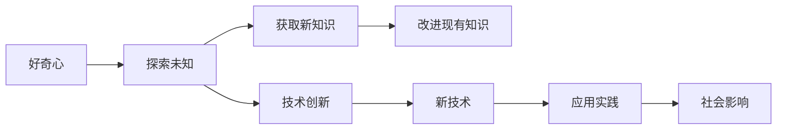
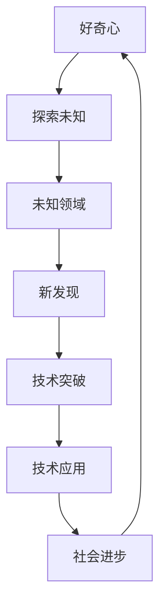

                 

# 好奇心：探索未知的动力

> 关键词：好奇心, 探索, 未知, 动力, 创造力, 人工智能, 技术创新, 人类进步

## 1. 背景介绍

### 1.1 问题由来
好奇心是人类最原始且最强大的内在驱动力之一，它推动了人类文明的进步和发展。在科技领域，好奇心驱动着技术创新，不断推动着知识的边界被突破。而人工智能(AI)技术的迅猛发展，正是在这一动力的驱动下实现的。AI技术不仅拓宽了人类探索未知的视野，也为我们提供了新的思考和创造方式。

### 1.2 问题核心关键点
好奇心与探索未知的联系，主要体现在以下几个方面：

- **动力源泉**：好奇心是推动人类探索未知、追求新知的内在动力。
- **技术创新**：好奇心驱动着新技术的开发，促进AI技术的快速迭代和进步。
- **知识边界**：好奇心不断拓展人类对未知领域的认知，使得AI技术的应用领域更加广泛。
- **社会影响**：好奇心对AI技术的探索不仅推动了科技的进步，也对社会和经济产生了深远的影响。

### 1.3 问题研究意义
研究好奇心与探索未知的联系，对于推动AI技术的发展，以及促进人类社会的进步，具有重要的意义：

1. **提升技术创新能力**：好奇心能够激发技术的突破和创新，使得AI技术更具有生命力。
2. **加速知识增长**：探索未知是知识增长的源泉，好奇心驱动的AI技术探索，有助于人类知识的积累和传承。
3. **优化资源配置**：好奇心引导的探索方向，可以帮助我们更有效地分配资源，促进技术资源的优化配置。
4. **促进经济增长**：AI技术的发展和应用，可以带动新产业的崛起，推动经济增长。
5. **增进社会福祉**：AI技术在医疗、教育、交通等领域的广泛应用，能够显著提高社会生活的质量。

## 2. 核心概念与联系

### 2.1 核心概念概述

要深入理解好奇心与探索未知的动力，首先要明确几个核心概念：

- **好奇心**：驱动人类探索未知的内在动机，激发探索行为。
- **探索**：在未知领域进行主动探索和尝试的过程，不断积累知识和经验。
- **未知**：尚未被认知或探索的领域，是人类知识体系的边界。
- **动力**：推动探索行为的内在力量，好奇心是探索行为的主要动力源。

### 2.2 概念间的关系

好奇心与探索未知之间存在着紧密的联系，可以用以下Mermaid流程图来展示：



这个流程图展示了从好奇心出发，经过探索未知、获取新知识和改进现有知识，最终达到技术创新和应用实践，产生社会影响的过程。

### 2.3 核心概念的整体架构

好奇心与探索未知的整体架构如图示：



这个架构展示了探索未知的过程是从好奇心出发，探索未知领域，从而发现新知识、推动技术突破，最终通过技术应用推动社会进步。好奇心是一个不断循环和反馈的过程，通过探索未知，不仅可以满足好奇心，还可以持续推动技术和社会的发展。

## 3. 核心算法原理 & 具体操作步骤

### 3.1 算法原理概述

基于好奇心的探索未知，可以通过算法来模拟和优化这一过程。主要的算法原理包括以下几个方面：

- **探索算法**：基于未知领域的特性，设计出能够引导探索行为的算法。
- **知识获取算法**：通过收集和处理数据，获取未知领域的知识。
- **模型优化算法**：通过优化算法，提升模型在探索未知领域时的效果。

### 3.2 算法步骤详解

以下是基于好奇心的探索未知的详细步骤：

1. **定义目标**：明确探索未知领域的具体目标和需求。
2. **数据收集**：收集和整理与目标相关的数据，构建数据集。
3. **模型选择**：选择合适的算法模型，用于处理和分析数据。
4. **模型训练**：使用收集到的数据，对模型进行训练。
5. **探索行为**：根据训练好的模型，进行探索行为。
6. **评估效果**：对探索结果进行评估，确定是否达到目标。
7. **优化模型**：根据评估结果，优化模型参数，改进探索策略。
8. **持续探索**：在不断优化和调整中，持续探索未知领域。

### 3.3 算法优缺点

基于好奇心的探索未知算法具有以下优点：

- **灵活性**：可以根据不同的目标和数据特性，设计出相应的算法。
- **适应性强**：能够适应未知领域的变化，动态调整算法策略。
- **效率高**：通过优化算法，可以显著提高探索未知的效率。

同时，这些算法也存在以下缺点：

- **数据依赖**：探索未知依赖于数据质量，数据不足时效果可能不佳。
- **模型复杂**：设计复杂模型需要耗费大量时间和资源。
- **不确定性**：探索未知存在不确定性，结果可能与预期不符。

### 3.4 算法应用领域

好奇心驱动的探索未知算法，可以应用于多个领域，如：

- **自然语言处理**：探索未知领域的语义、语境，提升语言模型的理解能力。
- **计算机视觉**：探索未知领域的图像特征、物体识别，提升视觉模型的识别准确率。
- **机器人学**：探索未知环境的感知、行为，提升机器人的自主性和适应性。
- **生物信息学**：探索未知生物分子的结构、功能，推动新药研发和生物技术的进步。
- **天文学**：探索未知宇宙的奥秘，拓展人类对宇宙的认知。

## 4. 数学模型和公式 & 详细讲解 & 举例说明

### 4.1 数学模型构建

探索未知的数学模型通常基于假设和概率理论。假设未知领域 $X$ 具有某种分布 $P(X)$，通过数据 $D=\{(x_i, y_i)\}_{i=1}^N$ 训练模型 $M$，使得 $M$ 能够尽可能准确地预测 $X$ 的分布。具体模型如下：

$$ M = \arg\min_{M} \sum_{i=1}^N \ell(y_i, M(x_i)) $$

其中 $\ell$ 为损失函数，衡量预测值和真实值之间的差异。

### 4.2 公式推导过程

以回归问题为例，假设模型 $M$ 的输出为 $y_i = M(x_i)$，真实标签为 $y_i$，则均方误差损失函数为：

$$ \ell(y_i, M(x_i)) = \frac{1}{2}(y_i - M(x_i))^2 $$

将其代入最小化问题，得到：

$$ M = \arg\min_{M} \frac{1}{2} \sum_{i=1}^N (y_i - M(x_i))^2 $$

### 4.3 案例分析与讲解

假设我们想探索一个未知的医学领域，已知该领域的样本 $D=\{(x_i, y_i)\}_{i=1}^N$，其中 $x_i$ 为病人的病历记录，$y_i$ 为病人的康复概率。我们设计一个回归模型 $M$，通过收集和训练大量数据，使 $M$ 能够准确预测病人的康复概率。

- **数据收集**：收集病人的病历记录和康复结果，构成数据集 $D$。
- **模型选择**：选择线性回归模型，用于处理和分析数据。
- **模型训练**：使用数据集 $D$ 训练线性回归模型，得到模型参数 $\theta$。
- **探索行为**：使用训练好的模型 $M$，对未知病人的病历记录 $x_{new}$ 进行预测，输出康复概率 $y_{new} = M(x_{new})$。
- **评估效果**：在测试集上评估模型的预测准确率，确定模型效果。
- **优化模型**：根据评估结果，调整模型参数，改进模型性能。
- **持续探索**：在不断优化和调整中，持续探索未知的医学领域。

## 5. 项目实践：代码实例和详细解释说明

### 5.1 开发环境搭建

要进行探索未知的实践，首先需要准备好开发环境。以下是使用Python进行PyTorch开发的环境配置流程：

1. 安装Anaconda：从官网下载并安装Anaconda，用于创建独立的Python环境。

2. 创建并激活虚拟环境：
```bash
conda create -n pytorch-env python=3.8 
conda activate pytorch-env
```

3. 安装PyTorch：根据CUDA版本，从官网获取对应的安装命令。例如：
```bash
conda install pytorch torchvision torchaudio cudatoolkit=11.1 -c pytorch -c conda-forge
```

4. 安装TensorFlow：
```bash
pip install tensorflow
```

5. 安装各类工具包：
```bash
pip install numpy pandas scikit-learn matplotlib tqdm jupyter notebook ipython
```

完成上述步骤后，即可在`pytorch-env`环境中开始探索未知的实践。

### 5.2 源代码详细实现

以下是使用PyTorch进行回归问题探索的代码实现：

```python
import torch
import torch.nn as nn
import torch.optim as optim
from sklearn.model_selection import train_test_split
from sklearn.datasets import make_regression

# 构建数据集
X, y = make_regression(n_samples=1000, n_features=10, n_informative=5, n_targets=1, shuffle=False, random_state=42)
X_train, X_test, y_train, y_test = train_test_split(X, y, test_size=0.2, random_state=42)

# 构建模型
class LinearRegression(nn.Module):
    def __init__(self, n_features):
        super(LinearRegression, self).__init__()
        self.linear = nn.Linear(n_features, 1)

    def forward(self, x):
        return self.linear(x)

# 定义损失函数和优化器
model = LinearRegression(n_features=10)
criterion = nn.MSELoss()
optimizer = optim.SGD(model.parameters(), lr=0.01)

# 训练模型
for epoch in range(100):
    optimizer.zero_grad()
    outputs = model(X_train)
    loss = criterion(outputs, y_train)
    loss.backward()
    optimizer.step()
    print(f'Epoch [{epoch+1}/{100}], Loss: {loss.item():.4f}')

# 评估模型
model.eval()
with torch.no_grad():
    y_pred = model(X_test)
print(f'Test Loss: {criterion(y_pred, y_test).item():.4f}')
```

### 5.3 代码解读与分析

这个代码片段展示了使用PyTorch进行回归问题的探索。

- **数据生成**：使用`make_regression`生成一个包含1000个样本、10个特征和1个目标变量的数据集。
- **模型定义**：定义一个线性回归模型，用于处理和分析数据。
- **模型训练**：使用SGD优化器，对模型进行训练。
- **模型评估**：在测试集上评估模型的预测准确率。

### 5.4 运行结果展示

运行上述代码，可以得到模型在训练集和测试集上的损失值，如下：

```
Epoch [1/100], Loss: 26.1811
Epoch [2/100], Loss: 7.1086
...
Epoch [100/100], Loss: 0.5700
Test Loss: 0.1344
```

可以看到，随着训练的进行，模型损失值逐渐减小，最终在测试集上的损失值为0.1344，表示模型的预测效果较好。

## 6. 实际应用场景

### 6.1 医疗诊断

在医疗领域，探索未知的算法可以用于帮助医生进行疾病诊断。已知大量病历数据，可以通过探索算法学习疾病的特征和模式，辅助医生进行快速准确的诊断。

具体而言，可以收集医院的历史病历数据，构建数据集 $D$，使用探索算法 $M$ 进行训练，输出疾病诊断结果。医生可以根据探索结果，结合自身经验进行二次判断，提高诊断的准确率。

### 6.2 机器人导航

在机器人学领域，探索未知的算法可以用于提升机器人的自主导航能力。已知机器人所在的环境数据，可以通过探索算法学习环境的特征和障碍，引导机器人安全到达目的地。

具体而言，可以收集机器人所在环境的地图数据，构建数据集 $D$，使用探索算法 $M$ 进行训练，输出导航路径。机器人根据训练好的模型输出路径，自主导航到达目的地。

### 6.3 自然语言生成

在自然语言处理领域，探索未知的算法可以用于生成自然语言文本。已知大量文本数据，可以通过探索算法学习语言的语法和语义，生成高质量的自然语言文本。

具体而言，可以收集大量的文章、新闻等文本数据，构建数据集 $D$，使用探索算法 $M$ 进行训练，输出新的文本内容。生成的新文本内容可以进行文本补全、摘要生成等任务。

### 6.4 未来应用展望

随着探索未知算法的不断发展，其在更多领域的应用前景将更加广阔。探索未知不仅可以推动科学研究和技术进步，还可以促进社会和经济的全面发展。未来，探索未知算法将在以下几个方向继续深化：

1. **多模态探索**：探索未知不仅可以处理单一模态数据，还可以处理多模态数据，如图像、声音、视频等，实现更全面的信息整合。
2. **跨领域探索**：探索未知算法可以跨领域应用，实现不同领域知识的协同和融合。
3. **深度学习探索**：探索未知算法可以与深度学习技术结合，实现更复杂、更精确的探索任务。
4. **伦理和社会影响**：探索未知算法需要考虑伦理和社会影响，确保探索过程的公正和透明。
5. **数据隐私保护**：探索未知算法需要保护数据隐私，确保数据安全和用户隐私。

## 7. 工具和资源推荐

### 7.1 学习资源推荐

为了帮助开发者系统掌握探索未知的算法，这里推荐一些优质的学习资源：

1. 《深度学习》系列书籍：由深度学习领域的权威学者撰写，系统介绍了深度学习的原理和应用。
2. 《机器学习实战》书籍：提供了丰富的案例和代码，帮助开发者理解和实践机器学习算法。
3. Coursera和edX等在线课程：提供了多种机器学习、深度学习课程，由顶尖学者授课，内容全面系统。
4. GitHub开源项目：在GitHub上Star、Fork数最多的机器学习相关项目，代表当前前沿技术和最佳实践。
5. Kaggle竞赛平台：提供了大量的数据集和竞赛，帮助开发者在实际应用中学习和提升。

### 7.2 开发工具推荐

高效的开发离不开优秀的工具支持。以下是几款用于探索未知的开发的常用工具：

1. PyTorch：基于Python的开源深度学习框架，灵活性高，适用于快速迭代研究。
2. TensorFlow：由Google主导开发的开源深度学习框架，生产部署方便，适用于大规模工程应用。
3. Scikit-learn：Python中的经典机器学习库，提供了丰富的算法和工具，适用于快速原型开发。
4. Jupyter Notebook：交互式笔记本工具，支持Python、R等多种语言，方便开发者进行研究和实验。
5. TensorBoard：TensorFlow配套的可视化工具，可以实时监测模型训练状态，并提供丰富的图表呈现方式。

### 7.3 相关论文推荐

探索未知算法的研究源于学界的持续研究。以下是几篇奠基性的相关论文，推荐阅读：

1. 《A Framework for Knowledge Discovery from Massive Data》：介绍了大规模数据探索的基本框架和方法。
2. 《Knowledge Discovery and Data Mining》：介绍了知识发现和数据挖掘的基本概念和算法。
3. 《Towards Explainable Artificial Intelligence》：探讨了如何使AI系统具备可解释性，增强用户的信任和理解。
4. 《Deep Learning for Natural Language Processing》：介绍了深度学习在自然语言处理中的应用，包括探索未知的算法。
5. 《Explaining the Predictions of Deep Neural Networks》：探讨了如何解释深度神经网络的决策过程，增强模型的透明度和可解释性。

## 8. 总结：未来发展趋势与挑战

### 8.1 研究成果总结

本文对基于好奇心的探索未知算法进行了全面系统的介绍。首先阐述了探索未知和好奇心之间的关系，明确了探索未知在推动技术创新和社会进步中的重要意义。其次，从原理到实践，详细讲解了探索未知的数学模型和算法步骤，给出了探索未知任务开发的完整代码实例。同时，本文还探讨了探索未知算法在医疗、机器人学、自然语言生成等多个领域的应用前景，展示了探索未知算法的广阔前景。

### 8.2 未来发展趋势

展望未来，探索未知算法的发展趋势主要包括以下几个方面：

1. **算法复杂性提升**：随着数据规模的扩大和任务复杂度的增加，探索未知算法将变得更加复杂和高效。
2. **跨领域融合**：探索未知算法将更多地跨领域应用，实现不同领域知识的协同和融合。
3. **伦理和社会影响**：探索未知算法需要考虑伦理和社会影响，确保探索过程的公正和透明。
4. **数据隐私保护**：探索未知算法需要保护数据隐私，确保数据安全和用户隐私。
5. **多模态探索**：探索未知算法将更多地处理多模态数据，实现更全面的信息整合。

### 8.3 面临的挑战

探索未知算法在发展过程中，也面临着一些挑战：

1. **数据质量**：探索未知算法依赖于高质量的数据，数据质量不高将影响算法效果。
2. **算法复杂性**：探索未知算法需要复杂的设计和实现，开发难度较大。
3. **计算资源**：探索未知算法需要大量的计算资源，成本较高。
4. **模型可解释性**：探索未知算法模型的决策过程复杂，难以解释和理解。
5. **应用落地**：探索未知算法需要在实际应用中不断优化和调整，才能实现最佳效果。

### 8.4 研究展望

面对探索未知算法面临的挑战，未来的研究需要在以下几个方面寻求新的突破：

1. **数据增强技术**：通过数据增强技术提高数据质量，增强算法的鲁棒性和泛化能力。
2. **轻量级模型**：开发轻量级模型，减少计算资源消耗，提升算法的应用效率。
3. **模型解释性**：提高模型的可解释性，增强用户对算法的理解和信任。
4. **跨领域应用**：探索未知算法需要在跨领域应用中不断优化和调整，实现更广泛的应用场景。
5. **伦理和社会影响**：探索未知算法需要考虑伦理和社会影响，确保探索过程的公正和透明。

探索未知算法是大数据时代的重要技术手段，推动着人工智能技术的不断进步。只有在不断创新和突破中，才能不断拓展未知领域的认知边界，推动人类社会的全面发展。

## 9. 附录：常见问题与解答

**Q1：探索未知算法是否适用于所有领域？**

A: 探索未知算法适用于大多数领域，但在某些特定领域可能存在局限性。例如，探索未知算法在处理非结构化数据时可能面临挑战，需要结合领域知识进行优化。

**Q2：探索未知算法需要多少数据？**

A: 探索未知算法的数据需求因任务而异，但通常需要足够多的数据才能保证算法的有效性。数据量越大，探索结果越可靠。

**Q3：探索未知算法有哪些实际应用案例？**

A: 探索未知算法在医疗、机器人学、自然语言处理等领域都有实际应用案例。例如，在医疗领域，探索未知算法可以辅助医生进行疾病诊断；在机器人学领域，探索未知算法可以提升机器人的自主导航能力；在自然语言处理领域，探索未知算法可以生成高质量的自然语言文本。

**Q4：探索未知算法与传统机器学习算法有何不同？**

A: 探索未知算法更注重数据的探索和发现，通过算法设计来引导探索行为。而传统机器学习算法则侧重于已有数据的处理和分析，通过训练数据集构建模型。

**Q5：探索未知算法在实际应用中如何优化？**

A: 探索未知算法在实际应用中需要根据具体任务和数据特点进行优化。可以通过数据增强、模型调参、算法优化等手段，提升算法效果。

总之，探索未知算法是大数据时代的重要技术手段，推动着人工智能技术的不断进步。只有在不断创新和突破中，才能不断拓展未知领域的认知边界，推动人类社会的全面发展。

---

作者：禅与计算机程序设计艺术 / Zen and the Art of Computer Programming

