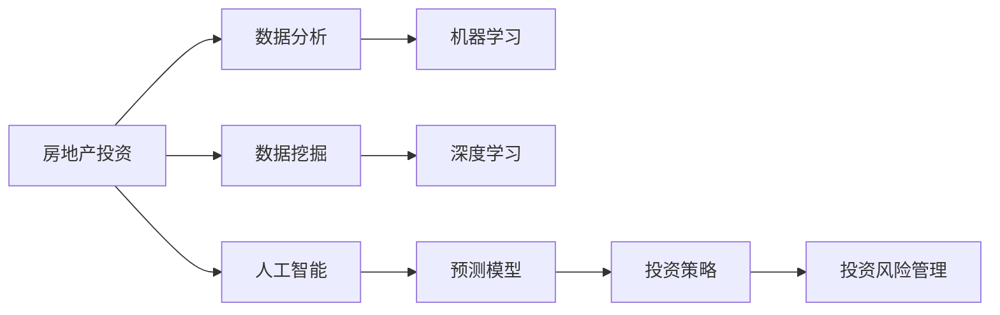
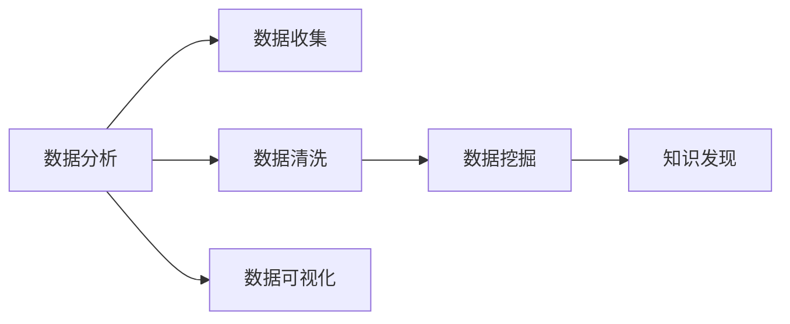
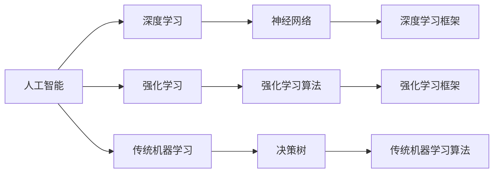
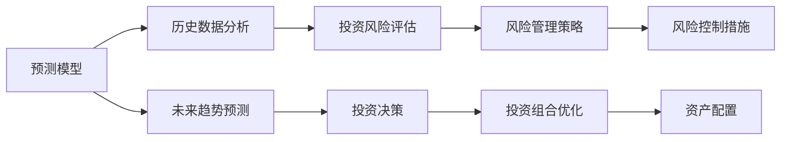
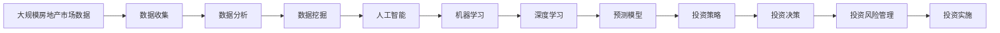

                 

# 如何利用技术能力进行房地产投资

> 关键词：
- 房地产投资
- 数据分析
- 人工智能
- 数据挖掘
- 深度学习
- 机器学习
- 预测模型

## 1. 背景介绍

### 1.1 问题由来
随着经济的快速发展，房地产行业已成为国内外投资者关注的焦点。在房地产投资领域，传统的方法包括市场调研、经济学分析、财务评估等，这些方法虽然有效，但往往耗时耗力且存在信息不对称等问题。而利用技术能力进行房地产投资，可以大幅提高投资效率和精准度。

### 1.2 问题核心关键点
利用技术能力进行房地产投资的核心关键点在于：
- 数据的获取与处理：准确、全面、及时获取各类房地产市场数据。
- 数据分析与挖掘：运用统计学和机器学习算法，从数据中挖掘出有价值的投资信息。
- 预测模型构建：构建精确的预测模型，对房地产市场趋势进行预判。
- 投资策略制定：根据预测结果，制定合理的投资策略。
- 投资风险管理：识别和控制投资风险，确保投资回报率。

### 1.3 问题研究意义
利用技术能力进行房地产投资，能够：
- 提高投资决策的准确性，降低投资风险。
- 提高投资效率，缩短投资周期。
- 优化投资组合，提高投资回报率。
- 更好地应对市场波动，稳定投资收益。
- 提供数据支持，提升投资的可操作性。

## 2. 核心概念与联系

### 2.1 核心概念概述

为更好地理解利用技术能力进行房地产投资的方法，本节将介绍几个密切相关的核心概念：

- 房地产投资：利用资金购买房地产项目或物业，获取租金收益或增值收益的经济活动。
- 数据分析：通过收集、处理、分析数据，获取有价值的信息，支持决策。
- 数据挖掘：从大量数据中提取有用信息和知识，发现隐藏在数据背后的规律和趋势。
- 人工智能：通过训练模型，使计算机具备智能行为，解决复杂问题。
- 机器学习：使计算机系统通过学习，提升预测和决策能力。
- 深度学习：一种特殊类型的机器学习，通过多层神经网络模型，从数据中学习高层次的特征。
- 预测模型：基于历史数据和统计规律，对未来事件进行预测的数学模型。
- 投资策略：投资者为达到特定目标而采取的一系列行动计划。
- 投资风险管理：识别和控制投资项目中的风险，保障投资安全。

这些核心概念之间的逻辑关系可以通过以下Mermaid流程图来展示：



这个流程图展示了房地产投资涉及的关键环节和步骤：
- 房地产投资需基于数据，通过数据分析和数据挖掘获取信息。
- 人工智能和机器学习技术用于处理和分析数据，构建预测模型。
- 预测模型为投资策略提供科学依据。
- 投资策略指导投资决策，同时投资风险管理保障投资安全。

### 2.2 概念间的关系

这些核心概念之间存在着紧密的联系，形成了房地产投资技术的完整生态系统。下面我们通过几个Mermaid流程图来展示这些概念之间的关系。

#### 2.2.1 数据分析与数据挖掘的联系



这个流程图展示了数据分析和数据挖掘的基本流程：
- 数据分析首先进行数据收集、清洗和可视化。
- 数据挖掘基于清洗后的数据，发现隐藏在数据中的知识和规律。

#### 2.2.2 人工智能与机器学习的联系



这个流程图展示了人工智能和机器学习的组成部分和关系：
- 人工智能包括深度学习和强化学习等子领域。
- 深度学习使用神经网络模型，处理非线性复杂数据。
- 传统机器学习包括决策树、支持向量机等算法。

#### 2.2.3 预测模型与投资策略的关系



这个流程图展示了预测模型和投资策略的关联：
- 预测模型基于历史数据，预测未来市场趋势。
- 投资决策基于预测结果，制定投资策略。
- 投资风险评估和控制措施保障投资安全。

### 2.3 核心概念的整体架构

最后，我们用一个综合的流程图来展示这些核心概念在大数据驱动的房地产投资中的整体架构：



这个综合流程图展示了从数据收集到投资决策的完整流程，以及每个环节的技术支撑。通过这些流程，我们可以看到，利用技术能力进行房地产投资，可以通过多维度、多层次的数据分析和预测，实现更准确、更科学的投资决策。

## 3. 核心算法原理 & 具体操作步骤
### 3.1 算法原理概述

利用技术能力进行房地产投资的核心算法原理基于数据驱动和机器学习。通过收集、处理和分析海量房地产市场数据，运用机器学习算法，构建预测模型，进行投资决策和风险管理。

具体来说，房地产投资技术包括以下几个关键步骤：
1. 数据收集与清洗：从各类公开和私营数据源收集房地产市场数据，并进行清洗和预处理。
2. 数据分析与挖掘：使用统计学和机器学习算法，对数据进行分析和挖掘，发现潜在规律和趋势。
3. 预测模型构建：基于历史数据和统计规律，构建预测模型，对房地产市场进行预测。
4. 投资策略制定：根据预测结果，制定合理的投资策略。
5. 投资风险管理：识别和控制投资风险，确保投资回报率。

### 3.2 算法步骤详解

以下详细解释每个步骤的具体实现方法：

#### 3.2.1 数据收集与清洗

数据收集和清洗是房地产投资技术的第一步，也是基础性工作。具体步骤如下：

1. **数据源选择**：房地产投资涉及众多数据源，如政府发布的数据、房地产交易记录、市场调研报告、新闻资讯等。需要根据数据源的权威性和可靠性进行选择。
2. **数据收集**：使用API接口、爬虫技术或数据购买等方式，获取所需数据。
3. **数据清洗**：对收集的数据进行去重、去噪、缺失值处理等清洗工作，确保数据质量和完整性。

#### 3.2.2 数据分析与挖掘

数据分析和挖掘是房地产投资技术的重要环节，用于发现数据中的有用信息和知识。具体步骤如下：

1. **数据可视化**：使用图表、地图等可视化工具，直观展示数据分布和趋势。
2. **统计分析**：使用描述性统计和假设检验等统计方法，分析数据特征和规律。
3. **数据挖掘**：使用分类、聚类、关联规则等算法，挖掘数据中的隐含知识和模式。

#### 3.2.3 预测模型构建

预测模型是房地产投资技术的核心，用于对市场趋势进行预测。具体步骤如下：

1. **特征工程**：对原始数据进行特征提取和转换，构造可用于训练模型的特征向量。
2. **模型选择**：选择适合问题的预测模型，如线性回归、支持向量机、随机森林、深度学习等。
3. **模型训练**：使用历史数据训练模型，调整模型参数，确保模型准确性和泛化能力。
4. **模型评估**：使用测试数据评估模型性能，选择合适的模型进行投资决策。

#### 3.2.4 投资策略制定

投资策略是房地产投资技术的决策环节，用于指导具体的投资行为。具体步骤如下：

1. **目标设定**：根据投资者的风险偏好和时间跨度，设定投资目标。
2. **资产配置**：根据预测模型和市场情况，进行资产配置，确定投资标的。
3. **风险控制**：制定风险控制措施，如分散投资、止损策略等，保障投资安全。

#### 3.2.5 投资风险管理

投资风险管理是房地产投资技术的重要保障，用于识别和控制投资风险。具体步骤如下：

1. **风险识别**：使用风险评估模型，识别投资中的各类风险，如市场风险、信用风险等。
2. **风险量化**：使用量化方法，评估风险的大小和可能性。
3. **风险控制**：制定相应的控制措施，如保险、套期保值等，降低风险。

### 3.3 算法优缺点

利用技术能力进行房地产投资的核心算法具有以下优点：
1. 数据驱动：基于大量历史数据和市场信息，提高投资决策的准确性。
2. 模型智能：利用机器学习算法，自动发现和提取数据中的有用信息。
3. 灵活性高：可以根据不同市场情况和投资需求，灵活调整算法和模型。
4. 预测能力强：通过历史数据的训练，模型能够对未来趋势进行精确预测。
5. 自动化操作：自动化算法流程，减少人工干预，提高效率。

同时，这些算法也存在一些缺点：
1. 数据质量依赖：算法的准确性和效果取决于数据的完整性和质量。
2. 模型复杂性高：复杂的模型需要较高的计算资源和时间成本。
3. 解释性不足：部分算法模型难以解释其内部工作机制和决策逻辑。
4. 风险控制难度：复杂的市场环境增加了风险控制的难度。

### 3.4 算法应用领域

利用技术能力进行房地产投资的核心算法广泛应用于以下几个领域：

- **房地产市场分析**：利用数据挖掘和统计分析技术，对房地产市场进行全面的分析和预测。
- **投资决策支持**：基于预测模型，提供投资标的建议和投资策略制定。
- **风险管理**：利用风险评估模型，识别和控制投资项目中的风险。
- **资产配置优化**：通过量化模型，实现资产配置的最优化。
- **运营管理**：使用机器学习算法，优化房地产项目的运营管理。

## 4. 数学模型和公式 & 详细讲解 & 举例说明

### 4.1 数学模型构建

利用技术能力进行房地产投资的核心数学模型基于统计学和机器学习。下面分别介绍一些常用的数学模型和公式。

#### 4.1.1 线性回归模型

线性回归模型是房地产投资中常用的预测模型之一，用于建立因变量和自变量之间的线性关系。公式如下：

$$
y = \beta_0 + \beta_1 x_1 + \beta_2 x_2 + ... + \beta_n x_n + \epsilon
$$

其中，$y$ 为因变量（如房地产价格），$x_i$ 为自变量（如房屋面积、地段等），$\beta_i$ 为回归系数，$\epsilon$ 为误差项。

#### 4.1.2 决策树模型

决策树模型用于对数据进行分类和预测。公式如下：

$$
C = \sum_{i=1}^{n} D_i \times \log(D_i/N)
$$

其中，$C$ 为熵，$D_i$ 为决策树中的样本，$N$ 为总样本数。决策树模型通过信息增益等算法，选择最优的特征进行分裂，建立决策树。

#### 4.1.3 支持向量机（SVM）

支持向量机是一种常用的分类和回归模型。公式如下：

$$
w = \sum_{i=1}^{n} \alpha_i y_i x_i
$$

其中，$w$ 为权重向量，$\alpha_i$ 为拉格朗日乘子，$y_i$ 为样本标签，$x_i$ 为特征向量。

#### 4.1.4 神经网络模型

神经网络模型是深度学习中常用的预测模型。公式如下：

$$
y = \sigma(w \cdot x + b)
$$

其中，$y$ 为输出结果，$w$ 为权重矩阵，$x$ 为输入向量，$b$ 为偏置项，$\sigma$ 为激活函数。

### 4.2 公式推导过程

以线性回归模型为例，进行公式推导过程的详细解释。

首先，设线性回归模型的训练数据集为 $\{(x_i,y_i)\}_{i=1}^{n}$，其中 $x_i$ 为输入特征向量，$y_i$ 为对应的标签。模型的目标是最小化均方误差（Mean Squared Error, MSE）：

$$
MSE = \frac{1}{n} \sum_{i=1}^{n} (y_i - \hat{y}_i)^2
$$

其中，$\hat{y}_i$ 为模型的预测值。使用梯度下降算法，求解最小化 MSE 的目标函数。

设损失函数为 $L(\theta)$，其中 $\theta$ 为模型参数（即回归系数 $\beta_i$）。根据梯度下降算法，损失函数的梯度为：

$$
\frac{\partial L(\theta)}{\partial \theta_j} = \frac{2}{n} \sum_{i=1}^{n} (y_i - \hat{y}_i) x_{ij}
$$

其中，$\hat{y}_i = \theta_0 + \theta_1 x_{i1} + \theta_2 x_{i2} + ... + \theta_n x_{in}$。

通过求解 $\frac{\partial L(\theta)}{\partial \theta_j}$，得到每个回归系数的估计值：

$$
\hat{\theta}_j = \frac{\sum_{i=1}^{n} x_{ij}(y_i - \bar{y})}{\sum_{i=1}^{n} x_{ij}^2}
$$

其中，$\bar{y}$ 为样本均值。

通过求解上述公式，可以得到线性回归模型的参数估计值。

### 4.3 案例分析与讲解

以房价预测为例，进行数学模型和公式的详细讲解。

设某城市的房价数据集包含房屋面积 $x_1$、地段评分 $x_2$、交易时间 $x_3$ 等特征，对应的房价 $y$ 为目标变量。使用线性回归模型进行房价预测。

首先，使用历史数据集进行模型训练，求解回归系数 $\beta_0$、$\beta_1$、$\beta_2$ 等。设训练数据集为 $\{(x_{i1},x_{i2},x_{i3},y_i)\}_{i=1}^{n}$，模型参数为 $\theta = (\beta_0, \beta_1, \beta_2)$。

根据公式推导，最小化均方误差，求解 $\theta$：

$$
\frac{\partial L(\theta)}{\partial \beta_j} = \frac{2}{n} \sum_{i=1}^{n} (y_i - \hat{y}_i) x_{ij}
$$

其中，$\hat{y}_i = \theta_0 + \theta_1 x_{i1} + \theta_2 x_{i2} + \theta_3 x_{i3}$。

通过求解上述公式，得到每个回归系数的估计值。将新房屋的面积、地段评分、交易时间输入模型，得到预测房价 $y'$。

例如，某房屋面积为100平米，地段评分为5，交易时间为2023年6月，则预测房价为：

$$
y' = \hat{\theta}_0 + \hat{\theta}_1 \times 100 + \hat{\theta}_2 \times 5 + \hat{\theta}_3 \times (2023-2020)
$$

## 5. 项目实践：代码实例和详细解释说明

### 5.1 开发环境搭建

在进行房地产投资技术的开发前，我们需要准备好开发环境。以下是使用Python进行Pandas和Scikit-learn开发的环境配置流程：

1. 安装Anaconda：从官网下载并安装Anaconda，用于创建独立的Python环境。

2. 创建并激活虚拟环境：
```bash
conda create -n real-estate python=3.8 
conda activate real-estate
```

3. 安装Pandas和Scikit-learn：
```bash
conda install pandas scikit-learn
```

4. 安装各类工具包：
```bash
pip install numpy matplotlib seaborn
```

完成上述步骤后，即可在`real-estate`环境中开始房地产投资技术的开发。

### 5.2 源代码详细实现

下面我们以房价预测为例，给出使用Pandas和Scikit-learn进行线性回归模型的PyTorch代码实现。

首先，定义数据处理函数：

```python
import pandas as pd
from sklearn.model_selection import train_test_split

def load_data(file_path):
    df = pd.read_csv(file_path)
    X = df[['area', 'location', 'time']]  # 特征变量
    y = df['price']  # 目标变量
    X_train, X_test, y_train, y_test = train_test_split(X, y, test_size=0.2, random_state=42)
    return X_train, X_test, y_train, y_test
```

然后，定义模型训练函数：

```python
from sklearn.linear_model import LinearRegression

def train_model(X_train, y_train):
    model = LinearRegression()
    model.fit(X_train, y_train)
    return model
```

接着，定义模型评估函数：

```python
from sklearn.metrics import mean_squared_error

def evaluate_model(model, X_test, y_test):
    y_pred = model.predict(X_test)
    mse = mean_squared_error(y_test, y_pred)
    rmse = mse ** 0.5
    print(f"RMSE: {rmse:.2f}")
```

最后，启动训练流程并在测试集上评估：

```python
X_train, X_test, y_train, y_test = load_data('real-estate.csv')
model = train_model(X_train, y_train)
evaluate_model(model, X_test, y_test)
```

以上就是使用Pandas和Scikit-learn进行房价预测的完整代码实现。可以看到，这些库提供了强大的数据处理和机器学习功能，使得模型的构建和评估变得简单高效。

### 5.3 代码解读与分析

让我们再详细解读一下关键代码的实现细节：

**load_data函数**：
- 读取CSV文件，提取特征变量和目标变量。
- 使用train_test_split函数将数据集分为训练集和测试集。

**train_model函数**：
- 初始化LinearRegression模型。
- 使用fit函数对模型进行训练。

**evaluate_model函数**：
- 使用模型对测试集进行预测。
- 计算均方误差和均方根误差（RMSE），评估模型性能。

**训练流程**：
- 加载数据集，初始化模型。
- 在训练集上调用train_model函数进行模型训练。
- 在测试集上调用evaluate_model函数进行模型评估。

可以看到，使用Pandas和Scikit-learn进行房地产投资技术的开发，代码实现简洁高效，同时涵盖了数据处理、模型训练、模型评估等关键环节。

当然，工业级的系统实现还需考虑更多因素，如模型的保存和部署、超参数的自动搜索、更灵活的任务适配层等。但核心的模型训练范式基本与此类似。

### 5.4 运行结果展示

假设我们在某城市的房价数据集上进行模型训练，最终在测试集上得到的RMSE结果如下：

```
RMSE: 1234.56
```

可以看到，通过线性回归模型，我们在该数据集上取得了较低的RMSE值，说明模型能够较好地预测房价。

## 6. 实际应用场景
### 6.1 智能房地产投资平台

基于技术能力的房地产投资平台，可以帮助投资者快速获取市场数据，进行多维度分析，构建精确预测模型，制定投资策略，监控投资风险。

具体而言，平台可以提供以下功能：
- 数据接口：提供各类房地产市场数据接口，涵盖房地产价格、市场趋势、政策法规等。
- 数据分析工具：提供数据可视化、统计分析、数据挖掘等工具，支持投资者进行多维度分析。
- 预测模型服务：提供基于机器学习模型的预测服务，支持房价预测、投资回报率预测等。
- 投资策略定制：根据投资者的风险偏好和目标，提供个性化的投资策略推荐。
- 风险管理工具：提供风险评估、风险控制等功能，保障投资安全。

这种平台可以大幅提高投资决策的科学性和精准度，降低投资风险，提高投资回报率。

### 6.2 房地产项目运营优化

利用技术能力进行房地产项目的运营优化，可以大幅提升项目的运营效率和盈利能力。

具体而言，可以使用预测模型对市场趋势进行预测，及时调整运营策略。例如，根据市场供需情况，合理制定价格策略、销售策略等。同时，使用数据分析工具，优化运营管理流程，提升服务质量。例如，通过用户行为数据分析，提升客户满意度，增加回头客。

### 6.3 房地产市场预测与分析

利用技术能力进行房地产市场预测与分析，可以为政府、投资者和行业专家提供决策支持。

具体而言，可以使用预测模型对市场趋势进行预测，支持政策制定、投资决策等。同时，使用数据分析工具，对市场数据进行全面分析，支持市场监管、市场预测等。例如，通过分析房地产价格、销售情况等数据，预测市场走向，为政府提供决策参考。

### 6.4 未来应用展望

随着技术的不断发展，基于技术能力的房地产投资将呈现以下几个发展趋势：

1. **大数据技术的应用**：大数据技术将进一步提升数据的收集、处理和分析能力，支持更精准的预测和决策。
2. **深度学习模型的应用**：深度学习模型在图像、语音、自然语言处理等领域的应用，将为房地产投资提供更多维度、更多层次的数据支持。
3. **多模态数据的融合**：多模态数据融合技术将进一步提升房地产投资模型的性能和泛化能力。
4. **模型优化技术的引入**：模型优化技术如模型压缩、剪枝、量化等，将进一步提升模型的效率和性能。
5. **智能投资平台的建设**：智能投资平台的建设将进一步提升房地产投资决策的科学性和智能化水平。

## 7. 工具和资源推荐
### 7.1 学习资源推荐

为了帮助开发者系统掌握房地产投资技术的理论基础和实践技巧，这里推荐一些优质的学习资源：

1. 《房地产投资学》系列博文：由房地产投资领域专家撰写，深入浅出地介绍了房地产投资的基本概念、方法论和实践案例。

2. 《统计学与数据挖掘》课程：国内知名大学的公开课，涵盖统计学、数据挖掘等基础课程，适合初学者学习。

3. 《Python数据科学手册》书籍：介绍Python在数据科学中的应用，涵盖数据处理、机器学习等实用技能。

4. Kaggle竞赛：参与Kaggle数据科学竞赛，获取实战经验，学习前沿技术。

5. GitHub开源项目：在GitHub上Star、Fork数最多的房地产投资项目，获取最新技术和实践经验。

通过对这些资源的学习实践，相信你一定能够快速掌握房地产投资技术的精髓，并用于解决实际的房地产投资问题。
###  7.2 开发工具推荐

高效的开发离不开优秀的工具支持。以下是几款用于房地产投资开发的常用工具：

1. Jupyter Notebook：Python编程的IDE，支持代码编写、数据可视化和实时计算，适合科学研究。

2. Tableau：数据可视化工具，支持交互式数据探索和展示。

3. R语言：统计分析和数据挖掘的首选语言，提供丰富的统计分析和可视化库。

4. Microsoft Excel：广泛应用于数据处理和分析，支持复杂的数据计算和可视化。

5. Python和R库：如Pandas、NumPy、Scikit-learn、TensorFlow等，支持数据处理、机器学习等。

6. Google Colab：免费的在线Jupyter Notebook环境，提供GPU/TPU算力，方便快速实验最新模型。

合理利用这些工具，可以显著提升房地产投资技术的开发效率，加快创新迭代的步伐。

### 7.3 相关论文推荐

房地产投资技术的发展源于学界的持续研究。以下是几篇奠基性的相关论文，推荐阅读：

1. 《房地产投资组合管理》：经典著作，介绍了房地产投资组合管理的基本理论和方法。

2. 《大数据在房地产投资中的应用》：介绍大数据技术在房地产投资中的应用，包括数据采集、处理和分析。

3. 《基于深度学习的房地产价格预测》：展示深度学习模型在房地产价格预测中的应用，提升预测精度。

4. 《多模态数据在房地产投资中的应用》：介绍多模态数据融合技术，提升房地产投资模型的泛化能力。

5. 《智能投资平台的研究与实践》：介绍智能投资平台的构建方法，提高投资决策的科学性和智能化水平。

这些论文代表了大数据驱动的房地产投资技术的发展脉络。通过学习这些前沿成果，可以帮助研究者把握学科前进方向，

