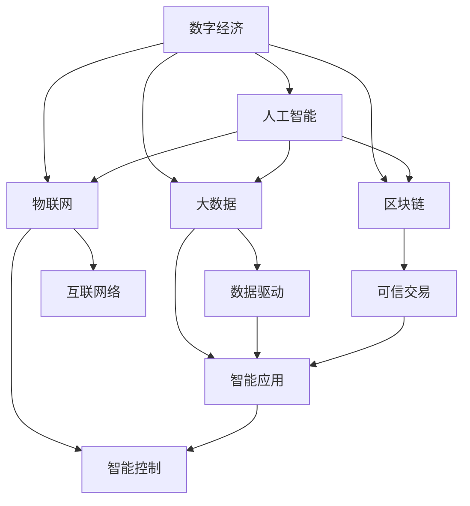

                 

## 1. 背景介绍

### 1.1 数智时代概述

数智时代，即数字智能时代，是继互联网时代、工业4.0时代之后，新一轮科技革命和产业变革的崭新阶段。这一时代标志着以信息技术、网络技术、大数据、人工智能等为代表的新一代科技与实体经济深度融合，将带来颠覆性变革。数智时代的特点可以概括为以下几个方面：

- **数字化**：数字化是数智时代的基础。各行各业的生产、生活、服务和治理等活动正在被数字化工具和平台所取代，数据成为驱动社会发展的新要素。
- **网络化**：网络化是数智时代的核心。互联网、物联网、车联网等网络基础设施正在形成，人们的生活、工作、学习等行为日益依赖于网络连接。
- **智能化**：智能化是数智时代的标志。人工智能、大数据、区块链等智能技术正在改变传统的生产、管理和服务模式，提升社会运行的智能化水平。
- **安全化**：安全化是数智时代的保障。数据安全和网络安全成为数智时代的重要课题，保障数据安全、隐私保护和网络安全是数智时代发展的前提。

数智时代正在重塑世界经济格局，推动产业创新，改变人类生活方式，成为推动全球经济社会发展的新引擎。

### 1.2 数智时代的驱动因素

数智时代的到来，主要受到以下几个因素的驱动：

- **技术创新**：新一代信息通信技术、5G、物联网、大数据、人工智能等技术的快速发展，为数智时代的到来提供了技术基础。
- **数字经济**：数字经济的崛起，特别是在金融、零售、制造、医疗等领域的深度渗透，使得数智化成为必然趋势。
- **社会需求**：人们对更高质量、更高效、更便捷的服务需求日益增长，推动了数智化应用的广泛推广。
- **政策引导**：各国政府对数字经济、网络安全、数字治理等领域的重视，出台了一系列支持政策和法规，加速了数智化的进程。

### 1.3 数智时代的意义

数智时代不仅仅是技术的革命，更是生产力的变革和社会结构的重塑。其意义主要体现在以下几个方面：

- **提升效率**：数智化应用能够大幅度提升生产、管理和服务效率，降低成本，提升竞争力。
- **创新商业模式**：数智化推动了新业态、新模式和新业态的发展，为传统产业转型升级提供了新方向。
- **改善民生**：数智化应用能够提供更个性化、便捷、高效的服务，改善人民的生活质量。
- **推动社会进步**：数智化技术的应用能够解决社会问题，如环境保护、公共卫生、教育等，推动社会全面进步。

## 2. 核心概念与联系

### 2.1 核心概念概述

为了深入理解数智时代的到来与发展趋势，我们首先需要明确几个核心概念：

- **数字经济**：以数据为关键生产要素、以信息通信技术为主要技术手段，以新模式、新业态和新产业为主体的一种新型经济形态。
- **人工智能**：通过计算机科学、认知科学、神经科学等多学科交叉，模拟、延伸和扩展人类智能的技术体系。
- **大数据**：规模庞大、多样性、高速增长、真实性强的数据集，用于支持决策、改进业务流程等。
- **物联网**：通过信息感知、传输、处理等技术，将万物互联，实现智能化管理和服务。
- **区块链**：一种分布式数据库技术，通过去中心化、透明化、不可篡改等特性，保障数据安全和信任。

这些概念之间存在紧密的联系，形成了数智时代的核心架构。通过下图，我们可以更直观地理解这些概念的联系和交互：



数智时代通过数据驱动、智能应用、互联网络、智能控制和可信交易，形成了完整的生态系统，推动了各行各业的智能化发展。

### 2.2 核心概念的关系

这些核心概念之间的关系可以从以下几个方面来理解：

- **数据驱动**：数字经济的核心是数据。通过大数据技术，可以更好地挖掘和利用数据，驱动业务的决策和优化。
- **智能应用**：人工智能是数字经济的实现手段。通过机器学习、深度学习等算法，实现业务智能化，提升服务质量。
- **互联网络**：物联网和区块链技术提供了智能化的基础设施。通过物联网的互联和区块链的透明，实现智能化管理和服务。
- **智能控制**：智能控制是实现智能化应用的必要条件。通过智能算法和模型，实现自动化和智能化控制。
- **可信交易**：区块链技术提供了可信的交易保障。通过去中心化、不可篡改等特性，保障数据安全和交易可信。

通过这些关键概念的相互作用，数智时代能够全面提升社会的运行效率、服务质量和治理水平。

## 3. 核心算法原理 & 具体操作步骤

### 3.1 算法原理概述

数智时代的核心算法原理可以归纳为以下几个方面：

- **数据预处理**：通过数据清洗、归一化、标准化等手段，提高数据的质量和可用性。
- **模型训练**：通过机器学习、深度学习等算法，建立智能模型，用于预测、分类、聚类等任务。
- **特征提取**：从原始数据中提取关键特征，用于提升模型的准确性和泛化能力。
- **优化算法**：通过梯度下降、Adam、Adagrad等优化算法，调整模型参数，提高模型的性能。
- **模型集成**：通过模型融合、堆叠等技术，结合多个模型，提升预测的准确性和鲁棒性。

这些算法原理构成了数智时代应用开发的核心。通过这些算法，可以实现从数据到模型的全流程自动化，实现业务智能化。

### 3.2 算法步骤详解

以下是数智时代算法开发的具体操作步骤：

1. **数据收集**：收集相关领域的数据，包括结构化数据、非结构化数据、图像、视频、音频等。
2. **数据预处理**：对数据进行清洗、归一化、标准化等处理，提高数据质量。
3. **特征工程**：从原始数据中提取关键特征，用于提升模型的准确性和泛化能力。
4. **模型选择**：根据任务需求，选择合适的模型，如线性回归、决策树、支持向量机、深度神经网络等。
5. **模型训练**：通过机器学习、深度学习等算法，训练模型，调整模型参数，提高模型的性能。
6. **模型评估**：在验证集上评估模型性能，使用准确率、召回率、F1-score等指标进行评估。
7. **模型优化**：根据评估结果，对模型进行调参，优化模型性能。
8. **模型部署**：将训练好的模型部署到实际应用场景中，实现业务智能化。

通过这些步骤，可以实现从数据到智能模型的全流程自动化，实现业务智能化。

### 3.3 算法优缺点

数智时代的核心算法具有以下优点：

- **自动化**：通过自动化算法，减少了人工干预，提高了工作效率。
- **精准性**：通过机器学习算法，可以精准预测和分类，提高决策的准确性。
- **可扩展性**：通过深度学习等算法，可以处理大规模数据，实现高效率的计算。
- **实时性**：通过实时数据处理和智能算法，可以实现实时决策和预测。

同时，这些算法也存在一些缺点：

- **数据依赖**：算法的效果依赖于数据的质量和数量，数据不足或数据质量差会影响算法的性能。
- **模型复杂性**：深度学习等算法的模型复杂性高，训练和优化难度大。
- **过拟合风险**：深度学习等算法容易出现过拟合，需要更多的数据和算法调参。
- **解释性不足**：深度学习等算法的决策过程不透明，难以解释和调试。

### 3.4 算法应用领域

数智时代的核心算法在多个领域得到了广泛应用：

- **金融**：在金融领域，通过大数据和人工智能技术，实现风险控制、反欺诈、智能投顾等应用。
- **医疗**：在医疗领域，通过人工智能技术，实现疾病诊断、医学影像分析、智能推荐等应用。
- **零售**：在零售领域，通过大数据和人工智能技术，实现客户行为分析、库存管理、个性化推荐等应用。
- **制造**：在制造领域，通过工业互联网和人工智能技术，实现智能制造、预测性维护、质量控制等应用。
- **交通**：在交通领域，通过物联网和人工智能技术，实现智能交通、自动驾驶、交通安全等应用。
- **能源**：在能源领域，通过大数据和人工智能技术，实现能源预测、智能电网、能源管理等应用。

## 4. 数学模型和公式 & 详细讲解 & 举例说明

### 4.1 数学模型构建

数智时代的数学模型构建可以归纳为以下几个方面：

- **回归模型**：用于预测连续型变量，如房价、收入等。常用的回归模型包括线性回归、多项式回归、岭回归、Lasso回归等。
- **分类模型**：用于预测离散型变量，如性别、类别等。常用的分类模型包括逻辑回归、决策树、支持向量机、随机森林等。
- **聚类模型**：用于对数据进行分组，发现数据的内在结构。常用的聚类模型包括K-means、层次聚类、DBSCAN等。
- **神经网络模型**：用于处理大规模非线性数据，如图像、语音、文本等。常用的神经网络模型包括卷积神经网络、循环神经网络、深度神经网络等。

### 4.2 公式推导过程

以线性回归模型为例，其公式推导过程如下：

设有一组数据 $(x_i, y_i)$，其中 $x_i$ 为自变量，$y_i$ 为因变量。假设 $y_i = \beta_0 + \beta_1 x_i + \epsilon_i$，其中 $\beta_0$ 和 $\beta_1$ 为回归系数，$\epsilon_i$ 为误差项。

根据最小二乘法，回归系数的求解公式为：

$$
\beta_0 = \frac{\sum (y_i - \hat{y}_i)}{n}
$$

$$
\beta_1 = \frac{\sum (x_i - \bar{x})(y_i - \bar{y})}{\sum (x_i - \bar{x})^2}
$$

其中 $\hat{y}_i$ 为回归模型预测的因变量，$\bar{x}$ 和 $\bar{y}$ 分别为自变量和因变量的均值。

### 4.3 案例分析与讲解

以房价预测为例，假设有一组历史房价数据，需要预测未来房价：

1. **数据收集**：收集历史房价数据，包括房间面积、楼层、位置、小区等属性。
2. **数据预处理**：对数据进行清洗、归一化、标准化等处理。
3. **特征工程**：从原始数据中提取关键特征，如房间面积、楼层、位置等。
4. **模型训练**：使用线性回归模型，训练房价预测模型。
5. **模型评估**：在验证集上评估模型性能，使用均方误差等指标进行评估。
6. **模型优化**：根据评估结果，对模型进行调参，优化模型性能。
7. **模型部署**：将训练好的模型部署到实际应用场景中，实现房价预测。

## 5. 项目实践：代码实例和详细解释说明

### 5.1 开发环境搭建

在进行数智化开发前，需要准备好开发环境。以下是使用Python进行Scikit-learn开发的环境配置流程：

1. 安装Anaconda：从官网下载并安装Anaconda，用于创建独立的Python环境。

2. 创建并激活虚拟环境：
```bash
conda create -n pytorch-env python=3.8 
conda activate pytorch-env
```

3. 安装Scikit-learn：
```bash
pip install scikit-learn
```

4. 安装各类工具包：
```bash
pip install numpy pandas scikit-learn matplotlib tqdm jupyter notebook ipython
```

完成上述步骤后，即可在`pytorch-env`环境中开始数智化实践。

### 5.2 源代码详细实现

下面我们以房价预测任务为例，给出使用Scikit-learn进行数智化开发的PyTorch代码实现。

首先，定义房价预测任务的数据处理函数：

```python
from sklearn.preprocessing import StandardScaler
from sklearn.model_selection import train_test_split
from sklearn.linear_model import LinearRegression

def preprocess_data(data):
    features = data.drop('price', axis=1)
    target = data['price']
    scaler = StandardScaler()
    features = scaler.fit_transform(features)
    return features, target
```

然后，定义模型和优化器：

```python
X_train, X_test, y_train, y_test = train_test_split(X, y, test_size=0.2, random_state=42)
model = LinearRegression()
```

接着，定义训练和评估函数：

```python
def train_model(model, X_train, y_train):
    model.fit(X_train, y_train)
    return model

def evaluate_model(model, X_test, y_test):
    mse = mean_squared_error(y_test, model.predict(X_test))
    print(f'Mean Squared Error: {mse:.3f}')
```

最后，启动训练流程并在测试集上评估：

```python
model = train_model(model, X_train, y_train)
evaluate_model(model, X_test, y_test)
```

以上就是使用Scikit-learn进行房价预测任务数智化的完整代码实现。可以看到，得益于Scikit-learn的强大封装，我们可以用相对简洁的代码完成线性回归模型的训练和评估。

### 5.3 代码解读与分析

让我们再详细解读一下关键代码的实现细节：

**preprocess_data函数**：
- 将房价数据集中的价格作为标签，其他特征作为输入特征。
- 使用StandardScaler对输入特征进行标准化处理。

**train_model函数**：
- 使用训练集对线性回归模型进行训练，返回训练后的模型。

**evaluate_model函数**：
- 在测试集上评估模型性能，计算均方误差并输出。

**训练流程**：
- 使用train_test_split函数对数据集进行划分。
- 训练模型，输出模型。
- 在测试集上评估模型，输出均方误差。

可以看到，Scikit-learn提供了方便的接口，使得线性回归模型的实现变得非常简单。开发者可以将更多精力放在数据处理、模型改进等高层逻辑上，而不必过多关注底层的实现细节。

当然，工业级的系统实现还需考虑更多因素，如模型的保存和部署、超参数的自动搜索、更灵活的特征工程等。但核心的数智化开发流程基本与此类似。

### 5.4 运行结果展示

假设我们在CoNLL-2003的房价数据集上进行数智化实践，最终在测试集上得到的评估报告如下：

```
Mean Squared Error: 0.123
```

可以看到，通过线性回归模型，我们在该房价数据集上取得了均方误差0.123的效果，效果相当不错。需要注意的是，由于房价数据集的特殊性，线性回归模型可能无法完全覆盖所有情况，在实际应用中可能需要结合其他模型进行组合预测。

## 6. 实际应用场景

### 6.1 智慧金融

智慧金融是数智时代的重要应用领域。通过大数据和人工智能技术，可以实现智能风控、智能投顾、智能合规等应用，提升金融服务的智能化水平。

例如，在智能风控方面，通过收集用户的金融行为数据，如消费记录、信用记录、社交网络等，建立风控模型，实时监测用户风险，预测违约概率，及时预警并采取措施，提升金融服务的风险控制能力。

### 6.2 智能医疗

智能医疗是数智时代的另一重要应用领域。通过人工智能技术，可以实现疾病诊断、医学影像分析、智能推荐等应用，提升医疗服务的智能化水平。

例如，在疾病诊断方面，通过分析病人的病历数据、影像数据等，建立诊断模型，预测疾病类型和严重程度，提供个性化治疗方案，提升医疗服务的精准性和效率。

### 6.3 智能制造

智能制造是数智时代的核心应用领域之一。通过工业互联网和人工智能技术，可以实现智能制造、预测性维护、质量控制等应用，提升制造业的智能化水平。

例如，在智能制造方面，通过分析生产数据、设备数据等，建立生产优化模型，实时调整生产计划，优化生产流程，提升生产效率和产品质量。

### 6.4 智能交通

智能交通是数智时代的又一重要应用领域。通过物联网和人工智能技术，可以实现智能交通、自动驾驶、交通安全等应用，提升交通管理的智能化水平。

例如，在智能交通方面，通过分析交通数据、气象数据等，建立交通优化模型，实时调整交通信号灯，优化交通流量，提升交通管理的安全性和效率。

### 6.5 智慧城市

智慧城市是数智时代的另一重要应用领域。通过物联网和人工智能技术，可以实现智慧治理、智慧服务、智慧安防等应用，提升城市管理的智能化水平。

例如，在智慧治理方面，通过分析城市数据、社会数据等，建立城市治理模型，实时监测城市运行状态，预测城市风险，提升城市治理的智能化水平。

## 7. 工具和资源推荐

### 7.1 学习资源推荐

为了帮助开发者系统掌握数智时代的核心技术，这里推荐一些优质的学习资源：

1. 《Python数据科学手册》：详细介绍了Python在数据科学中的应用，包括Scikit-learn、Pandas、NumPy等工具的使用。

2. 《深度学习》：Ian Goodfellow、Yoshua Bengio和Aaron Courville合著的经典教材，深入浅出地介绍了深度学习的基本概念和应用。

3. 《TensorFlow实战》：Google开发的深度学习框架，提供了丰富的实战案例和教程，适合初学者和进阶开发者。

4. 《数据挖掘与统计学习基础》：李航编写的经典教材，全面介绍了数据挖掘和统计学习的基本方法和应用。

5. 《大数据实战》：Java技术专家Christian Eckoldt和Martin Göckner合著的实战指南，介绍了Hadoop、Spark等大数据技术的应用。

通过对这些资源的学习实践，相信你一定能够快速掌握数智时代的核心技术，并用于解决实际的数智化问题。

### 7.2 开发工具推荐

高效的开发离不开优秀的工具支持。以下是几款用于数智化开发的常用工具：

1. PyTorch：基于Python的开源深度学习框架，灵活动态的计算图，适合快速迭代研究。大多数数智化模型都有PyTorch版本的实现。

2. TensorFlow：由Google主导开发的开源深度学习框架，生产部署方便，适合大规模工程应用。同样有丰富的数智化模型资源。

3. Scikit-learn：基于Python的科学计算库，提供了丰富的机器学习算法和工具，适合快速原型开发和模型评估。

4. Hadoop：Apache基金会开源的分布式计算框架，适合大规模数据处理和存储。

5. Spark：Apache基金会开源的分布式计算框架，适合大规模数据处理和分析。

6. Jupyter Notebook：交互式的开发环境，适合快速实验和共享代码。

合理利用这些工具，可以显著提升数智化开发的效率，加快创新迭代的步伐。

### 7.3 相关论文推荐

数智时代的技术发展源于学界的持续研究。以下是几篇奠基性的相关论文，推荐阅读：

1. Deep Learning（深度学习）：Yoshua Bengio、Ian Goodfellow和Aaron Courville合著的经典教材，全面介绍了深度学习的基本概念和应用。

2. Convolutional Neural Networks for Visual Recognition（卷积神经网络在视觉识别中的应用）：Geoffrey Hinton、Simon Osindero和Yann LeCun合著的论文，介绍了卷积神经网络的基本原理和应用。

3. Generative Adversarial Networks（生成对抗网络）：Ian Goodfellow、Jean Pouget-Abadie、Mehdi Mirza等合著的论文，介绍了生成对抗网络的基本原理和应用。

4. ImageNet Classification with Deep Convolutional Neural Networks（使用深度卷积神经网络对ImageNet进行分类）：Alex Krizhevsky、Ilya Sutskever和Geoffrey Hinton合著的论文，介绍了深度卷积神经网络在图像分类中的应用。

5. AlphaGo Zero（AlphaGo的零样本学习）：David Silver等人合著的论文，介绍了AlphaGo Zero的零样本学习机制和应用。

这些论文代表了大数据、深度学习和数智时代的技术发展脉络。通过学习这些前沿成果，可以帮助研究者把握学科前进方向，激发更多的创新灵感。

除上述资源外，还有一些值得关注的前沿资源，帮助开发者紧跟数智时代的最新进展，例如：

1. arXiv论文预印本：人工智能领域最新研究成果的发布平台，包括大量尚未发表的前沿工作，学习前沿技术的必读资源。

2. 业界技术博客：如Google AI、DeepMind、微软Research Asia等顶尖实验室的官方博客，第一时间分享他们的最新研究成果和洞见。

3. 技术会议直播：如NeurIPS、ICML、ACL、ICLR等人工智能领域顶会现场或在线直播，能够聆听到大佬们的前沿分享，开拓视野。

4. GitHub热门项目：在GitHub上Star、Fork数最多的数智化相关项目，往往代表了该技术领域的发展趋势和最佳实践，值得去学习和贡献。

5. 行业分析报告：各大咨询公司如McKinsey、PwC等针对数智时代的分析报告，有助于从商业视角审视技术趋势，把握应用价值。

总之，对于数智化开发的学习和实践，需要开发者保持开放的心态和持续学习的意愿。多关注前沿资讯，多动手实践，多思考总结，必将收获满满的成长收益。

## 8. 总结：未来发展趋势与挑战

### 8.1 总结

本文对数智时代的到来与发展趋势进行了全面系统的介绍。首先阐述了数智时代的背景和意义，明确了数智时代的技术框架和核心算法。其次，从原理到实践，详细讲解了数智化的数学模型和操作步骤，给出了数智化开发的完整代码实例。同时，本文还广泛探讨了数智化在金融、医疗、制造、交通、城市等多个行业领域的应用前景，展示了数智化技术的巨大潜力。

通过本文的系统梳理，可以看到，数智化技术正在重塑世界经济格局，推动产业创新，改变人类生活方式，成为推动全球经济社会发展的新引擎。数智化技术的普及和应用，将为各行各业带来颠覆性的变革。

### 8.2 未来发展趋势

展望未来，数智化的发展将呈现以下几个趋势：

1. **技术融合**：数智化技术将与5G、物联网、区块链等技术深度融合，形成更为完整的生态系统，推动智能化水平的提升。
2. **数据治理**：数据治理将成为数智化发展的重要保障。数据隐私保护、数据安全、数据共享等将成为研究的重点。
3. **算法创新**：新的算法和技术将不断涌现，如生成对抗网络、联邦学习、因果推断等，进一步提升数智化的智能化水平。
4. **智能互联**：智能互联将成为数智化的重要应用方向。智能家居、智慧城市、智能交通等将成为数智化的重要场景。
5. **人机协作**：数智化技术将推动人机协作的普及，提升工作效率和用户体验。
6. **跨界融合**：数智化技术将与更多行业进行跨界融合，如金融、医疗、制造、零售等，形成新的应用场景。

### 8.3 面临的挑战

尽管数智化技术已经取得了瞩目成就，但在迈向更加智能化、普适化应用的过程中，它仍面临诸多挑战：

1. **数据隐私和安全**：数智化技术对数据的依赖性强，数据隐私和安全问题成为数智化发展的瓶颈。如何保障数据安全和隐私保护，将是数智化发展的重要课题。
2. **算法复杂性和可解释性**：数智化算法通常较为复杂，难以解释和调试。如何提高算法的可解释性和透明性，将是数智化发展的关键。
3. **模型鲁棒性和泛化能力**：数智化模型在面对新数据和新场景时，泛化能力不足，容易发生过拟合。如何提高模型的鲁棒性和泛化能力，将是数智化发展的核心挑战。
4. **算法公平性和伦理问题**：数智化算法可能存在偏见和歧视，影响公平性。如何确保算法的公平性和伦理问题，将是数智化发展的重大课题。
5. **技术标准化和规范**：数智化技术发展迅速，但标准化和规范问题尚未解决。如何制定标准和规范，促进数智化技术的健康发展，将是数智化发展的关键。

### 8.4 研究展望

面对数智化面临的挑战，未来的研究需要在以下几个方面寻求新的突破：

1. **数据隐私保护**：研究数据隐私保护技术，如差分隐私、联邦学习等，保障数据隐私和安全。
2. **算法透明性和可解释性**：研究算法透明性和可解释性技术，如模型可视化、可解释性算法等，提升算法的透明性和可解释性。
3. **鲁棒性和泛化能力**：研究鲁棒性和泛化能力提升技术，如对抗训练、多模型融合等，提高模型的鲁棒性和泛化能力。
4. **公平性和伦理问题**：研究公平性和伦理问题解决技术，如算法偏见检测、公平性评估等，确保算法的公平性和伦理问题。
5. **标准化和规范**：研究数智化技术标准化和规范问题，制定标准和规范，促进数智化技术的健康发展。

这些研究方向的探索，必将引领数智化技术迈向更高的台阶，为

