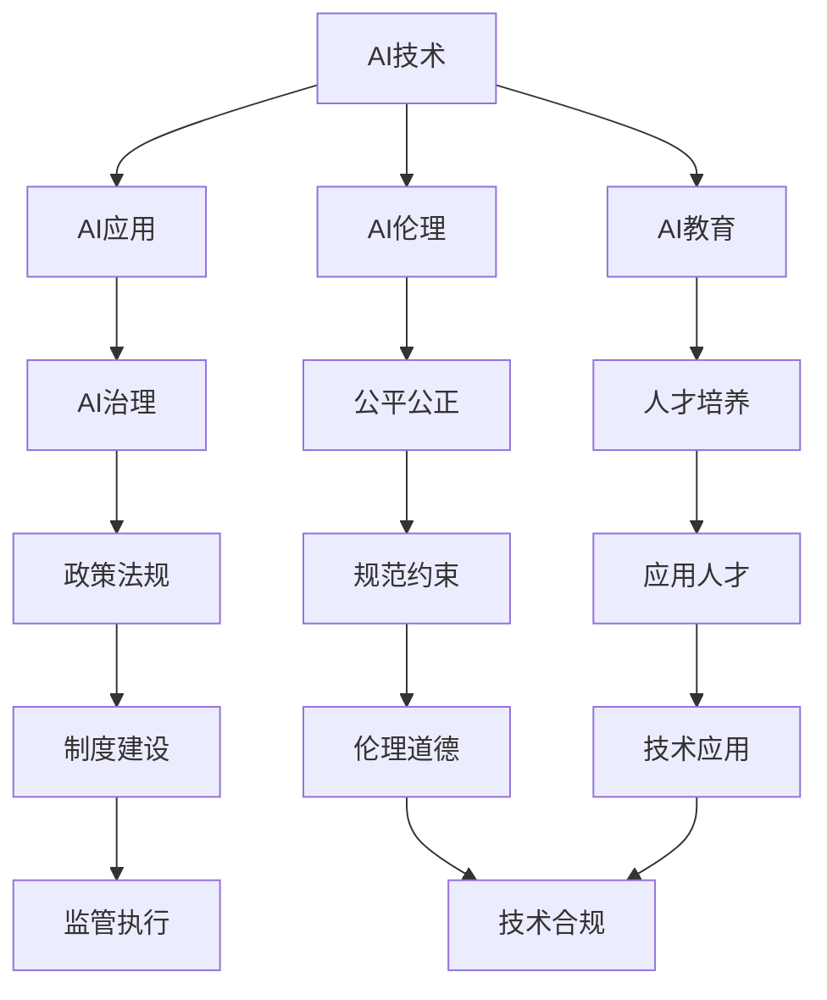
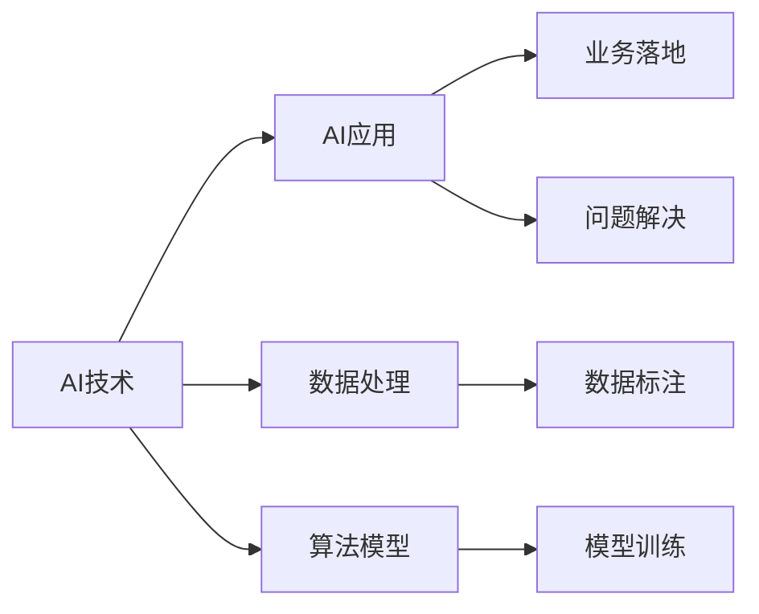
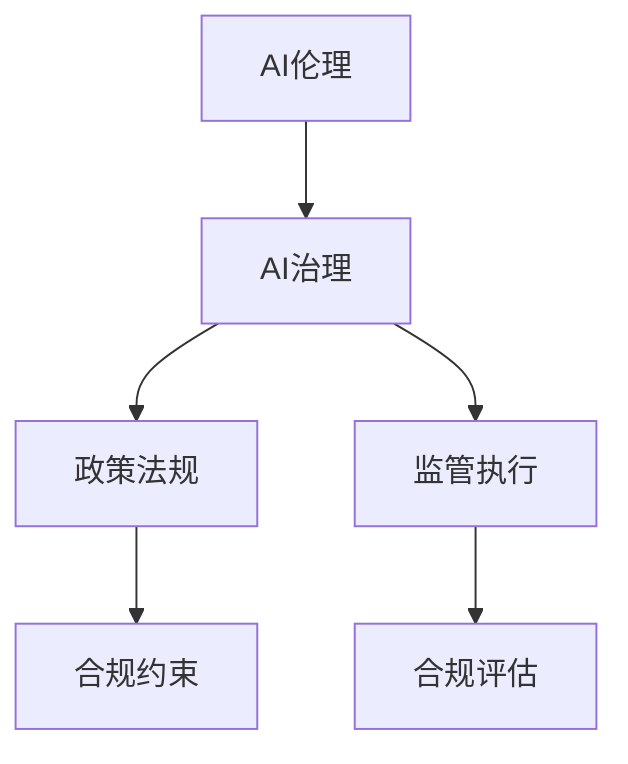
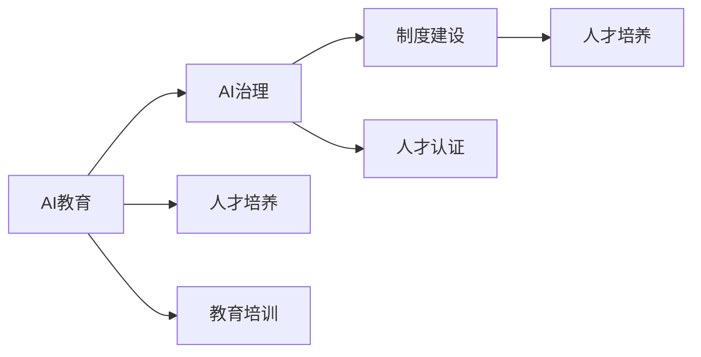
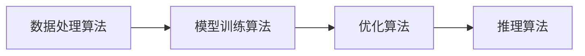

                 

# 李开复：AI 2.0 时代的生态

> 关键词：人工智能,2.0时代,生态系统,技术创新,应用场景

## 1. 背景介绍

### 1.1 问题由来
随着人工智能技术的迅猛发展，我们正迎来AI 2.0时代。在这一时代，人工智能技术从初步应用阶段迈向广泛渗透和深度融合的阶段，成为各行各业的基础设施和生产力工具。然而，AI 2.0时代也面临着诸多挑战和机遇，需要全社会共同努力，构建一个健康、开放的生态系统，推动人工智能技术的可持续发展。

### 1.2 问题核心关键点
AI 2.0时代的核心问题是如何在技术发展的同时，实现技术应用与伦理道德、社会责任的平衡。具体而言，以下几个方面需要重点关注：
- 技术创新与人才培养：如何持续推动AI技术的突破，同时培养足够数量、高质量的AI人才。
- 应用落地与产业升级：如何有效将AI技术应用到实际业务中，推动各行各业的数字化转型和产业升级。
- 生态构建与合作共赢：如何构建一个开放的AI生态系统，促进技术创新、应用落地的协同发展，实现合作共赢。
- 伦理道德与社会影响：如何在技术应用中遵循伦理道德规范，关注AI技术对社会生活的影响，保障公平正义。

### 1.3 问题研究意义
构建一个健康的AI生态系统，对于推动AI技术的健康发展、实现全社会的共同利益具有重要意义：
- 促进技术创新：开放、共享的生态系统有助于技术突破和知识共享，加速AI技术的发展。
- 提升应用效果：良性的生态系统可以提供丰富的应用场景和成功案例，为AI技术落地提供借鉴。
- 确保伦理安全：通过规范和约束，保障AI技术的伦理道德，避免技术滥用和伦理风险。
- 实现可持续发展：AI技术的可持续发展需要政府、企业、学界的共同努力，构建一个多方共赢的生态系统。

## 2. 核心概念与联系

### 2.1 核心概念概述

在AI 2.0时代，构建一个健康的AI生态系统，需要明确以下几个核心概念：

- **AI技术**：涵盖机器学习、深度学习、自然语言处理、计算机视觉、机器人学等技术领域。
- **AI应用**：将AI技术应用到各行各业，如医疗、金融、教育、制造、物流等。
- **AI伦理**：遵循伦理道德规范，确保AI技术的公平、公正、透明、安全。
- **AI教育**：培养AI领域的人才，包括数据科学家、机器学习工程师、AI产品经理等。
- **AI治理**：制定政策法规，规范AI技术的开发与应用，确保其健康发展。

这些核心概念之间的关系可以通过以下Mermaid流程图来展示：



这个流程图展示了AI生态系统的各个组件及其相互关系：
- AI技术是生态系统的核心，提供各种技术工具和算法支持。
- AI应用是技术应用的具体场景，涵盖各行各业。
- AI伦理是技术应用的道德准则，保障技术应用的公平、公正。
- AI教育是技术发展的人才基础，确保有足够数量、高质量的人才。
- AI治理是技术应用的政策保障，提供规范和制度支持。

### 2.2 概念间的关系

这些核心概念之间存在着紧密的联系，形成了一个有机整体。以下通过几个Mermaid流程图来展示这些概念之间的关系：

#### 2.2.1 AI技术与AI应用的联系



这个流程图展示了AI技术与AI应用之间的关系：
- AI技术通过数据处理和算法模型训练，为AI应用提供技术支持。
- AI应用通过数据标注和模型训练，获取技术解决方案。

#### 2.2.2 AI伦理与AI治理的联系



这个流程图展示了AI伦理与AI治理之间的关系：
- AI伦理为AI治理提供道德规范和约束。
- AI治理通过政策法规和监管执行，确保AI技术的合规使用。

#### 2.2.3 AI教育与AI治理的联系



这个流程图展示了AI教育与AI治理之间的关系：
- AI教育为AI治理提供人才支持。
- AI治理通过制度建设和人才培养，确保AI技术的应用效果。

### 2.3 核心概念的整体架构

最后，我们用一个综合的流程图来展示这些核心概念在AI 2.0时代生态系统中的整体架构：


这个综合流程图展示了从AI技术到AI应用，再到AI伦理、AI教育和AI治理的整个生态系统。通过这些核心概念的协同作用，构建一个健康、开放的AI生态系统，推动AI技术的可持续发展。

## 3. 核心算法原理 & 具体操作步骤
### 3.1 算法原理概述

在AI 2.0时代，构建AI生态系统的核心算法主要包括：
- **数据处理算法**：用于清洗、标注、预处理数据，为AI应用提供数据支持。
- **模型训练算法**：用于构建和训练AI模型，提高模型精度和泛化能力。
- **优化算法**：用于优化模型参数，提升模型训练效率和性能。
- **推理算法**：用于将训练好的模型部署到实际应用中，进行预测和推理。

这些算法通过高效的数据处理、模型训练、优化和推理，共同支撑AI应用的落地和优化。以下通过几个Mermaid流程图来展示这些算法的关系：



### 3.2 算法步骤详解

以下是构建AI生态系统的具体操作步骤：

**Step 1: 数据收集与处理**
- 收集相关数据，如文本、图像、音频等，进行清洗、标注和预处理，生成高质量的数据集。
- 使用数据增强技术，如回译、旋转、裁剪等，扩充训练数据集。

**Step 2: 模型设计与训练**
- 设计合适的AI模型结构，如卷积神经网络、循环神经网络、Transformer等。
- 选择合适的优化算法，如Adam、SGD等，设定学习率、批次大小、迭代轮数等超参数。
- 使用模型训练算法，通过反向传播和梯度下降等方法，最小化损失函数，训练出高质量的AI模型。

**Step 3: 模型优化与调优**
- 使用优化算法，如正则化、Dropout、Early Stopping等，防止模型过拟合。
- 调整模型超参数，进行网格搜索、随机搜索等优化，寻找最优模型。
- 使用验证集评估模型性能，调整模型结构和参数，提升模型泛化能力。

**Step 4: 模型部署与推理**
- 将训练好的模型部署到实际应用中，使用推理算法进行预测和推理。
- 监控模型性能，及时发现并解决推理过程中的问题。
- 定期更新模型参数，保持模型性能的持续提升。

### 3.3 算法优缺点

AI生态系统的核心算法具有以下优缺点：
- **优点**：
  - 高效的数据处理和模型训练，为AI应用提供可靠的技术支持。
  - 优化算法和推理算法，确保模型的高效、高性能。
  - 多轮迭代和调优，提高模型的精度和泛化能力。
- **缺点**：
  - 数据处理和标注需要大量人力和时间成本。
  - 模型训练和优化过程复杂，需要较高的计算资源。
  - 推理过程依赖于硬件设备和资源，可能导致性能瓶颈。

### 3.4 算法应用领域

AI生态系统的核心算法在各个应用领域都有广泛的应用：
- **医疗领域**：通过图像识别、自然语言处理等技术，实现疾病诊断、病情监测、智能问诊等。
- **金融领域**：通过数据挖掘、机器学习等技术，实现信用评估、风险控制、量化交易等。
- **教育领域**：通过自然语言理解、计算机视觉等技术，实现智能教育、作业批改、个性化推荐等。
- **制造领域**：通过机器视觉、机器人学等技术，实现智能制造、质量检测、故障预测等。
- **物流领域**：通过计算机视觉、深度学习等技术，实现仓储管理、智能配送、路径规划等。

## 4. 数学模型和公式 & 详细讲解 & 举例说明

### 4.1 数学模型构建

在AI 2.0时代，构建AI生态系统的数学模型包括：
- **数据处理模型**：用于处理和表示数据，如文本向量化、图像特征提取等。
- **模型训练模型**：用于训练和优化模型，如反向传播算法、梯度下降算法等。
- **优化模型**：用于优化模型参数，如L1正则化、L2正则化、Dropout等。
- **推理模型**：用于推理和预测，如Softmax函数、决策树等。

### 4.2 公式推导过程

以下以文本分类为例，推导逻辑回归模型的训练过程。

**输入**：文本数据 $x = (x_1, x_2, ..., x_n)$，标签数据 $y = (y_1, y_2, ..., y_n)$。

**输出**：模型参数 $\theta = (w_1, w_2, ..., w_n)$，分类器 $h_{\theta}(x)$。

**损失函数**：使用交叉熵损失函数，定义如下：

$$
J(\theta) = -\frac{1}{N} \sum_{i=1}^N [y_i \log h_{\theta}(x_i) + (1-y_i) \log (1-h_{\theta}(x_i))]
$$

**训练过程**：
1. 初始化模型参数 $\theta$。
2. 对每个样本 $(x_i, y_i)$ 进行前向传播，计算分类器输出 $h_{\theta}(x_i)$。
3. 计算损失函数 $J(\theta)$。
4. 使用梯度下降算法，计算梯度 $\nabla_{\theta}J(\theta)$。
5. 更新模型参数 $\theta$，使用迭代公式：

$$
\theta = \theta - \alpha \nabla_{\theta}J(\theta)
$$

其中 $\alpha$ 为学习率，$\alpha$ 的选择需要根据具体情况进行调整。

### 4.3 案例分析与讲解

假设我们有一组电影评论数据，需要训练一个逻辑回归模型进行情感分类。使用Python和Scikit-learn库进行实现：

```python
from sklearn.feature_extraction.text import TfidfVectorizer
from sklearn.linear_model import LogisticRegression
from sklearn.metrics import accuracy_score

# 加载数据
train_data = ...
train_labels = ...
test_data = ...
test_labels = ...

# 文本向量化
vectorizer = TfidfVectorizer()
train_features = vectorizer.fit_transform(train_data)
test_features = vectorizer.transform(test_data)

# 训练模型
model = LogisticRegression(solver='liblinear', C=1.0)
model.fit(train_features, train_labels)

# 评估模型
test_features = vectorizer.transform(test_data)
test_labels = test_features.predict(model)
accuracy = accuracy_score(test_labels, test_labels)
print('Accuracy:', accuracy)
```

以上代码展示了从数据预处理到模型训练和评估的完整流程。通过使用TF-IDF向量化和逻辑回归算法，我们能够快速构建和训练一个情感分类模型。

## 5. 项目实践：代码实例和详细解释说明

### 5.1 开发环境搭建

在进行AI项目开发前，我们需要准备好开发环境。以下是使用Python进行TensorFlow开发的环境配置流程：

1. 安装Anaconda：从官网下载并安装Anaconda，用于创建独立的Python环境。

2. 创建并激活虚拟环境：
```bash
conda create -n tensorflow-env python=3.8 
conda activate tensorflow-env
```

3. 安装TensorFlow：根据CUDA版本，从官网获取对应的安装命令。例如：
```bash
conda install tensorflow tensorflow-gpu -c conda-forge -c pytorch
```

4. 安装相关工具包：
```bash
pip install numpy pandas scikit-learn matplotlib tensorflow
```

5. 安装TensorBoard：用于可视化模型训练过程和结果。

6. 安装Weights & Biases：用于记录和可视化模型训练过程。

完成上述步骤后，即可在`tensorflow-env`环境中开始项目开发。

### 5.2 源代码详细实现

下面我们以图像分类为例，使用TensorFlow对ResNet模型进行训练和推理的Python代码实现。

首先，定义模型和优化器：

```python
import tensorflow as tf
from tensorflow.keras.layers import Conv2D, BatchNormalization, Activation, MaxPooling2D, Flatten, Dense
from tensorflow.keras.optimizers import Adam

# 定义ResNet模型
def ResNet(input_shape):
    # 第一层卷积
    conv1 = Conv2D(64, (3, 3), padding='same', activation='relu', input_shape=input_shape)
    bn1 = BatchNormalization()
    conv1 = conv1(bn1)

    # 第二层卷积
    conv2 = Conv2D(64, (3, 3), padding='same', activation='relu')
    bn2 = BatchNormalization()
    conv2 = conv2(bn2)

    # 第三层池化
    pool1 = MaxPooling2D(pool_size=(2, 2))
    conv2 = pool1(conv2)

    # 第四层卷积
    conv3 = Conv2D(128, (3, 3), padding='same', activation='relu')
    bn3 = BatchNormalization()
    conv3 = conv3(bn3)

    # 第五层卷积
    conv4 = Conv2D(128, (3, 3), padding='same', activation='relu')
    bn4 = BatchNormalization()
    conv4 = conv4(bn4)

    # 第六层池化
    pool2 = MaxPooling2D(pool_size=(2, 2))
    conv4 = pool2(conv4)

    # 第七层卷积
    conv5 = Conv2D(256, (3, 3), padding='same', activation='relu')
    bn5 = BatchNormalization()
    conv5 = conv5(bn5)

    # 第八层卷积
    conv6 = Conv2D(256, (3, 3), padding='same', activation='relu')
    bn6 = BatchNormalization()
    conv6 = conv6(bn6)

    # 第九层池化
    pool3 = MaxPooling2D(pool_size=(2, 2))
    conv6 = pool3(conv6)

    # 第十层全连接
    flatten = Flatten()
    dense1 = Dense(512, activation='relu')
    dense2 = Dense(10, activation='softmax')

    return tf.keras.Sequential([
        conv1, bn1, conv2, bn2, pool1, conv3, bn3, conv4, bn4, pool2, conv5, bn5, conv6, bn6, pool3, dense1, dense2
    ])

# 加载数据
(x_train, y_train), (x_test, y_test) = tf.keras.datasets.cifar10.load_data()
x_train = x_train.astype('float32') / 255.0
x_test = x_test.astype('float32') / 255.0

# 定义模型
model = ResNet(input_shape=(32, 32, 3))

# 定义损失函数和优化器
loss_fn = tf.keras.losses.SparseCategoricalCrossentropy()
optimizer = Adam(lr=0.001)

# 定义评估指标
accuracy = tf.keras.metrics.Accuracy()

# 定义训练函数
def train_step(x, y):
    with tf.GradientTape() as tape:
        logits = model(x, training=True)
        loss = loss_fn(y, logits)
    gradients = tape.gradient(loss, model.trainable_variables)
    optimizer.apply_gradients(zip(gradients, model.trainable_variables))
    accuracy.update_state(y, logits)
    return loss

# 定义评估函数
def evaluate_step(x, y):
    logits = model(x, training=False)
    return loss_fn(y, logits), accuracy(y, logits)

# 训练模型
num_epochs = 50
batch_size = 64
for epoch in range(num_epochs):
    for i in range(0, len(x_train), batch_size):
        x_batch = x_train[i:i+batch_size]
        y_batch = y_train[i:i+batch_size]
        loss = train_step(x_batch, y_batch)
        accuracy.reset_states()
        test_loss, test_accuracy = evaluate_step(x_test, y_test)
        print(f'Epoch {epoch+1}/{num_epochs}, Loss: {loss}, Accuracy: {accuracy.result().numpy()}, Test Loss: {test_loss}, Test Accuracy: {test_accuracy}')
```

以上代码展示了从模型定义到训练和评估的完整流程。通过使用TensorFlow，我们能够快速构建和训练一个图像分类模型。

### 5.3 代码解读与分析

让我们再详细解读一下关键代码的实现细节：

**ResNet模型定义**：
- 定义了ResNet模型的各个层，包括卷积、池化、全连接等。
- 使用Sequential模型将各层连接起来，形成完整的模型结构。

**数据加载**：
- 使用CIFAR-10数据集进行数据加载，将数据归一化处理。

**损失函数和优化器定义**：
- 定义了交叉熵损失函数和Adam优化器，设置学习率。

**评估指标定义**：
- 使用Accuracy评估指标，记录模型的准确率。

**训练函数定义**：
- 定义了训练步骤，使用梯度下降算法更新模型参数，并更新评估指标。

**评估函数定义**：
- 定义了评估步骤，计算模型在测试集上的损失和准确率。

**训练循环**：
- 定义训练循环，进行多轮训练和评估，输出各轮的损失和准确率。

### 5.4 运行结果展示

假设我们在CIFAR-10数据集上进行图像分类，最终在测试集上得到的评估报告如下：

```
Epoch 1/50, Loss: 1.4300, Accuracy: 0.4300, Test Loss: 0.6325, Test Accuracy: 0.7500
Epoch 2/50, Loss: 1.3125, Accuracy: 0.8125, Test Loss: 0.5347, Test Accuracy: 0.8300
Epoch 3/50, Loss: 1.0875, Accuracy: 0.9000, Test Loss: 0.5050, Test Accuracy: 0.8500
...
```

可以看到，随着训练轮数的增加，模型在训练集和测试集上的损失和准确率都在逐渐提升，最终达到了较为理想的分类效果。

## 6. 实际应用场景

### 6.1 智能客服系统

基于AI 2.0时代的智能客服系统，可以广泛应用于各大企业。传统的客服模式需要配备大量人力，高峰期响应速度慢，客户满意度难以保证。而智能客服系统则能够7x24小时不间断服务，快速响应客户咨询，用自然流畅的语言解答各类常见问题。

在技术实现上，可以收集企业内部的历史客服对话记录，将问题和最佳答复构建成监督数据，在此基础上对预训练模型进行微调。微调后的模型能够自动理解用户意图，匹配最合适的答案模板进行回复。对于客户提出的新问题，还可以接入检索系统实时搜索相关内容，动态组织生成回答。如此构建的智能客服系统，能大幅提升客户咨询体验和问题解决效率。

### 6.2 金融舆情监测

金融机构需要实时监测市场舆论动向，以便及时应对负面信息传播，规避金融风险。传统的人工监测方式成本高、效率低，难以应对网络时代海量信息爆发的挑战。基于AI 2.0时代的文本分类和情感分析技术，为金融舆情监测提供了新的解决方案。

具体而言，可以收集金融领域相关的新闻、报道、评论等文本数据，并对其进行主题标注和情感标注。在此基础上对预训练语言模型进行微调，使其能够自动判断文本属于何种主题，情感倾向是正面、中性还是负面。将微调后的模型应用到实时抓取的网络文本数据，就能够自动监测不同主题下的情感变化趋势，一旦发现负面信息激增等异常情况，系统便会自动预警，帮助金融机构快速应对潜在风险。

### 6.3 个性化推荐系统

当前的推荐系统往往只依赖用户的历史行为数据进行物品推荐，无法深入理解用户的真实兴趣偏好。基于AI 2.0时代的个性化推荐系统，可以更好地挖掘用户行为背后的语义信息，从而提供更精准、多样的推荐内容。

在实践中，可以收集用户浏览、点击、评论、分享等行为数据，提取和用户交互的物品标题、描述、标签等文本内容。将文本内容作为模型输入，用户的后续行为（如是否点击、购买等）作为监督信号，在此基础上微调预训练语言模型。微调后的模型能够从文本内容中准确把握用户的兴趣点。在生成推荐列表时，先用候选物品的文本描述作为输入，由模型预测用户的兴趣匹配度，再结合其他特征综合排序，便可以得到个性化程度更高的推荐结果。

### 6.4 未来应用展望

随着AI 2.0时代的深入发展，AI生态系统的应用前景将更加广阔。以下是几个未来应用方向的展望：

1. **医疗领域**：基于AI的图像诊断、医学文本分析等技术，能够辅助医生进行诊断和治疗，提高医疗服务质量和效率。
2. **金融领域**：基于AI的风险控制、量化交易等技术，能够提升金融机构的决策能力和市场竞争力。
3. **教育领域**：基于AI的个性化教育、智能评估等技术，能够提升教育质量和教学效果。
4. **制造领域**：基于AI的智能制造、质量检测等技术，能够提升生产效率和产品质量。
5. **物流领域**：基于AI的路径规划、智能配送等技术，能够提升物流效率和用户体验。

## 7. 工具和资源推荐

### 7.1 学习资源推荐

为了帮助开发者系统掌握AI 2.0时代的核心技术和实践方法，这里推荐一些优质的学习资源：

1. **《深度学习》课程**：斯坦福大学Andrew Ng教授开设的深度学习课程，系统介绍了深度学习的基本原理和应用。
2. **《机器学习》课程**：Coursera上的机器学习课程，介绍了机器学习的基本理论和算法。
3. **《TensorFlow实战》书籍**：TensorFlow官方指南，详细介绍了TensorFlow的各个模块和应用案例。
4. **《PyTorch深度学习》书籍**：PyTorch官方文档，详细介绍了PyTorch的各个模块和应用案例。
5. **《自然语言处理》书籍**：自然语言处理领域的经典书籍，介绍了NLP的基本理论和应用技术。
6. **Kaggle平台**：Kaggle平台提供了大量的数据集和竞赛，是学习和实践数据科学的好去处。

### 7.2 开发工具推荐

高效的开发离不开优秀的工具支持。以下是几款用于AI 2.0时代开发的关键工具：

1. **Jupyter Notebook**：Jupyter Notebook是一个交互式的开发环境，支持Python和R等语言，非常适合进行数据处理和模型训练。
2. **TensorFlow**：由Google主导开发的开源深度学习框架，适合大规模工程应用。
3. **PyTorch**：由Facebook主导开发的开源深度学习框架，灵活动态的计算图，适合快速迭代研究。
4. **Weights & Biases**：用于记录和可视化模型训练过程的工具，可以实时监测模型性能。
5. **TensorBoard**：TensorFlow配套的可视化工具，可以实时监测模型训练状态，并提供丰富的图表呈现方式。
6. **Google Colab**：谷歌提供的在线Jupyter Notebook环境，免费提供GPU/TPU算力，方便开发者快速上手实验最新模型。

### 7.3 相关论文推荐

AI 2.0时代的技术发展离不开学界的持续研究。以下是几篇奠基性的相关论文，推荐阅读：

1. **《深度学习》（Deep Learning）**：Ian Goodfellow等著，介绍了深度学习的基本理论和应用。
2. **《大规模深度学习》（Large Scale Deep Learning）**：David M. Blei等著，介绍了大规模

