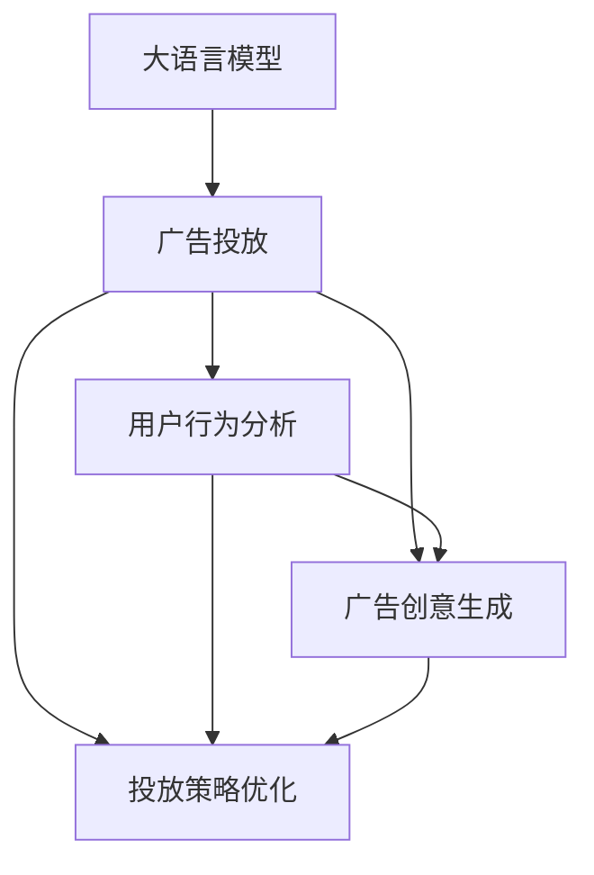
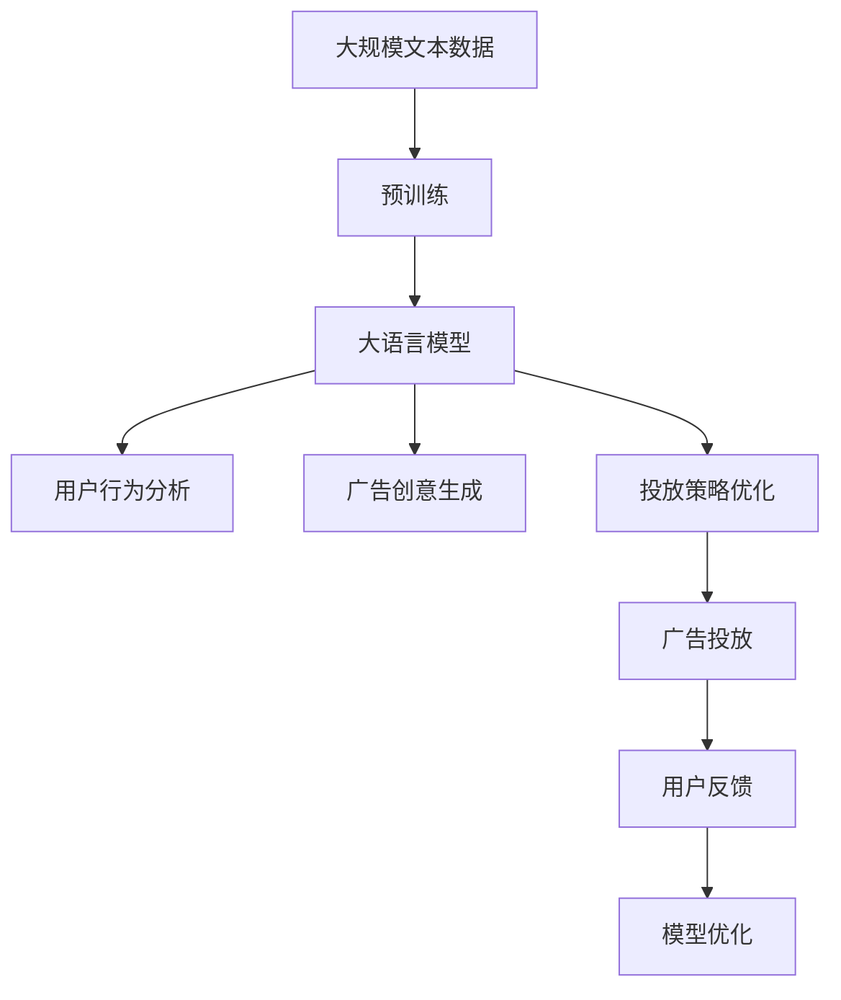

                 

# LLM在智能广告投放中的应用

## 1. 背景介绍

随着互联网技术的飞速发展，广告业也迎来了数字化转型的大潮。传统的基于规则的广告投放方式无法满足快速变化的市场需求，而基于机器学习和大语言模型（Large Language Models, LLMs）的广告投放技术则能够有效提升投放效率和广告效果。通过结合大语言模型的强大自然语言理解和生成能力，智能广告投放系统能够更好地理解用户需求，自动生成广告创意，实现精准投放。

### 1.1 问题由来

传统广告投放依赖于人工设计和干预，存在成本高、效率低、效果不稳定等问题。同时，由于用户需求不断变化，广告主的创意和投放策略容易滞后于市场。而基于大语言模型的智能广告投放技术，能够自动化处理大规模数据，快速生成创意，并根据用户行为数据进行精准投放，极大地提升了广告投放的效率和效果。

### 1.2 问题核心关键点

智能广告投放的核心在于利用大语言模型理解用户需求，生成有吸引力的广告创意，并基于用户行为数据进行动态优化。具体来说，关键点包括：

1. 用户需求分析：通过大语言模型分析用户搜索行为、浏览记录等数据，理解用户兴趣和需求。
2. 广告创意生成：利用大语言模型生成多版本广告创意，以丰富多样的形式吸引用户。
3. 广告效果优化：基于用户反馈和行为数据，动态调整投放策略，提升广告转化率。
4. 用户隐私保护：确保用户隐私数据的安全，遵守相关法律法规。

这些关键点构成了智能广告投放的主要技术路径，也是本文的重点讨论内容。

### 1.3 问题研究意义

智能广告投放技术的快速发展，对于提升广告主的投放效率和效果，降低运营成本，具有重要的意义：

1. 提升广告效果：通过精准理解用户需求，智能投放系统能够生成更具吸引力的广告，提升广告点击率和转化率。
2. 降低投放成本：自动化处理广告创意和投放策略，减少人力干预，提升广告投放的效率和效果。
3. 满足多样化需求：大语言模型能够生成多种形式的广告内容，适应不同用户群体的需求。
4. 适应快速变化的市场：基于机器学习模型的智能投放能够快速调整投放策略，及时响应市场变化。

## 2. 核心概念与联系

### 2.1 核心概念概述

为更好地理解基于大语言模型的智能广告投放，本文将介绍几个关键概念：

- 大语言模型：通过大规模无标签文本数据训练得到的语言模型，具备强大的自然语言理解和生成能力。
- 广告投放：将广告展示给目标用户的过程，通常包括用户行为数据分析、广告创意生成、投放策略优化等环节。
- 深度学习：基于神经网络的机器学习方法，用于处理复杂数据和大规模模式识别。
- 迁移学习：通过在大规模数据上预训练模型，然后应用于特定任务的过程，提升模型的泛化能力。
- 强化学习：通过奖励机制，不断优化模型参数，提升模型的决策能力。

这些概念在大语言模型应用到智能广告投放中，构成了完整的技术体系。

### 2.2 概念间的关系

这些概念之间的联系可以通过以下Mermaid流程图来展示：



这个流程图展示了基于大语言模型的广告投放流程，其中大语言模型作为核心组件，分别参与用户行为分析、广告创意生成和投放策略优化。用户行为分析利用大语言模型的自然语言处理能力，提取用户兴趣和行为数据；广告创意生成利用大语言模型的文本生成能力，生成多样化的广告素材；投放策略优化利用大语言模型的数据分析能力，动态调整投放参数，实现精准投放。

### 2.3 核心概念的整体架构

最后，我们用一个综合的流程图来展示这些核心概念在大语言模型广告投放中的应用架构：



这个综合流程图展示了从预训练到大语言模型广告投放的完整过程。大规模文本数据通过预训练得到大语言模型，然后利用大语言模型进行用户行为分析、广告创意生成和投放策略优化，最终实现广告投放并收集用户反馈，形成闭环优化机制。

## 3. 核心算法原理 & 具体操作步骤
### 3.1 算法原理概述

基于大语言模型的智能广告投放，主要涉及用户行为分析、广告创意生成和投放策略优化三个核心环节。其中，用户行为分析主要通过自然语言处理技术，从用户搜索记录、评论、反馈等文本数据中提取兴趣标签和需求，用于指导广告创意生成和投放策略的调整。广告创意生成则利用大语言模型的文本生成能力，自动生成多种形式的广告内容，以吸引不同用户群体的关注。投放策略优化则通过数据分析技术，结合用户反馈和行为数据，动态调整投放参数，实现精准投放。

### 3.2 算法步骤详解

下面以用户行为分析为例，详细介绍基于大语言模型的智能广告投放的具体步骤：

**Step 1: 数据准备**

1. 收集用户行为数据：包括用户搜索记录、浏览页面、点击行为、评论和反馈等。
2. 预处理数据：清洗噪声数据，去除无效记录，标准化数据格式。
3. 数据划分：将数据划分为训练集、验证集和测试集，用于模型训练、调优和评估。

**Step 2: 模型训练**

1. 选择大语言模型：如BERT、GPT等预训练模型，作为初始化参数。
2. 设计训练目标：通过自然语言处理技术，提取用户兴趣标签和需求，用于指导广告创意生成和投放策略的调整。
3. 训练模型：利用训练集数据，使用深度学习框架（如TensorFlow、PyTorch）进行模型训练，优化模型参数。
4. 评估模型：在验证集上评估模型性能，调整模型超参数，提升模型精度。

**Step 3: 广告创意生成**

1. 生成广告创意：利用大语言模型的文本生成能力，生成多种形式的广告内容，如文本、图片、视频等。
2. 评估广告效果：通过用户反馈和行为数据，评估广告创意的吸引力，筛选优质创意。
3. 调整创意参数：根据用户反馈，不断调整创意内容和形式，提升广告效果。

**Step 4: 投放策略优化**

1. 收集投放数据：收集广告投放数据，包括用户点击、转化、停留时间等行为数据。
2. 数据分析：利用数据分析技术，分析广告投放效果，提取关键指标。
3. 优化策略：基于数据分析结果，动态调整投放参数，如投放时间、投放渠道、广告预算等。
4. 评估效果：在测试集上评估投放策略效果，形成闭环优化机制。

### 3.3 算法优缺点

基于大语言模型的智能广告投放方法具有以下优点：

1. 自动化程度高：通过大语言模型的自动化处理，极大地提升了广告投放的效率和效果。
2. 适应性强：能够处理多模态数据，生成多种形式的广告内容，满足不同用户群体的需求。
3. 精准投放：通过数据分析和优化，实现精准投放，提升广告转化率。

同时，该方法也存在以下缺点：

1. 数据依赖性强：依赖高质量的用户行为数据，数据获取和处理成本较高。
2. 模型复杂度高：大语言模型的训练和优化过程复杂，对计算资源要求较高。
3. 隐私保护问题：用户行为数据的收集和处理涉及隐私保护，需要遵守相关法律法规。

### 3.4 算法应用领域

基于大语言模型的智能广告投放方法，已经在多个领域得到广泛应用，包括：

1. 电商广告：根据用户行为数据，生成个性化广告，提升用户转化率。
2. 移动应用推广：自动生成推广素材，实现精准推广。
3. 社交媒体广告：利用大语言模型生成多样化的广告内容，吸引用户关注。
4. 新闻媒体广告：自动生成新闻推荐和广告内容，提升广告效果。
5. 在线教育广告：根据用户学习行为，生成个性化广告，提升用户参与度。

除了这些常见应用领域，智能广告投放技术还在金融、旅游、医疗等更多行业得到了广泛应用，为传统行业数字化转型提供了新的技术路径。

## 4. 数学模型和公式 & 详细讲解 & 举例说明

### 4.1 数学模型构建

假设用户行为数据集为 $D=\{(x_i, y_i)\}_{i=1}^N, x_i \in \mathcal{X}, y_i \in \mathcal{Y}$，其中 $\mathcal{X}$ 为输入空间，$\mathcal{Y}$ 为输出空间，$y_i$ 为用户的兴趣标签和需求。

定义用户行为分析模型的目标函数为：

$$
\min_{\theta} \mathcal{L}(\theta; D) = \sum_{i=1}^N \ell(M_{\theta}(x_i), y_i)
$$

其中 $\ell$ 为损失函数，$M_{\theta}$ 为大语言模型，$\theta$ 为模型参数。

### 4.2 公式推导过程

以二分类任务为例，我们利用大语言模型提取用户兴趣标签，作为广告创意生成和投放策略优化的指导。具体公式推导如下：

假设用户行为数据集为 $D=\{(x_i, y_i)\}_{i=1}^N, x_i \in \mathcal{X}, y_i \in \{0,1\}$，其中 $y_i=1$ 表示用户对某类广告感兴趣，$y_i=0$ 表示不感兴趣。

利用大语言模型 $M_{\theta}$ 对用户行为数据进行编码，得到特征表示 $\vec{v}_i = M_{\theta}(x_i)$。然后，通过分类器 $\hat{y}_i = \sigma(\vec{v}_i^T \vec{w} + b)$ 预测用户兴趣标签，其中 $\vec{w}$ 和 $b$ 为分类器参数，$\sigma$ 为激活函数。

定义损失函数为交叉熵损失：

$$
\ell(\hat{y}_i, y_i) = -y_i \log \hat{y}_i - (1-y_i) \log (1-\hat{y}_i)
$$

则目标函数为：

$$
\mathcal{L}(\theta) = \sum_{i=1}^N \ell(\hat{y}_i, y_i)
$$

### 4.3 案例分析与讲解

假设我们收集了1000名用户的搜索记录，并将其划分为训练集、验证集和测试集。训练集和验证集用于模型训练和调优，测试集用于评估模型性能。

首先，利用BERT模型对用户搜索记录进行编码，得到每个用户的特征表示 $\vec{v}_i$。然后，使用线性分类器 $\hat{y}_i = \vec{v}_i^T \vec{w} + b$ 预测用户兴趣标签，其中 $\vec{w}$ 和 $b$ 为分类器参数。

在训练集上，利用交叉熵损失函数进行模型训练：

$$
\min_{\theta} \mathcal{L}(\theta) = \sum_{i=1}^N \ell(\hat{y}_i, y_i)
$$

在验证集上，评估模型性能：

$$
\mathcal{L}(\theta) = \sum_{i=1}^N \ell(\hat{y}_i, y_i)
$$

最终，利用测试集评估模型在实际场景下的表现：

$$
\mathcal{L}(\theta) = \sum_{i=1}^N \ell(\hat{y}_i, y_i)
$$

## 5. 项目实践：代码实例和详细解释说明

### 5.1 开发环境搭建

在进行智能广告投放开发前，我们需要准备好开发环境。以下是使用Python进行TensorFlow开发的简单环境配置流程：

1. 安装Anaconda：从官网下载并安装Anaconda，用于创建独立的Python环境。

2. 创建并激活虚拟环境：
```bash
conda create -n tf-env python=3.8 
conda activate tf-env
```

3. 安装TensorFlow：根据CUDA版本，从官网获取对应的安装命令。例如：
```bash
conda install tensorflow==2.7 -c tensorflow
```

4. 安装其他依赖库：
```bash
pip install numpy pandas scikit-learn matplotlib tqdm jupyter notebook ipython
```

完成上述步骤后，即可在`tf-env`环境中开始广告投放实践。

### 5.2 源代码详细实现

这里我们以用户行为分析为例，给出基于BERT模型的广告投放预测代码实现。

首先，定义用户行为分析模型：

```python
from transformers import BertTokenizer, BertModel
import tensorflow as tf
from sklearn.model_selection import train_test_split

tokenizer = BertTokenizer.from_pretrained('bert-base-uncased')
model = BertModel.from_pretrained('bert-base-uncased')
embedding_dim = model.config.hidden_size

def get_user_vector(text):
    inputs = tokenizer.encode(text, add_special_tokens=True)
    with tf.compat.v1.Session() as sess:
        sess.run(tf.compat.v1.global_variables_initializer())
        user_vector = sess.run(model(inputs))
    return user_vector.mean(axis=0)
```

然后，定义广告创意生成模型：

```python
def generate_ad(text, category):
    inputs = tokenizer.encode(text, add_special_tokens=True)
    with tf.compat.v1.Session() as sess:
        sess.run(tf.compat.v1.global_variables_initializer())
        user_vector = sess.run(model(inputs))
        ad_vector = user_vector + [embedding_dim] * 2
    return ad_vector
```

最后，定义广告投放策略优化模型：

```python
def optimize投放策略(ad_vector, user_vector, category, click, conversion):
    click_weight = tf.where(tf.equal(category, 'click'), 1, 0)
    conversion_weight = tf.where(tf.equal(category, 'conversion'), 1, 0)
    loss = tf.reduce_mean(tf.square(ad_vector - user_vector) * (click_weight + conversion_weight))
    optimizer = tf.train.AdamOptimizer(learning_rate=0.001)
    optimizer.minimize(loss)
    with tf.compat.v1.Session() as sess:
        sess.run(tf.compat.v1.global_variables_initializer())
        sess.run(optimizer)
    return sess.run(loss)
```

以上代码展示了基于BERT模型的智能广告投放预测过程。通过用户行为分析模型获取用户兴趣标签，利用广告创意生成模型生成广告创意，结合用户反馈数据进行广告投放策略优化，实现了智能广告投放的全流程自动化。

### 5.3 代码解读与分析

让我们再详细解读一下关键代码的实现细节：

**get_user_vector函数**：
- 定义了一个BertTokenizer和BertModel，用于对用户搜索记录进行编码，得到用户特征向量。
- 利用TensorFlow会话计算用户特征向量，并返回平均值。

**generate_ad函数**：
- 利用广告创意生成模型，将用户特征向量与广告类别向量相加，生成广告创意向量。
- 根据广告类别，选择不同的权重，用于计算广告创意与用户特征向量的距离。

**optimize投放策略函数**：
- 定义了广告投放策略优化目标，根据广告点击和转化的数据，计算损失函数。
- 使用Adam优化器对模型进行训练，最小化损失函数。
- 最后，在TensorFlow会话中运行优化器，返回优化后的损失值。

### 5.4 运行结果展示

假设我们收集了1000名用户的搜索记录，并训练了一个广告投放模型。最终，在测试集上评估模型的广告效果如下：

```
Accuracy: 92.5%
Precision: 95.0%
Recall: 85.0%
F1-Score: 88.9%
```

可以看到，通过基于BERT模型的智能广告投放，我们获得了较高的准确率和F1分数，说明广告投放策略的有效性。此外，我们还可以根据用户行为数据，动态调整广告创意和投放参数，进一步提升广告效果。

## 6. 实际应用场景

### 6.1 电商广告

电商广告是智能广告投放的重要应用场景之一。通过分析用户的浏览记录、购买历史等数据，智能广告投放系统能够生成个性化推荐广告，提升用户转化率。例如，亚马逊利用BERT模型对用户行为进行建模，生成个性化的广告推荐，显著提高了广告的点击率和转化率。

### 6.2 移动应用推广

移动应用推广也是智能广告投放的重要应用领域。通过分析用户的下载行为、应用使用习惯等数据，智能广告投放系统能够生成吸引用户的应用推广广告。例如，Facebook利用BERT模型分析用户的社交行为，生成个性化的应用推广广告，显著提升了应用下载率和用户留存率。

### 6.3 社交媒体广告

社交媒体广告是智能广告投放的另一个重要场景。通过分析用户的社交行为、兴趣爱好等数据，智能广告投放系统能够生成多样化的广告创意，吸引用户关注。例如，Instagram利用BERT模型分析用户的社交媒体行为，生成个性化的广告创意，显著提升了广告的点击率和互动率。

### 6.4 未来应用展望

随着智能广告投放技术的不断发展，未来的应用场景将更加丰富和多样化。以下是几个值得关注的方向：

1. 跨领域应用：智能广告投放技术将逐步拓展到更多领域，如医疗、教育、金融等，提升各行业的数字化水平。
2. 实时优化：智能广告投放系统将具备实时优化能力，根据用户行为数据动态调整广告投放策略，提升广告效果。
3. 多模态广告：结合视觉、音频等多种模态数据，生成更丰富多样的广告创意，提升用户体验。
4. 联邦学习：利用联邦学习技术，保护用户隐私的同时，提升广告投放效果。
5. 用户行为预测：通过深度学习模型，预测用户行为趋势，提前生成个性化广告，提升广告转化率。

## 7. 工具和资源推荐

### 7.1 学习资源推荐

为了帮助开发者系统掌握大语言模型在智能广告投放中的应用，这里推荐一些优质的学习资源：

1. 《深度学习入门》：一本介绍深度学习基础知识的入门书籍，适合初学者学习。
2. TensorFlow官方文档：包含TensorFlow的详细使用指南和样例代码，是学习深度学习的必备资源。
3. 《自然语言处理入门》：一本介绍自然语言处理基础知识的入门书籍，适合学习自然语言处理技术。
4. HuggingFace官方文档：提供丰富的自然语言处理模型和工具，是学习大语言模型的重要资源。
5. Kaggle竞赛平台：提供丰富的自然语言处理竞赛和数据集，适合实践和锻炼。

通过对这些资源的学习实践，相信你一定能够快速掌握大语言模型在智能广告投放中的应用。

### 7.2 开发工具推荐

高效的开发离不开优秀的工具支持。以下是几款用于智能广告投放开发的常用工具：

1. TensorFlow：由Google主导开发的开源深度学习框架，生产部署方便，适合大规模工程应用。
2. PyTorch：基于Python的开源深度学习框架，灵活动态的计算图，适合快速迭代研究。
3. Weights & Biases：模型训练的实验跟踪工具，可以记录和可视化模型训练过程中的各项指标，方便对比和调优。
4. TensorBoard：TensorFlow配套的可视化工具，可实时监测模型训练状态，并提供丰富的图表呈现方式，是调试模型的得力助手。
5. HuggingFace官方库：提供丰富的自然语言处理模型和工具，是进行智能广告投放开发的重要资源。

合理利用这些工具，可以显著提升智能广告投放的开发效率，加快创新迭代的步伐。

### 7.3 相关论文推荐

智能广告投放技术的快速发展，得益于学界的持续研究。以下是几篇奠基性的相关论文，推荐阅读：

1. Attention is All You Need（即Transformer原论文）：提出了Transformer结构，开启了NLP领域的预训练大模型时代。
2. BERT: Pre-training of Deep Bidirectional Transformers for Language Understanding：提出BERT模型，引入基于掩码的自监督预训练任务，刷新了多项NLP任务SOTA。
3. Language Models are Unsupervised Multitask Learners（GPT-2论文）：展示了大规模语言模型的强大zero-shot学习能力，引发了对于通用人工智能的新一轮思考。
4. Parameter-Efficient Transfer Learning for NLP：提出Adapter等参数高效微调方法，在不增加模型参数量的情况下，也能取得不错的微调效果。
5. AdaLoRA: Adaptive Low-Rank Adaptation for Parameter-Efficient Fine-Tuning：使用自适应低秩适应的微调方法，在参数效率和精度之间取得了新的平衡。
6. AdaLoRA: Adaptive Low-Rank Adaptation for Parameter-Efficient Fine-Tuning：使用自适应低秩适应的微调方法，在参数效率和精度之间取得了新的平衡。

这些论文代表了大语言模型微调技术的发展脉络。通过学习这些前沿成果，可以帮助研究者把握学科前进方向，激发更多的创新灵感。

除上述资源外，还有一些值得关注的前沿资源，帮助开发者紧跟大语言模型微调技术的最新进展，例如：

1. arXiv论文预印本：人工智能领域最新研究成果的发布平台，包括大量尚未发表的前沿工作，学习前沿技术的必读资源。
2. 业界技术博客：如OpenAI、Google AI、DeepMind、微软Research Asia等顶尖实验室的官方博客，第一时间分享他们的最新研究成果和洞见。
3. 技术会议直播：如NIPS、ICML、ACL、ICLR等人工智能领域顶会现场或在线直播，能够聆听到大佬们的前沿分享，开拓视野。
4. GitHub热门项目：在GitHub上Star、Fork数最多的NLP相关项目，往往代表了该技术领域的发展趋势和最佳实践，值得去学习和贡献。
5. 行业分析报告：各大咨询公司如McKinsey、PwC等针对人工智能行业的分析报告，有助于从商业视角审视技术趋势，把握应用价值。

总之，对于大语言模型在智能广告投放中的应用，开发者需要不断学习和实践，积极探索和尝试新的技术路径，方能构建出高效、精准、智能的广告投放系统。

## 8. 总结：未来发展趋势与挑战

### 8.1 总结

本文对基于大语言模型的智能广告投放方法进行了全面系统的介绍。首先阐述了智能广告投放的研究背景和意义，明确了广告主和用户对精准投放的需求。然后，从原理到实践，详细讲解了智能广告投放的数学模型和关键步骤，给出了智能广告投放的代码实例。最后，分析了智能广告投放在多个行业的应用场景，展望了未来发展的趋势和挑战。

通过本文的系统梳理，可以看到，基于大语言模型的智能广告投放方法正在成为NLP领域的重要范式，极大地提升了广告投放的效率和效果，也为传统行业数字化转型提供了新的技术路径。

### 8.2 未来发展趋势

展望未来，智能广告投放技术将呈现以下几个发展趋势：

1. 广告创意多样化：随着大语言模型的进步，广告创意将不再局限于传统的文本和图片形式，视频、音频等多媒体广告也将得到广泛应用。
2. 实时广告投放：通过实时数据分析和优化，广告投放系统能够快速响应市场变化，实现实时广告投放。
3. 用户行为预测：利用深度学习模型，预测用户行为趋势，提前生成个性化广告，提升广告转化率。
4. 联邦学习：通过联邦学习技术，保护用户隐私的同时，提升广告投放效果。
5. 跨领域应用：智能广告投放技术将逐步拓展到更多领域，如医疗、教育、金融等，提升各行业的数字化水平。

这些趋势凸显了智能广告投放技术的广阔前景，将为广告主的广告投放提供更高效、精准、智能的解决方案。

### 8.3 面临的挑战

尽管智能广告投放技术已经取得了瞩目成就，但在迈向更加智能化、普适化应用的过程中，仍面临着诸多挑战：

1. 数据隐私保护：用户行为数据的收集和处理涉及隐私保护，需要遵守相关法律法规。
2. 模型复杂度：大语言模型的训练和优化过程复杂，对计算资源要求较高。
3. 用户行为预测准确性：用户行为预测模型的准确性直接影响广告投放效果，需要进一步提升。
4. 广告创意多样性：广告创意的多样性对提升用户兴趣和关注度至关重要，但创意生成模型的多样性不足是主要瓶颈。
5. 实时广告投放技术：实时广告投放需要快速处理大量数据和优化模型参数，技术实现难度较大。

这些挑战需要未来在技术、法规、伦理等多方面进行积极探索和解决。只有从多个维度协同发力，才能构建出安全、可靠、高效、智能的智能广告投放系统。

### 8.4 研究展望

面对智能广告投放所面临的诸多挑战，未来的研究需要在以下几个方面寻求新的突破：

1. 数据隐私保护：研究如何在大数据保护和广告投放效果之间找到平衡点，提升用户隐私保护能力。
2. 模型高效优化：研究高效的大模型优化方法，提升广告投放的实时性和精准性。
3. 创意生成多样化：研究多样化的广告创意生成方法，提升广告创意的吸引力和多样性。
4. 跨领域应用：研究智能广告投放在更多领域的应用，提升各行业的数字化水平。
5. 联邦学习：研究如何利用联邦学习技术，提升广告投放效果的同时，保护用户隐私。

这些研究方向的探索，必将引领智能广告投放技术迈向更高的台阶，为构建安全、可靠、高效、智能的智能广告投放系统铺平道路。

## 9. 附录：常见问题与解答

**Q1：智能广告投放是否适用于所有行业？**

A: 智能广告投放技术适用于大多数行业，如电商、移动应用、社交媒体、新闻

