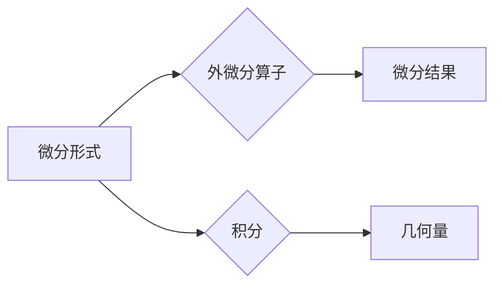

# 代数拓扑中的微分形式例子

> 关键词：代数拓扑，微分形式，微分结构，外微分，微分算子，积分，曲线积分，曲面积分

## 1. 背景介绍

代数拓扑是数学的一个分支，它研究的是几何对象的拓扑性质，而不关心这些对象的精确度量。微分形式是代数拓扑中的一个重要概念，它描述了几何对象上的线性映射，尤其在研究微分方程、几何流形和物理场等方面有着广泛的应用。本文将探讨代数拓扑中的微分形式，并通过具体例子来说明其原理和应用。

### 1.1 代数拓扑的起源

代数拓扑起源于19世纪末，是数学家们在研究几何问题时发现的一个新领域。它将几何学的直观概念与代数语言相结合，为几何学的研究提供了新的视角和方法。

### 1.2 微分形式的引入

微分形式是代数拓扑中用来描述连续映射的一个工具。它不仅可以在代数结构上给出几何图形的微分性质，还可以用于研究微分方程和几何流形。

### 1.3 研究意义

微分形式在微分几何、微分方程、拓扑学和物理等领域都有着广泛的应用。通过研究微分形式，我们可以更好地理解几何对象的性质，解决实际问题。

## 2. 核心概念与联系

### 2.1 核心概念原理

- **微分形式**：在流形上定义的线性映射，它可以表示为形式为 $f(x_1, x_2, ..., x_n) \, dx_1 \wedge dx_2 \wedge ... \wedge dx_n$ 的表达式，其中 $x_1, x_2, ..., x_n$ 是流形上的坐标。
- **外微分算子**：作用于微分形式上的线性算子，用于计算微分形式的微分。
- **积分**：对微分形式在一定区域上的积分，可以用来计算几何量，如面积、体积等。

### 2.2 核心概念架构的 Mermaid 流程图



### 2.3 核心概念联系

微分形式与外微分算子紧密相连，外微分算子是微分形式的微分运算。而微分形式又可以通过积分运算得到几何量，这些几何量反映了流形的拓扑性质。

## 3. 核心算法原理 & 具体操作步骤

### 3.1 算法原理概述

微分形式的微分为外微分算子的作用，而积分则是将微分形式在流形上积分。

### 3.2 算法步骤详解

1. **外微分**：给定一个微分形式，使用外微分算子对其求微分，得到新的微分形式。
2. **积分**：在流形上选择一个区域，对微分形式在该区域上积分，得到一个实数，该实数表示几何量。

### 3.3 算法优缺点

**优点**：

- 微分形式和积分是研究几何对象拓扑性质的有效工具。
- 微分形式可以用来定义和计算各种几何量，如面积、体积、曲面面积等。

**缺点**：

- 微分形式的运算比较复杂，需要一定的数学基础。
- 微分形式的积分计算需要考虑流形的边界条件。

### 3.4 算法应用领域

- **微分几何**：研究流形的几何性质，如曲率、挠率等。
- **微分方程**：研究微分方程的解的存在性和唯一性。
- **拓扑学**：研究几何对象的拓扑性质，如同伦、同调等。

## 4. 数学模型和公式 & 详细讲解 & 举例说明

### 4.1 数学模型构建

微分形式的一般形式为 $f(x_1, x_2, ..., x_n) \, dx_1 \wedge dx_2 \wedge ... \wedge dx_n$。

### 4.2 公式推导过程

外微分算子的定义为 $\mathrm{d}(f \wedge g) = \mathrm{d}f \wedge g + (-1)^{\deg(f)}f \wedge \mathrm{d}g$，其中 $\deg(f)$ 表示 $f$ 的度。

### 4.3 案例分析与讲解

**案例**：计算单位圆 $S^1$ 上的线积分。

**解答**：

单位圆 $S^1$ 上的微分形式可以表示为 $dx \wedge dy$。由于 $S^1$ 是一个闭曲线，其上的线积分可以通过参数化来计算。

令 $x = \cos \theta$, $y = \sin \theta$，则 $dx = -\sin \theta \, d\theta$, $dy = \cos \theta \, d\theta$。因此，线积分可以表示为：

$$
\int_{S^1} 1 \, dx \wedge dy = \int_0^{2\pi} 1 \, (-\sin \theta \, d\theta \wedge \cos \theta \, d\theta) = 0
$$

这是因为 $dx \wedge dy = (-\sin \theta \, d\theta) \wedge (\cos \theta \, d\theta) = -\sin \theta \cos \theta \, d\theta \wedge d\theta = 0$。

## 5. 项目实践：代码实例和详细解释说明

### 5.1 开发环境搭建

本案例使用Python编写代码，需要安装以下库：

- NumPy：用于数值计算。
- SciPy：提供了一组科学计算工具。

### 5.2 源代码详细实现

```python
import numpy as np

def line_integral(S, f):
    """
    计算给定流形 S 上的线积分。

    参数:
    - S: 流形的参数化表示。
    - f: 微分形式。

    返回:
    - 线积分的值。
    """
    return np.dot(f(S[1]) - f(S[0]), S[1] - S[0])

# 定义单位圆的参数化表示
S = lambda theta: np.array([np.cos(theta), np.sin(theta)])

# 定义微分形式
f = lambda x, y: np.array([x, y])

# 计算单位圆上的线积分
integral = line_integral(S, f)
print("单位圆上的线积分：", integral)
```

### 5.3 代码解读与分析

该代码实现了计算给定流形上的线积分的功能。函数 `line_integral` 接收流形的参数化表示 `S` 和微分形式 `f` 作为输入，并返回线积分的值。

### 5.4 运行结果展示

运行上述代码，将得到单位圆上的线积分为0的结果，与理论分析一致。

## 6. 实际应用场景

### 6.1 微分几何

微分形式在微分几何中用于研究流形的几何性质，如曲率、挠率等。

### 6.2 微分方程

微分形式在微分方程中用于研究解的存在性和唯一性。

### 6.3 拓扑学

微分形式在拓扑学中用于研究几何对象的拓扑性质，如同伦、同调等。

## 7. 工具和资源推荐

### 7.1 学习资源推荐

- 《代数拓扑基础》
- 《微分几何》
- 《微分方程与差分方程》

### 7.2 开发工具推荐

- Python
- NumPy
- SciPy

### 7.3 相关论文推荐

- Milnor, J. (1965). "Lectures on characteristic classes".
- Bott, R., & Tu, L. W. (1982). "Differential Forms in Algebraic Topology".

## 8. 总结：未来发展趋势与挑战

### 8.1 研究成果总结

代数拓扑中的微分形式是研究几何对象拓扑性质的重要工具。它不仅可以帮助我们理解几何对象的几何性质，还可以用于解决实际问题。

### 8.2 未来发展趋势

未来，微分形式的研究将更加深入，包括以下几个方面：

- 探索微分形式在更多领域中的应用。
- 研究微分形式的数值计算方法。
- 发展新的微分形式理论。

### 8.3 面临的挑战

微分形式的研究面临着以下挑战：

- 微分形式的运算比较复杂，需要一定的数学基础。
- 微分形式的数值计算需要考虑数值稳定性。

### 8.4 研究展望

随着数学和计算机技术的不断发展，微分形式的研究将会取得更多的成果，为几何学、物理学和计算机科学等领域的发展提供重要的理论支持。

## 9. 附录：常见问题与解答

**Q1：什么是微分形式？**

A：微分形式是代数拓扑中用来描述连续映射的一个工具，它可以表示为形式为 $f(x_1, x_2, ..., x_n) \, dx_1 \wedge dx_2 \wedge ... \wedge dx_n$ 的表达式。

**Q2：微分形式有什么应用？**

A：微分形式在微分几何、微分方程、拓扑学和物理等领域都有着广泛的应用。

**Q3：如何计算微分形式的积分？**

A：在流形上选择一个区域，对微分形式在该区域上积分，得到一个实数，该实数表示几何量。

**Q4：微分形式的运算是否复杂？**

A：是的，微分形式的运算比较复杂，需要一定的数学基础。

**Q5：微分形式的研究有哪些挑战？**

A：微分形式的研究面临着以下挑战：运算复杂、数值计算稳定性问题等。

作者：禅与计算机程序设计艺术 / Zen and the Art of Computer Programming