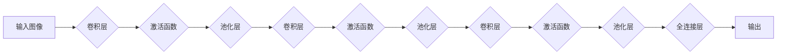

# 卷积神经网络CNN原理与代码实例讲解

> 关键词：卷积神经网络，CNN，深度学习，图像识别，神经网络架构，激活函数，池化层，卷积层，反向传播，Keras，TensorFlow

## 1. 背景介绍

卷积神经网络（Convolutional Neural Networks，CNN）是深度学习中的一种强大模型，尤其在图像识别和图像处理领域取得了革命性的成果。自从AlexNet在2012年ImageNet竞赛中夺冠以来，CNN成为了计算机视觉领域的主流技术。本文将深入讲解CNN的原理，并通过代码实例展示如何使用Keras和TensorFlow构建和训练一个简单的CNN模型。

### 1.1 问题的由来

图像识别是计算机视觉领域的一个基础问题，它涉及到从图像中提取特征并对其进行分类或检测。传统的图像识别方法通常依赖于手工设计的特征，如SIFT、HOG等，但这些方法在处理复杂场景和大规模数据时效果有限。深度学习的兴起为图像识别带来了新的突破，而CNN因其强大的特征提取能力而成为首选。

### 1.2 研究现状

随着计算能力的提升和数据量的爆炸式增长，CNN在图像识别、目标检测、语义分割等计算机视觉任务上取得了显著成果。目前，CNN已经广泛应用于自动驾驶、医疗影像分析、人脸识别等领域。

### 1.3 研究意义

研究CNN的原理和应用，对于推动计算机视觉技术的发展具有重要意义。它可以帮助我们更好地理解深度学习的原理，并能够将CNN应用于解决实际问题。

### 1.4 本文结构

本文将按照以下结构进行讲解：

- 第2章介绍CNN的核心概念和架构。
- 第3章深入讲解CNN的算法原理和操作步骤。
- 第4章通过数学模型和公式详细说明CNN的工作机制。
- 第5章通过代码实例展示如何使用Keras和TensorFlow构建和训练CNN。
- 第6章探讨CNN的实际应用场景。
- 第7章推荐相关学习资源和开发工具。
- 第8章总结CNN的未来发展趋势和挑战。
- 第9章提供常见问题的解答。

## 2. 核心概念与联系

### 2.1 核心概念原理

CNN的核心概念包括：

- **卷积层（Convolutional Layer）**：卷积层是CNN中最基本的层，它通过在输入图像上滑动卷积核（也称为滤波器）来提取局部特征。
- **激活函数（Activation Function）**：激活函数为卷积层提供非线性能力，常见的激活函数包括ReLU、Sigmoid和Tanh。
- **池化层（Pooling Layer）**：池化层用于降低特征图的维度，减少计算量，并增加模型的鲁棒性。
- **全连接层（Fully Connected Layer）**：全连接层将特征图转换为一维向量，用于最终的分类或回归任务。

Mermaid流程图如下：



### 2.2 核心概念联系

CNN通过卷积层提取图像特征，激活函数引入非线性，池化层降低特征图的维度，最后通过全连接层进行分类或回归。这些层相互联系，构成了一个强大的特征提取和分类系统。

## 3. 核心算法原理 & 具体操作步骤

### 3.1 算法原理概述

CNN通过以下步骤进行图像识别：

1. **特征提取**：卷积层从输入图像中提取局部特征。
2. **非线性变换**：激活函数对提取的特征进行非线性变换，增强特征的表达能力。
3. **降维**：池化层降低特征图的维度，减少计算量。
4. **分类**：全连接层将特征图转换为一维向量，并通过softmax函数进行分类。

### 3.2 算法步骤详解

1. **初始化网络结构**：确定网络的层数、每层的参数等。
2. **前向传播**：将输入图像通过网络进行特征提取和分类。
3. **计算损失**：计算模型预测结果与真实标签之间的差异。
4. **反向传播**：根据损失计算梯度，更新网络参数。
5. **优化**：使用优化算法（如SGD、Adam等）优化网络参数。

### 3.3 算法优缺点

**优点**：

- 自动特征提取：无需手动设计特征，能够自动从图像中提取有用的特征。
- 参数共享：卷积层中卷积核的权重在所有位置共享，减少了模型参数。
- 鲁棒性：池化层可以减少噪声和干扰的影响。

**缺点**：

- 计算量较大：卷积层和全连接层中的参数数量庞大，计算量较大。
- 难以解释：CNN的决策过程难以解释。

### 3.4 算法应用领域

CNN在以下领域有广泛应用：

- 图像分类：如ImageNet竞赛、COCO数据集等。
- 目标检测：如Faster R-CNN、YOLO等。
- 语义分割：如FCN、U-Net等。
- 图像生成：如GANs等。

## 4. 数学模型和公式 & 详细讲解 & 举例说明

### 4.1 数学模型构建

CNN的数学模型可以表示为：

$$
y = f(W \cdot x + b)
$$

其中，$y$ 是输出，$x$ 是输入，$W$ 是权重矩阵，$b$ 是偏置向量，$f$ 是激活函数。

### 4.2 公式推导过程

以卷积层为例，其计算过程如下：

$$
h_{ij} = \sum_{k=1}^{M} w_{ik} \cdot x_{kij} + b_i
$$

其中，$h_{ij}$ 是第 $i$ 层的第 $j$ 个输出，$w_{ik}$ 是第 $i$ 层的第 $k$ 个卷积核，$x_{kij}$ 是第 $k$ 个卷积核在第 $i$ 层的第 $j$ 个位置的输入，$b_i$ 是第 $i$ 层的偏置。

### 4.3 案例分析与讲解

以AlexNet模型为例，其结构如下：

- 5个卷积层
- 3个最大池化层
- 3个全连接层

该模型使用ReLU作为激活函数，并在全连接层使用Softmax进行分类。

## 5. 项目实践：代码实例和详细解释说明

### 5.1 开发环境搭建

首先，我们需要安装TensorFlow和Keras：

```bash
pip install tensorflow-gpu
```

### 5.2 源代码详细实现

以下是一个简单的CNN模型，用于图像分类：

```python
from tensorflow.keras.models import Sequential
from tensorflow.keras.layers import Conv2D, MaxPooling2D, Flatten, Dense, Dropout, Activation

model = Sequential([
    Conv2D(32, (3, 3), input_shape=(64, 64, 3)),
    Activation('relu'),
    MaxPooling2D(pool_size=(2, 2)),
    Conv2D(64, (3, 3)),
    Activation('relu'),
    MaxPooling2D(pool_size=(2, 2)),
    Flatten(),
    Dense(64),
    Dropout(0.5),
    Activation('softmax')
])

model.compile(optimizer='adam', loss='categorical_crossentropy', metrics=['accuracy'])
```

### 5.3 代码解读与分析

- `Sequential`：创建一个线性堆叠的模型。
- `Conv2D`：创建一个卷积层，指定滤波器大小、输入通道和输出通道。
- `Activation`：应用ReLU激活函数。
- `MaxPooling2D`：应用最大池化层，降低特征图尺寸。
- `Flatten`：将特征图展平为一维向量。
- `Dense`：创建一个全连接层。
- `Dropout`：在训练过程中随机丢弃一些神经元，防止过拟合。
- `softmax`：应用softmax激活函数进行分类。

### 5.4 运行结果展示

```python
model.fit(x_train, y_train, epochs=10, batch_size=32, validation_data=(x_val, y_val))
```

以上代码将训练模型10个epoch，每个epoch使用32个样本。

## 6. 实际应用场景

CNN在以下领域有广泛应用：

- 图像识别：如人脸识别、物体识别、场景识别等。
- 目标检测：如自动驾驶、视频监控等。
- 语义分割：如医疗影像分析、卫星图像分析等。
- 图像生成：如风格迁移、图像修复等。

## 7. 工具和资源推荐

### 7.1 学习资源推荐

- 《深度学习》（Goodfellow et al.）
- 《卷积神经网络》（Krizhevsky et al.）
- TensorFlow官方文档
- Keras官方文档

### 7.2 开发工具推荐

- TensorFlow
- Keras
- PyTorch

### 7.3 相关论文推荐

- AlexNet（Krizhevsky et al., 2012）
- VGG（Simonyan & Zisserman, 2014）
- GoogLeNet（Szegedy et al., 2015）
- ResNet（He et al., 2016）
- Inception（Szegedy et al., 2016）

## 8. 总结：未来发展趋势与挑战

### 8.1 研究成果总结

CNN作为一种强大的深度学习模型，在图像识别和图像处理领域取得了显著的成果。随着计算能力的提升和数据量的增长，CNN将继续在更多领域发挥重要作用。

### 8.2 未来发展趋势

- 模型轻量化：为了适应移动设备和嵌入式系统，需要开发更加轻量级的CNN模型。
- 模型可解释性：提高模型的可解释性，使得决策过程更加透明。
- 多模态学习：结合图像、文本、音频等多模态信息进行学习。

### 8.3 面临的挑战

- 计算量：CNN模型通常需要大量的计算资源进行训练和推理。
- 数据隐私：图像数据通常包含个人隐私信息，需要保护数据隐私。
- 模型泛化能力：提高模型的泛化能力，使其能够适应不同的任务和数据分布。

### 8.4 研究展望

未来，CNN将在以下方面取得突破：

- 模型压缩：通过模型压缩技术减小模型尺寸，降低计算量。
- 可解释性：通过可解释性技术提高模型的透明度和可信度。
- 跨领域迁移：提高模型的跨领域迁移能力，使其能够适应不同的数据分布和任务。

## 9. 附录：常见问题与解答

**Q1：什么是卷积神经网络？**

A：卷积神经网络（CNN）是一种深度学习模型，特别适用于图像识别和图像处理任务。它通过卷积层提取图像特征，并通过全连接层进行分类。

**Q2：CNN如何提取图像特征？**

A：CNN通过卷积层提取图像特征。每个卷积核在图像上滑动，提取局部特征，并形成特征图。

**Q3：CNN与全连接神经网络有何不同？**

A：CNN与全连接神经网络的主要区别在于卷积层的使用。CNN通过卷积层提取局部特征，而全连接神经网络则直接连接所有输入特征。

**Q4：如何提高CNN的性能？**

A：提高CNN性能的方法包括：
- 使用更深的网络结构。
- 使用更复杂的卷积核。
- 使用更有效的激活函数。
- 使用更有效的优化算法。

**Q5：CNN有哪些应用？**

A：CNN在以下领域有广泛应用：
- 图像识别
- 目标检测
- 语义分割
- 图像生成

---

作者：禅与计算机程序设计艺术 / Zen and the Art of Computer Programming