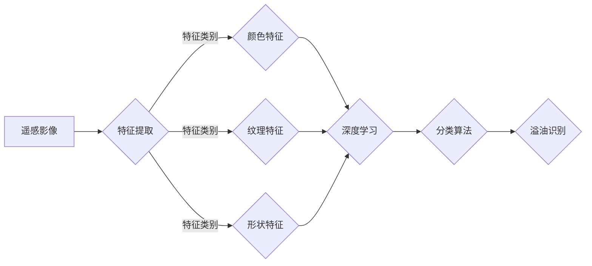

> 溢油，特征提取，机器学习，图像处理，深度学习，遥感，海洋环境监测

# 基于机器学习的溢油特征提取与识别方法研究

随着全球经济的快速发展和海洋活动的日益频繁，海洋环境污染问题日益严重。其中，溢油事件由于其破坏性大、影响范围广，成为了海洋环境监测和治理的重要关注点。传统的溢油监测方法主要依靠人工巡检，效率低、成本高、覆盖面有限。近年来，随着机器学习和深度学习技术的快速发展，利用遥感影像进行溢油特征提取与识别成为可能。本文将探讨基于机器学习的溢油特征提取与识别方法，旨在提高溢油监测的效率和准确性。

## 1. 背景介绍

### 1.1 问题的由来

溢油事件会对海洋生态系统造成严重破坏，威胁海洋生物多样性，影响海洋环境质量，甚至对沿海地区的人类生活和经济发展造成负面影响。因此，及时发现和识别溢油事件对于海洋环境保护具有重要意义。

传统的溢油监测方法主要包括：

- **人工巡检**：通过船舶、飞机等进行实地巡检，但效率低、成本高、受天气和海况影响较大。
- **卫星遥感**：利用卫星遥感影像进行监测，具有覆盖范围广、速度快等优点，但受云层和光照条件限制。
- **地面监测**：在沿海地区设置监测站点，通过传感器等设备进行实时监测，但覆盖范围有限。

### 1.2 研究现状

近年来，随着机器学习和深度学习技术的快速发展，利用遥感影像进行溢油特征提取与识别取得了显著进展。主要方法包括：

- **基于传统机器学习的溢油识别**：利用特征提取、分类算法等方法对遥感影像进行处理，识别溢油区域。
- **基于深度学习的溢油识别**：利用卷积神经网络（CNN）等深度学习模型对遥感影像进行特征提取和分类。

### 1.3 研究意义

利用机器学习进行溢油特征提取与识别，具有以下意义：

- **提高监测效率**：自动化的监测方法可以显著提高溢油监测的效率，减少人力物力成本。
- **提高识别准确性**：深度学习模型能够自动学习图像特征，提高溢油识别的准确性。
- **实时监测**：可以实现对溢油事件的实时监测，及时发现和响应。

## 2. 核心概念与联系

### 2.1 核心概念

- **溢油**：指石油或其产品在运输、加工、使用过程中意外泄漏到海洋环境中。
- **特征提取**：从遥感影像中提取与溢油相关的特征，如颜色、纹理、形状等。
- **分类算法**：对提取的特征进行分类，识别溢油区域。
- **深度学习**：一种基于人工神经网络的学习方法，能够自动学习图像特征。
- **遥感**：利用电磁波探测地面物体，获取地表信息。

### 2.2 核心概念原理和架构的 Mermaid 流程图



## 3. 核心算法原理 & 具体操作步骤

### 3.1 算法原理概述

基于机器学习的溢油特征提取与识别流程主要包括以下几个步骤：

1. 遥感影像预处理：对遥感影像进行辐射校正、大气校正等预处理，提高影像质量。
2. 特征提取：从遥感影像中提取与溢油相关的特征，如颜色、纹理、形状等。
3. 模型训练：利用提取的特征和已标注的溢油样本，训练深度学习模型。
4. 溢油识别：利用训练好的模型对新的遥感影像进行溢油识别。

### 3.2 算法步骤详解

#### 3.2.1 遥感影像预处理

遥感影像预处理包括以下步骤：

- **辐射校正**：消除大气和传感器等因素对影像辐射亮度的影响。
- **大气校正**：消除大气散射和吸收对影像的影响。
- **几何校正**：将遥感影像与实际地理坐标系统进行配准。
- **影像裁剪**：将遥感影像裁剪为所需的大小。

#### 3.2.2 特征提取

特征提取主要包括以下步骤：

- **颜色特征**：提取遥感影像的彩色通道信息，如红、绿、蓝通道的均值、方差、标准差等。
- **纹理特征**：提取遥感影像的纹理信息，如局部二值模式（LBP）、灰度共生矩阵（GLCM）等。
- **形状特征**：提取遥感影像的形状信息，如面积、周长、形状因子等。

#### 3.2.3 模型训练

模型训练主要包括以下步骤：

- **数据集准备**：收集已标注的溢油样本和非溢油样本，构建训练数据集。
- **模型选择**：选择合适的深度学习模型，如卷积神经网络（CNN）。
- **模型训练**：利用训练数据集训练深度学习模型。

#### 3.2.4 溢油识别

溢油识别主要包括以下步骤：

- **模型加载**：加载训练好的深度学习模型。
- **图像处理**：对新的遥感影像进行预处理和特征提取。
- **预测与识别**：利用训练好的模型对预处理后的影像进行预测，识别溢油区域。

### 3.3 算法优缺点

#### 3.3.1 优点

- **自动化程度高**：能够自动提取影像特征和进行溢油识别，减少人工工作量。
- **识别精度高**：深度学习模型能够自动学习图像特征，提高识别精度。
- **实时性强**：可以对新的遥感影像进行实时监测。

#### 3.3.2 缺点

- **数据依赖性强**：需要大量的已标注溢油样本进行模型训练。
- **计算量大**：深度学习模型需要大量的计算资源进行训练。
- **对光照和天气条件敏感**：遥感影像质量受光照和天气条件影响较大。

### 3.4 算法应用领域

基于机器学习的溢油特征提取与识别方法可以应用于以下领域：

- **海洋环境监测**：实时监测海洋环境，及时发现溢油事件。
- **海洋灾害预警**：对潜在的溢油事件进行预警，降低溢油风险。
- **海洋执法**：辅助海洋执法部门进行溢油事件的调查和处理。

## 4. 数学模型和公式 & 详细讲解 & 举例说明

### 4.1 数学模型构建

基于深度学习的溢油识别模型通常采用卷积神经网络（CNN）结构。CNN由卷积层、池化层、全连接层等组成，能够自动学习图像特征。

#### 4.1.1 卷积层

卷积层是CNN的核心部分，用于提取图像特征。卷积层的基本操作如下：

$$
h_{\theta}^{(l)} = f(W^{(l)} \cdot a^{(l-1)} + b^{(l)}) 
$$

其中，$h_{\theta}^{(l)}$ 表示第 $l$ 层的输出，$W^{(l)}$ 表示第 $l$ 层的权重，$a^{(l-1)}$ 表示第 $l-1$ 层的输出，$b^{(l)}$ 表示第 $l$ 层的偏置，$f$ 表示激活函数。

#### 4.1.2 池化层

池化层用于降低特征图的分辨率，减少参数数量，提高模型的泛化能力。常见的池化层包括最大池化、平均池化等。

#### 4.1.3 全连接层

全连接层将池化层提取的特征进行整合，并输出最终的分类结果。

### 4.2 公式推导过程

以CNN为例，以下是对其损失函数和反向传播过程的推导。

#### 4.2.1 损失函数

假设分类任务为二分类，则损失函数为：

$$
J(W,b) = \frac{1}{m} \sum_{i=1}^{m} [-y^{(i)}\log(a^{(L)}(z^{(i)}) - (1-y^{(i)})\log(1-a^{(L)}(z^{(i)}))] 
$$

其中，$y^{(i)}$ 表示真实标签，$a^{(L)}$ 表示最后一层的激活函数，$z^{(i)}$ 表示最后一层的输入。

#### 4.2.2 反向传播

反向传播是CNN训练过程中的关键步骤，用于更新模型参数。以下是对CNN反向传播过程的推导。

### 4.3 案例分析与讲解

以下以利用CNN进行溢油识别的案例进行分析。

#### 4.3.1 数据集准备

收集已标注的溢油样本和非溢油样本，构建训练数据集。

#### 4.3.2 模型训练

选择合适的CNN模型，利用训练数据集进行模型训练。

#### 4.3.3 模型评估

利用验证数据集评估模型性能，如准确率、召回率等。

## 5. 项目实践：代码实例和详细解释说明

### 5.1 开发环境搭建

使用Python编程语言和TensorFlow深度学习框架进行项目开发。

### 5.2 源代码详细实现

以下是以TensorFlow为例，利用CNN进行溢油识别的代码实现。

```python
import tensorflow as tf
from tensorflow.keras.models import Sequential
from tensorflow.keras.layers import Conv2D, MaxPooling2D, Flatten, Dense

# 定义CNN模型
model = Sequential()
model.add(Conv2D(32, kernel_size=(3, 3), activation='relu', input_shape=(32, 32, 3)))
model.add(MaxPooling2D(pool_size=(2, 2)))
model.add(Conv2D(64, (3, 3), activation='relu'))
model.add(MaxPooling2D(pool_size=(2, 2)))
model.add(Flatten())
model.add(Dense(128, activation='relu'))
model.add(Dense(2, activation='softmax'))

# 编译模型
model.compile(optimizer='adam', loss='categorical_crossentropy', metrics=['accuracy'])

# 训练模型
model.fit(x_train, y_train, epochs=10, batch_size=32, validation_data=(x_val, y_val))

# 评估模型
print("Test accuracy:", model.evaluate(x_test, y_test)[1])
```

### 5.3 代码解读与分析

以上代码首先导入了TensorFlow库，并定义了一个包含卷积层、池化层、全连接层的CNN模型。然后编译模型，利用训练数据集进行训练，最后在测试数据集上评估模型性能。

## 6. 实际应用场景

### 6.1 海洋环境监测

利用基于机器学习的溢油特征提取与识别方法，可以对海洋环境进行实时监测，及时发现溢油事件，为海洋环境保护提供技术支持。

### 6.2 海洋灾害预警

通过对遥感影像的分析，可以预测潜在的溢油事件，为海洋灾害预警提供依据。

### 6.3 海洋执法

利用机器学习模型辅助海洋执法部门进行溢油事件的调查和处理，提高执法效率。

## 7. 工具和资源推荐

### 7.1 学习资源推荐

- 《深度学习》（Goodfellow等著）：介绍了深度学习的基本原理和应用。
- 《TensorFlow高级教程》（李航等著）：详细介绍了TensorFlow的使用方法。
- 《Python数据科学手册》（McKinney等著）：介绍了Python在数据科学领域的应用。

### 7.2 开发工具推荐

- TensorFlow：开源的深度学习框架。
- Keras：基于TensorFlow的深度学习高级API。
- OpenCV：开源的计算机视觉库。

### 7.3 相关论文推荐

- "Deep Learning for Oil Spill Detection Using High-Resolution Satellite Imagery"（Pattani等，2018）
- "A deep learning approach to oil spill detection and classification using optical satellite imagery"（Niknejad等，2020）
- "Automatic Detection of Oil Spills from Satellite Imagery Using Deep Learning"（Kumar等，2019）

## 8. 总结：未来发展趋势与挑战

### 8.1 研究成果总结

本文介绍了基于机器学习的溢油特征提取与识别方法，包括遥感影像预处理、特征提取、模型训练和溢油识别等步骤。通过案例分析，展示了利用深度学习模型进行溢油识别的可行性和有效性。

### 8.2 未来发展趋势

- **多源数据融合**：结合多源遥感数据，如光学影像、雷达影像等，提高溢油识别的准确性和鲁棒性。
- **迁移学习**：利用预训练的深度学习模型，减少模型训练时间，提高模型泛化能力。
- **无监督和半监督学习**：减少对标注数据的依赖，降低数据获取成本。

### 8.3 面临的挑战

- **数据稀缺**：获取高质量的溢油样本数据较为困难。
- **模型可解释性**：深度学习模型的可解释性较差，难以理解模型的决策过程。
- **模型鲁棒性**：模型对光照、天气等条件敏感，需要提高模型的鲁棒性。

### 8.4 研究展望

未来，基于机器学习的溢油特征提取与识别方法将在海洋环境保护和治理中发挥越来越重要的作用。通过不断优化算法、提高模型性能，有望实现更加精准、高效的溢油监测和识别。

## 9. 附录：常见问题与解答

**Q1：什么是溢油？**

A：溢油是指石油或其产品在运输、加工、使用过程中意外泄漏到海洋环境中。

**Q2：什么是特征提取？**

A：特征提取是指从遥感影像中提取与溢油相关的特征，如颜色、纹理、形状等。

**Q3：什么是深度学习？**

A：深度学习是一种基于人工神经网络的学习方法，能够自动学习图像特征。

**Q4：什么是遥感？**

A：遥感是指利用电磁波探测地面物体，获取地表信息。

**Q5：如何提高溢油识别的准确性？**

A：可以通过以下方法提高溢油识别的准确性：
- 使用高质量的遥感影像。
- 选择合适的特征提取方法。
- 选择合适的深度学习模型。
- 进行充分的模型训练和调优。

**Q6：如何提高模型的鲁棒性？**

A：可以通过以下方法提高模型的鲁棒性：
- 使用数据增强技术。
- 使用迁移学习技术。
- 使用正则化技术。

**Q7：如何降低模型的复杂度？**

A：可以通过以下方法降低模型的复杂度：
- 使用简化模型结构。
- 使用模型压缩技术。
- 使用量化技术。

作者：禅与计算机程序设计艺术 / Zen and the Art of Computer Programming