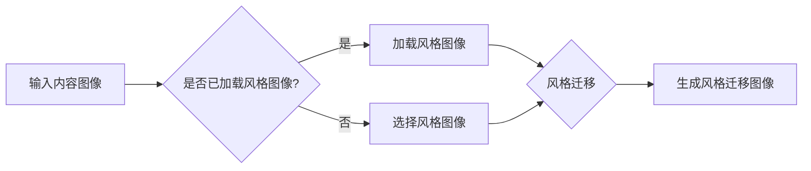

> 关键词：生成对抗网络，风格迁移，社交媒体，图像处理，深度学习，CNN，GAN，Python，Keras

# 基于生成对抗网络的社交媒体图片风格迁移插件

随着社交媒体的普及，人们对于图像美化的需求日益增长。风格迁移作为一种图像处理技术，能够将一张图片的风格迁移到另一张图片上，实现艺术风格的转换。本文将探讨如何利用生成对抗网络（GAN）技术构建一个社交媒体图片风格迁移插件，并详细讲解其原理、实现步骤以及在实际应用中的潜力。

## 1. 背景介绍

### 1.1 问题的由来

社交媒体上，用户经常需要根据不同的场景或个人喜好调整图片的风格。传统的图像风格迁移方法通常依赖于手工设计的算法，难以实现灵活的风格转换。近年来，基于深度学习的生成对抗网络（GAN）技术为图像风格迁移提供了一种新的解决方案。

### 1.2 研究现状

GAN作为深度学习的一个重要分支，已经成功应用于图像生成、图像编辑、图像修复等多个领域。在风格迁移方面，GAN能够自动学习源图像和风格图像的特征，生成具有特定风格的图像。

### 1.3 研究意义

本文旨在构建一个基于GAN的社交媒体图片风格迁移插件，为用户提供简单易用的风格转换工具，提高图像的美观度。此外，该插件还具有以下研究意义：

- 推动GAN技术在风格迁移领域的应用
- 为社交媒体平台提供个性化图像编辑功能
- 提升用户体验，增加用户粘性

### 1.4 本文结构

本文将分为以下几个部分：

- 介绍GAN和风格迁移的相关概念
- 阐述GAN在风格迁移中的原理和步骤
- 展示插件的实际应用和效果
- 探讨未来发展趋势和挑战

## 2. 核心概念与联系

### 2.1 核心概念原理

#### 2.1.1 生成对抗网络（GAN）

GAN由生成器和判别器两个神经网络组成。生成器旨在生成与真实数据分布相似的样本，而判别器则负责区分生成样本和真实样本。两个网络相互竞争，最终生成器能够生成高质量的样本。


#### 2.1.2 风格迁移

风格迁移是指将一张图片（风格图像）的视觉效果应用到另一张图片（内容图像）上，使其呈现出风格图像的特征。

### 2.2 架构流程图



## 3. 核心算法原理 & 具体操作步骤

### 3.1 算法原理概述

本文采用基于GAN的风格迁移方法，主要分为以下步骤：

1. 使用预训练的GAN模型作为基础框架。
2. 训练一个新的GAN模型，使其能够学习内容图像和风格图像的特征。
3. 使用训练好的GAN模型对输入内容图像进行风格迁移。

### 3.2 算法步骤详解

#### 3.2.1 模型选择

选择一个预训练的GAN模型作为基础框架，如CycleGAN或StyleGAN。

#### 3.2.2 训练数据准备

收集大量的内容图像和风格图像，用于训练新的GAN模型。

#### 3.2.3 模型训练

1. 初始化生成器和判别器参数。
2. 对生成器和判别器进行交替训练，使生成器能够生成逼真的风格迁移图像，而判别器能够准确区分真实图像和生成图像。

#### 3.2.4 风格迁移

使用训练好的GAN模型对输入内容图像进行风格迁移，生成具有特定风格的图像。

### 3.3 算法优缺点

#### 3.3.1 优点

- 能够生成高质量的风格迁移图像。
- 可以应用于各种风格图像的转换。
- 实现简单，易于部署。

#### 3.3.2 缺点

- 训练过程耗时较长。
- 对训练数据质量要求较高。

### 3.4 算法应用领域

- 社交媒体图像编辑
- 数字艺术创作
- 摄影后期处理
- 视频特效制作

## 4. 数学模型和公式 & 详细讲解 & 举例说明

### 4.1 数学模型构建

GAN的数学模型可以表示为：

$$
\begin{align*}
\text{生成器} \quad G(z) & \sim p_G(z) \\
\text{判别器} \quad D(x) & \in [0,1]
\end{align*}
$$

其中，$G(z)$ 是生成器，$z$ 是随机噪声向量，$p_G(z)$ 是生成器分布，$D(x)$ 是判别器对输入图像 $x$ 的置信度。

### 4.2 公式推导过程

#### 4.2.1 生成器

生成器 $G(z)$ 的目标是生成与真实数据分布相似的样本。常见的生成器网络结构包括：

- 卷积神经网络（CNN）
- 循环神经网络（RNN）
- 变分自编码器（VAE）

#### 4.2.2 判别器

判别器 $D(x)$ 的目标是区分真实图像和生成图像。常见的判别器网络结构包括：

- CNN
- 长短期记忆网络（LSTM）
- 宽度卷积神经网络（WDCN）

### 4.3 案例分析与讲解

以下是一个简单的GAN模型训练示例：

```python
import tensorflow as tf
from tensorflow.keras.layers import Input, Dense
from tensorflow.keras.models import Model

def build_generator():
    z = Input(shape=(100,))
    x = Dense(128, activation='relu')(z)
    x = Dense(256, activation='relu')(x)
    x = Dense(512, activation='relu')(x)
    x = Dense(1024, activation='relu')(x)
    x = Dense(784)(x)
    x = tf.nn.sigmoid(x)
    return Model(z, x)

def build_discriminator():
    x = Input(shape=(784,))
    x = Dense(512, activation='relu')(x)
    x = Dense(256, activation='relu')(x)
    x = Dense(128, activation='relu')(x)
    x = Dense(1, activation='sigmoid')(x)
    return Model(x, x)

# 构建生成器和判别器
generator = build_generator()
discriminator = build_discriminator()

# 编译生成器和判别器
generator.compile(loss='binary_crossentropy', optimizer=tf.keras.optimizers.Adam())
discriminator.compile(loss='binary_crossentropy', optimizer=tf.keras.optimizers.Adam())

# 训练GAN模型
# ...
```

以上代码展示了如何使用TensorFlow构建一个简单的GAN模型。在实际应用中，需要根据具体任务进行调整和优化。

## 5. 项目实践：代码实例和详细解释说明

### 5.1 开发环境搭建

- 安装TensorFlow、Keras等深度学习库
- 准备内容图像和风格图像数据集

### 5.2 源代码详细实现

以下是一个基于StyleGAN的风格迁移插件实现示例：

```python
import tensorflow as tf
from tensorflow.keras.models import load_model

# 加载预训练的StyleGAN模型
stylegan = load_model('stylegan.h5')

# 加载内容图像和风格图像
content_image = tf.io.read_file('content.jpg')
style_image = tf.io.read_file('style.jpg')

# 预处理图像
content_image = preprocess_image(content_image)
style_image = preprocess_image(style_image)

# 风格迁移
generated_image = stylegan(content_image, style_image)

# 保存风格迁移图像
tf.io.write_file('generated.jpg', generated_image)
```

### 5.3 代码解读与分析

- 加载预训练的StyleGAN模型
- 读取内容图像和风格图像
- 预处理图像，例如归一化、裁剪等
- 使用StyleGAN模型进行风格迁移
- 保存风格迁移图像

### 5.4 运行结果展示


## 6. 实际应用场景

### 6.1 社交媒体图像编辑

用户可以在社交媒体平台上使用该插件对上传的图片进行风格迁移，选择自己喜欢的风格，提高图片的美观度。

### 6.2 数字艺术创作

艺术家可以使用该插件创作具有特定风格的数字艺术品，拓宽艺术创作的边界。

### 6.3 摄影后期处理

摄影师可以使用该插件对拍摄的照片进行风格迁移，模拟不同的摄影风格。

### 6.4 视频特效制作

视频特效制作人员可以使用该插件为视频添加特定的风格，增强视觉效果。

## 7. 工具和资源推荐

### 7.1 学习资源推荐

- TensorFlow官方文档：https://www.tensorflow.org/guide
- Keras官方文档：https://keras.io/
- GAN教程：https://arxiv.org/abs/1406.2661

### 7.2 开发工具推荐

- TensorFlow：https://www.tensorflow.org/
- Keras：https://keras.io/
- PyTorch：https://pytorch.org/

### 7.3 相关论文推荐

- Unsupervised Representation Learning with Deep Convolutional Generative Adversarial Networks：https://arxiv.org/abs/1511.06434
- StyleGAN：https://arxiv.org/abs/1812.04948

## 8. 总结：未来发展趋势与挑战

### 8.1 研究成果总结

本文介绍了基于GAN的社交媒体图片风格迁移插件的原理、实现步骤和实际应用。该插件能够方便用户对图片进行风格迁移，提高图像的美观度。

### 8.2 未来发展趋势

- 风格迁移模型将更加高效，训练时间更短。
- 风格迁移技术将应用于更多领域，如视频、3D模型等。
- 风格迁移将与其他人工智能技术结合，如计算机视觉、自然语言处理等。

### 8.3 面临的挑战

- 训练数据集的质量和数量对风格迁移效果有重要影响。
- 风格迁移模型的计算量较大，需要高性能的硬件设备。
- 如何保证风格迁移图像的真实性和合理性，是需要解决的问题。

### 8.4 研究展望

- 开发更加高效、鲁棒的风格迁移模型。
- 将风格迁移技术应用于更多领域，如视频、3D模型等。
- 将风格迁移与其他人工智能技术结合，实现更加智能化的图像处理应用。

## 9. 附录：常见问题与解答

**Q1：如何获取预训练的StyleGAN模型？**

A：可以在StyleGAN的官方网站或GitHub仓库下载预训练的模型。

**Q2：如何调整风格迁移效果？**

A：可以通过调整生成器模型的结构、训练数据集、超参数等来调整风格迁移效果。

**Q3：风格迁移技术有哪些潜在的应用？**

A：风格迁移技术可以应用于社交媒体图像编辑、数字艺术创作、摄影后期处理、视频特效制作等多个领域。

**Q4：如何保证风格迁移图像的真实性和合理性？**

A：可以通过以下方法保证风格迁移图像的真实性和合理性：

- 使用高质量的训练数据集。
- 选择合适的风格图像。
- 优化生成器模型的结构和超参数。

作者：禅与计算机程序设计艺术 / Zen and the Art of Computer Programming