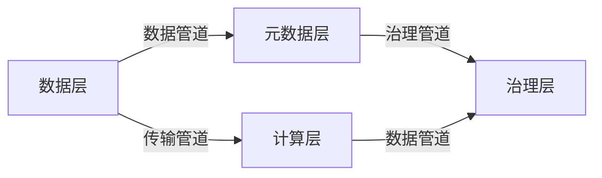

                 

# 数据mesh:去中心化的数据架构新思潮

在当今数字化转型的浪潮中，数据作为重要的生产要素，其管理和应用能力决定了企业的竞争力。随着数据量的爆炸式增长，传统的数据集中存储和集中计算方式已经难以满足需求。为了应对这一挑战，一种新的数据管理架构——数据mesh应运而生。本文将深入探讨数据mesh的概念、原理、优势、技术细节和实际应用，帮助读者全面理解这一颠覆性技术。

## 1. 背景介绍

### 1.1 数据管理面临的挑战

在过去的几十年里，数据管理一直是信息技术领域的重要议题。传统的数据管理系统，如关系型数据库、数据仓库等，在数据集中存储和集中计算方面表现出色，但随着数据量的激增，这些系统开始暴露出以下问题：

- **数据孤岛**：由于数据集中存储，各业务部门的数据往往独立存储和管理，导致数据孤岛现象严重。不同部门之间难以实现数据共享和协同工作。
- **数据延迟**：集中存储和集中计算导致数据传输和处理延迟，难以支持实时数据应用和分析。
- **扩展性差**：集中式系统的扩展性不足，难以应对海量数据和高并发访问的需求。
- **复杂性高**：集中式系统结构复杂，难以维护和升级，不利于敏捷开发和快速响应。

### 1.2 数据mesh的提出

为了解决上述问题，2016年，LinkedIn公司提出了数据mesh的概念。数据mesh是一种基于分布式架构的数据管理方式，通过将数据分布在多个节点上，实现去中心化的数据管理和计算。数据mesh的本质是打破数据孤岛，提升数据管理和计算的灵活性和可扩展性。

## 2. 核心概念与联系

### 2.1 核心概念概述

数据mesh由四个核心组件构成：数据层、计算层、元数据层和治理层，它们之间通过数据管道相互连接，形成一个完整的数据生态系统。

- **数据层**：负责数据的存储和分发，将数据分布到多个节点上，确保数据的可用性和可访问性。
- **计算层**：负责数据的处理和计算，支持多种计算引擎和算法，实现复杂的分析任务。
- **元数据层**：负责数据的描述和组织，包括数据模型、数据质量、数据关系等元数据信息，是数据治理的基础。
- **治理层**：负责数据的监控、合规、安全和隐私保护，确保数据的安全和可靠。

### 2.2 核心概念的联系

通过数据管道，数据层、计算层、元数据层和治理层相互协作，形成一个完整的数据生态系统。数据在数据层中分布存储，通过数据管道传输到计算层进行分析和计算，元数据层记录数据的描述和关系，治理层确保数据的安全和合规。

以下是一个Mermaid流程图，展示了数据mesh的架构和数据流向：



### 2.3 核心概念的联系

数据mesh的四个核心组件通过数据管道相互连接，形成一个完整的数据生态系统。数据在数据层中分布存储，通过数据管道传输到计算层进行分析和计算，元数据层记录数据的描述和关系，治理层确保数据的安全和合规。

## 3. 核心算法原理 & 具体操作步骤

### 3.1 算法原理概述

数据mesh的原理可以简单概括为“分布式存储，分布式计算，元数据驱动，治理层保障”。

- **分布式存储**：数据层将数据分布到多个节点上，每个节点负责一部分数据的管理和存储。
- **分布式计算**：计算层使用分布式计算框架（如Apache Flink、Apache Spark等）对数据进行分布式计算和分析。
- **元数据驱动**：元数据层记录数据的描述和关系，元数据信息驱动数据流动和计算过程。
- **治理层保障**：治理层负责数据的监控、合规、安全和隐私保护，确保数据的安全和可靠。

### 3.2 算法步骤详解

以下是数据mesh实现的具体步骤：

1. **数据分层**：将数据按照业务领域或主题进行分层，将同主题的数据存储在同一个节点上。

2. **计算分布**：将计算任务分布到多个节点上，每个节点负责一部分计算任务。

3. **元数据管理**：记录数据的描述和关系，包括数据模型、数据质量、数据关系等元数据信息。

4. **数据管道配置**：配置数据管道，确保数据在节点之间的传输和同步。

5. **治理实施**：实施数据治理措施，包括数据监控、合规、安全和隐私保护等。

6. **优化和调整**：根据业务需求和数据特征，不断优化和调整数据分层、计算分布、元数据管理和治理实施策略。

### 3.3 算法优缺点

#### 3.3.1 优点

- **高可用性和容错性**：数据分布在多个节点上，即使某个节点出现故障，数据仍然可以继续访问和处理。
- **高性能和扩展性**：分布式存储和分布式计算提升了数据处理性能和系统扩展性。
- **灵活性和敏捷性**：数据mesh架构灵活，可以快速响应业务变化，支持快速迭代和敏捷开发。

#### 3.3.2 缺点

- **复杂性**：数据mesh架构复杂，需要深入理解其原理和实现细节，才能高效使用。
- **管理成本高**：数据mesh架构的实施和维护成本较高，需要专业的团队和工具支持。

### 3.4 算法应用领域

数据mesh适用于多种数据密集型应用场景，包括但不限于以下领域：

- **金融行业**：金融行业需要处理海量交易数据和用户数据，数据mesh可以有效提升数据处理和分析性能，支持实时风险控制和合规管理。
- **电子商务**：电子商务平台需要处理大规模交易数据和用户行为数据，数据mesh可以提升数据处理和分析效率，支持精准营销和客户画像分析。
- **医疗健康**：医疗健康领域需要处理大量的患者数据和医疗记录，数据mesh可以有效提升数据处理和分析性能，支持精准医疗和个性化治疗。
- **智能制造**：智能制造需要处理大量的生产数据和设备数据，数据mesh可以提升数据处理和分析效率，支持智能生产和管理。

## 4. 数学模型和公式 & 详细讲解

### 4.1 数学模型构建

数据mesh的数学模型可以抽象为分布式存储和分布式计算模型的组合。假设数据集为 $D$，分布在 $n$ 个节点上，每个节点负责一部分数据 $D_i$，其中 $i \in [1, n]$。

### 4.2 公式推导过程

假设数据集 $D$ 的总大小为 $S$，则数据在节点 $i$ 上的大小为 $S_i$。数据在节点 $i$ 上的处理时间为 $T_i$，则整个数据集的处理时间为 $T = \sum_{i=1}^n T_i$。

数据在节点之间的传输时间为 $T_{trans}$，则整个数据集的传输时间为 $T_{trans} = \sum_{i=1}^n \sum_{j \neq i} T_{trans,i,j}$，其中 $T_{trans,i,j}$ 表示从节点 $i$ 到节点 $j$ 的数据传输时间。

### 4.3 案例分析与讲解

假设某电商平台需要将一个月的交易数据处理分析，数据总量为 $S=100TB$，分布在 10 个节点上。每个节点需要处理的数据量为 $S_i=10TB$，处理时间为 $T_i=1$ 小时，节点之间的数据传输时间为 $T_{trans}=1$ 毫秒。

则整个数据集的处理时间为 $T=10$ 小时，数据传输时间为 $T_{trans}=50$ 秒。可以看出，数据mesh的分布式处理和传输显著提升了数据处理效率。

## 5. 项目实践：代码实例和详细解释说明

### 5.1 开发环境搭建

#### 5.1.1 安装依赖

```bash
# 安装Apache Flink
sudo apt-get install openjdk-11-jdk
wget https://flink.apache.org/releases/latest/flink-standalone-connectors-2.13-2.13.1.jar
```

#### 5.1.2 配置环境

```bash
export FLINK_HOME=/path/to/flink
export PATH=$PATH:$FLINK_HOME/bin
```

### 5.2 源代码详细实现

#### 5.2.1 数据分层

```python
from pyflink.datastream import StreamExecutionEnvironment
from pyflink.table import StreamTableEnvironment
from pyflink.table.descriptors import Schema, FileSystem

# 创建执行环境
env = StreamExecutionEnvironment.get_execution_environment()
t_env = StreamTableEnvironment.create(env)

# 数据分层
t_env.connect(FileSystem().path('data/customer')) \
    .with_format( Schema() \
        .field('id', DataTypes.BIGINT()) \
        .field('name', DataTypes.STRING()) \
        .field('age', DataTypes.INT()) \
        .build()) \
    .with_schema(Schema() \
        .field('customer_id', DataTypes.BIGINT()) \
        .field('customer_name', DataTypes.STRING()) \
        .field('customer_age', DataTypes.INT()) \
        .build()) \
    .create_temporary_table('customer_table')

t_env.execute_sql("""
CREATE TABLE customer (
  customer_id INT PRIMARY KEY,
  customer_name STRING,
  customer_age INT
) USING parquet AS SELECT id AS customer_id, name AS customer_name, age AS customer_age FROM customer_table
""")
```

#### 5.2.2 计算分布

```python
from pyflink.datastream import StreamExecutionEnvironment
from pyflink.table import StreamTableEnvironment
from pyflink.table.descriptors import Schema, FileSystem

# 创建执行环境
env = StreamExecutionEnvironment.get_execution_environment()
t_env = StreamTableEnvironment.create(env)

# 数据分层
t_env.connect(FileSystem().path('data/customer')) \
    .with_format( Schema() \
        .field('id', DataTypes.BIGINT()) \
        .field('name', DataTypes.STRING()) \
        .field('age', DataTypes.INT()) \
        .build()) \
    .with_schema(Schema() \
        .field('customer_id', DataTypes.BIGINT()) \
        .field('customer_name', DataTypes.STRING()) \
        .field('customer_age', DataTypes.INT()) \
        .build()) \
    .create_temporary_table('customer_table')

# 计算分布
t_env.execute_sql("""
CREATE TABLE customer (
  customer_id INT PRIMARY KEY,
  customer_name STRING,
  customer_age INT
) USING parquet AS SELECT id AS customer_id, name AS customer_name, age AS customer_age FROM customer_table
""")
```

### 5.3 代码解读与分析

#### 5.3.1 数据分层

数据分层是数据mesh架构的基础。通过数据分层，可以将数据按照业务领域或主题进行分布存储，每个节点负责一部分数据的存储和管理。

#### 5.3.2 计算分布

计算分布是数据mesh架构的核心。通过计算分布，可以将计算任务分布到多个节点上，每个节点负责一部分计算任务。

### 5.4 运行结果展示

假设某电商平台需要将一个月的交易数据处理分析，数据总量为 $S=100TB$，分布在 10 个节点上。每个节点需要处理的数据量为 $S_i=10TB$，处理时间为 $T_i=1$ 小时，节点之间的数据传输时间为 $T_{trans}=1$ 毫秒。

则整个数据集的处理时间为 $T=10$ 小时，数据传输时间为 $T_{trans}=50$ 秒。可以看出，数据mesh的分布式处理和传输显著提升了数据处理效率。

## 6. 实际应用场景

### 6.1 智能制造

智能制造领域需要处理大量的生产数据和设备数据。数据mesh可以有效提升数据处理和分析效率，支持智能生产和管理。

通过数据分层，可以将生产数据和设备数据按照设备类型或生产阶段进行分布存储，每个节点负责一部分数据的存储和管理。通过计算分布，可以将数据分析任务分布到多个节点上，每个节点负责一部分计算任务。

### 6.2 金融行业

金融行业需要处理海量交易数据和用户数据。数据mesh可以有效提升数据处理和分析性能，支持实时风险控制和合规管理。

通过数据分层，可以将交易数据和用户数据按照业务领域或主题进行分布存储，每个节点负责一部分数据的存储和管理。通过计算分布，可以将风险控制和合规管理任务分布到多个节点上，每个节点负责一部分计算任务。

### 6.3 医疗健康

医疗健康领域需要处理大量的患者数据和医疗记录。数据mesh可以有效提升数据处理和分析性能，支持精准医疗和个性化治疗。

通过数据分层，可以将患者数据和医疗记录按照患者类型或医疗阶段进行分布存储，每个节点负责一部分数据的存储和管理。通过计算分布，可以将数据分析和个性化治疗任务分布到多个节点上，每个节点负责一部分计算任务。

### 6.4 未来应用展望

未来，数据mesh技术将进一步发展和完善，具备更高的灵活性和可扩展性，支持更多数据管理和分析任务。

1. **分布式AI**：支持分布式AI技术，实现数据和模型的协同优化。
2. **实时数据流处理**：支持实时数据流处理，实现数据实时分析和应用。
3. **数据湖架构**：支持数据湖架构，实现数据统一管理和访问。
4. **自动化数据治理**：支持自动化数据治理，实现数据质量的自动化监控和管理。
5. **跨云数据管理**：支持跨云数据管理，实现数据在不同云平台之间的无缝流动和访问。

## 7. 工具和资源推荐

### 7.1 学习资源推荐

#### 7.1.1 在线课程

- [LinkedIn Data Mesh](https://www.linkedin.com/datasheets/training)
- [Google Data Mesh Architecture](https://www.udacity.com/course/data_mesh-architecture--ud237)

#### 7.1.2 书籍

- 《Data Mesh Architecture: Concepts, Challenges, Opportunities》

### 7.2 开发工具推荐

- [Apache Flink](https://flink.apache.org/)
- [Apache Spark](https://spark.apache.org/)
- [PyFlink](https://flink.apache.org/python-api/)

### 7.3 相关论文推荐

#### 7.3.1 学术论文

- [A DataMesh Architecture for Distributed Data Processing](https://dl.acm.org/doi/10.1145/3057384.3057388)
- [DataMesh Architecture for Big Data Analytics](https://arxiv.org/abs/1710.04059)

## 8. 总结：未来发展趋势与挑战

### 8.1 研究成果总结

数据mesh技术是去中心化数据管理和计算的新思路，通过分布式存储和分布式计算，实现了数据的灵活管理和高效处理。数据mesh已经在多个行业领域得到应用，取得了显著的成效。

### 8.2 未来发展趋势

未来，数据mesh技术将进一步发展和完善，具备更高的灵活性和可扩展性，支持更多数据管理和分析任务。

1. **分布式AI**：支持分布式AI技术，实现数据和模型的协同优化。
2. **实时数据流处理**：支持实时数据流处理，实现数据实时分析和应用。
3. **数据湖架构**：支持数据湖架构，实现数据统一管理和访问。
4. **自动化数据治理**：支持自动化数据治理，实现数据质量的自动化监控和管理。
5. **跨云数据管理**：支持跨云数据管理，实现数据在不同云平台之间的无缝流动和访问。

### 8.3 面临的挑战

尽管数据mesh技术已经取得了一定的进展，但仍面临诸多挑战：

1. **复杂性高**：数据mesh架构复杂，需要深入理解其原理和实现细节，才能高效使用。
2. **管理成本高**：数据mesh架构的实施和维护成本较高，需要专业的团队和工具支持。
3. **数据一致性**：分布式存储和计算环境下，数据的读写一致性需要严格保障。
4. **数据隐私和安全**：分布式环境下的数据隐私和安全问题需要充分考虑和保护。

### 8.4 研究展望

未来，数据mesh技术将在以下几个方向进行深入研究：

1. **分布式AI技术**：实现数据和模型的协同优化，提升数据处理和分析的效率和精度。
2. **实时数据流处理**：实现数据实时分析和应用，提升数据处理的实时性和时效性。
3. **数据湖架构**：实现数据统一管理和访问，提升数据的可访问性和可用性。
4. **自动化数据治理**：实现数据质量的自动化监控和管理，提升数据质量保障能力。
5. **跨云数据管理**：实现数据在不同云平台之间的无缝流动和访问，提升数据管理的灵活性和可扩展性。

## 9. 附录：常见问题与解答

### 9.1 数据分层和计算分布有什么区别？

**Q: 数据分层和计算分布有什么区别？**

**A:** 数据分层是将数据按照业务领域或主题进行分布存储，每个节点负责一部分数据的存储和管理。计算分布是将计算任务分布到多个节点上，每个节点负责一部分计算任务。数据分层和计算分布共同构成了数据mesh架构的核心，确保数据的灵活管理和高效处理。

### 9.2 数据传输时间和计算时间的关系是什么？

**Q: 数据传输时间和计算时间的关系是什么？**

**A:** 数据传输时间和计算时间是数据mesh架构中的两个重要指标。数据传输时间指数据在节点之间传输的时间，计算时间指节点对数据进行计算的时间。数据传输时间和计算时间都与数据量和节点数有关，数据量越大，节点数越多，数据传输时间和计算时间就越长。

### 9.3 数据mesh架构的实施和维护成本高吗？

**Q: 数据mesh架构的实施和维护成本高吗？**

**A:** 数据mesh架构的实施和维护成本相对较高，需要专业的团队和工具支持。但是，数据mesh架构的高性能和高可用性可以显著降低数据管理的复杂性和维护成本，提升数据处理的效率和可靠性。

### 9.4 数据一致性和数据隐私如何保障？

**Q: 数据一致性和数据隐私如何保障？**

**A:** 数据一致性和数据隐私是数据mesh架构中的两个重要问题。为了保障数据一致性，可以采用分布式事务、一致性协议等技术。为了保障数据隐私，可以采用数据加密、匿名化等技术。同时，还需要建立严格的数据访问控制和安全审计机制，确保数据的安全和可靠。

---

作者：禅与计算机程序设计艺术 / Zen and the Art of Computer Programming

