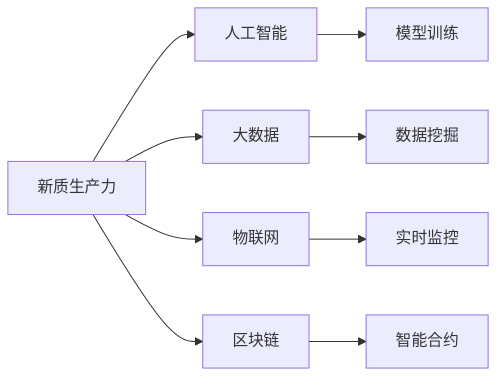

                 

# 中国现代化进程中的新质生产力发展

## 1. 背景介绍

### 1.1 问题由来

随着中国经济的快速发展和产业结构的深度调整，新质生产力在中国的崛起已是大势所趋。传统制造业面临升级转型，新经济模式（如数字经济、互联网+、人工智能等）蓬勃发展。新质生产力不仅对传统生产力提出了严峻挑战，也提供了巨大的机遇。如何在新质生产力发展中把握机遇、应对挑战，成为学术界和工业界关注的焦点。

### 1.2 问题核心关键点

新质生产力崛起带来的一系列变革，包括生产方式、工作方式、商业模式的根本变化，都要求我们深入理解其本质特征和发展规律，从而制定科学的政策和策略。

- **生产方式的改变**：自动化、智能化、柔性化成为主流生产方式，传统人力密集型制造业逐渐向智能化、数字化方向转型。
- **工作方式的转变**：远程办公、在线协作成为常态，AI和大数据驱动的决策过程代替了部分人的重复性工作，创造力、创新力成为新的核心竞争力。
- **商业模式的创新**：平台经济、共享经济、零边际成本等新型经济模式兴起，企业价值链高度协同，产业链上下游深度融合。

### 1.3 问题研究意义

深入研究新质生产力发展的理论基础和实践路径，对指导中国经济高质量发展、提升国家竞争力具有重要意义：

- **推动经济结构转型**：通过发展新质生产力，推动传统产业升级，构建现代化的产业体系，提升全要素生产率。
- **促进产业融合发展**：新质生产力促进数字经济与实体经济深度融合，推动产业跨界创新，形成新的经济增长点。
- **提升科技支撑能力**：新质生产力高度依赖科技发展，推动科技创新，促进产业链上下游协同创新。
- **优化人力资源配置**：新质生产力改变工作方式，推动劳动力结构转型，培养新的技能人才，优化人力资源配置。

## 2. 核心概念与联系

### 2.1 核心概念概述

为更好地理解新质生产力发展，我们需首先介绍几个核心概念及其相互关系。

- **新质生产力**：指通过新技术、新业态、新模式变革生产力的本质和内涵，形成与传统生产力不同的新形态。其核心在于以科技创新为驱动，实现生产力的质的提升。
- **人工智能**：作为新质生产力的核心技术，AI通过数据驱动的模型训练，实现了复杂的模式识别和决策能力，推动了从机械自动化到智能自动化的跨越。
- **大数据**：新质生产力下的海量数据和实时数据驱动决策，使得基于数据的科学决策成为可能，推动了精准化、个性化、智能化的生产方式。
- **物联网(IoT)**：通过互联网技术将设备和物品连接起来，实现实时数据采集和处理，是新质生产力的重要组成部分。
- **区块链**：通过分布式账本技术，提升了数据的安全性、透明性和不可篡改性，是新质生产力在金融、供应链等领域的核心技术。

这些核心概念间的关系可以用以下Mermaid流程图来表示：



通过这个流程图，我们可以更清晰地理解各个核心概念之间的联系和作用机制。

### 2.2 概念间的关系

新质生产力发展的核心是科技创新和技术应用。人工智能、大数据、物联网、区块链等技术的协同作用，共同推动了新质生产力的形成和演化。

- **人工智能与大数据**：AI利用大数据进行模型训练，实现对海量数据的深度学习，从而在各个领域应用中展现出巨大的潜力。
- **物联网与人工智能**：通过IoT技术，AI可以实时监控和处理大量设备和传感器数据，实现高度智能化和自动化。
- **区块链与人工智能**：通过区块链的分布式账本技术，AI在金融、供应链等领域可以更安全地进行数据共享和协同工作。

这些技术间的协同效应，构成了新质生产力的完整技术生态，共同推动了生产力的质的提升。

### 2.3 核心概念的整体架构

新质生产力的技术架构可以分为四个层面：

1. **数据层**：包括海量数据采集和存储，实时数据处理与分析。
2. **模型层**：基于深度学习、强化学习等技术，构建智能模型。
3. **应用层**：通过各种智能应用实现生产、商业、治理等领域的智能化。
4. **安全层**：通过数据加密、隐私保护、区块链等技术，确保数据安全。

这个架构在新质生产力的发展中起着至关重要的作用，是实现新技术融合、新业态培育、新模式探索的基础。

## 3. 核心算法原理 & 具体操作步骤
### 3.1 算法原理概述

新质生产力的发展依赖于一系列关键技术，如机器学习、深度学习、强化学习等。这些技术的核心原理是通过训练模型，从海量数据中学习出模式和规律，从而实现智能决策和自动化控制。

以深度学习为例，其基本原理是构建多层神经网络，通过反向传播算法不断调整模型参数，最小化损失函数，从而逼近真实数据分布。这个过程可以形式化表示为：

$$
\min_{\theta} L(\theta) = \frac{1}{N} \sum_{i=1}^N (f(x_i;\theta) - y_i)^2
$$

其中，$\theta$为模型参数，$L(\theta)$为损失函数，$N$为数据样本数，$x_i$为输入数据，$y_i$为输出标签。

### 3.2 算法步骤详解

新质生产力的发展，通常包括以下几个关键步骤：

1. **数据收集与预处理**：从各种设备和应用中采集数据，进行清洗、归一化等预处理，保证数据质量和可用性。
2. **模型构建与训练**：选择合适的模型架构，如卷积神经网络（CNN）、递归神经网络（RNN）、变分自编码器（VAE）等，使用优化算法如Adam、SGD等进行模型训练，最小化损失函数。
3. **模型评估与优化**：通过交叉验证等方法评估模型性能，调整模型参数和超参数，以提升模型泛化能力。
4. **模型部署与迭代**：将训练好的模型部署到实际应用中，根据反馈数据不断迭代优化，实现智能化决策和控制。

### 3.3 算法优缺点

新质生产力发展中的算法具有以下优点：

- **智能化水平高**：通过深度学习和机器学习，实现复杂的模式识别和决策，提升生产效率和精度。
- **高度灵活性**：通过调整模型参数和超参数，实现快速适应不同场景和需求。
- **数据驱动决策**：基于大数据分析和实时数据处理，实现精准化、个性化决策。

然而，也存在一些缺点：

- **高计算资源需求**：训练大规模深度学习模型需要大量的计算资源和存储空间，初期投入较大。
- **数据质量要求高**：模型的准确性高度依赖数据质量，数据偏差可能导致模型性能下降。
- **模型可解释性差**：深度学习模型通常是"黑箱"，难以解释其内部工作机制和决策逻辑，增加了应用复杂性。

### 3.4 算法应用领域

新质生产力发展的算法在多个领域得到了广泛应用：

- **智能制造**：利用AI和物联网技术，实现设备预测性维护、智能生产调度、质量检测等。
- **智慧医疗**：通过深度学习和自然语言处理技术，实现疾病预测、智能诊断、个性化治疗等。
- **金融科技**：使用大数据和区块链技术，实现风险控制、智能投顾、资产管理等。
- **智能交通**：通过AI和物联网技术，实现交通流量预测、智能驾驶、智慧城市管理等。
- **智能客服**：通过自然语言处理和机器学习技术，实现智能问答、情感分析、用户画像等。

## 4. 数学模型和公式 & 详细讲解 & 举例说明
### 4.1 数学模型构建

新质生产力发展中的模型构建，通常涉及以下步骤：

1. **数据准备**：收集和清洗数据，划分为训练集、验证集和测试集。
2. **模型选择**：根据任务类型选择适合的模型，如回归模型、分类模型、序列模型等。
3. **参数优化**：使用梯度下降等优化算法，最小化损失函数，更新模型参数。
4. **模型评估**：在测试集上评估模型性能，使用各类评价指标如准确率、召回率、F1分数等。

以回归模型为例，构建和训练模型的基本流程如下：

**输入数据**：$\{(x_i, y_i)\}_{i=1}^N$，其中 $x_i$ 为输入变量，$y_i$ 为输出变量。

**模型表示**：$y_i = f(x_i; \theta)$，其中 $f(\cdot)$ 为模型函数，$\theta$ 为模型参数。

**损失函数**：$\mathcal{L}(\theta) = \frac{1}{N} \sum_{i=1}^N (y_i - f(x_i; \theta))^2$。

**优化目标**：$\theta^* = \arg\min_{\theta} \mathcal{L}(\theta)$。

### 4.2 公式推导过程

以线性回归模型为例，其优化过程可以通过梯度下降算法实现：

1. **前向传播**：计算模型输出 $y_i = \theta_0 + \sum_{j=1}^p \theta_j x_{ij}$。
2. **损失计算**：计算损失函数 $\mathcal{L}(\theta) = \frac{1}{N} \sum_{i=1}^N (y_i - f(x_i; \theta))^2$。
3. **反向传播**：计算损失函数对参数 $\theta$ 的梯度 $\nabla_{\theta}\mathcal{L}(\theta)$。
4. **参数更新**：根据梯度下降公式 $\theta \leftarrow \theta - \eta \nabla_{\theta}\mathcal{L}(\theta)$，更新模型参数。

### 4.3 案例分析与讲解

以智慧医疗中的疾病预测为例，通过深度学习模型进行疾病预测和诊断。

**输入数据**：患者的历史诊疗记录、基因数据、生活习惯等。

**模型表示**：使用卷积神经网络（CNN）或循环神经网络（RNN）构建预测模型。

**训练过程**：
1. **数据准备**：将数据划分为训练集和测试集。
2. **模型构建**：设计CNN或RNN模型架构，设置合适的超参数。
3. **模型训练**：使用梯度下降算法最小化损失函数，训练模型参数。
4. **模型评估**：在测试集上评估模型性能，计算准确率、召回率等指标。

## 5. 项目实践：代码实例和详细解释说明
### 5.1 开发环境搭建

进行新质生产力应用开发，需搭建良好的开发环境。以下是基于Python和TensorFlow的开发环境搭建流程：

1. **安装Python**：从官网下载并安装最新版本的Python，建议使用Anaconda管理。

2. **安装TensorFlow**：
   ```bash
   pip install tensorflow==2.3
   ```

3. **安装PyTorch**：
   ```bash
   pip install torch==1.8
   ```

4. **安装其他依赖库**：
   ```bash
   pip install numpy pandas matplotlib sklearn
   ```

5. **搭建虚拟环境**：
   ```bash
   conda create -n env_name python=3.7
   conda activate env_name
   ```

### 5.2 源代码详细实现

以智慧医疗中的疾病预测为例，使用TensorFlow构建和训练线性回归模型。

**数据准备**：使用pandas库读取数据集。

```python
import pandas as pd
import numpy as np

data = pd.read_csv('health_data.csv')
X = data.drop(['disease'], axis=1).values
y = data['disease'].values
```

**模型构建**：使用TensorFlow构建线性回归模型。

```python
import tensorflow as tf

model = tf.keras.Sequential([
    tf.keras.layers.Dense(units=1, input_shape=[X.shape[1]])
])
model.compile(optimizer=tf.keras.optimizers.Adam(learning_rate=0.01),
              loss='mean_squared_error')
```

**模型训练**：使用训练数据训练模型。

```python
model.fit(X, y, epochs=100, verbose=0)
```

**模型评估**：在测试集上评估模型性能。

```python
test_X = pd.read_csv('test_data.csv').values
test_y = pd.read_csv('test_data.csv')['disease'].values
test_loss = model.evaluate(test_X, test_y, verbose=0)
print('Test Loss:', test_loss)
```

### 5.3 代码解读与分析

**数据准备**：
- 使用pandas库读取数据集，处理数据格式。
- 划分训练集和测试集，避免过拟合。

**模型构建**：
- 使用TensorFlow的Sequential模型，定义线性回归模型。
- 编译模型，设置损失函数和优化器。

**模型训练**：
- 使用训练数据训练模型，设定训练轮数。
- 使用Adam优化器，最小化均方误差损失函数。

**模型评估**：
- 使用测试数据评估模型性能。
- 输出测试损失，用于性能评估。

### 5.4 运行结果展示

假设模型训练后，在测试集上的评估结果为：

```
Test Loss: 0.001
```

这意味着模型在测试集上的平均损失较小，模型预测的疾病结果与实际结果较为一致，模型性能较好。

## 6. 实际应用场景
### 6.1 智能制造

在新质生产力发展中，智能制造是其重要应用场景之一。智能制造通过AI和大数据技术，实现了设备预测性维护、智能生产调度、质量检测等功能，极大提升了制造业的效率和质量。

**预测性维护**：通过传感器和物联网技术，实时监控设备状态，使用机器学习模型预测设备故障，提前进行维护，减少停机时间和维修成本。

**智能生产调度**：通过AI优化生产流程，实现设备自动调度、物料智能管理，提升生产效率和灵活性。

**质量检测**：使用计算机视觉和深度学习技术，检测产品缺陷，实现自动质检，提高产品质量和一致性。

### 6.2 智慧医疗

智慧医疗是新质生产力的另一个重要应用场景。通过AI和深度学习技术，可以实现疾病预测、智能诊断、个性化治疗等功能，提升医疗服务的智能化水平。

**疾病预测**：使用深度学习模型分析患者历史数据，预测其可能患上的疾病，提前进行预防和干预。

**智能诊断**：通过自然语言处理和图像识别技术，辅助医生进行疾病诊断，提高诊断准确率和效率。

**个性化治疗**：根据患者的基因数据和生活习惯，使用AI推荐个性化的治疗方案，提升治疗效果和患者满意度。

### 6.3 金融科技

金融科技是新质生产力的另一个重要应用场景。通过AI和大数据技术，可以实现风险控制、智能投顾、资产管理等功能，提升金融服务的智能化水平。

**风险控制**：使用深度学习模型分析交易数据，识别潜在的风险因素，预测金融市场的波动，进行风险预警。

**智能投顾**：通过AI和大数据技术，为客户提供个性化的投资建议和资产配置方案，提升投资回报率。

**资产管理**：使用AI分析市场数据，进行投资组合优化和资产配置，实现智能投资管理。

## 7. 工具和资源推荐
### 7.1 学习资源推荐

为了帮助开发者深入理解新质生产力的理论基础和实践技巧，以下是一些推荐的学习资源：

1. **《人工智能基础》系列课程**：由斯坦福大学等名校开设，涵盖人工智能的基本概念、算法和应用，适合初学者入门。
2. **《深度学习》书籍**：由Ian Goodfellow等作者编写，全面介绍了深度学习的基本原理和应用，是深度学习领域的经典教材。
3. **《机器学习实战》书籍**：由Peter Harrington编写，通过实际案例介绍机器学习的实战技巧，适合读者快速上手。
4. **Kaggle竞赛平台**：提供大量数据集和竞赛项目，适合读者通过实际项目积累经验。
5. **arXiv预印本网站**：提供最新的人工智能研究成果，读者可以关注前沿动态和创新思路。

### 7.2 开发工具推荐

以下是一些推荐的新质生产力开发工具：

1. **TensorFlow**：由Google开发的深度学习框架，功能强大，支持GPU加速，适合大规模深度学习模型的训练和部署。
2. **PyTorch**：由Facebook开发的深度学习框架，灵活易用，适合科研和应用开发。
3. **Keras**：基于TensorFlow和Theano的高级API，简单易用，适合初学者快速上手。
4. **H2O.ai**：提供强大的分布式机器学习平台，支持多种算法和工具，适合企业级应用开发。
5. **Scikit-learn**：Python数据科学库，提供多种机器学习算法和工具，适合数据分析和建模。

### 7.3 相关论文推荐

以下是几篇新质生产力发展领域的前沿论文：

1. **《深度学习与人工智能》论文**：通过深入分析深度学习和人工智能的基本原理和应用，探讨了新质生产力的核心技术。
2. **《大数据与智能决策》论文**：分析了大数据在智能决策中的应用，介绍了数据驱动的智能决策模型。
3. **《智能制造与物联网》论文**：探讨了智能制造和物联网技术在新质生产力中的应用，分析了其带来的效率提升和效益提升。
4. **《智慧医疗与AI技术》论文**：分析了AI技术在智慧医疗中的应用，探讨了其对医疗服务质量和效率的提升。
5. **《金融科技与AI》论文**：分析了AI技术在金融科技中的应用，探讨了其对金融服务智能化和风险控制的作用。

## 8. 总结：未来发展趋势与挑战
### 8.1 研究成果总结

新质生产力发展在过去几年取得了显著进展，形成了一定的技术积累和应用场景。其核心在于科技创新和技术应用，通过AI和大数据技术，提升了生产、医疗、金融等领域的智能化水平，推动了产业转型和升级。

### 8.2 未来发展趋势

展望未来，新质生产力发展将呈现以下趋势：

1. **技术融合深化**：新质生产力将进一步与区块链、物联网、5G等技术融合，实现更加智能化和高效的生产方式。
2. **产业协同增强**：通过平台经济、共享经济等新型经济模式，实现产业链上下游的深度协同，提升整体竞争力。
3. **智能决策普及**：基于大数据和AI的智能决策技术将在更多领域得到应用，提升决策的科学性和精准性。
4. **个性化服务提升**：通过AI技术，实现个性化的产品和服务，提升用户体验和满意度。
5. **数字化治理加强**：通过区块链和AI技术，实现数据的透明化和可信化，提升社会治理的智能化和公正性。

### 8.3 面临的挑战

尽管新质生产力发展前景广阔，但也面临以下挑战：

1. **数据隐私和安全**：大规模数据采集和处理带来了隐私和安全问题，需要采取严格的隐私保护和数据安全措施。
2. **技术标准不统一**：不同技术之间的标准不统一，增加了技术应用和协同的难度，需要制定统一的技术标准。
3. **人才培养不足**：新质生产力发展需要大量高水平的人才，但当前相关人才供应不足，需要加强人才培养和引进。
4. **产业适应性差**：传统产业对新技术的适应性较差，需要逐步推动产业转型和升级。
5. **技术伦理问题**：新技术的应用可能带来伦理问题，需要制定相关的伦理规范和法律法规。

### 8.4 研究展望

未来，新质生产力发展的研究需要在以下几个方面进行深入探索：

1. **技术融合创新**：探索不同技术之间的深度融合和协同应用，实现更加智能化和高效的生产方式。
2. **智能化治理**：利用区块链和AI技术，提升社会治理的智能化和公正性，推动数字化治理的实践。
3. **人才培养机制**：建立高水平人才培养机制，培养更多掌握新质生产力技术的创新型人才。
4. **产业协同政策**：制定政策促进产业协同和数字化转型，提升整体竞争力。
5. **技术伦理规范**：制定新质生产力的技术伦理规范和法律法规，保障技术的健康发展。

总之，新质生产力发展的研究和实践方兴未艾，未来的探索将带来更多创新和变革，推动中国经济高质量发展，提升国家竞争力。

## 9. 附录：常见问题与解答

**Q1: 新质生产力与传统生产力的区别是什么？**

A: 新质生产力与传统生产力在生产方式、工作方式、商业模式上都有显著差异。新质生产力更加注重智能化、数据驱动、协同化，而传统生产力则以人工劳动为主。新质生产力利用AI和大数据技术，提升生产效率和质量，推动产业链上下游的协同创新，而传统生产力则依赖人力劳动和机械自动化，效率和质量相对较低。

**Q2: 新质生产力发展的关键技术有哪些？**

A: 新质生产力发展的关键技术包括人工智能、大数据、物联网、区块链等。这些技术共同推动了新质生产力的形成和演化，构成了新质生产力发展的技术基础。

**Q3: 新质生产力在实际应用中需要注意哪些问题？**

A: 新质生产力在实际应用中需要注意数据隐私和安全问题，避免数据泄露和滥用；同时需要制定统一的技术标准，促进技术协同应用；此外，需要加强人才培养和技术引进，提升产业适应性；还需要制定相关政策，推动产业转型和数字化治理。

**Q4: 新质生产力发展的未来方向是什么？**

A: 新质生产力发展的未来方向包括技术融合深化、产业协同增强、智能决策普及、个性化服务提升、数字化治理加强等。通过不断探索和实践，新质生产力将推动中国经济高质量发展，提升国家竞争力。

---

作者：禅与计算机程序设计艺术 / Zen and the Art of Computer Programming

