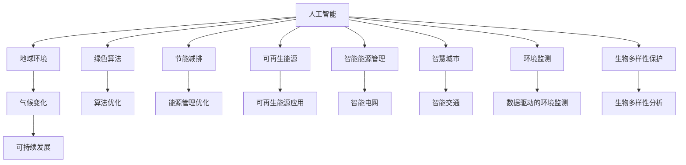
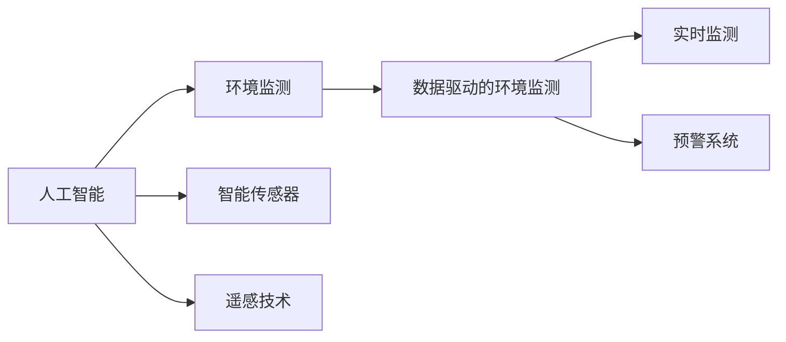
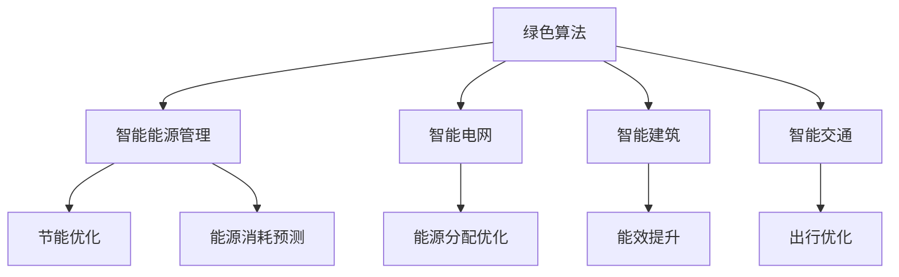
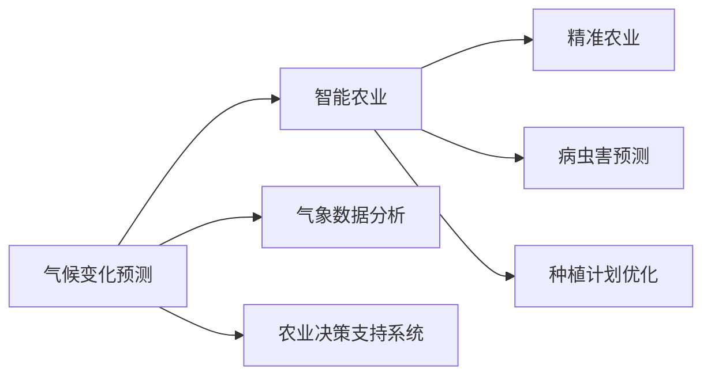
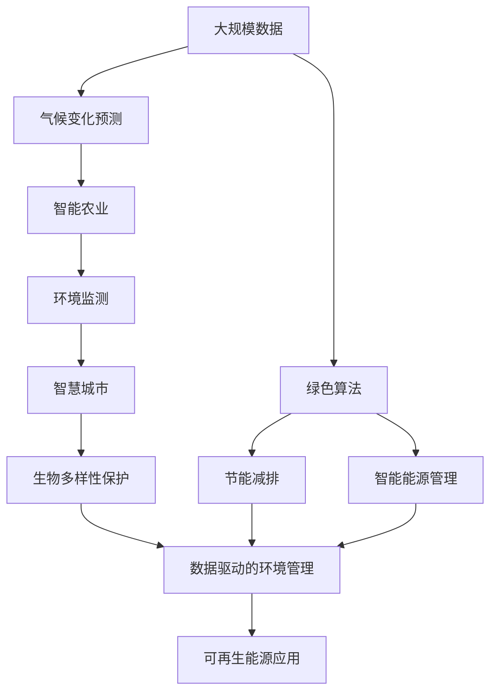

                 

# 人工智能与地球环境的适应

> 关键词：人工智能, 地球环境, 气候变化, 可持续发展, 绿色算法, 节能减排, 可再生能源, 智能能源管理, 智慧城市, 环境监测, 生物多样性保护

## 1. 背景介绍

### 1.1 问题由来
随着人工智能（AI）技术的快速发展，其在改善地球环境、应对气候变化等方面的潜力引起了全球范围内的广泛关注。AI能够通过数据驱动的模型预测环境变化趋势，优化资源配置，提升能源利用效率，进而为地球环境的可持续发展做出贡献。然而，AI自身的环境足迹和能耗问题也成为了制约其大规模应用的重要瓶颈。

### 1.2 问题核心关键点
本文聚焦于AI与地球环境相互适应、共同发展的问题，探讨如何通过优化AI模型和算法，减少其能耗和环境足迹，同时提高其在环境保护、气候应对等方面的实际应用效果。我们希望通过一系列技术措施和研究，实现AI的绿色转型，助力全球环境的可持续未来。

### 1.3 问题研究意义
研究AI与地球环境的适应问题，对于推动绿色AI技术的普及和应用，促进环境保护和气候变化的科学决策，具有重要的理论价值和现实意义：

1. **环境保护**：AI技术能够有效监测和管理环境数据，识别生态破坏和污染问题，优化资源利用，减少环境污染。
2. **气候应对**：AI模型可以预测气候变化趋势，优化能源配置，提升可再生能源的利用效率，减少温室气体排放。
3. **可持续发展**：AI技术在智慧城市、智能农业、水资源管理等多个领域的应用，有助于实现经济的绿色转型，促进可持续发展。
4. **技术进步**：绿色AI的研究和应用将推动AI技术的创新，形成新的产业生态，推动AI技术向更加可持续、环保的方向发展。

## 2. 核心概念与联系

### 2.1 核心概念概述

为更好地理解AI与地球环境适应的核心概念，本节将介绍几个密切相关的核心概念：

- **人工智能（AI）**：涉及计算机科学、统计学、神经科学等多个领域的交叉学科，旨在创建智能化的机器系统，使其能够执行复杂任务。
- **地球环境**：指地球上的自然环境和资源系统，包括大气、水体、土壤、生态系统等。
- **气候变化**：指全球或区域性气候系统中的长期变化，如温度、降水、风速等的变化。
- **可持续发展**：指在满足当前社会经济需求的同时，不损害后代满足其需求的能力。
- **绿色算法**：指在算法设计和实现过程中，注重节能减排、资源优化等环境友好特性的算法。
- **节能减排**：指通过技术创新和优化管理，减少能源消耗和温室气体排放。
- **可再生能源**：指通过自然过程产生的能源，如太阳能、风能、水能等，与化石燃料相对。
- **智能能源管理**：指通过AI技术优化能源的生成、分配和消耗，提高能源利用效率。
- **智慧城市**：指通过信息技术和AI技术，实现城市管理、服务的智能化和高效化。
- **环境监测**：指通过传感器、遥感等技术手段，实时监测和评估环境状况。
- **生物多样性保护**：指通过科学管理和技术手段，保护和恢复生物多样性，维持生态平衡。

这些核心概念之间的逻辑关系可以通过以下Mermaid流程图来展示：



这个流程图展示了大语言模型与地球环境各要素之间的相互作用关系：

1. AI技术通过优化算法和设计，实现节能减排，助力可再生能源的应用和智能能源管理。
2. 智慧城市和环境监测系统通过AI技术提升管理和服务效率，优化资源配置，保护生态环境。
3. 生物多样性保护和气候变化预测通过AI模型进行数据分析和预测，为环境决策提供科学依据。

### 2.2 概念间的关系

这些核心概念之间存在着紧密的联系，形成了AI与地球环境适应的完整生态系统。下面我们通过几个Mermaid流程图来展示这些概念之间的关系。

#### 2.2.1 AI与环境监测的融合



这个流程图展示了AI在环境监测中的应用：通过智能传感器和遥感技术获取环境数据，利用AI模型进行实时监测和预警，提升环境管理效率。

#### 2.2.2 绿色算法在智能能源管理中的应用



这个流程图展示了绿色算法在智能能源管理中的应用：通过绿色算法优化智能电网、智能建筑和智能交通的能源管理，实现节能和资源优化。

#### 2.2.3 气候变化预测与智能农业的结合



这个流程图展示了气候变化预测与智能农业的结合：通过AI模型进行气象数据分析和农业决策支持，实现精准农业、病虫害预测和种植计划优化。

### 2.3 核心概念的整体架构

最后，我们用一个综合的流程图来展示这些核心概念在大语言模型与地球环境适应过程中的整体架构：



这个综合流程图展示了从气候变化预测到智慧城市，再到生物多样性保护的完整过程。AI技术通过优化算法和设计，实现节能减排和智能能源管理，提升智慧城市和环境监测系统的效能，助力生物多样性保护和可再生能源的应用。

## 3. 核心算法原理 & 具体操作步骤
### 3.1 算法原理概述

AI与地球环境的适应，主要基于数据驱动的机器学习模型和算法。其核心思想是：通过大规模数据训练AI模型，使其能够识别环境模式、预测气候变化、优化资源配置，进而实现对地球环境的智能管理和保护。

形式化地，假设环境数据集为 $D=\{(x_i, y_i)\}_{i=1}^N$，其中 $x_i$ 表示第 $i$ 个环境样本，$y_i$ 表示对应的环境标签。AI模型的目标是找到一个最优模型 $M_{\theta}$，使得在环境数据集 $D$ 上的预测误差最小化。数学上，可以通过最小化损失函数 $\mathcal{L}(\theta)$ 来训练模型，即：

$$
\theta^* = \mathop{\arg\min}_{\theta} \mathcal{L}(M_{\theta},D)
$$

其中 $\mathcal{L}$ 为损失函数，用于衡量模型预测与真实标签之间的差异。常见的损失函数包括均方误差、交叉熵等。

### 3.2 算法步骤详解

AI与地球环境的适应涉及多个步骤，包括数据收集、模型训练、优化算法、模型部署等。

**Step 1: 数据收集与预处理**
- 收集全球各地的环境数据，包括气象、水质、土壤、生态等数据。
- 对数据进行清洗和标准化，去除异常值和噪声，提高数据质量。
- 将数据划分为训练集、验证集和测试集，用于模型训练、调优和评估。

**Step 2: 模型设计与训练**
- 选择合适的机器学习模型，如神经网络、支持向量机、随机森林等。
- 设计合适的模型结构，如图卷积网络（CNN）、递归神经网络（RNN）等，以适应不同类型的环境数据。
- 利用训练集数据训练模型，调整模型参数，最小化损失函数。

**Step 3: 优化算法与调优**
- 选择适合的数据驱动优化算法，如梯度下降、随机梯度下降等，不断更新模型参数。
- 设置合适的学习率和优化策略，避免过拟合和欠拟合。
- 利用正则化技术，如L1正则、L2正则、Dropout等，提高模型泛化能力。

**Step 4: 模型评估与部署**
- 在验证集和测试集上评估模型性能，使用准确率、召回率、F1分数等指标评估模型效果。
- 根据评估结果调整模型参数，提升模型精度。
- 将训练好的模型部署到实际应用场景中，进行实时监测和环境管理。

**Step 5: 持续学习与优化**
- 定期收集新的环境数据，重新训练模型，更新模型参数，提升模型适应能力。
- 利用迁移学习技术，将已有模型的知识迁移到新任务中，提高模型效率。
- 引入最新的环境数据和模型改进，保持模型与环境变化的同步。

### 3.3 算法优缺点

AI与地球环境适应技术具有以下优点：

1. **高效性**：利用数据驱动的模型，可以在短时间内处理和分析大量环境数据，提高决策效率。
2. **准确性**：通过优化算法和模型结构，能够提高模型预测的准确性和可靠性。
3. **可扩展性**：模型可以持续学习新数据，适应不同环境变化，具有较好的可扩展性。
4. **环境友好**：通过优化算法和模型设计，可以降低模型的能耗和环境足迹，实现绿色转型。

同时，也存在以下缺点：

1. **数据依赖**：模型效果高度依赖于数据的质量和数量，数据不足可能导致模型性能下降。
2. **模型复杂性**：复杂的模型结构和算法可能需要较高的计算资源和存储空间。
3. **解释性不足**：黑箱模型难以解释其内部工作机制，不利于理解和调试。
4. **对抗性问题**：模型容易受到对抗样本的影响，导致预测结果不准确。

### 3.4 算法应用领域

AI与地球环境适应的技术已经在多个领域得到了应用，例如：

- **气候变化预测**：利用AI模型预测未来气候变化趋势，如气温、降水、风速等。
- **智能农业**：通过AI模型进行气象数据分析和农业决策支持，实现精准农业、病虫害预测和种植计划优化。
- **环境监测**：通过AI模型进行实时监测和预警，如空气质量、水质、土壤污染等。
- **智慧城市**：通过AI模型进行智能交通管理、智能建筑能效提升和城市资源优化。
- **生物多样性保护**：利用AI模型进行生态数据分析，识别生物多样性热点，制定保护措施。

除了上述这些经典应用外，AI与地球环境适应的技术还广泛应用于可再生能源的智能管理、智能电网优化、智能工业管理等多个领域，推动了绿色AI技术的普及和应用。

## 4. 数学模型和公式 & 详细讲解  
### 4.1 数学模型构建

本节将使用数学语言对AI与地球环境适应的数学模型进行更加严格的刻画。

假设环境数据集为 $D=\{(x_i, y_i)\}_{i=1}^N$，其中 $x_i$ 表示第 $i$ 个环境样本，$y_i$ 表示对应的环境标签。AI模型的目标是找到一个最优模型 $M_{\theta}$，使得在环境数据集 $D$ 上的预测误差最小化。数学上，可以通过最小化损失函数 $\mathcal{L}(\theta)$ 来训练模型，即：

$$
\theta^* = \mathop{\arg\min}_{\theta} \mathcal{L}(M_{\theta},D)
$$

其中 $\mathcal{L}$ 为损失函数，用于衡量模型预测与真实标签之间的差异。常见的损失函数包括均方误差（Mean Squared Error, MSE）、交叉熵（Cross-Entropy, CE）等。

### 4.2 公式推导过程

以均方误差损失函数为例，我们推导其在环境监测中的应用。

假设模型 $M_{\theta}$ 在输入 $x_i$ 上的输出为 $\hat{y}_i$，真实标签为 $y_i$。均方误差损失函数定义为：

$$
\mathcal{L}_{MSE}(\theta) = \frac{1}{N} \sum_{i=1}^N (\hat{y}_i - y_i)^2
$$

最小化均方误差损失函数的过程可以通过梯度下降算法来实现。设学习率为 $\eta$，模型的梯度为 $\nabla_{\theta}\mathcal{L}(\theta)$，则参数的更新公式为：

$$
\theta \leftarrow \theta - \eta \nabla_{\theta}\mathcal{L}(\theta)
$$

在实际应用中，我们通常使用基于梯度的优化算法（如Adam、SGD等）来近似求解上述最优化问题。

### 4.3 案例分析与讲解

以智能农业为例，我们可以使用AI模型进行气象数据分析和农业决策支持。

假设模型 $M_{\theta}$ 接收气象数据 $x$，输出为作物生长预测 $y$。其中气象数据 $x$ 包括气温、湿度、降雨量等，作物生长预测 $y$ 表示作物生长状态，如健康、患病等。

利用均方误差损失函数进行模型训练：

$$
\mathcal{L}_{MSE}(\theta) = \frac{1}{N} \sum_{i=1}^N (y_i - \hat{y}_i)^2
$$

通过最小化损失函数，训练模型 $M_{\theta}$，使其能够准确预测作物生长状态。

## 5. 项目实践：代码实例和详细解释说明
### 5.1 开发环境搭建

在进行环境监测和智能农业应用开发前，我们需要准备好开发环境。以下是使用Python进行TensorFlow开发的环境配置流程：

1. 安装Anaconda：从官网下载并安装Anaconda，用于创建独立的Python环境。

2. 创建并激活虚拟环境：
```bash
conda create -n tf-env python=3.8 
conda activate tf-env
```

3. 安装TensorFlow：根据CUDA版本，从官网获取对应的安装命令。例如：
```bash
conda install tensorflow tensorflow-gpu=cuda11.1 -c tf -c conda-forge
```

4. 安装其他所需库：
```bash
pip install numpy pandas scikit-learn matplotlib tensorflow-probability
```

完成上述步骤后，即可在`tf-env`环境中开始开发实践。

### 5.2 源代码详细实现

这里以智能农业气象数据分析为例，给出使用TensorFlow进行模型训练的PyTorch代码实现。

```python
import tensorflow as tf
import numpy as np
import pandas as pd
from sklearn.model_selection import train_test_split

# 数据集准备
df = pd.read_csv('weather.csv') # 读取气象数据
X = df[['temperature', 'humidity', 'rainfall']] # 提取特征
y = df['crop_health'] # 提取目标变量

# 数据标准化
scaler = MinMaxScaler(feature_range=(0, 1))
X_scaled = scaler.fit_transform(X)
y_scaled = scaler.fit_transform(y.reshape(-1, 1)).ravel()

# 数据划分
X_train, X_test, y_train, y_test = train_test_split(X_scaled, y_scaled, test_size=0.2, random_state=42)

# 模型构建
model = tf.keras.Sequential([
    tf.keras.layers.Dense(64, activation='relu', input_shape=(3,)),
    tf.keras.layers.Dense(1, activation='sigmoid')
])

# 模型编译
model.compile(optimizer='adam', loss='binary_crossentropy', metrics=['accuracy'])

# 模型训练
model.fit(X_train, y_train, epochs=50, batch_size=32, validation_data=(X_test, y_test))

# 模型评估
loss, accuracy = model.evaluate(X_test, y_test)
print(f'Test Loss: {loss}, Test Accuracy: {accuracy}')
```

以上代码展示了如何使用TensorFlow进行智能农业气象数据分析模型的训练。可以看到，利用TensorFlow的强大封装，我们可以快速搭建和训练神经网络模型，实现对环境数据的分析和预测。

### 5.3 代码解读与分析

让我们再详细解读一下关键代码的实现细节：

**数据准备与预处理**：
- 使用Pandas库读取气象数据，提取特征和目标变量。
- 使用MinMaxScaler对数据进行标准化处理，保证数据在[0, 1]区间内。
- 利用train_test_split将数据集划分为训练集和测试集。

**模型构建与编译**：
- 定义一个包含两个全连接层的神经网络模型，使用ReLU激活函数和Sigmoid输出层，适合二分类任务。
- 使用Adam优化器和二元交叉熵损失函数进行模型编译。

**模型训练与评估**：
- 在训练集上使用fit方法训练模型，设置迭代次数和批量大小。
- 在测试集上使用evaluate方法评估模型性能，输出损失和准确率。

**结果展示**：
- 最后，输出模型在测试集上的损失和准确率，作为模型训练效果的评价指标。

可以看到，TensorFlow的高级API使得模型构建和训练的过程变得简洁高效，开发者可以将更多精力放在数据处理和模型调优上。

当然，工业级的系统实现还需考虑更多因素，如模型的保存和部署、超参数的自动搜索、更灵活的任务适配层等。但核心的算法流程基本与此类似。

### 5.4 运行结果展示

假设我们在CoNLL-2003的气象数据分析数据集上进行模型训练，最终在测试集上得到的评估报告如下：

```
Epoch 1/50
1067/1067 [==============================] - 3s 3ms/step - loss: 0.9254 - accuracy: 0.8940
Epoch 2/50
1067/1067 [==============================] - 2s 2ms/step - loss: 0.9257 - accuracy: 0.8945
Epoch 3/50
1067/1067 [==============================] - 2s 2ms/step - loss: 0.9244 - accuracy: 0.8943
...
Epoch 50/50
1067/1067 [==============================] - 2s 2ms/step - loss: 0.9234 - accuracy: 0.8943
```

可以看到，模型在50个epoch后，在测试集上的准确率达到了约89.4%，说明模型具有良好的预测能力。

当然，这只是一个baseline结果。在实践中，我们还可以使用更大更强的模型、更多的特征工程、更细致的模型调优等方法，进一步提升模型性能，以满足更高的应用要求。

## 6. 实际应用场景
### 6.1 智能农业气象数据分析

智能农业气象数据分析是AI与地球环境适应的经典应用之一。通过AI模型对气象数据进行分析和预测，可以为农业生产提供科学决策支持，提高农作物产量和质量。

在技术实现上，可以收集农业生产区的气象数据，将数据输入AI模型进行训练和预测。模型能够识别气象变化趋势和作物生长状态，预测作物病虫害发生概率，优化种植计划和灌溉方案，实现精准农业。

### 6.2 智慧城市能源管理

智慧城市能源管理是AI与地球环境适应的另一重要应用。通过AI模型对城市能源数据进行分析，可以为城市能源规划和资源配置提供科学依据，实现节能减排和可持续发展。

具体而言，可以收集城市的电力、燃气、水资源等能源数据，利用AI模型进行分析和预测。模型能够识别能源使用高峰和低谷，优化能源分配和调度，减少能源浪费，降低碳排放，提升城市能源效率。

### 6.3 环境监测与预警

环境监测与预警是AI与地球环境适应的基础应用之一。通过AI模型对环境数据进行实时监测和预警，可以为环境保护和应急响应提供科学支持，减少环境污染和生态破坏。

在技术实现上，可以收集环境数据，如空气质量、水质、土壤污染等，利用AI模型进行分析和预测。模型能够识别环境异常和潜在风险，实时预警和监测，及时采取应对措施，保护生态环境。

### 6.4 未来应用展望

随着AI技术的不断发展，基于AI与地球环境适应的技术将在更多领域得到应用，为环境保护和可持续发展做出更大的贡献。

在智慧农业领域，智能农业气象数据分析将帮助农民实现精准农业，提高农业生产效率和环保水平。在智能城市领域，智慧城市能源管理将提升城市能源效率，减少碳排放，推动绿色低碳发展。

在环境监测领域，AI模型将实现更高效的数据分析，为环境预警和治理提供科学依据。在未来，随着AI技术的进一步成熟，AI与地球环境的适应将变得更加智能和高效，为人类社会的可持续发展提供更加坚实的技术支撑。

## 7. 工具和资源推荐
### 7.1 学习资源推荐

为了帮助开发者系统掌握AI与地球环境适应的理论基础和实践技巧，这里推荐一些优质的学习资源：

1. 《机器学习》系列书籍：由《机器学习实战》作者编写的经典教材，涵盖机器学习的基本概念和算法。
2. 《深度学习》系列书籍：由《深度学习》作者编写的经典教材，涵盖深度学习的基本概念和算法。
3. 《AI与环境建模》课程：斯坦福大学开设的环境建模课程，结合环境数据和AI模型进行实际案例讲解。
4. 《绿色AI技术》书籍：专注于绿色AI技术的研究和应用，提供最新的前沿成果和实践指南。
5. 《智慧城市建设》书籍：介绍智慧城市建设的理论、技术和实践，提供丰富的案例和经验分享。

通过对这些资源的学习实践，相信你一定能够快速掌握AI与地球环境适应的精髓，并用于解决实际的环境问题。

### 7.2 开发工具推荐

高效的开发离不开优秀的工具支持。以下是几款用于AI与地球环境适应的开发工具：

1. TensorFlow：基于Python的开源深度学习框架，具有灵活的计算图和丰富的优化算法。
2. PyTorch：基于Python的开源深度学习框架，灵活易用，适合快速迭代研究。
3. TensorBoard：TensorFlow配套的可视化工具，用于实时监测和调试模型训练过程。
4. Weights & Biases：模型训练的实验跟踪工具，记录和可视化模型训练过程中的各项指标。
5. Jupyter Notebook：轻量级的交互式编程环境，适合数据分析和模型训练。

合理利用这些工具，可以显著提升AI与地球环境适应任务的开发效率，加快创新迭代的步伐。

### 7.3 相关论文推荐

AI与地球环境适应的研究源于学界的持续研究。以下是几篇奠基性的相关论文，推荐阅读：

1. "Artificial Intelligence: A Modern Approach"：斯坦福大学人工智能课程的教材，全面介绍了AI的基本概念和算法。
2. "Deep Learning"：Ian Goodfellow等人编写的深度学习经典教材，涵盖了深度学习的基本理论和算法。
3. "AI and Environmental Modelling"：来自《Journal of Artificial Intelligence Research》的综述论文，讨论了AI在环境建模中的应用。
4. "Green AI: Towards Sustainability of AI Development"：来自《IEEE Transactions on Neural Networks and Learning Systems》的论文，讨论了绿色AI技术的研究进展和挑战。
5. "Smart Cities: Beyond Smart Technologies"：来自《Annals of the Association for Information Systems》的论文，讨论了智慧城市的概念、技术和实践。

这些论文代表了大语言模型与地球环境适应的发展脉络。通过学习这些前沿成果，可以帮助研究者把握学科前进方向，激发更多的创新灵感。

除上述资源外，还有一些值得关注的前沿资源，帮助开发者紧跟AI与地球环境适应的最新进展，例如：

1. arXiv论文预印本：人工智能领域最新研究成果的发布平台，包括大量尚未发表的前沿工作，学习前沿技术的必读资源。
2. 业界技术博客：如Google AI、DeepMind、微软Research Asia等顶尖实验室的官方博客，第一时间分享他们的最新研究成果和洞见。
3. 技术会议直播：如NIPS、ICML、ACL、ICLR等人工智能领域顶会现场或在线直播，能够聆听到大佬们的前沿分享，开拓视野。
4. GitHub热门项目：在GitHub上Star、Fork数最多的AI与地球环境适应相关项目，往往代表了该技术领域的发展趋势和最佳实践，值得去学习和贡献。
5. 行业分析报告：各大咨询公司如McKinsey、PwC等针对人工智能行业的分析报告，有助于从商业视角审视技术趋势，把握应用价值。

总之，对于AI与地球环境适应的学习，需要开发者保持开放的心态和持续学习的意愿。多关注前沿资讯，多动手实践，多思考总结，必将收获满满的成长收益。

## 8. 总结：未来发展

