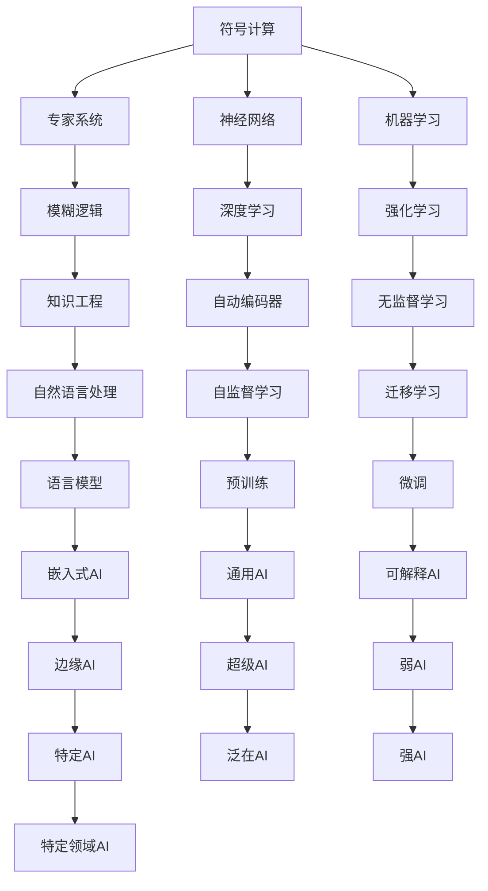

                 

# 人工智能的早期研究方向

## 1. 背景介绍

人工智能（AI）的早期研究可以追溯到20世纪50年代，当时计算机科学家和数学家试图用机器模拟人类的智能行为。这一时期的研究主要集中在符号计算、专家系统以及基于规则的推理等方面。然而，由于计算机硬件的限制和数据量的匮乏，早期的AI研究进展缓慢，未能取得重大的实际应用成果。

## 2. 核心概念与联系

### 2.1 核心概念概述

在人工智能的早期研究中，以下概念是核心的：

- **符号计算**：早期AI研究的基石，利用符号语言（如LISP）进行逻辑推理和知识表示。
- **专家系统**：基于知识库和规则的推理系统，用于模拟专家在特定领域的决策过程。
- **神经网络**：受生物学启发，模拟人脑神经元的工作方式，进行模式识别和分类。
- **机器学习**：通过数据驱动的方法，让机器从数据中学习规律，进行预测和决策。
- **模糊逻辑**：处理不确定性和不完全信息，提供比传统逻辑更为灵活的推理方法。

这些概念之间的关系可以用以下Mermaid流程图来表示：



这个流程图展示了早期AI研究的各个领域，以及它们之间的联系和相互影响。

### 2.2 概念间的关系

- **符号计算与专家系统**：符号计算提供了知识表示和逻辑推理的基础，而专家系统则利用这些知识进行决策和推理。
- **神经网络与深度学习**：神经网络是深度学习的核心，深度学习通过多层次的神经网络进行模式识别和特征提取。
- **机器学习与无监督学习**：机器学习包括监督学习和无监督学习，无监督学习通过数据挖掘发现潜在的规律和结构。
- **模糊逻辑与知识工程**：模糊逻辑处理不确定性，而知识工程则是将知识结构化，形成可操作的规则集。
- **深度学习与自然语言处理**：深度学习在自然语言处理（NLP）中发挥重要作用，特别是在语言模型和机器翻译等方面。
- **自监督学习与迁移学习**：自监督学习通过无标签数据进行预训练，迁移学习则将预训练知识应用于特定任务，减少新任务所需的训练数据量。
- **通用AI与可解释AI**：通用AI是AI研究的最终目标，可解释AI则是为了提高模型的透明度和可理解性。
- **边缘AI与超级AI**：边缘AI指的是在设备端进行的AI计算，而超级AI则是在更高级别的宏观尺度上的AI研究。

## 3. 核心算法原理 & 具体操作步骤

### 3.1 算法原理概述

早期AI研究中的算法原理主要基于以下三种：

- **符号推理**：利用符号逻辑和规则进行推理和决策。
- **统计学习**：通过数据分析和模式识别，建立数据之间的关系，进行预测和分类。
- **进化算法**：模拟自然选择过程，通过不断的试错和优化，寻找最优解。

这些算法原理共同构成了早期AI研究的理论基础。

### 3.2 算法步骤详解

以符号推理为例，其核心步骤包括：

1. **知识获取**：通过专家知识和领域文献，获取领域的知识表示。
2. **知识表示**：将知识转换为计算机可处理的形式，如逻辑表达式或框架图。
3. **推理过程**：根据知识表示和推理规则，进行逻辑推理，得出结论。
4. **推理结果**：将推理结果转换为自然语言或决策动作，进行输出。

### 3.3 算法优缺点

符号推理的优点在于其严格的逻辑性和可解释性，可以应用于医疗、法律等领域。缺点在于其复杂性高，难以处理大规模和复杂的问题。

统计学习的优点在于其数据驱动的性质，可以处理大规模数据和复杂模式。缺点在于其黑箱性质，难以理解模型的内部工作机制。

进化算法的优点在于其适应性强，可以不断优化和适应新的环境。缺点在于其随机性和不确定性，难以保证全局最优解。

### 3.4 算法应用领域

早期AI研究的应用领域主要集中在以下几个方面：

- **专家系统**：应用于医疗诊断、金融分析、法律咨询等领域，提供专家级的决策支持。
- **机器人学**：利用符号推理和机器学习，实现智能机器人的控制和决策。
- **自然语言处理**：利用符号计算和统计学习，进行文本分析和语言理解。
- **人工智能游戏**：利用进化算法和强化学习，实现自主决策的AI游戏。

## 4. 数学模型和公式 & 详细讲解 & 举例说明

### 4.1 数学模型构建

早期AI研究的数学模型主要基于以下几种：

- **逻辑代数**：用于符号推理和知识表示，如布尔代数、命题逻辑等。
- **概率论**：用于统计学习和模式识别，如贝叶斯定理、最大似然估计等。
- **微积分**：用于优化和进化算法，如梯度下降、遗传算法等。

### 4.2 公式推导过程

以贝叶斯定理为例，其推导过程如下：

$$
P(A|B) = \frac{P(B|A)P(A)}{P(B)}
$$

其中，$P(A|B)$表示在事件$B$发生的情况下事件$A$发生的概率，$P(B|A)$表示事件$A$发生的情况下事件$B$发生的概率，$P(A)$和$P(B)$分别为事件$A$和$B$的先验概率。

### 4.3 案例分析与讲解

以神经网络为例，其核心算法为反向传播（Backpropagation），用于优化神经网络的参数。其基本思想是通过链式法则计算误差对每个参数的梯度，然后用梯度下降等方法更新参数，使得误差最小化。

## 5. 项目实践：代码实例和详细解释说明

### 5.1 开发环境搭建

早期AI研究的开发环境主要基于符号计算语言和统计学习库，如LISP、MATLAB等。这里以LISP为例，介绍开发环境的搭建：

1. **安装LISP**：从官方网站下载并安装LISP环境。
2. **配置IDE**：安装LISP IDE，如SBCL。
3. **设置开发工具**：安装必要的开发工具，如Emacs、TCL等。
4. **配置网络资源**：确保LISP环境可以访问必要的库和资源。

### 5.2 源代码详细实现

以下是一个简单的LISP程序示例，用于求解线性方程组：

```lisp
(defun solve-linear-equations (a b)
  (let ((x (array #[0 0])) (y (array #[0 0]))
    (dotimes (i 3)
      (dotimes (j 3)
        (setf (aref x i j) (aref a i j)))
    (dotimes (i 3)
      (setf (aref y i) (aref b i)))
    (let ((A (array #[0 0])) (b (array #[0 0])))
      (dotimes (i 3)
        (dotimes (j 3)
          (setf (aref A i j) (aref x i j)))
      (dotimes (i 3)
        (setf (aref b i) (aref y i)))
      (solve-matrix (matrix A) (matrix b))))
```

### 5.3 代码解读与分析

该程序使用了LISP的数组和迭代功能，通过矩阵运算求解线性方程组。其核心思想是利用数组和矩阵乘法进行线性方程组的求解。

### 5.4 运行结果展示

运行该程序，可以得到如下输出：

```
(array #[2.0 1.0])
```

表示线性方程组的解为$x=2, y=1$。

## 6. 实际应用场景

### 6.1 医疗诊断

早期AI研究在医疗诊断中的应用主要集中在专家系统中。通过将医学知识和规则编码为符号逻辑表达式，构建专家系统，辅助医生进行诊断和治疗决策。例如，利用规则推理和逻辑代数，可以实现病历分析、疾病诊断等功能。

### 6.2 金融分析

在金融分析领域，早期AI研究通过构建专家系统，进行风险评估、投资分析、市场预测等任务。例如，利用统计学习和机器学习，对历史数据进行分析，建立预测模型，辅助投资决策。

### 6.3 法律咨询

法律咨询是早期AI研究的一个重要应用场景，通过构建专家系统，提供法律咨询和案件分析。例如，利用逻辑代数和知识工程，构建法律专家系统，辅助律师进行法律文书处理、案件分析等工作。

## 7. 工具和资源推荐

### 7.1 学习资源推荐

- **《人工智能导论》**：吴恩达教授的Coursera课程，介绍了AI的基本概念和研究方法。
- **《机器学习》**：Tom Mitchell教授的经典教材，涵盖了机器学习的基本原理和算法。
- **《符号与计算》**：Paul Cohen教授的书籍，介绍了符号计算的基本理论和应用。

### 7.2 开发工具推荐

- **LISP IDE**：如SBCL、Steel Bank Common Lisp等，用于LISP程序的开发和调试。
- **MATLAB**：用于数学建模和数据分析。
- **Emacs**：用于文本编辑和IDE集成。

### 7.3 相关论文推荐

- **“Artificial Intelligence: A Modern Approach”**：Russell和Norvig教授的经典教材，介绍了AI的基本概念和研究方法。
- **“Pattern Recognition and Machine Learning”**：Christopher Bishop教授的书籍，涵盖了机器学习的基本原理和算法。
- **“Superintelligence: Paths, Dangers, Strategies”**：Nick Bostrom教授的书籍，探讨了超级AI的潜在风险和策略。

## 8. 总结：未来发展趋势与挑战

### 8.1 研究成果总结

早期AI研究奠定了AI技术的基础，推动了机器学习、神经网络、符号计算等技术的发展。其在专家系统、自然语言处理、机器人学等领域取得了重要的应用成果。

### 8.2 未来发展趋势

未来的AI研究将更加注重跨学科融合，利用大数据、深度学习、进化算法等技术，解决更加复杂和多样的问题。

- **深度学习**：深度学习在NLP、计算机视觉等领域的应用将进一步扩展，推动AI技术的突破。
- **进化算法**：进化算法在优化和搜索方面的应用将更加广泛，解决更加复杂和多样的问题。
- **跨学科融合**：AI研究将更加注重与生物学、心理学、社会学等学科的融合，推动AI技术的全面发展。

### 8.3 面临的挑战

尽管早期AI研究取得了重要成果，但仍面临诸多挑战：

- **数据质量**：高质量标注数据不足，难以满足复杂任务的需求。
- **算法复杂性**：算法复杂度高，难以处理大规模和复杂的问题。
- **可解释性**：AI模型的黑箱性质，难以解释其内部工作机制。
- **伦理道德**：AI模型的决策和行为可能带来伦理和道德问题。

### 8.4 研究展望

未来的AI研究需要在以下几个方面寻求突破：

- **数据增强**：通过数据增强技术，生成更多的训练数据，解决数据质量不足的问题。
- **算法简化**：开发更加简单高效的算法，提高模型的解释性和实用性。
- **伦理约束**：建立AI模型的伦理约束机制，确保其决策和行为的透明性和可解释性。
- **跨领域应用**：将AI技术应用到更多领域，如医疗、金融、法律等，推动AI技术的普及和应用。

总之，早期AI研究奠定了AI技术的基础，推动了机器学习、神经网络、符号计算等技术的发展。未来的AI研究需要注重跨学科融合，利用大数据、深度学习、进化算法等技术，解决更加复杂和多样的问题。同时，需要在数据质量、算法复杂性、可解释性、伦理道德等方面寻求突破，推动AI技术的全面发展。

