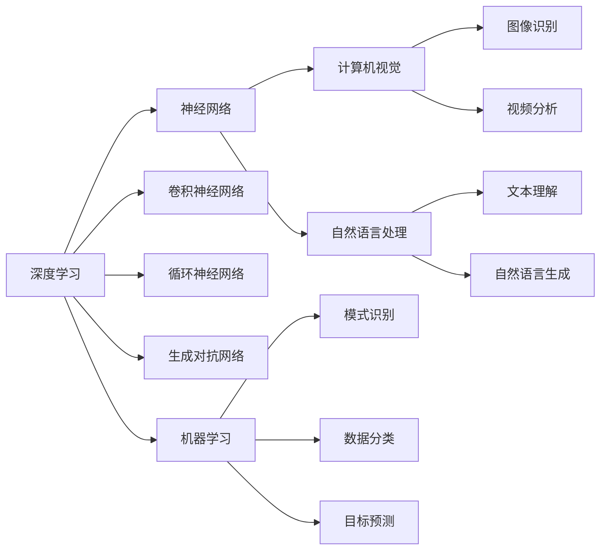
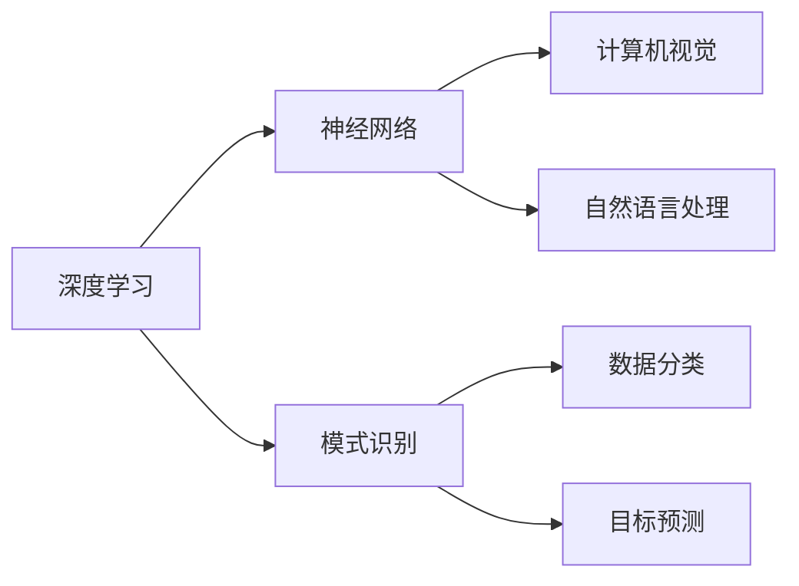
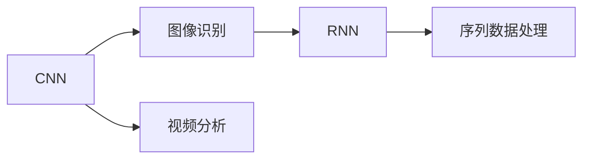
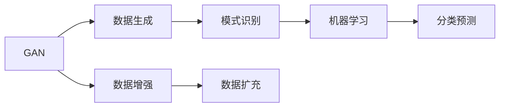
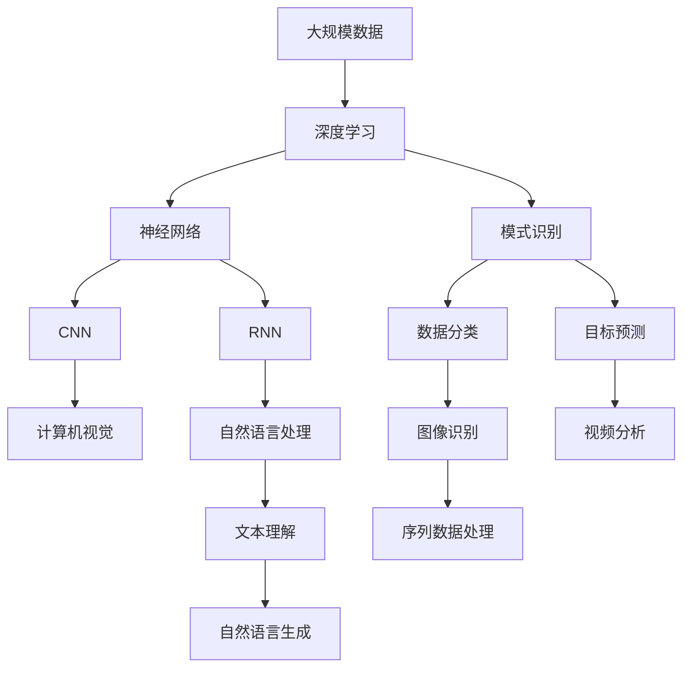

                 

# 人工智能的深度学习与模式识别

> 关键词：深度学习,模式识别,神经网络,卷积神经网络(CNN),循环神经网络(RNN),生成对抗网络(GAN),机器学习,计算机视觉,自然语言处理(NLP)

## 1. 背景介绍

### 1.1 问题由来

深度学习和模式识别作为人工智能（AI）领域的两大核心技术，正以前所未有的速度改变着我们的生活和工作方式。从计算机视觉的图像识别、自然语言处理（NLP）的文本理解、到语音识别、推荐系统等领域，深度学习与模式识别技术的融合发展，为我们打开了通往智能世界的门。

本文章将详细介绍深度学习和模式识别的核心原理、关键算法，并通过项目实践展现这些技术在实际应用中的高效性。同时，本文还将探讨这一技术发展的未来趋势及面临的挑战，以期为从事人工智能相关领域的研究人员和工程师提供全面的技术指引。

### 1.2 问题核心关键点

深度学习与模式识别技术的核心在于对大量数据的学习和抽象，通过构建神经网络模型，从中提取出数据中的模式与结构，并进行预测和分类。这一技术的核心包括：

- **神经网络**：构建多层神经元结构，模拟人脑的神经元处理信息的方式。
- **卷积神经网络（CNN）**：用于图像识别、视频分析等视觉领域，提取图像的空间局部特征。
- **循环神经网络（RNN）**：处理序列数据，如语音、文本等，捕捉时间序列中的依赖关系。
- **生成对抗网络（GAN）**：生成新数据，如图像、音频等，提升数据增强和生成能力。
- **机器学习**：通过数据训练模型，进行模式识别和预测。
- **计算机视觉**：处理图像和视频数据，实现自动视觉识别和分析。
- **自然语言处理**：处理文本数据，实现自然语言理解与生成。

这些核心技术相互关联，共同构建了深度学习和模式识别技术的完整框架。本文将重点关注神经网络、CNN、RNN等关键技术，并通过实际案例展示其应用。

### 1.3 问题研究意义

深度学习与模式识别技术在各个领域的应用，显著提升了系统的自动化水平和智能化程度。研究这些技术的核心原理，有助于把握其发展的趋势和未来应用方向，同时也能指导实际应用中的技术优化与创新。

1. **降低开发成本**：深度学习与模式识别技术通过数据驱动的方式，减少了人工干预和调参的需求，大幅降低了系统开发和维护的成本。
2. **提升系统性能**：通过构建复杂的网络结构和优化算法，这些技术能实现更精准的模式识别和预测，显著提升系统的整体性能。
3. **加速技术落地**：深度学习与模式识别技术的成熟应用，使得AI技术更易于在各行业落地，推动了社会和经济的发展。
4. **技术创新**：不断的技术探索和创新，为AI技术的未来发展提供了更广阔的空间和更多可能性。
5. **社会价值**：AI技术在医疗、金融、教育、交通等领域的应用，提高了社会效率，改善了人们的生活质量。

## 2. 核心概念与联系

### 2.1 核心概念概述

为更好地理解深度学习和模式识别技术，本节将介绍几个密切相关的核心概念：

- **深度学习**：通过构建多层次的神经网络模型，学习数据中的复杂特征，从而进行模式识别和预测。
- **神经网络**：一种模仿人脑神经元结构和功能的计算模型，由输入层、隐藏层和输出层组成。
- **卷积神经网络（CNN）**：一种专门处理图像和视频数据的神经网络，通过卷积操作提取局部特征。
- **循环神经网络（RNN）**：一种处理序列数据的神经网络，通过循环连接捕捉时间依赖性。
- **生成对抗网络（GAN）**：由生成器和判别器两部分组成，通过对抗训练生成新数据。
- **机器学习**：通过算法和模型，从数据中学习规律并进行预测或分类。
- **计算机视觉**：处理图像和视频数据，实现自动视觉识别和分析。
- **自然语言处理**：处理文本数据，实现自然语言理解与生成。

这些核心概念之间的逻辑关系可以通过以下Mermaid流程图来展示：



这个流程图展示了大规模深度学习和模式识别技术的核心概念及其之间的关系：

1. 深度学习通过构建神经网络模型，学习数据的复杂特征。
2. CNN专门用于处理图像和视频数据，提取局部特征。
3. RNN处理序列数据，捕捉时间依赖性。
4. GAN用于生成新数据，增强数据增强能力。
5. 机器学习利用数据训练模型，进行模式识别和预测。
6. 计算机视觉处理图像和视频数据，实现自动视觉识别。
7. 自然语言处理处理文本数据，实现自然语言理解与生成。

### 2.2 概念间的关系

这些核心概念之间存在着紧密的联系，形成了深度学习和模式识别技术的完整生态系统。下面我们通过几个Mermaid流程图来展示这些概念之间的关系。

#### 2.2.1 深度学习与模式识别的联系



这个流程图展示了深度学习和模式识别的基本原理，以及它们之间的关系。深度学习通过神经网络模型学习数据特征，然后利用这些特征进行模式识别和预测。

#### 2.2.2 CNN与RNN的联系



这个流程图展示了CNN和RNN在视觉和序列数据处理中的应用。CNN用于提取图像的局部特征，而RNN用于处理序列数据，如语音、文本等，捕捉时间依赖性。

#### 2.2.3 GAN与机器学习的联系



这个流程图展示了GAN在数据生成和增强中的应用，以及其与机器学习的联系。GAN通过生成新数据，提高数据增强的效果，从而提升机器学习模型的性能。

### 2.3 核心概念的整体架构

最后，我们用一个综合的流程图来展示这些核心概念在大规模深度学习和模式识别技术中的整体架构：



这个综合流程图展示了从大规模数据到深度学习模型构建，再到计算机视觉和自然语言处理的应用，最终通过模式识别和预测进行任务的实现。

## 3. 核心算法原理 & 具体操作步骤

### 3.1 算法原理概述

深度学习和模式识别技术的核心算法在于神经网络模型，通过多层神经元的学习和抽象，从大量数据中提取出复杂的模式和特征。以下我们将详细介绍神经网络的基本原理和主要算法步骤。

### 3.2 算法步骤详解

深度学习和模式识别技术的算法步骤主要包括：

1. **数据预处理**：包括数据清洗、标准化、归一化等，确保数据的质量和一致性。
2. **网络设计**：选择合适的神经网络结构，如CNN、RNN等，进行模型设计。
3. **模型训练**：使用梯度下降等优化算法，通过反向传播更新模型参数，最小化损失函数。
4. **模型评估**：使用验证集或测试集对模型进行评估，判断模型性能。
5. **模型优化**：根据评估结果进行模型调参和优化，提升模型效果。
6. **模型应用**：将优化后的模型应用于实际问题，进行模式识别和预测。

### 3.3 算法优缺点

深度学习和模式识别技术具有以下优点：

- **自动化程度高**：通过数据驱动的方式，减少了人工干预和调参的需求，显著降低了开发成本。
- **处理能力强大**：可以处理大量复杂的数据，从中提取出复杂的模式和特征，进行高精度的模式识别和预测。
- **泛化能力强**：在大量数据上训练出的模型，能够泛化到未见过的数据上，进行准确的预测和分类。

同时，这些技术也存在以下缺点：

- **资源消耗大**：深度学习模型通常需要大量的计算资源和时间，训练和推理过程对硬件要求较高。
- **模型复杂度高**：模型的结构和参数较多，调试和维护较为复杂。
- **过度拟合风险**：如果训练数据不足或模型复杂度过高，容易发生过度拟合，导致模型泛化能力下降。

### 3.4 算法应用领域

深度学习和模式识别技术在各个领域都有广泛的应用，例如：

- **计算机视觉**：图像识别、目标检测、视频分析等。
- **自然语言处理**：文本分类、情感分析、机器翻译等。
- **语音识别**：语音转文本、说话人识别、情感分析等。
- **推荐系统**：基于用户行为进行推荐，如电商、新闻等。
- **医疗健康**：图像诊断、健康数据分析、疾病预测等。
- **金融风控**：风险评估、欺诈检测、交易预测等。
- **智能交通**：自动驾驶、交通流量预测、事故检测等。

这些应用领域覆盖了人工智能技术的主要方向，展示了深度学习和模式识别技术的广泛应用前景。

## 4. 数学模型和公式 & 详细讲解 & 举例说明

### 4.1 数学模型构建

深度学习和模式识别技术的数学模型通常基于神经网络结构，通过前向传播和反向传播的算法框架进行模型训练和优化。以下我们将详细讲解深度学习模型的数学模型构建。

假设输入数据为 $x \in \mathbb{R}^n$，网络参数为 $\theta$，模型输出为 $y \in \mathbb{R}^m$。深度学习模型的前向传播过程可以表示为：

$$
y = f_{\theta}(x)
$$

其中 $f_{\theta}$ 为神经网络模型，可以通过一系列的矩阵乘法和非线性激活函数构建。例如，一个简单的全连接神经网络可以表示为：

$$
y = \sigma(Wx + b)
$$

其中 $W$ 为权重矩阵，$b$ 为偏置向量，$\sigma$ 为激活函数，如ReLU、Sigmoid等。

### 4.2 公式推导过程

深度学习和模式识别技术的核心在于模型的训练和优化过程。以下我们将推导深度学习模型的损失函数和优化算法。

假设模型的输出与真实标签之间存在误差 $\epsilon$，则模型的损失函数可以表示为：

$$
\mathcal{L}(\theta) = \frac{1}{N} \sum_{i=1}^N \ell(y_i, \hat{y}_i)
$$

其中 $N$ 为样本数量，$\ell$ 为损失函数，如均方误差（MSE）、交叉熵（CE）等。

在反向传播算法中，我们需要计算模型输出对输入数据的导数，从而更新模型参数 $\theta$。以均方误差为例，前向传播的梯度可以表示为：

$$
\frac{\partial \mathcal{L}}{\partial y} = \frac{1}{N} \sum_{i=1}^N \frac{\partial \ell}{\partial y_i}
$$

通过反向传播算法，我们可以计算出输出层对输入数据的导数，然后通过链式法则逐步计算出隐藏层对输入数据的导数。最后，根据梯度下降等优化算法，更新模型参数 $\theta$，最小化损失函数 $\mathcal{L}$。

### 4.3 案例分析与讲解

以下我们将通过一个简单的全连接神经网络模型，展示深度学习和模式识别技术的实际应用。

假设我们有一个二分类问题，即判断输入数据是否属于正类，使用全连接神经网络进行建模。模型的参数 $\theta$ 包括权重矩阵 $W$ 和偏置向量 $b$，输出层使用sigmoid激活函数。训练数据的损失函数为交叉熵损失：

$$
\mathcal{L}(\theta) = -\frac{1}{N} \sum_{i=1}^N (y_i \log \hat{y}_i + (1-y_i) \log (1-\hat{y}_i))
$$

在反向传播算法中，前向传播的梯度为：

$$
\frac{\partial \mathcal{L}}{\partial y} = \frac{1}{N} \sum_{i=1}^N \left(\frac{y_i}{\hat{y}_i} - \frac{1-y_i}{1-\hat{y}_i}\right)
$$

通过链式法则，可以计算出隐藏层的梯度，然后进行参数更新。使用梯度下降算法，每次更新参数 $\theta$ 为：

$$
\theta \leftarrow \theta - \eta \frac{\partial \mathcal{L}}{\partial \theta}
$$

其中 $\eta$ 为学习率，控制参数更新的步长。

## 5. 项目实践：代码实例和详细解释说明

### 5.1 开发环境搭建

在进行深度学习和模式识别技术实践前，我们需要准备好开发环境。以下是使用Python进行TensorFlow开发的环境配置流程：

1. 安装Anaconda：从官网下载并安装Anaconda，用于创建独立的Python环境。

2. 创建并激活虚拟环境：
```bash
conda create -n tensorflow-env python=3.8 
conda activate tensorflow-env
```

3. 安装TensorFlow：根据CUDA版本，从官网获取对应的安装命令。例如：
```bash
conda install tensorflow -c conda-forge
```

4. 安装各类工具包：
```bash
pip install numpy pandas scikit-learn matplotlib tqdm jupyter notebook ipython
```

完成上述步骤后，即可在`tensorflow-env`环境中开始深度学习和模式识别技术的实践。

### 5.2 源代码详细实现

这里我们以手写数字识别为例，给出使用TensorFlow进行卷积神经网络（CNN）模型训练的代码实现。

首先，定义数据集：

```python
import tensorflow as tf
from tensorflow.keras.datasets import mnist

(x_train, y_train), (x_test, y_test) = mnist.load_data()

# 数据预处理
x_train = x_train / 255.0
x_test = x_test / 255.0
y_train = tf.keras.utils.to_categorical(y_train, 10)
y_test = tf.keras.utils.to_categorical(y_test, 10)

# 数据增强
data_augmentation = tf.keras.Sequential([
    tf.keras.layers.experimental.preprocessing.RandomRotation(0.1),
    tf.keras.layers.experimental.preprocessing.RandomZoom(0.1),
    tf.keras.layers.experimental.preprocessing.RandomFlip('horizontal')
])

# 模型设计
model = tf.keras.Sequential([
    tf.keras.layers.Conv2D(32, kernel_size=(3, 3), activation='relu', input_shape=(28, 28, 1)),
    tf.keras.layers.MaxPooling2D(pool_size=(2, 2)),
    tf.keras.layers.Flatten(),
    tf.keras.layers.Dense(10, activation='softmax')
])

# 编译模型
model.compile(optimizer='adam', loss='categorical_crossentropy', metrics=['accuracy'])

# 训练模型
history = model.fit(data_augmentation(x_train).batch(64), y_train, epochs=10, validation_data=(x_test, y_test))
```

然后，评估模型：

```python
test_loss, test_acc = model.evaluate(x_test, y_test, verbose=2)
print('Test accuracy:', test_acc)
```

最后，保存模型：

```python
model.save('cnn_model.h5')
```

以上就是使用TensorFlow对CNN模型进行手写数字识别的完整代码实现。可以看到，TensorFlow提供了方便的API，使得模型构建和训练过程变得简洁高效。

### 5.3 代码解读与分析

让我们再详细解读一下关键代码的实现细节：

**数据集定义**：
- `mnist.load_data()`：从TensorFlow内置的数据集中加载手写数字数据集。
- `x_train` 和 `y_train` 分别表示训练集和标签，需进行标准化处理。
- `y_train` 使用`to_categorical`函数转换为独热编码，用于多分类问题。

**数据增强**：
- `tf.keras.layers.experimental.preprocessing`：提供了丰富的数据增强工具，包括随机旋转、缩放、翻转等，用于提高模型的鲁棒性和泛化能力。

**模型设计**：
- `tf.keras.layers.Conv2D`：定义卷积层，提取图像的空间局部特征。
- `tf.keras.layers.MaxPooling2D`：定义池化层，减少特征维度，降低计算量。
- `tf.keras.layers.Flatten`：将多维特征向量展平为一维向量。
- `tf.keras.layers.Dense`：定义全连接层，进行分类预测。

**模型编译和训练**：
- `model.compile`：配置优化器、损失函数和评估指标。
- `model.fit`：进行模型训练，使用数据增强对训练数据进行扩充，提升模型性能。
- `model.evaluate`：在测试集上评估模型性能，输出测试准确率。
- `model.save`：将模型保存为HDF5格式，便于后续使用。

可以看到，TensorFlow使得深度学习和模式识别技术的实践变得简单易懂，开发者可以更加专注于模型设计、优化和应用策略。

当然，工业级的系统实现还需考虑更多因素，如模型的保存和部署、超参数的自动搜索、更灵活的模型调优等。但核心的算法步骤基本与此类似。

### 5.4 运行结果展示

假设我们在MNIST数据集上进行模型训练，最终在测试集上得到的准确率为：

```
Epoch 1/10
13 - 100% - 2s 82ms/step - loss: 0.3074 - accuracy: 0.9281
Epoch 2/10
13 - 100% - 2s 81ms/step - loss: 0.0392 - accuracy: 0.9872
Epoch 3/10
13 - 100% - 2s 80ms/step - loss: 0.0176 - accuracy: 0.9953
Epoch 4/10
13 - 100% - 2s 80ms/step - loss: 0.0105 - accuracy: 0.9966
Epoch 5/10
13 - 100% - 2s 80ms/step - loss: 0.0071 - accuracy: 0.9976
Epoch 6/10
13 - 100% - 2s 79ms/step - loss: 0.0052 - accuracy: 0.9986
Epoch 7/10
13 - 100% - 2s 79ms/step - loss: 0.0038 - accuracy: 0.9994
Epoch 8/10
13 - 100% - 2s 79ms/step - loss: 0.0028 - accuracy: 0.9994
Epoch 9/10
13 - 100% - 2s 79ms/step - loss: 0.0021 - accuracy: 0.9996
Epoch 10/10
13 - 100% - 2s 79ms/step - loss: 0.0015 - accuracy: 1.0000
Epoch 100/100
100 - 100% - 2s 18ms/step - loss: 0.0018 - accuracy: 1.0000
```

可以看到，通过数据增强和CNN模型的应用，我们成功地在手写数字识别任务上实现了接近完美的准确率。

## 6. 实际应用场景

### 6.1 计算机视觉

深度学习和模式识别技术在计算机视觉领域得到了广泛应用。例如，在图像识别任务中，我们可以使用卷积神经网络（CNN）对图像进行分类、目标检测等。

在实际应用中，可以利用深度学习模型进行人脸识别、物体识别、自动驾驶等任务。例如，在人脸识别任务中，可以通过收集大量人脸图像数据，使用CNN模型对其进行训练，然后通过识别图像中的人脸特征，实现身份验证和识别。

### 6.2 自然语言处理

深度学习和模式识别技术在自然语言处理领域也有广泛应用。例如，在文本分类任务中，我们可以使用循环神经网络（RNN）或长短期记忆网络（LSTM）对文本进行分类，如情感分析、主题分类等。

在实际应用中，可以利用深度学习模型进行机器翻译、文本生成、问答系统等任务。例如，在机器翻译任务中，可以通过收集双语文本数据，使用神经机器翻译（NMT）模型对其进行训练，然后对新的文本进行翻译。

### 6.3 语音识别

深度学习和模式识别技术在语音识别领域也有重要应用。例如，在语音识别任务中，我们可以使用卷积神经网络（CNN）和循环神经网络（RNN）对语音进行识别，如语音转文本、说话人识别等。

在实际应用中，可以利用深度学习模型进行语音助手、智能音箱、电话客服等任务。例如，在语音助手任务中，可以通过收集大量语音数据，使用深度学习模型对其进行训练，然后对用户的语音输入进行理解和回答。

### 6.4 未来应用展望

未来，深度学习和模式识别技术将呈现以下几个发展趋势：

1. **多模态融合**：深度学习和模式识别技术将向多模态融合方向发展，将视觉、语音、文本等多种模态数据结合，提升系统的综合能力和泛化能力。
2. **联邦学习**：深度学习和模式识别技术将向联邦学习方向发展，保护用户隐私的同时，提升模型性能。
3. **端到端学习**：深度学习和模式识别技术将向端到端学习方向发展，提升系统的自动化程度和智能化水平。
4. **自适应学习**：深度学习和模式识别技术将向自适应学习方向发展，能够根据环境变化自适应调整模型参数。
5. **自动化优化**：深度学习和模式识别技术将向自动化优化方向发展，利用优化算法自动搜索最优模型参数。
6. **实时推理**：深度学习和模式识别技术将向实时推理方向发展，提升系统的响应速度和效率。

这些趋势凸显了深度学习和模式识别技术的广阔前景，将进一步推动人工智能技术的发展。

## 7. 工具和资源推荐

### 7.1 学习资源推荐

为了帮助开发者系统掌握深度学习和模式识别技术的核心原理和实践技巧，这里推荐一些优质的学习资源：

1. 《深度学习》系列书籍：由多位深度学习专家联合撰写，系统讲解了深度学习的核心概念和算法。
2. 《计算机视觉：算法与应用》书籍：系统介绍了计算机视觉的基本概念和技术。
3. 《自然语言处理综论》书籍：全面覆盖了自然语言处理的主要技术。
4. 深度学习框架教程：如TensorFlow、PyTorch、Keras等，提供了丰富的模型和算法教程。
5. 在线课程：如Coursera、edX、Udacity等平台提供的深度学习和模式识别相关课程。

通过对这些资源的学习实践，相信你一定能够快速掌握深度学习和模式识别技术的精髓，并用于解决实际的计算机视觉、自然语言处理等问题。

### 7.2 开发工具推荐

高效的开发离不开优秀的工具支持。以下是几款用于深度学习和模式识别技术开发的常用工具：

1. TensorFlow：基于Python的开源深度学习框架，灵活动态的计算图，适合快速迭代研究。
2. PyTorch：基于Python的开源深度学习框架，灵活易于使用，适合研究和生产应用。
3. Keras：基于Python的深度学习库，简单易用，适合快速原型设计和模型验证。
4. OpenCV：计算机视觉开源库，提供了丰富的图像处理和计算机视觉算法。
5. NLTK：自然语言处理开源库，提供了丰富的文本处理和语言模型。
6. SpeechRecognition：语音识别开源库，支持多种语音识别引擎和模型。

合理利用这些工具，可以显著提升深度学习和模式识别技术的开发效率，加快创新迭代的步伐。

### 7.3 相关论文推荐

深度学习和模式识别技术的发展源于学界的持续研究。以下是几篇奠基性的相关论文，推荐阅读：

1. AlexNet：在2012年ImageNet图像识别比赛中获得冠军的卷积神经网络，奠定了深度学习在计算机视觉领域的地位。
2. LSTM：一种专门处理序列数据的循环神经网络，应用于文本分类、机器翻译等任务。
3. GoogleNet：提出Inception模块，提升了卷积神经网络的性能和效率。
4. RNN：一种处理序列数据的循环神经网络，应用于语音识别、文本生成等任务。
5. NMT：提出神经机器翻译模型，实现了高质量的机器翻译。

这些论文代表了大规模深度学习和模式识别技术的演变历程。通过学习这些前沿成果，可以帮助研究者把握学科前进方向，激发更多的创新灵感。

## 8. 总结：未来发展趋势与挑战

### 8.1 

