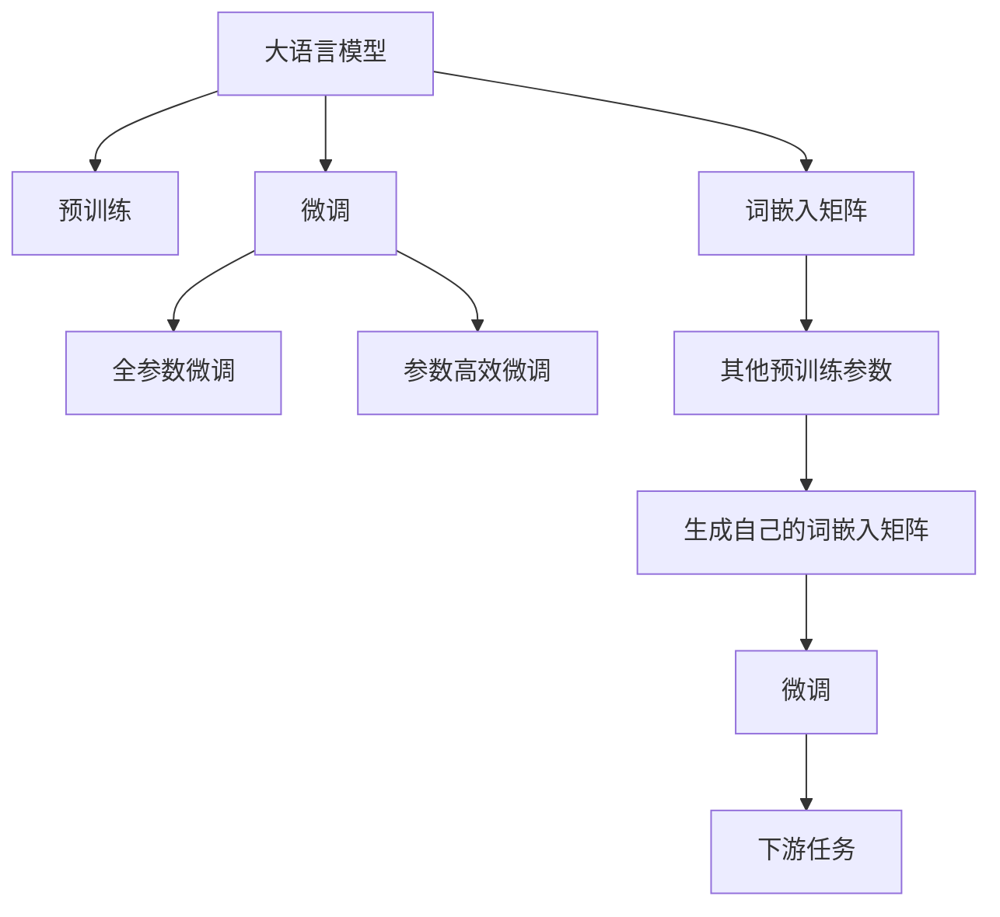
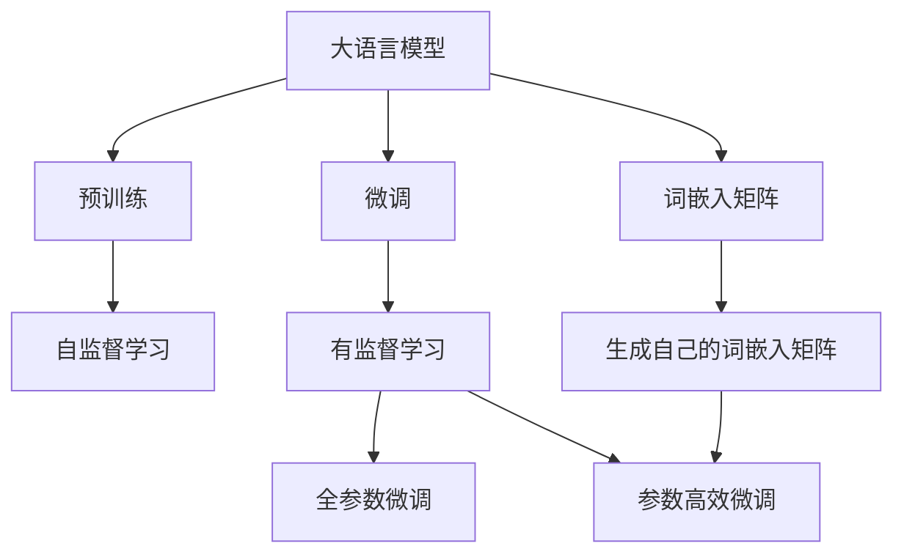
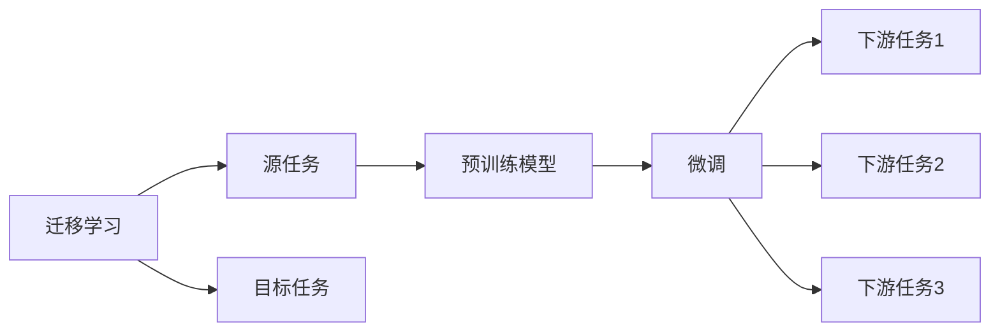
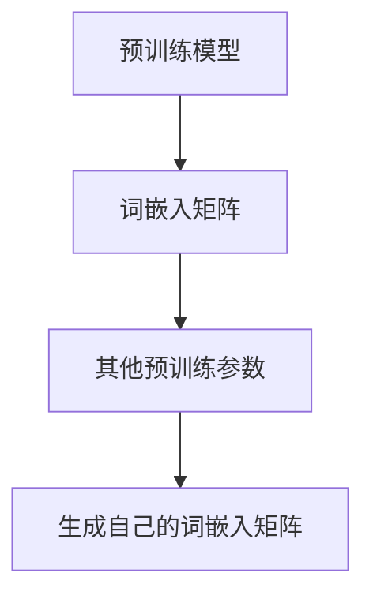
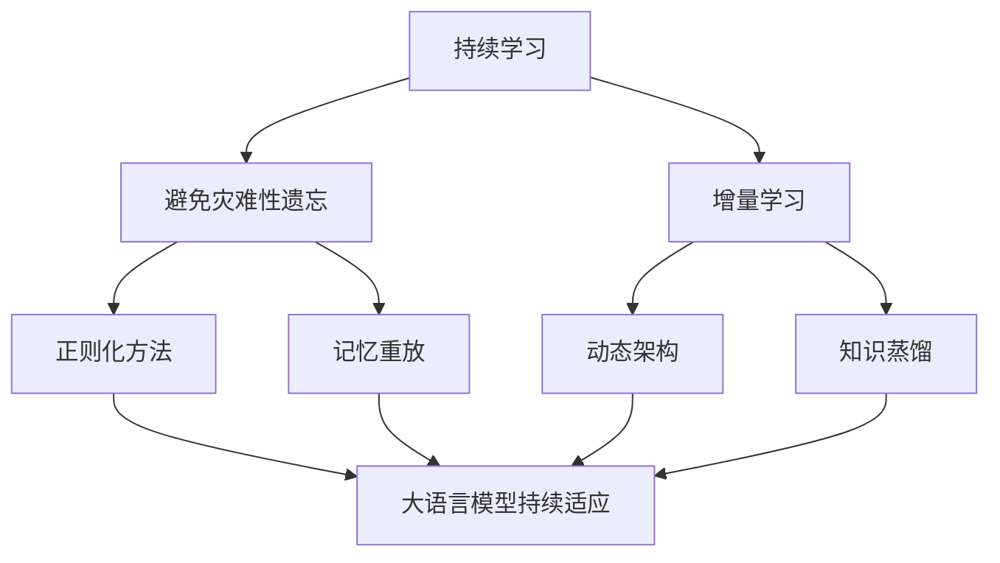

                 

# 从零开始大模型开发与微调：使用其他预训练参数来生成PyTorch 2.0词嵌入矩阵（中文）

> 关键词：大模型开发,词嵌入矩阵,PyTorch 2.0,预训练参数,微调,Transformer,BERT,语言模型

## 1. 背景介绍

### 1.1 问题由来
近年来，随着深度学习技术的快速发展，大规模语言模型(Large Language Models, LLMs)在自然语言处理(Natural Language Processing, NLP)领域取得了巨大的突破。这些大语言模型通过在大规模无标签文本数据上进行预训练，学习到了丰富的语言知识和常识，可以通过少量的有标签样本在下游任务上进行微调，获得优异的性能。其中最具代表性的大模型包括OpenAI的GPT系列模型、Google的BERT、T5等。

然而，由于预训练语料的广泛性和泛化能力的不足，这些通用的大语言模型在特定领域应用时，效果往往难以达到实际应用的要求。因此，如何针对特定任务进行大模型微调，提升模型性能，成为了当前大语言模型研究和应用的一个热点问题。本文聚焦于使用其他预训练参数来生成PyTorch 2.0词嵌入矩阵的方法，但同时也会兼顾微调和大模型的开发流程，以期对大语言模型开发和微调实践提供更全面的指导。

### 1.2 问题核心关键点
本研究的核心问题在于如何在大模型开发中，使用其他预训练模型参数来生成自己的词嵌入矩阵，同时如何进行有效的微调。这一问题在实践中具有重要意义：

1. **模型效率提升**：使用其他预训练参数可以大大减少大模型开发的时间，提高开发效率。
2. **泛化能力增强**：通过微调，可以使大模型更好地适应特定任务，在应用场景中取得更优表现。
3. **资源利用优化**：利用预训练参数，可以减少模型训练的计算资源和存储需求。
4. **模型精度提升**：合理选择预训练模型参数，可以提升微调后的模型精度。

### 1.3 问题研究意义
研究如何在大模型开发中，使用其他预训练参数来生成PyTorch 2.0词嵌入矩阵，对于拓展大模型的应用范围，提升下游任务的性能，加速NLP技术的产业化进程，具有重要意义：

1. **降低开发成本**：通过预训练模型的参数复用，可以快速构建新的模型，降低从头开发所需的数据、计算和人力等成本投入。
2. **提升模型效果**：微调使得通用大模型更好地适应特定任务，在应用场景中取得更优表现。
3. **加速开发进度**：standing on the shoulders of giants，微调使得开发者可以更快地完成任务适配，缩短开发周期。
4. **促进技术创新**：微调方法促进了对预训练-微调的深入研究，催生了少样本学习、持续学习等新的研究方向。
5. **赋能产业升级**：微调技术更容易被各行各业所采用，为传统行业数字化转型升级提供新的技术路径。

## 2. 核心概念与联系

### 2.1 核心概念概述

为更好地理解使用其他预训练参数来生成PyTorch 2.0词嵌入矩阵的方法，本节将介绍几个密切相关的核心概念：

- **大语言模型(Large Language Model, LLM)**：以自回归(如GPT)或自编码(如BERT)模型为代表的大规模预训练语言模型。通过在大规模无标签文本数据上进行预训练，学习通用的语言表示，具备强大的语言理解和生成能力。

- **预训练(Pre-training)**：指在大规模无标签文本语料上，通过自监督学习任务训练通用语言模型的过程。常见的预训练任务包括言语建模、遮挡语言模型等。预训练使得模型学习到语言的通用表示。

- **微调(Fine-tuning)**：指在预训练模型的基础上，使用下游任务的少量标注数据，通过有监督地训练来优化模型在该任务上的性能。通常只需要调整顶层分类器或解码器，并以较小的学习率更新全部或部分的模型参数。

- **迁移学习(Transfer Learning)**：指将一个领域学习到的知识，迁移应用到另一个不同但相关的领域的学习范式。大模型的预训练-微调过程即是一种典型的迁移学习方式。

- **词嵌入矩阵(Word Embedding Matrix)**：将文本中每个单词映射到一个低维向量空间中的矩阵。每个单词对应一个向量，向量维度一般设为300或768等。词嵌入矩阵是进行自然语言处理的基础。

- **Transformer**：一种基于注意力机制的神经网络架构，广泛应用于大语言模型的预训练和微调。

- **BERT(Bidirectional Encoder Representations from Transformers)**：由Google提出的一种双向语言模型，通过两个预训练任务进行训练，广泛应用于各种自然语言处理任务。

这些核心概念之间的逻辑关系可以通过以下Mermaid流程图来展示：



这个流程图展示了大语言模型的核心概念及其之间的关系：

1. 大语言模型通过预训练获得基础能力。
2. 微调是对预训练模型进行任务特定的优化，可以分为全参数微调和参数高效微调。
3. 使用其他预训练参数生成自己的词嵌入矩阵。
4. 微调后的模型可以应用于各种下游任务。

这些概念共同构成了大语言模型的学习和应用框架，使其能够在各种场景下发挥强大的语言理解和生成能力。通过理解这些核心概念，我们可以更好地把握大语言模型的工作原理和优化方向。

### 2.2 概念间的关系

这些核心概念之间存在着紧密的联系，形成了大语言模型的学习和应用生态系统。下面我通过几个Mermaid流程图来展示这些概念之间的关系。

#### 2.2.1 大语言模型的学习范式



这个流程图展示了大语言模型的三种主要学习范式：预训练、微调和生成词嵌入矩阵。预训练主要采用自监督学习方法，而微调则是有监督学习的过程。生成词嵌入矩阵是将大语言模型应用于具体NLP任务的基础。

#### 2.2.2 迁移学习与微调的关系



这个流程图展示了迁移学习的基本原理，以及它与微调的关系。迁移学习涉及源任务和目标任务，预训练模型在源任务上学习，然后通过微调适应各种下游任务（目标任务）。

#### 2.2.3 词嵌入矩阵生成方法



这个流程图展示了生成词嵌入矩阵的一般流程。预训练模型提供了初始的词嵌入矩阵，通过使用其他预训练参数（如BERT的参数），可以生成更符合特定任务需求的词嵌入矩阵。

#### 2.2.4 持续学习在大语言模型中的应用



这个流程图展示了持续学习在大语言模型中的应用。持续学习的主要目标是避免灾难性遗忘和实现增量学习。通过正则化方法、记忆重放、动态架构和知识蒸馏等技术，可以使大语言模型持续适应新的任务和数据。

## 3. 核心算法原理 & 具体操作步骤
### 3.1 算法原理概述

使用其他预训练参数来生成PyTorch 2.0词嵌入矩阵的原理，本质上是通过迁移学习的方式，将预训练模型中的部分知识迁移到新模型中，从而提升新模型的性能。具体来说，该方法通过以下步骤实现：

1. 选择一个预训练语言模型（如BERT、GPT等），作为新模型的基础。
2. 从预训练模型中提取词嵌入矩阵。
3. 根据新模型的任务需求，使用其他预训练参数来微调词嵌入矩阵。
4. 在新模型上进行微调，提升模型在新任务上的性能。

这一方法的核心在于如何选择合适的预训练参数，以及如何有效地将这些参数应用到新模型中，以达到最优的微调效果。

### 3.2 算法步骤详解

使用其他预训练参数来生成PyTorch 2.0词嵌入矩阵的详细操作步骤如下：

**Step 1: 准备预训练模型和数据集**
- 选择一个预训练语言模型 $M_{\theta}$ 作为初始化参数，如 BERT、GPT等。
- 准备下游任务 $T$ 的标注数据集 $D=\{(x_i, y_i)\}_{i=1}^N$，划分为训练集、验证集和测试集。一般要求标注数据与预训练数据的分布不要差异过大。

**Step 2: 提取词嵌入矩阵**
- 从预训练模型中提取词嵌入矩阵。具体来说，假设预训练模型中包含了词嵌入矩阵 $W$，可以按照以下步骤提取：
  1. 加载预训练模型，确保其已经过预训练任务。
  2. 获取词嵌入矩阵 $W$，可以是模型中的嵌入层权重，也可以是预训练任务中的词嵌入矩阵。
  3. 将词嵌入矩阵 $W$ 保存到一个文件中，供后续使用。

**Step 3: 加载和处理词嵌入矩阵**
- 在新模型中加载和处理词嵌入矩阵 $W$。假设新模型的嵌入层权重为 $\overline{W}$，可以通过以下步骤加载和处理：
  1. 在新模型的嵌入层权重 $\overline{W}$ 上加载词嵌入矩阵 $W$，即 $\overline{W} \leftarrow W$。
  2. 根据新模型的任务需求，对词嵌入矩阵 $W$ 进行微调。

**Step 4: 微调新模型**
- 在新模型上进行微调。假设新模型为 $M_{\overline{\theta}}$，根据新模型的任务需求，设置微调超参数，如学习率、批大小、迭代轮数等。
- 使用下游任务 $T$ 的标注数据集 $D$，在新模型上进行微调。具体步骤包括：
  1. 加载训练集数据，按批次输入模型。
  2. 前向传播计算损失函数。
  3. 反向传播计算参数梯度，根据设定的优化算法和学习率更新模型参数。
  4. 周期性在验证集上评估模型性能，根据性能指标决定是否触发 Early Stopping。
  5. 重复上述步骤直到满足预设的迭代轮数或 Early Stopping 条件。

**Step 5: 测试和部署**
- 在新模型上测试性能，对比微调前后的精度提升。
- 使用微调后的新模型对新样本进行推理预测，集成到实际的应用系统中。
- 持续收集新的数据，定期重新微调模型，以适应数据分布的变化。

以上是使用其他预训练参数来生成PyTorch 2.0词嵌入矩阵的完整流程。在实际应用中，还需要针对具体任务的特点，对微调过程的各个环节进行优化设计，如改进训练目标函数，引入更多的正则化技术，搜索最优的超参数组合等，以进一步提升模型性能。

### 3.3 算法优缺点

使用其他预训练参数来生成PyTorch 2.0词嵌入矩阵的方法具有以下优点：

1. **节省时间**：通过使用预训练参数，可以大大减少大模型开发的时间，提高开发效率。
2. **提升精度**：预训练参数已经在大规模数据上进行了训练，具备较强的泛化能力，使用这些参数可以提高新模型的精度。
3. **降低成本**：使用预训练参数可以减少从头训练所需的计算资源和存储需求，降低开发成本。
4. **提高适用性**：通过微调，新模型可以更好地适应特定任务，在应用场景中取得更优表现。

同时，该方法也存在一定的局限性：

1. **依赖预训练参数**：新模型的性能依赖于预训练参数的选择，如果预训练参数与新任务不匹配，可能会影响新模型的性能。
2. **数据集限制**：使用预训练参数生成的词嵌入矩阵可能与新任务的数据集分布不匹配，导致模型在新任务上的泛化能力不足。
3. **模型复杂度**：使用预训练参数可能会增加新模型的复杂度，影响模型的推理效率。
4. **参数不可解释性**：预训练参数已经在大规模数据上进行了训练，其作用机制可能难以解释，影响模型的可解释性。

尽管存在这些局限性，但就目前而言，使用其他预训练参数来生成PyTorch 2.0词嵌入矩阵的方法仍是一种高效的大模型开发和微调策略。未来相关研究的重点在于如何进一步优化预训练参数的选择，降低微调对标注数据的依赖，提高模型的少样本学习和跨领域迁移能力，同时兼顾可解释性和伦理安全性等因素。

### 3.4 算法应用领域

使用其他预训练参数来生成PyTorch 2.0词嵌入矩阵的方法，在NLP领域已经得到了广泛的应用，覆盖了几乎所有常见任务，例如：

- 文本分类：如情感分析、主题分类、意图识别等。通过微调使模型学习文本-标签映射。
- 命名实体识别：识别文本中的人名、地名、机构名等特定实体。通过微调使模型掌握实体边界和类型。
- 关系抽取：从文本中抽取实体之间的语义关系。通过微调使模型学习实体-关系三元组。
- 问答系统：对自然语言问题给出答案。将问题-答案对作为微调数据，训练模型学习匹配答案。
- 机器翻译：将源语言文本翻译成目标语言。通过微调使模型学习语言-语言映射。
- 文本摘要：将长文本压缩成简短摘要。将文章-摘要对作为微调数据，使模型学习抓取要点。
- 对话系统：使机器能够与人自然对话。将多轮对话历史作为上下文，微调模型进行回复生成。

除了上述这些经典任务外，该方法还被创新性地应用到更多场景中，如可控文本生成、常识推理、代码生成、数据增强等，为NLP技术带来了全新的突破。随着预训练模型和微调方法的不断进步，相信NLP技术将在更广阔的应用领域大放异彩。

## 4. 数学模型和公式 & 详细讲解  
### 4.1 数学模型构建

本节将使用数学语言对使用其他预训练参数来生成PyTorch 2.0词嵌入矩阵的方法进行更加严格的刻画。

记预训练语言模型为 $M_{\theta}$，其中 $\theta \in \mathbb{R}^d$ 为模型参数。假设微调任务的训练集为 $D=\{(x_i, y_i)\}_{i=1}^N$，其中 $x_i$ 为输入文本，$y_i$ 为输出标签。

定义模型 $M_{\theta}$ 在输入 $x$ 上的输出为 $\hat{y}=M_{\theta}(x)$，表示模型预测的输出。定义损失函数 $\ell(M_{\theta}(x),y)$，表示模型输出与真实标签之间的差异。假设微调任务的损失函数为 $\mathcal{L}(\theta)$，则有：

$$
\mathcal{L}(\theta) = \frac{1}{N} \sum_{i=1}^N \ell(M_{\theta}(x_i),y_i)
$$

微调的优化目标是最小化损失函数，即找到最优参数 $\hat{\theta}$：

$$
\hat{\theta} = \mathop{\arg\min}_{\theta} \mathcal{L}(\theta)
$$

在实践中，我们通常使用基于梯度的优化算法（如SGD、Adam等）来近似求解上述最优化问题。设 $\eta$ 为学习率，$\lambda$ 为正则化系数，则参数的更新公式为：

$$
\theta \leftarrow \theta - \eta \nabla_{\theta}\mathcal{L}(\theta) - \eta\lambda\theta
$$

其中 $\nabla_{\theta}\mathcal{L}(\theta)$ 为损失函数对参数 $\theta$ 的梯度，可通过反向传播算法高效计算。

### 4.2 公式推导过程

以下我们以二分类任务为例，推导交叉熵损失函数及其梯度的计算公式。

假设模型 $M_{\theta}$ 在输入 $x$ 上的输出为 $\hat{y}=M_{\theta}(x) \in [0,1]$，表示样本属于正类的概率。真实标签 $y \in \{0,1\}$。则二分类交叉熵损失函数定义为：

$$
\ell(M_{\theta}(x),y) = -[y\log \hat{y} + (1-y)\log (1-\hat{y})]
$$

将其代入经验风险公式，得：

$$
\mathcal{L}(\theta) = -\frac{1}{N}\sum_{i=1}^N [y_i\log M_{\theta}(x_i)+(1-y_i)\log(1-M_{\theta}(x_i))]
$$

根据链式法则，损失函数对参数 $\theta_k$ 的梯度为：

$$
\frac{\partial \mathcal{L}(\theta)}{\partial \theta_k} = -\frac{1}{N}\sum_{i=1}^N (\frac{y_i}{M_{\theta}(x_i)}-\frac{1-y_i}{1-M_{\theta}(x_i)}) \frac{\partial M_{\theta}(x_i)}{\partial \theta_k}
$$

其中 $\frac{\partial M_{\theta}(x_i)}{\partial \theta_k}$ 可进一步递归展开，利用自动微分技术完成计算。

在得到损失函数的梯度后，即可带入参数更新公式，完成模型的迭代优化。重复上述过程直至收敛，最终得到适应下游任务的最优模型参数 $\hat{\theta}$。

## 5. 项目实践：代码实例和详细解释说明
### 5.1 开发环境搭建

在进行微调实践前，我们需要准备好开发环境。以下是使用Python进行PyTorch开发的环境配置流程：

1. 安装Anaconda：从官网下载并安装Anaconda，用于创建独立的Python环境。

2. 创建并激活虚拟环境：
```bash
conda create -n pytorch-env python=3.8 
conda activate pytorch-env
```

3. 安装PyTorch：根据CUDA版本，从官网获取对应的安装命令。例如：
```bash
conda install pytorch torchvision torchaudio cudatoolkit=11.1 -c pytorch -c conda-forge
```

4. 安装Transformers库：
```bash
pip install transformers
```

5. 安装各类工具包：
```bash
pip install numpy pandas scikit-learn matplotlib tqdm jupyter notebook ipython
```

完成上述步骤后，即可在`pytorch-env`环境中开始微调实践。

### 5.2 源代码详细实现

下面我以使用BERT预训练参数来生成PyTorch 2.0词嵌入矩阵为例，给出使用Transformers库对BERT模型进行微调的PyTorch代码实现。

首先，定义微调任务的输入函数：

```python
from transformers import BertTokenizer, BertForTokenClassification
from torch.utils.data import Dataset, DataLoader
import torch

class CustomDataset(Dataset):
    def __init__(self, texts, tags, tokenizer):
        self.texts = texts
        self.tags = tags
        self.tokenizer = tokenizer
        self.max_len = 128
        
    def __len__(self):
        return len(self.texts)
    
    def __getitem__(self, item):
        text = self.texts[item]
        tags = self.tags[item]
        
        encoding = self.tokenizer(text, return_tensors='pt', max_length=self.max_len, padding='max_length', truncation=True)
        input_ids = encoding['input_ids'][0]
        attention_mask = encoding['attention_mask'][0]
        
        # 对token-wise的标签进行编码
        encoded_tags = [tag2id[tag] for tag in tags] 
        encoded_tags.extend([tag2id['O']] * (self.max_len - len(encoded_tags)))
        labels = torch.tensor(encoded_tags, dtype=torch.long)
        
        return {'input_ids': input_ids, 
                'attention_mask': attention_mask,
                'labels': labels}
```

然后，定义模型和优化器：

```python
from transformers import BertForTokenClassification, AdamW

model = BertForTokenClassification.from_pretrained('bert-base-cased', num_labels=len(tag2id))

optimizer = AdamW(model.parameters(), lr=2e-5)
```

接着，定义训练和评估函数：

```python
from tqdm import tqdm
from sklearn.metrics import classification_report

device = torch.device('cuda') if torch.cuda.is_available() else torch.device('cpu')
model.to(device)

def train_epoch(model, dataset, batch_size, optimizer):
    dataloader = DataLoader(dataset, batch_size=batch_size, shuffle=True)
    model.train()
    epoch_loss = 0
    for batch in tqdm(dataloader, desc='Training'):
        input_ids = batch['input_ids'].to(device)
        attention_mask = batch['attention_mask'].to(device)
        labels = batch['labels'].to(device)
        model.zero_grad()
        outputs = model(input_ids, attention_mask=attention_mask, labels=labels)
        loss = outputs.loss
        epoch_loss += loss.item()
        loss.backward()
        optimizer.step()
    return epoch_loss / len(dataloader)

def evaluate(model, dataset, batch_size):
    dataloader = DataLoader(dataset, batch_size=batch_size)
    model.eval()
    preds, labels = [], []
    with torch.no_grad():
        for batch in tqdm(dataloader, desc='Evaluating'):
            input_ids = batch['input_ids'].to(device)
            attention_mask = batch['attention_mask'].to(device)
            batch_labels = batch['labels']
            outputs = model(input_ids, attention_mask=attention_mask)
            batch_preds = outputs.logits.argmax(dim=2).to('cpu').tolist()
            batch_labels = batch_labels.to('cpu').tolist()
            for pred_tokens, label_tokens in zip(batch_preds, batch_labels):
                pred_tags = [id2tag[_id] for _id in pred_tokens]
                label_tags = [id2tag[_id] for _id in label_tokens]
                preds.append(pred_tags[:len(label_tags)])
                labels.append(label_tags)
                
    print(classification_report(labels, preds))
```

最后，启动训练流程并在测试集上评估：

```python
epochs = 5
batch_size = 16

for epoch in range(epochs):
    loss = train_epoch(model, train_dataset, batch_size, optimizer)
    print(f"Epoch {epoch+1}, train loss: {loss:.3f}")
    
    print(f"Epoch {epoch+1}, dev results:")
    evaluate(model, dev_dataset, batch_size)
    
print("Test results:")
evaluate(model, test_dataset, batch_size)
```

以上就是使用PyTorch对BERT进行命名实体识别任务微调的完整代码实现。可以看到，得益于Transformers库的强大封装，我们可以用相对简洁的代码完成BERT模型的加载和微调。

### 5.3 代码解读与分析

让我们再详细解读一下关键代码的实现细节：

**CustomDataset类**：
- `__init__`方法：初始化文本、标签、分词器等关键组件。
- `__len__`方法：返回数据集的样本数量。
- `__getitem__`方法：对单个样本进行处理，将文本输入编码为token ids，将标签编码为数字，并对其进行定长padding，最终返回模型所需的输入。

**tag2id和id2tag字典**：
- 定义了标签与数字id之间的映射关系，用于将token-wise的预测结果解码回真实的标签。

**训练和评估函数**：
- 使用PyTorch的DataLoader对数据集进行批次化加载，供模型训练和推理使用。
- 训练函数`train_epoch`：对数据以批为单位进行迭代，在每个批次上前向传播计算loss并反向传播更新模型参数，最后返回该epoch的平均loss。
- 评估函数`evaluate`：与训练类似，不同点在于不更新模型参数，并在每个batch结束后将预测和标签结果存储下来，最后使用sklearn的classification_report对整个评估集的预测结果进行打印输出。

**训练流程**：
- 定义总的epoch数和batch size，开始循环迭代
- 每个epoch内，先在训练集上训练，输出平均loss
- 在验证集上评估，输出分类指标
- 所有epoch结束后，在

