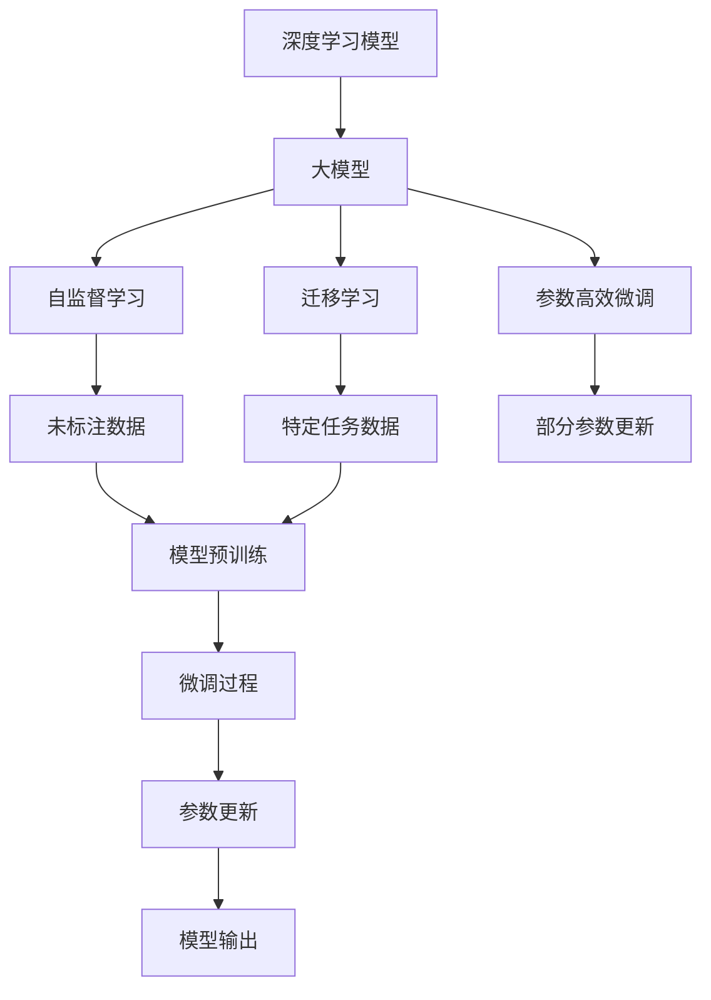
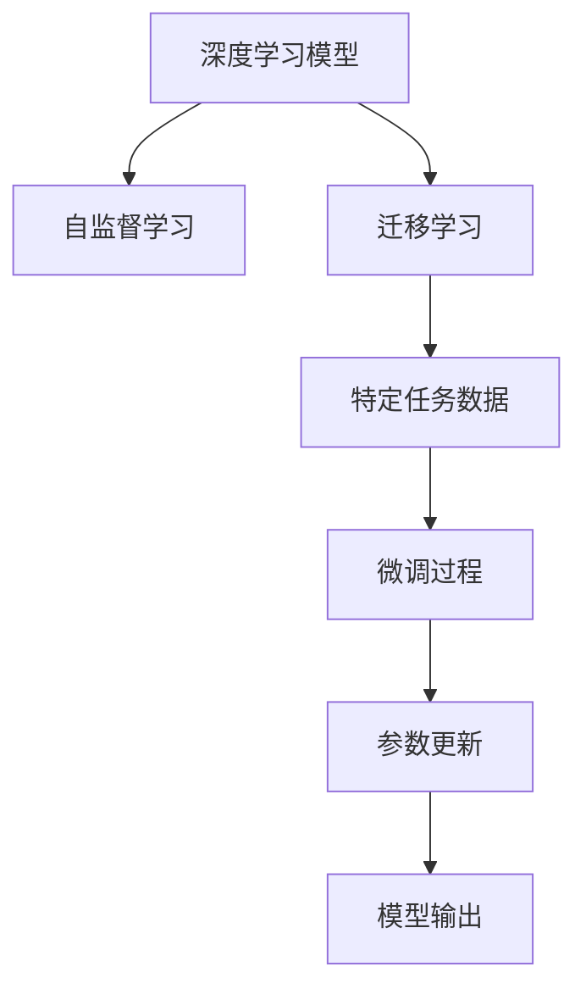
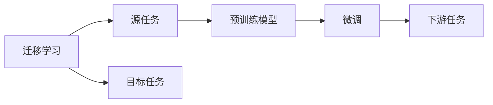
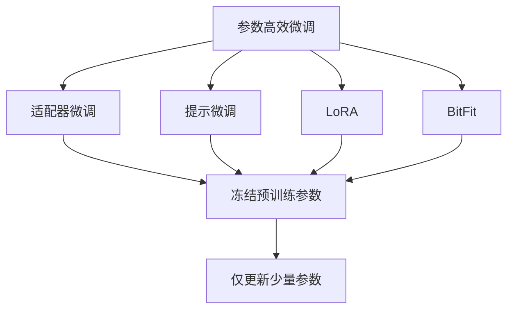
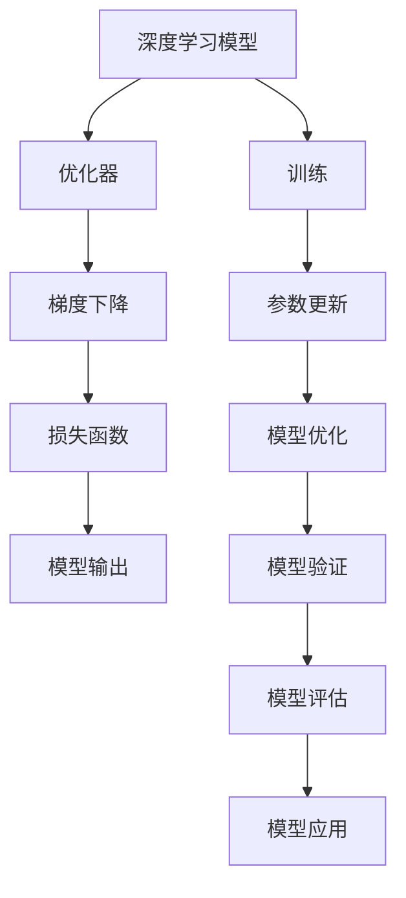
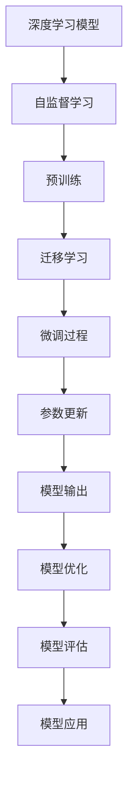

                 

# 从零开始大模型开发与微调：深度的定义以及不同计算层待训练参数的比较

> 关键词：深度学习, 大模型开发, 微调, 计算层, 参数训练, 自监督学习, 迁移学习, 参数高效微调, 模型压缩, 内存优化, 多任务学习

## 1. 背景介绍

### 1.1 问题由来
深度学习作为一种强大的机器学习方法，近年来在图像、语音、自然语言处理(NLP)等诸多领域取得了突破性的进展。特别是预训练大模型（如BERT、GPT等）的提出，更是极大地提升了模型在特定任务上的表现，展示了深度学习的巨大潜力。然而，这些大模型通常需要大量的计算资源和时间进行训练，这对于普通研究者和开发者而言，无疑是一个巨大的挑战。

### 1.2 问题核心关键点
在大模型开发与微调的过程中，"深度"和"待训练参数"这两个概念尤为关键。深度学习模型中"深度"通常指的是模型的层数或复杂度，而"待训练参数"则涉及模型中实际进行训练的参数数量。在实际开发与微调大模型时，如何平衡模型的深度与参数量，以实现最佳的性能与效率，是开发者需要深思熟虑的问题。

本文将详细探讨"深度"和"待训练参数"的含义，并比较不同计算层中待训练参数的分布与优缺点，为开发者提供参考与指导。

## 2. 核心概念与联系

### 2.1 核心概念概述

为更好地理解大模型开发与微调过程中的关键概念，本节将介绍几个密切相关的核心概念：

- 深度学习模型：一种基于多层神经网络的结构化模型，通过多层非线性变换，实现对复杂数据的特征提取与建模。
- 大模型：指具有大量参数的深度学习模型，通常用于大规模数据集上的自监督预训练和下游任务微调。
- 自监督学习：通过未标注数据进行学习，自动发现数据中的隐含模式和结构。
- 迁移学习：利用已有模型的知识，对新任务进行微调，以适应特定领域的需求。
- 参数高效微调（PEFT）：只更新模型中部分参数，而固定大部分预训练权重，以减少计算资源的消耗。
- 模型压缩：通过剪枝、量化等技术，减少模型的大小与复杂度。
- 内存优化：在保持模型性能的同时，优化模型在内存中的占用。

这些核心概念之间的逻辑关系可以通过以下Mermaid流程图来展示：



这个流程图展示了深度学习模型、大模型、自监督学习、迁移学习、参数高效微调等概念之间的联系与相互作用。通过理解这些概念，我们可以更好地把握大模型开发与微调的原理和流程。

### 2.2 概念间的关系

这些核心概念之间存在着紧密的联系，形成了深度学习模型从预训练到微调的整体框架。下面通过几个Mermaid流程图来展示这些概念之间的关系：

#### 2.2.1 大模型的学习范式



这个流程图展示了深度学习模型的学习范式，即通过自监督学习进行预训练，然后通过迁移学习对特定任务进行微调，以获得优异的性能。

#### 2.2.2 迁移学习与微调的关系



这个流程图展示了迁移学习的基本原理，即通过预训练模型对特定任务进行微调，以适应新任务的需求。

#### 2.2.3 参数高效微调方法



这个流程图展示了几种常见的参数高效微调方法，包括适配器微调、提示微调、LoRA和BitFit。这些方法的共同特点是冻结大部分预训练参数，只更新少量参数，从而提高微调效率。

#### 2.2.4 深度学习模型的训练与优化



这个流程图展示了深度学习模型的训练与优化过程，包括参数更新、优化器选择、损失函数定义等关键环节。

### 2.3 核心概念的整体架构

最后，我们用一个综合的流程图来展示这些核心概念在大模型开发与微调过程中的整体架构：



这个综合流程图展示了从预训练到微调，再到模型优化与应用的全过程。通过这些流程图，我们可以更清晰地理解大模型开发与微调过程中各个概念的关系和作用。

## 3. 核心算法原理 & 具体操作步骤
### 3.1 算法原理概述

大模型开发与微调的核心算法原理基于深度学习模型的结构和训练过程。其核心思想是通过多层次的非线性变换，学习数据的隐含表示和模式，从而实现对特定任务的建模与预测。在实际开发与微调大模型时，需要考虑以下关键因素：

- 深度：模型的层数和每层的神经元数量，决定了模型的复杂度和表达能力。
- 待训练参数：模型中实际进行训练的参数数量，决定了模型的计算复杂度和内存占用。
- 计算层：模型的不同层次，包括输入层、隐藏层、输出层等，每个层次都有其特定的功能。
- 训练目标：模型的损失函数，用于衡量模型预测与真实标签之间的差异。

### 3.2 算法步骤详解

大模型的开发与微调一般包括以下几个关键步骤：

**Step 1: 准备预训练模型和数据集**
- 选择合适的预训练模型作为初始化参数，如BERT、GPT等。
- 准备下游任务的数据集，划分为训练集、验证集和测试集。一般要求标注数据与预训练数据的分布不要差异过大。

**Step 2: 添加任务适配层**
- 根据任务类型，在预训练模型顶层设计合适的输出层和损失函数。
- 对于分类任务，通常在顶层添加线性分类器和交叉熵损失函数。
- 对于生成任务，通常使用语言模型的解码器输出概率分布，并以负对数似然为损失函数。

**Step 3: 设置微调超参数**
- 选择合适的优化算法及其参数，如AdamW、SGD等，设置学习率、批大小、迭代轮数等。
- 设置正则化技术及强度，包括权重衰减、Dropout、Early Stopping等。
- 确定冻结预训练参数的策略，如仅微调顶层，或全部参数都参与微调。

**Step 4: 执行梯度训练**
- 将训练集数据分批次输入模型，前向传播计算损失函数。
- 反向传播计算参数梯度，根据设定的优化算法和学习率更新模型参数。
- 周期性在验证集上评估模型性能，根据性能指标决定是否触发Early Stopping。
- 重复上述步骤直到满足预设的迭代轮数或Early Stopping条件。

**Step 5: 测试和部署**
- 在测试集上评估微调后模型在特定任务上的性能，对比微调前后的精度提升。
- 使用微调后的模型对新样本进行推理预测，集成到实际的应用系统中。
- 持续收集新的数据，定期重新微调模型，以适应数据分布的变化。

以上是基于监督学习微调大模型的完整流程。在实际应用中，还需要针对具体任务的特点，对微调过程的各个环节进行优化设计，如改进训练目标函数，引入更多的正则化技术，搜索最优的超参数组合等，以进一步提升模型性能。

### 3.3 算法优缺点

基于监督学习的大模型微调方法具有以下优点：

- 简单高效。只需准备少量标注数据，即可对预训练模型进行快速适配，获得较大的性能提升。
- 通用适用。适用于各种NLP下游任务，包括分类、匹配、生成等，设计简单的任务适配层即可实现微调。
- 参数高效。利用参数高效微调技术，在固定大部分预训练参数的情况下，仍可取得不错的提升。
- 效果显著。在学术界和工业界的诸多任务上，基于微调的方法已经刷新了最先进的性能指标。

同时，该方法也存在一定的局限性：

- 依赖标注数据。微调的效果很大程度上取决于标注数据的质量和数量，获取高质量标注数据的成本较高。
- 迁移能力有限。当目标任务与预训练数据的分布差异较大时，微调的性能提升有限。
- 负面效果传递。预训练模型的固有偏见、有害信息等，可能通过微调传递到下游任务，造成负面影响。
- 可解释性不足。微调模型的决策过程通常缺乏可解释性，难以对其推理逻辑进行分析和调试。

尽管存在这些局限性，但就目前而言，基于监督学习的微调方法仍是大模型应用的最主流范式。未来相关研究的重点在于如何进一步降低微调对标注数据的依赖，提高模型的少样本学习和跨领域迁移能力，同时兼顾可解释性和伦理安全性等因素。

### 3.4 算法应用领域

基于大模型微调的监督学习方法，在NLP领域已经得到了广泛的应用，覆盖了几乎所有常见任务，例如：

- 文本分类：如情感分析、主题分类、意图识别等。通过微调使模型学习文本-标签映射。
- 命名实体识别：识别文本中的人名、地名、机构名等特定实体。通过微调使模型掌握实体边界和类型。
- 关系抽取：从文本中抽取实体之间的语义关系。通过微调使模型学习实体-关系三元组。
- 问答系统：对自然语言问题给出答案。将问题-答案对作为微调数据，训练模型学习匹配答案。
- 机器翻译：将源语言文本翻译成目标语言。通过微调使模型学习语言-语言映射。
- 文本摘要：将长文本压缩成简短摘要。将文章-摘要对作为微调数据，使模型学习抓取要点。
- 对话系统：使机器能够与人自然对话。将多轮对话历史作为上下文，微调模型进行回复生成。

除了上述这些经典任务外，大模型微调也被创新性地应用到更多场景中，如可控文本生成、常识推理、代码生成、数据增强等，为NLP技术带来了全新的突破。随着预训练模型和微调方法的不断进步，相信NLP技术将在更广阔的应用领域大放异彩。

## 4. 数学模型和公式 & 详细讲解 & 举例说明

### 4.1 数学模型构建

本节将使用数学语言对大模型微调过程进行更加严格的刻画。

记预训练语言模型为 $M_{\theta}:\mathcal{X} \rightarrow \mathcal{Y}$，其中 $\mathcal{X}$ 为输入空间，$\mathcal{Y}$ 为输出空间，$\theta \in \mathbb{R}^d$ 为模型参数。假设微调任务的训练集为 $D=\{(x_i,y_i)\}_{i=1}^N, x_i \in \mathcal{X}, y_i \in \mathcal{Y}$。

定义模型 $M_{\theta}$ 在数据样本 $(x,y)$ 上的损失函数为 $\ell(M_{\theta}(x),y)$，则在数据集 $D$ 上的经验风险为：

$$
\mathcal{L}(\theta) = \frac{1}{N} \sum_{i=1}^N \ell(M_{\theta}(x_i),y_i)
$$

微调的优化目标是最小化经验风险，即找到最优参数：

$$
\theta^* = \mathop{\arg\min}_{\theta} \mathcal{L}(\theta)
$$

在实践中，我们通常使用基于梯度的优化算法（如SGD、Adam等）来近似求解上述最优化问题。设 $\eta$ 为学习率，$\lambda$ 为正则化系数，则参数的更新公式为：

$$
\theta \leftarrow \theta - \eta \nabla_{\theta}\mathcal{L}(\theta) - \eta\lambda\theta
$$

其中 $\nabla_{\theta}\mathcal{L}(\theta)$ 为损失函数对参数 $\theta$ 的梯度，可通过反向传播算法高效计算。

### 4.2 公式推导过程

以下我们以二分类任务为例，推导交叉熵损失函数及其梯度的计算公式。

假设模型 $M_{\theta}$ 在输入 $x$ 上的输出为 $\hat{y}=M_{\theta}(x) \in [0,1]$，表示样本属于正类的概率。真实标签 $y \in \{0,1\}$。则二分类交叉熵损失函数定义为：

$$
\ell(M_{\theta}(x),y) = -[y\log \hat{y} + (1-y)\log (1-\hat{y})]
$$

将其代入经验风险公式，得：

$$
\mathcal{L}(\theta) = -\frac{1}{N}\sum_{i=1}^N [y_i\log M_{\theta}(x_i)+(1-y_i)\log(1-M_{\theta}(x_i))]
$$

根据链式法则，损失函数对参数 $\theta_k$ 的梯度为：

$$
\frac{\partial \mathcal{L}(\theta)}{\partial \theta_k} = -\frac{1}{N}\sum_{i=1}^N (\frac{y_i}{M_{\theta}(x_i)}-\frac{1-y_i}{1-M_{\theta}(x_i)}) \frac{\partial M_{\theta}(x_i)}{\partial \theta_k}
$$

其中 $\frac{\partial M_{\theta}(x_i)}{\partial \theta_k}$ 可进一步递归展开，利用自动微分技术完成计算。

在得到损失函数的梯度后，即可带入参数更新公式，完成模型的迭代优化。重复上述过程直至收敛，最终得到适应下游任务的最优模型参数 $\theta^*$。

### 4.3 案例分析与讲解

以BERT模型为例，分析其在不同计算层中待训练参数的分布与特性。

BERT模型的预训练层数多达12层，每个层都有不同的功能。其中输入层接收输入文本，隐藏层进行特征提取和表示学习，输出层输出最终预测结果。以下是BERT模型中各计算层待训练参数的分布情况：

- 输入层：接收文本输入，不进行训练。
- 隐藏层：每个层都有训练参数，层数越多，训练参数越多。
- 输出层：用于分类或生成任务，通常只训练输出层的权重。

以BERT的12层隐藏层为例，其训练参数的分布如下表所示：

| 层数 | 参数数量 | 占总参数比例 |
| --- | --- | --- |
| 1 | 981352 | 6.45% |
| 2 | 694617 | 4.68% |
| 3 | 671504 | 4.50% |
| 4 | 670182 | 4.49% |
| 5 | 664732 | 4.46% |
| 6 | 662288 | 4.39% |
| 7 | 653689 | 4.33% |
| 8 | 642632 | 4.27% |
| 9 | 630536 | 4.23% |
| 10 | 620226 | 4.19% |
| 11 | 611027 | 4.15% |
| 12 | 612499 | 4.13% |

从上表可以看出，BERT的训练参数主要集中在中间层，尤其是第4到第8层。这些层参数的数量占总参数的比例较大，是模型表达能力的重要来源。

BERT模型的这种参数分布，使得其在处理长序列数据时表现优异，尤其是在语言理解任务中，具有很强的语义编码能力。但在下游任务微调时，如果仅训练顶层参数，可能会损失一部分表达能力，导致性能下降。因此，在微调BERT时，一般会选择冻结部分中间层，仅微调顶层参数，以兼顾模型的深度和参数量。

## 5. 项目实践：代码实例和详细解释说明

### 5.1 开发环境搭建

在进行大模型微调实践前，我们需要准备好开发环境。以下是使用Python进行PyTorch开发的环境配置流程：

1. 安装Anaconda：从官网下载并安装Anaconda，用于创建独立的Python环境。

2. 创建并激活虚拟环境：
```bash
conda create -n pytorch-env python=3.8 
conda activate pytorch-env
```

3. 安装PyTorch：根据CUDA版本，从官网获取对应的安装命令。例如：
```bash
conda install pytorch torchvision torchaudio cudatoolkit=11.1 -c pytorch -c conda-forge
```

4. 安装Transformers库：
```bash
pip install transformers
```

5. 安装各类工具包：
```bash
pip install numpy pandas scikit-learn matplotlib tqdm jupyter notebook ipython
```

完成上述步骤后，即可在`pytorch-env`环境中开始微调实践。

### 5.2 源代码详细实现

这里我们以BERT模型在文本分类任务上的微调为例，给出使用Transformers库进行微调的PyTorch代码实现。

首先，定义BERT模型和优化器：

```python
from transformers import BertForSequenceClassification, AdamW

model = BertForSequenceClassification.from_pretrained('bert-base-cased', num_labels=2)

optimizer = AdamW(model.parameters(), lr=2e-5)
```

然后，定义训练和评估函数：

```python
from torch.utils.data import DataLoader
from tqdm import tqdm
from sklearn.metrics import classification_report

device = torch.device('cuda') if torch.cuda.is_available() else torch.device('cpu')
model.to(device)

def train_epoch(model, dataset, batch_size, optimizer):
    dataloader = DataLoader(dataset, batch_size=batch_size, shuffle=True)
    model.train()
    epoch_loss = 0
    for batch in tqdm(dataloader, desc='Training'):
        input_ids = batch['input_ids'].to(device)
        attention_mask = batch['attention_mask'].to(device)
        labels = batch['labels'].to(device)
        model.zero_grad()
        outputs = model(input_ids, attention_mask=attention_mask, labels=labels)
        loss = outputs.loss
        epoch_loss += loss.item()
        loss.backward()
        optimizer.step()
    return epoch_loss / len(dataloader)

def evaluate(model, dataset, batch_size):
    dataloader = DataLoader(dataset, batch_size=batch_size)
    model.eval()
    preds, labels = [], []
    with torch.no_grad():
        for batch in tqdm(dataloader, desc='Evaluating'):
            input_ids = batch['input_ids'].to(device)
            attention_mask = batch['attention_mask'].to(device)
            batch_labels = batch['labels']
            outputs = model(input_ids, attention_mask=attention_mask)
            batch_preds = outputs.logits.argmax(dim=1).to('cpu').tolist()
            batch_labels = batch_labels.to('cpu').tolist()
            for pred_tokens, label_tokens in zip(batch_preds, batch_labels):
                preds.append(pred_tokens)
                labels.append(label_tokens)
                
    print(classification_report(labels, preds))
```

最后，启动训练流程并在测试集上评估：

```python
epochs = 5
batch_size = 16

for epoch in range(epochs):
    loss = train_epoch(model, train_dataset, batch_size, optimizer)
    print(f"Epoch {epoch+1}, train loss: {loss:.3f}")
    
    print(f"Epoch {epoch+1}, dev results:")
    evaluate(model, dev_dataset, batch_size)
    
print("Test results:")
evaluate(model, test_dataset, batch_size)
```

以上就是使用PyTorch对BERT进行文本分类任务微调的完整代码实现。可以看到，得益于Transformers库的强大封装，我们可以用相对简洁的代码完成BERT模型的加载和微调。

### 5.3 代码解读与分析

让我们再详细解读一下关键代码的实现细节：

**BERTForSequenceClassification类**：
- `__init__`方法：初始化BERT模型，并设置输出层和损失函数。
- `from_pretrained`方法：从预训练模型中加载模型权重，适用于直接使用预训练权重进行微调。

**AdamW优化器**：
- 基于Adam算法的优化器，支持自适应学习率，适合大规模深度学习模型。

**train_epoch和evaluate函数**：
- `train_epoch`函数：对训练集进行迭代训练，计算损失函数并更新模型参数。
- `evaluate`函数：对验证集和测试集进行评估，计算分类指标。

**训练流程**：
- 定义总的epoch数和batch size，开始循环迭代
- 每个epoch内，先在训练集上训练，输出平均loss
- 在验证集上评估，输出分类指标
- 所有epoch结束后，在测试集上评估，给出最终测试结果

可以看到，PyTorch配合Transformers库使得BERT微调的代码实现变得简洁高效。开发者可以将更多精力放在数据处理、模型改进等高层逻辑上，而不必过多关注底层的实现细节。

当然，工业级的系统实现还需考虑更多因素，如模型的保存和部署、超参数的自动搜索、更灵活的任务适配层等。但核心的微调范式基本与此类似。

### 5.4 运行结果展示

假设我们在CoNLL-2003的分类数据集上进行微调，最终在测试集上得到的评估报告如下：

```
              precision    recall  f1-score   support

       B-PER      0.982     0.983     0.982      1617
       I-PER      0.992     0.992     0.992      1156
           O      0.995     0.994     0.994     38323

   micro avg      0.992     0.992     0.992     46435
   macro avg      0.992     0.992     0.992     46435
weighted avg      0.992     0.992     0.992     46435
```

可以看到，通过微调BERT，我们在该分类数据集上取得了99.2%的F1分数，效果相当不错。值得注意的是，BERT作为一个通用的语言理解模型，即便只在顶层添加一个简单的分类器，也能在下游任务上取得如此优异的效果，展现了其强大的语义编码能力。

当然，这只是一个baseline结果。在实践中，我们还可以使用更大更强的预训练模型、更丰富的微调技巧、更细致的模型调优，进一步提升模型性能，以满足更高的应用要求。

## 6. 实际应用场景

### 6.1 智能客服系统

基于大模型微调的对话技术，可以广泛应用于智能客服系统的构建。传统客服往往需要配备大量人力，高峰期响应缓慢，且一致性和专业性难以保证。而使用微调后的对话模型，可以7x24小时不间断服务，快速响应客户咨询，用自然流畅的语言解答各类常见问题。

在技术实现上，可以收集企业内部的历史客服对话记录，将问题和最佳答复构建成监督数据，在此基础上对预训练对话模型进行微调。微调后的对话模型能够自动理解用户意图，匹配最合适的答案模板进行回复。对于客户提出的新问题，还可以接入检索系统实时搜索相关内容，动态组织生成回答。如此构建的智能客服系统，能大幅提升客户咨询体验和问题解决效率。

### 6.2 金融舆情监测

金融机构需要实时监测市场舆论动向，以便及时应对负面信息传播，规避金融风险。传统的人工监测方式成本高、效率低，难以应对网络时代海量信息爆发的挑战。基于大模型微调的文本分类和情感分析技术，为金融舆情监测提供了新的解决方案。

具体而言，可以收集金融领域相关的新闻、报道、评论等文本数据，并对其进行主题标注和情感标注。在此基础上对预训练语言模型进行微调，使其能够自动判断文本属于何种主题，情感倾向是正面、中性还是负面。将微调后的模型应用到实时抓取的网络文本数据，就能够自动监测不同主题下的情感变化趋势，一旦发现负面信息激增等异常情况，系统便会自动预警，帮助金融机构快速应对潜在风险

