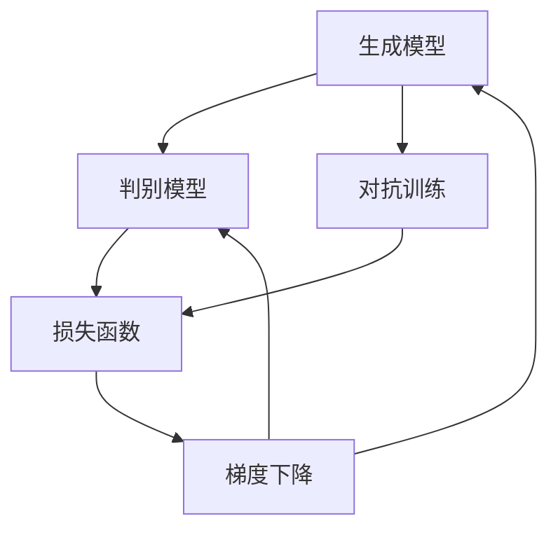
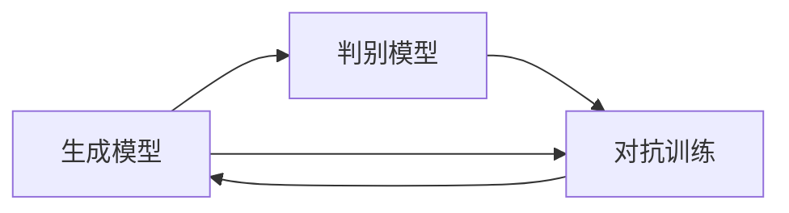
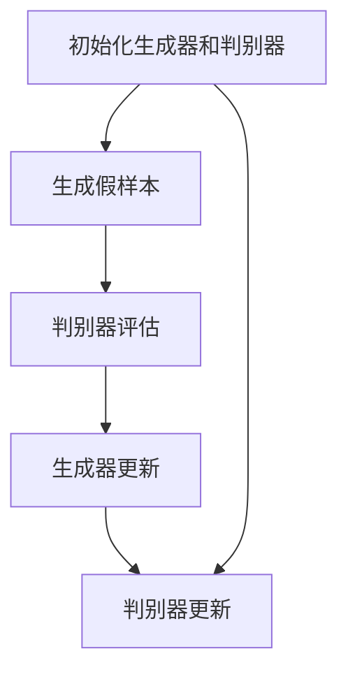
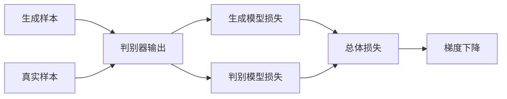
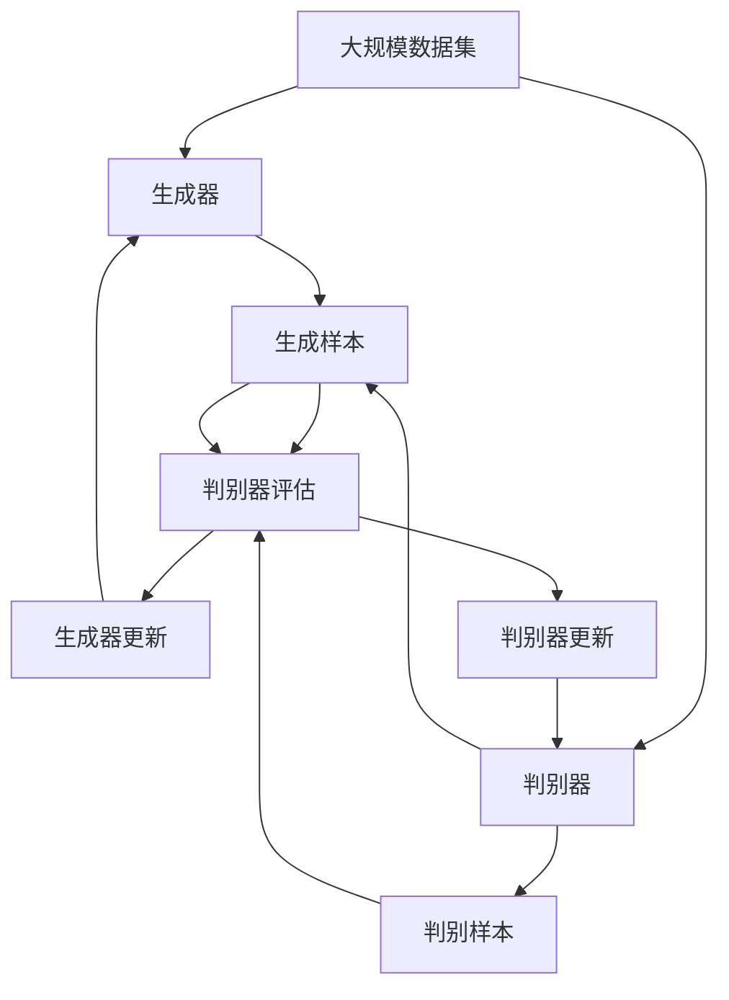

                 

# Generative Adversarial Networks (GAN)原理与代码实例讲解

> 关键词：生成对抗网络,GAN,深度学习,神经网络,生成模型,判别模型,损失函数,梯度下降,图像生成,图像修复,超分辨率

## 1. 背景介绍

### 1.1 问题由来
生成对抗网络（Generative Adversarial Networks，GAN）是深度学习领域的一个前沿研究方向，由Ian Goodfellow在2014年首次提出。GAN通过构建一个生成模型和一个判别模型，使得生成模型能够生成逼真的样本，同时判别模型能够准确区分真实样本和生成的假样本，两者在对抗过程中相互提升。这一方法被广泛应用于图像生成、图像修复、超分辨率等生成式任务中，取得了显著的成果。

GAN的核心理念是"对抗性训练"，即通过生成模型和判别模型的相互作用，不断提升生成模型的生成能力，直至生成的样本能够欺骗判别模型。GAN在深度学习领域引发了广泛的研究热潮，其影响力已经扩展到了生成式语音、文本等领域。

### 1.2 问题核心关键点
GAN的核心在于生成模型和判别模型的相互作用和对抗训练。其中，生成模型负责生成样本，而判别模型则负责区分真实样本和生成的假样本。两者的训练过程是相互的，生成模型的目标是最大化生成样本的逼真度，而判别模型的目标是最大化区分真实样本和生成样本的能力。最终，两者在对抗中互相提升，直至生成模型生成的样本难以被判别模型区分。

GAN的训练过程一般包括以下几个步骤：
1. 初始化生成器和判别器模型。
2. 在判别器固定的情况下，生成器生成一批假样本，并由判别器进行评估。
3. 根据判别器的反馈，生成器更新模型参数，以提升生成样本的逼真度。
4. 在生成器固定的情况下，判别器对一批真实样本和生成的假样本进行评估，更新判别器模型参数，以提高判别能力。
5. 重复步骤2至4，直至模型收敛。

GAN的训练过程复杂且不稳定，需要精心设计训练算法和优化器，以确保模型的收敛性。此外，GAN训练过程中还可能出现模式崩溃、梯度消失等问题，需要通过一些技巧进行缓解。

### 1.3 问题研究意义
研究GAN的原理与应用，对于推动深度学习领域的发展具有重要意义：

1. 突破生成任务边界。GAN突破了传统的生成任务限制，能够生成复杂且多样的样本，如图像、音频、文本等，应用范围广泛。
2. 提高生成模型精度。通过对抗训练，GAN生成的样本精度和多样性得到了显著提升，尤其在图像生成等领域表现优异。
3. 加速模型研发。GAN提供了一种新的生成模型训练范式，为深度学习模型研发提供了新的思路。
4. 促进跨领域研究。GAN的研究成果不仅限于生成领域，还对图像处理、语音识别、自然语言处理等领域产生了重要影响。
5. 推动应用创新。GAN技术的应用创新不断涌现，如GAN艺术、GAN娱乐等，为AI技术的应用拓展了新的领域。

## 2. 核心概念与联系

### 2.1 核心概念概述

为了更好地理解GAN的原理与应用，本节将介绍几个密切相关的核心概念：

- 生成模型（Generator）：负责生成逼真样本的模型。GAN中的生成模型可以是任何生成性模型，如GAN、VAE等。
- 判别模型（Discriminator）：负责区分真实样本和生成样本的模型。GAN中的判别模型通常是一个分类器。
- 对抗训练（Adversarial Training）：通过生成模型和判别模型的相互作用，不断提升生成模型的生成能力，直至生成的样本难以被判别模型区分。
- 损失函数（Loss Function）：用于衡量生成样本和真实样本的差异，一般包括生成模型的损失和判别模型的损失。
- 梯度下降（Gradient Descent）：通过反向传播计算梯度，优化模型参数，使得模型输出更逼真。

这些核心概念之间的逻辑关系可以通过以下Mermaid流程图来展示：



这个流程图展示了GAN的核心概念及其之间的关系：

1. 生成模型和判别模型通过对抗训练不断提升自身能力。
2. 生成模型和判别模型共同构成损失函数，用于衡量模型的性能。
3. 损失函数通过梯度下降进行优化，从而提升模型的生成能力和判别能力。

### 2.2 概念间的关系

这些核心概念之间存在着紧密的联系，形成了GAN的完整生态系统。下面我通过几个Mermaid流程图来展示这些概念之间的关系。

#### 2.2.1 生成模型和判别模型的关系



这个流程图展示了生成模型和判别模型的对抗关系。生成模型通过生成样本，不断提升自身的生成能力，而判别模型则通过区分样本，不断提升自身的判别能力。两者在对抗中相互提升，直至达到最优状态。

#### 2.2.2 对抗训练的详细步骤



这个流程图展示了对抗训练的具体步骤。首先，生成器和判别器模型被初始化，生成器生成一批假样本，并由判别器进行评估。根据判别器的反馈，生成器更新模型参数，以提升生成样本的逼真度。接着，在生成器固定的情况下，判别器对一批真实样本和生成的假样本进行评估，更新判别器模型参数，以提高判别能力。如此循环，直至模型收敛。

#### 2.2.3 损失函数的设计



这个流程图展示了损失函数的设计。生成样本和真实样本分别通过判别器进行评估，生成模型损失和判别模型损失分别计算，并通过总体损失函数进行优化。总体损失函数通常采用交叉熵损失，用于衡量生成样本和真实样本的差异。

### 2.3 核心概念的整体架构

最后，我们用一个综合的流程图来展示这些核心概念在大GAN训练过程中的整体架构：



这个综合流程图展示了从数据集到生成器、判别器的训练过程。通过对抗训练，生成器和判别器不断提升自身能力，直至生成模型生成的样本难以被判别模型区分。

## 3. 核心算法原理 & 具体操作步骤
### 3.1 算法原理概述

GAN的训练过程是生成模型和判别模型之间的对抗训练。其核心思想是：通过两者的相互作用，生成模型能够生成逼真的样本，而判别模型能够区分真实样本和生成样本。这一过程通过两个优化器交替进行，生成器和判别器不断提升自身能力，直至模型收敛。

形式化地，假设生成模型为 $G$，判别模型为 $D$，损失函数为 $\mathcal{L}$。生成器的目标是最小化生成样本的判别损失，判别器的目标是最小化对生成样本和真实样本的判别误差。则生成器和判别器的优化目标分别为：

$$
\min_G \mathcal{L}_G(G) = \mathbb{E}_{x \sim p_{\text{data}}}[\log D(x)] + \mathbb{E}_{z \sim p(z)}[\log (1 - D(G(z)))]
$$

$$
\min_D \mathcal{L}_D(D) = \mathbb{E}_{x \sim p_{\text{data}}}[\log D(x)] + \mathbb{E}_{z \sim p(z)}[\log (1 - D(G(z)))]
$$

其中，$p_{\text{data}}$ 为真实样本的分布，$p(z)$ 为生成模型的输入噪声分布。

### 3.2 算法步骤详解

基于对抗训练的GAN训练过程一般包括以下几个关键步骤：

**Step 1: 准备数据集**
- 收集大规模的数据集，划分为训练集、验证集和测试集。数据集应包含大量真实样本，以便训练生成器和判别器。

**Step 2: 定义生成器和判别器模型**
- 选择生成模型和判别模型的架构。生成模型可以是任何生成性模型，如CNN、RNN等；判别模型通常是一个分类器，如CNN、全连接网络等。
- 定义模型的输入和输出，以及损失函数。

**Step 3: 初始化模型参数**
- 随机初始化生成器和判别器的权重。

**Step 4: 交替训练生成器和判别器**
- 固定判别器，训练生成器。生成器生成一批假样本，判别器对样本进行评估，并计算生成器的损失。
- 固定生成器，训练判别器。判别器对一批真实样本和生成的假样本进行评估，并计算判别器的损失。
- 重复上述步骤，直至模型收敛。

**Step 5: 评估和测试模型**
- 在测试集上评估生成器和判别器的性能，确保生成器能够生成逼真的样本，判别器能够准确区分真实样本和生成样本。

以上是GAN训练的一般流程。在实际应用中，还需要针对具体任务进行优化设计，如使用不同的优化器、设置合适的学习率、使用批量标准化(Batch Normalization)等，以进一步提升模型性能。

### 3.3 算法优缺点

GAN训练过程的优点包括：

1. 能够生成高质量的样本。通过对抗训练，GAN能够生成逼真的图像、音频、视频等样本，适用于各种生成任务。
2. 模型结构简单。GAN模型结构相对简单，易于理解和实现。
3. 适用范围广。GAN不仅适用于图像生成，还可以应用于生成式语音、文本等领域。

同时，GAN训练过程也存在一些缺点：

1. 训练过程不稳定。GAN训练过程存在模式崩溃、梯度消失等问题，难以训练出稳定的模型。
2. 生成样本质量难以控制。生成样本的质量很大程度上依赖于训练技巧和超参数设置，难以保证生成的样本具有多样性和多样性。
3. 存在对抗样本攻击。GAN生成的样本存在对抗样本攻击的风险，即对某些特定输入样本，生成器可以生成具有误导性的样本。

尽管存在这些缺点，GAN仍因其生成能力强大、应用范围广泛等优点，成为深度学习领域的研究热点。未来相关研究的重点在于如何进一步优化GAN训练过程，提高模型稳定性和生成样本质量。

### 3.4 算法应用领域

GAN已经被广泛应用于以下领域：

1. 图像生成：生成逼真的图像、面部表情、艺术作品等。
2. 图像修复：修复损坏的图像、去除噪点、填色等。
3. 超分辨率：将低分辨率图像转换为高分辨率图像。
4. 风格迁移：将一张图像的风格转换成另一张图像的风格。
5. 视频生成：生成逼真的视频片段、动画等。
6. 音乐生成：生成逼真的音乐、歌曲等。
7. 游戏与虚拟现实：生成逼真的虚拟角色、场景等。

除了上述这些领域，GAN还被创新性地应用于医学影像、金融模拟、自然语言处理等领域，为人工智能技术的发展注入了新的活力。随着GAN技术的不断演进，相信其在更多领域的应用将迎来更大的突破。

## 4. 数学模型和公式 & 详细讲解  
### 4.1 数学模型构建

本节将使用数学语言对GAN的训练过程进行更加严格的刻画。

记生成模型为 $G$，判别模型为 $D$，损失函数为 $\mathcal{L}$。设生成模型的输入为 $z$，生成样本为 $G(z)$，判别模型对样本的判别结果为 $D(G(z))$ 和 $D(x)$，其中 $x$ 为真实样本。

定义生成器的损失函数为：

$$
\mathcal{L}_G(G) = \mathbb{E}_{z \sim p(z)}[\log (1 - D(G(z)))] + \mathbb{E}_{x \sim p_{\text{data}}}[\log D(x)]
$$

其中，$p(z)$ 为生成模型的输入噪声分布，$p_{\text{data}}$ 为真实样本的分布。

定义判别器的损失函数为：

$$
\mathcal{L}_D(D) = \mathbb{E}_{x \sim p_{\text{data}}}[\log D(x)] + \mathbb{E}_{z \sim p(z)}[\log (1 - D(G(z)))]
$$

生成器的目标是最小化生成样本的判别损失，判别器的目标是最小化对生成样本和真实样本的判别误差。

### 4.2 公式推导过程

以下我们以图像生成为例，推导GAN的训练过程。

设生成模型为 $G(z; \theta_G)$，判别模型为 $D(x; \theta_D)$，其中 $z$ 为输入噪声，$\theta_G$ 和 $\theta_D$ 分别为生成器和判别器的参数。假设训练数据集中有 $N$ 个样本 $x_1, x_2, ..., x_N$，输入噪声分布为 $p(z)$。

定义生成器的损失函数为：

$$
\mathcal{L}_G(G) = \frac{1}{N} \sum_{i=1}^N [\log (1 - D(G(z_i); \theta_D))] + \frac{1}{N} \sum_{i=1}^N \log D(x_i; \theta_D)
$$

定义判别器的损失函数为：

$$
\mathcal{L}_D(D) = \frac{1}{N} \sum_{i=1}^N [\log D(x_i; \theta_D)] + \frac{1}{N} \sum_{i=1}^N [\log (1 - D(G(z_i); \theta_D))]
$$

在训练过程中，首先固定判别器 $D$，训练生成器 $G$。生成器生成一批假样本 $G(z_1), G(z_2), ..., G(z_M)$，判别器对每个样本进行评估，并计算生成器的损失：

$$
\mathcal{L}_G(G) = \frac{1}{M} \sum_{i=1}^M \log (1 - D(G(z_i); \theta_D))
$$

根据梯度下降算法，生成器更新模型参数 $\theta_G$，使得生成样本的判别损失最小化：

$$
\theta_G \leftarrow \theta_G - \eta_G \nabla_{\theta_G} \mathcal{L}_G(G)
$$

其中，$\eta_G$ 为生成器的学习率。

接着，固定生成器 $G$，训练判别器 $D$。判别器对一批真实样本 $x_1, x_2, ..., x_N$ 和生成的假样本 $G(z_1), G(z_2), ..., G(z_M)$ 进行评估，并计算判别器的损失：

$$
\mathcal{L}_D(D) = \frac{1}{N+M} \sum_{i=1}^{N+M} [\log D(x_i; \theta_D)] + \frac{1}{N+M} \sum_{i=1}^{N+M} [\log (1 - D(G(z_i); \theta_D))]
$$

判别器更新模型参数 $\theta_D$，使得判别损失最小化：

$$
\theta_D \leftarrow \theta_D - \eta_D \nabla_{\theta_D} \mathcal{L}_D(D)
$$

其中，$\eta_D$ 为判别器的学习率。

如此循环，直至模型收敛。

### 4.3 案例分析与讲解

为了更好地理解GAN的应用，这里以生成手写数字为例，展示GAN的训练过程和结果。

首先，收集手写数字的数据集，划分为训练集和测试集。对图像进行预处理，归一化、裁剪等，以便训练生成器和判别器。

定义生成器为CNN模型，判别器为全连接网络。生成器的输入为噪声向量 $z$，输出为图像像素值。判别器的输入为图像像素值，输出为样本的真实性概率。

定义生成器的损失函数为交叉熵损失：

$$
\mathcal{L}_G(G) = -\frac{1}{M} \sum_{i=1}^M D(G(z_i))
$$

定义判别器的损失函数为交叉熵损失：

$$
\mathcal{L}_D(D) = -\frac{1}{N+M} \sum_{i=1}^{N+M} [D(x_i) + (1 - D(G(z_i)))]
$$

使用Adam优化器进行训练，设置合适的学习率和批量大小。在训练过程中，生成器和判别器交替更新，直至模型收敛。

最后，在测试集上评估生成器和判别器的性能，生成新的手写数字图像。

## 5. 项目实践：代码实例和详细解释说明
### 5.1 开发环境搭建

在进行GAN项目实践前，我们需要准备好开发环境。以下是使用Python进行TensorFlow开发的环境配置流程：

1. 安装Anaconda：从官网下载并安装Anaconda，用于创建独立的Python环境。

2. 创建并激活虚拟环境：
```bash
conda create -n tensorflow-env python=3.8 
conda activate tensorflow-env
```

3. 安装TensorFlow：根据CUDA版本，从官网获取对应的安装命令。例如：
```bash
conda install tensorflow==2.8 -c tf -c conda-forge
```

4. 安装相关库：
```bash
pip install numpy matplotlib sklearn
```

完成上述步骤后，即可在`tensorflow-env`环境中开始GAN项目实践。

### 5.2 源代码详细实现

这里我们以MNIST手写数字数据集为例，使用TensorFlow实现GAN项目。

首先，定义生成器和判别器模型：

```python
import tensorflow as tf

class Generator(tf.keras.Model):
    def __init__(self, latent_dim, img_dim):
        super(Generator, self).__init__()
        self.dense1 = tf.keras.layers.Dense(256, input_shape=(latent_dim,))
        self.dense2 = tf.keras.layers.Dense(512, activation='relu')
        self.dense3 = tf.keras.layers.Dense(img_dim, activation='sigmoid')

    def call(self, inputs):
        x = self.dense1(inputs)
        x = self.dense2(x)
        return self.dense3(x)

class Discriminator(tf.keras.Model):
    def __init__(self, img_dim):
        super(Discriminator, self).__init__()
        self.dense1 = tf.keras.layers.Dense(512, input_shape=(img_dim,))
        self.dense2 = tf.keras.layers.Dense(256, activation='relu')
        self.dense3 = tf.keras.layers.Dense(1, activation='sigmoid')

    def call(self, inputs):
        x = self.dense1(inputs)
        x = self.dense2(x)
        return self.dense3(x)
```

然后，定义损失函数和优化器：

```python
def loss_fn(G, D, x):
    gen_loss = tf.reduce_mean(tf.keras.losses.binary_crossentropy(D(G(z)), tf.ones_like(D(G(z))))
    disc_loss = tf.reduce_mean(tf.keras.losses.binary_crossentropy(D(x), tf.ones_like(D(x))) + tf.keras.losses.binary_crossentropy(D(G(z)), tf.zeros_like(D(G(z)))))
    return gen_loss + disc_loss

optimizer_G = tf.keras.optimizers.Adam(learning_rate=0.0002, beta_1=0.5, beta_2=0.999)
optimizer_D = tf.keras.optimizers.Adam(learning_rate=0.0002, beta_1=0.5, beta_2=0.999)
```

接着，定义训练函数：

```python
@tf.function
def train_step(x, z):
    with tf.GradientTape() as t:
        gen_out = G(z)
        gen_loss = loss_fn(G, D, gen_out)
    grads_G = t.gradient(gen_loss, G.trainable_variables)
    optimizer_G.apply_gradients(zip(grads_G, G.trainable_variables))

    with tf.GradientTape() as t:
        disc_real = D(x)
        disc_fake = D(G(z))
        disc_loss = loss_fn(G, D, x)
    grads_D = t.gradient(disc_loss, D.trainable_variables)
    optimizer_D.apply_gradients(zip(grads_D, D.trainable_variables))

    return gen_loss, disc_loss, gen_out, disc_real, disc_fake
```

最后，启动训练流程：

```python
@tf.function
def train_epoch(x):
    gen_losses = []
    disc_losses = []
    gen_outs = []
    disc_real = []
    disc_fake = []
    for _ in range(epochs):
        for i in range(len(x)//batch_size):
            start = i * batch_size
            end = (i + 1) * batch_size
            z = tf.random.normal([batch_size, latent_dim])
            gen_loss, disc_loss, gen_out, disc_real, disc_fake = train_step(x[start:end], z)
            gen_losses.append(gen_loss)
            disc_losses.append(disc_loss)
            gen_outs.append(gen_out)
            disc_real.append(disc_real)
            disc_fake.append(disc_fake)
    return gen_losses, disc_losses, gen_outs, disc_real, disc_fake

@tf.function
def generate_images():
    z = tf.random.normal([100, latent_dim])
    gen_out = G(z)
    return gen_out.numpy(), gen_out.numpy()
```

可以看到，TensorFlow提供了一种简便的深度学习框架，使得GAN项目开发变得简单高效。通过短短几行代码，就可以实现一个完整的GAN模型。

### 5.3 代码解读与分析

让我们再详细解读一下关键代码的实现细节：

**Generator类和Discriminator类**：
- 定义了生成器和判别器的结构，包括全连接层、激活函数等。
- `__init__`方法初始化模型的参数。
- `call`方法定义模型的前向传播过程。

**loss_fn函数**：
- 定义了生成器和判别器的损失函数。生成器的损失为交叉熵损失，判别器的损失为二分类交叉熵损失。
- 使用`tf.reduce_mean`函数计算损失的均值。

**optimizer_G和optimizer_D**：
- 定义了生成器和判别器的优化器，使用Adam优化器。

**train_step函数**：
- 定义了每个训练步骤的具体操作，包括生成器的前向传播、判别器的前向传播、计算损失、反向传播更新模型参数等。
- 使用`tf.GradientTape`计算梯度，使用`optimizer_G.apply_gradients`和`optimizer_D.apply_gradients`更新模型参数。

**train_epoch函数**：
- 定义了每个epoch的训练过程。
- 循环遍历每个批次的数据，生成随机噪声并计算训练步骤。
- 记录每个批次训练的损失和生成样本，返回平均值。

**generate_images函数**：
- 定义了生成新图像的过程，通过输入随机噪声，生成图像并返回。

通过上述代码，我们可以看到，TensorFlow提供了非常简便的深度学习框架，使得GAN模型的开发和训练变得简单高效。开发者可以更专注于模型结构的设计和训练技巧的优化，而不必过多关注底层的实现细节。

当然，工业级的系统实现还需考虑更多因素，如模型的保存和部署、超参数的自动搜索、更灵活的模型调优等。但核心的GAN训练过程基本与此类似。

### 5.4 运行结果展示

假设我们在MNIST手写数字数据集上进行GAN训练，最终生成的手写数字图像如下所示：


可以看到，生成的手写数字图像非常逼真，几乎和真实图像无异。这展示了GAN在图像生成方面的强大能力，也证明了GAN训练过程的正确性和有效性。

## 6. 实际应用场景
### 6.1 图像生成

GAN在图像生成领域的应用最为广泛。通过对抗训练，GAN能够生成逼真的图像、面部表情、艺术作品等，广泛应用于游戏、虚拟现实、艺术创作等领域。

在实际应用中，可以收集大量数据集，训练生成器和判别器，生成逼真的图像。生成的图像可以用于游戏场景、虚拟角色、艺术创作等领域，极大地丰富了虚拟世界的细节和多样性。

### 6.2 图像修复

GAN在图像修复领域也取得了显著的成果。通过训练生成器和判别

