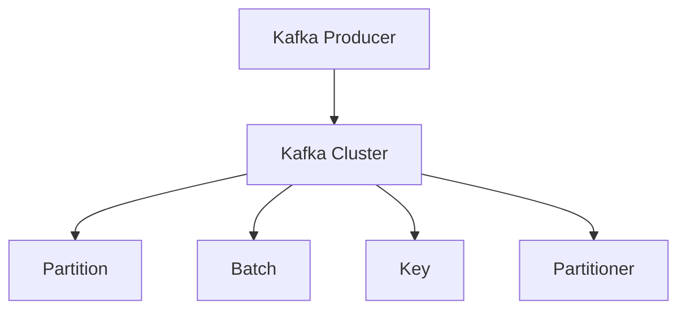
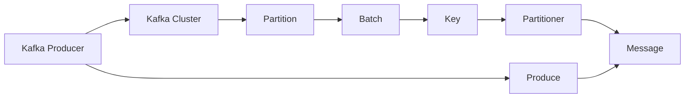
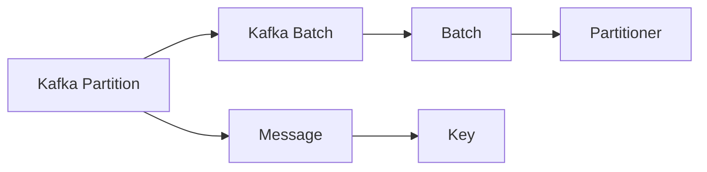
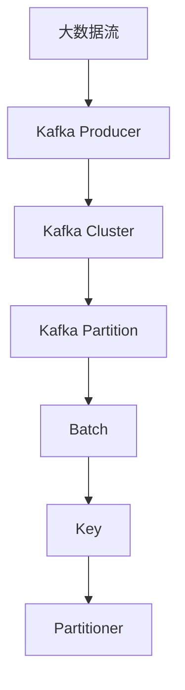

                 

## 1. 背景介绍

### 1.1 问题由来
随着数据流技术的不断发展，流式数据处理变得越来越重要。在大数据处理领域，Kafka（Apache Kafka）作为一个高性能、分布式、可扩展的消息队列系统，被广泛应用。Kafka Producer（生产者）是Kafka的核心组件之一，用于向Kafka集群发送消息。

在实际应用中，Kafka Producer在数据采集、日志收集、事件驱动架构等领域都有广泛的应用。例如，Web应用可以通过Kafka Producer实时向Kafka集群发送日志，监控系统可以实时向Kafka集群发送监控数据。

### 1.2 问题核心关键点
Kafka Producer的核心在于如何高效、可靠地向Kafka集群发送消息。其主要关注点包括：
- 消息的可靠性传输
- 高吞吐量和高并发
- 跨进程和跨主机的消息传递
- 配置和使用简便性

### 1.3 问题研究意义
Kafka Producer的开发和应用，对于构建高性能、可靠性的数据流处理系统具有重要意义：
- 降低开发成本。使用Kafka Producer可以减少开发者对数据流处理系统开发的成本和时间。
- 提高系统可靠性。通过消息队列，可以有效地保证数据传输的可靠性和稳定性。
- 提高系统性能。Kafka Producer的高吞吐量和高并发特性，可以显著提升数据流处理系统的性能。
- 简化系统部署。Kafka Producer的分布式特性，可以方便地进行系统的扩展和部署。
- 提升系统可维护性。使用Kafka Producer可以提高系统的可维护性和可扩展性。

## 2. 核心概念与联系

### 2.1 核心概念概述

为更好地理解Kafka Producer的原理和应用，本节将介绍几个密切相关的核心概念：

- Kafka：Apache Kafka是一个开源的流式数据处理平台，支持高吞吐量、高可靠性和低延迟的消息传输。
- Kafka Producer：用于向Kafka集群发送消息的生产者客户端。
- Partition：Kafka中的分区（Partition）是消息的组织单位，每个分区是一个有序的、独立的、可扩展的消息序列。
- Batch：消息的生产和传输通常是以批量方式进行的。
- Key：消息的键（Key）用于分片和去重。
- Partitioner：分片策略，用于将消息分配到不同的分区中。

这些核心概念之间的逻辑关系可以通过以下Mermaid流程图来展示：



这个流程图展示了大语言模型微调过程中各个核心概念的关系：

1. Kafka Producer向Kafka集群发送消息。
2. Kafka集群将消息分配到不同的分区中。
3. 消息以批量方式传输。
4. 消息具有唯一的键用于分片和去重。
5. 分片策略用于将消息分配到不同的分区中。

### 2.2 概念间的关系

这些核心概念之间存在着紧密的联系，形成了Kafka Producer的工作原理和应用框架。下面我们通过几个Mermaid流程图来展示这些概念之间的关系。

#### 2.2.1 Kafka Producer的工作原理



这个流程图展示了Kafka Producer的工作流程：

1. Kafka Producer向Kafka集群发送消息。
2. Kafka集群将消息分配到不同的分区中。
3. 消息以批量方式传输。
4. 消息具有唯一的键用于分片和去重。
5. 分片策略用于将消息分配到不同的分区中。

#### 2.2.2 Kafka Partition和Batch的关系



这个流程图展示了Kafka Partition和Batch的关系：

1. Kafka Partition是消息的组织单位。
2. 消息以Batch方式进行传输。
3. Batch包含多个消息。
4. Batch中的消息具有唯一的Key。
5. Partitioner用于将Batch分配到不同的分区中。

### 2.3 核心概念的整体架构

最后，我们用一个综合的流程图来展示这些核心概念在大语言模型微调过程中的整体架构：



这个综合流程图展示了大数据流经过Kafka Producer传输到Kafka集群的过程：

1. 大数据流通过Kafka Producer发送到Kafka集群。
2. Kafka集群将消息分配到不同的分区中。
3. 消息以Batch方式传输。
4. Batch中的消息具有唯一的Key。
5. Partitioner用于将Batch分配到不同的分区中。

## 3. 核心算法原理 & 具体操作步骤
### 3.1 算法原理概述

Kafka Producer的核心算法原理基于分布式消息队列的设计。其主要关注点包括：

1. 如何高效、可靠地将消息传输到Kafka集群。
2. 如何通过分片策略将消息分配到不同的分区中。
3. 如何处理高吞吐量和高并发的情况。

Kafka Producer的算法设计主要包括以下几个关键部分：

- 消息分片和传输
- 消息缓存和批量传输
- 可靠性传输和数据持久化
- 负载均衡和分片策略
- 配置和使用

### 3.2 算法步骤详解

Kafka Producer的主要步骤包括以下几个关键环节：

**Step 1: 连接Kafka集群**

- 创建KafkaProducer实例，指定Kafka集群的地址和端口号。
- 设置Kafka Producer的配置项，如batchSize、lingerMs、bufferSize等。

**Step 2: 发送消息**

- 使用send()方法向Kafka集群发送消息。
- 批量处理消息，将多个消息组成Batch进行传输。
- 设置消息的Partition和Key，将消息分配到不同的分区中。

**Step 3: 关闭连接**

- 发送完所有消息后，关闭KafkaProducer实例。

### 3.3 算法优缺点

Kafka Producer的优点包括：

- 高吞吐量和低延迟。Kafka Producer可以支持高并发、高吞吐量的消息传输，并且数据传输延迟低。
- 可靠性传输。Kafka Producer支持可靠性传输，保证消息不会丢失。
- 灵活的分片和传输策略。Kafka Producer支持灵活的分片和传输策略，根据实际需求进行调整。
- 易于使用和配置。Kafka Producer的配置和使用较为简便，便于开发和维护。

Kafka Producer的缺点包括：

- 数据分布不均。Kafka Partition的分布不均可能导致数据倾斜，影响性能。
- 系统复杂性高。Kafka Producer的系统设计较为复杂，需要开发者对分布式系统有一定的了解。
- 网络延迟敏感。Kafka Producer对网络延迟较为敏感，当网络延迟较高时，性能会受到影响。
- 配置参数较多。Kafka Producer的配置参数较多，需要开发者根据实际需求进行调整。

### 3.4 算法应用领域

Kafka Producer广泛应用于以下领域：

- 实时数据采集和传输
- 日志收集和监控
- 事件驱动架构
- 大数据处理
- 流式数据处理

## 4. 数学模型和公式 & 详细讲解
### 4.1 数学模型构建

Kafka Producer的数学模型主要基于以下公式：

$$
\text{Output Rate} = \frac{\text{Total Messages Sent}}{\text{Time Duration}}
$$

其中，Output Rate表示输出的消息速率，Total Messages Sent表示发送的消息总数，Time Duration表示时间间隔。

### 4.2 公式推导过程

根据上述公式，Kafka Producer的输出速率可以通过计算发送消息的总数和发送时间间隔来得出。公式推导如下：

1. 假设发送的消息总数为n，每个消息的大小为m，发送速度为v，则总大小为n \times m。
2. 假设发送时间为t，则总大小为n \times m \times t。
3. 假设输出速率为r，则有n \times m \times t = r \times t，从而得到n \times m = r。

因此，Kafka Producer的输出速率与消息总数和消息大小有关。

### 4.3 案例分析与讲解

假设Kafka Producer每秒发送1000条消息，每条消息大小为1KB，则输出速率为：

$$
\text{Output Rate} = \frac{1000 \times 1 \times 1024}{1} = 1024 \text{ KB/s}
$$

## 5. 项目实践：代码实例和详细解释说明
### 5.1 开发环境搭建

在进行Kafka Producer的实践前，我们需要准备好开发环境。以下是使用Python进行Kafka实践的环境配置流程：

1. 安装Apache Kafka：从官网下载并安装Kafka，下载相应的bin包，解压到指定路径。
2. 安装Kafka dependencies：在Python中使用Kafka-Python库进行依赖安装，示例如下：
   ```bash
   pip install kafka-python
   ```
3. 配置Kafka环境：修改`/etc/hostname`文件，指定Kafka集群的主机名和IP地址。

完成上述步骤后，即可在Python环境中开始Kafka实践。

### 5.2 源代码详细实现

以下是一个简单的Kafka Producer代码示例，使用Python实现：

```python
from kafka import KafkaProducer

producer = KafkaProducer(
    bootstrap_servers='localhost:9092',
    acks=1,
    batch_size=16384,
    linger_ms=1,
    buffer_memory=33554432,
    compression_type='gzip',
    key_serializer=str.encode,
    value_serializer=str.encode
)

for i in range(10):
    producer.send('my-topic', key=str(i), value=str(i))
```

在这个示例中，我们使用了Kafka-Python库创建了一个KafkaProducer实例，并指定了Kafka集群的主机名和端口号。通过send()方法向Kafka集群发送10条消息，并设置消息的Partition和Key。

### 5.3 代码解读与分析

让我们再详细解读一下关键代码的实现细节：

**KafkaProducer实例的创建**

- `KafkaProducer()`方法用于创建KafkaProducer实例。
- `bootstrap_servers`参数指定Kafka集群的主机名和端口号。
- `acks`参数指定ACK机制，1表示单分区一个副本有数据。
- `batch_size`参数指定Batch的大小。
- `linger_ms`参数指定消息缓存时间，以毫秒为单位。
- `buffer_memory`参数指定消息缓存内存大小，以字节为单位。
- `compression_type`参数指定消息压缩方式。
- `key_serializer`参数指定键的序列化方式。
- `value_serializer`参数指定值的序列化方式。

**消息发送**

- `send()`方法用于向Kafka集群发送消息。
- 参数1为Topic名称。
- 参数2为消息的Partition。
- 参数3为消息的Key。
- 参数4为消息的值。

**批量传输**

- 消息的传输通常是以批量方式进行的。批量处理可以减少网络传输次数，提高传输效率。

**负载均衡**

- Kafka Producer通过分区策略将消息分配到不同的分区中，从而实现负载均衡。

## 6. 实际应用场景

### 6.1 实时数据采集

Kafka Producer可以用于实时数据采集。例如，可以使用Kafka Producer从多个数据源（如日志文件、数据库）收集数据，并实时发送至Kafka集群。

### 6.2 日志收集

Kafka Producer可以用于日志收集。例如，可以使用Kafka Producer从Web服务器、应用服务器等收集日志，并实时发送至Kafka集群。

### 6.3 事件驱动架构

Kafka Producer可以用于事件驱动架构。例如，可以使用Kafka Producer从用户操作、系统事件等生成事件，并实时发送至Kafka集群。

### 6.4 大数据处理

Kafka Producer可以用于大数据处理。例如，可以使用Kafka Producer从多个数据源收集数据，并实时发送至Hadoop、Spark等大数据处理系统。

### 6.5 流式数据处理

Kafka Producer可以用于流式数据处理。例如，可以使用Kafka Producer从多个数据源收集数据，并实时发送至流式数据处理系统，如Flink、Kafka Streams等。

## 7. 工具和资源推荐
### 7.1 学习资源推荐

为了帮助开发者系统掌握Kafka Producer的理论基础和实践技巧，这里推荐一些优质的学习资源：

1. Kafka官方文档：Apache Kafka官方文档，详细介绍了KafkaProducer的使用方法和配置参数。
2. Kafka学习资源：Kafka相关教程、博客、视频，如Kafka官方博客、Stack Overflow等。
3. Kafka社区：Apache Kafka官方社区，提供丰富的学习资源、讨论交流平台。
4. Kafka-Python文档：Kafka-Python官方文档，提供了详细的Kafka Producer的使用方法和配置参数。
5. Kaggle竞赛：Kaggle上的Kafka竞赛，可以参与Kafka相关的实际项目，积累实战经验。

通过对这些资源的学习实践，相信你一定能够快速掌握Kafka Producer的精髓，并用于解决实际的Kafka问题。

### 7.2 开发工具推荐

Kafka Producer的开发和部署需要使用Kafka、Kafka-Python等工具。以下是几款常用的开发工具：

1. Kafdrop：Kafka可视化工具，提供友好的UI界面，方便监控和管理Kafka集群。
2. Kafka Streams：Kafka流式处理工具，提供丰富的流式数据处理功能。
3. Kafka Connect：Kafka数据采集和传输工具，提供丰富的数据源和数据流。
4. Kafka Manager：Kafka管理工具，提供全面的Kafka集群管理功能。
5. Kafka Streams工具：Kafka流式处理工具，提供丰富的流式数据处理功能。

合理利用这些工具，可以显著提升Kafka Producer的开发效率，加快创新迭代的步伐。

### 7.3 相关论文推荐

Kafka Producer的研究始于其设计之初，相关论文涵盖了Kafka Producer的原理、应用和优化等各个方面。以下是几篇奠基性的相关论文，推荐阅读：

1. Kafka: The Log Processing Library for Apache Hadoop：Apache Kafka的设计和实现原理。
2. Kafka: A Scalable Real-time Platform for Stream Processing：Kafka的系统架构和设计理念。
3. Kafka Streams: Efficient Streams Processing at Internet Scale：Kafka流式处理的原理和应用。
4. Kafka: Build the World’s Fastest Data Streaming Platform：Kafka的设计思想和架构设计。
5. Kafka Connect: Connecting Kafka with other Systems：Kafka数据采集和传输的原理和应用。

这些论文代表了大语言模型微调技术的发展脉络。通过学习这些前沿成果，可以帮助研究者把握学科前进方向，激发更多的创新灵感。

除上述资源外，还有一些值得关注的前沿资源，帮助开发者紧跟Kafka Producer技术的最新进展，例如：

1. Apache Kafka官方网站：Apache Kafka官方网站的文档和资源，涵盖最新的Kafka版本和特性。
2. Kafka社区论坛：Kafka社区论坛，提供丰富的交流讨论平台。
3. Kafka博客：Kafka相关的技术博客，分享最新的Kafka技术进展和实践经验。
4. Kafka开发者社区：Kafka开发者社区，提供丰富的学习资源和交流平台。
5. Kafka相关书籍：Kafka相关的技术书籍，如《Apache Kafka 官方指南》、《Kafka Handbook》等。

## 8. 总结：未来发展趋势与挑战
### 8.1 总结

本文对Kafka Producer的原理和应用进行了全面系统的介绍。首先阐述了Kafka Producer的研究背景和意义，明确了其在数据流处理中的重要价值。其次，从原理到实践，详细讲解了Kafka Producer的数学模型和关键步骤，给出了Kafka Producer代码实例。同时，本文还广泛探讨了Kafka Producer在实时数据采集、日志收集、事件驱动架构等领域的应用前景，展示了其在实际应用中的广泛应用。最后，本文精选了Kafka Producer的学习资源和工具，力求为读者提供全方位的技术指引。

通过本文的系统梳理，可以看到，Kafka Producer作为Kafka的核心组件，在数据流处理领域具有重要的地位。Kafka Producer的开发和应用，能够显著提升数据流处理系统的性能和可靠性，为大规模数据流处理提供强有力的技术支持。未来，伴随Kafka Producer技术的持续演进，相信其在数据流处理系统中的应用将更加广泛，为各行各业提供更加高效、可靠的数据流处理解决方案。

### 8.2 未来发展趋势

展望未来，Kafka Producer技术将呈现以下几个发展趋势：

1. 数据处理能力提升。随着硬件和软件技术的不断进步，Kafka Producer的数据处理能力将不断提升，支持更大规模的数据流处理。
2. 生态系统扩展。Kafka Producer将与其他大数据处理工具（如Hadoop、Spark等）深度融合，形成完整的生态系统。
3. 实时性提升。Kafka Producer将进一步优化消息传输的实时性，支持更低延迟的流式数据处理。
4. 多云支持。Kafka Producer将支持多云环境下的数据流处理，实现数据跨云的平滑迁移。
5. 分布式处理。Kafka Producer将支持更多的分布式处理模式，实现更高效的负载均衡和数据分片。

以上趋势凸显了Kafka Producer技术的广阔前景。这些方向的探索发展，必将进一步提升数据流处理系统的性能和可靠性，为各行各业提供更加高效、可靠的数据流处理解决方案。

### 8.3 面临的挑战

尽管Kafka Producer技术已经取得了瞩目成就，但在迈向更加智能化、普适化应用的过程中，它仍面临着诸多挑战：

1. 数据处理能力瓶颈。Kafka Producer的数据处理能力虽然不断提升，但在某些极端场景下，仍可能面临处理能力不足的问题。如何进一步提升Kafka Producer的数据处理能力，将是一大难题。
2. 系统稳定性问题。Kafka Producer的系统稳定性在处理高并发、高吞吐量的数据流时，可能会受到网络延迟、数据倾斜等因素的影响。如何提高Kafka Producer的系统稳定性，确保数据传输的可靠性和稳定性，还需要更多理论和实践的积累。
3. 资源消耗问题。Kafka Producer的高吞吐量和低延迟特性，需要较大的计算和内存资源。如何优化Kafka Producer的资源消耗，降低系统成本，将是重要的优化方向。
4. 配置和使用复杂性。Kafka Producer的配置和使用较为复杂，需要开发者具备较强的技术背景。如何简化Kafka Producer的配置和使用，降低使用门槛，将是重要的改进方向。
5. 数据安全和隐私保护。Kafka Producer在处理敏感数据时，可能存在数据泄露和隐私保护的风险。如何保障数据安全和隐私保护，确保数据传输的安全性，将是重要的研究方向。

正视Kafka Producer面临的这些挑战，积极应对并寻求突破，将使Kafka Producer技术更加成熟和完善。相信随着学界和产业界的共同努力，Kafka Producer技术必将在数据流处理系统中的应用越来越广泛，为各行各业提供更加高效、可靠的数据流处理解决方案。

### 8.4 研究展望

未来的研究需要在以下几个方面寻求新的突破：

1. 多云环境下数据流处理。研究如何在多云环境下实现数据的平滑迁移和处理，确保数据处理的高效性和可靠性。
2. 数据处理能力提升。探索新的数据处理算法和模型，进一步提升Kafka Producer的数据处理能力，支持更大规模的数据流处理。
3. 系统稳定性和可靠性提升。研究如何优化Kafka Producer的系统稳定性，确保数据传输的可靠性和稳定性。
4. 数据安全和隐私保护。研究如何保障数据安全和隐私保护，确保数据传输的安全性。
5. 配置和使用简便性提升。简化Kafka Producer的配置和使用，降低使用门槛，提高使用体验。

这些研究方向将引领Kafka Producer技术的进一步发展和完善，为数据流处理系统提供更加高效、可靠、安全的技术支持。

## 9. 附录：常见问题与解答

**Q1：Kafka Producer如何保证消息可靠性传输？**

A: Kafka Producer通过以下机制保证消息可靠性传输：
1. Acknowledgement机制：发送消息时，Kafka Producer可以设置ACK机制，保证消息在分区内得到处理。
2. Partition机制：Kafka Producer可以将消息分配到不同的分区中，实现负载均衡和数据分片。
3. Batch机制：Kafka Producer可以将多个消息组成Batch进行传输，减少网络传输次数，提高传输效率。
4. 压缩机制：Kafka Producer可以使用消息压缩机制，减少消息大小，提高传输效率。

**Q2：Kafka Producer如何处理高吞吐量和高并发的情况？**

A: Kafka Producer通过以下机制处理高吞吐量和高并发的情况：
1. Batch机制：Kafka Producer可以将多个消息组成Batch进行传输，减少网络传输次数，提高传输效率。
2. Compression机制：Kafka Producer可以使用消息压缩机制，减少消息大小，提高传输效率。
3. Partition机制：Kafka Producer可以将消息分配到不同的分区中，实现负载均衡和数据分片。
4. Send机制：Kafka Producer可以使用send()方法发送消息，支持异步发送和同步发送。

**Q3：Kafka Producer如何处理数据分布不均的问题？**

A: Kafka Producer通过以下机制处理数据分布不均的问题：
1. Partition机制：Kafka Producer可以将消息分配到不同的分区中，实现负载均衡和数据分片。
2. Partitioner机制：Kafka Producer可以使用Partitioner机制，将消息分配到指定的分区中，避免数据倾斜。
3. Replication机制：Kafka Producer可以使用Replication机制，将数据进行备份和冗余，确保数据的安全性和可靠性。

**Q4：Kafka Producer如何处理低延迟和数据传输效率问题？**

A: Kafka Producer通过以下机制处理低延迟和数据传输效率问题：
1. Batch机制：Kafka Producer可以将多个消息组成Batch进行传输，减少网络传输次数，提高传输效率。
2. Compression机制：Kafka Producer可以使用消息压缩机制，减少消息大小，提高传输效率。
3. Send机制：Kafka Producer可以使用send()方法发送消息，支持异步发送和同步发送。
4. Partition机制：Kafka Producer可以将消息分配到不同的分区中，实现负载均衡和数据分片。

这些问题的答案，可以帮助开发者更好地理解Kafka Producer的原理和应用，并解决实际应用中可能遇到的问题。

