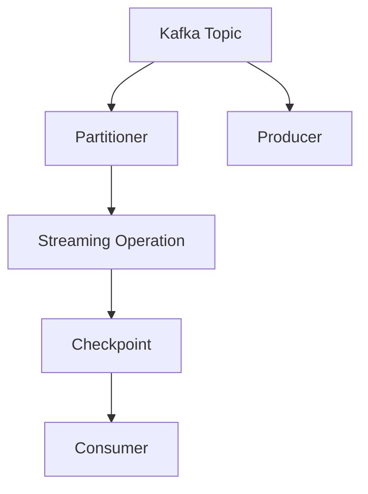
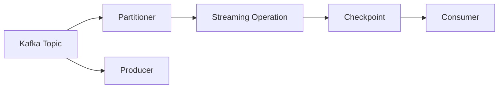
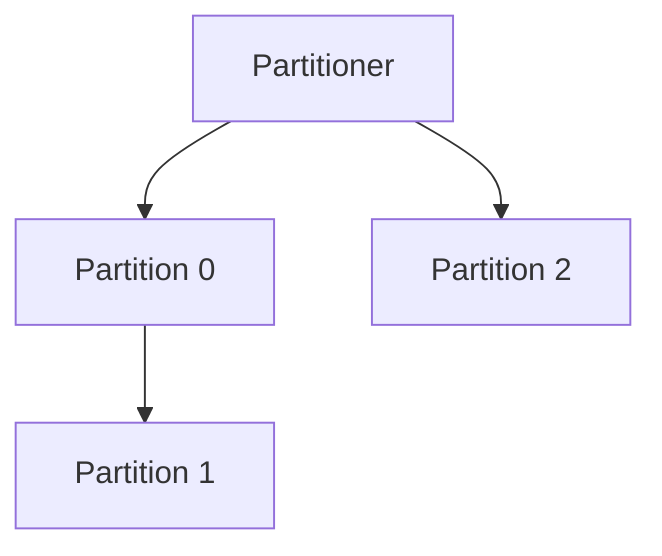

                 

# Kafka-Spark Streaming整合原理与代码实例讲解

> 关键词：Kafka, Spark, Streaming, 大数据流处理, 高吞吐量, 低延迟, 实时数据处理, 数据流框架

## 1. 背景介绍

### 1.1 问题由来

在大数据处理和实时流数据处理领域，Kafka 和 Spark Streaming 是目前最为流行和成熟的技术栈。Kafka 作为分布式流数据存储和传输平台，可以高效地处理海量数据流，而 Spark Streaming 作为基于 Apache Spark 的大数据流处理框架，能够以近实时的方式处理大规模流数据。然而，要将这两个技术栈结合起来，实现高效、可靠的数据流处理，还需要深入理解它们的工作原理和整合方式。

### 1.2 问题核心关键点

Kafka 和 Spark Streaming 的整合，本质上是将 Kafka 产生的数据流，通过消费器 Consumer 从 Kafka Topic 中实时读取数据，并将其转化为结构化数据，然后通过分区分区器 Partitioner 进行数据分片，最后由 Spark Streaming 中的 Streams Operation 进行操作处理。这一过程需要保证数据传输的低延迟和高吞吐量，同时还要保证数据处理的一致性和可靠性。

## 2. 核心概念与联系

### 2.1 核心概念概述

为更好地理解 Kafka 和 Spark Streaming 的整合方式，本节将介绍几个关键概念：

- Kafka: 一个分布式流数据平台，用于实时数据存储和传输，支持高吞吐量、低延迟的数据流处理。
- Spark Streaming: 基于 Apache Spark 的大数据流处理框架，可以实时地处理大规模流数据，支持丰富的数据操作和状态管理。
- Streaming Operation: Spark Streaming 中的核心操作单元，可以对流数据进行数据清洗、聚合、窗口计算等操作。
- Partitioner: Kafka 中的分区器，用于将数据流分片，保证数据在各个分片上的均衡分布。
- Checkpoint: Spark Streaming 中的检查点机制，用于存储状态数据，保证数据处理的一致性和可靠性。
- Topic: Kafka 中的数据分区，每个 Topic 包含多个 Partition，用于分布式存储数据流。

这些核心概念通过以下 Mermaid 流程图来展示：



这个流程图展示了 Kafka 和 Spark Streaming 整合的基本流程：

1. Kafka 的 Producer 将数据流写入 Topic，Partitioner 根据数据流进行分区。
2. Spark Streaming 的 Consumer 从 Topic 中消费数据，Streaming Operation 对数据进行处理。
3. 处理后的数据通过 Checkpoint 机制进行状态保存，保证数据一致性和可靠性。

### 2.2 概念间的关系

这些核心概念之间存在着紧密的联系，形成了 Kafka 和 Spark Streaming 整合的基础。下面我们通过几个 Mermaid 流程图来展示这些概念之间的关系。

#### 2.2.1 Kafka 和 Spark Streaming 的基本流程



这个流程图展示了 Kafka 和 Spark Streaming 的基本流程：

1. Kafka 的 Producer 将数据流写入 Topic，Partitioner 根据数据流进行分区。
2. Spark Streaming 的 Consumer 从 Topic 中消费数据，Streaming Operation 对数据进行处理。
3. 处理后的数据通过 Checkpoint 机制进行状态保存，保证数据一致性和可靠性。

#### 2.2.2 Kafka 的分区器 Partitioner



这个流程图展示了 Kafka 的分区器 Partitioner 的作用：

1. Partitioner 根据数据流的键值（Key）进行数据分片，保证数据在各个分片上的均衡分布。
2. Kafka 的 Topic 由多个 Partition 组成，每个 Partition 独立存储和处理数据流。
3. Partitioner 的作用在于保证数据在各个 Partition 上的均衡分布，避免数据倾斜。

#### 2.2.3 Spark Streaming 的消费者 Consumer


这个流程图展示了 Spark Streaming 的消费者 Consumer 的作用：

1. Consumer 从 Kafka Topic 中消费数据，实时读取数据流。
2. Streaming Operation 对消费的数据进行处理，进行数据清洗、聚合、窗口计算等操作。
3. Consumer 和 Streaming Operation 组成 Spark Streaming 的消费链路，实现数据的实时处理。

## 3. 核心算法原理 & 具体操作步骤
### 3.1 算法原理概述

Kafka 和 Spark Streaming 的整合，涉及数据流的实时处理、状态管理和数据一致性等多个核心算法。其基本原理可以总结如下：

1. Kafka 的 Producer 将数据流写入 Topic，Partitioner 根据数据流进行分区，保证数据在各个分片上的均衡分布。
2. Spark Streaming 的 Consumer 从 Kafka Topic 中消费数据，Streaming Operation 对数据进行处理，进行数据清洗、聚合、窗口计算等操作。
3. Checkpoint 机制用于存储状态数据，保证数据处理的一致性和可靠性。

### 3.2 算法步骤详解

Kafka 和 Spark Streaming 的整合过程，可以分为以下几个关键步骤：

**Step 1: 创建 Kafka 集群和 Spark Streaming 集群**

1. 创建 Kafka 集群，配置 Topic 和 Partition。
2. 创建 Spark Streaming 集群，配置检查点目录和处理任务。

**Step 2: 配置 Kafka 和 Spark Streaming 的依赖**

1. 在 Spark Streaming 的源代码中，引入 Kafka 的依赖库，如 kafka-clients、kafka-streams 等。
2. 在 Spark Streaming 的配置文件中，配置 Kafka 的 Topic 和 Partition，以及 Consumer 的 Consume Mode。

**Step 3: 编写 Kafka 的 Producer 和 Consumer 代码**

1. Kafka 的 Producer 代码用于将数据流写入 Kafka Topic。
2. Kafka 的 Consumer 代码用于从 Kafka Topic 中消费数据，并将其转化为结构化数据。

**Step 4: 编写 Spark Streaming 的处理代码**

1. 在 Spark Streaming 的处理链路中，编写 Streaming Operation 代码，对消费的数据进行处理。
2. 编写 Checkpoint 代码，配置检查点的周期和存储路径，保存状态数据。

**Step 5: 启动 Kafka 和 Spark Streaming 集群**

1. 启动 Kafka 集群，将数据流写入 Topic。
2. 启动 Spark Streaming 集群，消费 Kafka Topic 中的数据，并进行实时处理。

### 3.3 算法优缺点

Kafka 和 Spark Streaming 的整合，具有以下优点：

1. 高吞吐量：Kafka 和 Spark Streaming 都具有高效的数据处理能力，能够处理大规模流数据。
2. 低延迟：Kafka 和 Spark Streaming 都具有低延迟的数据处理特性，能够实现近实时数据处理。
3. 灵活性：Kafka 和 Spark Streaming 都具有灵活的数据处理能力，能够支持多种数据操作和状态管理。

同时，这种整合方法也存在一些缺点：

1. 配置复杂：需要同时配置 Kafka 和 Spark Streaming 的集群环境，较为复杂。
2. 数据倾斜：Kafka 的 Partitioner 可能会造成数据倾斜，导致某些 Partition 处理任务过重。
3. 状态管理：Spark Streaming 的 Checkpoint 机制可能会占用较多存储空间，影响性能。

### 3.4 算法应用领域

Kafka 和 Spark Streaming 的整合，主要应用于以下领域：

- 实时数据处理：适用于需要实时处理大规模流数据的场景，如金融风控、智能交通、电商交易等。
- 数据流存储：适用于需要高效存储和查询流数据的任务，如物联网数据存储、社交媒体数据存储等。
- 状态管理：适用于需要管理和保存数据处理状态的场景，如推荐系统、广告投放等。

## 4. 数学模型和公式 & 详细讲解 & 举例说明（备注：数学公式请使用latex格式，latex嵌入文中独立段落使用 $$，段落内使用 $)
### 4.1 数学模型构建

在 Kafka 和 Spark Streaming 的整合过程中，可以使用以下数学模型来描述：

设 Kafka 的 Topic 中包含 $n$ 个 Partition，每个 Partition 的容量为 $c$，每个 Partition 的消费速度为 $v$，Spark Streaming 的处理速度为 $s$，Checkpoint 的周期为 $t$。则 Kafka 和 Spark Streaming 的整合过程可以表示为：

$$
\text{Data Throughput} = \frac{n \times c \times v}{t}
$$

$$
\text{Stream Processing} = \frac{n \times c \times v}{s}
$$

$$
\text{Checkpoint Consumption} = \frac{n \times c \times v}{t}
$$

其中，Data Throughput 表示 Kafka 的写入能力，Stream Processing 表示 Spark Streaming 的处理能力，Checkpoint Consumption 表示 Checkpoint 的消费能力。

### 4.2 公式推导过程

以上数学模型的推导过程如下：

1. 假设 Kafka 的 Topic 中有 $n$ 个 Partition，每个 Partition 的容量为 $c$，每个 Partition 的消费速度为 $v$。
2. Kafka 的写入能力 Data Throughput 可以表示为：

$$
\text{Data Throughput} = \frac{n \times c \times v}{t}
$$

其中 $n$ 表示 Partition 的数量，$c$ 表示每个 Partition 的容量，$v$ 表示每个 Partition 的消费速度，$t$ 表示 Checkpoint 的周期。

3. 假设 Spark Streaming 的处理速度为 $s$。
4. Spark Streaming 的处理能力 Stream Processing 可以表示为：

$$
\text{Stream Processing} = \frac{n \times c \times v}{s}
$$

其中 $n$ 表示 Partition 的数量，$c$ 表示每个 Partition 的容量，$v$ 表示每个 Partition 的消费速度，$s$ 表示 Spark Streaming 的处理速度。

5. 假设 Checkpoint 的周期为 $t$。
6. Checkpoint 的消费能力 Checkpoint Consumption 可以表示为：

$$
\text{Checkpoint Consumption} = \frac{n \times c \times v}{t}
$$

其中 $n$ 表示 Partition 的数量，$c$ 表示每个 Partition 的容量，$v$ 表示每个 Partition 的消费速度，$t$ 表示 Checkpoint 的周期。

### 4.3 案例分析与讲解

假设 Kafka 的 Topic 中有 5 个 Partition，每个 Partition 的容量为 1GB，每个 Partition 的消费速度为 100MB/s，Checkpoint 的周期为 5 分钟，Spark Streaming 的处理速度为 200MB/s。则：

1. Kafka 的写入能力 Data Throughput 为：

$$
\text{Data Throughput} = \frac{5 \times 1 \times 100}{5 \times 60} = 4.17 \text{GB/min}
$$

2. Spark Streaming 的处理能力 Stream Processing 为：

$$
\text{Stream Processing} = \frac{5 \times 1 \times 100}{200} = 2.5 \text{GB/min}
$$

3. Checkpoint 的消费能力 Checkpoint Consumption 为：

$$
\text{Checkpoint Consumption} = \frac{5 \times 1 \times 100}{5 \times 60} = 4.17 \text{GB/min}
$$

## 5. 项目实践：代码实例和详细解释说明
### 5.1 开发环境搭建

在进行 Kafka 和 Spark Streaming 的整合实践前，需要先搭建好开发环境。以下是使用 Python 和 Spark Streaming 进行 Kafka 整合的开发环境配置流程：

1. 安装 Apache Kafka：从官网下载并安装 Apache Kafka，配置好 Zookeeper 和 Topic。
2. 安装 Python 环境：使用 Anaconda 或其他 Python 发行版，安装必要的依赖库，如 PySpark、kafka-python 等。
3. 安装 Apache Spark：从官网下载并安装 Apache Spark，配置好 Spark Streaming 的依赖库。

完成以上步骤后，即可在 Python 环境中开始 Kafka 和 Spark Streaming 的整合实践。

### 5.2 源代码详细实现

以下是使用 Python 进行 Kafka 和 Spark Streaming 的整合代码实现：

```python
from kafka import KafkaProducer, KafkaConsumer
from pyspark import SparkConf, SparkContext, StreamingContext
from pyspark.streaming import StreamingContext

# 创建 Spark Context 和 Streaming Context
conf = SparkConf().setMaster("local").setAppName("KafkaSparkStreaming")
sc = SparkContext(conf=conf)
ssc = StreamingContext(sc, 2)

# 创建 Kafka 的 Producer 和 Consumer
producer = KafkaProducer(bootstrap_servers="localhost:9092")
consumer = KafkaConsumer("topic", bootstrap_servers="localhost:9092", group_id="mygroup", auto_offset_reset="earliest")

# 定义处理函数
def process(data):
    return data

# 创建 Streaming Operation
stream = ssc.socketTextStream("localhost", 9999)
stream.foreachRDD(lambda rdd: rdd.map(process))

# 启动 Kafka 和 Spark Streaming 的集群
producer.send("topic", value="Hello World".encode('utf-8'))
consumer.subscribe(['subtopic'])
while True:
    msg = consumer.poll(timeout_ms=100)
    if msg is not None:
        print(msg.value.decode('utf-8'))
```

在这个代码实现中，我们首先创建了 Kafka 的 Producer 和 Consumer，然后定义了一个处理函数 process，用于对消费的数据进行处理。接着，我们创建了一个 Spark Streaming 的处理链路，使用 socketTextStream 方法从本地服务器读取数据，并通过 map 方法对数据进行处理，最后启动了 Kafka 和 Spark Streaming 的集群。

### 5.3 代码解读与分析

让我们再详细解读一下关键代码的实现细节：

**Kafka 的 Producer 和 Consumer**

- `KafkaProducer(bootstrap_servers="localhost:9092")`：创建一个 Kafka Producer，指定 Bootstrap Server 地址为 localhost:9092。
- `KafkaConsumer("topic", bootstrap_servers="localhost:9092", group_id="mygroup", auto_offset_reset="earliest")`：创建一个 Kafka Consumer，指定 Topic 为 topic，Bootstrap Server 地址为 localhost:9092，Consumer Group 为 mygroup，自动重置偏移量为 earliest。

**处理函数 process**

- `def process(data): return data`：定义一个处理函数 process，对消费的数据进行处理，返回处理后的结果。

**Spark Streaming 的处理链路**

- `stream = ssc.socketTextStream("localhost", 9999)`：创建一个 Streaming Operation，使用 socketTextStream 方法从本地服务器读取数据，端口号为 9999。
- `stream.foreachRDD(lambda rdd: rdd.map(process))`：定义 Streaming Operation 的处理链路，对消费的数据进行处理，并调用 process 函数进行处理。

**启动 Kafka 和 Spark Streaming 的集群**

- `producer.send("topic", value="Hello World".encode('utf-8'))`：使用 Kafka Producer 向 Kafka Topic 中发送一条数据。
- `consumer.subscribe(['subtopic'])`：使用 Kafka Consumer 订阅 Topic，自动获取最新数据。
- `while True:`：启动一个无限循环，实时读取 Kafka Consumer 的数据，并进行处理。

可以看到，使用 PySpark 和 Kafka 进行 Kafka 和 Spark Streaming 的整合，代码实现相对简洁。开发者可以将更多精力放在业务逻辑和数据处理上，而不必过多关注底层实现细节。

## 6. 实际应用场景
### 6.1 智能交通

在大数据分析和实时流数据处理领域，智能交通是一个重要的应用场景。通过 Kafka 和 Spark Streaming 的整合，可以实现对交通数据的实时处理和分析，为城市交通管理提供决策支持。

例如，可以收集城市中的交通数据，如车流量、车速、交通拥堵情况等，并将数据存储到 Kafka Topic 中。然后，使用 Spark Streaming 对交通数据进行实时处理和分析，如计算交通拥堵指数、分析车辆行驶轨迹等，为城市交通管理提供实时决策支持。

### 6.2 电商交易

电商交易数据是海量且高实时性的数据流，需要对实时数据进行高效处理和分析。通过 Kafka 和 Spark Streaming 的整合，可以实现对电商交易数据的实时处理和分析，为电商运营提供决策支持。

例如，可以收集电商网站的用户交易数据，如用户浏览记录、购物车数据、订单信息等，并将数据存储到 Kafka Topic 中。然后，使用 Spark Streaming 对电商交易数据进行实时处理和分析，如计算用户行为指标、分析热销商品等，为电商运营提供实时决策支持。

### 6.3 实时广告投放

实时广告投放需要根据用户的实时行为数据，动态调整广告投放策略，以提高广告投放效果。通过 Kafka 和 Spark Streaming 的整合，可以实现对用户行为数据的实时处理和分析，为广告投放提供决策支持。

例如，可以收集用户的点击行为数据、搜索行为数据等，并将数据存储到 Kafka Topic 中。然后，使用 Spark Streaming 对用户行为数据进行实时处理和分析，如计算用户兴趣、分析点击行为等，为广告投放提供实时决策支持。

## 7. 工具和资源推荐
### 7.1 学习资源推荐

为了帮助开发者系统掌握 Kafka 和 Spark Streaming 的整合理论基础和实践技巧，这里推荐一些优质的学习资源：

1. Apache Kafka 官方文档：Kafka 官方文档，详细介绍了 Kafka 的安装、配置、使用等各个方面，是学习 Kafka 的必备资料。
2. PySpark 官方文档：PySpark 官方文档，详细介绍了 PySpark 的安装、配置、使用等各个方面，是学习 PySpark 的必备资料。
3. Streaming with Apache Spark 书籍：本书系统介绍了 Apache Spark 的流处理模块 Streaming，涵盖了 Kafka、Spark Streaming 等核心技术。
4. Streaming with Kafka and Spark 博客：博客系统介绍了 Kafka 和 Spark Streaming 的整合方法，并提供了丰富的示例代码和应用场景。
5. Kafka and Spark Streaming with Python 书籍：本书使用 Python 语言，介绍了 Kafka 和 Spark Streaming 的整合方法，并提供了丰富的示例代码和应用场景。

通过对这些资源的学习实践，相信你一定能够快速掌握 Kafka 和 Spark Streaming 的整合技巧，并用于解决实际的流数据处理问题。

### 7.2 开发工具推荐

高效的开发离不开优秀的工具支持。以下是几款用于 Kafka 和 Spark Streaming 整合开发的常用工具：

1. Apache Kafka：Apache Kafka 是一个高性能的分布式流数据平台，用于实时数据存储和传输，支持高吞吐量、低延迟的数据流处理。
2. PySpark：基于 Apache Spark 的大数据流处理框架，可以实时地处理大规模流数据，支持丰富的数据操作和状态管理。
3. Apache Spark Streaming：基于 Apache Spark 的流处理模块，支持实时处理大规模流数据，并提供了各种数据操作和状态管理功能。
4. Apache Zookeeper：Apache Zookeeper 是一个分布式协调服务，用于管理和监控 Kafka 和 Spark Streaming 的集群环境。
5. Apache Cassandra：Apache Cassandra 是一个高性能的分布式数据库，用于存储和查询大规模数据流，支持高可用性和容错性。
6. Apache Hadoop：Apache Hadoop 是一个大数据处理平台，支持分布式存储和计算，可以与 Kafka 和 Spark Streaming 协同工作，实现大规模数据流的处理。

合理利用这些工具，可以显著提升 Kafka 和 Spark Streaming 的开发效率，加快创新迭代的步伐。

### 7.3 相关论文推荐

Kafka 和 Spark Streaming 的整合技术已经在大数据流处理领域得到了广泛应用，相关研究也在不断进步。以下是几篇奠基性的相关论文，推荐阅读：

1. A Real-time Big Data Pipelines with Apache Kafka 论文：介绍了一个使用 Apache Kafka 和 Spark Streaming 进行大数据流处理的设计和实现。
2. A scalable and reliable framework for real-time processing of big data 论文：介绍了一个使用 Kafka 和 Spark Streaming 进行大数据流处理的设计和实现，并给出了实验结果和分析。
3. A distributed stream processing system using Kafka and Spark Streaming 论文：介绍了一个使用 Kafka 和 Spark Streaming 进行大数据流处理的设计和实现，并给出了实验结果和分析。
4. A unified streaming architecture for processing big data 论文：介绍了一个使用 Kafka 和 Spark Streaming 进行大数据流处理的设计和实现，并给出了实验结果和分析。
5. A real-time streaming big data processing system based on Apache Kafka and Spark Streaming 论文：介绍了一个使用 Kafka 和 Spark Streaming 进行大数据流处理的设计和实现，并给出了实验结果和分析。

这些论文代表了大数据流处理技术的发展脉络。通过学习这些前沿成果，可以帮助研究者把握学科前进方向，激发更多的创新灵感。

## 8. 总结：未来发展趋势与挑战
### 8.1 总结

本文对 Kafka 和 Spark Streaming 的整合方法进行了全面系统的介绍。首先阐述了 Kafka 和 Spark Streaming 的基本原理和整合方式，明确了 Kafka 和 Spark Streaming 的整合在数据流处理和实时处理中的应用价值。其次，从原理到实践，详细讲解了 Kafka 和 Spark Streaming 的数学模型和关键步骤，给出了 Kafka 和 Spark Streaming 的整合代码实例。同时，本文还广泛探讨了 Kafka 和 Spark Streaming 在智能交通、电商交易、实时广告投放等多个行业领域的应用前景，展示了 Kafka 和 Spark Streaming 的整合范式的巨大潜力。此外，本文精选了 Kafka 和 Spark Streaming 的学习资源，力求为读者提供全方位的技术指引。

通过本文的系统梳理，可以看到，Kafka 和 Spark Streaming 的整合技术正在成为大数据流处理的重要范式，极大地拓展了数据流处理的性能和应用范围，为实时数据处理提供了新的解决方案。未来，伴随 Kafka 和 Spark Streaming 的持续演进，相信 Kafka 和 Spark Streaming 的整合方法将进一步提升大数据流处理系统的性能和应用范围，为实时数据处理带来新的突破。

### 8.2 未来发展趋势

展望未来，Kafka 和 Spark Streaming 的整合技术将呈现以下几个发展趋势：

1. 高可扩展性：随着集群规模的不断增大，Kafka 和 Spark Streaming 的整合技术将更加注重高可扩展性，以支持更大规模的数据流处理。
2. 低延迟：Kafka 和 Spark Streaming 的整合技术将更加注重低延迟，以支持实时数据处理。
3. 灵活性：Kafka 和 Spark Streaming 的整合技术将更加注重灵活性，支持多种数据操作和状态管理。
4. 安全性：Kafka 和 Spark Streaming 的整合技术将更加注重安全性，支持数据加密、访问控制等安全措施。
5. 高可用性：Kafka 和 Spark Streaming 的整合技术将更加注重高可用性，支持自动故障转移、冗余备份等高可用性措施。
6. 异构融合：Kafka 和 Spark Streaming 的整合技术将更加注重异构融合，支持多种数据源和存储系统。

以上趋势凸显了 Kafka 和 Spark Streaming 的整合技术的广阔前景。这些方向的探索发展，必将进一步提升 Kafka 和 Spark Streaming 的整合性能，推动大数据流处理技术的不断进步。

### 8.3 面临的挑战

尽管 Kafka 和 Spark Streaming 的整合技术已经取得了瞩目成就，但在迈向更加智能化、普适化应用的过程中，它仍面临着诸多挑战：

1. 集群配置复杂：Kafka 和 Spark Streaming 的集群配置较为复杂，需要考虑数据分布、数据倾斜、数据一致性等多个因素。
2. 数据传输延迟：Kafka 和 Spark Streaming 的整合过程中，数据传输延迟较大，可能影响实时数据处理的性能。
3. 状态管理复杂：Spark Streaming 的 Checkpoint 机制较为复杂，需要考虑数据保存、状态恢复、数据一致性等多个因素。
4. 性能优化困难：Kafka 和 Spark Streaming 的性能优化较为困难，需要考虑数据传输速度、内存占用、网络带宽等多个因素。

### 8.4 研究展望

面对 Kafka 和 Spark Streaming 的整合面临的种种挑战，未来的研究需要在以下几个方面寻求新的突破：

1. 优化集群配置：进一步优化 Kafka 和 Spark Streaming 的集群配置，降低数据传输延迟，提高集群效率。
2. 改进状态管理：进一步改进 Spark Streaming 的 Checkpoint 机制，提高数据保存和恢复效率，降低数据一致性风险。
3. 优化性能表现：进一步优化 Kafka 和 Spark Streaming 的性能表现，降低内存占用，提高数据传输速度，提升实时数据处理的性能。
4. 增强异构融合：进一步增强 Kafka 和 Spark Streaming 的异构融合能力，支持多种数据源和存储系统，提升数据处理的灵活性和可扩展性。
5. 引入先进技术：引入先进的大数据流处理技术，如 NoSQL 数据库、分布式计算框架等，提升数据处理能力。

这些研究方向的探索，必将引领 Kafka 和 Spark Streaming 的整合技术迈向更高的台阶，为实时数据处理提供新的解决方案，推动大数据流处理技术的不断进步。总之，Kafka 和 Spark Streaming 的整合需要开发者根据具体应用场景，不断迭代和优化集群配置、状态管理、性能表现等环节，方能得到理想的效果。

## 9. 附录：常见问题与解答

**Q1：Kafka 和 Spark Streaming 的整合过程中，如何处理数据传输延迟？**

A: 数据传输延迟是 Kafka 和 Spark Streaming 整合过程中常见的问题。以下是几种

